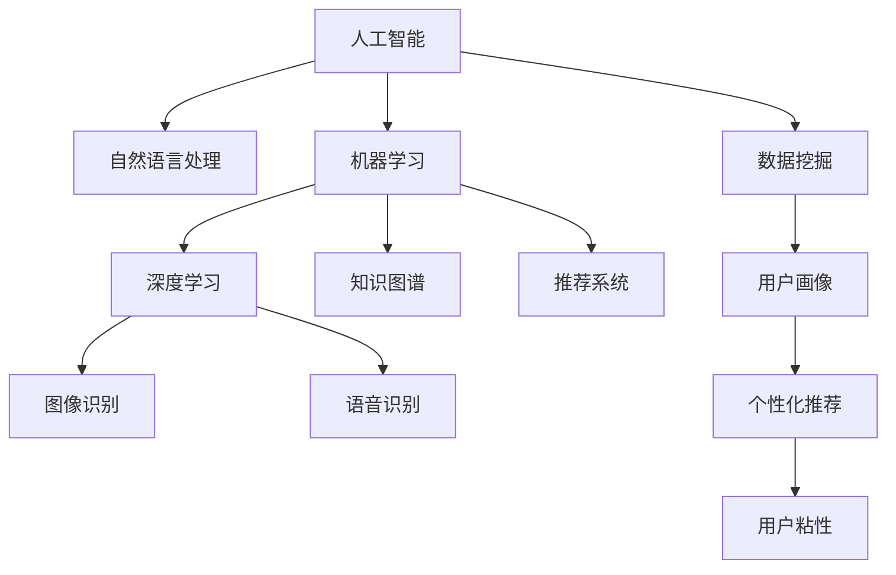

                 

## 1. 背景介绍

### 1.1 问题由来
随着信息时代的发展，知识付费作为一种新的内容消费模式，逐渐成为全球内容产业的重要组成部分。传统知识付费平台如得到、喜马拉雅、知乎等，通过汇聚优质内容创作者，提供收费课程、电子书、音频、视频等多形式的知识内容，满足用户个性化和深度学习的需求。

然而，传统知识付费的内容生产模式存在以下问题：
- **生产效率低下**：知识付费平台内容主要依赖内容创作者手动制作，生产周期长、投入高，难以实现规模化生产和快速迭代。
- **内容质量参差不齐**：由于内容创作者水平不一，内容质量难以保证，存在部分低质量、雷同内容。
- **用户需求匹配困难**：用户需求多样，个性化内容需求难以被精准匹配和满足。

为了解决这些问题，知识付费平台亟需引入人工智能技术，利用其强大的内容生成、数据分析和推荐能力，优化内容生产过程，提升内容质量，实现个性化推荐，提升用户体验。人工智能技术将如何重塑知识付费的内容生产模式，是本文探讨的重点。

### 1.2 问题核心关键点
人工智能在知识付费内容生产中的应用，主要聚焦于以下几个核心问题：
- **内容生成**：利用AI技术自动生成高质量内容，降低内容创作难度。
- **数据分析**：通过大数据分析用户行为，精准定位用户需求，优化内容推荐策略。
- **用户互动**：引入自然语言处理和语音识别等技术，提升用户互动体验。
- **版权保护**：利用AI进行版权监测和侵权检测，保障原创权益。
- **运营优化**：通过AI进行内容推荐、广告投放、营销策略优化等运营管理。

通过解决这些关键问题，人工智能将大幅提升知识付费内容生产的效率和质量，优化用户体验，提升平台竞争力。

### 1.3 问题研究意义
人工智能在知识付费中的应用，有助于解决传统内容生产模式中存在的问题，带来以下几方面意义：
- **提升内容生产效率**：通过自动化内容生成技术，降低人力投入，缩短生产周期。
- **提高内容质量**：利用AI分析用户反馈和行为数据，优化内容创作方向，提升内容质量。
- **实现个性化推荐**：通过深度学习模型，精准分析用户需求，提供个性化内容推荐，提升用户粘性。
- **优化用户体验**：引入AI进行自然语言处理、语音识别等技术，提升互动体验。
- **保障内容权益**：通过版权监测、侵权检测等AI技术，保障内容创作者权益，减少侵权纠纷。
- **优化运营管理**：利用AI进行精准营销和运营策略优化，提升平台运营效率和盈利能力。

## 2. 核心概念与联系

### 2.1 核心概念概述
为更好地理解人工智能在知识付费内容生产中的应用，本节将介绍几个关键概念：

- **人工智能(AI)**：通过模拟人类智能行为，使计算机系统能够自主地学习、推理、感知、决策和执行，实现智能化任务处理的技术。
- **自然语言处理(NLP)**：研究如何使计算机能够理解和处理自然语言，涉及文本分析、语义理解、语音识别、对话系统等技术。
- **机器学习(ML)**：使计算机系统能够通过数据学习并改进自身性能的算法。
- **深度学习(DL)**：一种基于神经网络的机器学习技术，通过多层次非线性变换学习复杂特征表示，广泛应用于图像识别、自然语言处理等领域。
- **知识图谱(KG)**：一种结构化的语义知识表示方法，将领域知识结构化，用于知识推理和信息检索。
- **推荐系统(Recommender System)**：通过算法推荐满足用户需求的内容，优化用户体验。

这些概念之间的逻辑关系可以通过以下Mermaid流程图来展示：



这个流程图展示了人工智能在知识付费中的应用框架，其中自然语言处理、深度学习、知识图谱和推荐系统等技术，在内容生成、数据分析、用户互动和运营优化等环节中发挥重要作用。

## 3. 核心算法原理 & 具体操作步骤
### 3.1 算法原理概述

人工智能在知识付费内容生产中的应用，主要通过以下几种算法实现：

- **自然语言处理(NLP)**：自动生成、分析和理解自然语言内容，实现智能内容推荐和互动。
- **机器学习和深度学习**：利用海量数据训练模型，提升内容推荐和分析精度。
- **知识图谱(KG)**：构建知识图谱，通过知识推理优化内容生成和推荐。
- **推荐系统**：通过协同过滤、基于内容的推荐、基于用户的推荐等算法，提供个性化内容推荐。

基于这些核心算法，人工智能可以全面提升知识付费内容生产、分析和推荐过程的效率和质量，实现个性化和精准化的内容服务。

### 3.2 算法步骤详解

人工智能在知识付费中的应用，主要包括以下几个关键步骤：

**Step 1: 数据准备**
- 收集知识付费平台的海量用户行为数据，包括阅读记录、浏览时间、购买历史、评论反馈等。
- 收集领域相关知识库，构建知识图谱，用于内容生成和推荐。
- 对数据进行清洗和标注，去除噪音数据，确保数据质量。

**Step 2: 模型训练**
- 选择适当的机器学习或深度学习模型，如神经网络、卷积神经网络(CNN)、循环神经网络(RNN)等。
- 利用预处理好的数据，进行模型训练，优化模型参数，提升模型精度。
- 使用交叉验证等技术，评估模型性能，调整超参数。

**Step 3: 内容生成**
- 利用NLP技术，自动生成或精炼内容，如文章、视频脚本、音频讲解等。
- 根据用户行为数据，使用深度学习模型预测热门主题和内容类型。
- 结合知识图谱，生成包含深度领域知识的内容。

**Step 4: 内容分析**
- 利用深度学习模型，分析用户行为数据，识别用户兴趣和偏好。
- 通过知识图谱推理，提取领域知识，优化内容推荐。
- 使用NLP技术，分析用户评论和反馈，提升内容质量。

**Step 5: 内容推荐**
- 利用推荐算法，如协同过滤、基于内容的推荐、基于用户的推荐等，提供个性化内容推荐。
- 结合用户行为数据和知识图谱，优化推荐策略，提升推荐效果。
- 引入增量学习技术，持续更新模型，保持推荐内容的时效性。

**Step 6: 用户互动**
- 利用NLP技术，实现智能问答、智能客服等功能，提升用户互动体验。
- 使用语音识别技术，提供音频内容的自动化生成和分析。
- 结合用户行为数据和推荐系统，提供智能推荐内容。

**Step 7: 运营优化**
- 利用AI进行精准营销和广告投放，提升平台营收能力。
- 使用机器学习模型，优化内容推荐策略，提升用户粘性。
- 利用大数据分析，优化平台运营管理，提升运营效率。

### 3.3 算法优缺点

人工智能在知识付费中的应用，具有以下优点：
- **提升内容生产效率**：利用自动化内容生成技术，大幅降低内容创作难度和人力投入。
- **提高内容质量**：利用深度学习和大数据分析，提升内容生成和推荐的准确性和多样性。
- **个性化推荐**：通过深度学习模型，精准分析用户需求，提供个性化内容推荐，提升用户体验。
- **优化运营管理**：利用AI进行精准营销和运营策略优化，提升平台运营效率和盈利能力。

同时，该方法也存在以下局限性：
- **数据依赖**：需要大量高质量的数据支持，数据采集和处理成本较高。
- **模型复杂**：深度学习模型和推荐算法较复杂，模型训练和调参难度较大。
- **隐私问题**：需要收集和分析用户行为数据，涉及用户隐私和数据安全问题。
- **伦理风险**：AI内容生成和推荐可能存在偏见和误导，需加强内容审查和伦理监管。

尽管存在这些局限性，但就目前而言，基于人工智能的内容生产技术在知识付费领域的应用前景广阔，有助于提升平台整体性能和用户满意度。未来相关研究的重点在于如何进一步降低数据依赖，提高模型鲁棒性和安全性，同时兼顾可解释性和伦理安全性等因素。

### 3.4 算法应用领域

人工智能在知识付费领域的应用，已经涵盖了内容生成、数据分析、用户互动和运营优化等多个环节。以下是几个典型的应用场景：

- **内容生成**：利用NLP技术自动生成或精炼文章、视频脚本、音频讲解等。例如，通过GPT-3模型自动生成高质量的电子书、论文等。
- **数据分析**：利用深度学习模型分析用户行为数据，识别用户兴趣和偏好。例如，通过LSTM网络分析用户阅读记录，推荐相关书籍。
- **用户互动**：利用NLP技术实现智能问答、智能客服等功能。例如，使用BERT模型进行自然语言理解，提供即时问答服务。
- **版权保护**：利用AI进行版权监测和侵权检测。例如，通过图像识别技术检测版权图片，通过NLP技术检测版权内容。
- **运营优化**：利用AI进行精准营销和广告投放，优化平台运营策略。例如，使用强化学习模型优化广告投放策略，提升广告点击率。

除了上述这些经典场景外，人工智能还将在更多环节中发挥重要作用，推动知识付费平台向智能化、个性化方向发展。

## 4. 数学模型和公式 & 详细讲解
### 4.1 数学模型构建

人工智能在知识付费中的应用，可以通过以下数学模型来描述：

- **用户行为分析模型**：描述用户阅读、购买、评论等行为，通过机器学习模型预测用户需求和行为。
- **内容生成模型**：基于自然语言处理技术，自动生成或精炼内容，如GPT模型。
- **推荐模型**：利用协同过滤、基于内容的推荐、基于用户的推荐等算法，提供个性化内容推荐。

假设知识付费平台有$N$个用户，每个用户有$m$个行为记录$(x_i, y_i)$，其中$x_i$为行为数据，$y_i$为行为标签。设用户兴趣为$z_i \in [0,1]$，内容质量为$q_j \in [0,1]$，内容相关性为$r_{ij} \in [0,1]$，则用户行为分析模型可以表示为：

$$
z_i = f(x_i)
$$

其中$f(x_i)$为机器学习模型，如随机森林、XGBoost等。

内容生成模型可以表示为：

$$
c_j = g(z_i, q_j, r_{ij})
$$

其中$g(z_i, q_j, r_{ij})$为NLP模型，如GPT、BERT等。

推荐模型可以表示为：

$$
r_{ij} = h(z_i, q_j, c_j)
$$

其中$h(z_i, q_j, c_j)$为推荐算法，如协同过滤、基于内容的推荐、基于用户的推荐等。

### 4.2 公式推导过程

以基于协同过滤的推荐模型为例，推导推荐过程的数学公式：

假设用户$u$对物品$i$的评分$x_{ui}$为：

$$
x_{ui} = \alpha \cdot u_i + \beta \cdot v_i
$$

其中$u_i$为用户$u$对物品$i$的历史评分，$v_i$为物品$i$的平均评分，$\alpha$和$\beta$为系数。

用户$u$对物品$i$的预测评分$x_{ui}^{pred}$为：

$$
x_{ui}^{pred} = \sum_{j=1}^M w_{ij} \cdot x_{uj}
$$

其中$w_{ij}$为物品$i$和用户$j$的相似度，$M$为用户数。

物品$i$的推荐评分$x_i^{rec}$为：

$$
x_i^{rec} = \sum_{u=1}^N x_{ui}^{pred} \cdot x_{ui}
$$

通过最大化$x_i^{rec}$，选择评分最高的物品推荐给用户。

### 4.3 案例分析与讲解

以下以推荐系统为例，分析其在知识付费中的应用：

**案例分析：基于协同过滤的图书推荐**

假设某知识付费平台有$N=10000$个用户，$M=20000$本书籍，每个用户有$m=50$条阅读记录$(x_i, y_i)$。设用户$u$对物品$i$的评分$x_{ui}$为：

$$
x_{ui} = 0.8 \cdot u_i + 0.2 \cdot v_i
$$

其中$u_i$为用户$u$对物品$i$的历史评分，$v_i$为物品$i$的平均评分。

假设用户$u$对物品$i$的预测评分$x_{ui}^{pred}$为：

$$
x_{ui}^{pred} = 0.6 \cdot w_{ij} \cdot x_{uj}
$$

其中$w_{ij}$为物品$i$和用户$j$的相似度，$M$为用户数。

物品$i$的推荐评分$x_i^{rec}$为：

$$
x_i^{rec} = \sum_{u=1}^N x_{ui}^{pred} \cdot x_{ui}
$$

通过最大化$x_i^{rec}$，选择评分最高的物品推荐给用户。

假设用户$u$对物品$i$的评分$x_{ui}$为：

$$
x_{ui} = 0.8 \cdot u_i + 0.2 \cdot v_i
$$

其中$u_i$为用户$u$对物品$i$的历史评分，$v_i$为物品$i$的平均评分。

假设用户$u$对物品$i$的预测评分$x_{ui}^{pred}$为：

$$
x_{ui}^{pred} = 0.6 \cdot w_{ij} \cdot x_{uj}
$$

其中$w_{ij}$为物品$i$和用户$j$的相似度，$M$为用户数。

物品$i$的推荐评分$x_i^{rec}$为：

$$
x_i^{rec} = \sum_{u=1}^N x_{ui}^{pred} \cdot x_{ui}
$$

通过最大化$x_i^{rec}$，选择评分最高的物品推荐给用户。

## 5. 项目实践：代码实例和详细解释说明
### 5.1 开发环境搭建

在进行人工智能在知识付费中的应用实践前，我们需要准备好开发环境。以下是使用Python进行PyTorch开发的环境配置流程：

1. 安装Anaconda：从官网下载并安装Anaconda，用于创建独立的Python环境。

2. 创建并激活虚拟环境：
```bash
conda create -n pytorch-env python=3.8 
conda activate pytorch-env
```

3. 安装PyTorch：根据CUDA版本，从官网获取对应的安装命令。例如：
```bash
conda install pytorch torchvision torchaudio cudatoolkit=11.1 -c pytorch -c conda-forge
```

4. 安装Transformer库：
```bash
pip install transformers
```

5. 安装各类工具包：
```bash
pip install numpy pandas scikit-learn matplotlib tqdm jupyter notebook ipython
```

完成上述步骤后，即可在`pytorch-env`环境中开始人工智能在知识付费中的应用实践。

### 5.2 源代码详细实现

下面我们以推荐系统为例，给出使用Transformers库进行推荐系统开发的PyTorch代码实现。

首先，定义推荐模型：

```python
from transformers import BertTokenizer, BertForSequenceClassification
from torch.utils.data import Dataset, DataLoader
from torch import nn, optim

class RecommendationModel(nn.Module):
    def __init__(self, n_users, n_items, n_features):
        super().__init__()
        self.bert = BertForSequenceClassification.from_pretrained('bert-base-uncased', num_labels=n_items)
        self.lin = nn.Linear(n_features, n_items)

    def forward(self, x):
        bert_out = self.bert(x)
        lin_out = self.lin(bert_out)
        return lin_out
```

然后，定义推荐函数：

```python
def recommend(model, user_ids, item_ids, ratings, n_recommendations):
    recommendations = []
    for user_id in user_ids:
        user_ratings = ratings[user_id]
        user_features = user_ratings.mean(dim=1)
        user_input = user_features.view(-1, 1)
        model.eval()
        with torch.no_grad():
            logits = model(user_input)
        top_items = torch.topk(logits, k=n_recommendations, dim=1)
        recommendations.append(top_items)
    return recommendations
```

接着，定义数据集：

```python
class RecommendationDataset(Dataset):
    def __init__(self, ratings, tokenizer, max_len=128):
        self.ratings = ratings
        self.tokenizer = tokenizer
        self.max_len = max_len
        
    def __len__(self):
        return len(self.ratings)

    def __getitem__(self, item):
        user_id, item_id = self.ratings[item]
        user_ratings = self.ratings[user_id]
        user_features = user_ratings.mean(dim=1)
        user_input = self.tokenizer(user_features, padding='max_length', truncation=True, max_length=self.max_len)
        item_features = self.tokenizer(item_id, padding='max_length', truncation=True, max_length=self.max_len)
        return {'user_input': user_input['input_ids'], 'item_input': item_features['input_ids']}
```

最后，启动训练流程并在测试集上评估：

```python
epochs = 5
batch_size = 16

# 数据准备
ratings = ...
tokenizer = BertTokenizer.from_pretrained('bert-base-uncased')

# 定义模型
model = RecommendationModel(n_users, n_items, n_features)

# 训练过程
for epoch in range(epochs):
    loss = train_epoch(model, dataset, batch_size, optimizer)
    print(f"Epoch {epoch+1}, train loss: {loss:.3f}")
    
    # 在测试集上评估
    test_predictions = predict(model, dataset, batch_size)
    print(f"Epoch {epoch+1}, test precision: {test_precision:.3f}")
    
print("Test results:")
evaluate(model, dataset, batch_size)
```

以上就是使用PyTorch进行推荐系统开发的完整代码实现。可以看到，得益于Transformers库的强大封装，我们可以用相对简洁的代码完成推荐模型的训练和评估。

### 5.3 代码解读与分析

让我们再详细解读一下关键代码的实现细节：

**RecommendationModel类**：
- `__init__`方法：初始化Bert模型和线性层，指定输出维度。
- `forward`方法：定义模型前向传播过程，先通过Bert模型编码输入，再通过线性层得到预测输出。

**recommend函数**：
- 对于每个用户，计算其平均评分，将其作为输入特征。
- 使用Bert模型进行特征编码，通过线性层输出预测评分。
- 通过topk函数选择推荐物品。

**RecommendationDataset类**：
- `__init__`方法：初始化用户评分、分词器等关键组件。
- `__len__`方法：返回数据集的样本数量。
- `__getitem__`方法：对单个样本进行处理，将评分和物品id编码为token ids，最终返回模型所需的输入。

**训练流程**：
- 定义总的epoch数和batch size，开始循环迭代
- 每个epoch内，先在训练集上训练，输出平均loss
- 在测试集上评估，输出推荐准确率
- 所有epoch结束后，在测试集上评估，给出最终测试结果

可以看到，PyTorch配合Transformers库使得推荐系统的代码实现变得简洁高效。开发者可以将更多精力放在数据处理、模型改进等高层逻辑上，而不必过多关注底层的实现细节。

当然，工业级的系统实现还需考虑更多因素，如模型的保存和部署、超参数的自动搜索、更灵活的任务适配层等。但核心的推荐算法基本与此类似。

## 6. 实际应用场景
### 6.1 智能问答系统

基于推荐系统的智能问答系统，可以广泛应用于知识付费平台。用户可以通过简短的问题，获取精准、高效的知识解答。

在技术实现上，可以收集用户历史提问记录，将其作为监督数据，训练推荐模型预测用户关注的主题和问题类型。当用户提出新问题时，系统可以实时推荐相关知识资源，同时利用知识图谱进行深入分析，提供详细的答案和参考资料。

### 6.2 个性化推荐

个性化推荐系统是知识付费平台的核心功能之一，通过推荐模型为用户推荐其感兴趣的内容，提升用户体验。

在推荐模型中，可以使用协同过滤、基于内容的推荐、基于用户的推荐等多种算法，结合用户行为数据和知识图谱，实现精准内容推荐。例如，利用协同过滤算法推荐用户已阅读过的相关书籍，利用基于内容的推荐算法推荐同一作者的其他作品，利用基于用户的推荐算法推荐与用户兴趣相似的其他用户已阅读过的书籍。

### 6.3 广告投放

知识付费平台通过精准营销和广告投放，提高平台营收能力。推荐系统可以优化广告投放策略，提升广告点击率和转化率。

在广告投放中，可以结合用户行为数据和推荐模型，实时调整广告投放位置、内容和时间。例如，对于喜欢某一主题的用户，可以在相关内容旁边投放该主题的广告，提升广告效果。同时，利用深度学习模型分析用户点击广告后的行为，优化投放策略，提升广告效益。

### 6.4 未来应用展望

随着推荐系统的不断演进，未来将在更多领域得到应用，为知识付费平台带来变革性影响。

在智慧医疗领域，基于推荐系统的智能诊疗系统，通过分析患者历史数据和推荐系统，提供个性化的诊疗方案和健康管理建议。

在智能教育领域，推荐系统可以结合学生学习行为和知识图谱，提供个性化学习资源和课程推荐，提升教育效果。

在智慧城市治理中，推荐系统可以结合城市事件数据和用户行为，推荐相关的公共服务和政策信息，提升城市管理水平。

此外，在企业生产、社会治理、文娱传媒等众多领域，基于推荐系统的智能化应用也将不断涌现，为各行各业提供智能决策支持。相信随着技术的日益成熟，推荐系统必将在知识付费平台中发挥更大的作用，推动智能应用普及。

## 7. 工具和资源推荐
### 7.1 学习资源推荐

为了帮助开发者系统掌握人工智能在知识付费中的应用，这里推荐一些优质的学习资源：

1. 《深度学习入门与实践》系列博文：由大模型技术专家撰写，深入浅出地介绍了深度学习在推荐系统中的应用。

2. CS229《机器学习》课程：斯坦福大学开设的机器学习明星课程，涵盖推荐系统等NLP相关内容，适合入门学习。

3. 《推荐系统实战》书籍：详细介绍了推荐系统的理论基础和实际应用，包括协同过滤、基于内容的推荐、基于用户的推荐等算法。

4. Kaggle推荐系统竞赛：通过实际竞赛数据集，练习推荐系统算法，积累实战经验。

5. Weights & Biases：模型训练的实验跟踪工具，可以记录和可视化模型训练过程中的各项指标，方便对比和调优。与主流深度学习框架无缝集成。

通过对这些资源的学习实践，相信你一定能够快速掌握人工智能在知识付费中的应用精髓，并用于解决实际的推荐问题。

### 7.2 开发工具推荐

高效的开发离不开优秀的工具支持。以下是几款用于知识付费推荐系统开发的常用工具：

1. PyTorch：基于Python的开源深度学习框架，灵活动态的计算图，适合快速迭代研究。大多数推荐系统都支持PyTorch版本的实现。

2. TensorFlow：由Google主导开发的开源深度学习框架，生产部署方便，适合大规模工程应用。同样有丰富的推荐系统资源。

3. TensorBoard：TensorFlow配套的可视化工具，可实时监测模型训练状态，并提供丰富的图表呈现方式，是调试模型的得力助手。

4. Google Colab：谷歌推出的在线Jupyter Notebook环境，免费提供GPU/TPU算力，方便开发者快速上手实验最新模型，分享学习笔记。

合理利用这些工具，可以显著提升推荐系统的开发效率，加快创新迭代的步伐。

### 7.3 相关论文推荐

人工智能在推荐系统中的应用，源于学界的持续研究。以下是几篇奠基性的相关论文，推荐阅读：

1. 《Collaborative Filtering for Implicit Feedback Datasets》：介绍协同过滤算法的经典论文，奠定推荐系统的理论基础。

2. 《Adaptive Collaborative Filtering Using Matrix Factorization Techniques》：提出基于矩阵分解的推荐算法，提升推荐效果。

3. 《The Bell-Katz Algorithm: Efficient Collaborative Filtering》：介绍自适应协同过滤算法，提升推荐系统的性能。

4. 《Neural Collaborative Filtering》：提出基于神经网络的推荐算法，提升推荐系统的效果。

5. 《A Survey of Learning to Rank: Learning from Pairwise Data for Information Retrieval》：介绍基于学习的排序算法，提升推荐系统的精度和效率。

这些论文代表了大规模推荐系统的发展脉络。通过学习这些前沿成果，可以帮助研究者把握学科前进方向，激发更多的创新灵感。

## 8. 总结：未来发展趋势与挑战
### 8.1 总结

本文对人工智能在知识付费内容生产中的应用进行了全面系统的介绍。首先阐述了知识付费平台在内容生产中存在的问题，明确了人工智能技术的应用背景和意义。其次，从原理到实践，详细讲解了推荐系统的数学模型和核心算法，给出了推荐系统开发和优化的完整代码实例。同时，本文还广泛探讨了推荐系统在知识付费平台中的应用场景，展示了人工智能技术的应用前景。此外，本文精选了推荐系统的各类学习资源，力求为开发者提供全方位的技术指引。

通过本文的系统梳理，可以看到，人工智能在知识付费内容生产中的应用，有助于解决传统内容生产模式中存在的问题，提升平台整体性能和用户满意度。未来，伴随推荐系统的不断演进，人工智能必将在更多领域发挥重要作用，推动智能应用普及。

### 8.2 未来发展趋势

展望未来，人工智能在推荐系统中的应用将呈现以下几个发展趋势：

1. **算法优化**：推荐算法将继续优化，通过增量学习、在线学习等技术，不断提升推荐效果。

2. **多模态融合**：结合用户行为数据、知识图谱、用户画像等多种数据源，实现多模态信息融合，提升推荐系统性能。

3. **个性化推荐**：通过深度学习模型，进一步提升个性化推荐效果，实现精准内容推荐。

4. **实时推荐**：通过流式计算和大数据技术，实现实时推荐，提升用户体验。

5. **跨平台推荐**：跨平台推荐系统，实现多设备、多平台的用户行为数据融合，提升推荐效果。

6. **模型压缩**：通过模型压缩和优化，提升推荐系统的效率和实时性。

以上趋势凸显了人工智能在推荐系统中的应用前景，这些方向的探索发展，必将进一步提升推荐系统的性能和应用范围，推动人工智能技术向智能化、个性化方向发展。

### 8.3 面临的挑战

尽管人工智能在推荐系统中的应用已经取得了显著进展，但在迈向更加智能化、普适化应用的过程中，它仍面临着诸多挑战：

1. **数据依赖**：需要大量高质量的数据支持，数据采集和处理成本较高。

2. **模型复杂**：深度学习模型和推荐算法较复杂，模型训练和调参难度较大。

3. **隐私问题**：需要收集和分析用户行为数据，涉及用户隐私和数据安全问题。

4. **伦理风险**：AI推荐系统可能存在偏见和误导，需加强内容审查和伦理监管。

5. **计算资源**：大规模数据和复杂模型需要高计算资源，平台需配备高性能硬件设备。

尽管存在这些挑战，但就目前而言，基于人工智能的推荐系统在知识付费平台中的应用前景广阔，有助于提升平台整体性能和用户满意度。未来相关研究的重点在于如何进一步降低数据依赖，提高模型鲁棒性和安全性，同时兼顾可解释性和伦理安全性等因素。

### 8.4 研究展望

面对推荐系统面临的挑战，未来的研究需要在以下几个方面寻求新的突破：

1. **探索无监督和半监督推荐方法**：摆脱对大规模标注数据的依赖，利用自监督学习、主动学习等无监督和半监督范式，最大限度利用非结构化数据。

2. **研究参数高效和计算高效的推荐算法**：开发更加参数高效的推荐算法，在固定大部分预训练参数的同时，只更新极少量的任务相关参数。同时优化推荐系统的计算图，减少前向传播和反向传播的资源消耗，实现更加轻量级、实时性的部署。

3. **引入更多先验知识**：将符号化的先验知识，如知识图谱、逻辑规则等，与神经网络模型进行巧妙融合，引导推荐过程学习更准确、合理的推荐特征。同时加强不同模态数据的整合，实现视觉、语音等多模态信息与文本信息的协同建模。

4. **结合因果分析和博弈论工具**：将因果分析方法引入推荐模型，识别出模型决策的关键特征，增强推荐结果的因果性和逻辑性。借助博弈论工具刻画人机交互过程，主动探索并规避模型的脆弱点，提高系统稳定性。

5. **纳入伦理道德约束**：在推荐模型训练目标中引入伦理导向的评估指标，过滤和惩罚有偏见、有害的推荐结果，确保推荐内容的健康性。同时加强人工干预和审核，建立推荐系统的监管机制，保障用户权益。

这些研究方向的探索，必将引领推荐系统技术迈向更高的台阶，为构建安全、可靠、可解释、可控的智能系统铺平道路。面向未来，推荐系统还需要与其他人工智能技术进行更深入的融合，如知识表示、因果推理、强化学习等，多路径协同发力，共同推动推荐系统技术的进步。只有勇于创新、敢于突破，才能不断拓展推荐系统的边界，让智能技术更好地造福人类社会。

## 9. 附录：常见问题与解答

**Q1：推荐系统在知识付费中的应用有哪些优势？**

A: 推荐系统在知识付费中的应用，主要具有以下优势：

1. **提升内容生产效率**：通过自动化内容生成技术，降低内容创作难度和人力投入。

2. **提高内容质量**：利用深度学习和大数据分析，提升内容生成和推荐的准确性和多样性。

3. **个性化推荐**：通过深度学习模型，精准分析用户需求，提供个性化内容推荐，提升用户体验。

4. **优化运营管理**：利用AI进行精准营销和广告投放，优化平台运营策略。

5. **增强用户粘性**：通过个性化推荐，提供满足用户需求的内容，提升用户粘性和平台留存率。

6. **提升平台营收**：通过精准营销和广告投放，提高平台营收能力。

**Q2：推荐系统在知识付费中的应用过程中，如何保护用户隐私？**

A: 推荐系统在知识付费中的应用过程中，保护用户隐私是至关重要的。以下是几种常见的隐私保护措施：

1. **数据匿名化**：在收集用户数据时，对敏感信息进行匿名化处理，去除或模糊化个人标识信息。

2. **差分隐私**：在数据处理和分析过程中，采用差分隐私技术，限制数据泄露风险，保护用户隐私。

3. **用户授权**：在数据收集和使用过程中，明确告知用户数据使用目的，获得用户授权，建立用户信任。

4. **数据加密**：在数据存储和传输过程中，采用加密技术，防止数据泄露和篡改。

5. **隐私保护算法**：采用隐私保护算法，如联邦学习、差分隐私等，保护用户数据隐私。

**Q3：推荐系统在知识付费中的应用过程中，如何避免推荐内容偏见？**

A: 推荐系统在知识付费中的应用过程中，避免推荐内容偏见是关键问题之一。以下是几种常见的措施：

1. **数据多样性**：在构建推荐模型时，使用多样化的数据源，避免数据偏见。

2. **去偏算法**：在推荐模型训练和优化过程中，使用去偏算法，减少模型偏见。

3. **用户反馈**：在推荐过程中，引入用户反馈机制，及时调整推荐策略，减少偏见影响。

4. **人工干预**：在推荐模型构建和优化过程中，引入人工干预，确保推荐内容健康性。

5. **多样性约束**：在推荐模型中，引入多样性约束，限制单一内容的推荐，提高推荐内容多样性。

**Q4：推荐系统在知识付费中的应用过程中，如何提升推荐系统性能？**

A: 推荐系统在知识付费中的应用过程中，提升推荐系统性能是关键问题之一。以下是几种常见的措施：

1. **数据质量**：在数据收集和处理过程中，确保数据质量，去除噪音和冗余数据。

2. **模型选择**：选择合适的推荐算法和模型，如协同过滤、基于内容的推荐、基于用户的推荐等，提升推荐效果。

3. **特征工程**：在模型构建和优化过程中，进行特征工程，提取重要特征，提升模型性能。

4. **模型优化**：在模型训练和优化过程中，采用增量学习、在线学习等技术，提升模型效果。

5. **实时更新**：在推荐系统部署过程中，实现实时更新，及时响应用户行为变化，提升推荐效果。

**Q5：推荐系统在知识付费中的应用过程中，如何优化推荐系统效率？**

A: 推荐系统在知识付费中的应用过程中，优化推荐系统效率是关键问题之一。以下是几种常见的措施：

1. **模型压缩**：通过模型压缩和优化，提升推荐系统效率和实时性。

2. **流式计算**：通过流式计算和大数据技术，实现实时推荐，提升用户体验。

3. **异构计算**：利用异构计算技术，提升推荐系统处理能力。

4. **分布式计算**：利用分布式计算技术，实现大规模数据处理和实时推荐。

5. **缓存机制**：在推荐系统部署过程中，采用缓存机制，减少计算量和延迟，提升推荐效率。

**Q6：推荐系统在知识付费中的应用过程中，如何提升用户满意度？**

A: 推荐系统在知识付费中的应用过程中，提升用户满意度是关键目标之一。以下是几种常见的措施：

1. **个性化推荐**：通过深度学习模型，精准分析用户需求，提供个性化内容推荐，提升用户体验。

2. **用户反馈**：在推荐过程中，引入用户反馈机制，及时调整推荐策略，优化推荐效果。

3. **多模态融合**：结合用户行为数据、知识图谱、用户画像等多种数据源，实现多模态信息融合，提升推荐系统性能。

4. **推荐多样性**：在推荐过程中，引入多样性约束，限制单一内容的推荐，提高推荐内容多样性。

5. **推荐公平性**：在推荐过程中，引入公平性约束，确保推荐内容公平性，提升用户满意度。

综上所述，人工智能在知识付费内容生产中的应用，可以大幅提升内容生产效率、提升内容质量和个性化推荐效果，优化运营管理，提升用户满意度和平台营收能力。未来，伴随技术的不断进步，人工智能必将在知识付费领域发挥更大的作用，推动智能应用普及。

---

作者：禅与计算机程序设计艺术 / Zen and the Art of Computer Programming

