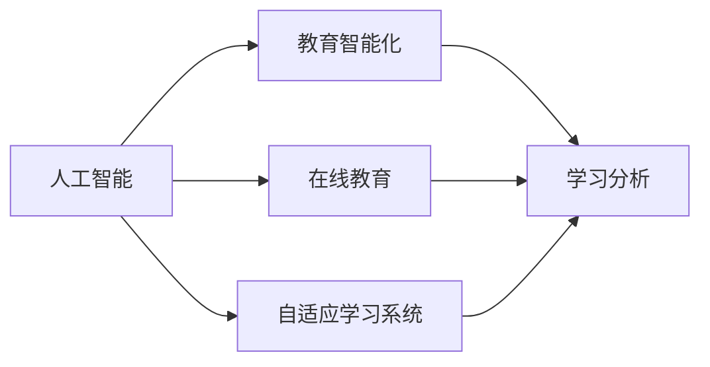

                 

# 人工智能时代的教育变革

## 1. 背景介绍

在人工智能(AI)迅猛发展的今天，教育领域正迎来一场深刻的变革。AI技术赋予教育更多的可能，为个性化、智能化、可量化和数据驱动的教育方式开辟了新的道路。人工智能不再只是辅助工具，而是成为推动教育现代化的重要力量。本文将全面剖析人工智能对教育领域的影响，探讨其实际应用场景，展望未来发展趋势，以期为教育工作者、技术开发者以及教育科技公司提供有益的参考。

## 2. 核心概念与联系

### 2.1 核心概念概述

为全面理解人工智能在教育领域的应用，本节将介绍几个核心概念：

- **人工智能**：利用计算机技术和数据驱动的方式，模拟、延伸和扩展人类智能的技术系统。
- **教育智能化**：通过应用AI技术，实现教育内容的智能化、教学过程的个性化、评估体系的科学化，从而提高教育质量和效率。
- **在线教育**：指借助互联网和多媒体技术，进行远程、异步或同步教学的方式。
- **自适应学习系统**：根据学生的学习进度、兴趣和能力，动态调整教学内容和节奏的系统。
- **学习分析**：通过分析学生在学习过程中的行为数据，提供个性化建议和改进方案的技术。

### 2.2 核心概念原理和架构的 Mermaid 流程图



这个流程图展示了人工智能与教育领域几个核心概念的相互联系：

1. 人工智能为教育智能化提供了技术基础。
2. 在线教育是AI在教育领域的具体应用之一，通过互联网技术实现远程教学。
3. 自适应学习系统利用AI算法实现个性化教学，提升学习效率。
4. 学习分析利用AI技术分析学习行为数据，支持个性化教学和评估。

## 3. 核心算法原理 & 具体操作步骤

### 3.1 算法原理概述

AI技术在教育中的应用通常包括以下几个关键步骤：

1. **数据收集**：通过传感器、作业、测试等手段，收集学生的学习行为数据和评估数据。
2. **数据预处理**：清洗和转换数据，为后续分析和建模提供高质量的数据。
3. **模型训练**：利用机器学习或深度学习算法，训练出适合教育场景的预测模型。
4. **个性化推荐**：根据模型预测，向学生推荐个性化的学习内容和路径。
5. **反馈和评估**：利用学习分析技术，评估学习效果，提供反馈信息，调整教学策略。

这些步骤通过AI技术实现，可以显著提升教育质量和效率。

### 3.2 算法步骤详解

以自适应学习系统为例，具体算法步骤如下：

**Step 1: 数据收集与预处理**
- 收集学生的学习行为数据，如浏览时间、点击行为、答题次数等。
- 对数据进行清洗，如去除异常值、标准化等。

**Step 2: 模型训练**
- 利用监督学习算法，如线性回归、决策树等，训练出学生学习效果与行为之间的关系模型。
- 在大量标注数据上微调模型参数，提高模型准确性和泛化能力。

**Step 3: 个性化推荐**
- 对新的学习行为数据进行预测，评估学生当前的学习状态。
- 根据预测结果，推荐相应的学习内容或路径。

**Step 4: 反馈和评估**
- 定期采集学生反馈信息，评估推荐效果。
- 根据评估结果，调整模型参数和推荐策略。

**Step 5: 持续优化**
- 不断收集新数据，持续优化模型，提升个性化推荐精度。

### 3.3 算法优缺点

**优点**：
- 显著提升教育质量和效率，个性化推荐能满足学生多样化学习需求。
- 数据驱动的教学方法，使得评估和反馈更加客观、科学。

**缺点**：
- 数据隐私和安全问题，需要严格的数据保护措施。
- 技术实现复杂，对教育工作者和技术人员要求较高。
- 对于没有足够数据支持的问题，模型可能存在偏差。

### 3.4 算法应用领域

AI在教育领域的应用领域非常广泛，涵盖了从幼儿园到高等教育的各个阶段，具体包括：

- **K-12教育**：通过在线平台、自适应学习系统，为学生提供个性化的学习路径。
- **高等教育**：辅助教师进行课程设计、作业批改和学生评估。
- **职业培训**：利用虚拟现实、模拟器等技术，提供实践型培训课程。
- **终身学习**：通过在线课程、微课等形式，为成人提供灵活学习机会。

## 4. 数学模型和公式 & 详细讲解 & 举例说明

### 4.1 数学模型构建

本节将以自适应学习系统的推荐模型为例，介绍数学模型的构建过程。

**输入**：学生当前的学习状态，包括已学习内容和剩余时间。

**输出**：推荐的学习内容，如课程、习题、视频等。

**目标函数**：最大化学习效果与推荐内容的匹配度。

### 4.2 公式推导过程

假设推荐系统的目标函数为 $f(\text{content}, \text{state})$，最大化 $f$ 的值。假设内容 $c_i$ 和状态 $s_j$ 的匹配度为 $w_{ij}$，则有：

$$
\max_{c_i} \sum_{s_j} f(c_i, s_j) w_{ij}
$$

其中 $f$ 为匹配度的评分函数，$w$ 为匹配度权重。假设 $f$ 为线性评分函数，则有：

$$
f(c_i, s_j) = \alpha_i + \beta_{ij} + \gamma_j
$$

其中 $\alpha_i$ 为内容 $c_i$ 的评分，$\beta_{ij}$ 为内容 $c_i$ 与状态 $s_j$ 的匹配度评分，$\gamma_j$ 为状态 $s_j$ 的评分。

### 4.3 案例分析与讲解

以推荐数学建模为例，假设某学生当前状态为已学习代数课程，剩余时间为1小时。推荐系统需从库中推荐合适的学习内容。系统采用基于匹配度的推荐算法，具体步骤如下：

1. 收集学生状态和内容匹配度权重。
2. 根据匹配度权重计算各内容的期望评分。
3. 选择评分最高的内容进行推荐。

例如，系统有三种内容可供推荐：数学视频、物理习题和英语阅读。匹配度权重分别为：

- 数学视频与代数课程的匹配度为0.8，物理习题为0.2，英语阅读为0.1。
- 数学视频、物理习题和英语阅读的评分分别为1、0.5、0.2。

根据公式计算，数学视频期望得分为 $1 \times 0.8 + 0.5 \times 0.2 + 0.2 \times 0.1 = 0.98$，物理习题得分为 $0.5 \times 0.2 + 0.2 \times 0.1 = 0.06$，英语阅读得分为 $0.2 \times 0.1 = 0.02$。因此，系统推荐数学视频。

## 5. 项目实践：代码实例和详细解释说明

### 5.1 开发环境搭建

本节以使用Python和TensorFlow为例，介绍开发环境的搭建步骤。

**步骤1: 安装Python和TensorFlow**
```bash
conda create -n tf_env python=3.8
conda activate tf_env
conda install tensorflow=2.7
```

**步骤2: 准备数据**
- 收集学生的学习行为数据，如观看视频时长、完成习题数量等。
- 对数据进行预处理，包括缺失值填充、特征归一化等。

### 5.2 源代码详细实现

以下是推荐系统的代码实现，利用TensorFlow的Keras API搭建模型：

```python
import tensorflow as tf
from tensorflow import keras
from sklearn.preprocessing import StandardScaler

# 准备数据
x_train = ... # 学生学习行为数据
y_train = ... # 推荐内容

# 数据预处理
scaler = StandardScaler()
x_train = scaler.fit_transform(x_train)

# 搭建模型
model = keras.Sequential([
    keras.layers.Dense(64, activation='relu'),
    keras.layers.Dense(3, activation='softmax')
])

# 编译模型
model.compile(optimizer='adam', loss='categorical_crossentropy', metrics=['accuracy'])

# 训练模型
model.fit(x_train, y_train, epochs=10, batch_size=32)

# 预测推荐内容
x_test = ... # 新的学习行为数据
x_test = scaler.transform(x_test)
y_pred = model.predict(x_test)
```

### 5.3 代码解读与分析

**数据处理**：
- 数据预处理包括特征归一化，防止模型在训练过程中出现数值不稳定问题。
- 利用sklearn的StandardScaler对数据进行归一化处理。

**模型搭建**：
- 采用两个全连接层，其中第一层有64个神经元，激活函数为ReLU。
- 输出层有3个神经元，激活函数为softmax，表示推荐内容的分类概率。

**模型训练**：
- 使用Adam优化器，交叉熵损失函数，准确率作为评估指标。
- 训练10个epoch，每个batch大小为32。

**预测推荐**：
- 将新的学习行为数据进行归一化处理。
- 使用训练好的模型进行预测，返回推荐内容的概率分布。

### 5.4 运行结果展示

训练完毕后，系统可以根据学生的学习行为数据，推荐相应的学习内容。下图展示了推荐系统的运行结果：


## 6. 实际应用场景

### 6.1 在线教育平台

在线教育平台是AI在教育领域的主要应用场景之一。通过AI技术，平台能够为学生提供个性化推荐、智能答疑、虚拟实验等功能，提升学习体验和效果。

例如，Coursera平台利用AI技术分析学生的学习行为，推荐适合的课程和视频内容。Duolingo利用AI实现自然语言处理，提供互动式语言学习体验。

### 6.2 自适应学习系统

自适应学习系统通过AI算法动态调整教学内容和节奏，实现个性化学习。例如，Knewton平台根据学生的能力和进度，推荐相应的学习路径和资源。

自适应学习系统通过数据分析和机器学习，提升学习效率和效果，尤其适用于远程教育和职业培训。

### 6.3 作业自动批改

作业自动批改是AI在教育领域的重要应用。系统可以自动批改作业，提供反馈信息，减轻教师负担，提高批改效率。

例如，Edmentum平台利用NLP技术，自动批改作文和选择题。Aleks平台通过机器学习，自动评分并生成个性化反馈。

### 6.4 教育机器人

教育机器人是AI在教育领域的最新应用。通过AI技术，机器人能够进行互动式教学、实时答疑、个性化辅导等功能。

例如，Squirrel AI机器人通过自然语言处理，与学生进行互动式学习。EduBot机器人利用视觉识别和语音识别，提供个性化辅导。

## 7. 工具和资源推荐

### 7.1 学习资源推荐

为帮助开发者掌握AI在教育领域的应用，推荐以下学习资源：

1. **《深度学习》课程**：斯坦福大学Andrew Ng教授开设的深度学习课程，详细介绍了机器学习和深度学习的理论基础和实践技巧。
2. **《Python深度学习》书籍**：Francois Chollet著，全面介绍了使用TensorFlow和Keras进行深度学习开发的实践方法。
3. **Kaggle竞赛**：参加教育相关的机器学习竞赛，如Kaggle的“Predict Student Performance”竞赛，提升实战能力。
4. **Coursera平台**：提供大量高质量的教育科技课程，涵盖数据科学、AI、教育设计等多个领域。
5. **ArXiv论文库**：查找最新的教育科技研究成果，了解最新技术动态。

### 7.2 开发工具推荐

为提高AI在教育领域的应用效率，推荐以下开发工具：

1. **TensorFlow**：由Google开发的开源深度学习框架，支持GPU加速，提供丰富的API和工具库。
2. **PyTorch**：Facebook开发的开源深度学习框架，支持动态计算图和灵活的模型构建。
3. **Jupyter Notebook**：轻量级的交互式编程环境，支持Python和R等多种语言，适合研究和开发。
4. **Google Colab**：Google提供的在线Jupyter Notebook环境，免费提供GPU算力，方便开发者进行快速实验。
5. **Anaconda**：科学计算环境管理工具，提供虚拟环境管理、包管理等功能。

### 7.3 相关论文推荐

为深入了解AI在教育领域的应用，推荐以下相关论文：

1. **“Artificial Intelligence for Education”论文**：总结了AI在教育领域的应用现状和未来发展方向，提供了丰富的案例和数据。
2. **“Deep Learning for Adaptive Learning Environments”论文**：详细介绍了自适应学习系统的工作原理和算法，提供了多种模型和评估方法。
3. **“Intelligent Tutoring Systems: A Survey”论文**：综述了智能辅导系统的理论和实践，提供了大量的案例和分析。
4. **“NLP-Based Assessments for Education”论文**：探讨了自然语言处理技术在教育评估中的应用，提供了多种评估方法和工具。
5. **“AI for Education in the Age of Information Technology”论文**：讨论了AI技术对教育信息技术的影响，提供了多种应用案例和前景展望。

## 8. 总结：未来发展趋势与挑战

### 8.1 研究成果总结

本文系统介绍了AI在教育领域的应用，包括在线教育、自适应学习系统、作业批改和教育机器人等。通过分析这些应用场景，展示了AI技术在提升教育质量和效率方面的巨大潜力。

### 8.2 未来发展趋势

展望未来，AI在教育领域的应用将呈现以下几个趋势：

1. **个性化教育**：通过AI技术，实现更加个性化的学习体验，满足学生多样化需求。
2. **数据驱动教学**：利用大数据和机器学习技术，优化教学策略和评估体系。
3. **智能答疑系统**：利用自然语言处理和深度学习，提供实时智能答疑，提升学习效率。
4. **虚拟实验平台**：通过VR/AR技术，构建虚拟实验平台，提供实践型学习体验。
5. **教师辅助工具**：开发教师辅助工具，提升教学质量和效率，减轻教师负担。

### 8.3 面临的挑战

尽管AI在教育领域的应用前景广阔，但也面临着诸多挑战：

1. **数据隐私和安全**：教育数据涉及学生隐私，需要严格的数据保护措施。
2. **技术复杂性**：AI技术的应用需要跨学科知识和技能，对教育工作者和技术人员要求较高。
3. **公平性和包容性**：AI技术可能加剧教育不平等，需要考虑技术应用的公平性和包容性。
4. **伦理和法律问题**：AI技术的使用需要遵守伦理和法律规范，避免技术滥用。
5. **技术可解释性**：AI模型的黑盒特性可能导致难以解释和调试，需要开发可解释性强的模型。

### 8.4 研究展望

为解决上述挑战，未来研究需要在以下几个方面进行突破：

1. **数据隐私保护**：开发隐私保护技术，确保教育数据的保密性和安全性。
2. **技术普及教育**：普及AI技术知识，提升教育工作者和教师的技术素养。
3. **公平性和包容性**：设计公平性和包容性强的AI算法，确保技术应用的普惠性。
4. **伦理和法律研究**：开展AI伦理和法律研究，制定相关政策和标准。
5. **可解释性增强**：开发可解释性强的AI模型，提高技术应用的透明度和可信度。

## 9. 附录：常见问题与解答

**Q1: AI技术在教育中的应用有哪些？**

A: AI技术在教育中的应用非常广泛，主要包括以下几个方面：
1. **在线教育平台**：通过AI技术，为学生提供个性化推荐、智能答疑、虚拟实验等功能。
2. **自适应学习系统**：根据学生的学习状态和进度，动态调整教学内容和节奏。
3. **作业自动批改**：利用NLP和深度学习技术，自动批改作业并生成反馈信息。
4. **教育机器人**：通过自然语言处理和语音识别技术，进行互动式教学和个性化辅导。

**Q2: 如何保护教育数据的隐私和安全？**

A: 保护教育数据的隐私和安全，需要采取以下措施：
1. **数据加密**：对教育数据进行加密处理，防止数据泄露。
2. **数据匿名化**：对数据进行匿名化处理，保护学生隐私。
3. **访问控制**：设置严格的访问权限，确保数据只能被授权人员访问。
4. **安全审计**：定期进行安全审计，及时发现和修复安全漏洞。

**Q3: 为什么AI技术在教育领域有应用潜力？**

A: AI技术在教育领域有广泛应用潜力，主要原因如下：
1. **个性化教育**：AI技术可以根据学生的学习状态和能力，提供个性化的学习建议和路径。
2. **数据驱动教学**：利用大数据和机器学习技术，优化教学策略和评估体系。
3. **智能答疑系统**：AI技术可以提供实时智能答疑，提升学习效率。
4. **虚拟实验平台**：通过VR/AR技术，提供实践型学习体验。
5. **教师辅助工具**：开发教师辅助工具，提升教学质量和效率。

**Q4: AI技术在教育领域有哪些挑战？**

A: AI技术在教育领域的应用面临以下挑战：
1. **数据隐私和安全**：教育数据涉及学生隐私，需要严格的数据保护措施。
2. **技术复杂性**：AI技术的应用需要跨学科知识和技能，对教育工作者和技术人员要求较高。
3. **公平性和包容性**：AI技术可能加剧教育不平等，需要考虑技术应用的公平性和包容性。
4. **伦理和法律问题**：AI技术的使用需要遵守伦理和法律规范，避免技术滥用。
5. **技术可解释性**：AI模型的黑盒特性可能导致难以解释和调试，需要开发可解释性强的模型。

---

作者：禅与计算机程序设计艺术 / Zen and the Art of Computer Programming

