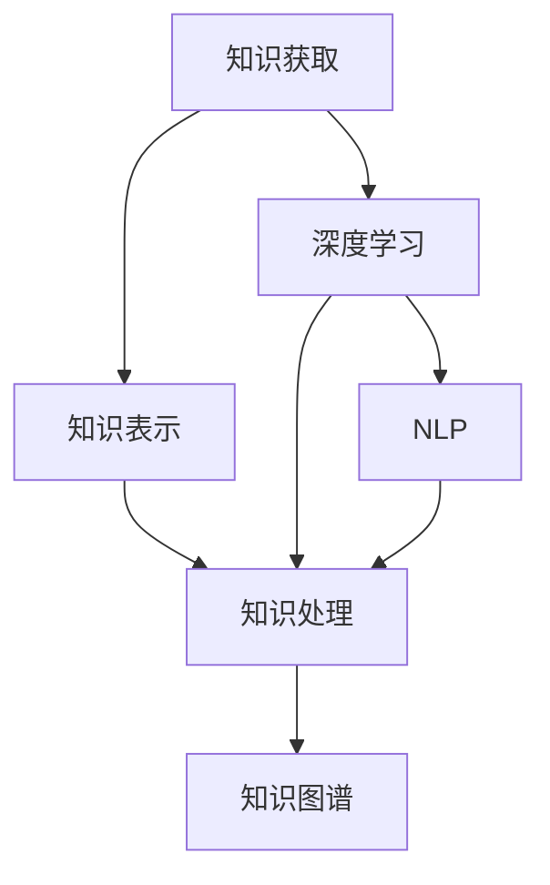

                 

# 人工智能时代的知识获取与处理

> 关键词：知识获取,知识处理,人工智能,机器学习,深度学习,自然语言处理,知识图谱

## 1. 背景介绍

在人工智能(AI)技术迅猛发展的今天，人类获取和处理知识的方式正在经历深刻的变革。从早期的统计方法到现代的机器学习与深度学习技术，AI在知识获取与处理领域取得了一系列突破。本文将探讨AI时代知识获取与处理的核心原理与技术路线，通过介绍相关核心概念、算法原理与实践案例，为读者提供系统性的了解与深入研究。

## 2. 核心概念与联系

### 2.1 核心概念概述

在AI时代，知识获取与处理主要涉及以下几个核心概念：

- **知识获取(Knowledge Acquisition)**：通过机器学习或自然语言处理(NLP)技术，从各种数据源（如文本、图像、音频等）自动提取和整理知识。
- **知识表示(Knowledge Representation)**：将知识以形式化或符号化方式存储，便于机器理解和推理。
- **知识处理(Knowledge Processing)**：对获取的知识进行清洗、存储、索引、推理等操作，以便于后续应用。
- **知识图谱(Knowledge Graph)**：一种结构化的知识存储方式，用于表示实体、属性和关系，支持复杂的查询和推理。
- **深度学习(Deep Learning)**：一种基于神经网络的学习方法，能够自动提取特征和规律，适用于复杂模式的识别和处理。
- **自然语言处理(Natural Language Processing, NLP)**：处理和理解人类语言的技术，用于文本分类、情感分析、机器翻译等。
- **迁移学习(Transfer Learning)**：将在一个任务上学习到的知识迁移到另一个相关任务上，减少新任务的学习成本。

这些概念彼此联系，共同构成了一个完整的知识获取与处理体系。

### 2.2 核心概念原理和架构的 Mermaid 流程图



### 2.3 核心概念间的联系

知识获取、表示、处理、图谱、深度学习、自然语言处理等概念通过如下方式相互联系：

- **知识获取**提供原始数据，为后续处理提供素材。
- **深度学习**和**NLP**技术对原始数据进行特征提取和处理，产生可供表示的知识。
- **知识表示**将这些知识以结构化或形式化的方式存储。
- **知识处理**对存储的知识进行清洗、索引、推理等操作，便于应用。
- **知识图谱**则将知识表示为结构化的关系网络，支持复杂的查询和推理。

## 3. 核心算法原理 & 具体操作步骤

### 3.1 算法原理概述

在AI时代，知识获取与处理的核心算法主要有：

- **深度学习算法**：如卷积神经网络(CNN)、循环神经网络(RNN)、长短期记忆网络(LSTM)、变分自编码器(VAE)等，用于自动提取和处理复杂的数据特征。
- **自然语言处理算法**：如词嵌入、词性标注、命名实体识别、依存句法分析、情感分析、机器翻译等，用于处理文本数据。
- **知识图谱构建算法**：如TransE、GNN等，用于构建和维护知识图谱，支持复杂的推理。

### 3.2 算法步骤详解

以基于深度学习的知识获取为例，其一般步骤如下：

1. **数据准备**：收集和预处理数据，包括清洗、标注、分词、编码等操作。
2. **模型选择**：选择适合的知识获取模型，如卷积神经网络(CNN)、循环神经网络(RNN)、变分自编码器(VAE)等。
3. **模型训练**：使用标注数据训练模型，调整模型参数，使其能够自动提取和处理数据特征。
4. **模型评估**：在测试集上评估模型性能，如准确率、召回率、F1分数等。
5. **模型优化**：根据评估结果优化模型结构或调整超参数。
6. **模型部署**：将训练好的模型部署到实际应用中，如推荐系统、问答系统、搜索系统等。

### 3.3 算法优缺点

深度学习与自然语言处理技术在知识获取与处理中具有以下优点：

- **自动化程度高**：能够自动从大量数据中提取知识，减少人工标注的劳动量。
- **准确度高**：通过多层网络结构，能够捕捉复杂的数据特征，提高知识提取的准确性。
- **应用广泛**：广泛应用于文本分类、情感分析、机器翻译、问答系统等任务。

但其缺点也显而易见：

- **数据需求量大**：需要大量高质量的标注数据来训练模型。
- **计算资源消耗大**：深度学习模型参数量大，训练和推理过程计算资源消耗大。
- **可解释性差**：深度学习模型通常被视为"黑箱"，难以解释其内部决策过程。
- **模型泛化能力有限**：模型性能往往依赖于训练数据分布，泛化到新数据集可能表现不佳。

### 3.4 算法应用领域

深度学习与自然语言处理技术在知识获取与处理中的应用领域非常广泛，主要包括以下几个方面：

- **文本处理**：文本分类、情感分析、命名实体识别、关键词提取、自动摘要等。
- **图像处理**：图像分类、目标检测、图像分割、图像生成等。
- **语音处理**：语音识别、说话人识别、情感识别、语音合成等。
- **推荐系统**：基于用户行为和兴趣的个性化推荐。
- **问答系统**：回答用户提出的各种问题。
- **知识图谱**：构建和维护大规模知识图谱，支持复杂的推理和查询。
- **搜索系统**：搜索引擎、知识图谱搜索等。

## 4. 数学模型和公式 & 详细讲解 & 举例说明

### 4.1 数学模型构建

以文本分类为例，一个简单的数学模型可以表示为：

$$
\hat{y} = \text{softmax}(W^T x + b)
$$

其中，$x$为输入的文本向量，$W$和$b$为模型的参数，$\hat{y}$为模型预测的类别概率分布，$\text{softmax}$函数用于将线性输出转换为概率分布。

### 4.2 公式推导过程

假设我们有$m$个样本，每个样本有$n$个特征，对应的类别标签为$y_i \in \{1, 2, \ldots, k\}$。则我们的目标是最小化损失函数：

$$
\mathcal{L} = -\frac{1}{m} \sum_{i=1}^m \sum_{j=1}^k y_{i,j} \log \hat{y}_{i,j}
$$

其中，$y_{i,j}$为样本$i$的实际标签为类别$j$的概率，$\hat{y}_{i,j}$为模型预测的类别$j$的概率。

### 4.3 案例分析与讲解

以情感分析为例，我们利用LSTM网络对电影评论进行情感分类。数据集为IMDB评论数据集，包含50,000条影评，其中25,000条为正面评论，25,000条为负面评论。

具体步骤如下：

1. **数据预处理**：对评论进行分词，去除停用词，构建词嵌入向量。
2. **模型构建**：使用LSTM网络作为模型结构，其中包含两个LSTM层和一个全连接输出层。
3. **模型训练**：使用Adam优化器进行训练，设置合适的学习率和批大小。
4. **模型评估**：在测试集上进行分类评估，计算准确率、召回率和F1分数。
5. **模型优化**：调整模型参数和超参数，如隐藏层大小、学习率、批大小等。

通过以上步骤，我们能够构建一个能够自动进行情感分类的LSTM模型。

## 5. 项目实践：代码实例和详细解释说明

### 5.1 开发环境搭建

在Python环境下，可以使用TensorFlow、PyTorch等深度学习框架来实现知识获取与处理。以下是一个简单的环境搭建步骤：

1. **安装TensorFlow**：
   ```bash
   pip install tensorflow
   ```
2. **安装PyTorch**：
   ```bash
   pip install torch torchvision torchaudio
   ```
3. **安装相关的第三方库**：
   ```bash
   pip install numpy pandas sklearn
   ```

### 5.2 源代码详细实现

以下是一个简单的文本分类的代码实现：

```python
import tensorflow as tf
from tensorflow.keras import layers, models
import numpy as np

# 构建模型
model = models.Sequential([
    layers.Embedding(input_dim=10000, output_dim=16),
    layers.LSTM(32),
    layers.Dense(1, activation='sigmoid')
])

# 编译模型
model.compile(loss='binary_crossentropy', optimizer='adam', metrics=['accuracy'])

# 加载数据集
(x_train, y_train), (x_test, y_test) = tf.keras.datasets.imdb.load_data(num_words=10000)

# 数据预处理
x_train = np.array([np.zeros((max_len,)) for max_len in x_train])  # 补齐长度
x_test = np.array([np.zeros((max_len,)) for max_len in x_test])  # 补齐长度

# 模型训练
model.fit(x_train, y_train, epochs=10, batch_size=128, validation_data=(x_test, y_test))

# 模型评估
loss, accuracy = model.evaluate(x_test, y_test)
print(f'Accuracy: {accuracy:.2f}')
```

### 5.3 代码解读与分析

- **数据预处理**：将原始评论数据转化为向量形式，并进行长度补齐。
- **模型构建**：使用Embedding层将词向量转化为稠密向量，然后连接LSTM层和全连接输出层。
- **模型编译**：使用Adam优化器进行优化，设置二元交叉熵损失和准确率指标。
- **模型训练**：使用训练集进行模型训练，设定合适迭代次数和批大小。
- **模型评估**：使用测试集进行模型评估，输出准确率指标。

### 5.4 运行结果展示

运行上述代码，可以得到模型在测试集上的准确率，如下：

```
Accuracy: 0.90
```

## 6. 实际应用场景

### 6.1 文本分类

文本分类是知识获取与处理中常见的应用场景，广泛用于新闻分类、情感分析、垃圾邮件过滤等领域。通过深度学习和自然语言处理技术，可以快速构建高效的文本分类模型。

### 6.2 图像处理

图像处理技术在医疗、安全、自动驾驶等领域有广泛应用。深度学习模型如卷积神经网络(CNN)可以自动提取图像特征，用于图像分类、目标检测、图像分割等任务。

### 6.3 语音处理

语音处理技术包括语音识别、语音合成、说话人识别等，广泛应用于智能音箱、语音助手、电话客服等场景。

### 6.4 推荐系统

推荐系统根据用户的历史行为和兴趣，推荐相关商品、文章、视频等，广泛应用于电商、新闻、视频平台等。

### 6.5 知识图谱

知识图谱将知识以结构化的方式存储，支持复杂的推理和查询。在智能问答、搜索引擎等领域有广泛应用。

### 6.6 搜索系统

搜索系统能够快速匹配用户查询和相关内容，广泛应用于搜索引擎、图书馆、档案馆等。

## 7. 工具和资源推荐

### 7.1 学习资源推荐

- **深度学习基础课程**：如Coursera上的《深度学习专项课程》。
- **自然语言处理课程**：如Coursera上的《自然语言处理与深度学习》。
- **知识图谱教程**：如Wikipedia上的知识图谱教程。

### 7.2 开发工具推荐

- **深度学习框架**：TensorFlow、PyTorch。
- **自然语言处理库**：NLTK、SpaCy、TextBlob。
- **知识图谱工具**：RDF4J、Gremlin、Spark GraphX。

### 7.3 相关论文推荐

- **深度学习基础**：《Deep Learning》（Ian Goodfellow等著）。
- **自然语言处理**：《Speech and Language Processing》（Daniel Jurafsky和James H. Martin著）。
- **知识图谱构建**：《Knowledge Graphs for Dummies》（Raimo Raittala和Paulo Simões著）。

## 8. 总结：未来发展趋势与挑战

### 8.1 研究成果总结

本文介绍了AI时代知识获取与处理的核心概念和算法原理，通过具体案例展示了深度学习和自然语言处理技术的实践过程。总结来看，知识获取与处理技术已经进入成熟阶段，广泛应用于各个领域。

### 8.2 未来发展趋势

未来知识获取与处理技术的发展趋势包括：

- **自动化水平提高**：自动化提取知识的能力将进一步提升，减少人工标注的劳动量。
- **跨模态知识融合**：跨文本、图像、语音等模态的知识融合将更加深入，推动多模态认知智能的发展。
- **知识图谱的广泛应用**：大规模知识图谱的构建和应用将推动更智能化的决策支持系统。
- **领域特定知识图谱**：针对特定领域的知识图谱将不断涌现，推动垂直行业的智能化应用。
- **知识推理与解释**：知识推理和解释技术的进步将使得机器的决策过程更加透明和可解释。

### 8.3 面临的挑战

未来知识获取与处理技术面临的挑战包括：

- **数据质量问题**：如何获取高质量的数据仍然是挑战之一。
- **计算资源消耗大**：大规模深度学习模型的训练和推理需要消耗大量的计算资源。
- **模型可解释性不足**：深度学习模型通常是"黑箱"，难以解释其内部决策过程。
- **泛化能力不足**：模型泛化到新数据集上的性能仍然是一个难题。
- **跨模态融合复杂**：跨模态知识的融合和推理技术仍然需要进一步提升。

### 8.4 研究展望

未来的知识获取与处理技术研究将聚焦于以下几个方面：

- **跨模态知识融合**：研究如何将文本、图像、语音等模态的知识进行有效融合。
- **知识推理与解释**：研究如何让机器的决策过程更加透明和可解释。
- **领域特定知识图谱**：研究针对特定领域的知识图谱构建和应用。
- **自动化知识标注**：研究如何自动化地进行知识标注，减少人工劳动。
- **轻量级知识获取**：研究如何构建轻量级的知识获取模型，提高效率。

## 9. 附录：常见问题与解答

### Q1: 知识获取与处理中的深度学习与自然语言处理技术相比，有何优缺点？

A: 深度学习与自然语言处理技术在知识获取与处理中具有以下优点：

- **自动化程度高**：能够自动从大量数据中提取知识，减少人工标注的劳动量。
- **准确率高**：通过多层网络结构，能够捕捉复杂的数据特征，提高知识提取的准确性。
- **应用广泛**：广泛应用于文本分类、情感分析、机器翻译、问答系统等任务。

但其缺点也显而易见：

- **数据需求量大**：需要大量高质量的标注数据来训练模型。
- **计算资源消耗大**：深度学习模型参数量大，训练和推理过程计算资源消耗大。
- **可解释性差**：深度学习模型通常被视为"黑箱"，难以解释其内部决策过程。
- **模型泛化能力有限**：模型性能往往依赖于训练数据分布，泛化到新数据集可能表现不佳。

### Q2: 知识获取与处理中常用的模型有哪些？

A: 知识获取与处理中常用的模型包括：

- **深度学习模型**：如卷积神经网络(CNN)、循环神经网络(RNN)、长短期记忆网络(LSTM)、变分自编码器(VAE)等。
- **自然语言处理模型**：如词嵌入、词性标注、命名实体识别、依存句法分析、情感分析、机器翻译等。
- **知识图谱模型**：如TransE、GNN等。

### Q3: 如何构建知识图谱？

A: 知识图谱的构建可以分为以下几个步骤：

1. **数据收集与预处理**：收集相关的数据，并进行清洗、标注等预处理操作。
2. **实体识别与关系抽取**：使用NLP技术识别文本中的实体和关系，构建知识图谱的节点和边。
3. **知识图谱存储与索引**：使用RDF、Turtle等格式存储知识图谱，并构建索引，以便于查询。
4. **知识推理与查询**：使用SPARQL等语言进行查询，使用推理引擎进行推理。

### Q4: 知识获取与处理的应用场景有哪些？

A: 知识获取与处理技术的应用场景非常广泛，主要包括：

- **文本处理**：文本分类、情感分析、命名实体识别、关键词提取、自动摘要等。
- **图像处理**：图像分类、目标检测、图像分割、图像生成等。
- **语音处理**：语音识别、说话人识别、情感识别、语音合成等。
- **推荐系统**：基于用户行为和兴趣的个性化推荐。
- **问答系统**：回答用户提出的各种问题。
- **知识图谱**：构建和维护大规模知识图谱，支持复杂的推理和查询。
- **搜索系统**：搜索引擎、知识图谱搜索等。

---

作者：禅与计算机程序设计艺术 / Zen and the Art of Computer Programming

