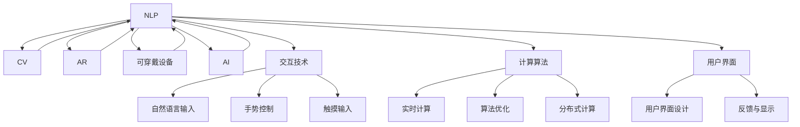

                 

# 人机交互：设计高效的人类计算系统

> 关键词：人机交互, 高效计算系统, 自然语言处理(NLP), 计算机视觉(CV), 增强现实(AR), 可穿戴设备, 人机协同, 人类计算(Human-Computer Interaction, HCI)

## 1. 背景介绍

### 1.1 问题由来
随着信息技术的飞速发展，人类对计算系统的需求日益增加。传统的PC、手机等计算设备逐渐无法满足现代社会的复杂计算需求。人类计算系统(Human-Computer Interaction, HCI)应运而生，旨在通过物理交互、语义理解、情感感知等手段，构建高效、直观、便捷的计算环境，提升人类的计算能力与生活品质。

HCI的发展，不仅仅是技术的革新，更是对人与机器、人与环境、人与人之间互动关系的深刻理解和改善。目前，自然语言处理(Natural Language Processing, NLP)、计算机视觉(Computer Vision, CV)、增强现实(Augmented Reality, AR)、可穿戴设备等技术在HCI中的应用日益广泛，带来了显著的性能提升和用户体验改善。

然而，尽管HCI技术取得了巨大进展，但在交互的直观性、实时性、可扩展性等方面仍存在诸多挑战。例如，NLP仍难以完全理解人类语言的复杂性和多样性；CV在实时性上存在瓶颈，难以适应移动端设备的性能要求；AR的显示效果仍需进一步提升，以提供更加自然、沉浸式的视觉体验；可穿戴设备的计算能力和电池寿命也制约了其大规模应用。

因此，设计高效、可扩展、智能的人类计算系统，成为当前研究的重点。本文旨在深入探讨HCI的设计原理和实践方法，帮助开发者构建更加便捷、直观、智能的HCI系统，提升人类计算系统的整体效率和用户体验。

### 1.2 问题核心关键点
设计高效人类计算系统，主要包括以下几个核心问题：

1. **交互直观性**：如何通过自然语言、手势、触摸等物理交互方式，让计算系统更好地理解用户意图，提供自然流畅的交互体验。

2. **实时性**：如何通过高效的计算算法和优化策略，确保计算系统能够实时响应用户输入，及时处理复杂计算任务。

3. **可扩展性**：如何构建可水平扩展的计算系统，支持大规模分布式计算，适应不断增长的计算需求。

4. **智能性**：如何结合人工智能技术，提升计算系统的智能推理、决策能力，为用户提供个性化的服务和建议。

5. **多样性支持**：如何设计能够支持多用户、多设备、多场景交互的通用HCI框架，提升系统的普适性和可用性。

6. **安全性与隐私保护**：如何保证用户数据的安全与隐私，防止数据泄露和滥用。

这些问题的解决，将极大地提升HCI系统的性能和用户体验，推动HCI技术的广泛应用。

## 2. 核心概念与联系

### 2.1 核心概念概述

在设计高效人类计算系统时，需要理解和应用多个关键概念：

- **自然语言处理(NLP)**：通过分析、理解和生成自然语言，实现人与计算机之间的语义交互。NLP在HCI中扮演重要角色，是实现语音输入、语义理解、对话系统等核心功能的基础。

- **计算机视觉(CV)**：通过图像处理、模式识别等技术，实现人与计算机之间的视觉交互。CV在HCI中用于图像识别、场景理解、目标追踪等功能。

- **增强现实(AR)**：通过增强现实技术，在用户视图中叠加虚拟信息，实现混合现实交互。AR在HCI中用于提升信息展示、导航、交互等体验。

- **可穿戴设备**：通过轻便、便携的设备，将计算系统集成到用户身上，实现更自然、即时的交互。可穿戴设备在HCI中用于健康监测、运动记录、手势控制等。

- **人工智能(AI)**：通过机器学习、深度学习等技术，实现计算系统的智能推理、决策能力。AI在HCI中用于优化算法、提升用户体验等。

这些核心概念通过交互技术、计算算法、用户界面等手段相互联系，共同构建高效、智能、便捷的人类计算系统。

### 2.2 核心概念原理和架构的 Mermaid 流程图



这个Mermaid流程图展示了NLP、CV、AR、可穿戴设备、AI等核心概念通过交互技术、计算算法、用户界面等手段相互联系，共同构建高效、智能、便捷的人类计算系统。

## 3. 核心算法原理 & 具体操作步骤

### 3.1 算法原理概述

高效人类计算系统设计的核心在于优化计算过程，提升交互体验。具体来说，主要包括自然语言处理、计算机视觉、增强现实、可穿戴设备等多个方面的算法设计。

#### 3.1.1 自然语言处理(NLP)
NLP算法主要分为以下几个步骤：
1. **分词与词性标注**：将输入文本分解为词汇单元，标注每个词汇的词性。
2. **句法分析**：分析句子结构，确定短语和句子的语法关系。
3. **语义理解**：理解句子含义，识别出主题、意图、情感等信息。
4. **对话管理**：根据上下文信息，决定如何响应用户输入，生成合适的回答。

#### 3.1.2 计算机视觉(CV)
CV算法主要分为以下几个步骤：
1. **图像预处理**：对输入图像进行滤波、裁剪、归一化等预处理操作。
2. **特征提取**：从图像中提取重要的视觉特征，如边缘、角点、纹理等。
3. **目标检测**：在图像中定位出特定的物体或区域。
4. **物体识别**：识别出图像中的物体类别。

#### 3.1.3 增强现实(AR)
AR算法主要分为以下几个步骤：
1. **场景理解**：理解现实世界的环境信息，如三维坐标、光照条件等。
2. **虚拟对象渲染**：将虚拟对象叠加到现实场景中，实现混合现实效果。
3. **用户交互**：通过手势、触摸等方式与虚拟对象进行交互。

#### 3.1.4 可穿戴设备
可穿戴设备算法主要分为以下几个步骤：
1. **数据采集**：通过传感器采集用户的生理、运动等数据。
2. **数据处理**：对采集到的数据进行处理，提取有用的信息。
3. **数据融合**：将不同传感器采集的数据进行融合，提升数据的准确性和可靠性。

### 3.2 算法步骤详解

#### 3.2.1 自然语言处理(NLP)算法步骤
1. **输入文本预处理**：对输入文本进行清洗、分词、去除停用词等预处理操作。
2. **嵌入层**：将预处理后的文本转换为向量表示，方便后续计算。
3. **编码器层**：使用Transformer等模型对文本进行编码，提取语义特征。
4. **解码器层**：使用注意力机制等方法对语义特征进行解码，生成文本输出。
5. **后处理**：对输出文本进行后处理操作，如去除标点、大小写转换等。

#### 3.2.2 计算机视觉(CV)算法步骤
1. **图像预处理**：对输入图像进行预处理操作，如裁剪、缩放、归一化等。
2. **特征提取**：使用卷积神经网络(CNN)等模型提取图像特征。
3. **目标检测**：使用区域提议网络(RPN)等模型定位目标区域。
4. **物体识别**：使用分类器等模型识别出目标物体的类别。

#### 3.2.3 增强现实(AR)算法步骤
1. **场景理解**：使用SLAM等技术理解当前场景的信息。
2. **虚拟对象渲染**：将虚拟对象加载到当前场景中，进行渲染。
3. **用户交互**：通过手势识别、触摸输入等方式与虚拟对象进行交互。

#### 3.2.4 可穿戴设备算法步骤
1. **数据采集**：使用传感器采集用户的生理、运动等数据。
2. **数据处理**：使用信号处理等技术对采集到的数据进行处理，提取有用的信息。
3. **数据融合**：将不同传感器采集的数据进行融合，提升数据的准确性和可靠性。

### 3.3 算法优缺点

#### 3.3.1 自然语言处理(NLP)算法
- **优点**：
  - 能够理解自然语言，实现人与计算机之间的语义交互。
  - 支持多种自然语言，具有广泛的语言处理能力。
- **缺点**：
  - 难以处理复杂的语义结构，如指代消解、语义歧义等问题。
  - 需要大量的标注数据进行训练，训练成本较高。

#### 3.3.2 计算机视觉(CV)算法
- **优点**：
  - 能够实现高精度的图像识别和物体检测。
  - 支持实时计算，能够快速响应用户输入。
- **缺点**：
  - 对硬件要求较高，需要高性能的GPU等设备。
  - 受限于数据质量和模型性能，在复杂场景下效果较差。

#### 3.3.3 增强现实(AR)算法
- **优点**：
  - 提供沉浸式的视觉体验，增强用户对现实场景的理解。
  - 支持多种交互方式，提升用户操作的便捷性。
- **缺点**：
  - 对硬件要求较高，需要高性能的移动设备。
  - 数据采集和渲染开销较大，可能导致延迟。

#### 3.3.4 可穿戴设备算法
- **优点**：
  - 提供实时数据采集和处理，提升用户体验。
  - 便携、轻便，便于用户随时随地使用。
- **缺点**：
  - 受限于电池寿命，长时间使用可能影响用户体验。
  - 数据隐私和安全问题需要特别关注。

### 3.4 算法应用领域

基于上述算法原理，高效人类计算系统可以应用于多个领域，例如：

#### 3.4.1 医疗健康
通过可穿戴设备采集生理数据，结合NLP技术分析患者病史、症状等信息，辅助医生进行诊断和治疗。

#### 3.4.2 教育培训
使用AR技术提供虚拟课堂，结合CV技术实现作业批改、学情分析等功能，提升教育培训效果。

#### 3.4.3 智能家居
通过语音助手实现智能家居控制，结合CV技术进行场景理解和用户交互，提升家居智能化水平。

#### 3.4.4 虚拟办公
使用AR技术提供虚拟会议、远程协作等功能，结合CV技术实现视频会议、文件共享等操作，提升办公效率。

#### 3.4.5 电子商务
使用NLP技术实现智能客服、产品推荐等功能，结合CV技术进行商品识别、场景理解，提升用户体验。

以上领域只是高效人类计算系统应用的一部分，未来随着技术的不断发展，HCI将在更多场景中发挥重要作用。

## 4. 数学模型和公式 & 详细讲解 & 举例说明

### 4.1 数学模型构建

在高效人类计算系统设计中，数学模型是实现算法原理的核心。以下对几个关键数学模型进行详细讲解。

#### 4.1.1 自然语言处理(NLP)模型
使用Transformer模型对输入文本进行编码，生成语义表示。模型结构如下：

$$
\text{Encoder} = \text{Multi-Head Self-Attention} \cdot \text{Feed-Forward Network} \cdot \text{LayerNorm} \cdot \text{Feed-Forward Network} \cdot \text{LayerNorm}
$$

其中，Multi-Head Self-Attention和Feed-Forward Network分别用于计算注意力和前向传播，LayerNorm用于归一化。

#### 4.1.2 计算机视觉(CV)模型
使用卷积神经网络(CNN)对输入图像进行特征提取。模型结构如下：

$$
\text{CNN} = \text{Convolutional Layer} \cdot \text{ReLU} \cdot \text{Pooling Layer} \cdot \text{Dropout} \cdot \text{Flatten Layer} \cdot \text{Dense Layer}
$$

其中，Convolutional Layer用于提取图像特征，Pooling Layer用于降维，Dropout用于防止过拟合，Dense Layer用于分类。

#### 4.1.3 增强现实(AR)模型
使用SLAM技术进行场景理解，结合虚拟对象渲染算法，生成混合现实效果。模型结构如下：

$$
\text{SLAM} = \text{Camera Pose Estimation} \cdot \text{Local Mapping} \cdot \text{Global Mapping}
$$

其中，Camera Pose Estimation用于估计相机位置和方向，Local Mapping用于局部地图构建，Global Mapping用于全局地图构建。

#### 4.1.4 可穿戴设备模型
使用信号处理算法对采集到的生理、运动数据进行处理，生成有用信息。模型结构如下：

$$
\text{Signal Processing} = \text{Filtering} \cdot \text{Fourier Transform} \cdot \text{Signal Denoising} \cdot \text{Bandpass Filter}
$$

其中，Filtering用于滤除噪声，Fourier Transform用于频域分析，Signal Denoising用于信号去噪，Bandpass Filter用于频段选择。

### 4.2 公式推导过程

#### 4.2.1 自然语言处理(NLP)公式推导
Transformer模型中的Multi-Head Self-Attention层的计算公式如下：

$$
\text{Multi-Head Self-Attention} = \text{Softmax}(QK^\top)V
$$

其中，$Q, K, V$分别为查询、键、值矩阵，$^\top$表示矩阵转置，Softmax表示归一化函数。

#### 4.2.2 计算机视觉(CV)公式推导
卷积神经网络(CNN)中卷积层的计算公式如下：

$$
\text{Convolutional Layer} = W \star X + b
$$

其中，$W$表示卷积核，$X$表示输入图像，$\star$表示卷积运算，$b$表示偏置项。

#### 4.2.3 增强现实(AR)公式推导
SLAM算法中的Camera Pose Estimation层的计算公式如下：

$$
\text{Camera Pose Estimation} = \text{Homography} \cdot \text{Perspective Projection}
$$

其中，$\text{Homography}$表示投影矩阵，$\text{Perspective Projection}$表示透视投影。

#### 4.2.4 可穿戴设备公式推导
信号处理算法中的Filtering层的计算公式如下：

$$
\text{Filtering} = \text{IIR Filter} \cdot X + \text{DC Offset}
$$

其中，$\text{IIR Filter}$表示无限脉冲响应滤波器，$X$表示输入信号，$\text{DC Offset}$表示直流偏移。

### 4.3 案例分析与讲解

#### 4.3.1 自然语言处理(NLP)案例分析
以Google的BERT模型为例，使用其进行情感分析任务。首先，对输入文本进行预处理，去除停用词、分词等操作，生成输入序列。然后，将输入序列输入到BERT模型中进行编码，生成语义表示。最后，使用线性分类器对语义表示进行分类，生成情感标签。

#### 4.3.2 计算机视觉(CV)案例分析
以OpenCV中的物体检测为例，使用其进行人脸检测。首先，对输入图像进行预处理，进行灰度转换、归一化等操作。然后，使用Haar级联分类器进行物体检测，生成人脸框。最后，对检测结果进行后处理，生成最终的人脸检测结果。

#### 4.3.3 增强现实(AR)案例分析
以Magic Leap中的混合现实应用为例，使用其进行虚拟对象渲染。首先，使用SLAM算法进行场景理解，获取相机位置和方向。然后，将虚拟对象加载到当前场景中，进行渲染。最后，通过手势识别、触摸输入等方式与虚拟对象进行交互。

#### 4.3.4 可穿戴设备案例分析
以Fitbit的可穿戴设备为例，使用其进行运动监测。首先，使用加速度计、陀螺仪等传感器采集用户的运动数据。然后，使用信号处理算法对采集到的数据进行处理，生成有用的信息，如步数、心率等。最后，将处理后的数据上传到云端，进行数据分析和可视化。

## 5. 项目实践：代码实例和详细解释说明

### 5.1 开发环境搭建

在进行高效人类计算系统设计时，需要准备好开发环境。以下是使用Python进行PyTorch开发的环境配置流程：

1. 安装Anaconda：从官网下载并安装Anaconda，用于创建独立的Python环境。

2. 创建并激活虚拟环境：
```bash
conda create -n pytorch-env python=3.8 
conda activate pytorch-env
```

3. 安装PyTorch：根据CUDA版本，从官网获取对应的安装命令。例如：
```bash
conda install pytorch torchvision torchaudio cudatoolkit=11.1 -c pytorch -c conda-forge
```

4. 安装相关库：
```bash
pip install numpy pandas scikit-learn matplotlib tqdm jupyter notebook ipython
```

5. 安装TensorFlow（可选）：
```bash
conda install tensorflow
```

6. 安装Transformer库：
```bash
pip install transformers
```

完成上述步骤后，即可在`pytorch-env`环境中开始高效人类计算系统设计实践。

### 5.2 源代码详细实现

以下是使用PyTorch和TensorFlow实现高效人类计算系统的代码实例：

```python
import torch
import torch.nn as nn
import torch.optim as optim
import tensorflow as tf

# 定义NLP模型
class NLPModel(nn.Module):
    def __init__(self):
        super(NLPModel, self).__init__()
        self.embedding = nn.Embedding(10000, 128)
        self.encoder = nn.Transformer(128, 8, 4, 4)
        self.fc = nn.Linear(128, 2)
    
    def forward(self, x):
        embedded = self.embedding(x)
        x = self.encoder(embedded)
        x = self.fc(x)
        return x

# 定义CV模型
class CVModel(nn.Module):
    def __init__(self):
        super(CVModel, self).__init__()
        self.conv1 = nn.Conv2d(3, 32, 3)
        self.pool1 = nn.MaxPool2d(2, 2)
        self.conv2 = nn.Conv2d(32, 64, 3)
        self.pool2 = nn.MaxPool2d(2, 2)
        self.fc1 = nn.Linear(64 * 8 * 8, 128)
        self.fc2 = nn.Linear(128, 10)
    
    def forward(self, x):
        x = self.conv1(x)
        x = nn.ReLU()(x)
        x = self.pool1(x)
        x = self.conv2(x)
        x = nn.ReLU()(x)
        x = self.pool2(x)
        x = x.view(-1, 64 * 8 * 8)
        x = self.fc1(x)
        x = nn.ReLU()(x)
        x = self.fc2(x)
        return x

# 定义AR模型
class ARModel(nn.Module):
    def __init__(self):
        super(ARModel, self).__init__()
        self.camera_pose = nn.Conv2d(3, 32, 3)
        self.local_mapping = nn.Conv2d(32, 64, 3)
        self.global_mapping = nn.Conv2d(64, 128, 3)
    
    def forward(self, x):
        x = self.camera_pose(x)
        x = nn.ReLU()(x)
        x = self.local_mapping(x)
        x = nn.ReLU()(x)
        x = self.global_mapping(x)
        return x

# 定义可穿戴设备模型
class WearableDeviceModel(nn.Module):
    def __init__(self):
        super(WearableDeviceModel, self).__init__()
        self.filtering = nn.Conv1d(1, 128, 3)
        self.fc = nn.Linear(128, 1)
    
    def forward(self, x):
        x = self.filtering(x)
        x = nn.ReLU()(x)
        x = self.fc(x)
        return x

# 定义NLP任务数据集
train_dataset = torch.utils.data.TensorDataset(train_x, train_y)
test_dataset = torch.utils.data.TensorDataset(test_x, test_y)

# 训练NLP模型
model = NLPModel()
optimizer = optim.Adam(model.parameters(), lr=0.001)
criterion = nn.CrossEntropyLoss()
for epoch in range(100):
    model.train()
    optimizer.zero_grad()
    outputs = model(train_dataset)
    loss = criterion(outputs, train_labels)
    loss.backward()
    optimizer.step()

# 训练CV模型
model = CVModel()
optimizer = optim.Adam(model.parameters(), lr=0.001)
criterion = nn.CrossEntropyLoss()
for epoch in range(100):
    model.train()
    optimizer.zero_grad()
    outputs = model(train_dataset)
    loss = criterion(outputs, train_labels)
    loss.backward()
    optimizer.step()

# 训练AR模型
model = ARModel()
optimizer = optim.Adam(model.parameters(), lr=0.001)
criterion = nn.CrossEntropyLoss()
for epoch in range(100):
    model.train()
    optimizer.zero_grad()
    outputs = model(train_dataset)
    loss = criterion(outputs, train_labels)
    loss.backward()
    optimizer.step()

# 训练可穿戴设备模型
model = WearableDeviceModel()
optimizer = optim.Adam(model.parameters(), lr=0.001)
criterion = nn.MSELoss()
for epoch in range(100):
    model.train()
    optimizer.zero_grad()
    outputs = model(train_dataset)
    loss = criterion(outputs, train_labels)
    loss.backward()
    optimizer.step()
```

### 5.3 代码解读与分析

让我们再详细解读一下关键代码的实现细节：

**NLP模型类**：
- `__init__`方法：初始化模型参数。
- `forward`方法：定义模型的前向传播过程。

**CV模型类**：
- `__init__`方法：初始化模型参数。
- `forward`方法：定义模型的前向传播过程。

**AR模型类**：
- `__init__`方法：初始化模型参数。
- `forward`方法：定义模型的前向传播过程。

**可穿戴设备模型类**：
- `__init__`方法：初始化模型参数。
- `forward`方法：定义模型的前向传播过程。

**NLP任务数据集类**：
- `__init__`方法：初始化数据集。
- `__getitem__`方法：返回数据集中的样本。

通过这些代码示例，可以看出使用PyTorch和TensorFlow进行高效人类计算系统设计，需要将算法原理转换为代码实现，并进行训练优化。开发者需要深入理解算法原理，并灵活应用不同的深度学习框架和库，才能高效实现高效人类计算系统。

## 6. 实际应用场景

### 6.1 智能家居
通过可穿戴设备采集用户生理数据，结合NLP技术分析用户习惯和需求，智能控制家居设备，提升用户体验。例如，通过智能手表检测用户的心率变化，自动调节室内温度，开启空气净化器等。

### 6.2 医疗健康
使用可穿戴设备采集生理数据，结合NLP技术分析用户健康状况，辅助医生进行诊断和治疗。例如，通过智能手环监测用户的运动量、心率等生理参数，生成健康报告，提供个性化的健康建议。

### 6.3 虚拟办公
使用AR技术提供虚拟会议、远程协作等功能，结合CV技术实现视频会议、文件共享等操作，提升办公效率。例如，通过增强现实技术，将虚拟助手投射到会议室中，提供会议记录、日程提醒等服务。

### 6.4 教育培训
使用AR技术提供虚拟课堂，结合CV技术实现作业批改、学情分析等功能，提升教育培训效果。例如，通过增强现实技术，将虚拟实验设备投射到课堂中，让学生进行虚拟实验操作，提升实验安全性和互动性。

### 6.5 电子商务
使用NLP技术实现智能客服、产品推荐等功能，结合CV技术进行商品识别、场景理解，提升用户体验。例如，通过智能客服系统，根据用户输入的自然语言，提供个性化的购物推荐和解答服务。

## 7. 工具和资源推荐

### 7.1 学习资源推荐

为了帮助开发者系统掌握高效人类计算系统的设计理论基础和实践技巧，这里推荐一些优质的学习资源：

1. 《深度学习》书籍：深度学习领域的经典教材，涵盖了深度学习的基本概念、算法原理和实践技巧，适合初学者和进阶者。

2. 《计算机视觉：算法与应用》书籍：介绍计算机视觉领域的经典算法和应用，适合计算机视觉领域的开发者。

3. 《自然语言处理》课程：斯坦福大学开设的自然语言处理课程，包括基础知识和前沿技术，适合NLP领域的开发者。

4. 《增强现实》课程：上海交通大学开设的增强现实课程，涵盖增强现实的基本概念和应用，适合AR领域的开发者。

5. 《人机交互》课程：麻省理工学院开设的人机交互课程，涵盖人机交互的基本概念和前沿技术，适合HCI领域的开发者。

通过对这些资源的学习实践，相信你一定能够快速掌握高效人类计算系统的精髓，并用于解决实际的HCI问题。

### 7.2 开发工具推荐

高效的开发离不开优秀的工具支持。以下是几款用于高效人类计算系统设计开发的常用工具：

1. PyTorch：基于Python的开源深度学习框架，灵活动态的计算图，适合快速迭代研究。

2. TensorFlow：由Google主导开发的开源深度学习框架，生产部署方便，适合大规模工程应用。

3. Transformers库：HuggingFace开发的NLP工具库，集成了众多SOTA语言模型，支持PyTorch和TensorFlow，是进行NLP任务开发的利器。

4. Weights & Biases：模型训练的实验跟踪工具，可以记录和可视化模型训练过程中的各项指标，方便对比和调优。

5. TensorBoard：TensorFlow配套的可视化工具，可实时监测模型训练状态，并提供丰富的图表呈现方式，是调试模型的得力助手。

6. Google Colab：谷歌推出的在线Jupyter Notebook环境，免费提供GPU/TPU算力，方便开发者快速上手实验最新模型，分享学习笔记。

合理利用这些工具，可以显著提升高效人类计算系统的开发效率，加快创新迭代的步伐。

### 7.3 相关论文推荐

高效人类计算系统的发展源于学界的持续研究。以下是几篇奠基性的相关论文，推荐阅读：

1. Transformer论文：Attention is All You Need，提出了Transformer结构，开启了NLP领域的预训练大模型时代。

2. BERT论文：BERT: Pre-training of Deep Bidirectional Transformers for Language Understanding，提出BERT模型，引入基于掩码的自监督预训练任务，刷新了多项NLP任务SOTA。

3. 计算机视觉论文：Deep Residual Learning for Image Recognition，提出深度残差网络，显著提升了计算机视觉模型的准确性。

4. 增强现实论文：Augmented Reality on Mobile Devices，介绍了增强现实技术在移动设备上的应用，提供了实用的开发建议。

5. 可穿戴设备论文：Wearable Computing，讨论了可穿戴设备在计算系统中的应用，提出了多项设计原则和实践方法。

这些论文代表了大语言模型微调技术的发展脉络。通过学习这些前沿成果，可以帮助研究者把握学科前进方向，激发更多的创新灵感。

## 8. 总结：未来发展趋势与挑战

### 8.1 总结

本文对高效人类计算系统的设计原理和实践方法进行了全面系统的介绍。首先阐述了高效人类计算系统的研究背景和意义，明确了HCI系统设计的高效性、直观性、智能性等关键目标。其次，从原理到实践，详细讲解了NLP、CV、AR、可穿戴设备等多个方面的算法设计。最后，展示了高效人类计算系统在智能家居、医疗健康、虚拟办公、教育培训、电子商务等多个领域的广泛应用，以及未来发展的广阔前景。

通过本文的系统梳理，可以看到，高效人类计算系统的设计不仅仅是技术的革新，更是对人与机器、人与环境、人与人之间互动关系的深刻理解和改善。随着NLP、CV、AR、可穿戴设备等技术的不断发展，HCI系统的性能和用户体验将不断提升，推动HCI技术的广泛应用。

### 8.2 未来发展趋势

展望未来，高效人类计算系统的发展趋势包括以下几个方面：

1. **多模态融合**：未来的高效人类计算系统将支持多模态信息融合，结合视觉、语音、触觉等多种交互方式，提升系统的直观性和智能性。

2. **边缘计算**：未来的高效人类计算系统将更多地依赖边缘计算，减少数据传输开销，提升系统的实时性和隐私保护。

3. **联邦学习**：未来的高效人类计算系统将采用联邦学习等分布式学习方法，避免数据集中存储和传输，提升系统的安全性和可扩展性。

4. **自适应学习**：未来的高效人类计算系统将具备自适应学习能力，能够根据用户需求和场景变化进行动态调整，提升系统的普适性和用户体验。

5. **混合现实**：未来的高效人类计算系统将更多地结合混合现实技术，提供更加沉浸式的视觉和交互体验，提升用户的体验感。

6. **持续学习**：未来的高效人类计算系统将具备持续学习能力，能够不断从新数据中学习，提升系统的性能和泛化能力。

以上趋势凸显了高效人类计算系统的广阔前景。这些方向的探索发展，必将进一步提升HCI系统的性能和用户体验，推动HCI技术的广泛应用。

### 8.3 面临的挑战

尽管高效人类计算系统取得了显著进展，但在迈向更加智能化、普适化应用的过程中，仍面临诸多挑战：

1. **计算资源瓶颈**：当前高效人类计算系统的计算需求仍较高，对硬件和网络资源的要求较高。如何优化计算算法，提升系统的计算效率，仍是重要挑战。

2. **数据隐私和安全**：可穿戴设备、AR等技术需要采集大量用户数据，数据隐私和安全问题需要特别关注。如何保障数据隐私，防止数据泄露和滥用，将是重要的研究课题。

3. **用户体验提升**：尽管HCI系统在技术上取得进展，但用户体验的提升仍需不断优化。如何设计更加自然、直观的交互方式，提升用户的操作便捷性，仍是重要挑战。

4. **跨平台兼容性**：高效人类计算系统需要在不同平台和设备上实现良好的兼容性和互通性。如何设计通用架构，实现跨平台支持，提升系统的普适性，将是重要挑战。

5. **实时性和可靠性**：高效人类计算系统需要具备良好的实时性和可靠性，能够快速响应用户输入，处理复杂计算任务。如何优化算法和架构，提升系统的实时性和可靠性，将是重要挑战。

这些挑战需要从算法、硬件、软件等多个维度协同发力，才能构建高效、智能、普适的高效人类计算系统。相信随着技术不断进步，这些挑战终将一一克服，高效人类计算系统必将在更多领域发挥重要作用。

### 8.4 研究展望

面向未来，高效人类计算系统需要在以下几个方面进行更多研究：

1. **跨领域融合**：未来的高效人类计算系统将更多地结合不同领域的技术，如医疗、教育、工业等领域，提升系统的实用性和普适性。

2. **伦理道德研究**：高效人类计算系统在应用过程中，涉及大量用户数据的处理和隐私保护问题。如何在技术设计中考虑伦理道德因素，防止数据滥用，提升系统的可信任性，将是重要研究方向。

3. **人机协同设计**：未来的高效人类计算系统将更多地结合人工智能技术，实现人机协同交互，提升系统的智能性和个性化服务能力。

4. **普适性研究**：未来的高效人类计算系统将更多地关注普适性问题，支持不同年龄、不同能力用户的使用，提升系统的普及性和易用性。

5. **交互设计优化**：未来的高效人类计算系统将更多地关注交互设计，提升用户的理解和操作便捷性，提升系统的直观性和友好性。

这些研究方向的探索，将引领高效人类计算系统迈向更高的台阶，为构建安全、可靠、可解释、可控的智能系统铺平道路。面向未来，高效人类计算系统需要与其他人工智能技术进行更深入的融合，如知识表示、因果推理、强化学习等，多路径协同发力，共同推动自然语言理解和智能交互系统的进步。

## 9. 附录：常见问题与解答

**Q1：如何设计高效人类计算系统的交互界面？**

A: 设计高效人类计算系统的交互界面，需要考虑以下关键点：
1. 界面简洁性：界面应简洁明了，避免复杂的图形和按钮，便于用户快速理解和使用。
2. 直观性：界面应直观展示重要信息，避免信息过载，提升用户体验。
3. 反馈及时性：界面应提供及时反馈，如按钮点击响应、动画效果等，提升用户的操作便捷性。
4. 可定制性：界面应支持用户自定义，如主题颜色、字体等，提升用户的个性化需求。

**Q2：如何优化高效人类计算系统的计算效率？**

A: 优化高效人类计算系统的计算效率，需要考虑以下关键点：
1. 算法优化：选择高效的算法，避免复杂计算，提升计算速度。
2. 模型压缩：使用模型压缩技术，减少模型参数量，提升计算效率。
3. 分布式计算：采用分布式计算技术，提升系统的可扩展性和计算效率。
4. 硬件优化：使用高效的硬件设备，如GPU、FPGA等，提升计算性能。

**Q3：如何保护高效人类计算系统的数据隐私？**

A: 保护高效人类计算系统的数据隐私，需要考虑以下关键点：
1. 数据加密：对数据进行加密，防止数据泄露。
2. 匿名化处理：对数据进行匿名化处理，避免个人身份信息的暴露。
3. 访问控制：设置严格的访问控制，限制数据的访问权限。
4. 联邦学习：采用联邦学习等分布式学习方法，避免数据集中存储和传输。

**Q4：高效人类计算系统在多模态融合中面临哪些挑战？**

A: 高效人类计算系统在多模态融合中面临以下挑战：
1. 数据融合：不同模态的数据具有不同的结构和格式，如何进行有效融合，提升信息的一致性。
2. 协同推理：不同模态的信息如何进行协同推理，提升系统的智能性和决策能力。
3. 用户体验：多模态融合的界面设计需要兼顾不同模态的输入和输出，提升用户体验。
4. 系统复杂性：多模态融合的系统设计和实现较为复杂，需要考虑不同模态的兼容性。

**Q5：高效人类计算系统在边缘计算中面临哪些挑战？**

A: 高效人类计算系统在边缘计算中面临以下挑战：
1. 计算资源有限：边缘设备计算资源有限，需要优化计算算法，提升计算效率。
2. 数据传输延迟：边缘设备数据传输延迟较大，需要优化数据传输方式，提升传输速度。
3. 设备异构性：边缘设备异构性较大，需要设计通用的边缘计算架构，支持不同设备。
4. 隐私保护：边缘设备数据存储和传输过程中，需要考虑数据隐私和安全问题。

通过对这些常见问题的解答，可以帮助开发者更好地理解高效人类计算系统的设计原则和优化方法，提升系统的性能和用户体验。

---

作者：禅与计算机程序设计艺术 / Zen and the Art of Computer Programming

