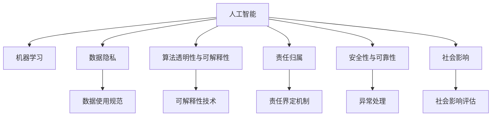

                 

# 人机协作：伦理规范与准则

> 关键词：人机协作, 伦理规范, 人工智能, 机器学习, 数据隐私, 责任分配, 安全与可解释性, 社会影响

## 1. 背景介绍

### 1.1 问题由来

随着人工智能(AI)技术的发展，机器在决策、处理和创造方面的能力不断增强，尤其在自然语言处理、计算机视觉、机器人等领域取得了显著的进展。然而，这些技术的广泛应用带来了许多新挑战，其中最重要的之一便是如何确保机器的决策和行为与人类社会的伦理规范和价值观相一致。

人机协作的伦理问题涉及广泛，包括但不限于数据隐私保护、算法决策透明性、责任归属、安全与可解释性、对社会和经济的影响等。随着AI技术的普及，这些伦理挑战愈发凸显，迫切需要一套系统化的伦理规范和准则来指导AI系统的设计和应用。

### 1.2 问题核心关键点

1. **数据隐私**：在数据收集、存储和使用过程中，如何保护个人隐私不被滥用。
2. **算法透明性与可解释性**：如何确保AI模型的决策过程可被理解和解释，避免"黑箱"效应。
3. **责任归属**：在AI系统出错时，如何界定责任，是算法开发者、使用者的责任，还是AI系统自身的责任？
4. **安全性与可靠性**：AI系统是否具备应对各种异常情况的能力，保证系统的稳定运行和用户的安全。
5. **社会影响**：AI技术如何影响就业、教育、医疗等领域，如何确保其对社会的正面影响。

### 1.3 问题研究意义

制定AI伦理规范和准则，对于保障个人权益、维护社会公平、促进技术健康发展具有重要意义：

1. **保护用户隐私**：通过明确数据使用范围和保护措施，减少用户隐私泄露的风险。
2. **提升算法透明度**：使AI决策过程透明，便于用户和监管机构理解和监督。
3. **明确责任归属**：在出现问题时，有明确的责任归属机制，便于追究责任和法律诉讼。
4. **保障系统安全**：确保AI系统在异常情况下的可靠性和安全性，防止系统滥用或失控。
5. **减轻社会影响**：通过伦理约束，促进AI技术健康发展，避免对社会造成负面影响。

## 2. 核心概念与联系

### 2.1 核心概念概述

为了更好地理解人机协作的伦理规范和准则，我们将探讨以下几个核心概念及其相互联系：

1. **人工智能(AI)**：指模拟人类智能过程的计算机系统，包括学习、推理、感知、决策等能力。
2. **机器学习(ML)**：指利用数据和算法，使计算机从经验中学习并提高性能的过程。
3. **数据隐私(Data Privacy)**：指个人数据的保护，确保数据在收集、存储和使用过程中不被滥用。
4. **算法透明性与可解释性(Transparency & Interpretability)**：指AI模型的决策过程可被理解和解释，避免"黑箱"效应。
5. **责任归属(Responsibility)**：指在AI系统出错时，如何界定责任，是算法开发者、使用者的责任，还是AI系统自身的责任？
6. **安全性与可靠性(Security & Reliability)**：指AI系统是否具备应对各种异常情况的能力，保证系统的稳定运行和用户的安全。
7. **社会影响(Social Impact)**：指AI技术如何影响就业、教育、医疗等领域，如何确保其对社会的正面影响。

这些核心概念之间的逻辑关系可以通过以下Mermaid流程图来展示：



这个流程图展示了AI、ML、数据隐私、透明性与可解释性、责任归属、安全性和社会影响等核心概念及其之间的联系。

## 3. 核心算法原理 & 具体操作步骤

### 3.1 算法原理概述

人机协作的伦理规范和准则，本质上是一套用于指导AI系统设计和应用的伦理框架。它不仅涉及技术层面，还包括法律、伦理、社会等多个维度。在制定伦理规范和准则时，通常包括以下几个关键步骤：

1. **伦理分析**：评估AI系统对个人和社会可能产生的影响，识别潜在风险和伦理问题。
2. **伦理设计**：在AI系统设计和开发阶段，融入伦理考量，确保系统设计符合伦理规范。
3. **伦理测试**：在AI系统测试和验证阶段，应用伦理测试，确保系统符合伦理规范和准则。
4. **伦理监管**：在AI系统部署和使用阶段，实施伦理监管，确保系统持续符合伦理规范和准则。

### 3.2 算法步骤详解

制定人机协作伦理规范和准则的具体步骤如下：

**Step 1: 伦理分析**
- 识别AI系统的潜在风险和伦理问题，如数据隐私泄露、算法偏见、决策透明性等。
- 评估AI系统对个人和社会的影响，包括对就业、教育、医疗等领域的影响。
- 确定AI系统的决策过程是否符合伦理规范和准则。

**Step 2: 伦理设计**
- 在AI系统设计和开发阶段，融入伦理考量，如数据隐私保护、算法透明性、责任归属等。
- 确保AI系统的设计符合伦理规范和准则，如通过使用公平算法、透明决策路径等。
- 建立伦理审核机制，确保AI系统在设计阶段即符合伦理规范。

**Step 3: 伦理测试**
- 在AI系统测试和验证阶段，应用伦理测试，如隐私泄露测试、算法偏见测试等。
- 使用伦理测试工具和指标，评估AI系统的伦理表现，识别和修复潜在问题。
- 确保AI系统的测试符合伦理规范和准则，如数据使用规范、决策透明性等。

**Step 4: 伦理监管**
- 在AI系统部署和使用阶段，实施伦理监管，确保系统持续符合伦理规范和准则。
- 建立伦理监控机制，实时监测AI系统的运行情况，及时发现和修复伦理问题。
- 制定伦理责任机制，明确AI系统在出现问题时的责任归属。

### 3.3 算法优缺点

人机协作伦理规范和准则具有以下优点：
1. 提升系统透明度和可解释性，增强用户信任和监管能力。
2. 明确责任归属，便于追究责任和法律诉讼。
3. 保障数据隐私和安全，保护用户权益。
4. 减轻社会影响，促进技术健康发展。

同时，该方法也存在以下局限性：
1. 设计复杂，需要跨学科的合作。
2. 伦理规范和准则可能存在争议，难以达成共识。
3. 实施成本高，需要额外的资源和时间。
4. 伦理测试和监管可能需要复杂的工具和技术支持。

尽管存在这些局限性，但就目前而言，基于伦理规范和准则的设计和应用，仍是确保AI系统符合社会伦理和法律要求的重要手段。未来相关研究的重点在于如何进一步简化伦理规范和准则的设计和实施过程，同时确保其全面性和可操作性。

### 3.4 算法应用领域

人机协作伦理规范和准则在AI技术的广泛应用领域具有重要意义，包括但不限于以下几个方面：

1. **医疗健康**：确保AI系统在医疗决策中的伦理合规性，保护患者隐私，避免算法偏见。
2. **金融服务**：确保AI系统在金融交易、风险评估等过程中的透明性和可解释性，保护用户财务安全。
3. **司法领域**：确保AI系统在司法判决中的伦理合规性，避免算法偏见，保障司法公正。
4. **教育培训**：确保AI系统在教育培训中的透明性和可解释性，保护学生隐私，避免算法偏见。
5. **就业招聘**：确保AI系统在招聘过程中符合伦理规范，避免歧视，保护求职者权益。
6. **智能交通**：确保AI系统在智能交通管理中的透明性和安全性，保护行人、驾驶员和乘客的安全。
7. **环境保护**：确保AI系统在环境保护中的应用符合伦理规范，保护自然环境和生物多样性。

以上领域只是冰山一角，随着AI技术的广泛应用，伦理规范和准则将涵盖更多行业和领域，以应对随之而来的伦理挑战。

## 4. 数学模型和公式 & 详细讲解 & 举例说明

### 4.1 数学模型构建

人机协作伦理规范和准则的构建，通常需要考虑多个维度的指标，包括但不限于数据隐私、透明性、责任归属、安全性和社会影响等。以下我们将通过一个简单的数学模型来展示如何综合这些指标：

设AI系统的伦理得分为一个向量 $E=\{E_1, E_2, \dots, E_n\}$，其中 $E_i$ 表示第 $i$ 个指标的评分。假设每个指标的评分范围为 $[0,1]$，则伦理得分 $E$ 的计算公式为：

$$
E = \sum_{i=1}^n w_i \times E_i
$$

其中 $w_i$ 表示第 $i$ 个指标的权重，根据实际需求和重要性进行调整。

### 4.2 公式推导过程

上述公式的推导过程如下：

1. 定义每个指标 $E_i$ 的评分，范围为 $[0,1]$。
2. 根据实际需求，为每个指标 $E_i$ 设定权重 $w_i$。
3. 计算伦理得分 $E$，表示AI系统的整体伦理表现。

### 4.3 案例分析与讲解

以智能医疗系统为例，我们可以定义以下几个指标：

- **数据隐私**：评分范围 $[0,1]$，权重大。
- **算法透明性**：评分范围 $[0,1]$，权重大。
- **责任归属**：评分范围 $[0,1]$，权重中。
- **安全性**：评分范围 $[0,1]$，权重中。
- **社会影响**：评分范围 $[0,1]$，权重小。

假设智能医疗系统在数据隐私、算法透明性、责任归属、安全性、社会影响方面的评分分别为 $E_1=0.9$, $E_2=0.8$, $E_3=0.7$, $E_4=0.6$, $E_5=0.5$，则伦理得分 $E$ 为：

$$
E = 0.6 \times 0.9 + 0.3 \times 0.8 + 0.1 \times 0.7 + 0.1 \times 0.6 + 0.1 \times 0.5 = 0.798
$$

这个公式展示了如何通过多个指标的综合评分来评估AI系统的伦理表现，并根据实际需求调整各个指标的权重，确保伦理得分的公平性和合理性。

## 5. 项目实践：代码实例和详细解释说明

### 5.1 开发环境搭建

在进行人机协作伦理规范和准则的项目实践时，首先需要准备好开发环境。以下是使用Python进行Pandas和NumPy开发的環境配置流程：

1. 安装Anaconda：从官网下载并安装Anaconda，用于创建独立的Python环境。

2. 创建并激活虚拟环境：
```bash
conda create -n ethics-env python=3.8 
conda activate ethics-env
```

3. 安装Pandas和NumPy：
```bash
pip install pandas numpy
```

4. 安装Scikit-learn：
```bash
pip install scikit-learn
```

完成上述步骤后，即可在`ethics-env`环境中开始项目实践。

### 5.2 源代码详细实现

下面以一个简单的AI系统为例，展示如何通过Python和NumPy实现伦理得分的计算。

首先，定义数据隐私、透明性、责任归属、安全性和社会影响等指标的评分：

```python
import numpy as np

# 定义指标评分
data_privacy_score = 0.9
algorithm_transparency_score = 0.8
responsibility_score = 0.7
security_score = 0.6
social_impact_score = 0.5
```

然后，定义各个指标的权重：

```python
# 定义权重
data_privacy_weight = 0.6
algorithm_transparency_weight = 0.3
responsibility_weight = 0.1
security_weight = 0.1
social_impact_weight = 0.1
```

接着，计算伦理得分：

```python
# 计算伦理得分
ethics_score = (data_privacy_score * data_privacy_weight +
               algorithm_transparency_score * algorithm_transparency_weight +
               responsibility_score * responsibility_weight +
               security_score * security_weight +
               social_impact_score * social_impact_weight)

print("AI系统的伦理得分：", ethics_score)
```

运行代码后，即可输出AI系统的伦理得分。

### 5.3 代码解读与分析

让我们再详细解读一下关键代码的实现细节：

**定义指标评分**：
- 使用NumPy定义各指标的评分，评分范围在 $[0,1]$ 之间，权重大表示该指标的重要性更高。

**定义权重**：
- 使用NumPy定义各个指标的权重，权重范围在 $[0,1]$ 之间，权重大表示该指标对伦理得分的贡献更大。

**计算伦理得分**：
- 通过乘法累加的方式，计算伦理得分，确保伦理得分的公平性和合理性。

**输出伦理得分**：
- 使用Python的print函数，输出AI系统的伦理得分，供用户和监管机构参考。

这个代码实例展示了如何使用Python和NumPy实现伦理得分的计算，为AI系统的伦理评估提供了一个简单的工具。

## 6. 实际应用场景

### 6.1 医疗健康

在智能医疗领域，AI系统的伦理合规性至关重要。例如，一个用于诊断影像的AI系统，需要确保其在数据隐私保护、算法透明性、责任归属、安全性和社会影响等方面符合伦理规范和准则。通过构建伦理得分模型，可以实时评估和监控AI系统的伦理表现，确保其在医疗决策中的可靠性、透明性和公正性。

### 6.2 金融服务

在金融服务领域，AI系统的伦理合规性同样重要。例如，一个用于信用评分的AI系统，需要确保其在数据隐私保护、算法透明性、责任归属、安全性和社会影响等方面符合伦理规范和准则。通过构建伦理得分模型，可以实时评估和监控AI系统的伦理表现，确保其在金融决策中的透明性和公正性。

### 6.3 司法领域

在司法领域，AI系统的伦理合规性直接关系到司法公正。例如，一个用于辅助司法判决的AI系统，需要确保其在数据隐私保护、算法透明性、责任归属、安全性和社会影响等方面符合伦理规范和准则。通过构建伦理得分模型，可以实时评估和监控AI系统的伦理表现，确保其在司法判决中的可靠性和公正性。

### 6.4 未来应用展望

随着AI技术的广泛应用，伦理规范和准则的应用范围将不断扩大，涵盖更多行业和领域。未来，伦理规范和准则将在以下方面发挥重要作用：

1. **智能交通**：确保AI系统在智能交通管理中的透明性和安全性，保护行人、驾驶员和乘客的安全。
2. **环境保护**：确保AI系统在环境保护中的应用符合伦理规范，保护自然环境和生物多样性。
3. **教育培训**：确保AI系统在教育培训中的透明性和可解释性，保护学生隐私，避免算法偏见。
4. **就业招聘**：确保AI系统在招聘过程中符合伦理规范，避免歧视，保护求职者权益。
5. **智能家居**：确保AI系统在智能家居中的应用符合伦理规范，保护用户隐私，避免滥用。
6. **公共安全**：确保AI系统在公共安全领域的应用符合伦理规范，保护公民隐私，避免滥用。

## 7. 工具和资源推荐

### 7.1 学习资源推荐

为了帮助开发者系统掌握人机协作伦理规范和准则的理论基础和实践技巧，这里推荐一些优质的学习资源：

1. **《人工智能伦理与规范》**：由知名AI伦理专家撰写，全面介绍了人工智能伦理的基本概念和应用案例。
2. **《人工智能法律与伦理》**：介绍了AI技术在法律和伦理方面的挑战和应对策略，供开发者和政策制定者参考。
3. **《AI伦理与隐私保护》**：详细讨论了AI技术在数据隐私保护方面的挑战和解决方案，供开发者参考。
4. **《AI系统透明性与可解释性》**：介绍了如何实现AI系统的透明性和可解释性，供开发者和监管机构参考。
5. **《AI伦理设计与实践》**：提供了大量实用的伦理设计案例，供开发者参考。

通过对这些资源的学习实践，相信你一定能够快速掌握人机协作伦理规范和准则的精髓，并用于解决实际的AI问题。

### 7.2 开发工具推荐

高效的开发离不开优秀的工具支持。以下是几款用于AI伦理规范和准则开发的常用工具：

1. **Python**：作为当前最流行的编程语言之一，Python具有简洁的语法和丰富的库支持，适合进行AI伦理分析、设计和测试。
2. **NumPy**：作为Python的核心科学计算库，NumPy提供了高效的数组操作和数学函数，适合进行复杂的数值计算和数据分析。
3. **Pandas**：作为Python的数据处理库，Pandas提供了强大的数据结构和数据操作功能，适合进行数据分析和处理。
4. **Scikit-learn**：作为Python的机器学习库，Scikit-learn提供了丰富的机器学习算法和工具，适合进行模型训练和评估。
5. **TensorFlow**：由Google主导开发的深度学习框架，生产部署方便，适合进行大规模的AI应用开发。

合理利用这些工具，可以显著提升AI伦理规范和准则的开发效率，加快创新迭代的步伐。

### 7.3 相关论文推荐

人机协作伦理规范和准则的发展源于学界的持续研究。以下是几篇奠基性的相关论文，推荐阅读：

1. **《人工智能伦理与社会影响》**：探讨了AI技术在社会各个领域的应用和影响，提出了一些伦理原则和规范。
2. **《AI系统的透明性与可解释性》**：介绍了实现AI系统透明性和可解释性的方法，强调了透明性和可解释性在AI应用中的重要性。
3. **《AI系统的责任归属与法律问题》**：讨论了AI系统在出错时的责任归属问题，提出了一些法律框架和解决方案。
4. **《数据隐私保护与伦理规范》**：探讨了数据隐私保护的基本概念和伦理规范，提出了一些保护数据隐私的方法。
5. **《伦理设计与AI技术的协同发展》**：讨论了伦理设计在AI技术发展中的作用，提出了一些伦理设计方法。

这些论文代表了大规模人机协作伦理规范和准则的发展脉络。通过学习这些前沿成果，可以帮助研究者把握学科前进方向，激发更多的创新灵感。

## 8. 总结：未来发展趋势与挑战

### 8.1 总结

本文对人机协作的伦理规范和准则进行了全面系统的介绍。首先阐述了人机协作伦理规范和准则的研究背景和意义，明确了其在保障AI系统伦理合规性方面的重要价值。其次，从原理到实践，详细讲解了伦理规范和准则的构建过程，包括伦理分析、伦理设计、伦理测试和伦理监管等关键步骤，并给出了一个简单的伦理得分计算公式。最后，本文探讨了伦理规范和准则在医疗健康、金融服务、司法领域等实际应用场景中的重要性和未来应用展望。

通过本文的系统梳理，可以看到，人机协作伦理规范和准则已经成为确保AI系统符合社会伦理和法律要求的重要手段。这些规范和准则不仅涉及技术层面，还包括法律、伦理、社会等多个维度，为AI技术的发展和应用提供了全方位的保障。

### 8.2 未来发展趋势

展望未来，人机协作伦理规范和准则将呈现以下几个发展趋势：

1. **伦理分析工具的普及**：随着AI技术的应用越来越广泛，伦理分析工具的普及将成为趋势，帮助开发者在系统设计和开发阶段识别和解决伦理问题。
2. **伦理设计的标准化**：伦理设计的标准化将成为趋势，帮助开发者在系统设计和开发阶段遵循统一的伦理规范和准则，确保系统的透明性和可解释性。
3. **伦理测试的自动化**：伦理测试的自动化将成为趋势，通过自动化工具和指标，实时监测和评估AI系统的伦理表现，确保系统的透明性和公正性。
4. **伦理监管的智能化**：伦理监管的智能化将成为趋势，通过智能化工具和算法，实时监测和评估AI系统的伦理表现，及时发现和修复伦理问题。
5. **伦理教育与培训**：伦理教育与培训将成为趋势，通过培训和教育，提高开发者和用户的伦理意识和能力，确保AI系统的伦理合规性。

以上趋势凸显了人机协作伦理规范和准则的广阔前景。这些方向的探索发展，必将进一步提升AI系统的伦理合规性，保障其健康发展和应用。

### 8.3 面临的挑战

尽管人机协作伦理规范和准则已经取得了一定的进展，但在迈向更加智能化、普适化应用的过程中，仍面临诸多挑战：

1. **伦理规范和准则的制定**：制定全面的伦理规范和准则需要跨学科的合作，包括伦理学家、法律专家、技术开发者等。制定过程中可能存在争议，难以达成共识。
2. **伦理规范和准则的实施**：伦理规范和准则的实施需要额外的资源和时间，包括伦理测试和监管工具的开发和应用。实施成本高，可能导致一些中小型企业难以负担。
3. **伦理规范和准则的动态调整**：随着技术和社会环境的变化，伦理规范和准则需要动态调整，以应对新的伦理挑战。调整过程复杂，需要持续的投入和维护。
4. **伦理规范和准则的普及度**：伦理规范和准则的普及度较低，导致一些开发者和用户对伦理规范和准则的重视程度不够，可能存在伦理风险。
5. **伦理规范和准则的全球一致性**：不同国家和地区的法律和伦理规范可能存在差异，如何在全球范围内达成一致的伦理规范和准则，也是一个重要挑战。

### 8.4 研究展望

面对人机协作伦理规范和准则所面临的种种挑战，未来的研究需要在以下几个方面寻求新的突破：

1. **跨学科合作**：加强伦理学家、法律专家、技术开发者等多学科的合作，制定全面、合理的伦理规范和准则。
2. **自动化工具开发**：开发自动化工具和指标，简化伦理规范和准则的制定和实施过程，降低实施成本。
3. **动态调整机制**：建立动态调整机制，实时监测和评估AI系统的伦理表现，及时发现和修复伦理问题。
4. **普及教育与培训**：通过教育与培训，提高开发者和用户的伦理意识和能力，确保AI系统的伦理合规性。
5. **全球一致性研究**：开展全球一致性研究，在不同国家和地区之间达成一致的伦理规范和准则，促进国际合作。

这些研究方向和突破，必将为人机协作伦理规范和准则的发展提供新的动力，为AI技术的健康发展和应用提供强有力的保障。

## 9. 附录：常见问题与解答

**Q1：人机协作伦理规范和准则是否适用于所有AI应用？**

A: 人机协作伦理规范和准则在大多数AI应用中都有重要意义，尤其适用于涉及敏感数据、决策透明度、责任归属、安全性和社会影响的场景。例如，医疗、金融、司法等领域，这些伦理规范和准则能够有效保障用户权益和系统公正性。对于不涉及这些关键因素的应用，也可以参考相关伦理规范和准则，进行伦理评估和改进。

**Q2：如何评估AI系统的伦理表现？**

A: 评估AI系统的伦理表现通常需要综合考虑多个维度的指标，如数据隐私、算法透明性、责任归属、安全性和社会影响等。通过构建伦理得分模型，可以实时评估和监控AI系统的伦理表现，确保其符合伦理规范和准则。具体评估方法包括：

1. **伦理得分计算**：根据定义的伦理指标和权重，计算AI系统的伦理得分，评估其整体伦理表现。
2. **伦理测试工具**：使用专门的工具和指标，对AI系统的各个方面进行伦理测试，识别和修复潜在问题。
3. **伦理监管机制**：建立伦理监管机制，实时监测AI系统的运行情况，及时发现和修复伦理问题。

**Q3：在AI系统中如何实现算法透明性与可解释性？**

A: 实现算法透明性与可解释性通常需要以下步骤：

1. **选择合适的透明性技术**：使用符号化推理、可视化技术、可解释性工具等，将AI系统的决策过程可视化或解释化。
2. **提供决策依据**：在AI系统的输出中，提供决策依据和解释信息，解释AI系统如何得出结论。
3. **进行透明性测试**：使用透明性测试工具和指标，评估AI系统的透明性和可解释性。

**Q4：在AI系统中如何处理数据隐私问题？**

A: 处理数据隐私问题通常需要以下步骤：

1. **数据匿名化**：对敏感数据进行匿名化处理，防止个人隐私泄露。
2. **数据加密**：对敏感数据进行加密处理，保护数据安全。
3. **数据访问控制**：严格控制数据的访问权限，防止未经授权的访问和滥用。
4. **数据使用规范**：制定数据使用的规范和标准，明确数据的使用范围和目的。

**Q5：在AI系统中如何处理责任归属问题？**

A: 处理责任归属问题通常需要以下步骤：

1. **明确责任界定机制**：制定明确的责任界定机制，明确AI系统在出错时的责任归属。
2. **建立责任追溯机制**：建立责任追溯机制，及时发现和修复问题。
3. **进行责任培训**：对开发者和用户进行责任培训，提高其责任意识和能力。

这些常见问题的解答，帮助开发者和用户更好地理解人机协作伦理规范和准则的实际应用，确保AI系统的伦理合规性。

---

作者：禅与计算机程序设计艺术 / Zen and the Art of Computer Programming

