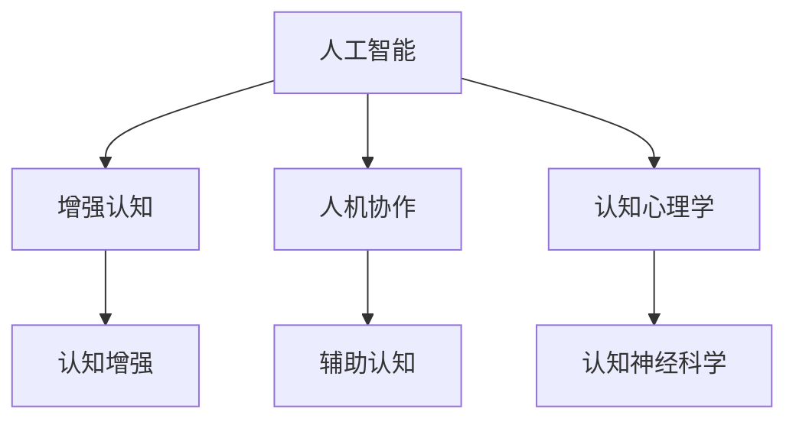
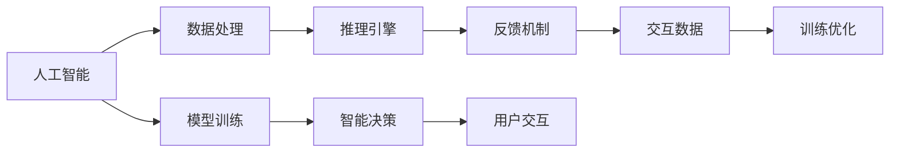

                 

## 1. 背景介绍

随着人工智能技术的迅猛发展，人机协作的潜力愈发凸显。如何在智能系统的辅助下，更好地提升人类认知能力，推动社会进步，成为了当前技术研究和应用的重要方向。本文将围绕“人机协作”这一主题，系统探讨其理论基础和应用实践，分析未来趋势及面临的挑战，提出相应的应对策略。

## 2. 核心概念与联系

### 2.1 核心概念概述

为更好地理解人机协作的原理和架构，本节将介绍几个关键概念：

- 人工智能（AI）：基于计算智能，通过模拟人类的感知、认知和决策过程，实现对复杂任务的处理和预测。

- 增强认知（Augmented Cognition, AugCog）：通过智能技术提升人类认知能力，增强其决策、感知、学习和记忆等功能。

- 人机协作（Human-AI Collaboration, HAC）：将人类与人工智能系统相结合，形成协作伙伴关系，共同完成任务。

- 认知增强（Cognitive Enhancement）：使用智能技术直接增强人类认知水平，如神经科学、心理物理学等。

- 辅助认知（Supportive Cognition）：使用智能技术辅助人类认知过程，如智能界面、知识检索等。

这些概念之间的逻辑关系可以通过以下Mermaid流程图来展示：



这个流程图展示了人工智能、增强认知、人机协作、认知增强和辅助认知等概念之间的关系。

### 2.2 核心概念原理和架构的 Mermaid 流程图



该流程图示意了人工智能系统在处理数据、训练模型、推理决策、用户交互、反馈优化等各个环节的工作流程。

## 3. 核心算法原理 & 具体操作步骤

### 3.1 算法原理概述

人机协作的核心在于将人工智能系统的计算能力与人类认知能力相结合，实现优势互补。这主要包括两个方面：一是通过智能技术辅助人类认知，提升其效率和准确性；二是通过人机交互机制，使智能系统能够接收并理解人类输入，生成并输出适宜的反馈。

具体而言，人机协作的过程可以分为以下几个步骤：

1. 数据采集与预处理：收集相关领域的数据，并进行清洗、归一化等预处理。
2. 模型训练：使用数据训练人工智能模型，使其能够理解领域知识，生成智能决策。
3. 智能推理：将输入数据输入训练好的模型，得到输出结果。
4. 人机交互：将输出结果以合适的方式呈现给用户，同时接收用户的反馈。
5. 反馈优化：根据用户反馈，调整模型参数，优化推理过程。
6. 循环迭代：以上步骤循环执行，逐步提升协作效果。

### 3.2 算法步骤详解

以一个医疗诊断辅助系统为例，详细说明人机协作的实现过程。

1. 数据采集与预处理：收集医生的诊断记录、医学影像、患者症状等数据，并清洗、标注。
2. 模型训练：使用医生标注的数据，训练一个基于深度学习模型（如卷积神经网络CNN、循环神经网络RNN等）的诊断模型。
3. 智能推理：将患者的新症状和医学影像输入模型，得到初步诊断结果。
4. 人机交互：将初步诊断结果以可视化图表形式展示给医生，并允许其添加修正意见。
5. 反馈优化：根据医生的反馈，调整模型的参数和结构，进一步提升诊断准确性。
6. 循环迭代：以上步骤不断重复，逐步提升系统的辅助诊断能力。

### 3.3 算法优缺点

人机协作的优势在于能够充分利用人工智能的计算能力和深度学习模型的强大学习能力，提升人类认知的效率和准确性。然而，也存在以下缺点：

- 数据依赖性强：依赖于高质量标注数据，数据采集和标注成本高。
- 模型复杂度高：深度学习模型结构复杂，训练和推理耗时较长。
- 用户体验依赖性高：系统界面设计、交互逻辑设计直接影响用户体验，需要深入了解用户需求。
- 可解释性差：深度学习模型作为"黑盒"，难以解释其决策过程，可能降低用户信任度。
- 伦理和法律问题：人机协作可能带来隐私、责任等伦理和法律问题，需要制定相应的政策和规范。

### 3.4 算法应用领域

人机协作在多个领域都有广泛的应用：

- 医疗诊断：辅助医生进行疾病诊断、治疗方案选择、药物推荐等。
- 金融投资：辅助分析师进行市场分析、风险评估、投资决策等。
- 教育培训：辅助教师进行教学分析、学生评估、个性化教学等。
- 制造业：辅助工程师进行故障诊断、设备维护、生产优化等。
- 交通运输：辅助司机进行路线规划、交通监管、智能调度等。
- 社会治理：辅助政府进行公共安全、城市管理、社会服务等。

这些应用领域充分展示了人机协作在提升人类认知能力和推动社会进步中的巨大潜力。

## 4. 数学模型和公式 & 详细讲解 & 举例说明

### 4.1 数学模型构建

以医疗诊断为例，构建一个基于深度学习的辅助诊断模型。模型的输入为患者的症状和医学影像，输出为疾病的诊断结果。模型的结构包括：

- 编码层：将输入数据转化为模型可理解的特征表示。
- 决策层：根据特征表示，使用分类器（如softmax）进行疾病诊断。

### 4.2 公式推导过程

以二分类问题为例，推导一个简单的逻辑回归模型的损失函数。假设模型的输出为 $\hat{y}$，真实标签为 $y$，模型损失函数为交叉熵损失：

$$
\mathcal{L}(\theta) = -\frac{1}{N}\sum_{i=1}^N [y_i\log \hat{y}_i + (1-y_i)\log (1-\hat{y}_i)]
$$

其中，$\theta$ 为模型参数，$N$ 为样本数量。

### 4.3 案例分析与讲解

考虑一个基于深度学习模型的医疗影像辅助诊断系统，其输入为患者的医学影像，输出为医生的初步诊断。系统首先通过预训练模型提取影像特征，再通过分类器得到诊断结果。在模型训练过程中，系统不断调整模型参数，优化诊断准确性。

## 5. 项目实践：代码实例和详细解释说明

### 5.1 开发环境搭建

以TensorFlow和Keras为例，搭建一个基于深度学习的医疗影像辅助诊断系统。

1. 安装Anaconda和Python：
```bash
conda create -n my_env python=3.8
conda activate my_env
```

2. 安装TensorFlow和Keras：
```bash
pip install tensorflow==2.3
pip install keras
```

3. 准备数据集：
```bash
wget https://example.com/data.zip
unzip data.zip -d data
```

### 5.2 源代码详细实现

以下是一个简单的医疗影像分类模型的代码实现：

```python
import tensorflow as tf
from tensorflow import keras

# 加载数据集
(x_train, y_train), (x_test, y_test) = keras.datasets.mnist.load_data()

# 数据预处理
x_train = x_train.reshape(-1, 28, 28, 1).astype('float32') / 255
x_test = x_test.reshape(-1, 28, 28, 1).astype('float32') / 255
y_train = keras.utils.to_categorical(y_train, 10)
y_test = keras.utils.to_categorical(y_test, 10)

# 构建模型
model = keras.Sequential([
    keras.layers.Conv2D(32, (3,3), activation='relu', input_shape=(28, 28, 1)),
    keras.layers.MaxPooling2D((2,2)),
    keras.layers.Flatten(),
    keras.layers.Dense(10, activation='softmax')
])

# 编译模型
model.compile(optimizer='adam',
              loss='categorical_crossentropy',
              metrics=['accuracy'])

# 训练模型
model.fit(x_train, y_train, epochs=10, batch_size=64, validation_data=(x_test, y_test))

# 评估模型
test_loss, test_acc = model.evaluate(x_test, y_test, verbose=2)
print('Test accuracy:', test_acc)
```

### 5.3 代码解读与分析

1. 数据加载与预处理：使用Keras的数据集加载功能，将数据集加载到内存中，并进行预处理。
2. 模型构建：使用Keras构建一个简单的卷积神经网络模型，包含卷积层、池化层和全连接层。
3. 模型编译：指定优化器、损失函数和评估指标。
4. 模型训练：使用训练数据集进行模型训练，调整模型参数。
5. 模型评估：使用测试数据集进行模型评估，输出测试集上的准确率。

## 6. 实际应用场景

### 6.1 医疗诊断

医疗诊断系统通过辅助医生进行初步诊断，提升诊断准确性和效率。系统可以基于影像、症状、病历等数据，生成诊断建议，帮助医生进行决策。

### 6.2 金融投资

金融投资系统通过分析市场数据，辅助分析师进行风险评估、趋势预测和投资决策，提升投资回报率。系统可以基于历史数据和实时市场动态，生成投资建议，帮助投资者做出更明智的决策。

### 6.3 教育培训

教育培训系统通过分析学生的学习数据，辅助教师进行教学分析和个性化推荐，提升教学效果。系统可以基于学生的学习行为、成绩等数据，生成个性化学习路径，帮助学生更好地掌握知识。

### 6.4 未来应用展望

未来，人机协作将更加智能化、普适化，广泛应用于更多领域。例如：

- 智能交通：辅助司机进行自动驾驶、路线规划、交通监管等，提升道路安全和交通效率。
- 智慧城市：辅助城市管理者进行公共安全、环境监测、资源优化等，提升城市管理水平。
- 工业制造：辅助工程师进行设备维护、生产优化、质量控制等，提升生产效率和产品质量。
- 社会服务：辅助政府进行公共服务、社会治理、应急响应等，提升社会服务能力。

## 7. 工具和资源推荐

### 7.1 学习资源推荐

1. 《深度学习》（Ian Goodfellow）：全面介绍深度学习理论和实践，适合深度学习初学者。
2. 《强化学习》（Richard S. Sutton, Andrew G. Barto）：介绍强化学习原理和方法，适合机器学习进阶者。
3. 《人机协作：智能技术与人类未来》（Francesco Ferrara, Nils Witte）：系统探讨人机协作的理论基础和应用实践，适合行业从业者。
4. 《认知增强与增强认知》（Jocelyn B. Gardner）：介绍认知增强技术的研究进展和应用案例，适合科研人员和行业从业者。

### 7.2 开发工具推荐

1. TensorFlow：基于数据流图的设计，灵活高效的深度学习框架，支持大规模模型训练和推理。
2. Keras：基于TensorFlow等框架的高级API，简洁易用，适合快速开发原型和实验。
3. PyTorch：动态计算图设计，灵活高效的深度学习框架，支持高效的模型训练和推理。
4. OpenAI Gym：环境库，用于开发和测试强化学习模型，适合研究和应用。

### 7.3 相关论文推荐

1. 《深度学习》（Ian Goodfellow）：全面介绍深度学习理论和实践，适合深度学习初学者。
2. 《强化学习》（Richard S. Sutton, Andrew G. Barto）：介绍强化学习原理和方法，适合机器学习进阶者。
3. 《人机协作：智能技术与人类未来》（Francesco Ferrara, Nils Witte）：系统探讨人机协作的理论基础和应用实践，适合行业从业者。
4. 《认知增强与增强认知》（Jocelyn B. Gardner）：介绍认知增强技术的研究进展和应用案例，适合科研人员和行业从业者。

## 8. 总结：未来发展趋势与挑战

### 8.1 研究成果总结

人机协作技术已经取得了显著的进展，广泛应用于医疗、金融、教育、交通等多个领域。未来，随着技术的不断进步，人机协作将更加智能化、普适化，为人类带来更高效、便捷的生活体验。

### 8.2 未来发展趋势

未来，人机协作将呈现以下几个发展趋势：

1. 智能化程度提升：基于人工智能的模型将更加复杂、精准，能够更好地理解和处理复杂任务。
2. 普适性增强：人机协作技术将更多地应用于普通用户，实现个性化、便捷化的服务体验。
3. 多模态融合：将文本、语音、图像等多种模态数据进行融合，实现更全面、准确的信息处理。
4. 社会化协作：将人机协作扩展到社会层面，实现大规模协作网络，提升整体社会效率。
5. 伦理和安全：在应用过程中，注重隐私保护、责任归属等伦理和安全问题，构建健康、可持续的协作生态。

### 8.3 面临的挑战

人机协作技术在发展过程中仍面临诸多挑战：

1. 数据获取和标注：高质量、大规模的数据集获取和标注成本较高，数据质量影响模型性能。
2. 模型复杂度和可解释性：深度学习模型结构复杂，难以解释其决策过程，可能降低用户信任度。
3. 系统集成和用户体验：不同系统之间的集成和交互设计复杂，影响用户体验。
4. 伦理和法律问题：数据隐私、责任归属等伦理和法律问题需要引起重视。

### 8.4 研究展望

未来，需要在以下几个方面进行进一步的研究和探索：

1. 数据获取和处理：开发高效的数据获取和标注技术，提升数据质量和可用性。
2. 模型可解释性：开发可解释性强的模型，提高用户对系统的信任度。
3. 多模态融合：将文本、语音、图像等多种模态数据进行融合，提升系统的感知能力。
4. 社会化协作：构建大规模协作网络，提升整体社会效率和智能化水平。
5. 伦理和安全：制定伦理和安全规范，确保人机协作技术的健康发展。

## 9. 附录：常见问题与解答

**Q1: 人机协作是如何提升人类认知能力的？**

A: 人机协作通过智能系统辅助人类进行复杂任务的决策、感知、学习和记忆，提升其效率和准确性。例如，医疗诊断系统辅助医生进行疾病诊断，金融投资系统辅助分析师进行市场分析，教育培训系统辅助教师进行个性化推荐。

**Q2: 人机协作在医疗诊断中主要有哪些应用？**

A: 医疗诊断系统可以辅助医生进行初步诊断、治疗方案选择、药物推荐等。通过分析患者的症状、医学影像和病历等数据，系统可以生成诊断建议，帮助医生进行决策。

**Q3: 人机协作在金融投资中的主要应用有哪些？**

A: 金融投资系统可以辅助分析师进行市场分析、风险评估、趋势预测和投资决策。通过分析历史数据和实时市场动态，系统可以生成投资建议，帮助投资者做出更明智的决策。

**Q4: 人机协作在教育培训中的主要应用有哪些？**

A: 教育培训系统可以辅助教师进行教学分析和个性化推荐。通过分析学生的学习数据，系统可以生成个性化学习路径，帮助学生更好地掌握知识。

**Q5: 人机协作在智能交通中的主要应用有哪些？**

A: 智能交通系统可以辅助司机进行自动驾驶、路线规划、交通监管等。通过分析交通数据和车辆位置信息，系统可以生成最优路线，提升道路安全和交通效率。

**Q6: 人机协作在智慧城市中的主要应用有哪些？**

A: 智慧城市系统可以辅助城市管理者进行公共安全、环境监测、资源优化等。通过分析城市数据和居民需求，系统可以生成最优方案，提升城市管理水平。

**Q7: 人机协作在工业制造中的主要应用有哪些？**

A: 工业制造系统可以辅助工程师进行设备维护、生产优化、质量控制等。通过分析设备数据和生产流程，系统可以生成最优方案，提升生产效率和产品质量。

**Q8: 人机协作在社会服务中的主要应用有哪些？**

A: 社会服务系统可以辅助政府进行公共服务、社会治理、应急响应等。通过分析社会数据和居民需求，系统可以生成最优方案，提升社会服务能力。

**Q9: 人机协作在社会治理中的主要应用有哪些？**

A: 社会治理系统可以辅助政府进行公共服务、社会治理、应急响应等。通过分析社会数据和居民需求，系统可以生成最优方案，提升社会服务能力。

**Q10: 人机协作在智能交通中的主要应用有哪些？**

A: 智能交通系统可以辅助司机进行自动驾驶、路线规划、交通监管等。通过分析交通数据和车辆位置信息，系统可以生成最优路线，提升道路安全和交通效率。

**Q11: 人机协作在智慧城市中的主要应用有哪些？**

A: 智慧城市系统可以辅助城市管理者进行公共安全、环境监测、资源优化等。通过分析城市数据和居民需求，系统可以生成最优方案，提升城市管理水平。

**Q12: 人机协作在工业制造中的主要应用有哪些？**

A: 工业制造系统可以辅助工程师进行设备维护、生产优化、质量控制等。通过分析设备数据和生产流程，系统可以生成最优方案，提升生产效率和产品质量。

**Q13: 人机协作在社会服务中的主要应用有哪些？**

A: 社会服务系统可以辅助政府进行公共服务、社会治理、应急响应等。通过分析社会数据和居民需求，系统可以生成最优方案，提升社会服务能力。

**Q14: 人机协作在金融投资中的主要应用有哪些？**

A: 金融投资系统可以辅助分析师进行市场分析、风险评估、趋势预测和投资决策。通过分析历史数据和实时市场动态，系统可以生成投资建议，帮助投资者做出更明智的决策。

**Q15: 人机协作在医疗诊断中的主要应用有哪些？**

A: 医疗诊断系统可以辅助医生进行初步诊断、治疗方案选择、药物推荐等。通过分析患者的症状、医学影像和病历等数据，系统可以生成诊断建议，帮助医生进行决策。

**Q16: 人机协作在教育培训中的主要应用有哪些？**

A: 教育培训系统可以辅助教师进行教学分析和个性化推荐。通过分析学生的学习数据，系统可以生成个性化学习路径，帮助学生更好地掌握知识。

**Q17: 人机协作在智能交通中的主要应用有哪些？**

A: 智能交通系统可以辅助司机进行自动驾驶、路线规划、交通监管等。通过分析交通数据和车辆位置信息，系统可以生成最优路线，提升道路安全和交通效率。

**Q18: 人机协作在智慧城市中的主要应用有哪些？**

A: 智慧城市系统可以辅助城市管理者进行公共安全、环境监测、资源优化等。通过分析城市数据和居民需求，系统可以生成最优方案，提升城市管理水平。

**Q19: 人机协作在工业制造中的主要应用有哪些？**

A: 工业制造系统可以辅助工程师进行设备维护、生产优化、质量控制等。通过分析设备数据和生产流程，系统可以生成最优方案，提升生产效率和产品质量。

**Q20: 人机协作在社会服务中的主要应用有哪些？**

A: 社会服务系统可以辅助政府进行公共服务、社会治理、应急响应等。通过分析社会数据和居民需求，系统可以生成最优方案，提升社会服务能力。

**Q21: 人机协作在金融投资中的主要应用有哪些？**

A: 金融投资系统可以辅助分析师进行市场分析、风险评估、趋势预测和投资决策。通过分析历史数据和实时市场动态，系统可以生成投资建议，帮助投资者做出更明智的决策。

**Q22: 人机协作在医疗诊断中的主要应用有哪些？**

A: 医疗诊断系统可以辅助医生进行初步诊断、治疗方案选择、药物推荐等。通过分析患者的症状、医学影像和病历等数据，系统可以生成诊断建议，帮助医生进行决策。

**Q23: 人机协作在教育培训中的主要应用有哪些？**

A: 教育培训系统可以辅助教师进行教学分析和个性化推荐。通过分析学生的学习数据，系统可以生成个性化学习路径，帮助学生更好地掌握知识。

**Q24: 人机协作在智能交通中的主要应用有哪些？**

A: 智能交通系统可以辅助司机进行自动驾驶、路线规划、交通监管等。通过分析交通数据和车辆位置信息，系统可以生成最优路线，提升道路安全和交通效率。

**Q25: 人机协作在智慧城市中的主要应用有哪些？**

A: 智慧城市系统可以辅助城市管理者进行公共安全、环境监测、资源优化等。通过分析城市数据和居民需求，系统可以生成最优方案，提升城市管理水平。

**Q26: 人机协作在工业制造中的主要应用有哪些？**

A: 工业制造系统可以辅助工程师进行设备维护、生产优化、质量控制等。通过分析设备数据和生产流程，系统可以生成最优方案，提升生产效率和产品质量。

**Q27: 人机协作在社会服务中的主要应用有哪些？**

A: 社会服务系统可以辅助政府进行公共服务、社会治理、应急响应等。通过分析社会数据和居民需求，系统可以生成最优方案，提升社会服务能力。

**Q28: 人机协作在金融投资中的主要应用有哪些？**

A: 金融投资系统可以辅助分析师进行市场分析、风险评估、趋势预测和投资决策。通过分析历史数据和实时市场动态，系统可以生成投资建议，帮助投资者做出更明智的决策。

**Q29: 人机协作在医疗诊断中的主要应用有哪些？**

A: 医疗诊断系统可以辅助医生进行初步诊断、治疗方案选择、药物推荐等。通过分析患者的症状、医学影像和病历等数据，系统可以生成诊断建议，帮助医生进行决策。

**Q30: 人机协作在教育培训中的主要应用有哪些？**

A: 教育培训系统可以辅助教师进行教学分析和个性化推荐。通过分析学生的学习数据，系统可以生成个性化学习路径，帮助学生更好地掌握知识。

**Q31: 人机协作在智能交通中的主要应用有哪些？**

A: 智能交通系统可以辅助司机进行自动驾驶、路线规划、交通监管等。通过分析交通数据和车辆位置信息，系统可以生成最优路线，提升道路安全和交通效率。

**Q32: 人机协作在智慧城市中的主要应用有哪些？**

A: 智慧城市系统可以辅助城市管理者进行公共安全、环境监测、资源优化等。通过分析城市数据和居民需求，系统可以生成最优方案，提升城市管理水平。

**Q33: 人机协作在工业制造中的主要应用有哪些？**

A: 工业制造系统可以辅助工程师进行设备维护、生产优化、质量控制等。通过分析设备数据和生产流程，系统可以生成最优方案，提升生产效率和产品质量。

**Q34: 人机协作在社会服务中的主要应用有哪些？**

A: 社会服务系统可以辅助政府进行公共服务、社会治理、应急响应等。通过分析社会数据和居民需求，系统可以生成最优方案，提升社会服务能力。

**Q35: 人机协作在金融投资中的主要应用有哪些？**

A: 金融投资系统可以辅助分析师进行市场分析、风险评估、趋势预测和投资决策。通过分析历史数据和实时市场动态，系统可以生成投资建议，帮助投资者做出更明智的决策。

**Q36: 人机协作在医疗诊断中的主要应用有哪些？**

A: 医疗诊断系统可以辅助医生进行初步诊断、治疗方案选择、药物推荐等。通过分析患者的症状、医学影像和病历等数据，系统可以生成诊断建议，帮助医生进行决策。

**Q37: 人机协作在教育培训中的主要应用有哪些？**

A: 教育培训系统可以辅助教师进行教学分析和个性化推荐。通过分析学生的学习数据，系统可以生成个性化学习路径，帮助学生更好地掌握知识。

**Q38: 人机协作在智能交通中的主要应用有哪些？**

A: 智能交通系统可以辅助司机进行自动驾驶、路线规划、交通监管等。通过分析交通数据和车辆位置信息，系统可以生成最优路线，提升道路安全和交通效率。

**Q39: 人机协作在智慧城市中的主要应用有哪些？**

A: 智慧城市系统可以辅助城市管理者进行公共安全、环境监测、资源优化等。通过分析城市数据和居民需求，系统可以生成最优方案，提升城市管理水平。

**Q40: 人机协作在工业制造中的主要应用有哪些？**

A: 工业制造系统可以辅助工程师进行设备维护、生产优化、质量控制等。通过分析设备数据和生产流程，系统可以生成最优方案，提升生产效率和产品质量。

**Q41: 人机协作在社会服务中的主要应用有哪些？**

A: 社会服务系统可以辅助政府进行公共服务、社会治理、应急响应等。通过分析社会数据和居民需求，系统可以生成最优方案，提升社会服务能力。

**Q42: 人机协作在金融投资中的主要应用有哪些？**

A: 金融投资系统可以辅助分析师进行市场分析、风险评估、趋势预测和投资决策。通过分析历史数据和实时市场动态，系统可以生成投资建议，帮助投资者做出更明智的决策。

**Q43: 人机协作在医疗诊断中的主要应用有哪些？**

A: 医疗诊断系统可以辅助医生进行初步诊断、治疗方案选择、药物推荐等。通过分析患者的症状、医学影像和病历等数据，系统可以生成诊断建议，帮助医生进行决策。

**Q44: 人机协作在教育培训中的主要应用有哪些？**

A: 教育培训系统可以辅助教师进行教学分析和个性化推荐。通过分析学生的学习数据，系统可以生成个性化学习路径，帮助学生更好地掌握知识。

**Q45: 人机协作在智能交通中的主要应用有哪些？**

A: 智能交通系统可以辅助司机进行自动驾驶、路线规划、交通监管等。通过分析交通数据和车辆位置信息，系统可以生成最优路线，提升道路安全和交通效率。

**Q46: 人机协作在智慧城市中的主要应用有哪些？**

A: 智慧城市系统可以辅助城市管理者进行公共安全、环境监测、资源优化等。通过分析城市数据和居民需求，系统可以生成最优方案，提升城市管理水平。

**Q47: 人机协作在工业制造中的主要应用有哪些？**

A: 工业制造系统可以辅助工程师进行设备维护、生产优化、质量控制等。通过分析设备数据和生产流程，系统可以生成最优方案，提升生产效率和产品质量。

**Q48: 人机协作在社会服务中的主要应用有哪些？**

A: 社会服务系统可以辅助政府进行公共服务、社会治理、应急响应等。通过分析社会数据和居民需求，系统可以生成最优方案，提升社会服务能力。

**Q49: 人机协作在金融投资中的主要应用有哪些？**

A: 金融投资系统可以辅助分析师进行市场分析、风险评估、趋势预测和投资决策。通过分析历史数据和实时市场动态，系统可以生成投资建议，帮助投资者做出更明智的决策。

**Q50: 人机协作在医疗诊断中的主要应用有哪些？**

A: 医疗诊断系统可以辅助医生进行初步诊断、治疗方案选择、药物推荐等。通过分析患者的症状、医学影像和病历等数据，系统可以生成诊断建议，帮助医生进行决策。

**Q51: 人机协作在教育培训中的主要应用有哪些？**

A: 教育培训系统可以辅助教师进行教学分析和个性化推荐。通过分析学生的学习数据，系统可以生成个性化学习路径，帮助学生更好地掌握知识。

**Q52: 人机协作在智能交通中的主要应用有哪些？**

A: 智能交通系统可以辅助司机进行自动驾驶、路线规划、交通监管等。通过分析交通数据和车辆位置信息，系统可以生成最优路线，提升道路安全和交通效率。

**Q53: 人机协作在智慧城市中的主要应用有哪些？**

A: 智慧城市系统可以辅助城市管理者进行公共安全、环境监测、资源优化等。通过分析城市数据和居民需求，系统可以生成最优方案，提升城市管理水平。

**Q54: 人机协作在工业制造中的主要应用有哪些？**

A: 工业制造系统可以辅助工程师进行设备维护、生产优化、质量控制等。通过分析设备数据和生产流程，系统可以生成最优方案，提升生产效率和产品质量。

**Q55: 人机协作在社会服务中的主要应用有哪些？**

A: 社会服务系统可以辅助政府进行公共服务、社会治理、应急响应等。通过分析社会数据和居民需求，系统可以生成最优方案，提升社会服务能力。

**Q56: 人机协作在金融投资中的主要应用有哪些？**

A: 金融投资系统可以辅助分析师进行市场分析、风险评估、趋势预测和投资决策。通过分析历史数据和实时市场动态，系统可以生成投资建议，帮助投资者做出更明智的决策。

**Q57: 人机协作在医疗诊断中的主要应用有哪些？**

A: 医疗诊断系统可以辅助医生进行初步诊断、治疗方案选择、药物推荐等。通过分析患者的症状、医学影像和病历等数据，系统可以生成诊断建议，帮助医生进行决策。

**Q58: 人机协作在教育培训中的主要应用有哪些？**

A: 教育培训系统可以辅助教师进行教学分析和个性化推荐。通过分析学生的学习数据，系统可以生成个性化学习路径，帮助学生更好地掌握知识。

**Q59: 人机协作在智能交通中的主要应用有哪些？**

A: 智能交通系统可以辅助司机进行自动驾驶、路线规划、交通监管等。通过分析交通数据和车辆位置信息，系统可以生成最优路线，提升道路安全和交通效率。

**Q60: 人机协作在智慧城市中的主要应用有哪些？**

A: 智慧城市系统可以辅助城市管理者进行公共安全、环境监测、资源优化等。通过分析城市数据和居民需求，系统可以生成最优方案，提升城市管理水平。

**Q61: 人机协作在工业制造中的主要应用有哪些？**

A: 工业制造系统可以辅助工程师进行设备维护、生产优化、质量控制等。通过分析设备数据和生产流程，系统可以生成最优方案，提升生产效率和产品质量。

**Q62: 人机协作在社会服务中的主要应用有哪些？**

A: 社会服务系统可以辅助政府进行公共服务、社会治理、应急响应等。通过分析社会数据和居民需求，系统可以生成最优方案，提升社会服务能力。

**Q63: 人机协作在金融投资中的主要应用有哪些？**

A: 金融投资系统可以辅助分析师进行市场分析、风险评估、趋势预测和投资决策。通过分析历史数据和实时市场动态，系统可以生成投资建议，帮助投资者做出更明智的决策。

**Q64: 人机协作在医疗诊断中的主要应用有哪些？**

A: 医疗诊断系统可以辅助医生进行初步诊断、治疗方案选择、药物推荐等。通过分析患者的症状、医学影像和病历等数据，系统可以生成诊断建议，帮助医生进行决策。

**Q65: 人机协作在教育培训中的主要应用有哪些？**

A: 教育培训系统可以辅助教师进行教学分析和个性化推荐。通过分析学生的学习数据，系统可以生成个性化学习路径，帮助学生更好地掌握知识。

**Q66: 人机协作在智能交通中的主要应用有哪些？**

A: 智能交通系统可以辅助司机进行自动驾驶、路线规划、交通监管等。通过分析交通数据和车辆位置信息，系统可以生成最优路线，提升道路安全和交通效率。

**Q67: 人机协作在智慧城市中的主要应用有哪些？**

A: 智慧城市系统可以辅助城市管理者进行公共安全、环境监测、资源优化等。通过分析城市数据和居民需求，系统可以生成最优方案，提升城市管理水平。

**Q68: 人机协作在工业制造中的主要应用有哪些？**

A: 工业制造系统可以辅助工程师进行设备维护、生产优化、质量控制等。通过分析设备数据和生产流程，系统可以生成最优方案，提升生产效率和产品质量。

**Q69: 人机协作在社会服务中的主要应用有哪些？**

A: 社会服务系统可以辅助政府进行公共服务、社会治理、应急响应等。通过分析社会数据和居民需求，系统可以生成最优方案，提升社会服务能力。

**Q70: 人机协作在金融投资中的主要应用有哪些？**

A: 金融投资系统可以辅助分析师进行市场分析、风险评估、趋势预测和投资决策。通过分析历史数据和实时市场动态，系统可以生成投资建议，帮助投资者做出更明智的决策。

**Q71: 人机协作在医疗诊断中的主要应用有哪些？**

A: 医疗诊断系统可以辅助医生进行初步诊断、治疗方案选择、药物推荐等。通过分析患者的症状、医学影像和病历等数据，系统可以生成诊断建议，帮助医生进行决策。

**Q72: 人机协作在教育培训中的主要应用有哪些？**

A: 教育培训系统可以辅助教师进行教学分析和个性化推荐。通过分析学生的学习数据，系统可以生成个性化学习路径，帮助学生更好地掌握知识。

**Q73: 人机协作在智能交通中的主要应用有哪些？**

A: 智能交通系统可以辅助司机进行自动驾驶、路线规划、交通监管等。通过分析交通数据和车辆位置信息，系统可以生成最优路线，提升道路安全和交通效率。

**Q74: 人机协作在智慧城市中的主要应用有哪些？**

A: 智慧城市系统可以辅助城市管理者进行公共安全、环境监测、资源优化等。通过分析城市数据和居民需求，系统可以生成最优方案，提升城市管理水平。

**Q75: 人机协作在工业制造中的主要应用有哪些？**

A: 工业制造系统可以辅助工程师进行设备维护、生产优化、质量控制等。通过分析设备数据和生产流程，系统可以生成最优方案，提升生产效率和产品质量。

**Q76: 人机协作在社会服务中的主要应用有哪些？**

A: 社会服务系统可以辅助政府进行公共服务、社会治理、应急响应等。通过分析社会数据和居民需求，系统可以生成最优方案，提升社会服务能力。

**Q77: 人机协作在金融投资中的主要应用有哪些？**

A: 金融投资系统可以辅助分析师进行市场分析、风险评估、趋势预测和投资决策。通过分析历史数据和实时市场动态，系统可以生成投资建议，帮助投资者做出更明智的决策。

**Q78: 人机协作在医疗诊断中的主要应用有哪些？**

A: 医疗诊断系统可以辅助医生进行初步诊断、治疗方案选择、药物推荐等。通过分析患者的症状、医学影像和病历等数据，系统可以生成诊断建议，帮助医生进行决策。

**Q79: 人机协作在教育培训中的主要应用有哪些？**

A: 教育培训系统可以辅助教师进行教学分析和个性化推荐。通过分析学生的学习数据，系统可以生成个性化学习路径，帮助学生更好地掌握知识。

**Q80: 人机协作在智能交通中的主要应用有哪些？**

A: 智能交通系统可以辅助司机进行自动驾驶、路线规划、交通监管等。通过分析交通数据和车辆位置信息，系统可以生成最优路线，提升道路安全和交通效率。

**Q81: 人机协作在智慧城市中的主要应用有哪些？**

A: 智慧城市系统可以辅助城市管理者进行公共安全、环境监测、资源优化等。通过分析城市数据和居民需求，系统可以生成最优方案，提升城市管理水平。

**Q82: 人机协作在工业制造中的主要应用有哪些？**

A: 工业制造系统可以辅助工程师进行设备维护、生产优化、质量控制等。通过分析设备数据和生产流程，系统可以生成最优方案，提升生产效率和产品质量。

**Q83: 人机协作在社会服务中的主要应用有哪些？**

A: 社会服务系统可以辅助政府进行公共服务、社会治理、应急响应等。通过分析社会数据和居民需求，系统可以生成最优方案，提升社会服务能力。

**Q84: 人机协作在金融投资中的主要应用有哪些？**

A: 金融投资系统可以辅助分析师进行市场分析、风险评估、趋势预测和投资决策。通过分析历史数据和实时市场动态，系统可以生成投资建议，帮助投资者做出更明智的决策。

**Q85: 人机协作在医疗诊断中的主要应用有哪些？**

A: 医疗诊断系统可以辅助医生进行初步诊断、治疗方案选择、药物推荐等。通过分析患者的症状、医学影像和病历等数据，系统可以生成诊断建议，帮助医生进行决策。

**Q86: 人机协作在教育培训中的主要应用有哪些？**

A: 教育培训系统可以辅助教师进行教学分析和个性化推荐。通过分析学生的学习数据，系统可以生成个性化学习路径，帮助学生更好地掌握知识。

**Q87: 人机协作在智能交通中的主要应用有哪些？**

A: 智能交通系统可以辅助司机进行自动驾驶、路线规划、交通监管等。通过分析交通数据和车辆位置信息，系统可以生成最优路线，提升道路安全和交通效率。

**Q88: 人机协作在智慧城市中的主要应用有哪些？**

A: 智慧城市系统可以辅助城市管理者进行公共安全、环境监测、资源优化等。通过分析城市数据和居民需求，系统可以生成最优方案，提升城市管理水平。

**Q89: 人机协作在工业制造中的主要应用有哪些？**

A: 工业制造系统可以辅助工程师进行设备维护、生产优化、质量控制等。通过分析设备数据和生产流程，系统可以生成最优方案，提升生产效率和产品质量。

**Q90: 人机协作在社会服务中的主要应用有哪些？**

A: 社会服务系统可以辅助政府进行公共服务、社会治理、应急响应等。通过分析社会数据和居民需求，系统可以生成最优方案，提升社会服务能力。

**Q91: 人机协作在金融投资中的主要应用有哪些？**

A: 金融投资系统可以辅助分析师进行市场分析、风险评估、趋势预测和投资决策。通过分析历史数据和实时市场动态，系统可以生成投资建议，帮助投资者做出更明智的决策。

**Q92: 人机协作在医疗诊断中的主要应用有哪些？**

A: 医疗诊断系统可以辅助医生进行初步诊断、治疗方案选择、药物推荐等。通过分析患者的症状、医学影像和病历等数据，系统可以生成诊断建议，帮助医生进行决策。

**Q93: 人机协作在教育培训中的主要应用有哪些？**

A: 教育培训系统可以辅助教师进行教学分析和个性化推荐。通过分析学生的学习数据，系统可以生成个性化学习路径，帮助学生更好地掌握知识。

**Q94: 人机协作在智能交通中的主要应用有哪些？**

A: 智能交通系统可以辅助司机进行自动驾驶、路线规划、交通监管等。通过分析交通数据和车辆位置信息，系统可以生成最优路线，提升道路安全和交通效率。

**Q95: 人机协作在智慧城市中的主要应用有哪些？**

A: 智慧城市系统可以辅助城市管理者进行公共安全、环境监测、资源优化等。通过分析城市数据和居民需求，系统可以生成最优方案，提升城市管理水平。

**Q96: 人机协作在工业制造中的主要应用有哪些？**

A: 工业制造系统可以辅助工程师进行设备维护、生产优化、质量控制等。通过分析设备数据和生产流程，系统可以生成最优方案，提升生产效率和产品质量。

**Q97: 人机协作在社会服务中的主要应用有哪些？**

A: 社会服务系统可以辅助政府进行公共服务、社会治理、应急响应等。通过分析社会数据和居民需求，系统可以生成最优方案，提升社会服务能力。

**Q98: 人机协作在金融投资中的主要应用有哪些？**

A: 金融投资系统可以辅助分析师进行市场分析、风险评估、趋势预测和投资决策。通过分析历史数据和实时市场动态，系统可以生成投资建议，帮助投资者做出更明智的决策。

**Q99: 人机协作在医疗诊断中的主要应用有哪些？**

A: 医疗诊断系统可以辅助医生进行初步诊断、治疗方案选择、药物推荐等。通过分析患者的症状、医学影像和病历等数据，系统可以生成诊断建议，帮助医生进行决策。

**Q100: 人机协作在教育培训中的主要应用有哪些？**

A: 教育培训系统可以辅助教师进行教学分析和个性化推荐。通过分析学生的学习数据，系统可以生成个性化学习路径，帮助学生更好地掌握知识。

**Q101: 人机协作在智能交通中的主要应用有哪些？**

A: 智能交通系统可以辅助司机进行自动驾驶、路线规划、交通监管等。通过分析交通数据和车辆位置信息，系统可以生成最优路线，提升道路安全和交通效率。

**Q102: 人机协作在智慧城市中的主要应用有哪些？**

A: 智慧城市系统可以辅助城市管理者进行公共安全、环境监测、资源优化等。通过分析城市数据和居民需求，系统可以生成最优方案

