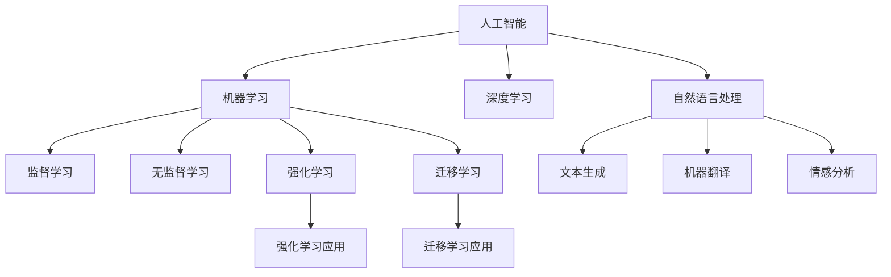

                 

# 人机协作：重塑未来工作模式

## 1. 背景介绍

随着技术的迅猛发展，人工智能（AI）在各行各业的应用越来越广泛。从制造业的自动化生产线到医疗诊断的智能辅助系统，从无人驾驶到智能客服，AI正在重新定义我们的工作方式。但与此同时，AI也在引发一场人机协作的革命，这不仅改变了企业的生产效率，也重新塑造了人类的工作模式。

### 1.1 问题由来

在过去几十年里，人工智能技术取得了显著进展。尤其是在深度学习领域，模型的性能和可解释性都在不断提升。然而，这些技术在实际应用中的效果往往受到数据、计算资源、应用场景等因素的限制。而人机协作，即通过AI技术增强人类的工作能力，成为了当下最热门的研究方向之一。

### 1.2 问题核心关键点

人机协作的核心在于如何高效地利用AI的优势，同时避免其局限性。主要包括以下几个方面：

1. **数据质量与标注成本**：高质量的标注数据是训练高性能模型的基础，但标注成本高昂且耗时。
2. **模型复杂性与计算资源**：大模型训练复杂，计算资源需求大，难以在实时环境下应用。
3. **模型解释性与可控性**：黑盒模型难以解释，缺乏透明性和可控性。
4. **人机协同方式**：如何设计有效的交互界面，使得人机协作无缝高效。

### 1.3 问题研究意义

人机协作的深度研究具有重要意义：

1. **提升生产效率**：AI可以承担重复性高、耗时长的任务，让人类专注于更具创造性的工作。
2. **降低人工成本**：减少人工干预，提高自动化程度，降低企业运营成本。
3. **增强决策支持**：利用AI的算法优势，提供更科学的决策建议，减少人为错误。
4. **促进创新发展**：AI能够从海量数据中提取有价值的信息，加速知识创新和产品迭代。

## 2. 核心概念与联系

### 2.1 核心概念概述

在人机协作的框架下，涉及多个关键概念：

- **人工智能（AI）**：指通过计算机系统模拟人类智能的过程，包括学习、推理、感知、规划等能力。
- **机器学习（ML）**：指通过数据和算法训练模型，使其具备一定的预测和决策能力。
- **深度学习（DL）**：一种特殊的机器学习技术，通过多层神经网络模型进行特征提取和模式识别。
- **人机协作**：指人类与AI系统的合作过程，通常涉及交互设计、协同工作、任务分配等。
- **自然语言处理（NLP）**：指通过计算机处理和理解自然语言的技术，如文本生成、机器翻译、情感分析等。

这些概念之间的逻辑关系可以通过以下Mermaid流程图来展示：



### 2.2 核心概念原理和架构

在人机协作的框架下，AI系统的架构通常包括以下几个组成部分：

1. **数据预处理层**：负责数据清洗、标注、转换等，确保数据质量。
2. **模型训练层**：使用机器学习算法训练模型，获取对数据规律的认识。
3. **推理与决策层**：利用训练好的模型对新数据进行推理和决策，输出结果。
4. **用户交互层**：设计界面，提供人机协作的交互接口，实现对模型的控制和反馈。
5. **系统优化层**：负责模型的维护、更新和优化，确保系统的稳定性和性能。

这些层之间的互动构成了人机协作的核心架构，其架构的合理设计和优化，将直接影响协作的效果和用户满意度。

## 3. 核心算法原理 & 具体操作步骤

### 3.1 算法原理概述

人机协作的核心算法包括机器学习、深度学习、强化学习等。以深度学习为例，其基本原理是通过多层神经网络对数据进行特征提取和模式识别，从而实现对复杂任务的自动处理。在人机协作中，深度学习模型通常用于处理自然语言处理（NLP）任务，如文本分类、情感分析、机器翻译等。

### 3.2 算法步骤详解

在人机协作的深度学习项目中，一般包括以下几个关键步骤：

1. **数据收集与预处理**：
   - 收集数据集，包括原始数据和标注数据。
   - 进行数据清洗、标注、归一化等预处理步骤。
   - 使用数据增强技术扩充训练数据集。

2. **模型设计与训练**：
   - 选择适合的深度学习模型，如卷积神经网络（CNN）、循环神经网络（RNN）、Transformer等。
   - 定义模型结构，包括输入层、隐藏层、输出层等。
   - 使用深度学习框架（如TensorFlow、PyTorch等）构建模型。
   - 选择合适的优化算法（如SGD、Adam等），设置学习率、批大小、迭代轮数等参数。
   - 在训练数据集上进行模型训练，不断调整模型参数，最小化损失函数。

3. **模型评估与优化**：
   - 在验证数据集上评估模型性能，使用准确率、召回率、F1值等指标。
   - 分析模型性能瓶颈，调整模型结构或训练策略。
   - 使用正则化、Dropout、Early Stopping等技术避免过拟合。
   - 应用对抗训练、数据增强等技术提高模型鲁棒性。

4. **模型部署与监控**：
   - 将训练好的模型导出为可执行文件或服务接口。
   - 部署到生产环境，进行实时推理和决策。
   - 实时监控模型性能，记录运行日志，及时发现和修复问题。

### 3.3 算法优缺点

人机协作的深度学习算法具有以下优点：

1. **自动化处理能力**：模型可以自动从大量数据中提取规律，实现自动化处理。
2. **高精度**：通过多层次特征提取，模型能够处理复杂数据结构，实现高精度预测。
3. **可扩展性**：深度学习模型具有高度的灵活性和可扩展性，适用于各种应用场景。

同时，这些算法也存在一些缺点：

1. **计算资源消耗大**：深度学习模型参数量大，计算复杂度高，需要高性能计算资源。
2. **数据需求高**：深度学习模型需要大量高质量的数据进行训练，标注成本高昂。
3. **模型可解释性差**：深度学习模型通常是黑盒，难以解释其内部决策过程。
4. **泛化能力受限**：深度学习模型依赖于训练数据，泛化能力有限，容易过拟合。

### 3.4 算法应用领域

人机协作的深度学习算法已经在众多领域得到应用，例如：

- **医疗诊断**：利用深度学习模型对医学影像、病历进行自动分析，辅助医生诊断。
- **智能客服**：使用深度学习模型进行自然语言处理，提供自动回复和对话服务。
- **金融分析**：通过深度学习模型分析市场数据，进行股票交易和风险控制。
- **自动驾驶**：使用深度学习模型对传感器数据进行处理，实现自动驾驶功能。
- **内容推荐**：利用深度学习模型分析用户行为数据，进行个性化推荐。
- **智能翻译**：使用深度学习模型进行机器翻译，实现跨语言交流。

## 4. 数学模型和公式 & 详细讲解

### 4.1 数学模型构建

在人机协作的深度学习项目中，通常使用多层次神经网络进行特征提取和模式识别。以文本分类为例，其数学模型构建过程如下：

1. **输入层**：将输入文本转换为向量表示。
2. **隐藏层**：使用卷积神经网络（CNN）或循环神经网络（RNN）对文本进行特征提取。
3. **输出层**：使用全连接层进行分类，输出预测结果。

数学模型可表示为：

$$
y = \text{Softmax}(\text{ReLU}(\text{Linear}(\text{Convolutional}(x)))
$$

其中，$x$ 为输入文本向量，$\text{Convolutional}$ 为卷积层，$\text{Linear}$ 为线性层，$\text{ReLU}$ 为激活函数，$\text{Softmax}$ 为归一化函数。

### 4.2 公式推导过程

在文本分类的深度学习模型中，损失函数通常使用交叉熵损失函数。假设模型输出的类别概率分布为 $p$，真实类别为 $y$，则交叉熵损失函数为：

$$
\mathcal{L}(p, y) = -\sum_{i=1}^{n} y_i \log p_i
$$

其中 $n$ 为类别数。

在训练过程中，模型参数 $\theta$ 通过反向传播算法更新，最小化损失函数 $\mathcal{L}$：

$$
\theta \leftarrow \theta - \eta \nabla_{\theta}\mathcal{L}(\theta)
$$

其中 $\eta$ 为学习率。

### 4.3 案例分析与讲解

以情感分析任务为例，假设模型在训练集上预测结果与真实标签的交叉熵损失为 $\mathcal{L} = 0.05$，在验证集上测试结果与真实标签的交叉熵损失为 $\mathcal{L} = 0.08$。此时，需要根据验证集的性能指标调整模型参数，以达到更好的泛化能力。

## 5. 项目实践：代码实例和详细解释说明

### 5.1 开发环境搭建

在进行深度学习项目开发前，需要准备好开发环境。以下是使用Python进行TensorFlow开发的环境配置流程：

1. 安装Anaconda：从官网下载并安装Anaconda，用于创建独立的Python环境。
2. 创建并激活虚拟环境：
```bash
conda create -n tf-env python=3.8 
conda activate tf-env
```

3. 安装TensorFlow：根据CUDA版本，从官网获取对应的安装命令。例如：
```bash
conda install tensorflow -c pytorch -c conda-forge
```

4. 安装各类工具包：
```bash
pip install numpy pandas scikit-learn matplotlib tqdm jupyter notebook ipython
```

完成上述步骤后，即可在`tf-env`环境中开始深度学习项目开发。

### 5.2 源代码详细实现

下面我们以情感分析任务为例，给出使用TensorFlow对BERT模型进行情感分析的代码实现。

首先，定义情感分析任务的数据处理函数：

```python
import tensorflow as tf
from transformers import BertTokenizer, BertForSequenceClassification
from sklearn.model_selection import train_test_split

# 加载预训练的BERT模型和分词器
tokenizer = BertTokenizer.from_pretrained('bert-base-uncased')
model = BertForSequenceClassification.from_pretrained('bert-base-uncased', num_labels=2)

# 加载数据集
with open('data.txt', 'r', encoding='utf-8') as f:
    data = f.readlines()

# 将数据集分为训练集和测试集
train_texts, test_texts = train_test_split(data, test_size=0.2)

# 数据预处理
train_input_ids, train_labels = [], []
test_input_ids, test_labels = [], []
for text in train_texts:
    encoded = tokenizer.encode_plus(text, add_special_tokens=True, return_tensors='tf')
    train_input_ids.append(encoded['input_ids'])
    train_labels.append(encoded['labels'])
for text in test_texts:
    encoded = tokenizer.encode_plus(text, add_special_tokens=True, return_tensors='tf')
    test_input_ids.append(encoded['input_ids'])
    test_labels.append(encoded['labels'])

# 构建模型输入
train_input_ids = tf.concat(train_input_ids, axis=0)
train_labels = tf.convert_to_tensor(train_labels, dtype=tf.int32)
test_input_ids = tf.concat(test_input_ids, axis=0)
test_labels = tf.convert_to_tensor(test_labels, dtype=tf.int32)

# 定义损失函数和优化器
loss_fn = tf.keras.losses.SparseCategoricalCrossentropy(from_logits=True)
optimizer = tf.keras.optimizers.Adam()

# 定义训练和评估函数
@tf.function
def train_step(input_ids, labels):
    with tf.GradientTape() as tape:
        outputs = model(input_ids, training=True)
        loss = loss_fn(labels, outputs)
    gradients = tape.gradient(loss, model.trainable_variables)
    optimizer.apply_gradients(zip(gradients, model.trainable_variables))
    return loss

@tf.function
def evaluate(input_ids, labels):
    outputs = model(input_ids, training=False)
    loss = loss_fn(labels, outputs)
    return loss.numpy()

# 训练和评估
epochs = 5
batch_size = 32

for epoch in range(epochs):
    for i in range(0, len(train_input_ids), batch_size):
        input_ids = train_input_ids[i:i+batch_size]
        labels = train_labels[i:i+batch_size]
        loss = train_step(input_ids, labels)
        print(f'Epoch {epoch+1}, Batch {i}, Loss: {loss:.4f}')

    print(f'Epoch {epoch+1}, Test Loss: {evaluate(test_input_ids, test_labels):.4f}')
```

以上代码实现了使用BERT模型对情感分析任务进行微调。

### 5.3 代码解读与分析

让我们再详细解读一下关键代码的实现细节：

**数据预处理**：
- 使用BertTokenizer对文本进行分词和编码。
- 将编码结果转换为TensorFlow张量。

**模型构建与优化器设置**：
- 加载预训练的BERT模型和分词器。
- 定义交叉熵损失函数和Adam优化器。

**训练与评估函数**：
- 使用TensorFlow的tf.function装饰器进行模型加速。
- 在训练函数中计算模型输出和损失，并进行反向传播更新参数。
- 在评估函数中计算模型输出和损失，并返回测试集上的损失。

**训练与评估流程**：
- 设置训练轮数和批大小。
- 在训练集中进行迭代，每次更新模型参数。
- 在验证集上评估模型性能，输出测试集上的损失。

可以看到，使用TensorFlow进行深度学习项目开发，可以方便地实现模型构建、训练和评估，提高了开发效率。

## 6. 实际应用场景

### 6.1 智能客服系统

基于深度学习的人机协作系统，可以广泛应用于智能客服系统的构建。传统客服往往需要配备大量人力，高峰期响应缓慢，且一致性和专业性难以保证。而使用深度学习模型进行情感分析、自然语言处理，可以7x24小时不间断服务，快速响应客户咨询，用自然流畅的语言解答各类常见问题。

在技术实现上，可以收集企业内部的历史客服对话记录，将问题和最佳答复构建成监督数据，在此基础上对预训练模型进行微调。微调后的模型能够自动理解用户意图，匹配最合适的答案模板进行回复。对于客户提出的新问题，还可以接入检索系统实时搜索相关内容，动态组织生成回答。如此构建的智能客服系统，能大幅提升客户咨询体验和问题解决效率。

### 6.2 金融舆情监测

金融机构需要实时监测市场舆论动向，以便及时应对负面信息传播，规避金融风险。传统的人工监测方式成本高、效率低，难以应对网络时代海量信息爆发的挑战。基于深度学习模型的文本分类和情感分析技术，为金融舆情监测提供了新的解决方案。

具体而言，可以收集金融领域相关的新闻、报道、评论等文本数据，并对其进行主题标注和情感标注。在此基础上对预训练语言模型进行微调，使其能够自动判断文本属于何种主题，情感倾向是正面、中性还是负面。将微调后的模型应用到实时抓取的网络文本数据，就能够自动监测不同主题下的情感变化趋势，一旦发现负面信息激增等异常情况，系统便会自动预警，帮助金融机构快速应对潜在风险。

### 6.3 个性化推荐系统

当前的推荐系统往往只依赖用户的历史行为数据进行物品推荐，无法深入理解用户的真实兴趣偏好。基于深度学习模型的人机协作系统，可以更好地挖掘用户行为背后的语义信息，从而提供更精准、多样的推荐内容。

在实践中，可以收集用户浏览、点击、评论、分享等行为数据，提取和用户交互的物品标题、描述、标签等文本内容。将文本内容作为模型输入，用户的后续行为（如是否点击、购买等）作为监督信号，在此基础上微调预训练语言模型。微调后的模型能够从文本内容中准确把握用户的兴趣点。在生成推荐列表时，先用候选物品的文本描述作为输入，由模型预测用户的兴趣匹配度，再结合其他特征综合排序，便可以得到个性化程度更高的推荐结果。

### 6.4 未来应用展望

随着深度学习技术的发展，基于人机协作的深度学习模型将在更多领域得到应用，为传统行业带来变革性影响。

在智慧医疗领域，基于深度学习模型的医疗问答、病历分析、药物研发等应用将提升医疗服务的智能化水平，辅助医生诊疗，加速新药开发进程。

在智能教育领域，深度学习模型可应用于作业批改、学情分析、知识推荐等方面，因材施教，促进教育公平，提高教学质量。

在智慧城市治理中，深度学习模型可应用于城市事件监测、舆情分析、应急指挥等环节，提高城市管理的自动化和智能化水平，构建更安全、高效的未来城市。

此外，在企业生产、社会治理、文娱传媒等众多领域，基于深度学习模型的人机协作系统也将不断涌现，为经济社会发展注入新的动力。相信随着技术的日益成熟，人机协作范式将成为人工智能落地应用的重要手段，推动人工智能技术在更广泛的应用领域得到实现。

## 7. 工具和资源推荐

### 7.1 学习资源推荐

为了帮助开发者系统掌握深度学习理论基础和实践技巧，这里推荐一些优质的学习资源：

1. **《深度学习》（Ian Goodfellow）**：深度学习领域的经典教材，系统介绍深度学习的基本原理和应用。
2. **Coursera《深度学习专项课程》**：由斯坦福大学Andrew Ng教授开设的深度学习系列课程，提供高质量的视频和作业。
3. **Kaggle**：提供大量数据科学和机器学习竞赛，可实践和检验学习成果。
4. **GitHub**：代码托管平台，可以找到大量的开源深度学习项目和代码实现。
5. **arXiv**：深度学习领域的研究论文库，可获取最新研究进展。

通过学习这些资源，相信你一定能够快速掌握深度学习的基本概念和实际应用。

### 7.2 开发工具推荐

高效的开发离不开优秀的工具支持。以下是几款用于深度学习开发的常用工具：

1. **TensorFlow**：由Google主导开发的开源深度学习框架，生产部署方便，适合大规模工程应用。
2. **PyTorch**：基于Python的开源深度学习框架，灵活动态的计算图，适合快速迭代研究。
3. **Jupyter Notebook**：交互式开发环境，支持Python和TensorFlow等深度学习框架的交互式开发。
4. **TensorBoard**：TensorFlow配套的可视化工具，可实时监测模型训练状态，提供丰富的图表呈现方式。
5. **Weights & Biases**：模型训练的实验跟踪工具，可以记录和可视化模型训练过程中的各项指标，方便对比和调优。

合理利用这些工具，可以显著提升深度学习项目的开发效率，加快创新迭代的步伐。

### 7.3 相关论文推荐

深度学习技术的发展源于学界的持续研究。以下是几篇奠基性的相关论文，推荐阅读：

1. **《深度学习》（Ian Goodfellow）**：深度学习领域的经典教材，系统介绍深度学习的基本原理和应用。
2. **《ImageNet大规模视觉识别挑战赛2020》**：最新的计算机视觉领域研究成果，展示了深度学习在图像分类、目标检测等任务上的进展。
3. **《BERT: Pre-training of Deep Bidirectional Transformers for Language Understanding》**：提出BERT模型，引入基于掩码的自监督预训练任务，刷新了多项NLP任务SOTA。
4. **《Attention is All You Need》**：提出Transformer结构，开启了NLP领域的预训练大模型时代。
5. **《Deep Reinforcement Learning》**：介绍深度学习在强化学习中的应用，展示深度学习在复杂决策问题上的优势。

这些论文代表了大规模深度学习模型和微调技术的发展脉络。通过学习这些前沿成果，可以帮助研究者把握学科前进方向，激发更多的创新灵感。

## 8. 总结：未来发展趋势与挑战

### 8.1 总结

本文对基于深度学习的人机协作技术进行了全面系统的介绍。首先阐述了人机协作技术的研究背景和意义，明确了其在提升生产效率、降低人工成本、增强决策支持等方面的独特价值。其次，从原理到实践，详细讲解了深度学习模型的构建、训练和评估流程，给出了深度学习项目开发的完整代码实例。同时，本文还广泛探讨了深度学习技术在智能客服、金融舆情监测、个性化推荐等多个行业领域的应用前景，展示了深度学习技术的巨大潜力。

通过本文的系统梳理，可以看到，基于深度学习的人机协作技术正在成为当前人工智能研究的重要方向，极大地拓展了深度学习模型在各行业的实际应用，为人类生产方式带来了深远影响。未来，伴随深度学习技术的不断演进，基于人机协作的智能系统必将进一步优化和扩展，为各行各业带来更加智能化、高效化的解决方案。

### 8.2 未来发展趋势

展望未来，基于深度学习的人机协作技术将呈现以下几个发展趋势：

1. **多模态融合**：深度学习技术将与图像、语音等多模态数据结合，实现多模态信息协同处理。
2. **个性化定制**：深度学习技术将与用户个性化需求结合，提供更加定制化的解决方案。
3. **联邦学习**：通过分布式训练，深度学习模型将在云端和本地设备上协同学习，提高训练效率和隐私保护。
4. **自监督学习**：利用未标注数据进行训练，提高深度学习模型的泛化能力和数据利用率。
5. **可解释性和透明性**：通过模型可解释性技术，提高深度学习模型的透明性和可控性。
6. **边缘计算**：深度学习模型将在边缘设备上运行，实现实时推理和决策，降低对云计算的依赖。

以上趋势凸显了深度学习技术的广阔前景。这些方向的探索发展，必将进一步提升人机协作系统的性能和应用范围，为经济社会发展注入新的动力。

### 8.3 面临的挑战

尽管基于深度学习的人机协作技术已经取得了显著进展，但在迈向更加智能化、普适化应用的过程中，它仍面临着诸多挑战：

1. **数据质量和标注成本**：深度学习模型需要大量高质量的数据进行训练，标注成本高昂且耗时。
2. **模型复杂性和计算资源**：深度学习模型参数量大，计算复杂度高，需要高性能计算资源。
3. **模型解释性和透明性**：深度学习模型通常是黑盒，难以解释其内部决策过程。
4. **泛化能力和鲁棒性**：深度学习模型依赖于训练数据，泛化能力有限，容易过拟合。
5. **隐私和安全**：深度学习模型处理大量个人数据，数据隐私和安全问题亟待解决。

正视人机协作面临的这些挑战，积极应对并寻求突破，将是人机协作技术走向成熟的必由之路。相信随着学界和产业界的共同努力，这些挑战终将一一被克服，深度学习技术必将在构建智能系统方面发挥越来越重要的作用。

### 8.4 研究展望

面对深度学习技术面临的种种挑战，未来的研究需要在以下几个方面寻求新的突破：

1. **数据增强和数据合成**：通过数据增强和合成技术，提高深度学习模型的泛化能力，降低对标注数据的依赖。
2. **模型压缩和剪枝**：通过模型压缩和剪枝技术，减小深度学习模型的计算复杂度，提高推理速度和效率。
3. **模型融合与集成**：将多个深度学习模型进行融合，结合各自优势，提高系统的整体性能和鲁棒性。
4. **自监督学习和迁移学习**：利用自监督学习、迁移学习等技术，提高深度学习模型的泛化能力和数据利用率。
5. **模型可解释性和透明性**：通过模型可解释性技术，提高深度学习模型的透明性和可控性，增强用户信任。
6. **隐私保护与安全性**：通过隐私保护和安全性技术，保护用户数据隐私，增强系统安全性。

这些研究方向的探索，必将引领深度学习技术迈向更高的台阶，为构建智能系统提供更加全面、高效、安全的解决方案。面向未来，深度学习技术还需要与其他人工智能技术进行更深入的融合，如知识表示、因果推理、强化学习等，多路径协同发力，共同推动人工智能技术在更广泛的应用领域得到实现。

## 9. 附录：常见问题与解答

**Q1：如何提高深度学习模型的泛化能力？**

A: 提高深度学习模型的泛化能力，需要从以下几个方面进行优化：

1. **数据增强**：通过数据增强技术，扩充训练集的多样性，提高模型的泛化能力。
2. **正则化技术**：使用L2正则化、Dropout等技术，避免过拟合。
3. **迁移学习**：通过迁移学习，将预训练模型的知识迁移到新任务中，提高模型的泛化能力。
4. **自监督学习**：利用未标注数据进行训练，提高模型的泛化能力和数据利用率。

这些方法能够有效提高深度学习模型的泛化能力，使其在新的数据集上也能取得良好的表现。

**Q2：深度学习模型的训练过程中，如何避免过拟合？**

A: 深度学习模型在训练过程中容易过拟合，主要通过以下方法进行避免：

1. **正则化技术**：使用L2正则化、Dropout等技术，避免模型过拟合。
2. **早停策略**：在验证集上监控模型的性能，一旦性能不再提升，及时停止训练。
3. **数据增强**：通过数据增强技术，扩充训练集的多样性，提高模型的泛化能力。
4. **模型压缩**：通过模型压缩和剪枝技术，减小模型的计算复杂度，提高泛化能力。

这些方法能够有效避免深度学习模型的过拟合，提高模型的泛化能力和数据利用率。

**Q3：深度学习模型在实时推理时，如何提高推理速度？**

A: 提高深度学习模型在实时推理时的速度，需要从以下几个方面进行优化：

1. **模型压缩和剪枝**：通过模型压缩和剪枝技术，减小模型的计算复杂度，提高推理速度。
2. **量化加速**：将浮点模型转为定点模型，压缩存储空间，提高计算效率。
3. **分布式训练**：通过分布式训练，提高模型的推理速度和计算能力。
4. **模型加速库**：使用模型加速库，如TensorFlow Lite、ONNX Runtime等，加速模型推理。

这些方法能够有效提高深度学习模型在实时推理时的速度和效率，使其能够更好地应用于实际生产环境中。

**Q4：如何保证深度学习模型的可解释性和透明性？**

A: 保证深度学习模型的可解释性和透明性，需要从以下几个方面进行优化：

1. **模型可解释性技术**：使用模型可解释性技术，如Shapley值、LIME等，提高模型的透明性和可控性。
2. **可视化技术**：使用可视化技术，如t-SNE、热力图等，直观展示模型的决策过程和特征重要性。
3. **对比学习**：使用对比学习技术，提高模型的鲁棒性和泛化能力，减少模型的黑盒特征。
4. **规则驱动的模型**：使用规则驱动的模型，结合符号化知识，提高模型的透明性和可控性。

这些方法能够有效提高深度学习模型的可解释性和透明性，增强用户信任和系统可靠性。

**Q5：如何保证深度学习模型的隐私和安全？**

A: 保证深度学习模型的隐私和安全，需要从以下几个方面进行优化：

1. **数据加密**：使用数据加密技术，保护用户数据隐私。
2. **联邦学习**：通过分布式训练，模型在本地设备上运行，避免数据泄露。
3. **模型蒸馏**：使用模型蒸馏技术，将大型模型压缩成小型模型，减少数据泄露风险。
4. **安全审计**：通过安全审计技术，定期检测和修复模型的漏洞和安全问题。

这些方法能够有效保证深度学习模型的隐私和安全，保护用户数据，增强系统的安全性。

总之，深度学习技术在实际应用中，需要从数据、模型、训练、推理等多个环节进行全面优化，才能真正实现高效、可靠、安全的智能系统。只有不断创新、不断突破，才能引领深度学习技术迈向更高的台阶，为经济社会发展注入新的动力。

