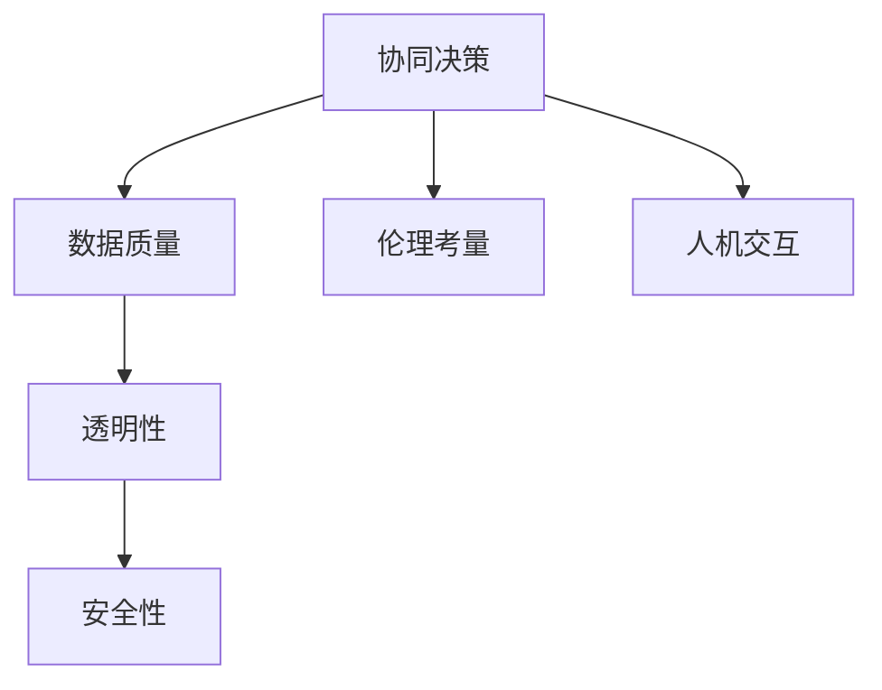

                 

# 人类-AI协作：打造互惠互利的伙伴关系

## 1. 背景介绍

### 1.1 问题由来
人工智能(AI)技术正以前所未有的速度革新各行各业，从医疗、金融、制造到教育、娱乐等领域，AI的触角无处不在。但与此同时，人类与AI的协作关系也面临新的挑战和机遇。AI的发展不应仅是技术上的突破，更需要从伦理、社会、经济等多个维度综合考虑，才能实现人与AI的和谐共生。

### 1.2 问题核心关键点
人类与AI协作的核心在于如何平衡二者的角色与关系，实现互惠互利。其关键点包括：
1. **协同决策**：人类与AI在任务执行中的合理分工，发挥各自优势。
2. **数据质量**：确保输入AI的数据质量，避免偏见和错误。
3. **透明性**：AI决策过程的透明性，便于人类理解和信任。
4. **安全性**：确保AI系统的安全性，避免因漏洞导致的人身和财产损失。
5. **伦理考量**：AI应用中的伦理问题，如隐私、偏见、歧视等。
6. **人机交互**：流畅、自然的人机交互方式，提升用户体验。

这些关键点共同构成了人类-AI协作的核心框架，旨在通过技术、伦理和社会等手段，构建一个互惠互利的伙伴关系。

## 2. 核心概念与联系

### 2.1 核心概念概述

为更好地理解人类-AI协作的框架，本节将介绍几个密切相关的核心概念：

- **协同决策**：指人类与AI在决策过程中通过协作，共同完成任务。
- **数据质量**：指用于训练AI模型的数据质量，包括数据的准确性、完整性、代表性和时效性。
- **透明性**：指AI决策过程的可解释性和可理解性，确保人类能够理解和信任AI的决策。
- **安全性**：指AI系统免受恶意攻击或故障影响的能力，保护数据和用户隐私。
- **伦理考量**：指在AI应用中，如何处理隐私、偏见、歧视等伦理问题，确保AI行为符合人类价值观。
- **人机交互**：指人类与AI系统之间的交互方式，影响用户体验和系统效率。

这些核心概念之间的逻辑关系可以通过以下Mermaid流程图来展示：



这个流程图展示了她人类-AI协作的核心概念及其之间的关系：

1. **协同决策**：是协作的基础，决定了AI的角色和作用。
2. **数据质量**：是AI性能的保障，影响协同决策的有效性。
3. **透明性**：是信任的前提，确保AI决策的可解释性。
4. **安全性**：是可靠性的保证，防止AI系统被攻击。
5. **伦理考量**：是道德的底线，确保AI行为符合社会规范。
6. **人机交互**：是用户体验的关键，提升系统易用性。

这些核心概念共同构成了人类-AI协作的顶层架构，使其能够在各种场景下发挥作用。

## 3. 核心算法原理 & 具体操作步骤
### 3.1 算法原理概述

人类-AI协作的算法原理主要包括协同决策、数据预处理、模型训练和结果解释。

1. **协同决策**：指在任务执行过程中，人类和AI共同参与决策，发挥各自优势。如在医疗诊断中，AI提供初步分析，医生综合多方面信息进行诊断。
2. **数据预处理**：指对输入AI的数据进行清洗、标注和转换，以确保数据质量。例如，对医疗影像进行标注，对文本进行分词和向量化。
3. **模型训练**：指使用数据训练AI模型，通过反向传播优化模型参数。例如，使用监督学习训练分类器，使用生成对抗网络训练生成模型。
4. **结果解释**：指对AI的输出进行解释，使其易于理解和接受。例如，使用可解释AI技术，显示模型对决策的影响因素。

### 3.2 算法步骤详解

人类-AI协作的算法步骤主要包括以下几个环节：

1. **任务定义**：明确任务目标和需求，确定AI的介入点和角色。
2. **数据收集**：收集与任务相关的数据，包括结构化数据、非结构化数据和实时数据。
3. **数据预处理**：清洗、标注、转换数据，确保数据质量。
4. **模型选择**：根据任务需求选择适合的AI模型，如分类器、生成模型等。
5. **模型训练**：使用预处理后的数据训练AI模型，优化模型参数。
6. **协同决策**：将AI模型嵌入任务流程中，与人类共同决策。
7. **结果评估**：对协同决策的结果进行评估，确保符合任务需求。
8. **持续改进**：根据反馈不断优化AI模型和协作流程。

### 3.3 算法优缺点

人类-AI协作的算法具有以下优点：
1. **效率提升**：AI可以处理大量数据和复杂任务，提高决策速度和准确性。
2. **成本节约**：通过自动化和优化，降低人工成本和时间成本。
3. **质量保障**：AI模型具有较强的泛化能力，可以提供稳定的高质量输出。
4. **可靠性和可扩展性**：AI系统可以24小时在线，提供持续服务，并可根据需求进行扩展。

同时，该算法也存在以下缺点：
1. **复杂性增加**：需要设计复杂的协同机制和数据处理流程，增加了系统复杂性。
2. **伦理和安全问题**：AI决策的透明性和安全性难以保障，可能存在隐私泄露和偏见问题。
3. **人机交互问题**：复杂的人机交互设计可能导致用户体验不佳，影响系统易用性。
4. **技术依赖**：对AI技术的依赖可能导致过度依赖，降低系统自主性和灵活性。

尽管存在这些局限性，但就目前而言，人类-AI协作的算法范式仍然是大规模AI应用的主流方式。未来相关研究的重点在于如何进一步提高系统的透明性、安全性，同时兼顾人机交互的用户体验，以实现更高效、更可靠的协作效果。

### 3.4 算法应用领域

人类-AI协作的算法广泛应用于以下领域：

- **医疗**：如智能诊断、药物研发、健康监测等。
- **金融**：如信用评分、风险管理、投资策略等。
- **制造**：如质量控制、生产调度、供应链优化等。
- **教育**：如个性化推荐、智能辅导、作业批改等。
- **安全**：如智能监控、异常检测、入侵防御等。
- **零售**：如客户推荐、库存管理、销售预测等。

此外，在智慧城市、环境保护、能源管理等诸多领域，人类-AI协作的算法也正在发挥越来越重要的作用，为各行各业带来新的变革和机遇。

## 4. 数学模型和公式 & 详细讲解 & 举例说明

### 4.1 数学模型构建

本节将使用数学语言对人类-AI协作的算法过程进行更加严格的刻画。

设任务目标为 $T$，AI模型为 $M$，人类为 $H$，则协同决策过程可以表示为：

$$
Y = M(X, \theta) + H(f(X))
$$

其中 $X$ 为输入数据，$Y$ 为决策结果，$\theta$ 为模型参数，$f$ 为人类决策函数。

### 4.2 公式推导过程

以下我们以医疗诊断为例，推导协同决策的数学模型及其梯度计算公式。

假设AI模型为分类器，其输出为 $P(y|X, \theta)$，其中 $y$ 为诊断结果（如癌症、正常），$X$ 为患者医疗影像等输入数据，$\theta$ 为模型参数。人类决策函数为 $f(X) = \text{sigmoid}(X)$，将输入数据映射到 $[0,1]$ 区间，表示诊断可信度。

定义协同决策的损失函数为 $L(Y, \hat{Y})$，其中 $\hat{Y}$ 为AI与人类共同决策的结果。例如，可以定义交叉熵损失函数：

$$
L(Y, \hat{Y}) = -\sum_{i=1}^N [y_i \log \hat{y_i} + (1-y_i) \log (1-\hat{y_i})]
$$

其中 $y_i$ 为真实标签，$\hat{y_i}$ 为协同决策的输出。

对协同决策结果进行梯度计算，更新模型参数 $\theta$ 和人类决策函数 $f$ 的参数：

$$
\frac{\partial L}{\partial \theta} = -\sum_{i=1}^N \frac{y_i}{P(y_i|X_i, \theta)} - \sum_{i=1}^N \frac{1-y_i}{1-P(y_i|X_i, \theta)}
$$

$$
\frac{\partial L}{\partial f} = -\sum_{i=1}^N (\frac{y_i}{P(y_i|X_i, \theta)} - \frac{1-y_i}{1-P(y_i|X_i, \theta)})
$$

在得到梯度后，即可带入优化算法进行协同决策的参数更新。重复上述过程直至收敛，最终得到最优的协同决策模型。

## 5. 项目实践：代码实例和详细解释说明
### 5.1 开发环境搭建

在进行协作实践前，我们需要准备好开发环境。以下是使用Python进行PyTorch开发的环境配置流程：

1. 安装Anaconda：从官网下载并安装Anaconda，用于创建独立的Python环境。

2. 创建并激活虚拟环境：
```bash
conda create -n ai-env python=3.8 
conda activate ai-env
```

3. 安装PyTorch：根据CUDA版本，从官网获取对应的安装命令。例如：
```bash
conda install pytorch torchvision torchaudio cudatoolkit=11.1 -c pytorch -c conda-forge
```

4. 安装TensorFlow：使用pip安装TensorFlow：
```bash
pip install tensorflow
```

5. 安装各类工具包：
```bash
pip install numpy pandas scikit-learn matplotlib tqdm jupyter notebook ipython
```

完成上述步骤后，即可在`ai-env`环境中开始协作实践。

### 5.2 源代码详细实现

这里我们以医疗诊断为例，给出使用PyTorch进行协作开发的完整代码实现。

首先，定义医疗诊断任务的数据处理函数：

```python
import torch
import torch.nn as nn
import torch.optim as optim
import numpy as np

class MedicalDataset(Dataset):
    def __init__(self, images, labels, transform=None):
        self.images = images
        self.labels = labels
        self.transform = transform
        
    def __len__(self):
        return len(self.images)
    
    def __getitem__(self, item):
        image = self.images[item]
        label = self.labels[item]
        
        if self.transform:
            image = self.transform(image)
            
        return {'image': image, 
                'label': label}

# 数据预处理
def preprocess_data(images, labels):
    transform = transforms.Compose([
        transforms.ToTensor(),
        transforms.Normalize(mean=[0.5, 0.5, 0.5], std=[0.5, 0.5, 0.5])
    ])
    return MedicalDataset(images, labels, transform)
```

然后，定义协作模型：

```python
class CollaborativeModel(nn.Module):
    def __init__(self):
        super(CollaborativeModel, self).__init__()
        self.net1 = nn.Sequential(
            nn.Conv2d(3, 64, kernel_size=3, stride=1, padding=1),
            nn.ReLU(inplace=True),
            nn.MaxPool2d(kernel_size=2, stride=2)
        )
        self.net2 = nn.Sequential(
            nn.Linear(64 * 28 * 28, 256),
            nn.ReLU(inplace=True),
            nn.Dropout(p=0.5),
            nn.Linear(256, 1),
            nn.Sigmoid()
        )
    
    def forward(self, x):
        x = self.net1(x)
        x = x.view(-1, 64 * 28 * 28)
        x = self.net2(x)
        return x
```

接着，定义优化器和学习率调度器：

```python
model = CollaborativeModel()
optimizer = optim.Adam(model.parameters(), lr=0.001)
scheduler = optim.lr_scheduler.StepLR(optimizer, step_size=10, gamma=0.1)
```

最后，定义协作训练和评估函数：

```python
def train_epoch(model, dataset, optimizer, scheduler):
    model.train()
    train_loss = 0
    for batch in dataset:
        inputs, labels = batch['image'].to(device), batch['label'].to(device)
        optimizer.zero_grad()
        outputs = model(inputs)
        loss = nn.BCELoss()(outputs, labels)
        train_loss += loss.item()
        loss.backward()
        optimizer.step()
        scheduler.step()
    return train_loss / len(dataset)

def evaluate(model, dataset):
    model.eval()
    eval_loss = 0
    with torch.no_grad():
        for batch in dataset:
            inputs, labels = batch['image'].to(device), batch['label'].to(device)
            outputs = model(inputs)
            eval_loss += nn.BCELoss()(outputs, labels).item()
    return eval_loss / len(dataset)
```

启动协作训练流程：

```python
device = torch.device('cuda') if torch.cuda.is_available() else torch.device('cpu')
model.to(device)

train_dataset = preprocess_data(train_images, train_labels)
dev_dataset = preprocess_data(dev_images, dev_labels)
test_dataset = preprocess_data(test_images, test_labels)

for epoch in range(50):
    train_loss = train_epoch(model, train_dataset, optimizer, scheduler)
    print(f'Epoch {epoch+1}, train loss: {train_loss:.4f}')
    
    dev_loss = evaluate(model, dev_dataset)
    print(f'Epoch {epoch+1}, dev loss: {dev_loss:.4f}')
    
print('Test loss:', evaluate(model, test_dataset))
```

以上就是使用PyTorch进行医疗诊断任务协作的完整代码实现。可以看到，得益于PyTorch的强大功能和简化接口，协作模型设计变得简单易行。

### 5.3 代码解读与分析

让我们再详细解读一下关键代码的实现细节：

**MedicalDataset类**：
- `__init__`方法：初始化医疗图像和标签。
- `__len__`方法：返回数据集样本数量。
- `__getitem__`方法：对单个样本进行处理，包括预处理、转换和数据加载。

**preprocess_data函数**：
- 使用`transforms`库对图像进行预处理，包括转张量和标准化。
- 将预处理后的数据集传递给`MedicalDataset`类，方便后续使用。

**CollaborativeModel类**：
- `__init__`方法：定义协作模型结构，包括卷积层和全连接层。
- `forward`方法：前向传播计算输出。

**optimizer和scheduler**：
- 使用`optim`库定义Adam优化器和步长调度器，用于模型训练。

**train_epoch和evaluate函数**：
- 使用`nn`库定义二元交叉熵损失函数，用于计算损失。
- 定义训练和评估函数，分别计算训练集和验证集的损失。

**协作训练流程**：
- 指定训练集、验证集和测试集，启动协作训练循环。
- 每个epoch内，先在训练集上训练，输出训练集损失。
- 在验证集上评估，输出验证集损失。
- 所有epoch结束后，在测试集上评估，输出测试集损失。

通过本文的系统梳理，可以看到，人类-AI协作的算法和大模型微调技术有许多共通之处。通过借鉴大模型微调的优秀实践，人类-AI协作可以更加高效、可靠地进行，进一步推动AI技术在各行各业的应用和发展。

## 6. 实际应用场景
### 6.1 智能诊断系统

基于协作算法，智能诊断系统可以通过结合医生的经验和AI模型的预测，提高诊断的准确性和效率。例如，在放射科，智能诊断系统可以辅助医生对医学影像进行初步筛查，标注可疑区域，再由医生进行细致分析。这样可以大幅减少医生的工作量，提升诊断的准确性。

在实践中，可以收集大量医学影像数据和标注数据，使用协作算法对模型进行微调，使其能够在特定诊断任务上取得更好的性能。同时，系统还可以在运行过程中，根据医生的反馈不断优化模型和协作流程，提升系统的适应性和准确性。

### 6.2 金融风险管理

金融风险管理需要实时监测市场动态，评估风险并采取相应措施。基于协作算法，可以构建智能风险管理平台，实时分析市场数据，预测风险变化。例如，在股票市场，系统可以根据市场趋势和公司基本面，预测股票价格波动，辅助投资者进行决策。

在实现中，可以收集市场数据、公司财报等数据，使用协作算法训练风险预测模型，再结合专家规则和系统决策，进行多维度风险评估和策略制定。系统还可以动态调整模型参数，提高预测的准确性和及时性。

### 6.3 智能制造

智能制造涉及生产调度、质量控制、供应链管理等多个环节。基于协作算法，可以构建智能制造平台，实时监测生产流程，优化资源配置。例如，在生产线上，系统可以根据设备状态和生产需求，动态调整生产计划，提高生产效率。

在实践中，可以收集生产数据、设备状态数据等，使用协作算法训练生产优化模型，再结合专家规则和系统决策，进行生产调度、资源配置等优化。系统还可以根据实际生产情况，动态调整模型参数，优化生产流程。

## 7. 工具和资源推荐
### 7.1 学习资源推荐

为了帮助开发者系统掌握协作算法的理论基础和实践技巧，这里推荐一些优质的学习资源：

1. 《人类-AI协作》系列博文：由人工智能专家撰写，深入浅出地介绍了协作算法的原理和应用，适合初学者和进阶者。

2. 《深度学习理论与实践》课程：斯坦福大学开设的深度学习课程，涵盖理论基础和实际应用，适合系统学习深度学习。

3. 《人工智能导论》书籍：吴恩达教授所写，系统介绍了AI的历史、现状和未来，适合了解AI的整体框架。

4. 《协作学习理论与算法》书籍：系统介绍了协作学习的基本理论和算法，适合深入研究协作算法。

5. 《机器学习实战》书籍：是一本实用的机器学习教程，适合动手实践和解决实际问题。

通过对这些资源的学习实践，相信你一定能够快速掌握协作算法的精髓，并用于解决实际的AI问题。

### 7.2 开发工具推荐

高效的开发离不开优秀的工具支持。以下是几款用于协作算法开发的常用工具：

1. PyTorch：基于Python的开源深度学习框架，灵活的计算图和丰富的模型库，适合研究和工程实践。

2. TensorFlow：由Google主导开发的开源深度学习框架，支持大规模分布式计算，适合生产部署。

3. Weights & Biases：模型训练的实验跟踪工具，可以记录和可视化模型训练过程中的各项指标，方便调试和优化。

4. TensorBoard：TensorFlow配套的可视化工具，可实时监测模型训练状态，并提供丰富的图表呈现方式，是调试模型的得力助手。

5. Keras：基于TensorFlow的高级深度学习框架，提供简单易用的API，适合快速原型设计和实验。

6. Jupyter Notebook：开源的交互式笔记本环境，支持Python、R等多种编程语言，适合编写和分享研究代码。

合理利用这些工具，可以显著提升协作算法的开发效率，加快创新迭代的步伐。

### 7.3 相关论文推荐

协作算法的快速发展得益于学界的持续研究。以下是几篇奠基性的相关论文，推荐阅读：

1. 《协同过滤推荐系统》论文：介绍了协同过滤算法的原理和实现，是推荐系统的重要基础。

2. 《深度协同决策网络》论文：提出了一种基于深度学习的协同决策网络，用于多模态数据融合和协同决策。

3. 《AI在医疗中的应用》论文：系统介绍了AI在医疗诊断、治疗等方面的应用，展示了协作算法在医疗领域的效果。

4. 《智能制造中的AI应用》论文：介绍了AI在智能制造中的应用，包括生产优化、质量控制等，展示了协作算法在工业领域的效果。

5. 《人机协同系统的设计与实现》论文：系统介绍了人机协同系统的设计和实现，提出了多种协同算法和系统架构。

这些论文代表了大规模协作算法的最新发展，通过学习这些前沿成果，可以帮助研究者把握学科前进方向，激发更多的创新灵感。

## 8. 总结：未来发展趋势与挑战
### 8.1 总结

本文对人类-AI协作的算法进行了全面系统的介绍。首先阐述了协作算法的背景和意义，明确了协作在提升效率、降低成本、保障质量等方面的独特价值。其次，从原理到实践，详细讲解了协作算法的数学原理和关键步骤，给出了协作任务开发的完整代码实例。同时，本文还广泛探讨了协作算法在智能诊断、金融风险管理、智能制造等多个领域的应用前景，展示了协作算法的广阔应用空间。此外，本文精选了协作算法的各类学习资源，力求为读者提供全方位的技术指引。

通过本文的系统梳理，可以看到，协作算法在大规模AI应用中具有重要地位，能够显著提升系统性能和用户体验。未来，伴随协作算法的不断发展，基于协作的AI系统将在更多领域得到应用，为传统行业带来变革性影响。

### 8.2 未来发展趋势

展望未来，协作算法的应用前景将更加广泛，将在以下几个方面呈现新的发展趋势：

1. **多模态协同**：随着多模态数据的增多，协作算法将更多地应用于融合图像、语音、文本等多模态数据，提升系统性能和适应性。
2. **分布式协同**：在大规模数据和复杂任务下，协作算法将更多地应用于分布式系统，通过多节点协同提升系统效率。
3. **自适应协同**：通过引入自适应算法，协作算法将能够动态调整协同策略，更好地适应数据和环境变化。
4. **跨领域协同**：协作算法将更多地应用于跨领域任务，如医疗、金融、制造等，提升系统通用性和适应性。
5. **社会化协同**：通过引入社交网络数据，协作算法将能够更好地模拟人类社会行为，提升系统智能化和人性化。

这些趋势将推动协作算法不断创新，在更多场景下发挥作用，为人类和AI的和谐共生提供更强大的技术支持。

### 8.3 面临的挑战

尽管协作算法已经取得了显著成效，但在迈向更加智能化、普适化应用的过程中，仍面临诸多挑战：

1. **数据隐私和安全**：协作算法需要大量数据输入，可能涉及用户隐私和安全问题。如何保护数据隐私，防止数据泄露，是一个重要挑战。
2. **算法透明性和可解释性**：协作算法通常较为复杂，难以解释其内部工作机制。如何增强算法的透明性和可解释性，提高用户信任度，是一个重要问题。
3. **系统鲁棒性和鲁棒性**：协作算法可能面临各种异常和攻击，如何提高系统的鲁棒性和抗干扰能力，是一个重要挑战。
4. **跨领域适应性**：协作算法在不同领域中的适应性有限，如何提升系统的跨领域适应性，是一个重要问题。
5. **计算资源需求**：协作算法通常需要大量计算资源，如何优化算法结构和资源利用，是一个重要问题。

这些挑战凸显了协作算法的复杂性和多样性，需要多学科的综合研究和多方位的协同攻关，才能实现更加高效、可靠的协作系统。

### 8.4 研究展望

未来，协作算法的研究将在以下几个方向寻求新的突破：

1. **增强透明性和可解释性**：引入可解释AI技术，增强算法的透明性和可解释性，提高用户信任度。
2. **优化分布式协同**：研究分布式协同算法，提升系统效率和鲁棒性。
3. **提升多模态协同能力**：研究多模态融合算法，提升系统对多模态数据的处理能力。
4. **增强自适应能力**：研究自适应协同算法，提升系统对数据和环境变化的适应性。
5. **优化资源利用**：研究资源优化算法，提升系统对计算资源的利用效率。

这些研究方向的探索，必将引领协作算法迈向更高的台阶，为构建安全、可靠、可解释、可控的智能系统铺平道路。面向未来，协作算法需要与其他AI技术进行更深入的融合，如知识表示、因果推理、强化学习等，多路径协同发力，共同推动自然语言理解和智能交互系统的进步。只有勇于创新、敢于突破，才能不断拓展协作算法的边界，让智能技术更好地造福人类社会。

## 9. 附录：常见问题与解答
**Q1：协作算法是否适用于所有任务？**

A: 协作算法在大多数任务上都能取得不错的效果，特别是对于需要大量数据和复杂任务的场景。但对于一些简单、小规模的任务，可能需要简化算法，避免过度计算。

**Q2：如何优化协作算法的性能？**

A: 优化协作算法的性能可以从以下几个方面入手：
1. 数据预处理：清洗、标注、转换数据，确保数据质量。
2. 模型选择：选择适合的协作模型，如卷积神经网络、循环神经网络等。
3. 参数优化：使用优化算法和正则化技术，优化模型参数，避免过拟合。
4. 超参数调优：选择合适的学习率、批次大小、迭代轮数等，调整超参数组合，提高模型性能。

**Q3：协作算法在医疗诊断中的应用有哪些？**

A: 协作算法在医疗诊断中的应用主要包括：
1. 影像诊断：结合医生的经验和AI模型，辅助医生对医学影像进行初步筛查。
2. 病理诊断：辅助医生对病理切片进行分类和诊断。
3. 药物研发：结合AI模型和专家知识，进行药物筛选和临床试验设计。
4. 健康管理：结合AI模型和用户数据，进行健康监测和个性化建议。

**Q4：协作算法在金融风险管理中的应用有哪些？**

A: 协作算法在金融风险管理中的应用主要包括：
1. 信用评分：结合AI模型和用户数据，进行信用评分和风险评估。
2. 交易监控：实时监测市场动态，预测价格波动，辅助投资决策。
3. 风险预警：结合AI模型和专家知识，进行风险预警和应急响应。
4. 数据挖掘：结合AI模型和大数据技术，进行数据挖掘和市场分析。

**Q5：协作算法在智能制造中的应用有哪些？**

A: 协作算法在智能制造中的应用主要包括：
1. 生产调度：结合AI模型和设备状态数据，进行生产调度和资源配置。
2. 质量控制：结合AI模型和传感器数据，进行质量检测和异常预警。
3. 供应链管理：结合AI模型和物流数据，进行供应链优化和库存管理。
4. 设备维护：结合AI模型和设备数据，进行设备预测性维护和故障诊断。

通过本文的系统梳理，可以看到，协作算法在大规模AI应用中具有重要地位，能够显著提升系统性能和用户体验。未来，伴随协作算法的不断发展，基于协作的AI系统将在更多领域得到应用，为传统行业带来变革性影响。

