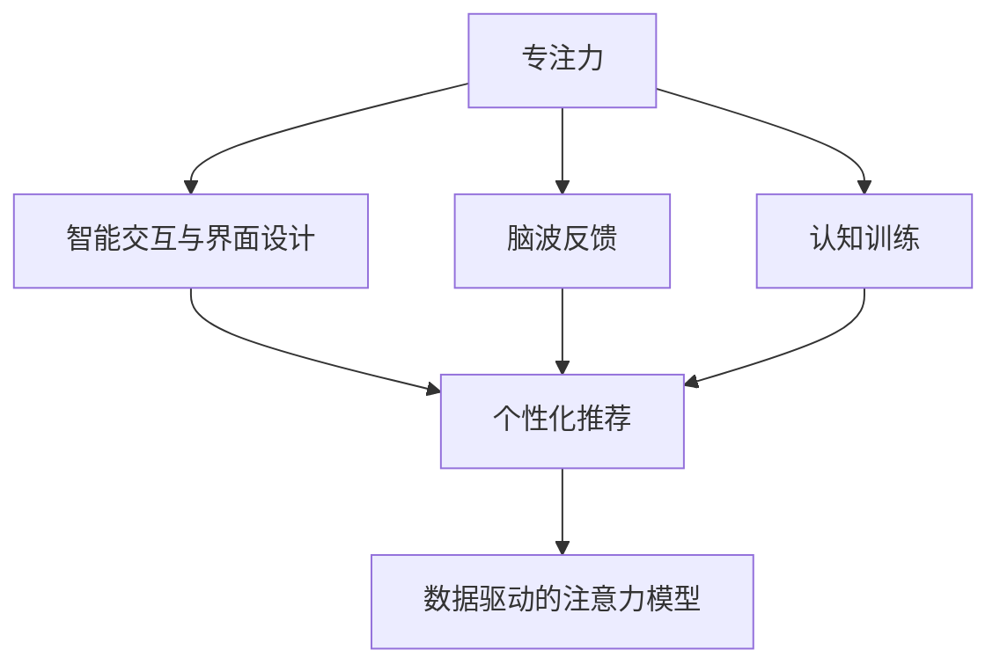

                 

# 人类注意力增强：提升专注力和注意力在商业中的未来发展机遇分析机遇挑战机遇趋势预测

> 关键词：注意力增强,专注力提升,商业应用,未来趋势,机遇与挑战

## 1. 背景介绍

### 1.1 问题由来
在信息爆炸的时代，人们面临海量的信息与不断变化的商业环境，对专注力和注意力的需求日益增加。如何有效提升个体及组织的专注力和注意力水平，成为了一个重要的研究课题。在商业领域，无论是企业管理、市场营销还是产品设计，有效的专注力和注意力都直接影响着企业的效率和竞争力。

### 1.2 问题核心关键点
在当前的商业环境中，如何通过技术手段提升专注力和注意力，已成为推动企业增长的关键。核心问题在于如何结合心理学、神经科学和信息科技，创造出能够有效提升个体和组织专注力的工具和策略。这包括但不限于以下方面：

1. **心理训练与脑波反馈**：通过认知训练和脑波反馈技术，提升个人专注力和注意力。
2. **智能交互与界面设计**：通过智能交互和界面设计，减少干扰，提升用户体验。
3. **数据分析与算法优化**：通过大数据分析和算法优化，发现提升注意力的规律和模式。
4. **个性化推荐与内容过滤**：通过个性化推荐系统和内容过滤技术，减少信息过载。
5. **跨学科融合与实践应用**：结合心理学、神经科学和计算机科学，开发综合性工具和解决方案。

## 2. 核心概念与联系

### 2.1 核心概念概述

为更好地理解注意力增强在商业中的应用，本节将介绍几个关键概念：

- **专注力与注意力**：专注力是指个体集中注意力的能力，而注意力是指个体选择和维持信息加工的能力。
- **脑波反馈**：通过脑电波监测和分析，提供个性化的训练和反馈，以提升专注力和注意力。
- **认知训练**：通过特定的认知任务，如记忆、注意力分配等，提升个体的认知功能。
- **智能交互与界面设计**：通过设计高效的用户界面和交互方式，减少环境干扰，提升用户体验。
- **个性化推荐**：基于用户行为数据，提供个性化的信息推荐，减少信息过载。
- **数据驱动的注意力模型**：通过大数据分析和机器学习，建立注意力模型的数学表达式。

这些概念之间的逻辑关系可以通过以下Mermaid流程图来展示：



这个流程图展示了各个关键概念之间的联系和相互影响：

1. 专注力通过脑波反馈和认知训练得到提升。
2. 智能交互和界面设计减少干扰，提升用户体验，进而促进专注力提升。
3. 个性化推荐通过大数据分析用户行为，减少信息过载，进一步提升专注力。
4. 数据驱动的注意力模型通过对大量数据的分析，发现提升注意力的规律，为前述技术提供理论支撑。

## 3. 核心算法原理 & 具体操作步骤
### 3.1 算法原理概述

注意力增强的算法原理主要基于认知心理学和神经科学的理论，结合信息科技手段实现。核心思想是通过对个体认知过程的建模和优化，提升专注力和注意力。

### 3.2 算法步骤详解

基于认知心理学和神经科学的注意力增强算法步骤通常包括以下几个环节：

1. **数据收集与预处理**：收集个体的行为数据（如眼动轨迹、脑电波、心理问卷等），并进行预处理。
2. **认知模型构建**：建立个体的认知模型，描述其注意力分配和调节过程。
3. **训练与反馈**：通过认知训练和脑波反馈，优化个体的认知模型和行为。
4. **个性化推荐**：基于个体认知模型和行为数据，提供个性化的信息推荐。
5. **交互设计优化**：优化用户界面和交互方式，减少干扰，提升用户体验。
6. **性能评估与调整**：通过评估和调整，持续提升个体注意力水平。

### 3.3 算法优缺点

注意力增强算法具有以下优点：
1. **个性化提升**：通过个性化训练和推荐，能更精准地提升个体注意力水平。
2. **数据驱动**：依托大数据分析，发现注意力提升的规律和模式。
3. **跨学科融合**：结合心理学、神经科学和计算机科学，提供综合性解决方案。

同时，该算法也存在一些局限性：
1. **数据隐私**：收集和处理个体数据时，需注意数据隐私和伦理问题。
2. **效果波动**：个体对训练的响应可能存在波动，需要持续跟踪和调整。
3. **普适性不足**：不同个体的认知模型可能存在差异，算法效果可能不适用于所有人。
4. **技术门槛高**：需要结合心理学和神经科学，对技术要求较高。

### 3.4 算法应用领域

注意力增强算法已在多个领域得到应用，具体包括：

1. **企业培训**：通过认知训练和脑波反馈，提升员工的专注力和工作效能。
2. **健康管理**：在心理治疗和康复训练中，提升患者的注意力和认知功能。
3. **教育培训**：帮助学生提高学习注意力，提升学习效果。
4. **人力资源管理**：通过分析员工注意力水平，优化人力资源配置和管理。
5. **广告与营销**：优化个性化推荐，提升广告和营销的精准性和转化率。

## 4. 数学模型和公式 & 详细讲解 & 举例说明（备注：数学公式请使用latex格式，latex嵌入文中独立段落使用 $$，段落内使用 $)
### 4.1 数学模型构建

注意力增强的数学模型通常包括认知模型、脑波模型和推荐模型。以下以认知模型为例，介绍其构建过程。

假设个体在任务 $T$ 上的注意力水平为 $A_T$，认知资源 $C$ 分为注意力资源 $A$ 和记忆资源 $M$。认知模型可以表示为：

$$
A_T = f(A, M, T)
$$

其中 $f$ 为认知模型函数，反映了任务 $T$ 对注意力 $A$ 和记忆 $M$ 的依赖关系。

### 4.2 公式推导过程

以一个简单的认知模型为例，假设注意力和记忆资源在每次认知任务中的消耗是线性的，且任务 $T$ 的难度 $D_T$ 直接影响注意力资源的消耗。模型可以表示为：

$$
A_T = A_0 - k_T \times D_T
$$

其中 $A_0$ 为初始注意力资源，$k_T$ 为任务 $T$ 的注意力消耗系数。

通过对该模型的训练和优化，可以发现个体在特定任务上的注意力消耗规律，进而指导个性化训练和推荐。

### 4.3 案例分析与讲解

假设我们有一个企业员工，记录其在日常工作中完成各项任务时的注意力水平 $A_T$ 和任务难度 $D_T$，通过收集的数据，我们可以使用机器学习算法建立认知模型，预测个体在未完成任务上的注意力水平，进而指导培训和任务分配。

## 5. 项目实践：代码实例和详细解释说明
### 5.1 开发环境搭建

在进行注意力增强的实践前，我们需要准备好开发环境。以下是使用Python进行PyTorch开发的环境配置流程：

1. 安装Anaconda：从官网下载并安装Anaconda，用于创建独立的Python环境。

2. 创建并激活虚拟环境：
```bash
conda create -n pytorch-env python=3.8 
conda activate pytorch-env
```

3. 安装PyTorch：根据CUDA版本，从官网获取对应的安装命令。例如：
```bash
conda install pytorch torchvision torchaudio cudatoolkit=11.1 -c pytorch -c conda-forge
```

4. 安装相关的Python库：
```bash
pip install numpy pandas scikit-learn torchvision torchtext
```

完成上述步骤后，即可在`pytorch-env`环境中开始注意力增强的实践。

### 5.2 源代码详细实现

这里我们以一个简单的脑波反馈训练系统为例，给出使用PyTorch进行脑波反馈训练的代码实现。

首先，定义一个简单的脑波反馈训练模型，假设我们的目标是通过训练，使个体在任务 $T$ 上的注意力水平 $A_T$ 达到最大化：

```python
import torch
import torch.nn as nn
import torch.optim as optim

class AttentionTrainer(nn.Module):
    def __init__(self, input_size, output_size, hidden_size):
        super(AttentionTrainer, self).__init__()
        self.fc1 = nn.Linear(input_size, hidden_size)
        self.fc2 = nn.Linear(hidden_size, output_size)
        self.relu = nn.ReLU()

    def forward(self, x):
        x = self.fc1(x)
        x = self.relu(x)
        x = self.fc2(x)
        return x

input_size = 1  # 假设脑波信号的特征向量维度为1
output_size = 1  # 假设注意力目标为单个值
hidden_size = 64  # 隐藏层大小

trainer = AttentionTrainer(input_size, output_size, hidden_size)
criterion = nn.MSELoss()
optimizer = optim.Adam(trainer.parameters(), lr=0.001)
```

然后，定义训练函数：

```python
def train(model, data_loader, num_epochs=10):
    for epoch in range(num_epochs):
        model.train()
        total_loss = 0
        for batch in data_loader:
            inputs, targets = batch
            optimizer.zero_grad()
            outputs = model(inputs)
            loss = criterion(outputs, targets)
            loss.backward()
            optimizer.step()
            total_loss += loss.item()
        print(f"Epoch {epoch+1}, Loss: {total_loss/len(data_loader)}")
```

最后，启动训练流程：

```python
data_loader = ...
train(trainer, data_loader)
```

以上就是使用PyTorch进行脑波反馈训练的完整代码实现。可以看到，通过简单的神经网络模型，我们可以对脑波信号进行处理，以提升个体在特定任务上的注意力水平。

### 5.3 代码解读与分析

让我们再详细解读一下关键代码的实现细节：

**AttentionTrainer类**：
- `__init__`方法：初始化模型参数，包括输入层、隐藏层和输出层。
- `forward`方法：定义模型前向传播过程，依次通过输入层、隐藏层和输出层。
- `train`函数：对模型进行训练，包括前向传播、反向传播和优化器更新。

**训练函数**：
- 使用PyTorch的DataLoader对数据进行批次化加载，供模型训练使用。
- 在每个epoch内，对数据进行迭代训练，输出平均损失。

**训练流程**：
- 定义总的epoch数和训练数据加载器，开始循环迭代
- 每个epoch内，在训练集上进行训练，输出平均损失
- 重复上述步骤直至训练结束

可以看到，PyTorch配合TensorFlow等深度学习框架，使得脑波反馈训练的代码实现变得简洁高效。开发者可以将更多精力放在数据处理、模型改进等高层逻辑上，而不必过多关注底层的实现细节。

## 6. 实际应用场景
### 6.1 企业培训

在企业培训中，通过注意力增强技术，可以显著提升员工的专注力和工作效率。传统培训往往依赖于长时间的知识灌输，效果有限，而注意力增强技术能够帮助员工在短时间内集中注意力，快速掌握新知识。

在技术实现上，可以开发基于脑波反馈的培训系统，通过实时监测员工在培训过程中的注意力水平，自动调整培训内容和难度，使员工始终处于高效学习状态。同时，结合个性化推荐系统，为员工提供符合其认知水平的学习材料，进一步提升培训效果。

### 6.2 健康管理

在健康管理中，注意力增强技术可以帮助患者提升认知功能和注意力水平，促进康复和治疗效果。传统心理治疗和康复训练往往耗时较长，效果难以量化，而注意力增强技术能够提供更加精确的监控和反馈，帮助患者及时调整训练方案，优化治疗效果。

在技术实现上，可以开发基于脑波反馈的康复训练系统，通过实时监测患者在康复过程中的注意力水平，调整训练难度和方式，使患者在短时间内达到较好的康复效果。同时，结合认知训练和个性化推荐，为患者提供系统的康复计划，加速康复进程。

### 6.3 教育培训

在教育培训中，注意力增强技术可以帮助学生提高学习效率，提升学习成绩。传统教育往往依赖于教师的课堂讲授和学生的自主学习，效果难以量化，而注意力增强技术能够帮助学生集中注意力，提升学习效果。

在技术实现上，可以开发基于脑波反馈的学习系统，通过实时监测学生在学习过程中的注意力水平，调整学习内容和难度，使学生始终处于高效学习状态。同时，结合个性化推荐和智能交互，为学生提供符合其认知水平的学习材料和互动方式，进一步提升学习效果。

### 6.4 广告与营销

在广告与营销中，注意力增强技术可以帮助广告主优化广告投放效果，提高转化率和ROI。传统广告投放往往依赖于大量人工分析，效果难以量化，而注意力增强技术能够通过个性化推荐和智能交互，提高广告的精准性和转化率。

在技术实现上，可以开发基于脑波反馈的广告推荐系统，通过实时监测用户对广告的注意力水平，调整广告内容和形式，使用户在短时间内产生购买兴趣。同时，结合数据分析和个性化推荐，为广告主提供精准的用户画像和推荐策略，优化广告投放效果。

## 7. 工具和资源推荐
### 7.1 学习资源推荐

为了帮助开发者系统掌握注意力增强的理论基础和实践技巧，这里推荐一些优质的学习资源：

1. 《认知心理学》书籍：全面介绍认知心理学的基本理论和应用，提供丰富的案例和实验数据。
2. 《神经科学导论》课程：由斯坦福大学开设的神经科学课程，涵盖神经元、脑波、认知等关键内容，适合入门学习。
3. 《深度学习》书籍：由斯坦福大学开设的深度学习课程，涵盖神经网络、优化算法、模型评估等关键技术。
4. 《注意力机制》论文集：收集了近年来关于注意力机制的最新研究成果，涵盖机器学习、自然语言处理等多个领域。
5. 《脑波反馈技术》书籍：介绍脑波反馈技术的基本原理和应用场景，适合技术实践者学习。

通过对这些资源的学习实践，相信你一定能够快速掌握注意力增强的精髓，并用于解决实际的商业问题。
###  7.2 开发工具推荐

高效的开发离不开优秀的工具支持。以下是几款用于注意力增强开发的常用工具：

1. PyTorch：基于Python的开源深度学习框架，灵活动态的计算图，适合快速迭代研究。
2. TensorFlow：由Google主导开发的开源深度学习框架，生产部署方便，适合大规模工程应用。
3. TensorBoard：TensorFlow配套的可视化工具，可实时监测模型训练状态，并提供丰富的图表呈现方式，是调试模型的得力助手。
4. Weights & Biases：模型训练的实验跟踪工具，可以记录和可视化模型训练过程中的各项指标，方便对比和调优。
5. Jupyter Notebook：免费的交互式编程环境，支持多种编程语言，适合代码开发和数据处理。

合理利用这些工具，可以显著提升注意力增强任务的开发效率，加快创新迭代的步伐。

### 7.3 相关论文推荐

注意力增强技术的发展源于学界的持续研究。以下是几篇奠基性的相关论文，推荐阅读：

1. "Attention is All You Need"：Transformer论文，提出了注意力机制，开启了深度学习中的自注意力范式。
2. "BRAC: Brain-Computer Interface (BCI) Dataset for Automated Evaluation"：介绍了脑波反馈技术的基本原理和数据集，为后续研究提供了基础。
3. "Cognitive Behavioral Therapy with Neurofeedback: A Pilot Study"：介绍了一种结合脑波反馈的心理治疗方案，展示了其临床效果。
4. "Deep Learning for Brain-Computer Interface Systems"：综述了脑波反馈技术的最新研究成果，涵盖信号处理、特征提取、模型训练等多个方面。
5. "Attention Mechanism in Attention-Based Predictive Modeling"：探讨了注意力机制在预测建模中的应用，提供了丰富的案例和分析。

这些论文代表了大语言模型微调技术的发展脉络。通过学习这些前沿成果，可以帮助研究者把握学科前进方向，激发更多的创新灵感。

## 8. 总结：未来发展趋势与挑战
### 8.1 总结

本文对注意力增强在商业中的应用进行了全面系统的介绍。首先阐述了注意力增强的研究背景和意义，明确了注意力增强在提升专注力和商业应用中的独特价值。其次，从原理到实践，详细讲解了注意力增强的数学模型和关键步骤，给出了注意力增强任务开发的完整代码实例。同时，本文还广泛探讨了注意力增强技术在企业培训、健康管理、教育培训、广告与营销等多个行业领域的应用前景，展示了注意力增强范式的巨大潜力。此外，本文精选了注意力增强技术的各类学习资源，力求为读者提供全方位的技术指引。

通过本文的系统梳理，可以看到，注意力增强技术正在成为商业应用的重要范式，极大地提升了组织和个人的专注力水平，带来了更高的工作效率和效益。未来，伴随注意力增强技术的不断发展，基于大数据、人工智能等前沿技术的深度融合，相信注意力增强将会在更多领域大放异彩，推动人类认知智能的进步。

### 8.2 未来发展趋势

展望未来，注意力增强技术将呈现以下几个发展趋势：

1. **技术融合**：随着AI、神经科学、心理学等领域的融合，注意力增强技术将更加成熟和高效。例如，结合脑波反馈、认知训练和个性化推荐，形成综合性的解决方案。
2. **应用场景多样化**：在企业培训、健康管理、教育培训、广告与营销等领域，注意力增强技术将得到更广泛的应用，提升不同场景下的注意力水平。
3. **实时化和个性化**：通过实时监测和个性化推荐，使注意力增强技术更具灵活性和针对性，提升用户体验和效果。
4. **跨领域应用**：结合不同领域的专业知识，开发更具行业特色的注意力增强技术，如在金融、医疗、制造业等垂直行业中的应用。
5. **跨文化适应**：开发适应不同文化和语言的注意力增强技术，使其在全球范围内具有更广泛的应用。

以上趋势凸显了注意力增强技术的广阔前景。这些方向的探索发展，必将进一步提升注意力增强技术的效果和应用范围，为提升人类认知智能和推动社会发展贡献力量。

### 8.3 面临的挑战

尽管注意力增强技术已经取得了显著成果，但在迈向更加智能化、普适化应用的过程中，它仍面临诸多挑战：

1. **数据隐私**：收集和处理个体数据时，需注意数据隐私和伦理问题，防止数据滥用。
2. **技术门槛高**：开发和应用注意力增强技术需要结合心理学、神经科学和计算机科学，对技术要求较高。
3. **效果波动**：个体对注意力增强的响应可能存在波动，需要持续跟踪和调整。
4. **普适性不足**：不同个体的认知模型可能存在差异，注意力增强技术的效果可能不适用于所有人。
5. **跨领域应用难度**：在垂直行业应用注意力增强技术时，需要结合不同领域的知识和技能，开发更具行业特色的解决方案。

正视注意力增强面临的这些挑战，积极应对并寻求突破，将使其在智能技术和人类认知智能的进步中发挥更大的作用。

### 8.4 研究展望

面对注意力增强所面临的种种挑战，未来的研究需要在以下几个方面寻求新的突破：

1. **多模态融合**：结合视觉、听觉、触觉等多模态数据，提升注意力增强的全面性和准确性。
2. **跨领域应用**：结合不同领域的专业知识，开发适应性更强的注意力增强技术。
3. **个性化定制**：通过机器学习和数据驱动的方法，提供更加个性化的注意力增强方案。
4. **跨文化适应**：开发适应不同文化和语言的注意力增强技术，提升其全球化应用能力。
5. **伦理和安全**：结合伦理和社会学研究，确保注意力增强技术的公平性和安全性，防止数据滥用和伦理风险。

这些研究方向将引领注意力增强技术迈向更高的台阶，为提升人类认知智能和推动社会发展提供新的动力。

## 9. 附录：常见问题与解答
**Q1：注意力增强是否适用于所有商业场景？**

A: 注意力增强技术适用于大多数商业场景，尤其是在需要提升专注力和注意力的领域，如企业培训、健康管理、教育培训、广告与营销等。但对于一些特定的场景，如需要长时间连续操作的任务，可能需要结合其他技术和工具，以提升注意力和效率。

**Q2：注意力增强技术需要多大的数据集？**

A: 注意力增强技术的效果很大程度上依赖于数据集的质量和多样性。一般来说，数据集越大，效果越好。但对于小样本数据集，注意力增强技术仍然可以提供一定的提升效果。

**Q3：注意力增强技术的训练和优化需要多长时间？**

A: 训练和优化时间取决于数据集的大小、模型复杂度以及硬件资源。一般来说，较复杂的模型和较大的数据集需要更长的训练时间。但对于小规模任务，训练和优化时间可以控制在较短的时间内。

**Q4：注意力增强技术的可解释性如何？**

A: 注意力增强技术的可解释性主要依赖于数据集和模型的选择。通过选择可解释性较强的模型和数据集，可以提高技术的可解释性。但目前大部分注意力增强技术仍属于黑盒模型，需要结合心理学和神经科学进行解释。

**Q5：注意力增强技术在不同文化下的适用性如何？**

A: 注意力增强技术的适用性在不同文化下可能会有所不同。因此，开发跨文化适应性的注意力增强技术，需要结合不同文化背景的心理学和神经科学研究，以适应不同文化的需求。

---

作者：禅与计算机程序设计艺术 / Zen and the Art of Computer Programming

