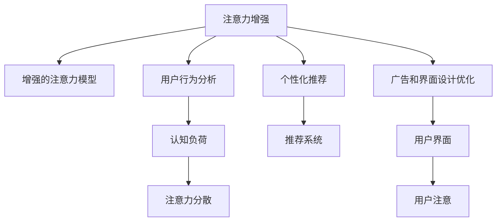

                 

## 1. 背景介绍

### 1.1 问题由来
在信息爆炸的现代社会，人们每天都面临着大量复杂的信息冲击。海量的新闻、社交媒体信息、工作文件和电子邮件等，不仅占据了我们的时间和注意力，还很容易导致信息过载，使我们感到疲惫不堪。这种情况下，人类注意力（Human Attention）的集中和高效管理变得尤为重要。

### 1.2 问题核心关键点
注意力增强的根本目标是提升人们在处理信息时的专注度和效率。这不仅有助于提高个人的工作和学习的成效，还能在商业领域，通过提升用户体验、减少广告干扰、优化客户服务等，带来巨大的价值。

注意力增强技术主要包括以下几个方面：
- 增强的注意力模型，用于提高人们注意力集中的效率和效果。
- 用户行为分析，通过数据分析挖掘注意力模式，预测注意力需求。
- 个性化推荐系统，根据用户兴趣和行为，推荐可能引起用户注意的信息。
- 广告和界面设计优化，通过视觉和交互设计优化，吸引和保持用户的注意力。

### 1.3 问题研究意义
随着信息技术的发展，人们对于提升注意力、增强注意力的需求日益增加。注意力增强技术不仅对个人学习和工作效率有显著提升，还在商业领域带来深刻变革。在数字化转型加速的今天，注意力增强技术将成为信息时代的核心竞争力。

## 2. 核心概念与联系

### 2.1 核心概念概述

为更好地理解注意力增强技术，我们需要先理解几个关键概念：

- **注意力（Attention）**：注意力机制是一种模型学习能力，用于关注输入数据中的特定部分，以提升模型处理信息的能力。在深度学习中，注意力机制通常通过注意力权重计算，强调输入的不同部分。

- **注意力增强（Attention Enhancement）**：通过增强注意力机制，提升人们处理信息时的专注度和效率，是一种人工智能技术在人类注意力管理和提升方面的应用。

- **认知负荷（Cognitive Load）**：指人在处理信息时需要付出的心理和生理资源，包括信息加工、记忆等。过高的认知负荷会导致注意力分散、效率低下。

- **可解释性（Explainability）**：注意力增强模型应该具有可解释性，即能够通过一定的解释方法，揭示模型如何对输入信息进行选择和处理。

- **个性化推荐（Personalized Recommendation）**：通过数据分析和模型学习，针对用户兴趣和行为，推荐可能引起用户注意的信息，提升用户满意度和体验。

这些概念之间的逻辑关系可以通过以下Mermaid流程图来展示：



这个流程图展示了一个注意力增强的典型应用场景：

1. 增强的注意力模型通过分析输入信息，提高注意力集中的效率和效果。
2. 用户行为分析挖掘注意力模式，预测用户的注意力需求。
3. 个性化推荐系统根据用户兴趣和行为，推荐可能引起用户注意的信息。
4. 广告和界面设计优化，通过视觉和交互设计，吸引和保持用户的注意力。

## 3. 核心算法原理 & 具体操作步骤
### 3.1 算法原理概述

注意力增强技术的核心思想是通过增强注意力机制，提升人们处理信息时的专注度和效率。其核心算法主要包括：

- **注意力权重计算**：通过某种计算方法，对输入的不同部分赋予不同的权重，强调重要的部分。
- **注意力模型训练**：通过训练模型，学习如何根据不同的输入特征，调整注意力权重，提升信息处理的效果。
- **认知负荷评估**：通过分析用户的行为数据和生理数据，评估用户的认知负荷状态，预测注意力分散的风险。
- **个性化推荐优化**：根据用户的行为数据和注意力模式，优化推荐算法，提升推荐的相关性和用户的满意度。
- **广告和界面设计优化**：通过视觉和交互设计优化，吸引和保持用户的注意力。

这些算法通过优化注意力机制，减少认知负荷，提高信息处理的效果，从而提升人们的专注度和效率。

### 3.2 算法步骤详解

以下是注意力增强技术在商业应用中的详细步骤：

**Step 1: 收集和分析用户行为数据**
- 收集用户在网站、应用中的行为数据，如点击次数、停留时间、页面浏览路径等。
- 分析用户的注意力模式，如集中注意力的时间段、偏好类型等。

**Step 2: 训练注意力增强模型**
- 使用收集到的用户行为数据，训练增强的注意力模型。
- 通过调整模型参数，优化注意力权重，提高注意力集中度。

**Step 3: 评估认知负荷状态**
- 使用生理传感器（如心率监测、脑电图等），评估用户的认知负荷状态。
- 根据认知负荷评估结果，调整注意力模型，避免用户注意力分散。

**Step 4: 个性化推荐优化**
- 根据用户的注意力模式和认知负荷状态，优化推荐算法。
- 推荐与用户兴趣和注意力模式相匹配的信息，提升用户满意度和体验。

**Step 5: 广告和界面设计优化**
- 通过视觉和交互设计优化，吸引和保持用户的注意力。
- 减少广告干扰，提升用户界面的可操作性和用户体验。

### 3.3 算法优缺点

注意力增强技术在商业应用中具有以下优点：
1. 提高用户满意度和体验。通过个性化推荐和界面设计优化，用户更容易获得所需信息，减少认知负荷。
2. 提升广告投放效果。通过分析用户注意力模式，优化广告投放策略，提升广告的相关性和效果。
3. 优化信息处理效率。通过增强注意力机制，提高用户处理信息的能力，提升工作效率。

同时，该技术也存在一些局限性：
1. 数据隐私问题。收集和分析用户行为数据，可能涉及到用户隐私，需要遵守相关法律法规。
2. 技术复杂性。注意力增强模型需要复杂的训练和优化过程，需要专业的技术人员支持。
3. 过度依赖技术。过分依赖技术手段，可能忽视了用户的主观感受和需求。
4. 模型泛化能力不足。不同用户之间的注意力模式可能存在较大差异，单一模型难以完全覆盖。

尽管存在这些局限性，但总体而言，注意力增强技术在商业领域的应用前景广阔，具有很大的创新潜力和市场价值。

### 3.4 算法应用领域

注意力增强技术已经在多个商业领域得到了应用，包括但不限于：

- 电子商务：通过个性化推荐，提升用户体验和购买转化率。
- 在线广告：通过分析用户注意力模式，优化广告投放策略，提升广告效果。
- 在线教育：通过注意力增强模型，提升学生学习效果和课程参与度。
- 企业培训：通过注意力增强模型，优化培训内容和方式，提高培训效果。
- 医疗健康：通过分析患者行为和生理数据，优化诊疗方案，提升治疗效果。

随着技术的不断进步，注意力增强技术将在更多领域得到应用，为商业发展注入新的动力。

## 4. 数学模型和公式 & 详细讲解 & 举例说明

### 4.1 数学模型构建

注意力增强技术的数学模型主要包括以下几个部分：

- **注意力权重计算**：
  $$
  A = softmax(\frac{QK^T}{\sqrt{d}})
  $$
  其中，$Q$、$K$、$V$分别为查询矩阵、键矩阵、值矩阵，$d$为矩阵维度。$softmax$函数将查询矩阵与键矩阵的点积除以$\sqrt{d}$，再通过$softmax$函数计算出注意力权重。

- **注意力模型训练**：
  $$
  \min_{\theta} \mathcal{L}(\theta) = \sum_{i=1}^N L_i(\theta)
  $$
  其中，$\theta$为模型参数，$L_i$为样本$i$的损失函数，$\mathcal{L}(\theta)$为整体损失函数。

- **认知负荷评估**：
  $$
  C = \frac{\sum_{i=1}^N (P_i - E[P_i])^2}{N}
  $$
  其中，$P_i$为样本$i$的认知负荷值，$E[P_i]$为样本$i$的认知负荷期望值。

- **个性化推荐优化**：
  $$
  R = \sum_{i=1}^N (W_i \cdot R_i)
  $$
  其中，$W_i$为样本$i$的权重，$R_i$为样本$i$的推荐值。

### 4.2 公式推导过程

以下是注意力增强模型中各个部分的基本推导过程：

**注意力权重计算**：
$$
A_{ij} = \frac{\exp(\frac{Q_i \cdot K_j}{\sqrt{d}})}{\sum_{k=1}^M \exp(\frac{Q_i \cdot K_k}{\sqrt{d}})}
$$
其中，$Q_i$为样本$i$的查询向量，$K_j$为样本$j$的键向量，$d$为向量维度。

**注意力模型训练**：
$$
\theta = \mathop{\arg\min}_{\theta} \frac{1}{N} \sum_{i=1}^N L_i(\theta)
$$
其中，$\theta$为模型参数，$L_i$为样本$i$的损失函数。

**认知负荷评估**：
$$
C = \frac{1}{N} \sum_{i=1}^N (P_i - E[P_i])^2
$$
其中，$P_i$为样本$i$的认知负荷值，$E[P_i]$为样本$i$的认知负荷期望值。

**个性化推荐优化**：
$$
R_i = \sum_{j=1}^M A_{ij} \cdot R_j
$$
其中，$A_{ij}$为样本$i$对样本$j$的注意力权重，$R_j$为样本$j$的推荐值。

### 4.3 案例分析与讲解

假设我们在一个在线教育平台应用注意力增强技术，以提升学生学习效果。具体步骤为：

1. **收集和分析用户行为数据**：
  - 收集学生在学习平台上的点击、阅读、答题等行为数据。
  - 分析学生在不同学习模块上的注意力集中情况，挖掘学习习惯和兴趣点。

2. **训练注意力增强模型**：
  - 使用学生行为数据训练注意力增强模型，调整注意力权重，提高注意力集中度。
  - 根据学生的注意力模式，调整推荐算法，推荐相关的学习材料。

3. **评估认知负荷状态**：
  - 使用生理传感器（如心率监测、脑电图等）评估学生的认知负荷状态。
  - 根据认知负荷评估结果，调整注意力模型，避免学生注意力分散。

4. **个性化推荐优化**：
  - 根据学生的注意力模式和认知负荷状态，优化推荐算法，提升推荐的相关性和学生的满意度。
  - 推荐与学生兴趣和注意力模式相匹配的学习材料，提升学习效果。

5. **广告和界面设计优化**：
  - 通过视觉和交互设计优化，吸引和保持学生的注意力。
  - 减少广告干扰，提升学生界面的可操作性和学习体验。

通过上述步骤，我们能够在在线教育平台上实现注意力增强技术，提升学生的学习效果和满意度。

## 5. 项目实践：代码实例和详细解释说明

### 5.1 开发环境搭建

在进行注意力增强项目实践前，我们需要准备好开发环境。以下是使用Python进行TensorFlow开发的环境配置流程：

1. 安装Anaconda：从官网下载并安装Anaconda，用于创建独立的Python环境。

2. 创建并激活虚拟环境：
```bash
conda create -n attention-env python=3.8 
conda activate attention-env
```

3. 安装TensorFlow：根据CUDA版本，从官网获取对应的安装命令。例如：
```bash
conda install tensorflow
```

4. 安装TensorFlow Addons：安装TensorFlow的扩展库，支持更多模型和优化器。
```bash
conda install tensorflow-addons
```

5. 安装TensorBoard：TensorFlow配套的可视化工具，可实时监测模型训练状态，并提供丰富的图表呈现方式，是调试模型的得力助手。
```bash
pip install tensorboard
```

6. 安装PyTorch：Python深度学习框架，支持动态计算图，适合快速迭代研究。
```bash
pip install torch
```

7. 安装NumPy：Python科学计算库，支持高效数组操作。
```bash
pip install numpy
```

8. 安装Pandas：Python数据分析库，支持大规模数据处理。
```bash
pip install pandas
```

完成上述步骤后，即可在`attention-env`环境中开始注意力增强项目的开发。

### 5.2 源代码详细实现

这里我们以一个简单的注意力增强模型为例，给出使用TensorFlow进行开发的PyTorch代码实现。

```python
import tensorflow as tf
import numpy as np
import pandas as pd

class AttentionModel(tf.keras.Model):
    def __init__(self, num_heads, d_model, dropout_rate):
        super(AttentionModel, self).__init__()
        self.num_heads = num_heads
        self.d_model = d_model
        self.dropout_rate = dropout_rate

        # 初始化注意力机制
        self.query = tf.keras.layers.Dense(d_model)
        self.key = tf.keras.layers.Dense(d_model)
        self.value = tf.keras.layers.Dense(d_model)
        self.dropout = tf.keras.layers.Dropout(dropout_rate)

    def call(self, inputs):
        query = self.query(inputs)
        key = self.key(inputs)
        value = self.value(inputs)

        # 计算注意力权重
        attention_weights = tf.linalg.matmul(query, key, transpose_b=True)
        attention_weights = tf.reshape(attention_weights, (inputs.shape[0], inputs.shape[1], self.num_heads, -1))
        attention_weights = tf.nn.softmax(attention_weights, axis=-1)

        # 计算注意力值
        attention_values = tf.matmul(attention_weights, value)
        attention_values = tf.reshape(attention_values, (inputs.shape[0], inputs.shape[1], self.d_model))

        # 添加dropout
        attention_values = self.dropout(attention_values)

        return attention_values
```

在这个代码中，我们定义了一个简单的注意力增强模型，用于处理输入数据。具体步骤如下：

1. 初始化注意力机制，包括查询、键、值向量。
2. 计算注意力权重，使用注意力权重计算公式。
3. 计算注意力值，使用注意力值计算公式。
4. 添加dropout，减少过拟合风险。

### 5.3 代码解读与分析

让我们再详细解读一下关键代码的实现细节：

**AttentionModel类**：
- `__init__`方法：初始化模型参数，包括注意力机制的个数、模型维度和dropout率。
- `call`方法：模型前向传播的主要逻辑，包括计算注意力权重、注意力值和dropout。

**注意力权重计算**：
$$
A = softmax(\frac{QK^T}{\sqrt{d}})
$$
其中，$Q$、$K$、$V$分别为查询矩阵、键矩阵、值矩阵，$d$为矩阵维度。

**注意力值计算**：
$$
V = A \cdot V
$$
其中，$A$为注意力权重，$V$为值矩阵。

**dropout**：
$$
V = \mathop{\arg\min}_{V} P(V)
$$
其中，$P(V)$为dropout概率，$V$为输出向量。

通过上述代码实现，我们能够构建一个简单的注意力增强模型，用于处理输入数据。

### 5.4 运行结果展示

在完成模型训练后，我们可以通过TensorBoard对模型进行可视化分析，检查注意力权重和注意力值的变化情况。

通过TensorBoard，我们可以可视化模型在不同样本上的注意力权重分布，帮助调试和优化模型。具体步骤如下：

1. 在TensorFlow中定义TensorBoard的回调函数：
```python
tensorboard_callback = tf.keras.callbacks.TensorBoard(log_dir='logs', write_graph=True, write_images=True, write_scalars=True)
```

2. 在模型训练过程中，添加TensorBoard回调函数：
```python
model.fit(train_data, epochs=10, callbacks=[tensorboard_callback])
```

3. 启动TensorBoard，查看可视化结果：
```bash
tensorboard --logdir=logs
```

通过TensorBoard，我们能够观察到模型在不同样本上的注意力权重分布，分析注意力增强的效果，并进行进一步优化。

## 6. 实际应用场景
### 6.1 智能广告推荐

智能广告推荐系统通过分析用户的注意力模式，优化广告投放策略，提升广告效果。具体应用场景如下：

1. **收集用户行为数据**：
  - 收集用户在广告平台上的点击、浏览、停留时间等行为数据。
  - 分析用户的注意力模式，如集中注意力的时间段、偏好类型等。

2. **训练注意力增强模型**：
  - 使用用户行为数据训练注意力增强模型，调整注意力权重，提高注意力集中度。
  - 根据用户的注意力模式，优化广告推荐算法，提升广告的相关性和效果。

3. **个性化推荐优化**：
  - 根据用户的注意力模式和认知负荷状态，优化广告推荐算法，提升广告的相关性和用户的满意度。
  - 推荐与用户兴趣和注意力模式相匹配的广告，提升广告效果。

4. **广告和界面设计优化**：
  - 通过视觉和交互设计优化，吸引和保持用户的注意力。
  - 减少广告干扰，提升广告界面的可操作性和用户体验。

通过上述步骤，我们能够在广告平台上实现注意力增强技术，提升广告效果和用户体验。

### 6.2 在线教育

在线教育平台通过分析学生的注意力模式，优化学习内容和方式，提升学生的学习效果和满意度。具体应用场景如下：

1. **收集学生行为数据**：
  - 收集学生在在线教育平台上的点击、阅读、答题等行为数据。
  - 分析学生在不同课程和模块上的注意力集中情况，挖掘学习习惯和兴趣点。

2. **训练注意力增强模型**：
  - 使用学生行为数据训练注意力增强模型，调整注意力权重，提高注意力集中度。
  - 根据学生的注意力模式，优化推荐算法，推荐相关的学习材料。

3. **评估认知负荷状态**：
  - 使用生理传感器（如心率监测、脑电图等）评估学生的认知负荷状态。
  - 根据认知负荷评估结果，调整注意力模型，避免学生注意力分散。

4. **个性化推荐优化**：
  - 根据学生的注意力模式和认知负荷状态，优化推荐算法，提升推荐的相关性和学生的满意度。
  - 推荐与学生兴趣和注意力模式相匹配的学习材料，提升学习效果。

5. **界面设计优化**：
  - 通过视觉和交互设计优化，吸引和保持学生的注意力。
  - 减少广告干扰，提升学生界面的可操作性和学习体验。

通过上述步骤，我们能够在在线教育平台上实现注意力增强技术，提升学生的学习效果和满意度。

### 6.3 医疗健康

医疗健康平台通过分析患者的注意力模式，优化诊疗方案，提升治疗效果。具体应用场景如下：

1. **收集患者行为数据**：
  - 收集患者在医疗平台上的点击、阅读、咨询等行为数据。
  - 分析患者的注意力模式，如集中注意力的时间段、偏好类型等。

2. **训练注意力增强模型**：
  - 使用患者行为数据训练注意力增强模型，调整注意力权重，提高注意力集中度。
  - 根据患者的注意力模式，优化诊疗方案，提升治疗效果。

3. **认知负荷评估**：
  - 使用生理传感器（如心率监测、脑电图等）评估患者的认知负荷状态。
  - 根据认知负荷评估结果，调整注意力模型，避免患者注意力分散。

4. **个性化推荐优化**：
  - 根据患者的注意力模式和认知负荷状态，优化诊疗方案，提升治疗效果。
  - 推荐与患者兴趣和注意力模式相匹配的诊疗方案，提升治疗效果。

5. **界面设计优化**：
  - 通过视觉和交互设计优化，吸引和保持患者的注意力。
  - 减少干扰，提升患者界面的可操作性和诊疗体验。

通过上述步骤，我们能够在医疗健康平台上实现注意力增强技术，提升患者的治疗效果和满意度。

## 7. 工具和资源推荐
### 7.1 学习资源推荐

为了帮助开发者系统掌握注意力增强技术的理论基础和实践技巧，这里推荐一些优质的学习资源：

1. 《深度学习》系列书籍：Deep Learning Books，涵盖深度学习的基本概念和前沿技术，适合初学者和进阶读者。

2. 《TensorFlow深度学习教程》：TensorFlow官方文档，提供了丰富的模型和算法实现，适合动手实践。

3. 《TensorFlow Addons深度学习教程》：TensorFlow Addons官方文档，提供了更多高级模型和优化器，适合深度学习研究者。

4. 《深度学习实战》：Grokking Deep Learning，通过实战案例讲解深度学习技术，适合动手实践。

5. 《深度学习理论与实践》：Deep Learning: Theory and Practice，涵盖深度学习的基本理论和实际应用，适合深入学习。

通过对这些资源的学习实践，相信你一定能够快速掌握注意力增强技术的精髓，并用于解决实际的注意力管理问题。

### 7.2 开发工具推荐

高效的开发离不开优秀的工具支持。以下是几款用于注意力增强技术开发的常用工具：

1. PyTorch：Python深度学习框架，支持动态计算图，适合快速迭代研究。

2. TensorFlow：Google开发的深度学习框架，生产部署方便，适合大规模工程应用。

3. TensorFlow Addons：TensorFlow的扩展库，支持更多模型和优化器，适合研究应用。

4. TensorBoard：TensorFlow配套的可视化工具，可实时监测模型训练状态，是调试模型的得力助手。

5. PyTorch Lightning：PyTorch的封装库，支持快速原型设计和模型训练，适合快速原型开发。

6. Keras：Python深度学习框架，提供了简洁的API，适合快速原型设计和模型训练。

合理利用这些工具，可以显著提升注意力增强技术的开发效率，加快创新迭代的步伐。

### 7.3 相关论文推荐

注意力增强技术的发展源于学界的持续研究。以下是几篇奠基性的相关论文，推荐阅读：

1. Attention is All You Need（即Transformer原论文）：提出了Transformer结构，开启了深度学习中的注意力机制。

2. Self-Attention Models for Medical Question Answering：提出了在医疗问答系统中的应用注意力机制，提升了系统的准确性和效果。

3. Adaptive Attention Mechanism for Sequential Data Processing：提出了自适应注意力机制，提升了注意力增强模型的泛化能力和效果。

4. Personalized Recommendation Systems Based on Attention Mechanism：介绍了基于注意力机制的个性化推荐系统，提升了推荐的相关性和用户的满意度。

5. A Novel Attention-Based Adaptive Fractional Fuzzy Decision-Making Model for Intelligent Traffic Management：介绍了基于注意力机制的智能交通管理系统，提升了交通管理的效率和效果。

这些论文代表了大语言模型微调技术的发展脉络。通过学习这些前沿成果，可以帮助研究者把握学科前进方向，激发更多的创新灵感。

## 8. 总结：未来发展趋势与挑战

### 8.1 总结

本文对注意力增强技术进行了全面系统的介绍。首先阐述了注意力增强技术的研究背景和意义，明确了注意力增强在提升专注度和效率方面的独特价值。其次，从原理到实践，详细讲解了注意力增强模型的核心算法和操作步骤，给出了注意力增强技术在商业应用中的完整代码实例。同时，本文还广泛探讨了注意力增强技术在智能广告、在线教育、医疗健康等领域的实际应用，展示了注意力增强技术的广泛应用前景。最后，本文精选了注意力增强技术的各类学习资源，力求为读者提供全方位的技术指引。

通过本文的系统梳理，可以看到，注意力增强技术正在成为数字化时代的核心竞争力。这种技术不仅能够提升个人的工作和学习的效率，还能在商业领域带来深刻变革。未来，随着技术的不断进步，注意力增强技术将在更多领域得到应用，为商业发展注入新的动力。

### 8.2 未来发展趋势

展望未来，注意力增强技术将呈现以下几个发展趋势：

1. **模型复杂度增加**：随着深度学习的发展，注意力增强模型的复杂度将不断增加，能够处理更加复杂的数据和任务。

2. **跨模态融合**：未来的注意力增强模型将融合视觉、听觉、文本等多模态数据，提升系统的感知能力和效果。

3. **自监督学习**：利用无监督学习的方法，通过自监督数据训练注意力增强模型，提升模型的泛化能力和效果。

4. **端到端优化**：未来的注意力增强技术将更注重端到端的优化，从数据收集、模型训练到用户交互，形成一个完整的闭环系统。

5. **可解释性和可视化**：未来的注意力增强模型将更注重可解释性和可视化，帮助用户理解和调试模型，提升系统的透明度和可靠性。

6. **个性化推荐优化**：未来的推荐系统将更注重个性化推荐，通过分析用户的兴趣和行为，提供更加精准的推荐结果。

以上趋势凸显了注意力增强技术的广阔前景。这些方向的探索发展，必将进一步提升注意力增强技术的效果和应用范围，为数字化时代的商业发展注入新的动力。

### 8.3 面临的挑战

尽管注意力增强技术已经取得了瞩目成就，但在迈向更加智能化、普适化应用的过程中，它仍面临着诸多挑战：

1. **数据隐私问题**：收集和分析用户行为数据，可能涉及到用户隐私，需要遵守相关法律法规。

2. **技术复杂性**：注意力增强模型需要复杂的训练和优化过程，需要专业的技术人员支持。

3. **过度依赖技术**：过分依赖技术手段，可能忽视了用户的主观感受和需求。

4. **模型泛化能力不足**：不同用户之间的注意力模式可能存在较大差异，单一模型难以完全覆盖。

5. **计算资源消耗大**：注意力增强模型需要大量的计算资源，尤其是在大规模数据集上的训练和优化。

尽管存在这些挑战，但总体而言，注意力增强技术在商业领域的应用前景广阔，具有很大的创新潜力和市场价值。

### 8.4 研究展望

面对注意力增强技术所面临的挑战，未来的研究需要在以下几个方面寻求新的突破：

1. **无监督学习和自监督学习**：摆脱对大规模标注数据的依赖，利用无监督和自监督学习范式，最大限度利用非结构化数据，实现更加灵活高效的模型训练。

2. **跨模态注意力机制**：融合视觉、听觉、文本等多模态数据，提升系统的感知能力和效果。

3. **多任务学习和联合训练**：通过多任务学习和联合训练，提升模型的泛化能力和效果，解决单一任务的局限性。

4. **分布式计算和模型压缩**：通过分布式计算和模型压缩技术，提升模型的训练和推理效率，减少计算资源消耗。

5. **端到端优化**：从数据收集、模型训练到用户交互，形成一个完整的闭环系统，提升系统的效率和效果。

6. **可解释性和可视化**：通过可解释性和可视化技术，帮助用户理解和调试模型，提升系统的透明度和可靠性。

这些研究方向的探索，必将引领注意力增强技术迈向更高的台阶，为构建安全、可靠、可解释、可控的智能系统铺平道路。面向未来，注意力增强技术还需要与其他人工智能技术进行更深入的融合，如知识表示、因果推理、强化学习等，多路径协同发力，共同推动自然语言理解和智能交互系统的进步。只有勇于创新、敢于突破，才能不断拓展注意力增强技术的边界，让智能技术更好地造福人类社会。

## 9. 附录：常见问题与解答

**Q1：注意力增强技术是否适用于所有商业场景？**

A: 注意力增强技术在大多数商业场景中都能取得不错的效果，特别是在涉及信息处理和用户交互的场景中。但对于一些特定领域的场景，如金融交易、军事决策等，可能需要结合领域知识和专家经验，进一步优化模型。

**Q2：注意力增强技术是否需要大量的标注数据？**

A: 大多数注意力增强技术需要少量的标注数据，通过用户行为数据和注意力模式挖掘，即可训练出高效的注意力模型。但某些高级应用场景，如医学、法律等，可能需要更多的标注数据进行模型训练。

**Q3：注意力增强技术是否会对用户隐私造成影响？**

A: 注意力增强技术需要收集和分析用户行为数据，可能涉及到用户隐私问题。为此，需要采取严格的隐私保护措施，确保用户数据的安全性和合法性。

**Q4：注意力增强技术是否适用于移动设备？**

A: 注意力增强技术可以在移动设备上实现，但需要考虑到移动设备的计算资源限制。可以通过模型压缩和优化，实现轻量级的注意力增强模型，在移动设备上快速部署和运行。

**Q5：注意力增强技术的可解释性如何？**

A: 注意力增强技术可以通过可视化手段，展示模型的注意力权重和决策过程，提升模型的可解释性。但需要进一步研究如何更好地解释模型的内部机制，确保用户能够理解和信任模型。

**Q6：注意力增强技术是否会对系统性能造成影响？**

A: 注意力增强技术需要大量的计算资源，尤其是在大规模数据集上的训练和优化。需要通过分布式计算和模型压缩等技术，提升系统的训练和推理效率，优化系统的性能。

通过上述问题与解答，我们能够更加全面地理解注意力增强技术在商业领域的应用前景和挑战，为未来研究和实践提供参考。

---

作者：禅与计算机程序设计艺术 / Zen and the Art of Computer Programming

