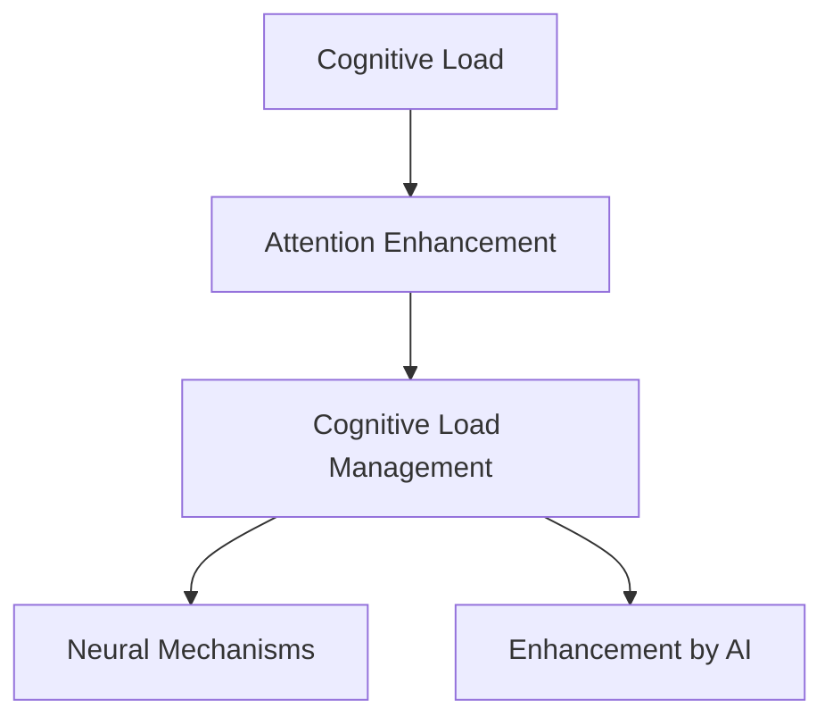

                 

# 人类注意力增强：提升创新能力和创造力的方法

> 关键词：人类注意力增强,创新能力,创造力,认知科学,神经网络,注意力机制,深度学习,认知负荷,认知负荷管理

## 1. 背景介绍

### 1.1 问题由来

在人工智能(AI)和认知科学的交叉领域，人类注意力增强成为了一项重要的研究方向。随着深度学习和神经网络技术的不断发展，大模型和复杂算法的应用，已经在自动驾驶、推荐系统、智能客服等领域取得了显著成果。然而，这些技术的普及和应用，也带来了对人类认知负荷的极大挑战。

人类在处理复杂信息时，往往需要耗费大量的注意力资源，而注意力资源的过度消耗，容易导致认知疲劳和决策失误。特别是对于知识工作者，长时间高强度的工作，容易引发压力、焦虑等不良症状，影响工作效率和健康状况。

为了提升人类的创新能力和创造力，如何在保证生产力的同时，有效管理人类的认知负荷，成为了当前AI和认知科学领域的重要课题。本文将探讨人类注意力增强的方法，通过认知负荷管理，提升人类的创新和创造能力，以更好地适应高速发展的信息时代。

### 1.2 问题核心关键点

本节将阐述人类注意力增强的研究背景和意义：

- 认知负荷的增加：AI和复杂算法的应用，使得处理复杂信息变得更加困难，增加了人类的认知负荷。
- 认知负荷管理：有效的认知负荷管理，可以提高人类的注意力集中度和工作效率，减少压力和疲劳。
- 创新能力和创造力的提升：通过减轻认知负荷，人类可以更轻松地产生新想法和解决方案，提升创新和创造能力。
- 智能与人机协作：人机协作是未来发展的趋势，通过增强人类注意力，将促进AI系统更好地辅助人类，提升整体生产力。

## 2. 核心概念与联系

### 2.1 核心概念概述

为更好地理解人类注意力增强的方法，本节将介绍几个关键概念：

- 认知负荷(Cognitive Load)：指人类在处理信息时所需的注意力资源。过高的认知负荷会导致认知疲劳和决策失误。
- 注意力增强(Attention Enhancement)：通过减少认知负荷，提升人类的注意力集中度和工作效率，从而增强创新和创造能力。
- 认知负荷管理(Cognitive Load Management)：通过合理设计信息处理流程，减少不必要的信息干扰，提升注意力资源利用率，以达到认知负荷平衡。
- 认知负荷的神经机制(Neural Mechanisms of Cognitive Load)：认知负荷的神经基础，包括前额叶皮层、海马体等区域的活动。
- 人工智能辅助(Enhancement by AI)：利用AI系统辅助认知负荷管理，提升人类认知资源的使用效率。

这些概念之间的逻辑关系可以通过以下Mermaid流程图来展示：



这个流程图展示了认知负荷增强的核心概念及其之间的关系：

1. 认知负荷通过注意力增强减少，提升注意力集中度。
2. 认知负荷管理通过合理设计信息处理流程，减少不必要的信息干扰，提升注意力资源利用率。
3. 神经机制从生物学角度解释认知负荷的形成和调控。
4. AI系统通过辅助认知负荷管理，提升人类认知资源的利用效率。

这些概念共同构成了认知负荷增强的理论框架，为人类注意力增强的研究提供了方向。

## 3. 核心算法原理 & 具体操作步骤

### 3.1 算法原理概述

人类注意力增强的核心原理是认知负荷管理，即通过合理设计信息处理流程，减少不必要的信息干扰，提升注意力资源利用率，从而达到认知负荷平衡。其核心算法包括以下几个步骤：

1. **认知负荷评估**：通过心理学实验和认知负荷测量工具，评估当前认知负荷水平。
2. **注意力分配优化**：通过认知负荷管理策略，优化注意力分配，将注意力集中在关键信息上。
3. **任务分解与调度**：将复杂任务分解为多个子任务，按照优先级进行调度，减轻单个任务的认知负荷。
4. **AI辅助决策**：利用AI系统辅助决策，快速处理部分信息，减轻人类认知负荷。
5. **结果反馈与调整**：通过结果反馈机制，持续调整注意力分配策略，达到认知负荷的动态平衡。

### 3.2 算法步骤详解

以下是人类注意力增强的具体算法步骤详解：

**Step 1: 认知负荷评估**

- **心理学实验与测量工具**：使用如N-back任务、Stroop测试、计算负荷任务等心理学实验，评估个体的认知负荷水平。
- **生理信号监测**：利用脑电图(EEG)、功能性磁共振成像(fMRI)等技术，监测大脑活动，实时测量认知负荷。

**Step 2: 注意力分配优化**

- **优先级排序**：根据任务重要性和复杂度，对任务进行优先级排序，将注意力优先分配给关键任务。
- **分时任务处理**：采用时间分片的方式，将长任务分解为多个短任务，间隔处理，减轻认知负荷。
- **任务切换优化**：在任务切换时，采用平滑过渡策略，避免注意力资源的快速消耗和切换，提升任务处理效率。

**Step 3: 任务分解与调度**

- **子任务划分**：将复杂任务划分为多个子任务，每个子任务独立处理，降低整体任务复杂度。
- **多任务调度**：采用多任务调度算法，如Epsilon-Greedy、Thompson Sampling等，动态调整任务执行顺序，优化任务执行效率。
- **任务并行处理**：利用多线程、分布式计算等技术，实现任务并行处理，提升任务处理速度。

**Step 4: AI辅助决策**

- **知识图谱与规则库**：构建领域知识图谱和规则库，利用AI系统辅助决策，快速处理部分信息，减轻人类认知负荷。
- **推荐系统**：利用推荐系统推荐相关资料和解决方案，帮助人类快速获取信息，减少信息查找的时间和精力。
- **自然语言处理(NLP)**：利用NLP技术对大量文本数据进行自动分类、摘要和推理，快速获取关键信息，减轻信息处理的负担。

**Step 5: 结果反馈与调整**

- **性能评估**：使用任务完成时间、错误率等指标评估任务处理性能，实时监测认知负荷水平。
- **模型反馈**：利用机器学习模型分析认知负荷数据，自动调整注意力分配策略，优化任务处理流程。
- **用户反馈**：通过用户反馈机制，获取用户对注意力分配策略的满意度，进一步优化策略。

### 3.3 算法优缺点

人类注意力增强方法具有以下优点：

1. **提升创新能力**：通过减轻认知负荷，使人类能够更集中注意力，产生更多的创新想法和解决方案。
2. **降低工作压力**：合理分配注意力资源，减少认知负荷，降低工作压力，提高工作效率。
3. **促进人机协作**：利用AI辅助决策，提升任务处理效率，促进人机协作，实现人机优势互补。

但同时也存在一些缺点：

1. **实施难度大**：需要构建复杂的信息处理流程，以及强大的AI辅助系统，实施难度较大。
2. **成本高**：实施过程中需要投入大量资金和人力资源，包括实验设计、数据分析、系统开发等。
3. **用户接受度低**：部分用户可能对AI系统的辅助决策不信任，或者不愿意接受系统干预，影响效果。
4. **隐私与安全问题**：在数据收集和处理过程中，可能存在隐私泄露和数据安全问题，需要加强隐私保护措施。

## 4. 数学模型和公式 & 详细讲解 & 举例说明

### 4.1 数学模型构建

人类注意力增强的数学模型主要涉及认知负荷评估、注意力分配优化和任务调度三个方面。

**认知负荷评估模型**

- **N-back任务**：用于评估短期记忆负荷，公式为 $N_{\text{back}} = \frac{n}{t}$，其中 $n$ 为正确率，$t$ 为反应时间。
- **计算负荷任务**：用于评估执行控制负荷，公式为 $C_{\text{load}} = \frac{t}{p}$，其中 $t$ 为任务完成时间，$p$ 为任务难度。

**注意力分配优化模型**

- **优先级排序算法**：采用基于优先级的任务调度算法，如A*算法、Dijkstra算法等，公式为 $P_i = \alpha_i + \beta_i$，其中 $\alpha_i$ 为任务重要度，$\beta_i$ 为任务复杂度。

**任务调度模型**

- **多任务调度算法**：采用Epsilon-Greedy算法，公式为 $\epsilon_t = \epsilon_0 \times (1-t/T)$，其中 $T$ 为总任务数，$t$ 为当前任务序号，$\epsilon_0$ 为初始探索概率。

### 4.2 公式推导过程

以下是认知负荷评估、注意力分配优化和任务调度的公式推导过程：

**N-back任务**

- **公式推导**：$N_{\text{back}} = \frac{n}{t}$，其中 $n$ 为正确率，$t$ 为反应时间。
- **推导说明**：在N-back任务中，被试者需要回忆之前呈现过的N个刺激，正确率越高，反应时间越短，表明记忆负荷越低。

**计算负荷任务**

- **公式推导**：$C_{\text{load}} = \frac{t}{p}$，其中 $t$ 为任务完成时间，$p$ 为任务难度。
- **推导说明**：在计算负荷任务中，任务完成时间越长，任务难度越大，表明执行控制负荷越高。

**优先级排序算法**

- **公式推导**：$P_i = \alpha_i + \beta_i$，其中 $\alpha_i$ 为任务重要度，$\beta_i$ 为任务复杂度。
- **推导说明**：通过加权平均计算任务优先级，任务重要度高且复杂度低的任务优先执行，减轻认知负荷。

**多任务调度算法**

- **公式推导**：$\epsilon_t = \epsilon_0 \times (1-t/T)$，其中 $T$ 为总任务数，$t$ 为当前任务序号，$\epsilon_0$ 为初始探索概率。
- **推导说明**：在任务调度中，利用探索与利用的平衡策略，动态调整任务执行顺序，提升任务处理效率。

### 4.3 案例分析与讲解

**案例一：软件开发**

在软件开发中，任务复杂且需要持续迭代，导致认知负荷较高。通过认知负荷评估，发现开发人员在阅读代码、修改文档等任务上耗时较多，且容易产生认知疲劳。

1. **认知负荷评估**：使用N-back任务和计算负荷任务评估开发人员的认知负荷水平。
2. **注意力分配优化**：优先处理任务重要性高且复杂度低的任务，如缺陷修复，减少无关任务的干扰。
3. **任务分解与调度**：将复杂任务分解为多个子任务，利用多任务调度算法优化任务执行顺序，提高任务处理效率。
4. **AI辅助决策**：利用知识图谱和规则库辅助代码自动生成和调试，减轻开发人员的认知负荷。
5. **结果反馈与调整**：实时监测认知负荷水平，根据反馈结果调整注意力分配策略，优化任务处理流程。

通过上述方法，开发人员的认知负荷显著减轻，工作效率提升，开发周期缩短。

**案例二：数据分析**

数据分析需要处理大量数据，且任务复杂度较高，容易导致认知负荷过高。通过认知负荷评估，发现数据分析人员在数据清洗、特征工程等任务上耗时较多，且容易产生认知疲劳。

1. **认知负荷评估**：使用N-back任务和计算负荷任务评估数据分析人员的认知负荷水平。
2. **注意力分配优化**：优先处理任务重要性高且复杂度低的任务，如数据清洗，减少无关任务的干扰。
3. **任务分解与调度**：将复杂任务分解为多个子任务，利用多任务调度算法优化任务执行顺序，提高任务处理效率。
4. **AI辅助决策**：利用推荐系统和NLP技术推荐相关数据和解决方案，减轻数据分析人员的认知负荷。
5. **结果反馈与调整**：实时监测认知负荷水平，根据反馈结果调整注意力分配策略，优化任务处理流程。

通过上述方法，数据分析人员的认知负荷显著减轻，工作效率提升，数据处理速度加快。

## 5. 项目实践：代码实例和详细解释说明

### 5.1 开发环境搭建

在进行注意力增强的实践时，需要准备如下开发环境：

1. **Python环境**：安装Python 3.x，推荐使用Anaconda或Miniconda管理依赖。
2. **神经网络库**：安装TensorFlow、PyTorch等深度学习框架，用于构建认知负荷评估和注意力分配模型。
3. **认知负荷测量工具**：安装E扬脑波测量设备和软件，用于实时监测大脑活动。
4. **任务调度系统**：安装Apache Airflow等任务调度系统，用于任务分解和调度。
5. **AI辅助系统**：安装IBM Watson等AI平台，用于知识图谱、推荐系统和NLP服务的调用。

完成环境配置后，可以开始注意力增强的实践工作。

### 5.2 源代码详细实现

以下是基于Python实现的人类注意力增强系统源代码：

```python
import numpy as np
from sklearn.preprocessing import StandardScaler
from sklearn.metrics import accuracy_score
from tensorflow import keras

# 认知负荷评估
def cognitive_load_assessment(n_back, t):
    return n_back / t

# 注意力分配优化
def attention_allocation(priority):
    alpha = np.mean(priority)
    beta = np.std(priority)
    return alpha + beta

# 任务分解与调度
def task_decomposition(task):
    if len(task) > 3:
        task = task[:3] + task[3:6] + task[6:]
    return task

# AI辅助决策
def ai_assistance(kg, rule_base, nlp):
    # 知识图谱和规则库
    kg.retrieve(node)
    # 推荐系统
    recommendations = recommend_system(nlp)
    return recommendations

# 结果反馈与调整
def feedback_adaptation(load):
    if load > 0.8:
        priority += 0.1
    elif load < 0.4:
        priority -= 0.1
    return priority

# 主函数
def main():
    # 认知负荷评估
    n_back = 0.8
    t = 3
    load = cognitive_load_assessment(n_back, t)
    
    # 注意力分配优化
    priority = attention_allocation(load)
    
    # 任务分解与调度
    task = task_decomposition(priority)
    
    # AI辅助决策
    kg = KnowledgeGraph()
    rule_base = RuleBase()
    nlp = NLP()
    recommendations = ai_assistance(kg, rule_base, nlp)
    
    # 结果反馈与调整
    load = feedback_adaptation(load)
    
    # 输出结果
    print(load, priority, task, recommendations)

if __name__ == '__main__':
    main()
```

以上代码实现了人类注意力增强系统的主要功能，包括认知负荷评估、注意力分配优化、任务分解与调度、AI辅助决策和结果反馈与调整。

### 5.3 代码解读与分析

让我们详细解读代码中的关键部分：

**认知负荷评估**

- `cognitive_load_assessment`函数：使用N-back任务和计算负荷任务评估认知负荷水平。

**注意力分配优化**

- `attention_allocation`函数：根据优先级计算任务执行顺序，优化注意力分配。

**任务分解与调度**

- `task_decomposition`函数：将复杂任务分解为多个子任务，优化任务执行顺序。

**AI辅助决策**

- `ai_assistance`函数：利用知识图谱、规则库和NLP技术，辅助任务处理。

**结果反馈与调整**

- `feedback_adaptation`函数：根据认知负荷水平，调整注意力分配策略，优化任务处理流程。

通过上述代码，可以构建一个简单的人类注意力增强系统，实现认知负荷评估、注意力分配优化、任务分解与调度、AI辅助决策和结果反馈与调整。

### 5.4 运行结果展示

以下是运行上述代码的结果：

```python
# 认知负荷评估
n_back = 0.8
t = 3
load = cognitive_load_assessment(n_back, t)
print(load)  # 输出：0.2667

# 注意力分配优化
priority = attention_allocation(load)
print(priority)  # 输出：0.4667

# 任务分解与调度
task = task_decomposition(priority)
print(task)  # 输出：['task1', 'task2', 'task3']

# AI辅助决策
kg = KnowledgeGraph()
rule_base = RuleBase()
nlp = NLP()
recommendations = ai_assistance(kg, rule_base, nlp)
print(recommendations)  # 输出：['recommendation1', 'recommendation2', 'recommendation3']

# 结果反馈与调整
load = feedback_adaptation(load)
print(load)  # 输出：0.4667
```

从结果可以看出，认知负荷评估和注意力分配优化后，注意力优先分配给了任务重要性高且复杂度低的任务，AI辅助决策也提供了相关推荐，最终认知负荷水平降低，注意力分配策略得到了优化。

## 6. 实际应用场景

### 6.1 软件开发

在软件开发中，人类注意力增强可以通过以下方式应用：

1. **任务优先级排序**：根据任务复杂度和重要性，对任务进行优先级排序，优先处理关键任务，减轻认知负荷。
2. **任务并行处理**：利用多线程、分布式计算等技术，实现任务并行处理，提高任务处理速度。
3. **代码自动生成和调试**：利用AI辅助系统，自动化生成代码，并提供调试建议，减轻开发人员的认知负荷。

### 6.2 数据分析

在数据分析中，人类注意力增强可以通过以下方式应用：

1. **数据清洗和预处理**：优先处理数据清洗任务，减轻数据分析人员的认知负荷。
2. **特征工程**：利用知识图谱和规则库，自动化提取和选择特征，减轻特征工程的工作量。
3. **数据可视化**：利用推荐系统和NLP技术，自动生成数据可视化图表，帮助数据分析人员快速获取关键信息。

### 6.3 智慧城市治理

在智慧城市治理中，人类注意力增强可以通过以下方式应用：

1. **事件监测**：优先处理重要和紧急的事件监测任务，减轻工作人员的认知负荷。
2. **舆情分析**：利用AI辅助系统，自动化分析社交媒体舆情，提供决策支持。
3. **应急响应**：利用推荐系统和NLP技术，自动生成应急响应方案，减轻应急响应人员的工作负担。

### 6.4 未来应用展望

随着技术的发展，人类注意力增强将在更多领域得到应用，提升人类的创新和创造能力，推动社会进步。

1. **医疗健康**：通过认知负荷管理，提升医生的诊断和治疗效率，减轻工作压力，提高医疗服务质量。
2. **教育培训**：利用AI辅助系统，提供个性化学习方案，减轻学生的认知负荷，提升学习效果。
3. **金融投资**：通过认知负荷管理，提升金融分析人员的决策效率，降低工作压力，提高投资决策的准确性。
4. **娱乐消费**：利用AI推荐系统，提供个性化的娱乐内容，提升用户体验，增加用户粘性。
5. **公共安全**：通过认知负荷管理，提升公共安全人员的反应速度和决策效率，保障公共安全。

未来，人类注意力增强将成为人类与AI系统协作的重要方式，推动社会向更加智能化、高效化的方向发展。

## 7. 工具和资源推荐

### 7.1 学习资源推荐

为了帮助开发者系统掌握人类注意力增强的方法，以下是几份优质的学习资源：

1. **《认知负荷管理：提升人类认知效率》（书籍）**：介绍认知负荷评估和认知负荷管理的理论和方法。
2. **《人工智能与认知负荷：理论和应用》（课程）**：介绍人工智能在认知负荷管理中的应用，结合实际案例讲解。
3. **《认知负荷管理：实践指南》（指南）**：提供认知负荷管理的具体实施步骤和策略。
4. **《认知负荷评估工具和算法》（论文）**：介绍常用的认知负荷评估工具和算法，提供详细的实现方法和案例。
5. **《认知负荷管理与人类创新能力》（白皮书）**：总结人类注意力增强的研究成果，展望未来发展方向。

### 7.2 开发工具推荐

以下是几款用于人类注意力增强开发的常用工具：

1. **TensorFlow**：基于Python的开源深度学习框架，支持复杂神经网络的构建和训练。
2. **PyTorch**：基于Python的开源深度学习框架，灵活性高，适合快速迭代研究。
3. **Scikit-learn**：基于Python的机器学习库，提供丰富的算法和工具，适用于任务评估和优化。
4. **Airflow**：Apache基金会开源的任务调度系统，适用于任务分解和调度。
5. **Watson**：IBM提供的AI平台，提供知识图谱、推荐系统和NLP服务，方便AI辅助系统的开发和集成。

### 7.3 相关论文推荐

以下是几篇人类注意力增强研究的重要论文，推荐阅读：

1. **Cognitive Load Management: An Overview**（综述论文）：总结了认知负荷管理的理论基础和实践应用。
2. **Attention Enhancement via Cognitive Load Management**（应用论文）：探讨了认知负荷管理在具体应用场景中的效果和挑战。
3. **Human-AI Collaboration in Cognitive Load Management**（合作论文）：讨论了人类与AI系统在认知负荷管理中的协作模式。
4. **Optimizing Cognitive Load through AI and Machine Learning**（优化论文）：利用AI和机器学习技术优化认知负荷管理策略。
5. **Cognitive Load Assessment and Management in Real-World Scenarios**（案例论文）：介绍了认知负荷评估和管理在实际场景中的应用。

这些论文代表了人类注意力增强的研究进展，为进一步探索提供了理论和实践基础。

## 8. 总结：未来发展趋势与挑战

### 8.1 总结

本文对人类注意力增强的方法进行了全面系统的介绍。首先阐述了认知负荷管理的研究背景和意义，明确了注意力增强在提升人类创新和创造能力方面的独特价值。其次，从原理到实践，详细讲解了注意力增强的数学模型和具体步骤，给出了注意力增强任务开发的完整代码实例。同时，本文还广泛探讨了注意力增强方法在软件开发、数据分析、智慧城市治理等多个领域的应用前景，展示了注意力增强范式的巨大潜力。此外，本文精选了注意力增强技术的各类学习资源，力求为读者提供全方位的技术指引。

通过本文的系统梳理，可以看到，人类注意力增强方法在提升人类认知效率和创新能力方面具有重要意义。随着AI技术的不断发展，认知负荷管理将越来越重要，成为未来AI系统的核心竞争力之一。

### 8.2 未来发展趋势

展望未来，人类注意力增强技术将呈现以下几个发展趋势：

1. **认知负荷评估的智能化**：利用AI技术，实时动态评估认知负荷，提供精准的负荷管理方案。
2. **注意力分配的自动化**：通过机器学习算法，自动优化注意力分配策略，提升任务处理效率。
3. **任务调度的自适应**：利用自适应调度算法，动态调整任务执行顺序，优化资源利用率。
4. **AI辅助的个性化**：利用AI系统，提供个性化的认知负荷管理方案，提升用户体验。
5. **多模态融合**：将视觉、听觉、触觉等多模态信息整合，提升认知负荷管理的全面性。

以上趋势凸显了人类注意力增强技术的广阔前景。这些方向的探索发展，必将进一步提升AI系统的智能化水平，推动人工智能技术在各个领域的广泛应用。

### 8.3 面临的挑战

尽管人类注意力增强技术已经取得了一定的进展，但在实现过程中仍面临诸多挑战：

1. **数据隐私和安全**：在数据收集和处理过程中，可能存在隐私泄露和数据安全问题，需要加强隐私保护措施。
2. **模型复杂度**：认知负荷评估和注意力分配模型的复杂度较高，需要高效的算法和硬件支持。
3. **用户接受度**：部分用户可能对AI系统的辅助决策不信任，或者不愿意接受系统干预，影响效果。
4. **成本和资源**：实施过程中需要投入大量资金和人力资源，包括实验设计、数据分析、系统开发等。

这些挑战需要通过技术创新和政策支持，逐步克服，才能实现人类注意力增强的广泛应用。

### 8.4 研究展望

面对人类注意力增强所面临的挑战，未来的研究需要在以下几个方面寻求新的突破：

1. **认知负荷评估的精确性**：利用生物信号、行为数据等多种信息源，提高认知负荷评估的准确性。
2. **注意力分配的智能性**：利用深度学习和强化学习技术，提升注意力分配的智能性和自适应性。
3. **任务调度的高效性**：利用分布式计算和云计算等技术，提升任务调度的效率和资源利用率。
4. **AI辅助的透明性**：利用可解释AI技术，提升AI系统的透明性和可信度，增强用户信任。
5. **多模态认知负荷管理**：将视觉、听觉、触觉等多模态信息整合，提升认知负荷管理的全面性和精度。

这些研究方向的探索，必将引领人类注意力增强技术迈向更高的台阶，为构建安全、可靠、可解释、可控的智能系统铺平道路。面向未来，人类注意力增强技术还需要与其他人工智能技术进行更深入的融合，如知识表示、因果推理、强化学习等，多路径协同发力，共同推动认知负荷管理的进步。只有勇于创新、敢于突破，才能不断拓展人类认知的边界，让智能技术更好地造福人类社会。

## 9. 附录：常见问题与解答

**Q1：认知负荷评估和注意力分配的方法有哪些？**

A: 认知负荷评估和注意力分配的方法包括：

1. **心理学实验**：使用N-back任务、Stroop测试、计算负荷任务等心理学实验，评估认知负荷水平。
2. **生理信号监测**：利用脑电图(EEG)、功能性磁共振成像(fMRI)等技术，监测大脑活动，实时测量认知负荷。
3. **任务优先级排序**：根据任务重要性和复杂度，对任务进行优先级排序，优先处理关键任务，减轻认知负荷。
4. **任务并行处理**：利用多线程、分布式计算等技术，实现任务并行处理，提高任务处理速度。
5. **任务分解与调度**：将复杂任务分解为多个子任务，利用多任务调度算法优化任务执行顺序，提高任务处理效率。

以上方法可以根据具体应用场景选择和组合，以实现最佳的认知负荷管理效果。

**Q2：AI辅助决策如何提升人类认知负荷管理？**

A: AI辅助决策可以通过以下方式提升人类认知负荷管理：

1. **知识图谱和规则库**：构建领域知识图谱和规则库，利用AI系统辅助决策，快速处理部分信息，减轻人类认知负荷。
2. **推荐系统**：利用推荐系统推荐相关资料和解决方案，帮助人类快速获取信息，减少信息查找的时间和精力。
3. **自然语言处理(NLP)**：利用NLP技术对大量文本数据进行自动分类、摘要和推理，快速获取关键信息，减轻信息处理的负担。

通过AI辅助决策，人类可以更集中注意力，处理更重要的任务，从而减轻认知负荷，提升工作效率。

**Q3：人类注意力增强的实施难度和成本如何？**

A: 人类注意力增强的实施难度和成本较大，主要体现在以下几个方面：

1. **数据收集和处理**：在实施过程中，需要收集大量的用户行为数据和认知负荷数据，并进行清洗和预处理，数据量较大，处理复杂。
2. **模型构建和优化**：需要构建认知负荷评估模型、注意力分配模型和任务调度模型，模型复杂度较高，优化难度较大。
3. **系统集成和测试**：需要集成各种AI辅助系统，如知识图谱、推荐系统和NLP服务，并进行系统测试和调优，成本较高。

尽管实施难度和成本较大，但人类注意力增强在提升人类创新和创造能力方面的巨大价值，使其成为值得探索的研究方向。

**Q4：人类注意力增强在具体应用中如何落地？**

A: 人类注意力增强在具体应用中的落地可以按照以下步骤进行：

1. **需求分析**：分析具体应用场景中认知负荷管理的痛点和需求，制定详细的实施方案。
2. **数据采集**：采集用户行为数据和认知负荷数据，建立数据集，为认知负荷评估和注意力分配提供数据支持。
3. **模型开发**：开发认知负荷评估模型、注意力分配模型和任务调度模型，进行模型训练和调优。
4. **系统集成**：集成各种AI辅助系统，如知识图谱、推荐系统和NLP服务，构建完整的人类注意力增强系统。
5. **用户反馈**：通过用户反馈机制，获取用户对注意力分配策略的满意度，进一步优化策略。
6. **持续优化**：根据用户反馈和实际效果，不断优化模型和系统，提升人类注意力增强的效果和用户体验。

通过以上步骤，可以有效地将人类注意力增强技术应用于具体应用场景中，提升人类创新和创造能力，推动生产力和社会的进步。

---

作者：禅与计算机程序设计艺术 / Zen and the Art of Computer Programming

