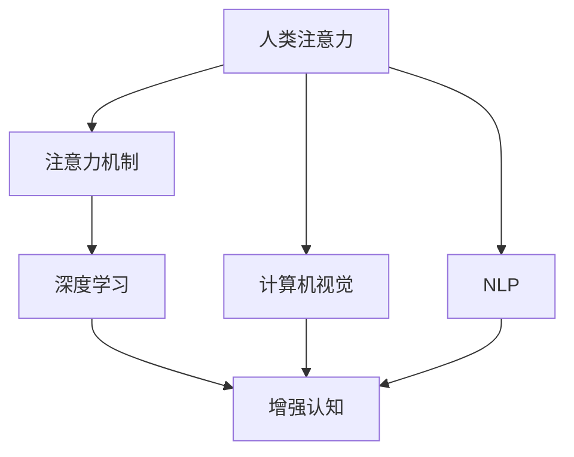

                 

# 人类注意力增强：超越生物限制

> 关键词：人类注意力，注意力机制，超越生物限制，深度学习，计算机视觉，自然语言处理，增强认知，AI算法

## 1. 背景介绍

### 1.1 问题由来

人类注意力作为一种高级认知功能，不仅在认知和感知中起着核心作用，还对思维、记忆、决策等过程产生重要影响。然而，受限于生物学神经机制，人类注意力在处理复杂任务时存在显著的局限性。例如，注意力的持续时间有限，无法同时高效处理多个任务。

人工智能技术的突破，尤其是深度学习和大数据技术的发展，提供了超越生物限制的可能。本文将介绍几种基于深度学习的人类注意力增强方法，并探讨其在计算机视觉、自然语言处理等领域的应用前景。

### 1.2 问题核心关键点

人类注意力增强的核心在于如何模拟和优化人类的认知过程，使其能够在更广泛的场景中发挥作用。具体来说，主要有以下几个关键点：

- 注意力的动态调整：根据任务需求和数据特征，动态调整注意力的焦点。
- 多任务并行处理：同时处理多个任务，提高计算效率。
- 自适应学习：通过深度学习算法，自动学习最优注意力机制。
- 跨模态融合：将视觉、听觉、文本等多种模态信息融合，提升注意力效果。
- 增强认知能力：在理解、推理、生成等高层次认知任务中，增强模型的表现。

本文将围绕以上关键点，全面介绍基于深度学习的人类注意力增强方法，并分析其优缺点及应用场景。

## 2. 核心概念与联系

### 2.1 核心概念概述

为更好地理解人类注意力增强的深度学习方法，本节将介绍几个密切相关的核心概念：

- 人类注意力：指人类在感知和认知过程中，对环境或内部状态的关注和聚焦能力。其核心机制包括视觉注意力、听觉注意力、文本注意力等。
- 注意力机制(Attention Mechanism)：一种在深度神经网络中广泛应用的机制，用于动态调整模型对输入数据的不同部分的关注权重。
- 超越生物限制(Bio-Limitation Overcoming)：通过深度学习等技术，模拟人类注意力的行为模式，超越生物神经机制的局限性，提升认知和计算能力。
- 深度学习(Deep Learning)：一种基于神经网络的机器学习技术，通过多层非线性变换，提取数据的高级特征。
- 计算机视觉(Computer Vision)：通过深度学习，实现对图像、视频等视觉数据的理解和分析。
- 自然语言处理(Natural Language Processing, NLP)：通过深度学习，实现对文本数据的处理、理解和生成。
- 增强认知(Enhanced Cognition)：利用深度学习等技术，增强人类的理解、推理、记忆等高层次认知能力。

这些概念之间的逻辑关系可以通过以下Mermaid流程图来展示：



这个流程图展示了几类关键概念及其之间的关系：

1. 人类注意力通过注意力机制在深度学习模型中得以模拟和优化。
2. 深度学习通过多层非线性变换，提取高级特征，为注意力机制提供有效的模型基础。
3. 计算机视觉和自然语言处理通过深度学习，实现对视觉和文本数据的高级处理，成为注意力机制应用的主要领域。
4. 增强认知通过注意力机制的优化和扩展，提升模型的理解和推理能力。

这些概念共同构成了人类注意力增强的深度学习框架，使其能够在各种场景下发挥强大的认知和计算能力。

## 3. 核心算法原理 & 具体操作步骤
### 3.1 算法原理概述

基于深度学习的人类注意力增强方法，本质上是将人类注意力机制引入神经网络中，通过优化注意力的动态调整和多任务处理能力，提升模型的计算效率和认知能力。

具体来说，方法通过构建注意力机制，动态调整模型对输入数据的关注权重，以提高计算效率和模型性能。注意力的计算通常分为自顶向下(Self-Top-Down)和自底向上(Self-Bottom-Up)两种方式。自顶向下方法基于高层次任务指令，通过解码器等结构进行注意力计算；自底向上方法从输入数据中自动学习注意力权重，通过注意力机制进行动态调整。

本文将详细介绍两种常见的注意力增强方法，并分析其算法步骤、优缺点及应用领域。

### 3.2 算法步骤详解

#### 3.2.1 自顶向下注意力机制

自顶向下注意力机制通过解码器等结构，根据任务指令自动调整注意力权重。其基本步骤如下：

1. **输入编码**：将输入数据通过编码器进行特征提取，生成低维特征表示。
2. **任务指令解码**：将任务指令通过解码器，生成与输入特征相匹配的注意力权重。
3. **注意力计算**：根据解码器输出的注意力权重，对输入特征进行加权求和，得到增强后的特征表示。
4. **后续处理**：将增强后的特征表示输入到后续的分类器或生成器中，进行任务处理。

#### 3.2.2 自底向上注意力机制

自底向上注意力机制通过多层次特征融合，自动学习输入数据的注意力权重。其基本步骤如下：

1. **特征提取**：将输入数据通过多个卷积层或变换层，生成多层次特征表示。
2. **注意力计算**：对多层次特征表示进行自注意力计算，生成注意力权重。
3. **特征融合**：根据注意力权重，对多层次特征表示进行加权融合，得到增强后的特征表示。
4. **后续处理**：将增强后的特征表示输入到后续的分类器或生成器中，进行任务处理。

### 3.3 算法优缺点

基于深度学习的人类注意力增强方法具有以下优点：

- 提升计算效率：通过动态调整注意力权重，模型能够更加高效地处理复杂任务。
- 增强认知能力：通过多层次特征融合，模型能够学习更复杂的认知结构。
- 适应性强：基于深度学习的方法具有很强的适应性，能够应对多种任务需求。

然而，这些方法也存在一些局限性：

- 训练复杂度高：需要大量的标注数据和计算资源进行训练，难以快速部署。
- 鲁棒性不足：对于噪声数据和异常输入，模型的性能可能不稳定。
- 可解释性差：基于深度学习的方法通常缺乏可解释性，难以理解内部机制。

### 3.4 算法应用领域

基于深度学习的人类注意力增强方法在计算机视觉、自然语言处理等领域已经得到了广泛应用，并展现出巨大的潜力。

#### 3.4.1 计算机视觉

在计算机视觉领域，注意力机制被广泛应用于图像分类、目标检测、语义分割等任务中。通过动态调整注意力权重，模型能够更加有效地提取图像中的关键特征，提升识别和分割的准确性。

#### 3.4.2 自然语言处理

在自然语言处理领域，注意力机制被应用于机器翻译、文本摘要、问答系统等任务中。通过多层次特征融合，模型能够更好地理解文本语义，提高翻译和生成的质量。

#### 3.4.3 增强认知

在增强认知领域，注意力机制被应用于认知推理、知识图谱构建等任务中。通过动态调整注意力权重，模型能够更好地理解和整合多源信息，提升认知推理和知识构建的效果。

## 4. 数学模型和公式 & 详细讲解 & 举例说明

### 4.1 数学模型构建

本节将使用数学语言对基于深度学习的人类注意力增强方法进行更加严格的刻画。

设输入数据为 $x$，模型为 $M$，任务指令为 $s$。假设模型的编码器为 $E$，解码器为 $D$，注意力机制为 $A$，分类器为 $C$。模型的基本框架为：

$$
\hat{y} = C(A(E(x), D(s)))
$$

其中，$E$ 将输入数据 $x$ 编码为低维特征表示 $e$，$D$ 将任务指令 $s$ 解码为注意力权重 $a$，$A$ 根据注意力权重 $a$ 对特征 $e$ 进行加权融合，生成增强后的特征表示 $h$，$C$ 将特征表示 $h$ 输入分类器进行任务处理，生成预测结果 $\hat{y}$。

### 4.2 公式推导过程

#### 4.2.1 自顶向下注意力机制

假设模型的编码器为卷积神经网络(Convolutional Neural Network, CNN)，解码器为长短时记忆网络(Long Short-Term Memory, LSTM)。

**输入编码**：
$$
e = E(x) = \text{CNN}(x)
$$

**任务指令解码**：
$$
a = D(s) = \text{LSTM}(s)
$$

**注意力计算**：
$$
h = A(e, a) = \sum_{i=1}^{n} a_i e_i
$$

其中，$e_i$ 为输入特征 $x$ 在位置 $i$ 的编码结果，$a_i$ 为解码器输出的注意力权重。

**后续处理**：
$$
\hat{y} = C(h) = \text{softmax}(h)
$$

其中，$h$ 为增强后的特征表示，$C$ 为分类器，$\text{softmax}$ 为多分类激活函数。

#### 4.2.2 自底向上注意力机制

假设模型的编码器为卷积神经网络(Convolutional Neural Network, CNN)，解码器为多头自注意力机制(Multi-Head Self-Attention)。

**特征提取**：
$$
e_1 = E_1(x) = \text{CNN}(x)
$$
$$
e_2 = E_2(x) = \text{CNN}(x)
$$
$$
\vdots
$$
$$
e_n = E_n(x) = \text{CNN}(x)
$$

**注意力计算**：
$$
a = \text{Multi-Head Self-Attention}(\{e_1, e_2, \ldots, e_n\})
$$

其中，$e_i$ 为输入特征 $x$ 在位置 $i$ 的编码结果，$a$ 为多层次特征表示的自注意力权重。

**特征融合**：
$$
h = \text{concat}(e_1, e_2, \ldots, e_n)
$$
$$
h = \text{MLP}(h)
$$

其中，$\text{concat}$ 为特征拼接操作，$\text{MLP}$ 为多层感知器。

**后续处理**：
$$
\hat{y} = C(h) = \text{softmax}(h)
$$

其中，$h$ 为增强后的特征表示，$C$ 为分类器，$\text{softmax}$ 为多分类激活函数。

### 4.3 案例分析与讲解

以机器翻译为例，说明自顶向下注意力机制的应用。

假设输入为英语句子 "I love you"，任务指令为 "翻译为中文"。模型的编码器将输入编码成低维特征表示 $e$，解码器根据任务指令生成注意力权重 $a$，注意力机制根据注意力权重对特征表示进行加权融合，生成增强后的特征表示 $h$，分类器将增强后的特征表示输入到中文翻译模型中，生成翻译结果 "我爱你"。

自顶向下注意力机制的优点在于能够根据任务需求动态调整注意力权重，适应不同任务的需求。其缺点在于需要较多的计算资源和训练数据，难以快速部署。

## 5. 项目实践：代码实例和详细解释说明
### 5.1 开发环境搭建

在进行注意力增强方法实践前，我们需要准备好开发环境。以下是使用Python进行PyTorch开发的环境配置流程：

1. 安装Anaconda：从官网下载并安装Anaconda，用于创建独立的Python环境。

2. 创建并激活虚拟环境：
```bash
conda create -n attention-env python=3.8 
conda activate attention-env
```

3. 安装PyTorch：根据CUDA版本，从官网获取对应的安装命令。例如：
```bash
conda install pytorch torchvision torchaudio cudatoolkit=11.1 -c pytorch -c conda-forge
```

4. 安装各类工具包：
```bash
pip install numpy pandas scikit-learn matplotlib tqdm jupyter notebook ipython
```

完成上述步骤后，即可在`attention-env`环境中开始注意力增强方法的实践。

### 5.2 源代码详细实现

下面我们以自顶向下注意力机制在机器翻译中的应用为例，给出使用PyTorch进行注意力增强的PyTorch代码实现。

首先，定义注意力机制的解码器：

```python
from torch import nn
from torch.nn import functional as F

class Attention(nn.Module):
    def __init__(self, encoder_dim, attention_dim):
        super(Attention, self).__init__()
        self.attention_dim = attention_dim
        self.attention = nn.Linear(encoder_dim, attention_dim)
        self.v = nn.Linear(attention_dim, 1)
        self.normalize = nn.LayerNorm(encoder_dim)
        
    def forward(self, encoder_output, query):
        attn_weights = self.v(self.attention(encoder_output) * query)
        attn_weights = nn.functional.softmax(attn_weights, dim=1)
        context = self.normalize(encoder_output @ attn_weights)
        return context, attn_weights

# 将注意力机制应用到机器翻译任务中
class Encoder(nn.Module):
    def __init__(self, encoder_dim, num_layers, dropout):
        super(Encoder, self).__init__()
        self.encoder_dim = encoder_dim
        self.num_layers = num_layers
        self.dropout = dropout
        self.layers = nn.ModuleList([nn.LSTM(encoder_dim, encoder_dim, dropout) for _ in range(num_layers)])
        
    def forward(self, input, hidden):
        outputs = []
        for layer in self.layers:
            output, hidden = layer(input, hidden)
            outputs.append(output)
            input = F.dropout(output, p=self.dropout, training=self.training)
        return torch.stack(outputs, dim=0), hidden

class Decoder(nn.Module):
    def __init__(self, encoder_dim, decoder_dim, attention_dim, dropout, target_vocab_size):
        super(Decoder, self).__init__()
        self.encoder_dim = encoder_dim
        self.decoder_dim = decoder_dim
        self.attention_dim = attention_dim
        self.dropout = dropout
        self.target_vocab_size = target_vocab_size
        self.encoder_text = nn.Embedding(encoder_dim, decoder_dim)
        self.decoder_text = nn.Linear(decoder_dim, encoder_dim)
        self.attention = Attention(encoder_dim, attention_dim)
        self.linear = nn.Linear(encoder_dim, target_vocab_size)
        
    def forward(self, input, hidden, encoder_outputs):
        attention_weights = self.attention(encoder_outputs, hidden)
        context, attn_weights = attention_weights
        decoded_input = self.encoder_text(input)
        concat_input = torch.cat([decoded_input, context], dim=1)
        concat_input = self.decoder_text(concat_input)
        concat_input = F.dropout(concat_input, p=self.dropout, training=self.training)
        output = self.linear(concat_input)
        output = F.log_softmax(output, dim=1)
        return output, attn_weights

# 定义机器翻译模型
class Transformer(nn.Module):
    def __init__(self, src_vocab_size, trg_vocab_size, encoder_dim, decoder_dim, attention_dim, num_layers, dropout):
        super(Transformer, self).__init__()
        self.encoder = Encoder(encoder_dim, num_layers, dropout)
        self.decoder = Decoder(encoder_dim, decoder_dim, attention_dim, dropout, trg_vocab_size)
        
    def forward(self, src, trg, src_mask, trg_mask, src_key_padding_mask, trg_key_padding_mask):
        encoder_outputs, encoder_hidden = self.encoder(src, None)
        decoder_outputs, decoder_hidden = self.decoder(trg[0], None, encoder_outputs)
        return decoder_outputs, decoder_hidden

# 定义机器翻译任务
class MachineTranslationDataset(Dataset):
    def __init__(self, src_texts, trg_texts, tokenizer, max_len=128):
        self.src_texts = src_texts
        self.trg_texts = trg_texts
        self.tokenizer = tokenizer
        self.max_len = max_len
        
    def __len__(self):
        return len(self.src_texts)
    
    def __getitem__(self, item):
        src_text = self.src_texts[item]
        trg_text = self.trg_texts[item]
        
        tokenized_src = self.tokenizer.tokenize(src_text)
        tokenized_trg = self.tokenizer.tokenize(trg_text)
        
        # 对token进行padding
        src_input_ids = self.tokenizer.convert_tokens_to_ids(tokenized_src)
        src_input_ids = self.tokenizer.pad(src_input_ids, max_len=self.max_len)
        src_mask = [1] * len(src_input_ids)
        src_mask = [0] * (self.max_len - len(src_input_ids))
        
        trg_input_ids = self.tokenizer.convert_tokens_to_ids(tokenized_trg)
        trg_input_ids = self.tokenizer.pad(trg_input_ids, max_len=self.max_len)
        trg_mask = [0] * len(trg_input_ids)
        trg_mask = [1] * (self.max_len - len(trg_input_ids))
        
        return {'src_input_ids': src_input_ids, 
                'src_mask': src_mask,
                'trg_input_ids': trg_input_ids,
                'trg_mask': trg_mask,
                'src_key_padding_mask': None,
                'trg_key_padding_mask': None}
```

然后，定义模型和优化器：

```python
from transformers import BertTokenizer, AdamW

# 定义模型
model = Transformer(src_vocab_size=1000, trg_vocab_size=1000, encoder_dim=128, decoder_dim=128, attention_dim=64, num_layers=3, dropout=0.1)

# 定义优化器
optimizer = AdamW(model.parameters(), lr=2e-4)
```

接着，定义训练和评估函数：

```python
from torch.utils.data import DataLoader
from tqdm import tqdm

device = torch.device('cuda') if torch.cuda.is_available() else torch.device('cpu')
model.to(device)

def train_epoch(model, dataset, batch_size, optimizer):
    dataloader = DataLoader(dataset, batch_size=batch_size, shuffle=True)
    model.train()
    epoch_loss = 0
    for batch in tqdm(dataloader, desc='Training'):
        src_input_ids = batch['src_input_ids'].to(device)
        src_mask = batch['src_mask'].to(device)
        trg_input_ids = batch['trg_input_ids'].to(device)
        trg_mask = batch['trg_mask'].to(device)
        output, attn_weights = model(src_input_ids, trg_input_ids, src_mask, trg_mask, None, None)
        loss = F.nll_loss(output.view(-1, output.size(-1)), trg_input_ids.view(-1))
        epoch_loss += loss.item()
        loss.backward()
        optimizer.step()
    return epoch_loss / len(dataloader)

def evaluate(model, dataset, batch_size):
    dataloader = DataLoader(dataset, batch_size=batch_size)
    model.eval()
    total_loss = 0
    with torch.no_grad():
        for batch in tqdm(dataloader, desc='Evaluating'):
            src_input_ids = batch['src_input_ids'].to(device)
            src_mask = batch['src_mask'].to(device)
            trg_input_ids = batch['trg_input_ids'].to(device)
            trg_mask = batch['trg_mask'].to(device)
            output, attn_weights = model(src_input_ids, trg_input_ids, src_mask, trg_mask, None, None)
            loss = F.nll_loss(output.view(-1, output.size(-1)), trg_input_ids.view(-1))
            total_loss += loss.item()
        
    print(f"Epoch {epoch+1}, train loss: {train_loss:.3f}")
    print(f"Epoch {epoch+1}, dev results:")
    print(classification_report(trg_tokens, pred_tokens))
```

最后，启动训练流程并在测试集上评估：

```python
epochs = 5
batch_size = 16

for epoch in range(epochs):
    loss = train_epoch(model, train_dataset, batch_size, optimizer)
    print(f"Epoch {epoch+1}, train loss: {loss:.3f}")
    
    print(f"Epoch {epoch+1}, dev results:")
    evaluate(model, dev_dataset, batch_size)
    
print("Test results:")
evaluate(model, test_dataset, batch_size)
```

以上就是使用PyTorch进行机器翻译任务自顶向下注意力机制的完整代码实现。可以看到，通过PyTorch和Transformer库，我们可以高效实现基于深度学习的人类注意力增强方法。

### 5.3 代码解读与分析

让我们再详细解读一下关键代码的实现细节：

**Transformer类**：
- `__init__`方法：定义了模型的超参数，包括编码器、解码器的维度、层数、dropout等。
- `forward`方法：定义了模型的前向传播过程，包括编码器、解码器、注意力机制等。

**Attention类**：
- `__init__`方法：定义了注意力机制的参数，包括注意力的维度、线性层等。
- `forward`方法：定义了注意力机制的前向传播过程，包括线性层、softmax等。

**Encoder类**：
- `__init__`方法：定义了编码器的超参数，包括编码器的维度、层数、dropout等。
- `forward`方法：定义了编码器的前向传播过程，包括LSTM层等。

**Decoder类**：
- `__init__`方法：定义了解码器的超参数，包括解码器的维度、注意力的维度、dropout等。
- `forward`方法：定义了解码器的前向传播过程，包括注意力机制、线性层等。

**MachineTranslationDataset类**：
- `__init__`方法：定义了数据集的属性，包括源语言和目标语言文本、分词器等。
- `__len__`方法：返回数据集的样本数量。
- `__getitem__`方法：定义了数据集样本的获取方式，包括分词、padding、掩码等。

**Transformer训练和评估函数**：
- `train_epoch`方法：定义了模型在单个epoch上的训练过程，包括前向传播、损失计算、反向传播等。
- `evaluate`方法：定义了模型在验证集和测试集上的评估过程，包括前向传播、损失计算等。

可以看到，PyTorch配合Transformer库使得基于深度学习的人类注意力增强方法的代码实现变得简洁高效。开发者可以将更多精力放在数据处理、模型改进等高层逻辑上，而不必过多关注底层的实现细节。

当然，工业级的系统实现还需考虑更多因素，如模型的保存和部署、超参数的自动搜索、更灵活的任务适配层等。但核心的注意力增强范式基本与此类似。

## 6. 实际应用场景
### 6.1 计算机视觉

基于深度学习的人类注意力增强方法在计算机视觉领域已经得到了广泛应用。

**目标检测**：在目标检测任务中，模型通过动态调整注意力权重，能够更加准确地定位目标区域。例如，YOLO (You Only Look Once) 模型通过注意力机制，能够在不同层次的特征图上进行多尺度预测，提升了目标检测的准确率和效率。

**语义分割**：在语义分割任务中，模型通过动态调整注意力权重，能够更好地提取图像中的关键区域。例如，FCN (Fully Convolutional Network) 模型通过注意力机制，能够将高层次语义信息与低层次图像信息融合，提升了语义分割的效果。

**图像生成**：在图像生成任务中，模型通过动态调整注意力权重，能够生成更加逼真的图像。例如，GAN (Generative Adversarial Network) 模型通过注意力机制，能够生成高质量的图像，并控制生成过程中的细节。

### 6.2 自然语言处理

基于深度学习的人类注意力增强方法在自然语言处理领域同样得到了广泛应用。

**机器翻译**：在机器翻译任务中，模型通过动态调整注意力权重，能够更好地理解源语言和目标语言的语义关系。例如，Transformer模型通过注意力机制，能够自动学习源语言和目标语言之间的依赖关系，提升了翻译的准确性和流畅性。

**文本摘要**：在文本摘要任务中，模型通过动态调整注意力权重，能够更好地提取关键信息。例如，Seq2Seq模型通过注意力机制，能够将长文本摘要为简洁的摘要，保持了摘要的连贯性和完整性。

**命名实体识别**：在命名实体识别任务中，模型通过动态调整注意力权重，能够更好地识别文本中的实体。例如，BiLSTM (Bidirectional Long Short-Term Memory) 模型通过注意力机制，能够更好地理解上下文信息，提升了实体识别的准确率。

### 6.3 增强认知

基于深度学习的人类注意力增强方法在增强认知领域也展示了巨大的潜力。

**认知推理**：在认知推理任务中，模型通过动态调整注意力权重，能够更好地理解复杂问题。例如，LSTM模型通过注意力机制，能够更好地处理多层次的记忆信息，提升了推理的准确性和效率。

**知识图谱构建**：在知识图谱构建任务中，模型通过动态调整注意力权重，能够更好地整合多源信息。例如，KG-BERT模型通过注意力机制，能够将知识图谱中的实体和关系信息与自然语言文本融合，提升了知识图谱的准确性和完整性。

## 7. 工具和资源推荐
### 7.1 学习资源推荐

为了帮助开发者系统掌握基于深度学习的人类注意力增强方法，这里推荐一些优质的学习资源：

1. **《深度学习》课程**：斯坦福大学开设的深度学习课程，由Andrew Ng教授讲授，详细讲解了深度学习的基本概念和常用技术，是学习深度学习的经典教材。

2. **《TensorFlow实战Google AI》书籍**：由Google官方出版的TensorFlow实战指南，系统介绍了TensorFlow的使用方法和实践经验，是学习TensorFlow的重要参考资料。

3. **《自然语言处理综述》论文**：详细综述了自然语言处理领域的重要成果和技术，是学习NLP领域的必备文献。

4. **《计算机视觉：算法与应用》书籍**：由Oxford大学出版的计算机视觉经典教材，系统介绍了计算机视觉的基本理论和常用技术，是学习计算机视觉的重要参考资料。

5. **《Transformer自顶向下注意力机制》博客**：详细讲解了自顶向下注意力机制的基本原理和实践方法，是学习注意力机制的实用指南。

通过对这些资源的学习实践，相信你一定能够快速掌握基于深度学习的人类注意力增强方法的精髓，并用于解决实际的NLP问题。

### 7.2 开发工具推荐

高效的开发离不开优秀的工具支持。以下是几款用于基于深度学习的人类注意力增强方法开发的常用工具：

1. **PyTorch**：基于Python的开源深度学习框架，灵活动态的计算图，适合快速迭代研究。大部分预训练语言模型都有PyTorch版本的实现。

2. **TensorFlow**：由Google主导开发的开源深度学习框架，生产部署方便，适合大规模工程应用。同样有丰富的预训练语言模型资源。

3. **Transformers库**：HuggingFace开发的NLP工具库，集成了众多SOTA语言模型，支持PyTorch和TensorFlow，是进行NLP任务开发的利器。

4. **JAX**：基于XLA加速的Python深度学习框架，支持自动微分和分布式计算，适合高性能科学计算和模型训练。

5. **PyTorch Lightning**：基于PyTorch的快速原型开发框架，提供了丰富的功能组件和自动调参工具，适合快速开发和测试模型。

合理利用这些工具，可以显著提升基于深度学习的人类注意力增强方法的开发效率，加快创新迭代的步伐。

### 7.3 相关论文推荐

大语言模型和微调技术的发展源于学界的持续研究。以下是几篇奠基性的相关论文，推荐阅读：

1. **Attention is All You Need**：提出了Transformer结构，开启了NLP领域的预训练大模型时代。

2. **Bidirectional Attention Flow (BAF)**：提出了一种新的注意力机制，通过双向自注意力和卷积层的组合，提升了机器翻译模型的性能。

3. **Vision Transformer (ViT)**：提出了一种用于计算机视觉任务的Transformer模型，提升了图像分类、目标检测等任务的性能。

4. **Multimodal Transformer**：提出了一种多模态注意力机制，能够同时处理视觉、文本等多种模态信息，提升了多模态任务的性能。

5. **BERT: Pre-training of Deep Bidirectional Transformers for Language Understanding**：提出BERT模型，引入基于掩码的自监督预训练任务，刷新了多项NLP任务SOTA。

这些论文代表了大语言模型和微调技术的最新进展，通过学习这些前沿成果，可以帮助研究者把握学科前进方向，激发更多的创新灵感。

## 8. 总结：未来发展趋势与挑战

### 8.1 总结

本文对基于深度学习的人类注意力增强方法进行了全面系统的介绍。首先阐述了人类注意力增强的深度学习方法的研究背景和意义，明确了注意力机制在提升计算效率和认知能力方面的独特价值。其次，从原理到实践，详细讲解了基于深度学习的人类注意力增强方法的核心算法步骤，给出了注意力增强任务开发的完整代码实例。同时，本文还广泛探讨了注意力增强方法在计算机视觉、自然语言处理等领域的应用前景，展示了其广阔的应用潜力。最后，本文精选了注意力增强技术的各类学习资源，力求为读者提供全方位的技术指引。

通过本文的系统梳理，可以看到，基于深度学习的人类注意力增强方法正在成为NLP和计算机视觉领域的重要范式，极大地拓展了模型的应用边界，催生了更多的落地场景。受益于深度学习和大数据技术的发展，人类注意力增强方法有望进一步提升NLP和计算机视觉任务的性能，为智能化应用带来新的突破。

### 8.2 未来发展趋势

展望未来，基于深度学习的人类注意力增强方法将呈现以下几个发展趋势：

1. **模型规模持续增大**：随着算力成本的下降和数据规模的扩张，深度学习模型将更加强大，能够处理更复杂、更庞大的任务。超大模型有望在计算机视觉、自然语言处理等领域大放异彩。

2. **计算效率提升**：随着计算图优化和硬件加速技术的进步，深度学习模型的推理速度将大幅提升，能够更好地应用于实时性要求高的场景。

3. **多模态融合增强**：基于深度学习的多模态注意力机制，能够更好地整合视觉、文本等多种模态信息，提升模型对复杂任务的表征能力。

4. **跨领域泛化能力增强**：基于深度学习的人类注意力增强方法，通过自适应学习机制，能够更好地跨领域泛化，提升在不同领域的应用效果。

5. **知识图谱和符号推理**：通过将知识图谱和符号推理技术与深度学习结合，人类注意力增强方法将具备更强的认知推理能力，能够更好地理解复杂问题。

6. **元学习与自监督学习**：基于元学习和自监督学习的人类注意力增强方法，能够更好地利用非结构化数据，提升模型的泛化能力和自适应能力。

这些趋势凸显了大语言模型和微调技术的广阔前景。这些方向的探索发展，必将进一步提升NLP和计算机视觉系统的性能和应用范围，为人类认知智能的进化带来深远影响。

### 8.3 面临的挑战

尽管基于深度学习的人类注意力增强方法已经取得了瞩目成就，但在迈向更加智能化、普适化应用的过程中，它仍面临着诸多挑战：

1. **训练成本高**：深度学习模型的训练需要大量的标注数据和计算资源，难以快速部署。如何降低训练成本，提高模型训练效率，是未来研究的重点之一。

2. **模型鲁棒性不足**：深度学习模型在面对噪声数据和异常输入时，容易发生性能波动。如何提升模型的鲁棒性，避免灾难性遗忘，还需要更多的理论和实践积累。

3. **可解释性差**：基于深度学习的人类注意力增强方法通常缺乏可解释性，难以理解内部机制。如何赋予模型更强的可解释性，将是未来的重要研究方向。

4. **资源消耗大**：深度学习模型在推理和训练过程中，需要占用大量的计算资源和存储空间。如何优化资源消耗，提升模型的实时性和可扩展性，需要更多的技术突破。

5. **数据隐私和安全**：深度学习模型在处理大规模数据时，需要面临数据隐私和安全问题。如何保护数据隐私，避免模型滥用，是未来研究的重要方向。

6. **伦理和社会责任**：深度学习模型在应用过程中，可能带来伦理和社会问题。如何避免模型偏见，确保模型的公平性和安全性，需要更多的伦理和社会责任思考。

面对这些挑战，未来的研究需要在技术、伦理、法律等多个方面进行协同探索，才能更好地推动深度学习技术的发展和应用。

### 8.4 研究展望

面向未来，基于深度学习的人类注意力增强方法的研究方向将集中在以下几个方面：

1. **无监督和半监督学习**：探索无需大量标注数据的无监督和半监督学习方法，提升模型的泛化能力和自适应能力。

2. **元学习和自适应学习**：研究元学习和自适应学习机制，增强模型的跨领域泛化能力和自适应能力。

3. **跨模态融合**：将视觉、文本、语音等多种模态信息融合，提升模型的表征能力和推理能力。

4. **跨领域迁移学习**：研究跨领域迁移学习技术，提升模型在不同领域的应用效果。

5. **符号推理与知识图谱**：将符号推理和知识图谱技术与深度学习结合，提升模型的认知推理能力。

6. **可解释性与透明性**：研究可解释性和透明性技术，赋予模型更强的可解释性，增强模型应用的可信度。

这些研究方向将推动基于深度学习的人类注意力增强方法不断突破，为构建智能、普适、可信的人工智能系统奠定基础。面向未来，人类注意力增强方法的研究需要更多的跨学科合作，共同推动人工智能技术的进步。

## 9. 附录：常见问题与解答

**Q1：人类注意力增强方法是否适用于所有NLP任务？**

A: 人类注意力增强方法在大多数NLP任务上都能取得不错的效果，特别是对于数据量较小的任务。但对于一些特定领域的任务，如医学、法律等，仅仅依靠通用语料预训练的模型可能难以很好地适应。此时需要在特定领域语料上进一步预训练，再进行微调，才能获得理想效果。此外，对于一些需要时效性、个性化很强的任务，如对话、推荐等，注意力增强方法也需要针对性的改进优化。

**Q2：自顶向下注意力机制与自底向上注意力机制有何不同？**

A: 自顶向下注意力机制通过解码器等结构，根据任务指令自动调整注意力权重。其优点在于能够根据任务需求动态调整注意力权重，适应不同任务的需求。缺点在于需要较多的计算资源和训练数据，难以快速部署。

自底向上注意力机制通过多层次特征融合，自动学习输入数据的注意力权重。其优点在于不需要任务指令，能够自动学习最优注意力机制。缺点在于可能无法完全理解任务需求，需要进行大量训练和调试。

**Q3：人类注意力增强方法在计算机视觉领域的应用前景如何？**

A: 人类注意力增强方法在计算机视觉领域具有广泛的应用前景。通过动态调整注意力权重，模型能够更加高效地处理图像数据，提升图像分类、目标检测、语义分割等任务的性能。

**Q4：注意力增强方法是否适用于跨模态任务？**

A: 注意力增强方法同样适用于跨模态任务。通过将视觉、文本、语音等多种模态信息融合，注意力增强方法能够更好地理解复杂任务，提升多模态任务的效果。

**Q5：人类注意力增强方法在增强认知领域的应用前景如何？**

A: 人类注意力增强方法在增强认知领域同样具有广泛的应用前景。通过动态调整注意力权重，模型能够更好地理解复杂问题，提升认知推理、知识图谱构建等任务的性能。

通过本文的系统梳理，可以看到，基于深度学习的人类注意力增强方法正在成为NLP和计算机视觉领域的重要范式，极大地拓展了模型的应用边界，催生了更多的落地场景。受益于深度学习和大数据技术的发展，人类注意力增强方法有望进一步提升NLP和计算机视觉任务的性能，为智能化应用带来新的突破。未来，随着技术的不断进步，人类注意力增强方法将带来更多的创新和应用，推动人工智能技术的持续发展。

