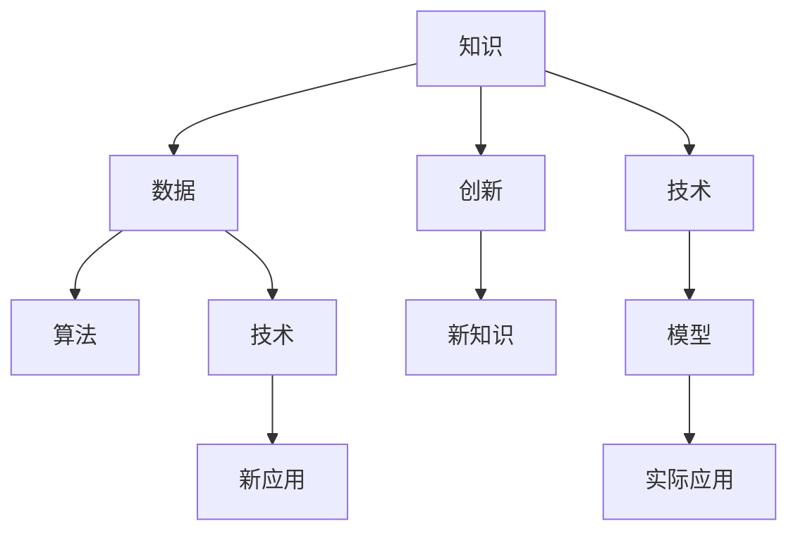

                 

# 人类的知识与创新：突破思维的疆界

在科技迅猛发展的今天，人类的知识体系和创新能力正以指数级的方式增长。技术的突破不断刷新着我们对世界的认知，也极大地推动了社会进步和经济发展。本文旨在探讨这一变革的核心要素——人类的知识与创新，及其如何推动科技发展的过程。我们将从背景介绍、核心概念与联系、算法原理、项目实践、应用场景等多个角度深入分析，为读者呈现一个全面而深刻的视角。

## 1. 背景介绍

### 1.1 问题由来
现代社会的快速发展离不开科技进步的支撑，而这背后，知识的积累与创新起到了至关重要的作用。从农业革命到工业革命，再到信息时代，人类社会经历了多次重大的技术飞跃。每一次技术的突破，都在不同程度上推动了社会结构的变革，极大地提升了人类的生活品质。

### 1.2 问题核心关键点
面对海量且不断更新的知识体系，如何高效获取、应用并创新，成为了当前亟需解决的重大课题。知识的积累与创新不仅需要庞大的数据支持，更需依赖高效的算法和模型。而技术的不断演进，又进一步推动了知识的边界不断扩展，形成了螺旋上升的发展模式。

### 1.3 问题研究意义
深入理解人类的知识与创新，不仅有助于我们更好地把握科技进步的脉络，还能为未来的技术研发提供更有力的支撑。通过探究知识与创新的内在联系，我们能更好地预测技术发展趋势，寻找创新的突破口，推动社会向更加智能化、高效化的方向发展。

## 2. 核心概念与联系

### 2.1 核心概念概述

为了更好地理解人类知识与创新的本质，本节将介绍几个关键概念：

- **知识(Knowledge)**：人类通过实践、研究等方式获得的系统化信息。知识的形式多种多样，包括数据、理论、方法等。
- **数据(Data)**：用于描述现象或事物的具体数值、事实或观测结果。数据是知识的基础，也是技术创新的重要原料。
- **技术(Technology)**：应用知识解决实际问题的手段和方法。技术通常涉及具体的算法、工具和系统架构。
- **算法(Algorithm)**：定义问题求解步骤的数学模型，是实现技术创新的关键。
- **模型(Model)**：反映现实世界的数学或计算模型，用于指导技术实施。
- **创新(Innovation)**：突破现有知识体系，创造新知识的创造过程。创新可以是技术上的突破，也可以是思想上的革新。

这些概念共同构成了人类知识与创新的基础框架，推动着社会的进步和科技的不断发展。

### 2.2 核心概念原理和架构的 Mermaid 流程图



这个流程图展示了知识与创新在技术研发中的作用与联系：

1. 知识通过数据采集、标注等形式转化为数据。
2. 数据经过算法模型处理，形成技术解决方案。
3. 技术解决方案进一步发展为实际应用系统。
4. 创新过程不仅包括技术突破，还包括新的知识体系的形成。
5. 新知识和新应用进一步丰富了知识的范畴，推动知识体系的不断扩展。

## 3. 核心算法原理 & 具体操作步骤

### 3.1 算法原理概述

人类的知识与创新过程，本质上是一个数据驱动的算法优化和模型构建过程。通过对海量数据进行深入分析，发现其中的规律和模式，从而设计出有效的算法模型，最终实现技术的突破。

这一过程主要包括以下几个步骤：

1. **数据收集与预处理**：收集和整理与问题相关的数据，进行清洗、去噪等预处理工作，为后续的算法设计奠定基础。
2. **算法设计**：设计适合的算法模型，包括特征选择、模型训练、调参等，构建能够有效解决实际问题的技术框架。
3. **模型评估与优化**：通过实验和验证，评估算法模型的效果，不断优化算法性能，确保模型在实际应用中的可靠性。
4. **创新与应用**：将优化后的模型应用于实际场景，实现技术的商业化落地，推动社会的进步。

### 3.2 算法步骤详解

#### 3.2.1 数据收集与预处理

在数据收集与预处理阶段，首先需要确定所需数据的具体来源和类型。例如，在自然语言处理领域，数据可以来源于大规模的文本语料库、对话记录、网页内容等。数据收集完成后，需要进行预处理，包括数据清洗、去重、标准化等操作，以确保数据的准确性和一致性。

#### 3.2.2 算法设计

算法设计是知识与创新过程中最为关键的一环。常见的算法设计方法包括：

- **监督学习**：通过标注数据集进行模型训练，预测新数据的标签。监督学习适用于分类、回归等任务。
- **无监督学习**：不依赖标注数据，通过数据本身的特征进行模型训练。无监督学习适用于聚类、降维等任务。
- **强化学习**：通过奖励机制指导模型在特定环境中的决策行为。强化学习适用于控制策略、游戏等问题。
- **半监督学习**：结合少量标注数据和大量无标注数据进行模型训练。半监督学习适用于数据稀缺但噪声较少的场景。

#### 3.2.3 模型评估与优化

模型评估与优化阶段，需要设计合适的评估指标，如准确率、召回率、F1分数等，对模型性能进行评估。常用的评估方法包括交叉验证、混淆矩阵、ROC曲线等。根据评估结果，进一步优化算法模型，如调整超参数、改变特征选择等，以提高模型性能。

#### 3.2.4 创新与应用

创新与应用阶段，是将优化后的模型应用于实际场景的过程。在这一阶段，需要考虑模型的部署、集成、性能优化等具体问题。通过不断的迭代和优化，确保模型在实际应用中的稳定性和高效性。

### 3.3 算法优缺点

人类的知识与创新过程中，算法设计有着不可忽视的优缺点：

#### 优点

1. **高效性**：算法能够通过数据驱动的方式，快速识别出问题的关键特征，设计出高效的解决方案。
2. **可扩展性**：算法的优化和改进可以在不同的应用场景中重复使用，提升技术的应用价值。
3. **客观性**：算法设计过程基于数据和数学模型，能够避免人为的主观偏见。

#### 缺点

1. **数据依赖**：算法的性能很大程度上依赖于数据的准确性和完整性，数据偏差可能导致模型失效。
2. **模型复杂度**：复杂的算法模型可能难以解释和维护，需要大量的专业知识。
3. **时间成本**：算法设计和优化的过程需要大量时间和计算资源，对于大规模问题，这一成本可能较高。

### 3.4 算法应用领域

算法设计在多个领域中得到了广泛应用，涵盖从科学研究到工业生产，再到日常生活的各个方面。

- **科学研究**：在自然科学领域，算法被用于数据分析、模型预测等。如深度学习算法在生物学、天文学中的应用，推动了相关领域的突破。
- **工业生产**：在制造业、物流等领域，算法用于优化生产流程、提升生产效率。如优化算法在供应链管理中的应用，使得企业资源配置更加合理。
- **日常生活**：在智能家居、移动应用等领域，算法被用于提升用户体验、个性化推荐等。如推荐算法在电商、社交平台中的应用，为用户带来了便捷的购物和社交体验。

## 4. 数学模型和公式 & 详细讲解 & 举例说明

### 4.1 数学模型构建

在知识与创新过程中，数学模型构建是一个重要的环节。数学模型用于描述现实世界的问题，并为算法设计提供理论基础。常见的数学模型包括：

- **线性回归模型**：用于描述变量之间的线性关系，适用于预测、分类等任务。
- **决策树模型**：通过树形结构描述特征与结果之间的关系，适用于分类、回归、特征选择等任务。
- **神经网络模型**：模拟人脑神经元之间的连接关系，用于复杂模式识别和分类。
- **贝叶斯网络模型**：基于概率模型，用于描述变量之间的依赖关系，适用于推理、预测等任务。

### 4.2 公式推导过程

以线性回归模型为例，其基本公式为：

$$
y = \beta_0 + \beta_1 x_1 + \beta_2 x_2 + \cdots + \beta_n x_n + \epsilon
$$

其中，$y$ 为因变量，$x_i$ 为自变量，$\beta_i$ 为回归系数，$\epsilon$ 为误差项。通过最小二乘法，可以得到回归系数的最优解：

$$
\hat{\beta} = (X^T X)^{-1} X^T y
$$

其中，$X$ 为自变量矩阵，$y$ 为因变量向量。

### 4.3 案例分析与讲解

假设我们有一个房屋销售价格预测的问题，已知房屋的面积、地理位置、装修情况等特征，需要预测其售价。根据线性回归模型，我们可以构建如下模型：

$$
\hat{y} = \beta_0 + \beta_1 \text{area} + \beta_2 \text{location} + \beta_3 \text{decor} + \epsilon
$$

其中，$\text{area}$、$\text{location}$、$\text{decor}$ 分别表示房屋的面积、地理位置、装修情况，$\epsilon$ 为误差项。通过收集历史销售数据，并进行数据预处理和模型训练，我们可以得到各个特征的回归系数 $\hat{\beta}$。最终，通过代入新数据，可以得到房屋的预测售价。

## 5. 项目实践：代码实例和详细解释说明

### 5.1 开发环境搭建

在进行知识与创新项目实践时，首先需要搭建开发环境。以下是使用Python进行Scikit-learn开发的简单流程：

1. 安装Anaconda：从官网下载并安装Anaconda，用于创建独立的Python环境。
2. 创建并激活虚拟环境：
```bash
conda create -n sklearn-env python=3.8 
conda activate sklearn-env
```

3. 安装Scikit-learn：
```bash
pip install scikit-learn
```

4. 安装其他相关工具包：
```bash
pip install numpy pandas matplotlib jupyter notebook
```

完成上述步骤后，即可在`sklearn-env`环境中开始项目实践。

### 5.2 源代码详细实现

以下是一个使用Scikit-learn进行线性回归预测的Python代码实现：

```python
from sklearn.linear_model import LinearRegression
from sklearn.model_selection import train_test_split
import pandas as pd
import numpy as np
import matplotlib.pyplot as plt

# 加载数据
data = pd.read_csv('house_price.csv')

# 数据预处理
X = data[['area', 'location', 'decor']]
y = data['price']
X_train, X_test, y_train, y_test = train_test_split(X, y, test_size=0.2, random_state=42)

# 构建模型
model = LinearRegression()

# 训练模型
model.fit(X_train, y_train)

# 预测结果
y_pred = model.predict(X_test)

# 评估模型
print('R^2:', model.score(X_test, y_test))
plt.scatter(y_test, y_pred)
plt.xlabel('Actual Price')
plt.ylabel('Predicted Price')
plt.title('House Price Prediction')
plt.show()
```

### 5.3 代码解读与分析

让我们再详细解读一下关键代码的实现细节：

**线性回归模型构建**：
- 首先，使用Scikit-learn中的`LinearRegression`类构建线性回归模型。
- 然后，使用`train_test_split`函数将数据集划分为训练集和测试集，设置80%的训练数据和20%的测试数据。
- 在训练模型之前，先对数据进行预处理，将数据转换为Scikit-learn所需的格式。
- 最后，使用训练集数据对模型进行训练，并通过测试集数据进行模型评估。

**模型评估与优化**：
- 模型评估部分，通过计算R^2系数（决定系数）来评估模型的拟合效果。R^2系数越接近1，表示模型的拟合效果越好。
- 可视化部分，通过绘制散点图来展示模型预测结果和真实值的对比情况。

**代码优化**：
- 在实际应用中，为了提升模型性能，还可以进行特征选择、正则化等操作。例如，可以使用`SelectKBest`函数对特征进行筛选，使用`Lasso`或`Ridge`等正则化方法进行模型优化。
- 同时，还需要考虑数据的质量问题，如数据清洗、去重、标准化等操作。

## 6. 实际应用场景

### 6.1 智能家居系统

智能家居系统通过算法设计和知识整合，可以实现家庭环境的智能化管理。例如，智能音箱可以通过语音识别算法理解用户指令，智能灯光系统可以根据时间、天气等条件自动调整照明方案。

在技术实现上，可以收集用户的行为数据、环境数据等，构建用户画像和环境特征数据库，利用机器学习算法进行模式识别和预测，实现家居设备的自动化控制。通过持续学习和用户反馈，智能家居系统能够不断优化，提升用户体验。

### 6.2 医疗影像诊断

医疗影像诊断是人工智能在医疗领域的重要应用之一。通过算法设计和模型训练，可以对医学影像进行自动分析和诊断，提高诊断效率和准确性。

在实践过程中，需要收集大量的医学影像数据，并进行标注和预处理。然后，利用卷积神经网络（CNN）等算法进行模型训练，构建能够自动识别病变区域的影像分析系统。通过不断的模型优化和临床验证，系统能够逐步取代部分人工操作，提升医疗服务的智能化水平。

### 6.3 金融风险评估

金融风险评估是金融科技的重要应用方向。通过算法设计和知识整合，可以实现对企业财务状况、市场趋势等的预测和评估，降低金融风险。

在实践中，可以收集企业的财务报表、市场数据等，构建多维度的风险评估模型。通过利用随机森林、梯度提升机等算法，对企业的财务健康状况和市场表现进行综合评估，生成风险预警报告。通过持续监控和模型更新，金融风险评估系统能够及时发现风险隐患，帮助金融机构规避损失。

### 6.4 未来应用展望

随着知识与创新技术的不断进步，未来的应用场景将更加广泛和深入。例如，无人驾驶、自动驾驶等技术将深刻改变交通出行方式；智慧城市建设将提升城市管理的智能化水平；智能制造、工业4.0等技术将推动工业生产向智能化、高效化方向发展。

未来，知识与创新技术将更加注重跨学科融合和协同创新，推动社会向更加智能化、高效化的方向发展。例如，将人工智能与物联网、区块链等技术结合，构建全场景智能解决方案，实现对复杂系统的高效管理和控制。

## 7. 工具和资源推荐

### 7.1 学习资源推荐

为了帮助开发者系统掌握知识与创新技术的理论基础和实践技巧，这里推荐一些优质的学习资源：

1. 《机器学习》系列书籍：由机器学习领域权威人士撰写，系统介绍了机器学习的基本概念和算法设计。
2. 《深度学习》课程：由斯坦福大学和Coursera合作推出的深度学习课程，覆盖了深度学习的基本理论和实践技巧。
3. Kaggle平台：提供大量的机器学习竞赛和数据集，助力开发者在实战中提升技能。
4. GitHub：汇集了大量开源项目和代码示例，提供了丰富的学习和实践资源。

通过对这些资源的学习实践，相信你一定能够系统掌握知识与创新技术的精髓，并用于解决实际的业务问题。

### 7.2 开发工具推荐

高效的开发离不开优秀的工具支持。以下是几款用于知识与创新技术开发的常用工具：

1. Python：通用性强的编程语言，拥有丰富的第三方库和框架，适合数据处理和算法开发。
2. Scikit-learn：基于Python的机器学习库，提供了大量的经典算法和模型。
3. TensorFlow：由Google主导开发的深度学习框架，支持分布式训练和模型部署。
4. PyTorch：由Facebook开发的深度学习框架，提供了动态计算图和丰富的模型库。
5. Jupyter Notebook：交互式编程环境，适合快速原型设计和实验验证。

合理利用这些工具，可以显著提升知识与创新技术的开发效率，加速创新的迭代过程。

### 7.3 相关论文推荐

知识与创新技术的发展源于学界的持续研究。以下是几篇奠基性的相关论文，推荐阅读：

1. Andrew Ng《机器学习》：介绍了机器学习的基本概念和算法，是入门必读。
2. Ian Goodfellow《深度学习》：系统介绍了深度学习的基本原理和应用。
3. Yann LeCun《深度学习》：总结了深度学习的发展历程和最新进展。
4. Bengio、Courville、Pascanu《深度学习》：涵盖了深度学习的数学基础和算法设计。

这些论文代表了大数据和人工智能领域的研究进展，为未来的技术发展提供了重要的理论支撑。

## 8. 总结：未来发展趋势与挑战

### 8.1 研究成果总结

知识与创新技术在过去的几十年里取得了巨大的突破，推动了社会的进步和发展。从计算机视觉到自然语言处理，从机器学习到深度学习，每一步进展都在不断拓展人类认知的边界。

### 8.2 未来发展趋势

展望未来，知识与创新技术将呈现以下几个发展趋势：

1. **多模态融合**：未来的技术将更加注重多模态数据的融合，实现视觉、听觉、触觉等多种感官信息的协同处理。例如，结合视频、音频等多模态数据进行智能监控和交互。
2. **边缘计算**：未来的技术将更加注重边缘计算和分布式计算，提升数据处理的效率和实时性。例如，在智能家居系统中，将数据处理和分析任务分布在多个设备上，实现本地化计算。
3. **自动化优化**：未来的技术将更加注重自动化优化，提升算法模型的性能和稳定性。例如，利用强化学习算法进行模型优化，自动调整超参数和模型结构。
4. **跨学科融合**：未来的技术将更加注重跨学科融合，推动技术在不同领域的应用。例如，将知识图谱与自然语言处理结合，构建知识驱动的智能问答系统。
5. **伦理和可解释性**：未来的技术将更加注重伦理和可解释性，提升技术的可信度和透明性。例如，引入伦理导向的评估指标，构建可解释的模型体系。

### 8.3 面临的挑战

尽管知识与创新技术在不断发展，但也面临着诸多挑战：

1. **数据隐私和安全**：随着技术应用场景的扩展，数据的隐私和安全问题日益突出。如何保护用户隐私，避免数据泄露，是未来的一大难题。
2. **算法偏见和公平性**：算法设计过程中，可能存在种族、性别、年龄等偏见。如何消除偏见，确保算法的公平性，是未来必须解决的挑战。
3. **模型复杂度**：大模型往往具有复杂的结构，难以解释和维护。如何提升模型的可解释性和可维护性，是未来需要关注的重点。
4. **计算资源消耗**：大模型的训练和推理需要大量的计算资源，如何提高计算效率，降低资源消耗，是未来的一大挑战。
5. **跨领域应用**：技术在不同领域的应用过程中，需要考虑行业特定的需求和约束。如何设计具有普适性的技术方案，满足多样化的应用需求，是未来必须解决的问题。

### 8.4 研究展望

面对未来知识与创新技术的发展，我们需要积极应对并寻求新的突破：

1. **提升模型可解释性**：开发更加可解释的算法模型，提升技术应用的透明度和可信度。例如，利用可视化技术展示模型的决策过程，构建可解释的模型体系。
2. **优化计算资源利用**：开发更加高效的计算模型和算法，提升数据处理和计算的效率。例如，利用分布式计算和边缘计算，提升模型的实时性和可靠性。
3. **推动跨学科融合**：加强不同学科之间的合作和交流，推动技术在各个领域的应用。例如，结合计算机科学和医学知识，开发智能诊断系统。
4. **注重伦理和公平性**：引入伦理导向的评估指标，确保技术应用的公正性和公平性。例如，在设计算法时，引入公平性评估指标，消除偏见。
5. **促进知识共享和协作**：构建开放的知识共享平台，促进技术创新的协作和扩散。例如，利用知识图谱和数据库，构建知识驱动的创新平台。

总之，未来的知识与创新技术还需要我们在多个层面进行全面优化和创新，以应对不断变化的技术需求和应用场景，推动社会的持续进步和发展。

## 9. 附录：常见问题与解答

**Q1：知识与创新技术能否应用于所有领域？**

A: 知识与创新技术在各个领域都有着广泛的应用潜力。但是，不同领域的技术需求和应用场景各有不同，需要针对性地设计和优化技术方案。例如，在医疗领域，需要考虑到伦理和隐私问题；在金融领域，需要关注模型公平性和安全性。

**Q2：如何进行算法模型的优化？**

A: 算法模型的优化可以从以下几个方面入手：

1. **特征选择**：通过特征选择算法（如Lasso、Ridge）筛选出对模型预测效果影响较大的特征，提升模型的简洁性和泛化能力。
2. **模型集成**：利用集成学习算法（如随机森林、AdaBoost）构建多模型融合系统，提升模型的稳定性和预测能力。
3. **正则化**：通过L2正则、Dropout等方法防止过拟合，提升模型的泛化性能。
4. **超参数调优**：通过网格搜索、贝叶斯优化等方法寻找最优的超参数组合，提升模型的性能。

**Q3：如何在实际应用中避免模型过拟合？**

A: 避免模型过拟合可以采用以下策略：

1. **数据增强**：通过数据增强方法（如回译、近义替换）扩充训练集，提升模型的泛化能力。
2. **正则化**：通过L2正则、Dropout等方法防止过拟合。
3. **早停策略**：在训练过程中，当验证集上的性能不再提升时，停止训练，避免模型过拟合。
4. **模型集成**：利用集成学习算法构建多模型融合系统，提升模型的稳定性和泛化能力。

**Q4：如何衡量模型的公平性？**

A: 衡量模型的公平性可以从以下几个方面入手：

1. **分类误差**：计算不同群体之间的分类误差，确保模型对不同群体的预测效果相同。
2. **ROC曲线**：绘制不同群体之间的ROC曲线，评估模型在不同群体上的表现。
3. **偏差度量**：利用偏差度量指标（如Deviance）评估模型在不同群体上的公平性。
4. **解释性分析**：利用模型解释性分析（如LIME、SHAP）理解模型决策过程，发现模型中的偏差和错误。

**Q5：如何构建可解释的模型体系？**

A: 构建可解释的模型体系可以从以下几个方面入手：

1. **模型可视化**：利用可视化技术（如t-SNE、PCA）展示模型的决策过程，理解模型的内在机制。
2. **特征重要性分析**：通过特征重要性分析（如SHAP、LIME）理解模型中各特征的影响，提高模型的可解释性。
3. **模型解释框架**：利用模型解释框架（如LIME、SHAP）构建可解释的模型体系，提升技术的透明度和可信度。

---

作者：禅与计算机程序设计艺术 / Zen and the Art of Computer Programming

