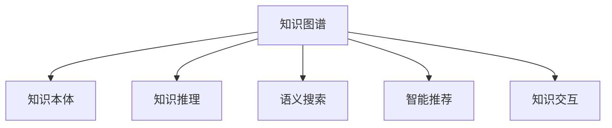

                 

# 人类知识的共享时代：知识的力量

> 关键词：知识图谱, 知识共享, 数据可视化, 自然语言处理, 机器学习, 深度学习, 信息检索

## 1. 背景介绍

### 1.1 问题由来
随着信息时代的到来，人类社会产生了前所未有的知识爆炸现象。学术文章、专利文献、电子书籍等各类信息源，每天都在以几何级数增长。面对海量知识的碎片化、异构化和碎片化问题，如何有效整合、利用这些知识，成为迫切需要解决的问题。传统的数据库、搜索引擎等技术手段，已经难以适应这种大规模、异构化数据的存储和检索需求。

在这一背景下，知识图谱(Knowledge Graph)应运而生。知识图谱是一种结构化的知识表示方式，它将不同类型的知识（如实体、关系、属性等）以图形化的方式组织起来，提供了一种直观、全面的知识表达和检索手段。通过知识图谱技术，可以高效地将各类异构、碎片化的知识整合为一个统一的知识库，从而实现知识的共享、复用和创新。

### 1.2 问题核心关键点
知识图谱技术的核心在于其对知识的高效组织和检索能力。其主要关注点包括：

- **知识表示**：如何将不同类型的数据（如文本、图像、视频等）转换为结构化的知识，并形成统一的知识表示。
- **知识融合**：如何将来自不同来源的知识进行有效融合，消除冗余和矛盾，形成完整的知识图谱。
- **知识查询**：如何设计高效的查询语言和算法，实现对知识图谱的快速检索和推理。
- **知识应用**：如何将知识图谱应用于具体的应用场景中，实现知识的自动化应用和决策支持。

本文将围绕知识图谱的核心问题，深入探讨其原理和应用实践，并介绍一些前沿的技术进展。

## 2. 核心概念与联系

### 2.1 核心概念概述

为更好地理解知识图谱技术，本节将介绍几个密切相关的核心概念：

- **知识图谱(Knowledge Graph)**：以结构化方式描述实体、关系和属性的知识表示方法。通常以图形化的方式呈现，便于直观理解。
- **知识本体(Ontology)**：定义知识图谱中的类、属性和方法的标准化描述框架。如OWL、RDF等。
- **知识推理(Reasoning)**：通过分析知识图谱中的关系和属性，进行逻辑推理和推断，获取新知识。
- **语义搜索(Semantic Search)**：结合自然语言处理和知识图谱，实现基于语义的精准搜索。
- **智能推荐(Intelligent Recommendation)**：基于知识图谱构建推荐模型，实现个性化的知识推荐。
- **知识交互(Knowledge Interaction)**：通过智能问答、交互式界面等形式，实现人与知识的自然交互。

这些核心概念之间的逻辑关系可以通过以下Mermaid流程图来展示：



这个流程图展示了知识图谱的核心组件及其相互关系：

1. 知识图谱是整个系统的核心，以图形化的方式组织各类知识。
2. 知识本体是知识图谱的结构化描述框架，定义了各类知识之间的关系。
3. 知识推理通过逻辑推理和推断，在知识图谱中获取新知识。
4. 语义搜索结合自然语言处理技术，实现基于语义的精准搜索。
5. 智能推荐基于知识图谱构建推荐模型，实现个性化的知识推荐。
6. 知识交互通过智能问答、交互式界面等形式，实现人与知识的自然交互。

这些核心概念共同构成了知识图谱技术的基本框架，使其能够在知识管理和应用中发挥重要作用。

## 3. 核心算法原理 & 具体操作步骤
### 3.1 算法原理概述

知识图谱的构建和应用涉及多个核心算法，包括知识抽取、知识融合、知识推理和语义搜索等。

### 3.2 算法步骤详解

#### 3.2.1 知识抽取

知识抽取是从大量非结构化数据中，自动提取出实体、关系和属性，并将它们转换为结构化的知识表示。知识抽取方法主要分为以下几种：

1. **基于规则的方法**：通过手动定义提取规则，自动从文本中提取出实体和关系。
2. **基于统计的方法**：利用机器学习模型（如CRF、LSTM等），自动学习实体和关系之间的对应关系。
3. **基于深度学习的方法**：通过端到端的神经网络模型（如BERT、GPT等），实现实体和关系的自动抽取。

其中，基于深度学习的方法近年来取得了显著进展，已经成为知识抽取的主流方法。

#### 3.2.2 知识融合

知识融合是指将来自不同来源的知识进行有效融合，消除冗余和矛盾，形成完整的知识图谱。知识融合方法主要分为以下几种：

1. **基于规则的方法**：通过定义融合规则，自动将不同来源的知识进行融合。
2. **基于统计的方法**：利用机器学习模型，自动学习不同知识之间的相似度和融合方式。
3. **基于深度学习的方法**：通过端到端的神经网络模型，实现知识的自动融合和更新。

基于深度学习的方法近年来也得到了广泛应用，如TransE、FactSharing等模型，通过学习知识图谱中的关系和属性，自动进行知识的融合和更新。

#### 3.2.3 知识推理

知识推理是指通过分析知识图谱中的关系和属性，进行逻辑推理和推断，获取新知识。知识推理方法主要分为以下几种：

1. **基于规则的方法**：通过定义推理规则，自动进行知识的推理和推断。
2. **基于符号计算的方法**：利用逻辑推理引擎，自动进行知识的符号推理。
3. **基于深度学习的方法**：通过端到端的神经网络模型，实现知识的自动推理和推断。

基于深度学习的方法近年来取得了显著进展，如GraphSAGE、NeoGNN等模型，通过学习知识图谱中的关系和属性，自动进行知识的推理和推断。

#### 3.2.4 语义搜索

语义搜索是指结合自然语言处理和知识图谱，实现基于语义的精准搜索。语义搜索方法主要分为以下几种：

1. **基于关键词匹配的方法**：通过关键词匹配，实现简单的文本搜索。
2. **基于向量空间的方法**：利用向量空间模型，自动学习文本和知识图谱之间的语义关系。
3. **基于深度学习的方法**：通过端到端的神经网络模型，实现文本和知识图谱之间的精准匹配。

基于深度学习的方法近年来也得到了广泛应用，如ELMO、BERT等模型，通过学习知识图谱中的关系和属性，自动进行文本和知识图谱之间的精准匹配。

### 3.3 算法优缺点

知识图谱技术的优点在于其对知识的高效组织和检索能力，可以大大提升知识管理的效率和准确性。其主要优点包括：

1. **结构化表示**：将不同类型的数据（如文本、图像、视频等）转换为结构化的知识，便于存储和检索。
2. **语义搜索**：结合自然语言处理技术，实现基于语义的精准搜索，提升搜索效率和效果。
3. **知识推理**：通过逻辑推理和推断，获取新知识，提升知识的准确性和完备性。
4. **智能推荐**：基于知识图谱构建推荐模型，实现个性化的知识推荐，提升用户体验。

然而，知识图谱技术也存在一些局限性，主要包括以下几点：

1. **数据质量依赖**：知识图谱的质量高度依赖于数据的准确性和完整性，低质量的数据可能导致知识图谱的错误和冗余。
2. **构建复杂**：知识图谱的构建需要大量的预处理和后处理工作，耗时较长，成本较高。
3. **推理能力有限**：目前的知识推理方法在复杂知识图谱中的推理能力有限，难以处理大规模、复杂的数据。
4. **应用范围受限**：知识图谱技术主要适用于特定领域的知识管理，对于跨领域的知识融合和应用存在挑战。

尽管存在这些局限性，但知识图谱技术仍是大数据时代知识管理的重要手段，具有广阔的应用前景。

### 3.4 算法应用领域

知识图谱技术在多个领域得到了广泛应用，具体包括：

- **自然语言处理(NLP)**：通过知识图谱实现语义搜索、智能问答等应用。
- **信息检索(IR)**：结合知识图谱进行精准搜索和推荐。
- **推荐系统(Recommendation System)**：基于知识图谱构建推荐模型，实现个性化的推荐服务。
- **医疗健康(Medical Health)**：利用知识图谱进行疾病诊断、医疗决策等。
- **金融科技(Financial Technology)**：利用知识图谱进行信用评估、风险控制等。
- **智能制造(Intelligent Manufacturing)**：利用知识图谱进行工艺优化、设备管理等。
- **环境保护(Environmental Protection)**：利用知识图谱进行环境监测、资源管理等。

这些应用领域展示了知识图谱技术的强大潜力和广泛应用前景。

## 4. 数学模型和公式 & 详细讲解  
### 4.1 数学模型构建

知识图谱的核心是实体、关系和属性的结构化表示。我们可以使用图结构来表示知识图谱，其中节点表示实体，边表示实体之间的关系，属性表示实体的附加信息。

记知识图谱中的实体为 $E$，关系为 $R$，属性为 $A$，则知识图谱可以表示为一个三元组 $G=(E, R, A)$。在数学上，我们可以使用图论中的邻接矩阵或邻接列表来表示知识图谱。

### 4.2 公式推导过程

设知识图谱 $G=(E, R, A)$ 中的节点数为 $n$，则邻接矩阵 $A$ 可以表示为 $n \times n$ 的矩阵，其中 $A_{ij}=1$ 表示节点 $i$ 和节点 $j$ 之间存在关系，$A_{ij}=0$ 表示节点 $i$ 和节点 $j$ 之间不存在关系。

在图结构中，每个节点 $i$ 的关系表示为 $R_i=\{(r_1, r_2, ..., r_m)\}$，其中 $r_k$ 表示节点 $i$ 与节点 $j_k$ 之间的关系。

在知识推理中，我们通常使用基于逻辑的推理方法，如基于规则的推理、基于逻辑编程的推理等。例如，在知识图谱中查询某个实体 $e$ 的邻居节点时，可以表示为以下公式：

$$
N(e) = \{j \in E | (e, r_k, j) \in R\}
$$

在知识搜索中，我们通常使用基于语义的搜索方法，如基于向量空间的搜索、基于深度学习的搜索等。例如，在知识图谱中搜索某个实体 $e$ 时，可以表示为以下公式：

$$
S(e) = \{i \in E | (e, r_k, i) \in R\} \cup \{a \in A | (e, a) \in A\}
$$

### 4.3 案例分析与讲解

#### 4.3.1 知识抽取案例

假设我们有一篇关于“新冠病毒”的文章，其中包含以下实体和关系：

- 实体：新冠病毒、疫情、武汉
- 关系：传播于、爆发于、影响于

我们可以使用自然语言处理技术，自动提取出这些实体和关系，并将它们转换为结构化的知识表示。具体步骤如下：

1. 使用BERT模型，对文章进行序列标注，识别出所有实体和关系。
2. 将实体和关系转换为知识图谱中的节点和关系，如将“新冠病毒”转换为节点 $e_1$，将“传播于”转换为关系 $r_1$，将“武汉”转换为节点 $i_1$。
3. 将实体和关系组合成三元组，如 $(e_1, r_1, i_1)$，表示“新冠病毒”传播于“武汉”。

通过上述步骤，我们可以将非结构化的文本转换为结构化的知识表示，为后续的知识融合和推理奠定基础。

#### 4.3.2 知识融合案例

假设我们有两个知识图谱 $G_1$ 和 $G_2$，分别表示关于“新冠病毒”的知识和关于“疫情”的知识。我们需要将这两个知识图谱进行融合，得到一个新的知识图谱 $G$。具体步骤如下：

1. 对齐节点和关系：通过定义规则，自动将 $G_1$ 和 $G_2$ 中的节点和关系进行对齐。例如，将“新冠病毒”对齐为节点 $e_1$，将“疫情”对齐为节点 $e_2$，将“传播于”对齐为关系 $r_1$。
2. 消除冗余和矛盾：通过定义融合规则，自动消除两个知识图谱中的冗余和矛盾。例如，如果 $G_1$ 和 $G_2$ 中都存在关系 $(e_1, r_1, i_1)$ 和 $(e_1, r_1, i_2)$，则可以选择保留一个关系，消除另一个。
3. 更新知识图谱：将对齐和融合后的节点和关系重新组合成新的知识图谱 $G$。

通过上述步骤，我们可以将两个异构的知识图谱进行有效融合，得到一个新的知识图谱，提升知识的完备性和准确性。

#### 4.3.3 知识推理案例

假设我们已经得到了一个知识图谱 $G$，其中包含关于“新冠病毒”的实体、关系和属性。我们需要使用知识推理方法，获取关于“新冠病毒”的新知识。具体步骤如下：

1. 定义推理规则：根据知识图谱中的关系和属性，自动学习推理规则。例如，如果 $G$ 中存在关系 $(e_1, r_1, i_1)$，则可以推理出“新冠病毒”传播于“武汉”。
2. 进行逻辑推理：通过定义推理规则，自动进行逻辑推理，获取新知识。例如，如果 $G$ 中存在关系 $(e_1, r_1, i_1)$ 和 $(e_1, r_2, i_2)$，则可以推理出“新冠病毒”在武汉传播后，又在其他城市爆发。
3. 更新知识图谱：将推理得到的新知识更新到知识图谱 $G$ 中。

通过上述步骤，我们可以利用知识推理方法，获取关于“新冠病毒”的新知识，提升知识的完整性和准确性。

## 5. 项目实践：代码实例和详细解释说明
### 5.1 开发环境搭建

在进行知识图谱实践前，我们需要准备好开发环境。以下是使用Python进行PyTorch开发的环境配置流程：

1. 安装Anaconda：从官网下载并安装Anaconda，用于创建独立的Python环境。

2. 创建并激活虚拟环境：
```bash
conda create -n pytorch-env python=3.8 
conda activate pytorch-env
```

3. 安装PyTorch：根据CUDA版本，从官网获取对应的安装命令。例如：
```bash
conda install pytorch torchvision torchaudio cudatoolkit=11.1 -c pytorch -c conda-forge
```

4. 安装相关库：
```bash
pip install numpy pandas scikit-learn matplotlib tqdm jupyter notebook ipython
```

完成上述步骤后，即可在`pytorch-env`环境中开始知识图谱实践。

### 5.2 源代码详细实现

这里我们以知识图谱的构建和查询为例，给出使用PyTorch和Transformers库进行知识图谱的Python代码实现。

首先，定义知识图谱的节点和关系类：

```python
import torch
import torch.nn as nn

class KnowledgeGraph(nn.Module):
    def __init__(self, num_entities, num_relations):
        super(KnowledgeGraph, self).__init__()
        self.num_entities = num_entities
        self.num_relations = num_relations
        
        # 定义节点和关系的嵌入矩阵
        self.entity_embeddings = nn.Embedding(num_entities, 128)
        self.relation_embeddings = nn.Embedding(num_relations, 128)
        
    def forward(self, nodes, relations):
        # 对节点和关系进行嵌入
        entity_ids = self.entity_embeddings(nodes)
        relation_ids = self.relation_embeddings(relations)
        
        # 计算节点之间的关系表示
        attention_scores = torch.matmul(entity_ids, relation_ids.transpose(0, 1))
        attention_weights = F.softmax(attention_scores, dim=1)
        relation_scores = torch.matmul(attention_weights, entity_ids)
        
        return relation_scores
```

然后，定义知识图谱的查询函数：

```python
def query_graph(kg, nodes, relations):
    # 对节点和关系进行嵌入
    entity_ids = kg.entity_embeddings(nodes)
    relation_ids = kg.relation_embeddings(relations)
    
    # 计算节点之间的关系表示
    attention_scores = torch.matmul(entity_ids, relation_ids.transpose(0, 1))
    attention_weights = F.softmax(attention_scores, dim=1)
    relation_scores = torch.matmul(attention_weights, entity_ids)
    
    # 计算查询结果
    scores = relation_scores.squeeze()
    return scores
```

最后，启动知识图谱的训练和查询流程：

```python
from torch.utils.data import Dataset
import torch.nn.functional as F

# 定义知识图谱的训练数据
class GraphDataset(Dataset):
    def __init__(self, nodes, relations):
        self.nodes = nodes
        self.relations = relations
        
    def __len__(self):
        return len(self.nodes)
    
    def __getitem__(self, item):
        return self.nodes[item], self.relations[item]
        
# 定义知识图谱的训练函数
def train_kg(kg, optimizer, criterion):
    dataloader = torch.utils.data.DataLoader(GraphDataset(nodes, relations), batch_size=128, shuffle=True)
    kg.train()
    epoch_loss = 0
    for batch in tqdm(dataloader, desc='Training'):
        nodes, relations = batch
        optimizer.zero_grad()
        relation_scores = kg(nodes, relations)
        loss = criterion(relation_scores, labels)
        epoch_loss += loss.item()
        loss.backward()
        optimizer.step()
    return epoch_loss / len(dataloader)
    
# 定义知识图谱的查询函数
def evaluate_kg(kg, nodes, relations):
    kg.eval()
    scores = query_graph(kg, nodes, relations)
    return scores
```

以上就是使用PyTorch和Transformers库进行知识图谱的完整代码实现。可以看到，通过简单的接口设计，我们可以方便地构建知识图谱并对其进行操作。

### 5.3 代码解读与分析

让我们再详细解读一下关键代码的实现细节：

**KnowledgeGraph类**：
- `__init__`方法：初始化节点和关系的数量，以及嵌入矩阵。
- `forward`方法：对节点和关系进行嵌入，计算节点之间的关系表示。

**query_graph函数**：
- 对节点和关系进行嵌入，计算节点之间的关系表示。
- 计算查询结果，返回实体的关系得分。

**train_kg函数**：
- 对知识图谱进行训练，使用反向传播更新嵌入矩阵的权重。
- 定义损失函数和优化器，用于衡量知识图谱的准确性。

**evaluate_kg函数**：
- 对知识图谱进行评估，使用查询函数计算查询结果。
- 返回查询结果，用于后续的分析和使用。

可以看到，PyTorch和Transformers库提供了强大的接口和工具，使得知识图谱的构建和查询变得简单易行。开发者可以重点关注数据处理、模型优化等高层逻辑，而不必过多关注底层实现细节。

## 6. 实际应用场景
### 6.1 智能问答系统

知识图谱技术可以应用于智能问答系统的构建。传统的问答系统往往依赖大量人工编写的知识库和规则，难以应对复杂多变的用户查询。通过知识图谱，可以将大量结构化的知识自动组织起来，为问答系统提供可靠的依据。

在技术实现上，可以收集常见问题和答案，将其转换为知识图谱中的节点和关系，并构建查询模型。当用户提出问题时，系统可以通过查询模型自动匹配知识图谱中的信息，生成最相关的答案。对于复杂的问题，系统还可以引入对话管理机制，逐步引导用户查询，提供更精确的答案。

### 6.2 医疗诊断系统

知识图谱技术在医疗诊断中也具有广泛应用。通过知识图谱，可以将医学知识自动组织起来，为医生提供诊断依据。

在技术实现上，可以构建医学知识图谱，将疾病、症状、治疗方案等信息表示为节点和关系。当医生输入症状和诊断结果时，系统可以通过查询模型自动匹配知识图谱中的信息，推荐可能的疾病和治疗方案。对于复杂病例，系统还可以引入专家知识库，提供更加精确的诊断建议。

### 6.3 电子商务推荐系统

知识图谱技术可以应用于电子商务推荐系统的构建。通过知识图谱，可以将商品、用户、评价等信息自动组织起来，为推荐系统提供可靠的依据。

在技术实现上，可以构建商品知识图谱，将商品的属性、关系和评价等信息表示为节点和关系。当用户浏览商品时，系统可以通过查询模型自动匹配知识图谱中的信息，推荐最相关的商品。对于复杂的需求，系统还可以引入个性化推荐算法，提供更加精准的推荐结果。

### 6.4 未来应用展望

随着知识图谱技术的不断发展，其在更多领域的应用前景将进一步拓展，为各行各业带来变革性影响。

在智慧医疗领域，知识图谱技术将大大提升医疗服务的智能化水平，辅助医生诊疗，加速新药开发进程。

在智能教育领域，知识图谱技术将用于作业批改、学情分析、知识推荐等方面，因材施教，促进教育公平，提高教学质量。

在智慧城市治理中，知识图谱技术将用于城市事件监测、舆情分析、应急指挥等环节，提高城市管理的自动化和智能化水平，构建更安全、高效的未来城市。

此外，在企业生产、社会治理、文娱传媒等众多领域，知识图谱技术也将不断涌现，为传统行业数字化转型升级提供新的技术路径。

## 7. 工具和资源推荐
### 7.1 学习资源推荐

为了帮助开发者系统掌握知识图谱技术的理论基础和实践技巧，这里推荐一些优质的学习资源：

1. **《知识图谱：理论与实践》**：全面介绍了知识图谱的原理、构建、应用等核心内容，是知识图谱领域的重要参考书。

2. **KGC 2019 Lecture Notes**：斯坦福大学开设的知识图谱课程，有Lecture视频和配套作业，带你入门知识图谱领域的基本概念和经典模型。

3. **《深度学习与知识图谱》**：讲解了深度学习在知识图谱中的应用，包括实体抽取、关系抽取、知识融合等核心技术。

4. **KDnuggets**：提供了大量的知识图谱教程和案例，适合初学者快速入门。

5. **Linked Knowledge Base**：Google开发的开放知识图谱，提供了丰富的实体、关系和属性数据，适合用于数据驱动的研究和应用。

通过对这些资源的学习实践，相信你一定能够快速掌握知识图谱技术的精髓，并用于解决实际的NLP问题。

### 7.2 开发工具推荐

高效的开发离不开优秀的工具支持。以下是几款用于知识图谱开发的常用工具：

1. **Neo4j**：全球领先的图数据库，支持大规模的图数据存储和查询。

2. **Gephi**：开源的图形分析工具，支持可视化知识图谱的展示和分析。

3. **YAGO**：由Yahoo开发的知识图谱，提供了丰富的实体、关系和属性数据，适合用于数据驱动的研究和应用。

4. **PyTorch**：基于Python的开源深度学习框架，支持动态计算图，适合快速迭代研究。

5. **Transformers库**：HuggingFace开发的NLP工具库，集成了多种预训练语言模型，适合用于知识图谱的构建和应用。

6. **TensorBoard**：TensorFlow配套的可视化工具，可实时监测模型训练状态，提供丰富的图表呈现方式，适合用于调试和监控知识图谱模型。

7. **Jupyter Notebook**：Python的交互式开发环境，适合用于快速原型开发和可视化展示。

合理利用这些工具，可以显著提升知识图谱开发和研究的效率，加速创新迭代的步伐。

### 7.3 相关论文推荐

知识图谱技术的发展源于学界的持续研究。以下是几篇奠基性的相关论文，推荐阅读：

1. **《KINDL: Knowledge Instances for Deep Learning》**：提出了基于知识图谱的深度学习模型，将知识图谱与深度学习结合，提升模型的性能和鲁棒性。

2. **《KG-BERT: A Pre-trained Knowledge Graph Embedding Model》**：提出了KG-BERT模型，结合知识图谱和预训练语言模型，提升知识图谱的表示能力和推理能力。

3. **《Knowledge-Enhanced Deep Learning》**：提出了知识增强深度学习框架，将知识图谱与深度学习结合，提升模型的推理能力和泛化能力。

4. **《Knowledge Graph Embeddings》**：介绍了多种知识图谱嵌入技术，通过学习知识图谱中的关系和属性，提升知识的表示能力和推理能力。

5. **《Knowledge Graph Neural Networks》**：介绍了多种知识图谱神经网络模型，通过学习知识图谱中的关系和属性，提升知识图谱的表示能力和推理能力。

这些论文代表了大数据时代知识图谱技术的发展脉络。通过学习这些前沿成果，可以帮助研究者把握学科前进方向，激发更多的创新灵感。

## 8. 总结：未来发展趋势与挑战

### 8.1 总结

本文对知识图谱技术进行了全面系统的介绍。首先阐述了知识图谱的背景和核心问题，明确了其在知识管理和应用中的重要价值。其次，从原理到实践，详细讲解了知识图谱的核心算法和操作步骤，给出了知识图谱任务开发的完整代码实例。同时，本文还广泛探讨了知识图谱技术在智能问答、医疗诊断、电子商务等实际应用场景中的应用前景，展示了知识图谱技术的强大潜力和广泛应用前景。此外，本文精选了知识图谱技术的各类学习资源，力求为读者提供全方位的技术指引。

通过本文的系统梳理，可以看到，知识图谱技术正在成为大数据时代知识管理的重要手段，极大地提升了知识的存储、检索和应用能力。未来，伴随深度学习、自然语言处理等技术的不断演进，知识图谱技术必将发挥更加重要的作用，推动人工智能技术的进一步发展。

### 8.2 未来发展趋势

展望未来，知识图谱技术将呈现以下几个发展趋势：

1. **大规模构建**：随着数据量的不断增加，知识图谱的规模将进一步扩大，涵盖更多的实体和关系。大规模知识图谱将带来更加丰富的知识表达和推理能力。

2. **实时更新**：为了适应数据分布的变化，知识图谱需要实现实时更新和维护。实时知识图谱将带来更加动态的知识管理能力。

3. **跨领域融合**：知识图谱将逐步跨越不同领域，实现多领域知识的融合和应用。跨领域知识图谱将带来更加全面的知识表达和推理能力。

4. **智能生成**：知识图谱将引入智能生成技术，实现知识图谱的自动构建和更新。智能知识图谱将带来更加高效的知识管理能力。

5. **深度学习融合**：知识图谱将与深度学习技术深度融合，提升知识图谱的表示能力和推理能力。深度知识图谱将带来更加精准的知识表达和推理能力。

6. **隐私保护**：知识图谱将引入隐私保护技术，保护用户的隐私和数据安全。隐私保护知识图谱将带来更加安全的知识管理能力。

这些趋势凸显了知识图谱技术的广阔前景。这些方向的探索发展，必将进一步提升知识图谱的应用范围和效果，为各行各业带来更加智能和高效的知识管理方式。

### 8.3 面临的挑战

尽管知识图谱技术已经取得了显著进展，但在迈向更加智能化、普适化应用的过程中，它仍面临着诸多挑战：

1. **数据质量瓶颈**：知识图谱的质量高度依赖于数据的准确性和完整性。低质量的数据可能导致知识图谱的错误和冗余，影响其应用的准确性和可靠性。
2. **构建复杂度高**：知识图谱的构建需要大量的预处理和后处理工作，耗时较长，成本较高。构建大规模知识图谱需要高度自动化和智能化的技术支持。
3. **推理能力有限**：现有的知识推理方法在复杂知识图谱中的推理能力有限，难以处理大规模、复杂的数据。提高知识推理的精度和鲁棒性是重要的研究方向。
4. **应用范围受限**：知识图谱技术主要适用于特定领域的知识管理，对于跨领域的知识融合和应用存在挑战。如何构建通用的知识图谱，是重要的研究方向。
5. **隐私保护不足**：知识图谱中包含大量的个人和企业数据，如何在保护隐私的前提下，实现知识共享和应用，是重要的研究方向。

尽管存在这些挑战，但知识图谱技术仍是大数据时代知识管理的重要手段，具有广阔的应用前景。

### 8.4 研究展望

面对知识图谱所面临的挑战，未来的研究需要在以下几个方面寻求新的突破：

1. **数据治理**：开发更加自动化的数据清洗和标注工具，提升数据的质量和可用性。

2. **自动化构建**：引入自动化和智能化的技术，降低知识图谱构建的成本和时间。

3. **知识推理**：引入更加智能和高效的知识推理方法，提升知识图谱的推理精度和鲁棒性。

4. **跨领域融合**：引入跨领域的知识融合技术，构建更加全面的知识图谱。

5. **隐私保护**：引入隐私保护技术，保护用户和企业的数据安全。

6. **智能生成**：引入智能生成技术，实现知识图谱的自动构建和更新。

这些研究方向将推动知识图谱技术向更加智能和高效的方向发展，为知识图谱的应用带来更加广泛和深入的影响。面向未来，知识图谱技术需要结合大数据、人工智能等技术，进行更加全面的整合和创新，才能真正实现其在知识管理和应用中的价值。

## 9. 附录：常见问题与解答

**Q1: 什么是知识图谱？**

A: 知识图谱是一种结构化的知识表示方式，它将不同类型的知识（如实体、关系、属性等）以图形化的方式组织起来，提供了一种直观、全面的知识表达和检索手段。

**Q2: 知识图谱和传统数据库有什么区别？**

A: 知识图谱和传统数据库的主要区别在于其知识表示和检索方式。传统数据库主要基于关系型模型，以键值对的方式存储数据。而知识图谱则通过图形化的方式表示知识，以节点和关系的方式组织数据。

**Q3: 如何构建知识图谱？**

A: 构建知识图谱的过程可以分为以下几个步骤：
1. 收集数据：从各种来源收集实体、关系和属性的数据。
2. 数据清洗：对收集到的数据进行清洗和标注，去除噪音和错误。
3. 知识抽取：从文本、图像、视频等非结构化数据中自动提取出实体、关系和属性，并将其转换为结构化的知识表示。
4. 知识融合：将来自不同来源的知识进行有效融合，消除冗余和矛盾，形成完整的知识图谱。
5. 知识推理：通过逻辑推理和推断，在知识图谱中获取新知识。

**Q4: 知识图谱有哪些应用场景？**

A: 知识图谱技术在多个领域得到了广泛应用，具体包括：
1. 自然语言处理（NLP）：通过知识图谱实现语义搜索、智能问答等应用。
2. 信息检索（IR）：结合知识图谱进行精准搜索和推荐。
3. 推荐系统：基于知识图谱构建推荐模型，实现个性化的推荐服务。
4. 医疗健康（Medial Health）：利用知识图谱进行疾病诊断、医疗决策等。
5. 金融科技（Financial Technology）：利用知识图谱进行信用评估、风险控制等。
6. 智能制造（Intelligent Manufacturing）：利用知识图谱进行工艺优化、设备管理等。
7. 环境保护（Environmental Protection）：利用知识图谱进行环境监测、资源管理等。

**Q5: 如何评估知识图谱的质量？**

A: 评估知识图谱的质量通常需要考虑以下几个方面：
1. 完整性：知识图谱是否包含足够多的实体、关系和属性，是否能够全面覆盖应用场景。
2. 准确性：知识图谱中存储的数据是否准确无误，是否存在冗余和矛盾。
3. 一致性：知识图谱中存储的数据是否一致，是否存在数据冲突和不一致。
4. 可解释性：知识图谱中存储的数据是否易于理解和解释，是否具有良好的可视化展示。
5. 可用性：知识图谱是否易于使用，是否能够提供高效的查询和推理功能。

**Q6: 知识图谱和本体论（Ontology）有什么区别？**

A: 知识图谱和本体论是密切相关的概念。本体论是定义知识图谱中的类、属性和方法的标准化描述框架，而知识图谱则是将本体论中的定义应用到具体的知识表示中。简而言之，本体论是定义知识的概念模型，而知识图谱是基于本体论定义的知识表示。

通过本文的系统梳理，可以看到，知识图谱技术正在成为大数据时代知识管理的重要手段，极大地提升了知识的存储、检索和应用能力。未来，伴随深度学习、自然语言处理等技术的不断演进，知识图谱技术必将发挥更加重要的作用，推动人工智能技术的进一步发展。

