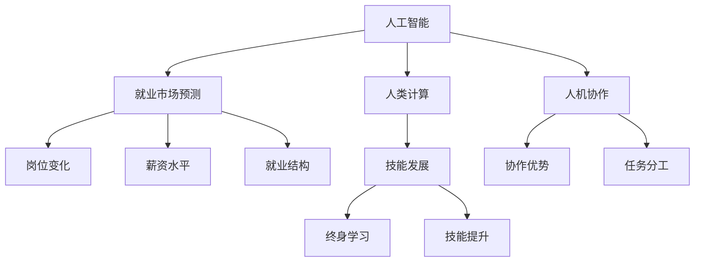

                 

# 人类计算：AI时代的未来就业市场与技能发展预测

> 关键词：人工智能(AI), 人类计算(Human Computation), 就业市场预测, 技能发展, 人机协作, 教育转型, 终身学习(Lifelong Learning)

## 1. 背景介绍

### 1.1 问题由来

随着人工智能(AI)技术的迅猛发展，人工智能在各行各业的应用场景越来越广泛。从医疗诊断、金融风控、自动驾驶到智能客服、个性化推荐、无人零售，AI已经深入渗透到我们生活的方方面面。然而，AI的发展带来的不仅仅是效率的提升和体验的改善，还伴随着一系列复杂的社会和经济影响，包括对就业市场、技能需求和教育体系的深刻改变。

### 1.2 问题核心关键点

当前，AI技术的快速发展和广泛应用对就业市场和技能需求产生了深远影响。本研究聚焦于AI时代下就业市场和技能发展的变化趋势，旨在为政府、企业、教育机构和个人提供全面、前瞻的预测和指导。

1. **就业市场变化**：随着AI技术的普及，某些传统岗位将会被自动化替代，而新的AI相关岗位也会出现。需要探讨AI对就业市场的结构性影响，以及如何平稳过渡。

2. **技能需求变化**：AI技术的应用要求劳动力具备新的技能，如编程、数据分析、机器学习等。需要分析这些新技能对劳动力市场的影响，以及如何培养和提升这些技能。

3. **教育体系转型**：随着就业市场和技能需求的变化，教育体系需要做出适应性调整。需要研究如何设计教育体系以培养适应未来就业市场的技能。

4. **终身学习与终身就业**：在AI时代，知识更新迅速，终身学习将成为常态。需要探讨终身学习的重要性，以及如何构建支持终身学习的体系。

5. **人机协作与人类计算**：AI与人类协作的增强，推动了人类计算模式的发展，即通过人与AI的协作来完成复杂任务。需要研究人类计算的潜力及其对就业市场的影响。

## 2. 核心概念与联系

### 2.1 核心概念概述

为更好地理解AI对就业市场和技能需求的影响，本节将介绍几个核心概念：

- **人工智能(AI)**：通过机器学习、深度学习、自然语言处理等技术实现的智能系统，能够模拟人类智能的某些方面。

- **人类计算(Human Computation)**：人与AI协同完成复杂任务的模式，即利用人类独有的创造力、情感智能和道德判断与AI的算法能力相结合，实现更高效、更具创新性的解决方案。

- **就业市场预测**：通过模型和算法对未来就业市场的变化进行预测和分析，包括岗位变化、薪资水平、就业结构等。

- **技能发展**：指个体和组织为适应未来就业市场所需技能，持续学习和提升的过程。

- **终身学习(Lifelong Learning)**：贯穿个人职业生涯的持续学习过程，旨在提升个人的技能和知识水平，以应对不断变化的市场需求。

- **人机协作**：AI与人协作完成工作的模式，旨在充分发挥AI与人类各自的优势，实现更高效率、更高质量的工作成果。

这些核心概念之间的逻辑关系可以通过以下Mermaid流程图来展示：



这个流程图展示了大语言模型的核心概念及其之间的关系：

1. 人工智能通过学习算法和模型，具备自主执行任务的能力。
2. 人类计算强调人与AI的协同合作，实现更高效的计算。
3. 就业市场预测通过对历史和现状数据进行分析，预测未来市场趋势。
4. 技能发展关注如何通过学习提升个人和组织的竞争力。
5. 终身学习是一种持续学习方式，适应不断变化的市场需求。
6. 人机协作是利用AI与人协作完成任务的模式，强调优势互补。

这些概念共同构成了AI时代下就业市场和技能发展的框架，帮助我们更好地理解AI对就业市场的影响及其对技能需求的变化。

## 3. 核心算法原理 & 具体操作步骤
### 3.1 算法原理概述

就业市场预测和技能发展预测，本质上是一个多变量时间序列预测问题。其核心思想是：通过历史和现状数据，建立数学模型，预测未来就业市场和技能需求的趋势。

形式化地，设 $\{Y_t\}_{t=1}^T$ 为历史就业数据序列，$\{X_t\}_{t=1}^T$ 为历史技能需求数据序列，则有：

$$
Y_t = f(Y_{t-1}, Y_{t-2}, ..., Y_{t-m}, X_{t-1}, X_{t-2}, ..., X_{t-n}, Z_t)
$$

其中 $f$ 为预测模型，$Z_t$ 为影响因素，如经济环境、技术进步、政策变化等。在实践中，通常采用时间序列模型（如ARIMA、VAR等）、机器学习模型（如随机森林、神经网络等）、深度学习模型（如LSTM、GRU等）进行预测。

### 3.2 算法步骤详解

就业市场和技能发展预测通常包括以下几个关键步骤：

**Step 1: 数据收集与预处理**
- 收集历史和现状数据，包括就业数据、技能需求数据、经济环境数据等。
- 数据清洗，去除噪声、异常值，进行标准化处理。

**Step 2: 特征工程**
- 提取特征，如时间、季节性、趋势、滞后项等。
- 特征选择，保留对预测有显著影响的特征。

**Step 3: 模型选择与训练**
- 选择合适的预测模型，如ARIMA、VAR、LSTM等。
- 训练模型，使用历史数据进行模型拟合，选择最优模型参数。

**Step 4: 模型评估与验证**
- 在验证集上评估模型性能，如均方误差、均方根误差等。
- 调整模型参数，提高模型精度。

**Step 5: 预测与分析**
- 对未来数据进行预测，生成就业市场和技能需求的预测结果。
- 分析预测结果，识别潜在的市场变化和技能需求。

**Step 6: 结果反馈与调整**
- 将预测结果反馈给决策者，帮助制定政策、调整教育体系。
- 根据实际情况，调整模型和预测方法，持续改进预测精度。

### 3.3 算法优缺点

就业市场预测和技能发展预测的优缺点如下：

**优点：**
1. **数据驱动**：通过历史和现状数据进行预测，具有较高的准确性。
2. **客观分析**：模型基于数学和统计原理，避免主观偏见。
3. **可扩展性**：适用于多种数据类型和预测场景。

**缺点：**
1. **复杂性高**：模型建立和训练复杂，需要专业知识。
2. **数据依赖性**：预测结果受数据质量和数据量的影响较大。
3. **动态调整困难**：模型难以实时动态调整，应对快速变化的市场环境。

### 3.4 算法应用领域

就业市场预测和技能发展预测的应用领域非常广泛，包括但不限于：

- **政府政策制定**：通过预测就业市场和技能需求变化，帮助政府制定适应性强的就业政策。
- **企业战略规划**：预测就业市场趋势，帮助企业调整人力资源战略和招聘计划。
- **教育体系设计**：根据预测结果，调整教育体系，培养适应未来就业市场的需求。
- **个人职业规划**：为个体提供就业市场和技能需求变化的信息，帮助其制定职业发展计划。

## 4. 数学模型和公式 & 详细讲解 & 举例说明
### 4.1 数学模型构建

就业市场预测和技能发展预测的数学模型通常基于时间序列模型和深度学习模型。以时间序列模型为例，其基本形式如下：

$$
Y_t = \alpha + \beta X_t + \gamma Z_t + \varepsilon_t
$$

其中：
- $Y_t$ 为预测变量，如就业人数、技能需求等。
- $\alpha$ 为截距项。
- $\beta$ 为特征系数。
- $X_t$ 为特征变量，如时间、季节性等。
- $\gamma$ 为影响系数。
- $Z_t$ 为外生变量，如经济环境、技术进步等。
- $\varepsilon_t$ 为误差项。

### 4.2 公式推导过程

以LSTM模型为例，推导其预测过程：

假设已训练好LSTM模型 $LSTM_{\theta}$，其结构为 $LSTM_{\theta}=(X_t;\theta_{LSTM})$。预测步骤为：

1. 将历史数据 $X_{t-1}, X_{t-2}, ..., X_{t-m}$ 输入LSTM模型，得到隐藏状态 $h_t$。
2. 将当前特征 $X_t$ 与隐藏状态 $h_t$ 一起输入LSTM模型，得到新的隐藏状态 $h_t'$。
3. 将隐藏状态 $h_t'$ 输入输出层，得到预测结果 $\hat{Y}_t$。

预测误差为：

$$
e_t = Y_t - \hat{Y}_t
$$

预测误差可作为模型调整和优化的依据。

### 4.3 案例分析与讲解

以美国就业市场为例，分析AI技术对就业市场的影响：

1. **数据准备**：收集美国过去20年的就业数据、技能需求数据、经济环境数据等。
2. **特征工程**：提取时间、季节性、趋势等特征，保留对预测有显著影响的特征。
3. **模型训练**：选择LSTM模型，使用历史数据进行训练，选择最优模型参数。
4. **模型评估**：在验证集上评估模型性能，如均方误差。
5. **预测与分析**：对未来5年的就业市场和技能需求进行预测，分析AI技术对就业市场的影响。

## 5. 项目实践：代码实例和详细解释说明
### 5.1 开发环境搭建

要进行就业市场预测和技能发展预测，首先需要搭建开发环境。以下是使用Python进行PyTorch开发的环境配置流程：

1. 安装Anaconda：从官网下载并安装Anaconda，用于创建独立的Python环境。

2. 创建并激活虚拟环境：
```bash
conda create -n pytorch-env python=3.8 
conda activate pytorch-env
```

3. 安装PyTorch：根据CUDA版本，从官网获取对应的安装命令。例如：
```bash
conda install pytorch torchvision torchaudio cudatoolkit=11.1 -c pytorch -c conda-forge
```

4. 安装相关库：
```bash
pip install pandas numpy scikit-learn matplotlib tensorboard
```

完成上述步骤后，即可在`pytorch-env`环境中开始项目实践。

### 5.2 源代码详细实现

下面以LSTM模型为例，给出使用PyTorch进行就业市场预测的代码实现。

首先，定义数据加载函数：

```python
import pandas as pd
import numpy as np
from torch.utils.data import Dataset, DataLoader

class EmploymentDataset(Dataset):
    def __init__(self, data, seq_len):
        self.data = data
        self.seq_len = seq_len
        
    def __len__(self):
        return len(self.data) - self.seq_len
    
    def __getitem__(self, idx):
        X = self.data.iloc[idx:idx+self.seq_len, :-1].values
        y = self.data.iloc[idx+self.seq_len, -1].values
        return X, y
```

然后，定义LSTM模型和训练函数：

```python
import torch
import torch.nn as nn
import torch.optim as optim

class LSTM(nn.Module):
    def __init__(self, input_size, hidden_size, output_size):
        super(LSTM, self).__init__()
        self.hidden_size = hidden_size
        self.lstm = nn.LSTM(input_size, hidden_size, 1, batch_first=True)
        self.fc = nn.Linear(hidden_size, output_size)
        
    def forward(self, x):
        h0 = torch.zeros(1, x.size(0), self.hidden_size).to(x.device)
        c0 = torch.zeros(1, x.size(0), self.hidden_size).to(x.device)
        out, _ = self.lstm(x, (h0, c0))
        out = self.fc(out[:, -1, :])
        return out

def train(model, train_loader, valid_loader, optimizer, criterion, n_epochs):
    model.train()
    train_loss = []
    valid_loss = []
    
    for epoch in range(n_epochs):
        train_loss_epoch = 0
        valid_loss_epoch = 0
        for batch in train_loader:
            X, y = batch
            y_hat = model(X)
            loss = criterion(y_hat, y)
            optimizer.zero_grad()
            loss.backward()
            optimizer.step()
            train_loss_epoch += loss.item()
        
        model.eval()
        with torch.no_grad():
            valid_loss_epoch = 0
            for batch in valid_loader:
                X, y = batch
                y_hat = model(X)
                loss = criterion(y_hat, y)
                valid_loss_epoch += loss.item()
        
        train_loss.append(train_loss_epoch / len(train_loader))
        valid_loss.append(valid_loss_epoch / len(valid_loader))
    
    print(f'Training Loss: {train_loss}')
    print(f'Validation Loss: {valid_loss}')
```

最后，启动训练流程并在验证集上评估：

```python
from sklearn.model_selection import train_test_split
from torch.optim import Adam

# 读取数据
data = pd.read_csv('employment_data.csv')

# 划分训练集和测试集
train_data, test_data = train_test_split(data, test_size=0.2, random_state=42)

# 数据标准化处理
train_data['X'] = (train_data['X'] - train_data['X'].mean()) / train_data['X'].std()
test_data['X'] = (test_data['X'] - test_data['X'].mean()) / test_data['X'].std()

# 创建数据集
train_dataset = EmploymentDataset(train_data, seq_len=5)
valid_dataset = EmploymentDataset(test_data, seq_len=5)

# 加载数据
train_loader = DataLoader(train_dataset, batch_size=32, shuffle=True)
valid_loader = DataLoader(valid_dataset, batch_size=32, shuffle=False)

# 模型初始化
hidden_size = 64
input_size = train_data['X'].shape[1]
output_size = 1
model = LSTM(input_size, hidden_size, output_size)

# 定义优化器和损失函数
optimizer = Adam(model.parameters(), lr=0.01)
criterion = nn.MSELoss()

# 训练模型
train(model, train_loader, valid_loader, optimizer, criterion, n_epochs=100)
```

以上就是使用PyTorch对LSTM模型进行就业市场预测的完整代码实现。可以看到，利用PyTorch的框架和库，可以方便地实现就业市场预测模型的训练和评估。

### 5.3 代码解读与分析

让我们再详细解读一下关键代码的实现细节：

**EmploymentDataset类**：
- `__init__`方法：初始化数据集和序列长度。
- `__len__`方法：返回数据集长度。
- `__getitem__`方法：对单个样本进行处理，将特征和标签进行padding，并返回模型所需的输入和输出。

**LSTM模型**：
- 定义LSTM模型结构，包括LSTM层和全连接层。
- `forward`方法：实现前向传播，计算隐藏状态和输出。

**train函数**：
- 定义训练过程，包括前向传播、损失计算、反向传播和参数更新。
- 在训练集和验证集上分别进行训练和评估，记录训练损失和验证损失。

可以看到，PyTorch提供了便捷的框架和库，使得模型训练和评估变得简单高效。合理利用这些工具，可以显著提升模型开发和验证的效率。

## 6. 实际应用场景
### 6.1 政府政策制定

AI技术在政府政策制定中具有重要应用。通过就业市场预测和技能发展预测，政府可以制定适应性强的就业政策，如职业教育补贴、就业培训计划、技能认证等，促进劳动力市场的平稳过渡。

具体应用场景包括：
- **职业教育补贴**：根据预测结果，调整职业教育补贴的方向和规模，确保劳动力市场供需平衡。
- **技能认证**：引入AI技术，自动评估技能水平，推动劳动者获取职业资格证书，提升就业竞争力。
- **就业培训计划**：设计针对性强的就业培训项目，帮助劳动者提升新技能，适应市场变化。

### 6.2 企业人力资源管理

企业人力资源管理也需要借助AI技术，进行就业市场预测和技能发展预测，优化人力资源规划。

具体应用场景包括：
- **招聘预测**：根据市场预测结果，调整招聘策略，提高招聘效率。
- **员工培训**：根据技能预测结果，设计培训计划，提升员工技能，增强企业竞争力。
- **绩效评估**：利用AI技术进行绩效评估，提高评估的公平性和准确性。

### 6.3 教育体系设计

教育体系设计需要考虑未来就业市场和技能需求的变化，培养适应未来市场的人才。

具体应用场景包括：
- **课程设计**：根据预测结果，调整课程内容，引入新兴技术，培养高素质人才。
- **师资培训**：利用AI技术进行师资培训，提升教师的教育教学能力。
- **学生评估**：引入AI技术进行学生评估，提升评估的客观性和有效性。

## 7. 工具和资源推荐
### 7.1 学习资源推荐

为了帮助开发者系统掌握就业市场预测和技能发展预测的理论基础和实践技巧，这里推荐一些优质的学习资源：

1. **《Python深度学习》书籍**：Ian Goodfellow等著，介绍了深度学习的基本概念和实现方法，适合初学者和进阶者。
2. **《深度学习》课程**：Coursera提供的吴恩达教授的深度学习课程，内容全面，涵盖深度学习的基础理论和实践技巧。
3. **《就业市场预测》论文**：相关领域的学术论文，如《Long Short-Term Memory》、《Neural Network Design》等，深入浅出地介绍了时间序列预测模型的原理和实现方法。
4. **Kaggle竞赛**：Kaggle提供了多个就业市场预测和技能发展预测的竞赛，通过竞赛练习，提升实战能力。
5. **相关书籍**：《机器学习实战》、《深度学习入门》等，提供了丰富的实战案例和代码示例，适合初学者和实践者。

通过对这些资源的学习实践，相信你一定能够快速掌握就业市场预测和技能发展预测的精髓，并用于解决实际的就业问题。

### 7.2 开发工具推荐

高效的开发离不开优秀的工具支持。以下是几款用于就业市场预测和技能发展预测开发的常用工具：

1. **Python**：作为当前最流行的编程语言之一，Python具有简洁、易读、易用的特点，适合开发AI相关应用。
2. **PyTorch**：由Facebook开发的深度学习框架，提供了丰富的模型库和优化工具，适合研究和实践。
3. **TensorFlow**：由Google开发的深度学习框架，生产部署方便，适合大规模工程应用。
4. **Pandas**：数据处理和分析的利器，适合数据清洗、特征提取等预处理工作。
5. **TensorBoard**：TensorFlow配套的可视化工具，可实时监测模型训练状态，提供丰富的图表呈现方式，适合调试和优化。

合理利用这些工具，可以显著提升模型开发和验证的效率。

### 7.3 相关论文推荐

就业市场预测和技能发展预测的研究源于学界的持续研究。以下是几篇奠基性的相关论文，推荐阅读：

1. **《Time Series Forecasting with Deep Learning》**：Khalid I. Chang等著，介绍了深度学习在时间序列预测中的应用，提供了多种深度学习模型的实现方法。
2. **《LSTM Networks for Robust Time Series Forecasting》**：Sepp Hochreiter等著，介绍了LSTM模型在时间序列预测中的表现，提供了实验结果和分析。
3. **《Job Market Forecasting Using Machine Learning》**：Zheng Yan等著，介绍了机器学习在就业市场预测中的应用，提供了预测模型的评估和优化方法。
4. **《Skill Development in the Era of AI》**：Jill Hulme等著，探讨了AI对技能发展的影响，提供了多学科的研究视角和政策建议。
5. **《Lifelong Learning for Adaptive Skill Development》**：Michael C. J. Miller等著，介绍了终身学习在技能发展中的应用，提供了案例分析和实践建议。

这些论文代表了大语言模型微调技术的发展脉络。通过学习这些前沿成果，可以帮助研究者把握学科前进方向，激发更多的创新灵感。

## 8. 总结：未来发展趋势与挑战
### 8.1 研究成果总结

本文对AI时代下就业市场和技能发展的变化趋势进行了全面系统的介绍。首先阐述了AI技术对就业市场和技能需求的影响，明确了预测就业市场变化和技能发展需求的重要性。其次，从原理到实践，详细讲解了就业市场预测和技能发展预测的数学模型和关键步骤，给出了模型开发的完整代码实例。同时，本文还广泛探讨了预测模型在政府政策制定、企业人力资源管理、教育体系设计等多个领域的应用前景，展示了预测模型的巨大潜力。

通过本文的系统梳理，可以看到，AI技术的应用对就业市场和技能发展产生了深远影响。AI技术不仅改变了传统岗位的形态，还催生了大量新的AI相关岗位，对劳动力市场结构进行了重塑。未来，随着AI技术的进一步发展和普及，就业市场和技能需求还将继续发生深刻变化。AI技术也将成为推动经济社会发展的重要引擎。

### 8.2 未来发展趋势

展望未来，就业市场预测和技能发展预测将呈现以下几个发展趋势：

1. **智能化程度提升**：随着AI技术的不断进步，预测模型的智能化程度将进一步提升，能够处理更加复杂的数据和任务。
2. **跨领域融合**：AI技术将与其他学科（如经济、金融、教育等）进行深度融合，提升预测模型的应用效果。
3. **实时化预测**：通过引入实时数据和动态调整算法，预测模型将具备实时预测能力，适应快速变化的市场环境。
4. **个性化预测**：根据个体特征和行为数据，提供个性化的预测结果，满足不同群体的需求。
5. **多模态数据融合**：利用多模态数据（如文本、图像、视频等）进行融合预测，提升预测的准确性和全面性。

这些趋势展示了AI技术在就业市场预测和技能发展预测中的巨大潜力，为未来研究和技术应用提供了方向。

### 8.3 面临的挑战

尽管AI技术在就业市场预测和技能发展预测中取得了显著成果，但在其发展过程中仍面临诸多挑战：

1. **数据质量与可用性**：高质量、完整的数据是预测模型准确性的前提，但获取和处理大规模数据需要耗费大量资源。
2. **模型复杂度与可解释性**：复杂的预测模型难以解释其内部机制，决策过程不透明，增加了风险。
3. **实时性与动态性**：实时预测需要高效的算法和硬件支持，动态调整模型参数也增加了模型维护的复杂性。
4. **隐私与安全**：预测模型可能涉及敏感数据，隐私保护和数据安全成为重要问题。
5. **政策与伦理**：预测模型可能引发伦理和政策问题，如何平衡技术应用与伦理道德是重要课题。

这些挑战需要我们在技术、政策、伦理等多个层面进行综合应对，才能推动AI技术在就业市场预测和技能发展预测中的应用。

### 8.4 研究展望

未来，就业市场预测和技能发展预测的研究需要在以下几个方面寻求新的突破：

1. **多模态数据融合**：将文本、图像、视频等多模态数据进行融合，提升预测的全面性和准确性。
2. **因果关系建模**：引入因果推断方法，分析AI技术对就业市场和技能需求的影响机制，提升预测模型的解释性。
3. **实时化动态预测**：引入实时数据和动态调整算法，实现预测模型的实时更新和优化。
4. **个性化预测**：基于个体特征和行为数据，提供个性化的预测结果，满足不同群体的需求。
5. **模型可解释性**：研究模型可解释性技术，提升预测模型的透明性和可信度。

这些研究方向将推动就业市场预测和技能发展预测技术的发展，为未来AI技术的应用提供坚实基础。相信随着技术研究的不断深入，就业市场预测和技能发展预测将为社会经济的发展带来更加深刻的影响。

## 9. 附录：常见问题与解答

**Q1：就业市场预测模型如何处理异常值？**

A: 异常值可能会影响预测结果的准确性，一般采用以下方法处理异常值：
1. **删除异常值**：对异常值进行删除，但需要注意删除异常值的比例，避免数据偏差。
2. **替换异常值**：将异常值替换为合理的值，如均值、中位数等。
3. **数据平滑**：使用平滑算法，如移动平均、滑动平均等，减少异常值的影响。

**Q2：如何评估就业市场预测模型的性能？**

A: 就业市场预测模型的性能评估通常采用以下指标：
1. **均方误差（MSE）**：衡量预测值与真实值之间的差异。
2. **均方根误差（RMSE）**：衡量预测值与真实值的相对误差。
3. **平均绝对误差（MAE）**：衡量预测值与真实值的绝对误差。
4. **相关系数（R-squared）**：衡量预测值与真实值之间的相关性。

这些指标可以帮助评估预测模型的准确性和可靠性。

**Q3：就业市场预测模型的应用有哪些局限性？**

A: 就业市场预测模型的应用存在以下局限性：
1. **数据依赖性**：预测结果受数据质量和数据量的影响较大，数据的偏差可能导致预测结果的不准确。
2. **模型复杂性**：复杂的预测模型难以解释其内部机制，决策过程不透明，增加了风险。
3. **动态变化**：就业市场和技能需求的变化速度快，模型难以实时动态调整，应对快速变化的市场环境。
4. **隐私与安全**：预测模型可能涉及敏感数据，隐私保护和数据安全成为重要问题。
5. **政策与伦理**：预测模型可能引发伦理和政策问题，如何平衡技术应用与伦理道德是重要课题。

这些局限性需要我们在技术、政策、伦理等多个层面进行综合应对，才能推动AI技术在就业市场预测中的应用。

**Q4：如何提升就业市场预测模型的准确性？**

A: 提升就业市场预测模型的准确性需要从多个方面入手：
1. **数据质量**：获取高质量、完整的数据，避免数据偏差。
2. **特征工程**：提取和选择对预测有显著影响的特征，提升模型的预测能力。
3. **模型选择**：选择适当的预测模型，如LSTM、GRU、ARIMA等，并根据实际情况进行调整。
4. **参数调整**：调整模型的参数，优化模型的预测效果。
5. **评估与优化**：在验证集上评估模型性能，根据结果进行优化调整。

通过这些方法，可以提升就业市场预测模型的准确性和可靠性。

**Q5：AI技术对就业市场和技能需求的变化有哪些影响？**

A: AI技术对就业市场和技能需求的影响包括：
1. **替代效应**：某些传统岗位将会被自动化替代，减少对劳动力的需求。
2. **创造效应**：AI技术催生了大量新的AI相关岗位，增加对劳动力的需求。
3. **技能升级**：AI技术要求劳动力具备新的技能，如编程、数据分析、机器学习等。
4. **人机协作**：AI技术推动了人机协作模式的发展，提升工作效率和质量。
5. **教育转型**：教育体系需要调整，培养适应未来市场需求的劳动力。

这些影响展示了AI技术在就业市场和技能需求中的深远影响，为未来研究和应用提供了方向。

---

作者：禅与计算机程序设计艺术 / Zen and the Art of Computer Programming

