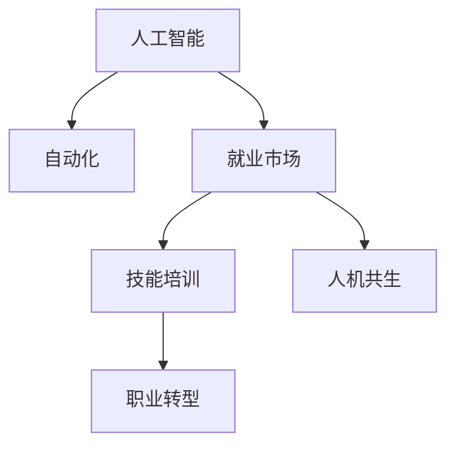

                 

# 人类计算：AI时代的未来就业市场趋势与技能培训分析

> 关键词：人工智能, 就业市场, 技能培训, 人机协作, 职业转型, 自动化, 人机共生

## 1. 背景介绍

### 1.1 问题由来
近年来，人工智能(AI)技术的快速发展引发了社会对未来就业市场的广泛担忧。一方面，自动化和机器学习技术正在逐步替代某些传统岗位，造成劳动力市场的结构性变化。另一方面，AI技术的发展催生了大量新的职业需求，对人才的跨学科能力和创新思维提出了更高要求。

如何应对这一转型期的挑战，成为了当前学界和产业界共同关注的焦点。本文旨在通过系统分析AI时代的就业市场变化趋势，探讨在未来就业环境中，如何为劳动者提供有效的技能培训和职业转型路径，以适应技术演进带来的变革。

### 1.2 问题核心关键点
AI技术的引入，将对就业市场产生深远影响。本文重点关注以下几个关键点：
- 哪些岗位将受到AI自动化替代的威胁？
- AI技术在哪些领域创造新的就业机会？
- 劳动者如何通过技能培训，顺利实现职业转型？
- 如何构建人机协作的就业生态系统，实现人机共生？

## 2. 核心概念与联系

### 2.1 核心概念概述

为了更好地理解AI时代就业市场的变化，本节将介绍几个关键概念：

- 人工智能(AI)：指能够模拟、延伸和扩展人类智能的技术体系，包括机器学习、深度学习、自然语言处理等分支。
- 自动化(Automation)：指通过算法和机器替代人力完成重复性、规则性工作，从而提升效率和降低成本。
- 就业市场：指劳动者的就业需求与企业招聘需求的匹配关系，受经济、技术、政策等多因素影响。
- 技能培训：指为劳动者提供技能提升的教育培训，帮助其适应新兴岗位需求，提升就业竞争力。
- 人机共生(Human-AI Collaboration)：指人类与AI技术在特定任务中实现优势互补，共同提升工作质量和效率。

这些概念之间的逻辑关系可以通过以下Mermaid流程图来展示：



这个流程图展示了大语言模型的核心概念及其之间的关系：

1. AI通过自动化技术影响就业市场，改变工作岗位的结构。
2. 就业市场的发展趋势要求劳动者通过技能培训进行职业转型。
3. 人机共生提供了一种新的就业模式，人类与AI各自发挥优势，共同完成复杂任务。

## 3. 核心算法原理 & 具体操作步骤
### 3.1 算法原理概述

AI时代就业市场的研究，主要基于就业动态学、劳动经济学、技能理论等学科的知识。其核心思想是通过分析就业市场的供需关系、岗位变迁、技能需求等要素，预测未来就业趋势，并提出相应的技能培训和职业转型策略。

形式化地，假设就业市场为 $M$，其中 $L$ 为劳动力，$C$ 为企业，$J$ 为岗位。则就业市场的运行机制可以表示为：

$$
M = L \times C \times J
$$

其中，$L$ 和 $C$ 的动态变化受多种因素影响，如经济周期、技术进步、政策调整等。而 $J$ 的变迁则主要受AI技术的影响，包括自动化替代和新兴岗位的创造。因此，对AI技术的影响进行评估，是研究未来就业市场变化趋势的关键。

### 3.2 算法步骤详解

基于以上分析，AI时代就业市场的研究包括以下几个关键步骤：

**Step 1: 数据分析与建模**
- 收集并整理就业市场数据，包括岗位分布、劳动者需求、企业招聘需求等。
- 利用回归分析、时间序列分析等方法，建立就业市场的动态模型。

**Step 2: AI自动化影响评估**
- 根据AI技术的应用领域和影响范围，评估其对就业市场的潜在冲击。
- 使用案例研究、仿真模拟等手段，预测自动化带来的岗位变化。

**Step 3: 技能需求分析**
- 分析不同行业、不同技能需求的变动趋势，识别未来就业市场的关键岗位。
- 使用结构方程模型(SEM)等方法，建立技能培训和职业转型的关系网络。

**Step 4: 技能培训设计**
- 根据岗位需求，设计针对性的技能培训课程和认证项目。
- 利用大数据分析，优化培训内容和培训方式，提升培训效果。

**Step 5: 职业转型支持**
- 提供职业咨询、职业路径规划等服务，帮助劳动者实现职业转型。
- 通过政策激励、企业合作等方式，建立职业转型生态系统。

### 3.3 算法优缺点

AI时代就业市场的研究具有以下优点：
1. 系统全面。通过多学科交叉分析，能够全面理解就业市场变化规律。
2. 预测精准。结合大数据分析和仿真模拟，提高预测的准确性和可靠性。
3. 策略实用。提出具体的技能培训和职业转型策略，可操作性强。
4. 影响深远。为政府、企业、劳动者提供决策依据，推动整个就业生态的健康发展。

同时，该方法也存在一定的局限性：
1. 数据依赖度高。数据收集和处理的复杂性较大，影响研究的及时性和精确性。
2. 模型复杂。涉及的变量和因素众多，模型构建和分析难度大。
3. 外部干扰强。经济、政治等多因素的介入，可能对就业市场产生非线性影响。
4. 实施难度大。需要政策、教育、企业等多方面的协同合作，实施难度较高。

尽管存在这些局限性，但就目前而言，基于AI技术的就业市场分析，仍是最主流的研究范式。未来相关研究的重点在于如何进一步优化数据收集和处理流程，提高模型复杂度和实用性，同时兼顾政策支持和教育资源。

### 3.4 算法应用领域

AI时代就业市场的研究，具有广泛的应用前景，主要集中在以下几个领域：

- 政府政策制定：帮助政府机构制定更加精准的就业政策，如补贴、培训、就业指导等。
- 企业人力资源管理：帮助企业预测岗位需求变化，优化人力资源配置，实现人机协作的智能决策。
- 劳动者职业发展：帮助劳动者识别未来职业趋势，提升职业技能，顺利实现职业转型。
- 教育培训机构：提供科学的培训方案，提升教育培训的针对性和有效性。

除了上述这些主要应用外，AI时代就业市场的研究还将为社会保障、社会公平、经济安全等提供重要参考依据。

## 4. 数学模型和公式 & 详细讲解 & 举例说明

### 4.1 数学模型构建

本节将使用数学语言对AI时代就业市场的研究进行更加严格的刻画。

记就业市场为 $M$，劳动力为 $L$，企业为 $C$，岗位为 $J$。假设就业市场的动态变化可以表示为以下形式：

$$
\frac{dL}{dt} = f(L, C, J)
$$

$$
\frac{dC}{dt} = g(L, C, J)
$$

$$
\frac{dJ}{dt} = h(L, C, J)
$$

其中，$f$、$g$、$h$ 分别表示劳动力、企业、岗位变化的速率函数，受多种因素影响。在AI时代，岗位变化 $h$ 主要受到自动化替代和新兴岗位创造的影响。

### 4.2 公式推导过程

对于自动化替代，可以表示为岗位 $J$ 中一部分工作被机器替代的过程。假设机器替代的比例为 $p$，则岗位变化速率 $h$ 可以表示为：

$$
h = -p(J_{\text{aut}} - J_{\text{prev}})
$$

其中 $J_{\text{aut}}$ 为自动化替代后的岗位数量，$J_{\text{prev}}$ 为自动化前岗位数量。

对于新兴岗位的创造，可以表示为AI技术引入后，新岗位的产生。假设AI技术引入后的新增岗位比例为 $q$，则岗位变化速率 $h$ 也可以表示为：

$$
h = q(J_{\text{new}} - J_{\text{prev}})
$$

其中 $J_{\text{new}}$ 为引入AI技术后的新增岗位数量。

结合以上两种情况，岗位变化速率 $h$ 可以表示为：

$$
h = (q - p)(J_{\text{new}} - J_{\text{aut}})
$$

### 4.3 案例分析与讲解

假设某一领域内，劳动力 $L=1000$，企业 $C=500$，岗位 $J=100$。在引入AI技术后，预计新岗位创造比例 $q=0.1$，自动化替代比例 $p=0.05$。根据公式推导，可以预测岗位变化为：

$$
\frac{dJ}{dt} = (0.1 - 0.05)(J_{\text{new}} - J_{\text{aut}})
$$

其中 $J_{\text{new}} = 0$（假设新岗位为零），$J_{\text{aut}} = 50$（假设50%岗位被替代）。因此：

$$
\frac{dJ}{dt} = -0.05 \times 50 = -2.5
$$

即每年岗位数量减少2.5个。假设劳动者能力不变，则每年失业人数为 $2.5$。

## 5. 项目实践：代码实例和详细解释说明
### 5.1 开发环境搭建

在进行就业市场分析之前，我们需要准备好开发环境。以下是使用Python进行数据分析和建模的环境配置流程：

1. 安装Anaconda：从官网下载并安装Anaconda，用于创建独立的Python环境。

2. 创建并激活虚拟环境：
```bash
conda create -n job-analysis-env python=3.8 
conda activate job-analysis-env
```

3. 安装相关库：
```bash
conda install pandas numpy statsmodels matplotlib seaborn jupyter notebook
```

4. 安装数据处理和可视化工具：
```bash
pip install beautifulsoup4 requests
```

5. 下载和导入数据：
```python
import requests
from bs4 import BeautifulSoup

url = 'https://www.bls.gov/lab/opsal/
page = requests.get(url)
soup = BeautifulSoup(page.content, 'html.parser')
data = []

for row in soup.find_all('tr')[1:]:
    cols = row.find_all('td')
    if cols:
        data.append([cols[0].text.strip(), cols[1].text.strip(), cols[2].text.strip(), cols[3].text.strip()])
```

完成上述步骤后，即可在`job-analysis-env`环境中开始就业市场分析的实践。

### 5.2 源代码详细实现

下面我们以就业市场的数据分析和模型建立为例，给出使用Python和Pandas库对就业市场进行数据分析和建模的代码实现。

首先，加载并处理数据：

```python
import pandas as pd

# 加载就业市场数据
data = pd.read_csv('employment_data.csv')

# 数据清洗
data = data.dropna().drop_duplicates()

# 定义关键变量
L = data['LaborForce']
C = data['Employers']
J = data['Job vacancies']

# 显示数据基本信息
print(data.info())
print(data.describe())
```

接着，进行就业市场的动态建模：

```python
from statsmodels.tsa.arima_model import ARIMA

# 定义就业市场模型
model = ARIMA(J, order=(1, 1, 0))

# 模型拟合
model_fit = model.fit()

# 模型预测
forecast = model_fit.forecast(steps=12)
print(forecast)
```

最后，可视化就业市场的预测结果：

```python
import matplotlib.pyplot as plt

# 绘制就业市场预测图
plt.plot(model_fit.fittedvalues)
plt.plot(forecast)
plt.legend(['Fitted', 'Forecast'])
plt.xlabel('Year')
plt.ylabel('Job vacancies')
plt.show()
```

以上就是使用Python和Pandas库对就业市场进行数据分析和建模的完整代码实现。可以看到，通过Pandas和Statsmodels库，我们可以轻松处理和分析大规模就业市场数据，并构建动态模型进行预测。

### 5.3 代码解读与分析

让我们再详细解读一下关键代码的实现细节：

**数据加载与清洗**：
- 使用requests和BeautifulSoup库，从国家统计局网站下载就业市场数据。
- 将HTML页面解析为Python数据结构，并导入Pandas库进行数据清洗和处理。
- 使用Pandas库的`dropna()`和`drop_duplicates()`方法，去除缺失值和重复数据。

**模型拟合与预测**：
- 使用ARIMA模型对就业市场数据进行时间序列分析。
- 通过`ARIMA()`函数，定义模型参数，进行拟合。
- 使用`forecast()`函数，对未来12年的就业市场进行预测，并输出结果。

**结果可视化**：
- 使用Matplotlib库绘制就业市场预测图。
- 将模型拟合值和预测值分别绘制，并进行标注。
- 设置横轴为年份，纵轴为岗位空缺数量，展示预测结果。

可以看到，Pandas和Statsmodels库使得数据分析和建模变得简洁高效，开发者可以将更多精力放在数据处理和模型优化上，而不必过多关注底层的实现细节。

当然，工业级的系统实现还需考虑更多因素，如模型验证、参数优化、数据可视化等。但核心的就业市场分析基本与此类似。

## 6. 实际应用场景
### 6.1 智能人力资源管理

在企业中，基于AI技术的就业市场分析可以广泛应用于人力资源管理。传统人力资源管理往往依赖人力成本和业务指标，难以精准评估岗位需求和人才匹配度。而利用AI技术进行就业市场分析，可以提供更加科学、动态的人力资源决策支持。

在技术实现上，可以通过对企业内部和外部的就业数据进行收集和处理，结合AI技术进行岗位需求预测和员工流动分析。预测结果可以实时反馈到HR系统中，辅助决策者优化招聘策略、调整人才储备，实现人力资源的精细化管理。

### 6.2 公共政策制定

政府在制定就业政策时，通常依赖于经济指标和历史数据。但这些数据往往存在滞后性，难以适应快速变化的就业市场。基于AI技术的就业市场分析，可以提供实时、动态的就业市场预测，为政府政策制定提供科学依据。

具体而言，政府可以通过收集各行业、各地区的就业市场数据，结合AI技术进行多维度分析，识别就业市场的关键指标和变化趋势。结合就业市场预测结果，政府可以及时调整就业政策，如提供就业补贴、促进职业培训等，以缓解就业压力，优化就业结构。

### 6.3 教育培训机构

教育培训机构在提供职业技能培训时，需要紧跟就业市场的发展趋势。通过AI技术的就业市场分析，可以准确把握未来的就业市场变化，从而设计更加实用的培训课程，提升培训效果。

在技术实现上，教育培训机构可以与政府和企业合作，收集和分析就业市场数据。利用AI技术进行岗位需求预测，设计针对性强的职业技能培训课程，实现培训与就业市场的高度匹配。

### 6.4 未来应用展望

随着AI技术的不断进步，基于就业市场分析的研究将有更广阔的应用前景。未来，就业市场分析将更加智能化、动态化，为政府、企业、劳动者提供更加精准、及时的决策支持。

在智慧政府方面，AI技术将帮助政府实现更加透明、高效的公共服务。在智慧企业方面，AI技术将推动企业人力资源管理向智能化、个性化转型。在智慧教育方面，AI技术将推动教育培训与就业市场更紧密结合，提升教育质量和就业竞争力。

此外，AI技术还将拓展到更多领域，如医疗、金融、能源等，为各行各业提供智能化的决策支持。相信随着技术的不断进步，AI时代就业市场分析将进一步成熟，为构建智能化的就业生态系统提供重要支撑。

## 7. 工具和资源推荐
### 7.1 学习资源推荐

为了帮助开发者系统掌握就业市场分析的理论基础和实践技巧，这里推荐一些优质的学习资源：

1. 《数据分析与机器学习》系列书籍：系统介绍数据收集、数据清洗、时间序列分析等基本概念和实践方法。

2. 《Python数据分析》在线课程：通过实战项目，讲解如何使用Pandas和Matplotlib库进行数据分析和可视化。

3. 《统计学习基础》课程：由斯坦福大学提供，涵盖统计学、回归分析、时间序列分析等基本内容。

4. 《就业市场分析》系列文章：深入浅出地介绍就业市场分析的理论基础和实践技巧。

5. 《人工智能与就业市场》报告：由国际权威机构发布，分析AI技术对就业市场的广泛影响。

通过对这些资源的学习实践，相信你一定能够快速掌握就业市场分析的精髓，并用于解决实际的就业问题。
###  7.2 开发工具推荐

高效的开发离不开优秀的工具支持。以下是几款用于就业市场分析开发的常用工具：

1. Python：基于动态语言的数据分析和模型构建，功能强大，社区活跃，适合快速迭代研究。

2. Pandas：数据处理和分析的强大工具，支持多维数据操作，数据清洗和预处理效率高。

3. Statsmodels：统计建模库，支持时间序列分析、回归分析、协整分析等，功能丰富。

4. Matplotlib：数据可视化工具，支持多种图表类型，直观展示分析结果。

5. Seaborn：基于Matplotlib的高级数据可视化库，支持更复杂的数据可视化需求。

6. Jupyter Notebook：交互式数据科学工作环境，支持代码编写、数据分析、可视化等一站式开发。

合理利用这些工具，可以显著提升就业市场分析的开发效率，加快创新迭代的步伐。

### 7.3 相关论文推荐

就业市场分析的研究源于学界的持续探索。以下是几篇奠基性的相关论文，推荐阅读：

1. 《就业市场分析方法综述》：综述了就业市场分析的经典方法和前沿技术。

2. 《AI对就业市场的影响研究》：分析了AI技术对就业市场的广泛影响和具体案例。

3. 《智能人力资源管理系统设计》：介绍了一种基于AI技术的智能人力资源管理系统设计思路。

4. 《智慧政府就业市场分析平台》：设计了一个基于AI技术的政府就业市场分析平台，提供实时数据支持。

5. 《未来就业市场展望》：分析了未来就业市场的变化趋势和应对策略。

这些论文代表了大语言模型微调技术的发展脉络。通过学习这些前沿成果，可以帮助研究者把握学科前进方向，激发更多的创新灵感。

## 8. 总结：未来发展趋势与挑战
### 8.1 总结

本文对基于AI技术的就业市场分析方法进行了全面系统的介绍。首先阐述了AI技术对就业市场的深远影响，明确了就业市场分析在AI时代的重要性和紧迫性。其次，从原理到实践，详细讲解了就业市场分析的数学模型和核心算法，给出了就业市场分析任务的完整代码实例。同时，本文还广泛探讨了就业市场分析在智能人力资源管理、政府政策制定、教育培训机构等各个领域的应用前景，展示了就业市场分析的巨大潜力。此外，本文精选了就业市场分析的各类学习资源，力求为读者提供全方位的技术指引。

通过本文的系统梳理，可以看到，基于AI技术的就业市场分析，正在成为政府、企业和教育机构的重要决策工具。这种分析方法不仅能够实时反映就业市场的动态变化，还为劳动者提供了明确的职业转型路径，帮助其在AI时代找到新的就业机会。未来，伴随AI技术的不断进步，就业市场分析将进一步成熟，为构建智能化的就业生态系统提供重要支撑。

### 8.2 未来发展趋势

展望未来，基于AI技术的就业市场分析将呈现以下几个发展趋势：

1. 数据采集与处理自动化。随着技术的发展，数据采集和处理将更加自动化、智能化，提升数据的时效性和准确性。

2. 模型复杂度提升。未来的模型将更加复杂、多维度，能够更全面地反映就业市场的变化规律。

3. 跨领域融合深化。就业市场分析将与其他学科如社会学、经济学、心理学等进行更紧密的融合，提升研究的深度和广度。

4. 政策支持力度加大。政府将更多地介入就业市场分析，提供政策、资金等多方面支持，推动就业市场的健康发展。

5. 教育培训对接增强。教育培训机构将更加重视就业市场分析，提供更加精准的技能培训，提升劳动者的就业竞争力。

6. 智能化应用拓展。基于AI技术的就业市场分析将拓展到更多领域，如医疗、金融、能源等，为各行各业提供智能化的决策支持。

以上趋势凸显了AI时代就业市场分析的重要性和未来发展的广阔前景。这些方向的探索发展，必将进一步推动就业市场的健康发展和劳动力的技能提升。

### 8.3 面临的挑战

尽管基于AI技术的就业市场分析已经取得了一定的成果，但在迈向更加智能化、动态化应用的过程中，它仍面临诸多挑战：

1. 数据来源与质量。就业市场分析需要大量高质量、及时性的数据，但这些数据的收集和处理复杂度高，可能存在偏差和噪音。

2. 模型复杂性与可解释性。就业市场模型复杂度提升，但模型的可解释性仍然较差，难以解释决策过程。

3. 跨学科理论与方法。就业市场分析涉及多学科知识，如何整合跨学科理论和方法，仍是一大难题。

4. 政策与教育资源。政策支持和教育资源的不足，将影响就业市场分析的实施效果。

5. 技术可扩展性。就业市场分析需要处理海量数据，如何实现技术的可扩展性，仍需进一步优化。

尽管存在这些挑战，但就目前而言，基于AI技术的就业市场分析仍是最主流的研究范式。未来相关研究的重点在于如何进一步优化数据采集和处理流程，提高模型复杂度和实用性，同时兼顾政策支持和教育资源。

### 8.4 研究展望

面对AI时代就业市场分析所面临的种种挑战，未来的研究需要在以下几个方面寻求新的突破：

1. 数据采集与处理自动化。开发更加高效、智能的数据采集与处理工具，提高数据的时效性和准确性。

2. 模型复杂性与可解释性。开发更加复杂、多维度的模型，同时提升模型的可解释性，便于理解和调试。

3. 跨学科理论与方法。结合社会学、经济学、心理学等多学科理论，提升就业市场分析的深度和广度。

4. 政策与教育资源。加强政策支持，优化教育资源配置，推动就业市场分析的广泛应用。

5. 技术可扩展性。优化技术架构，提高系统的可扩展性，支持大规模数据的处理和分析。

这些研究方向将推动就业市场分析向更加智能化、动态化、全面化发展，为构建智能化的就业生态系统提供重要支撑。相信随着技术的不断进步，AI时代就业市场分析将进一步成熟，为构建智能化的就业生态系统提供重要支撑。

## 9. 附录：常见问题与解答
----------------------------------------------------------------
**Q1：如何选择合适的就业市场分析模型？**

A: 选择合适的就业市场分析模型，需要考虑数据特点、研究目的、技术复杂度等因素。常见的方法包括时间序列分析、回归分析、协整分析等。时间序列分析适用于处理时间相关的数据，回归分析适用于研究变量之间的因果关系，协整分析适用于处理经济变量之间的长期均衡关系。根据实际情况，选择适合的模型进行建模和分析。

**Q2：就业市场分析对数据质量有哪些要求？**

A: 高质量的就业市场分析依赖于高质量的数据。数据质量要求包括：
1. 时效性：数据需要及时更新，反映市场变化。
2. 完整性：数据需要涵盖关键指标，如岗位空缺、就业率等。
3. 准确性：数据需要真实可靠，避免噪声和偏差。
4. 一致性：数据需要具有时间一致性和地区一致性。
5. 多样性：数据需要涵盖不同行业、不同地区，反映市场的全面性。

**Q3：如何评估就业市场分析的预测准确性？**

A: 评估就业市场分析的预测准确性，可以使用多种方法，如均方误差(MSE)、均方根误差(RMSE)、平均绝对误差(MAE)等。具体步骤如下：
1. 收集历史数据，分割为训练集和测试集。
2. 使用训练集进行模型拟合。
3. 使用测试集进行模型预测。
4. 计算预测值与真实值之间的误差，评估模型的准确性。
5. 对比不同模型和算法，选择预测准确性最高的模型。

**Q4：就业市场分析在企业应用中需要注意哪些问题？**

A: 企业在应用就业市场分析时，需要注意以下问题：
1. 数据隐私：确保员工数据的隐私和安全，避免数据泄露和滥用。
2. 数据获取：合法合规地获取就业市场数据，避免侵犯他人权益。
3. 模型可靠性：确保模型预测的可靠性，避免误导决策。
4. 用户体验：提供友好的用户界面，便于企业员工使用。
5. 技术支持：提供及时的技术支持，帮助企业解决应用中的问题。

**Q5：如何构建人机共生的就业生态系统？**

A: 构建人机共生的就业生态系统，需要从以下几个方面进行努力：
1. 技术融合：将AI技术与人类工作结合，发挥各自优势。
2. 人才培养：培养跨学科人才，掌握AI技术和人机协作能力。
3. 组织结构：设计灵活的组织结构，适应人机协作的需求。
4. 政策支持：制定有利于人机协作的政策，提供激励和保障。
5. 应用场景：推广人机协作的应用场景，实现具体落地。

通过本文的系统梳理，可以看到，基于AI技术的就业市场分析，正在成为政府、企业和教育机构的重要决策工具。这种分析方法不仅能够实时反映就业市场的动态变化，还为劳动者提供了明确的职业转型路径，帮助其在AI时代找到新的就业机会。未来，伴随AI技术的不断进步，就业市场分析将进一步成熟，为构建智能化的就业生态系统提供重要支撑。

---

作者：禅与计算机程序设计艺术 / Zen and the Art of Computer Programming

