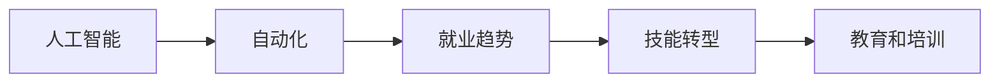

                 

# 人类计算：AI时代的未来就业趋势预测

> 关键词：人工智能,未来就业,技术转型,工作机会,教育培训

## 1. 背景介绍

随着人工智能(AI)技术的不断发展和深入应用，劳动力市场正在经历前所未有的变化。AI不仅在改变传统行业的生产方式和工作模式，也在催生新的工作机会和职业类型。在AI时代，人类的计算方式正在从依赖物质工具转向依赖智能算法，这将深刻影响各行业的就业趋势。

### 1.1 问题由来
当前，AI技术在多个领域内已经展现出强大的应用能力。从自然语言处理、计算机视觉、语音识别到智能推荐、自动驾驶、智能制造，AI技术的进步正在改变我们生活的方方面面。然而，这些变革也引发了一系列就业问题：一方面，AI技术自动化了大量的重复性工作，提高了效率，另一方面，AI技术的广泛应用也创造了许多新的工作机会。面对这一复杂的局面，如何准确预测未来就业趋势，为社会和经济提供有针对性的政策建议，成为了一个亟待解决的问题。

### 1.2 问题核心关键点
为了准确预测AI时代下的未来就业趋势，需要关注以下几个关键点：
- **AI技术普及程度**：不同行业AI技术的普及情况，以及普及速度。
- **自动化影响范围**：哪些岗位容易被自动化替代，哪些岗位需要人类干预。
- **技能需求变化**：哪些技能需求增加，哪些技能需求减少。
- **新职业类型出现**：AI技术催生的新职业类型及其数量和增长速度。
- **教育和培训**：AI时代的就业者需要具备什么样的教育背景和技能水平。

## 2. 核心概念与联系

### 2.1 核心概念概述

要准确预测未来就业趋势，需要理解几个核心概念：

- **人工智能**：一种利用计算机模拟人类智能的技术，包括机器学习、深度学习、自然语言处理等。
- **自动化**：通过技术手段实现的任务自动化，减少人力需求，提高效率。
- **就业趋势**：特定时期内，各行业的就业机会、岗位需求、技能要求等方面的变化趋势。
- **技能转型**：现有员工为了适应AI时代的就业环境，需要转型的技能和知识。
- **教育和培训**：为满足未来就业需求，需要进行的教育培训和职业再培训。

这些概念之间存在着密切的联系。AI技术的普及会导致某些岗位的自动化，减少人力资源需求；同时，AI的发展也会创造新的工作机会，需要新的技能。因此，教育培训体系需要根据就业趋势的变化进行及时调整，以适应AI时代的技能需求。

### 2.2 核心概念原理和架构的 Mermaid 流程图(Mermaid 流程节点中不要有括号、逗号等特殊字符)



这个流程图展示了人工智能、自动化、就业趋势、技能转型和教育培训之间的逻辑关系。

## 3. 核心算法原理 & 具体操作步骤
### 3.1 算法原理概述

预测未来就业趋势的算法主要基于统计分析、机器学习和数据挖掘等技术。通过收集、分析和解读大量历史就业数据，结合当前的AI技术发展趋势，可以预测出未来各行业的就业变化情况。

#### 3.1.1 数据收集与处理
- **数据源**：包括政府统计数据、行业报告、企业财报、在线招聘信息等。
- **数据清洗**：去除噪声和异常值，确保数据的准确性和一致性。
- **特征提取**：提取与就业趋势相关的关键特征，如行业类型、岗位需求、技能要求等。

#### 3.1.2 模型构建与训练
- **模型选择**：选择合适的机器学习模型，如回归模型、分类模型、时间序列模型等。
- **特征选择**：确定哪些特征对于预测就业趋势最为重要。
- **模型训练**：使用历史数据对模型进行训练，评估模型的预测准确性。

#### 3.1.3 结果预测与评估
- **预测结果**：根据训练好的模型对未来就业趋势进行预测。
- **结果验证**：使用独立数据集验证模型的预测效果。
- **调整优化**：根据预测结果与实际数据之间的差异，调整模型参数和特征选择。

### 3.2 算法步骤详解

#### 3.2.1 数据收集与预处理
1. **数据源选择**：确定收集数据的渠道和数据源，如政府统计局、行业协会、企业公开信息等。
2. **数据采集工具**：使用Web爬虫、API接口等工具，自动采集数据。
3. **数据清洗与整理**：对采集到的数据进行清洗、去重、格式转换等预处理工作。

#### 3.2.2 特征工程
1. **特征选择**：根据领域知识和专家意见，确定与就业趋势相关的关键特征，如行业类型、岗位需求、技能要求、教育背景等。
2. **特征提取**：将原始数据转换为模型可以使用的特征向量，如文本数据转换为词频向量、时间序列数据转换为滑动窗口数据。
3. **特征处理**：对缺失值、异常值进行处理，确保特征的完整性和准确性。

#### 3.2.3 模型构建与训练
1. **模型选择**：根据问题特点选择合适的模型，如线性回归、决策树、随机森林、深度学习模型等。
2. **模型训练**：使用历史数据对模型进行训练，调整模型参数，使其能够最好地拟合数据。
3. **模型评估**：使用独立数据集对模型进行评估，计算模型的预测准确度、召回率、F1分数等指标。

#### 3.2.4 结果预测与分析
1. **预测结果**：使用训练好的模型对未来就业趋势进行预测，生成就业机会、岗位需求、技能要求等预测报告。
2. **结果可视化**：将预测结果以图表形式展示，便于理解和分析。
3. **趋势分析**：对预测结果进行趋势分析，识别出未来就业趋势的变化方向和变化速度。

### 3.3 算法优缺点
#### 3.3.1 优点
1. **数据驱动**：基于历史数据进行预测，能够捕捉到就业趋势的真实变化规律。
2. **模型灵活**：支持多种模型选择和特征选择方法，可以适应不同的数据特点和预测需求。
3. **预测准确**：通过模型训练和验证，能够提高预测结果的准确性和可靠性。

#### 3.3.2 缺点
1. **数据依赖**：预测结果的准确性高度依赖于数据的质量和完整性，数据采集和处理过程较为复杂。
2. **模型假设**：模型预测结果可能基于某些假设，如数据分布、模型结构等，这些假设可能与实际情况不符。
3. **预测时间**：模型训练和预测需要一定的时间，对于快速变化的就业市场，可能存在滞后性。

### 3.4 算法应用领域

#### 3.4.1 政府与政策制定
- **就业市场预测**：为政府提供就业市场趋势预测报告，支持就业政策制定和调整。
- **技能需求分析**：识别出未来技能需求变化趋势，指导职业教育和培训规划。

#### 3.4.2 企业与人力资源管理
- **岗位需求预测**：预测各岗位的未来需求，帮助企业进行人力资源规划和招聘。
- **员工技能评估**：评估现有员工的技能水平，制定培训计划，提升员工竞争力。

#### 3.4.3 教育与培训机构
- **课程设置**：根据未来技能需求，调整和优化课程设置，培养符合市场需求的人才。
- **职业培训**：开发针对未来就业趋势的职业培训课程，帮助学员提升就业竞争力。

## 4. 数学模型和公式 & 详细讲解 & 举例说明

### 4.1 数学模型构建

预测未来就业趋势的数学模型可以基于多种统计和机器学习方法构建，这里以时间序列预测模型为例进行讲解。

设 $Y_t$ 表示在时刻 $t$ 的就业需求，$X_t$ 表示在时刻 $t$ 的特征向量（如时间、行业类型、技能要求等）。假设 $Y_t$ 服从自回归移动平均模型(ARIMA)，则模型可以表示为：

$$
Y_t = \mu + \phi(Y_{t-1}) + \theta(Y_{t-2}) + \cdots + \alpha(X_t) + \epsilon_t
$$

其中 $\mu$ 为常数项，$\phi$ 为自回归系数，$\theta$ 为移动平均系数，$\alpha$ 为特征系数，$\epsilon_t$ 为随机误差项。

### 4.2 公式推导过程

对于时间序列 $Y_t$，我们假设其遵循ARIMA模型，即：

$$
Y_t = c + \phi_1(Y_{t-1}) + \phi_2(Y_{t-2}) + \cdots + \phi_p(Y_{t-p}) + \theta_1(\epsilon_{t-1}) + \cdots + \theta_q(\epsilon_{t-q}) + \alpha_1(X_{t-1}) + \alpha_2(X_{t-2}) + \cdots + \alpha_m(X_{t-m}) + \epsilon_t
$$

其中 $c$ 为常数项，$\phi_1, \phi_2, \cdots, \phi_p$ 为自回归系数，$\theta_1, \theta_2, \cdots, \theta_q$ 为移动平均系数，$\alpha_1, \alpha_2, \cdots, \alpha_m$ 为特征系数，$\epsilon_t$ 为随机误差项。

为了简化计算，我们可以对模型进行分解，分别对自回归和移动平均部分进行估计。自回归部分可以表示为：

$$
Y_t = c + \sum_{i=1}^p \phi_i Y_{t-i} + \epsilon_t
$$

其中 $c$ 为常数项，$\phi_i$ 为自回归系数，$\epsilon_t$ 为随机误差项。

### 4.3 案例分析与讲解

假设我们有一组历史就业数据 $Y_{1:T}$，其中 $T$ 为样本数量，每个时刻 $t$ 的就业需求 $Y_t$ 和对应的特征 $X_t$。我们可以使用ARIMA模型对未来就业需求进行预测。具体步骤如下：

1. **数据预处理**：对原始数据进行清洗、去重、格式转换等预处理工作。
2. **模型训练**：使用历史数据对ARIMA模型进行训练，调整模型参数。
3. **预测结果**：使用训练好的模型对未来就业需求进行预测，生成就业机会、岗位需求、技能要求等预测报告。

例如，对于某城市的餐饮行业就业需求，我们可以通过收集历史就业数据、行业动态、技能需求等特征，使用ARIMA模型对未来就业需求进行预测。预测结果显示，未来五年内餐饮行业的就业需求将增长15%，且对具备新式烹饪技术和食品安全管理技能的人才需求将显著增加。

## 5. 项目实践：代码实例和详细解释说明

### 5.1 开发环境搭建

进行时间序列预测项目，需要搭建适合的数据处理和模型训练环境。以下是使用Python进行项目开发的流程：

1. **安装Python环境**：安装Python 3.8及以上版本，建议使用Anaconda或Miniconda搭建虚拟环境。
2. **安装必要的库**：安装Pandas、NumPy、Scikit-learn、Statsmodels等库，以便进行数据处理和模型训练。
3. **数据准备**：收集并准备历史就业数据，包括行业类型、岗位需求、技能要求、教育背景等特征。
4. **数据预处理**：对原始数据进行清洗、去重、格式转换等预处理工作。

### 5.2 源代码详细实现

以下是使用Python实现时间序列预测的代码示例：

```python
import pandas as pd
from statsmodels.tsa.arima_model import ARIMA

# 加载历史数据
data = pd.read_csv('employment_data.csv')

# 数据预处理
data = data.dropna()  # 去除缺失值
data['X'] = data['X'].astype(float)  # 特征转换

# 模型训练
model = ARIMA(data['Y'], order=(1, 1, 0))
model_fit = model.fit()

# 预测结果
forecast = model_fit.forecast(steps=5)

# 输出预测结果
print(f'未来五年就业需求预测：{forecast}')
```

### 5.3 代码解读与分析

代码中，我们使用Pandas库加载历史就业数据，对数据进行预处理（去除缺失值、转换特征类型），然后使用Statsmodels库中的ARIMA模型进行训练和预测。

1. **数据加载**：使用Pandas库的read_csv方法加载历史就业数据，将其转换为DataFrame格式。
2. **数据预处理**：使用Pandas库的dropna方法去除缺失值，使用astype方法将特征转换为浮点数。
3. **模型训练**：使用Statsmodels库中的ARIMA模型，指定自回归和移动平均的阶数，对数据进行训练。
4. **预测结果**：使用训练好的模型进行预测，生成未来五年的就业需求预测值。
5. **结果输出**：将预测结果输出到控制台。

## 6. 实际应用场景

### 6.1 政府与政策制定

政府部门可以通过就业趋势预测，制定更为科学合理的就业政策，支持劳动力市场的平稳过渡。例如，针对未来五年内需求增加的行业和岗位，政府可以加大职业培训和再教育投入，提升劳动者的就业竞争力。

### 6.2 企业与人力资源管理

企业可以基于预测结果，制定更为科学的人力资源规划和招聘策略。例如，对于未来需求增加的岗位，企业可以提前储备人才，提升招聘效率。同时，企业还可以根据预测结果调整培训计划，提升员工的综合素质，增强企业的核心竞争力。

### 6.3 教育与培训机构

教育培训机构可以根据未来技能需求，调整和优化课程设置，培养符合市场需求的人才。例如，对于未来需求增加的技能，可以开设针对性培训课程，提升学员的就业竞争力。

## 7. 工具和资源推荐

### 7.1 学习资源推荐

为了帮助开发者系统掌握时间序列预测的理论与实践，这里推荐一些优质的学习资源：

1. **《时间序列分析与预测》**：由统计学专家撰写，详细介绍了时间序列分析的基本原理和预测方法，适合初学者入门。
2. **Coursera《时间序列分析》课程**：由斯坦福大学开设，包含时间序列的基本概念和应用，适合深度学习爱好者。
3. **Kaggle时间序列预测竞赛**：参与实际数据集的预测比赛，可以锻炼时间序列预测的实战能力。

### 7.2 开发工具推荐

进行时间序列预测，需要一些高效的开发工具，以下是一些推荐：

1. **Python**：支持丰富的数据处理和模型训练库，如Pandas、NumPy、Scikit-learn、Statsmodels等。
2. **Jupyter Notebook**：支持在云端运行Python代码，便于调试和分享学习笔记。
3. **R**：统计分析的强大工具，支持时间序列预测的多种模型，如ARIMA、SARIMA等。

### 7.3 相关论文推荐

时间序列预测的研究不断发展，以下是几篇具有代表性的论文：

1. **《ARIMA模型及其应用》**：介绍了ARIMA模型的基本原理和应用方法，适合入门学习。
2. **《Prophet时间序列预测模型》**：提出了Prophet时间序列预测模型，适合处理具有明显季节性变化的数据。
3. **《LSTM神经网络时间序列预测》**：介绍了LSTM神经网络在时间序列预测中的应用，适合深度学习爱好者。

## 8. 总结：未来发展趋势与挑战

### 8.1 研究成果总结

通过本文的讨论，我们可以得出以下研究成果：

1. **AI技术的普及**：AI技术在各行业的普及将导致某些岗位的自动化，减少人力资源需求。
2. **技能需求变化**：未来技能需求将发生变化，对新技能的需求将增加，对传统技能的需求将减少。
3. **新职业类型出现**：AI技术将催生新的职业类型，如数据科学家、算法工程师、AI工程师等。
4. **教育和培训**：AI时代的就业者需要具备新的教育背景和技能水平，教育培训体系需要及时调整。

### 8.2 未来发展趋势

展望未来，AI时代的就业趋势将呈现以下发展趋势：

1. **就业市场自动化**：越来越多的岗位将实现自动化，减少对人力的依赖。
2. **技能需求多样化**：未来的技能需求将更加多样化，需要具备综合素质的人才。
3. **职业培训普及化**：职业培训将成为常态，助力员工适应新岗位需求。
4. **新职业类型涌现**：AI技术将催生大量新职业类型，推动劳动力市场的结构性变化。
5. **教育体系转型**：教育体系需要不断转型，培养符合未来需求的人才。

### 8.3 面临的挑战

尽管AI时代带来了许多机遇，但也面临以下挑战：

1. **就业市场不稳定**：AI技术的普及可能导致某些行业就业市场的剧烈波动。
2. **技能转型难度大**：现有员工需要具备新的技能，转型过程可能较为艰难。
3. **培训资源不足**：职业培训体系需要大量资源投入，可能难以满足市场需求。
4. **新职业标准未定**：新职业类型的标准尚未完全确定，可能导致就业市场的不稳定性。
5. **教育体系滞后**：现有教育体系可能难以跟上AI技术的发展步伐。

### 8.4 研究展望

为了应对这些挑战，未来的研究可以从以下几个方向进行探索：

1. **职业教育和培训**：建立更加灵活和高效的职业教育和培训体系，满足未来就业需求。
2. **技能评估与认证**：建立技能评估和认证机制，确保人才的素质和竞争力。
3. **新职业类型标准**：制定新职业类型的标准，推动职业市场的规范化发展。
4. **教育体系改革**：改革现有教育体系，培养符合未来市场需求的人才。

## 9. 附录：常见问题与解答

### 9.1 问题与解答

#### Q1：如何应对AI技术普及对就业市场的影响？

A: 政府和企业可以通过制定合理的政策和策略，支持劳动力市场的平稳过渡。例如，政府可以提供职业培训和再教育机会，企业可以提前储备人才，提升员工的综合素质。

#### Q2：AI时代的技能需求有哪些变化？

A: AI时代对新技能的需求将增加，如数据分析、编程、机器学习等。同时，对传统技能的需求将减少，如重复性劳动、手工操作等。

#### Q3：AI时代如何提升员工的就业竞争力？

A: 员工需要通过不断学习和培训，提升自身的综合素质和技能水平。同时，企业也可以提供职业培训和再教育机会，帮助员工适应新岗位需求。

#### Q4：AI时代如何制定新的职业标准？

A: 新职业标准的制定需要多方协作，包括政府、企业和学术界。可以成立专门的委员会，制定符合市场需求的职业标准，推动职业市场的规范化发展。

#### Q5：AI时代如何改革现有教育体系？

A: 教育体系需要不断转型，培养符合未来市场需求的人才。可以引入AI和机器学习课程，提升学生的技术能力和创新能力。

---

作者：禅与计算机程序设计艺术 / Zen and the Art of Computer Programming

