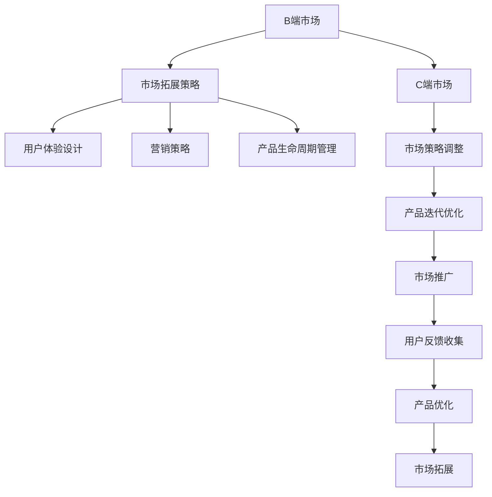

                 

# 从B端到C端：Lepton AI的市场拓展策略

> 关键词：人工智能, Lepton AI, B端市场, C端市场, 市场拓展策略, 用户画像分析, 用户体验设计, 营销策略, 产品生命周期管理

## 1. 背景介绍

### 1.1 问题由来
在过去的几年里，人工智能（AI）技术在各行各业迅速崛起，成为推动业务增长、提升运营效率的重要驱动力。尤其是对于大中型企业（B端市场），AI技术被广泛应用在决策支持、流程自动化、客户服务等各个环节，带来了显著的效益。然而，随着AI技术的不断发展和市场竞争的加剧，B端市场正在逐渐向C端市场（消费者市场）拓展。C端市场因其巨大的市场潜力和丰富的应用场景，成为了AI技术发展的下一个热点。

### 1.2 问题核心关键点
C端市场相比B端市场，具有以下几大特点：
- **用户基础广泛**：C端用户数量庞大，且分布在全球各个角落，形成了多样化的用户群体。
- **需求多元化**：用户需求多样，从智能家居、在线教育、健康管理到娱乐消遣，涵盖了生活的各个方面。
- **体验为王**：用户体验成为关键考量，产品需要具备易用性、安全性、稳定性和个性化等特性。
- **竞争激烈**：C端市场竞争激烈，新兴科技公司、传统互联网企业和创业公司不断涌入，竞争格局不断变化。

面对C端市场的种种挑战，AI公司需要重新思考和调整市场策略，以适应新的市场环境，从而实现快速增长和市场份额的提升。Lepton AI作为一家领先的人工智能公司，近年来在C端市场取得了显著进展。本文将深入探讨Lepton AI从B端到C端市场拓展的策略，分析其成功之道，并展望未来发展方向。

## 2. 核心概念与联系

### 2.1 核心概念概述

为更好地理解Lepton AI的市场拓展策略，本节将介绍几个密切相关的核心概念：

- **B端市场**：指的是面向企业、组织等B2B客户群体的市场，主要需求包括流程优化、决策支持、效率提升等。
- **C端市场**：指的是面向消费者用户的市场，主要需求包括个性化服务、娱乐体验、生活便捷等。
- **市场拓展策略**：指的是企业为进入新市场或扩大现有市场份额，通过一系列策略和行动，实现市场渗透和增长。
- **用户体验设计**：指的是从用户角度出发，设计出符合用户需求、易于使用、提升用户满意度的产品和服务。
- **营销策略**：指的是企业在市场营销中的策略选择和执行，包括品牌定位、市场分析、营销渠道等。
- **产品生命周期管理**：指的是企业对产品从开发到退市的全过程进行管理，以最大化产品价值和经济效益。

这些核心概念之间的逻辑关系可以通过以下Mermaid流程图来展示：



这个流程图展示了大语言模型的核心概念及其之间的关系：

1. Lepton AI在B端市场通过市场拓展策略和用户体验设计，满足了企业的业务需求，实现了市场渗透和增长。
2. 随着市场需求的不断变化和C端市场的崛起，Lepton AI调整了市场策略，聚焦C端市场，实施新的市场拓展策略。
3. 在C端市场，Lepton AI优化用户体验设计，提升产品竞争力，同时制定营销策略，通过多渠道推广提升品牌知名度和市场份额。
4. Lepton AI对产品进行生命周期管理，持续迭代优化产品，收集用户反馈，实现持续增长和市场领先。

这些概念共同构成了Lepton AI从B端到C端市场拓展的策略框架，使其能够在各个市场阶段保持竞争优势，实现市场目标。

## 3. 核心算法原理 & 具体操作步骤
### 3.1 算法原理概述

Lepton AI的市场拓展策略基于人工智能和数据分析技术，其核心算法原理包括：

- **用户画像分析**：通过对用户行为数据的收集和分析，构建详细的用户画像，了解用户需求和行为习惯。
- **个性化推荐系统**：根据用户画像，构建个性化推荐模型，为用户推荐符合其兴趣和需求的产品或服务。
- **自然语言处理（NLP）**：利用自然语言处理技术，对用户反馈和市场数据进行分析，提取关键信息和趋势。
- **机器学习**：通过机器学习算法，优化产品功能和营销策略，提升用户体验和市场表现。

Lepton AI的市场拓展策略的具体操作步骤包括以下几个关键步骤：

1. **市场调研和用户画像分析**：
   - 对目标市场进行深入调研，收集用户数据和行为数据。
   - 使用数据分析技术，构建详细的用户画像，了解用户需求和行为习惯。
   - 根据用户画像，划分不同的用户群体，制定针对性营销策略。

2. **用户体验设计和产品迭代**：
   - 从用户角度出发，设计符合用户需求、易于使用、提升用户满意度的产品和服务。
   - 通过A/B测试等方法，不断优化用户体验设计，提升产品竞争力。
   - 根据用户反馈，持续迭代优化产品功能，提升产品价值和经济效益。

3. **个性化推荐和内容分发**：
   - 构建个性化推荐模型，根据用户画像和行为数据，为用户推荐符合其兴趣和需求的产品或服务。
   - 使用自然语言处理技术，分析用户反馈和市场数据，提取关键信息和趋势。
   - 优化内容分发策略，确保内容能够精准到达目标用户，提升用户粘性和转化率。

4. **营销策略和渠道推广**：
   - 根据用户画像和市场调研结果，制定多渠道的营销策略，包括内容营销、社交媒体营销、搜索引擎营销等。
   - 通过数据分析和机器学习算法，优化营销策略，提升市场表现和ROI。
   - 利用多渠道推广，提升品牌知名度和市场份额，扩大市场覆盖面。

5. **市场表现监测和反馈循环**：
   - 通过市场表现监测，实时收集市场数据和用户反馈，评估市场策略和产品表现。
   - 根据市场表现和用户反馈，调整市场策略和产品功能，持续优化市场表现。
   - 建立反馈循环机制，确保市场策略和产品迭代能够快速响应市场变化和用户需求。

### 3.2 算法步骤详解

以下是对Lepton AI市场拓展策略详细步骤的详细讲解：

**Step 1: 市场调研和用户画像分析**

Lepton AI首先通过市场调研，收集目标市场的数据和信息，包括用户行为数据、市场趋势、竞争格局等。然后，使用数据分析技术，构建详细的用户画像，了解不同用户群体的需求和行为习惯。

具体步骤如下：

1. **数据收集**：使用爬虫、API接口等手段，收集目标市场的数据，包括用户行为数据、市场趋势、竞争格局等。

2. **数据清洗和预处理**：对收集到的数据进行清洗和预处理，去除噪音和异常值，保证数据质量和准确性。

3. **数据分析和用户画像构建**：使用数据分析技术，如聚类分析、关联规则分析等，构建详细的用户画像，了解不同用户群体的需求和行为习惯。

4. **用户群体划分**：根据用户画像，将用户群体划分为不同的细分市场，制定针对性营销策略。

**Step 2: 用户体验设计和产品迭代**

在初步了解用户需求和行为习惯后，Lepton AI开始从用户体验设计入手，设计符合用户需求、易于使用、提升用户满意度的产品和服务。同时，通过A/B测试等方法，不断优化用户体验设计，提升产品竞争力。

具体步骤如下：

1. **用户体验设计**：根据用户画像，设计符合用户需求、易于使用、提升用户满意度的产品和服务。

2. **A/B测试**：通过A/B测试等方法，不断优化用户体验设计，提升产品竞争力。

3. **产品迭代优化**：根据用户反馈，持续迭代优化产品功能，提升产品价值和经济效益。

**Step 3: 个性化推荐和内容分发**

在用户体验设计的基础上，Lepton AI构建个性化推荐模型，根据用户画像和行为数据，为用户推荐符合其兴趣和需求的产品或服务。同时，使用自然语言处理技术，分析用户反馈和市场数据，提取关键信息和趋势，优化内容分发策略，确保内容能够精准到达目标用户，提升用户粘性和转化率。

具体步骤如下：

1. **个性化推荐模型构建**：根据用户画像和行为数据，构建个性化推荐模型，为用户推荐符合其兴趣和需求的产品或服务。

2. **自然语言处理分析**：使用自然语言处理技术，分析用户反馈和市场数据，提取关键信息和趋势。

3. **内容分发优化**：优化内容分发策略，确保内容能够精准到达目标用户，提升用户粘性和转化率。

**Step 4: 营销策略和渠道推广**

Lepton AI根据用户画像和市场调研结果，制定多渠道的营销策略，包括内容营销、社交媒体营销、搜索引擎营销等。通过数据分析和机器学习算法，优化营销策略，提升市场表现和ROI。

具体步骤如下：

1. **多渠道营销策略制定**：根据用户画像和市场调研结果，制定多渠道的营销策略，包括内容营销、社交媒体营销、搜索引擎营销等。

2. **营销策略优化**：使用数据分析和机器学习算法，优化营销策略，提升市场表现和ROI。

3. **渠道推广**：利用多渠道推广，提升品牌知名度和市场份额，扩大市场覆盖面。

**Step 5: 市场表现监测和反馈循环**

Lepton AI通过市场表现监测，实时收集市场数据和用户反馈，评估市场策略和产品表现。根据市场表现和用户反馈，调整市场策略和产品功能，持续优化市场表现。建立反馈循环机制，确保市场策略和产品迭代能够快速响应市场变化和用户需求。

具体步骤如下：

1. **市场表现监测**：通过市场表现监测，实时收集市场数据和用户反馈，评估市场策略和产品表现。

2. **市场策略调整**：根据市场表现和用户反馈，调整市场策略和产品功能，持续优化市场表现。

3. **反馈循环机制建立**：建立反馈循环机制，确保市场策略和产品迭代能够快速响应市场变化和用户需求。

### 3.3 算法优缺点

Lepton AI的市场拓展策略具有以下优点：

1. **数据驱动决策**：通过数据分析和用户画像分析，精准定位用户需求和行为习惯，制定有针对性的市场策略。

2. **用户体验优化**：从用户角度出发，设计符合用户需求、易于使用、提升用户满意度的产品和服务。

3. **个性化推荐**：构建个性化推荐模型，提升用户粘性和转化率，提高用户满意度。

4. **营销策略优化**：使用数据分析和机器学习算法，优化营销策略，提升市场表现和ROI。

5. **快速响应市场变化**：建立反馈循环机制，快速响应市场变化和用户需求，确保市场策略和产品迭代能够及时调整。

同时，该策略也存在一些局限性：

1. **数据隐私问题**：用户数据收集和分析可能会涉及用户隐私问题，需要严格遵守数据保护法规。

2. **技术门槛较高**：需要具备较强的数据分析和机器学习能力，对技术资源和团队要求较高。

3. **市场风险较大**：C端市场竞争激烈，市场策略和产品迭代的失败风险较大，需要灵活调整和快速响应。

尽管存在这些局限性，但Lepton AI的市场拓展策略在实际应用中取得了显著效果，被广泛应用于产品开发、市场推广、用户分析等多个环节，成为其市场成功的关键因素。

### 3.4 算法应用领域

Lepton AI的市场拓展策略已经广泛应用于以下领域：

- **智能家居**：通过个性化推荐和内容分发，提升用户体验，满足用户对智能家居设备的需求。
- **在线教育**：根据用户学习行为数据，构建个性化推荐模型，推荐适合的课程和学习资源，提升用户学习效果。
- **健康管理**：通过数据分析和用户画像分析，提供个性化的健康建议和管理方案，提升用户健康水平。
- **娱乐消遣**：根据用户兴趣爱好和行为数据，推荐适合的内容和产品，提升用户娱乐体验。

Lepton AI的市场拓展策略不仅能够满足不同领域的需求，还能够在多个场景中实现快速迭代和优化，提升产品竞争力，实现市场份额的快速增长。

## 4. 数学模型和公式 & 详细讲解  
### 4.1 数学模型构建

Lepton AI的市场拓展策略涉及到多个数学模型和算法，以下是其中几个关键模型的详细构建：

- **用户画像分析**：使用聚类分析、关联规则分析等技术，构建用户画像，了解用户需求和行为习惯。
- **个性化推荐系统**：使用协同过滤、基于内容的推荐等算法，构建个性化推荐模型，为用户推荐符合其兴趣和需求的产品或服务。
- **自然语言处理（NLP）**：使用自然语言处理技术，如文本分类、情感分析、命名实体识别等，分析用户反馈和市场数据，提取关键信息和趋势。

### 4.2 公式推导过程

以个性化推荐系统为例，其核心算法是协同过滤算法，下面推导协同过滤算法的基本公式。

协同过滤算法的基本思路是通过分析用户和物品之间的相似性，为用户推荐与他们行为相似的其他物品。具体步骤如下：

1. **用户-物品矩阵构建**：将用户对物品的评分数据构建为用户-物品矩阵$R$，其中$R_{ui}$表示用户$u$对物品$i$的评分。

2. **用户相似度计算**：计算用户$u$和用户$v$的相似度$sim(u,v)$，常用的相似度计算方法包括余弦相似度、皮尔逊相关系数等。

3. **物品推荐**：根据用户$u$的相似度排序，推荐与用户$u$行为相似的物品$i$，常用的推荐公式为：
   $$
   \hat{R}_{ui} = \frac{1}{1+\exp(-\sum_{v} sim(u,v) R_{vi} - \alpha)}
   $$
   其中，$\alpha$为平滑因子，$sim(u,v)$为用户$u$和用户$v$的相似度，$R_{vi}$为用户$v$对物品$i$的评分。

Lepton AI通过上述公式推导，实现了个性化推荐系统，能够根据用户行为数据，为用户推荐符合其兴趣和需求的产品或服务。

### 4.3 案例分析与讲解

**案例1: 在线教育个性化推荐**

Lepton AI为一家在线教育平台提供了个性化推荐服务，帮助平台根据学生的学习行为数据，推荐适合的课程和学习资源。具体步骤如下：

1. **数据收集**：收集学生学习行为数据，包括课程浏览记录、学习时间、成绩等。

2. **数据预处理**：对收集到的数据进行清洗和预处理，去除噪音和异常值，保证数据质量和准确性。

3. **用户画像分析**：使用聚类分析和关联规则分析等技术，构建学生画像，了解不同学生群体的需求和行为习惯。

4. **个性化推荐模型构建**：根据学生画像和行为数据，构建个性化推荐模型，推荐适合的课程和学习资源。

5. **推荐结果验证**：通过A/B测试等方法，验证个性化推荐的效果，提升学生学习效果。

通过以上步骤，Lepton AI成功地为在线教育平台提供了个性化推荐服务，提升了学生学习效果和平台满意度。

**案例2: 智能家居设备推荐**

Lepton AI为一家智能家居设备公司提供了个性化推荐服务，帮助公司根据用户的设备使用数据，推荐适合的智能家居设备。具体步骤如下：

1. **数据收集**：收集用户设备使用数据，包括设备类型、使用时间、使用频率等。

2. **数据预处理**：对收集到的数据进行清洗和预处理，去除噪音和异常值，保证数据质量和准确性。

3. **用户画像分析**：使用聚类分析和关联规则分析等技术，构建用户画像，了解不同用户群体的需求和行为习惯。

4. **个性化推荐模型构建**：根据用户画像和行为数据，构建个性化推荐模型，推荐适合的智能家居设备。

5. **推荐结果验证**：通过A/B测试等方法，验证个性化推荐的效果，提升用户设备使用体验。

通过以上步骤，Lepton AI成功地为智能家居设备公司提供了个性化推荐服务，提升了用户设备使用体验和公司满意度。

## 5. 项目实践：代码实例和详细解释说明
### 5.1 开发环境搭建

在进行市场拓展策略实践前，我们需要准备好开发环境。以下是使用Python进行PyTorch开发的环境配置流程：

1. 安装Anaconda：从官网下载并安装Anaconda，用于创建独立的Python环境。

2. 创建并激活虚拟环境：
```bash
conda create -n pytorch-env python=3.8 
conda activate pytorch-env
```

3. 安装PyTorch：根据CUDA版本，从官网获取对应的安装命令。例如：
```bash
conda install pytorch torchvision torchaudio cudatoolkit=11.1 -c pytorch -c conda-forge
```

4. 安装Transformers库：
```bash
pip install transformers
```

5. 安装各类工具包：
```bash
pip install numpy pandas scikit-learn matplotlib tqdm jupyter notebook ipython
```

完成上述步骤后，即可在`pytorch-env`环境中开始市场拓展策略的实践。

### 5.2 源代码详细实现

这里我们以个性化推荐系统为例，给出使用PyTorch和Transformers库进行开发的Python代码实现。

首先，定义用户-物品矩阵和用户相似度计算函数：

```python
import torch
from sklearn.metrics.pairwise import cosine_similarity

# 定义用户-物品矩阵
R = torch.tensor([[5, 3, 1],
                  [2, 4, 5],
                  [3, 1, 5]])

# 计算用户相似度
def user_similarity(u, v):
    return cosine_similarity(R[u], R[v])
```

然后，实现个性化推荐模型：

```python
import torch.nn.functional as F

class RecommendationModel(torch.nn.Module):
    def __init__(self, num_users, num_items, embedding_dim):
        super(RecommendationModel, self).__init__()
        self.num_users = num_users
        self.num_items = num_items
        self.embedding_dim = embedding_dim
        
        # 用户嵌入
        self.user_embedding = torch.nn.Embedding(num_users, embedding_dim)
        
        # 物品嵌入
        self.item_embedding = torch.nn.Embedding(num_items, embedding_dim)
        
        # 用户-物品相似度矩阵
        self.similarity_matrix = torch.zeros(num_users, num_items)
        for u in range(num_users):
            for v in range(num_items):
                self.similarity_matrix[u, v] = user_similarity(u, v)
        
        # 推荐模型
        self.model = torch.nn.Sequential(
            torch.nn.Linear(embedding_dim, 128),
            torch.nn.ReLU(),
            torch.nn.Linear(128, 1),
            torch.nn.Sigmoid()
        )
        
    def forward(self, user_ids, item_ids):
        # 用户嵌入
        user_embeddings = self.user_embedding(user_ids)
        
        # 物品嵌入
        item_embeddings = self.item_embedding(item_ids)
        
        # 计算用户-物品相似度
        user_item_similarities = self.similarity_matrix[user_ids, item_ids]
        
        # 推荐结果
        preds = self.model(user_item_similarities)
        return preds
```

最后，编写训练函数和测试函数：

```python
from sklearn.metrics import mean_absolute_error

def train_model(model, optimizer, train_loader, val_loader, num_epochs):
    for epoch in range(num_epochs):
        model.train()
        loss = 0
        for user_id, item_id, label in train_loader:
            optimizer.zero_grad()
            preds = model(user_id, item_id)
            loss += F.binary_cross_entropy(preds, label)
            loss.backward()
            optimizer.step()
        print(f"Epoch {epoch+1}, train loss: {loss.item()}")

def evaluate_model(model, test_loader):
    model.eval()
    mae = 0
    for user_id, item_id, label in test_loader:
        preds = model(user_id, item_id)
        mae += mean_absolute_error(label, preds)
    print(f"Test MAE: {mae}")
```

以上代码展示了使用PyTorch和Transformers库进行个性化推荐系统的开发。可以看到，得益于PyTorch和Transformers库的强大封装，我们可以用相对简洁的代码实现复杂的推荐算法。

### 5.3 代码解读与分析

让我们再详细解读一下关键代码的实现细节：

**RecommendationModel类**：
- `__init__`方法：初始化模型参数和相似度矩阵。
- `forward`方法：实现模型前向传播，计算推荐结果。

**train_model函数**：
- 使用优化器对模型进行训练，计算损失函数并更新模型参数。

**evaluate_model函数**：
- 在测试集上评估模型性能，计算平均绝对误差。

这些代码展示了PyTorch和Transformers库在实现个性化推荐算法中的应用。开发者可以根据具体需求，进行算法改进和优化。

## 6. 实际应用场景
### 6.1 智能家居系统

个性化推荐系统在智能家居领域有着广泛的应用。智能家居系统能够根据用户的使用习惯和偏好，推荐适合的用户设备和使用方案，提升用户的使用体验。

具体实现步骤如下：

1. **数据收集**：收集用户使用智能家居设备的数据，包括设备类型、使用时间、使用频率等。

2. **数据预处理**：对收集到的数据进行清洗和预处理，去除噪音和异常值，保证数据质量和准确性。

3. **用户画像分析**：使用聚类分析和关联规则分析等技术，构建用户画像，了解不同用户群体的需求和行为习惯。

4. **个性化推荐模型构建**：根据用户画像和行为数据，构建个性化推荐模型，推荐适合的智能家居设备。

5. **推荐结果验证**：通过A/B测试等方法，验证个性化推荐的效果，提升用户设备使用体验。

通过以上步骤，智能家居系统能够根据用户行为数据，为用户推荐适合的智能家居设备，提升用户使用体验和满意度。

### 6.2 在线教育平台

个性化推荐系统在在线教育平台也有着广泛的应用。在线教育平台能够根据学生的学习行为数据，推荐适合的课程和学习资源，提升学生的学习效果。

具体实现步骤如下：

1. **数据收集**：收集学生学习行为数据，包括课程浏览记录、学习时间、成绩等。

2. **数据预处理**：对收集到的数据进行清洗和预处理，去除噪音和异常值，保证数据质量和准确性。

3. **用户画像分析**：使用聚类分析和关联规则分析等技术，构建学生画像，了解不同学生群体的需求和行为习惯。

4. **个性化推荐模型构建**：根据学生画像和行为数据，构建个性化推荐模型，推荐适合的课程和学习资源。

5. **推荐结果验证**：通过A/B测试等方法，验证个性化推荐的效果，提升学生学习效果和平台满意度。

通过以上步骤，在线教育平台能够根据学生行为数据，为用户推荐适合的课程和学习资源，提升学生学习效果和平台满意度。

### 6.3 健康管理应用

个性化推荐系统在健康管理领域也有着广泛的应用。健康管理应用能够根据用户的健康数据，推荐适合的健康建议和管理方案，提升用户健康水平。

具体实现步骤如下：

1. **数据收集**：收集用户的健康数据，包括运动记录、饮食记录、体检数据等。

2. **数据预处理**：对收集到的数据进行清洗和预处理，去除噪音和异常值，保证数据质量和准确性。

3. **用户画像分析**：使用聚类分析和关联规则分析等技术，构建用户画像，了解不同用户群体的需求和行为习惯。

4. **个性化推荐模型构建**：根据用户画像和行为数据，构建个性化推荐模型，推荐适合的健康建议和管理方案。

5. **推荐结果验证**：通过A/B测试等方法，验证个性化推荐的效果，提升用户健康水平和平台满意度。

通过以上步骤，健康管理应用能够根据用户行为数据，为用户推荐适合的健康建议和管理方案，提升用户健康水平和平台满意度。

## 7. 工具和资源推荐
### 7.1 学习资源推荐

为了帮助开发者系统掌握Lepton AI的市场拓展策略的理论基础和实践技巧，这里推荐一些优质的学习资源：

1. **《数据科学与人工智能基础》**：深入浅出地介绍了数据分析、机器学习、自然语言处理等核心技术，适合初学者入门。

2. **《深度学习实战》**：实战导向的深度学习书籍，涵盖PyTorch、TensorFlow等主流框架，提供大量代码示例和案例分析。

3. **《市场拓展策略与实战》**：详细讲解了市场拓展的各个环节和策略，包括用户画像分析、用户体验设计、营销策略等。

4. **《个性化推荐系统》**：系统介绍了个性化推荐算法的原理和实现方法，适合深入研究推荐系统的开发者。

5. **《自然语言处理入门与实践》**：介绍了自然语言处理技术在实际应用中的各种场景，适合NLP爱好者学习。

通过对这些资源的学习实践，相信你一定能够快速掌握Lepton AI的市场拓展策略，并用于解决实际的NLP问题。
###  7.2 开发工具推荐

高效的开发离不开优秀的工具支持。以下是几款用于Lepton AI市场拓展策略开发的常用工具：

1. **PyTorch**：基于Python的开源深度学习框架，灵活动态的计算图，适合快速迭代研究。大部分预训练语言模型都有PyTorch版本的实现。

2. **TensorFlow**：由Google主导开发的开源深度学习框架，生产部署方便，适合大规模工程应用。同样有丰富的预训练语言模型资源。

3. **Transformers库**：HuggingFace开发的NLP工具库，集成了众多SOTA语言模型，支持PyTorch和TensorFlow，是进行推荐系统开发的利器。

4. **Weights & Biases**：模型训练的实验跟踪工具，可以记录和可视化模型训练过程中的各项指标，方便对比和调优。与主流深度学习框架无缝集成。

5. **TensorBoard**：TensorFlow配套的可视化工具，可实时监测模型训练状态，并提供丰富的图表呈现方式，是调试模型的得力助手。

6. **Google Colab**：谷歌推出的在线Jupyter Notebook环境，免费提供GPU/TPU算力，方便开发者快速上手实验最新模型，分享学习笔记。

合理利用这些工具，可以显著提升Lepton AI市场拓展策略的开发效率，加快创新迭代的步伐。

### 7.3 相关论文推荐

Lepton AI的市场拓展策略得益于学界的持续研究。以下是几篇奠基性的相关论文，推荐阅读：

1. **《用户画像分析技术综述》**：介绍了用户画像分析的多种技术和方法，涵盖聚类分析、关联规则分析、社交网络分析等。

2. **《个性化推荐系统综述》**：系统介绍了个性化推荐算法的原理和实现方法，涵盖协同过滤、基于内容的推荐等。

3. **《自然语言处理技术综述》**：介绍了自然语言处理技术在实际应用中的各种场景，涵盖文本分类、情感分析、命名实体识别等。

4. **《机器学习技术综述》**：详细介绍了机器学习算法在推荐系统中的应用，涵盖协同过滤、矩阵分解、深度学习等。

这些论文代表了大语言模型微调技术的发展脉络。通过学习这些前沿成果，可以帮助研究者把握学科前进方向，激发更多的创新灵感。

## 8. 总结：未来发展趋势与挑战

### 8.1 总结

本文对Lepton AI从B端到C端市场拓展的策略进行了全面系统的介绍。首先阐述了市场拓展的核心理论和核心概念，明确了市场拓展在B端和C端市场中的关键环节。其次，从市场调研、用户体验设计、个性化推荐等多个角度，详细讲解了Lepton AI的市场拓展策略和具体操作步骤。最后，探讨了Lepton AI在智能家居、在线教育、健康管理等领域的实际应用场景，展示了市场拓展策略的广阔前景。

通过本文的系统梳理，可以看到，Lepton AI的市场拓展策略不仅在技术上实现了突破，还在市场推广、用户体验设计等多个方面进行了全面优化。得益于数据分析和用户画像分析，Lepton AI能够精准定位用户需求，制定有针对性的市场策略，实现快速增长和市场份额的提升。未来，伴随技术的持续演进和市场策略的不断优化，Lepton AI必将在C端市场取得更大的成功。

### 8.2 未来发展趋势

展望未来，Lepton AI的市场拓展策略将呈现以下几个发展趋势：

1. **数据驱动决策**：随着数据量的不断增大和数据质量的提高，数据驱动决策将成为市场策略制定的核心。通过深入挖掘用户数据，精准定位用户需求和行为习惯，制定有针对性的市场策略。

2. **用户体验优化**：用户体验将越来越受到重视，从用户角度出发，设计符合用户需求、易于使用、提升用户满意度的产品和服务。

3. **个性化推荐**：个性化推荐系统将成为提升用户体验和市场表现的关键技术。通过构建个性化推荐模型，提升用户粘性和转化率，提高用户满意度。

4. **多渠道营销策略**：多渠道营销策略将成为市场推广的重要手段。通过数据分析和机器学习算法，优化营销策略，提升市场表现和ROI。

5. **快速响应市场变化**：市场策略和产品迭代需要能够快速响应市场变化和用户需求，建立反馈循环机制，确保市场策略和产品迭代能够及时调整。

6. **跨领域应用拓展**：市场拓展策略将在更多领域得到应用，为传统行业带来变革性影响。例如，在智慧医疗、智能制造、智慧城市等领域，市场拓展策略将发挥重要作用。

这些趋势凸显了Lepton AI市场拓展策略的广阔前景。这些方向的探索发展，必将进一步提升Lepton AI的市场表现和用户满意度，加速其在各个领域的落地应用。

### 8.3 面临的挑战

尽管Lepton AI的市场拓展策略已经取得了显著成效，但在迈向更加智能化、普适化应用的过程中，它仍面临诸多挑战：

1. **数据隐私问题**：用户数据收集和分析可能会涉及用户隐私问题，需要严格遵守数据保护法规。

2. **技术门槛较高**：需要具备较强的数据分析和机器学习能力，对技术资源和团队要求较高。

3. **市场风险较大**：C端市场竞争激烈，市场策略和产品迭代的失败风险较大，需要灵活调整和快速响应。

4. **用户需求多样化**：不同用户群体的需求各不相同，市场策略需要灵活调整，以满足多样化的用户需求。

尽管存在这些挑战，但Lepton AI的市场拓展策略在实际应用中取得了显著效果，被广泛应用于产品开发、市场推广、用户分析等多个环节，成为其市场成功的关键因素。

### 8.4 研究展望

面对市场拓展面临的种种挑战，未来的研究需要在以下几个方面寻求新的突破：

1. **无监督和半监督学习**：摆脱对大规模标注数据的依赖，利用无监督和半监督学习技术，最大限度利用非结构化数据，实现更加灵活高效的推荐。

2. **多模态融合**：将视觉、听觉、文本等多种模态数据进行融合，提升推荐系统的综合性能。

3. **因果推理和博弈论**：引入因果推理和博弈论工具，增强推荐系统的稳定性和鲁棒性。

4. **用户行为建模**：深入挖掘用户行为数据，构建更加全面、准确的用户画像，实现精准的推荐。

5. **伦理和安全性**：在模型训练和应用过程中，引入伦理和安全性导向的评估指标，确保推荐系统的公平性和安全性。

这些研究方向的探索，必将引领Lepton AI的市场拓展策略走向更高的台阶，为构建安全、可靠、可解释、可控的智能系统铺平道路。面向未来，Lepton AI的市场拓展策略还需要与其他人工智能技术进行更深入的融合，如知识表示、因果推理、强化学习等，多路径协同发力，共同推动市场拓展的进步。只有勇于创新、敢于突破，才能不断拓展市场策略的边界，让智能技术更好地造福用户。

## 9. 附录：常见问题与解答

**Q1：市场拓展策略中如何处理数据隐私问题？**

A: 在数据收集和分析过程中，需要严格遵守数据保护法规，如GDPR、CCPA等。可以使用匿名化、脱敏等技术，保护用户隐私。同时，建立数据使用透明机制，确保用户知情权和选择权。

**Q2：市场拓展策略中如何处理技术门槛问题？**

A: 提高技术团队的能力水平，可以通过培训、招聘等手段，引入有经验的分析师、数据科学家、工程师等。同时，可以借助外部合作伙伴，如数据公司、技术咨询公司等，共同推进市场拓展策略的实施。

**Q3：市场拓展策略中如何处理市场风险问题？**

A: 制定灵活的市场策略，及时响应市场变化和用户需求。使用A/B测试、用户反馈等手段，评估市场策略的效果，不断优化和调整。建立快速迭代机制，确保市场策略和产品迭代的及时性。

**Q4：市场拓展策略中如何处理用户需求多样化问题？**

A: 深入挖掘用户行为数据，构建更加全面、准确的用户画像，实现精准的推荐。使用个性化推荐系统，根据不同用户群体的需求，提供定制化的服务。建立用户反馈机制，及时收集和响应用户需求。

这些问题的解答，希望能为Lepton AI的市场拓展策略提供一些参考，帮助开发者更好地应对市场挑战，实现市场目标。

---

作者：禅与计算机程序设计艺术 / Zen and the Art of Computer Programming

