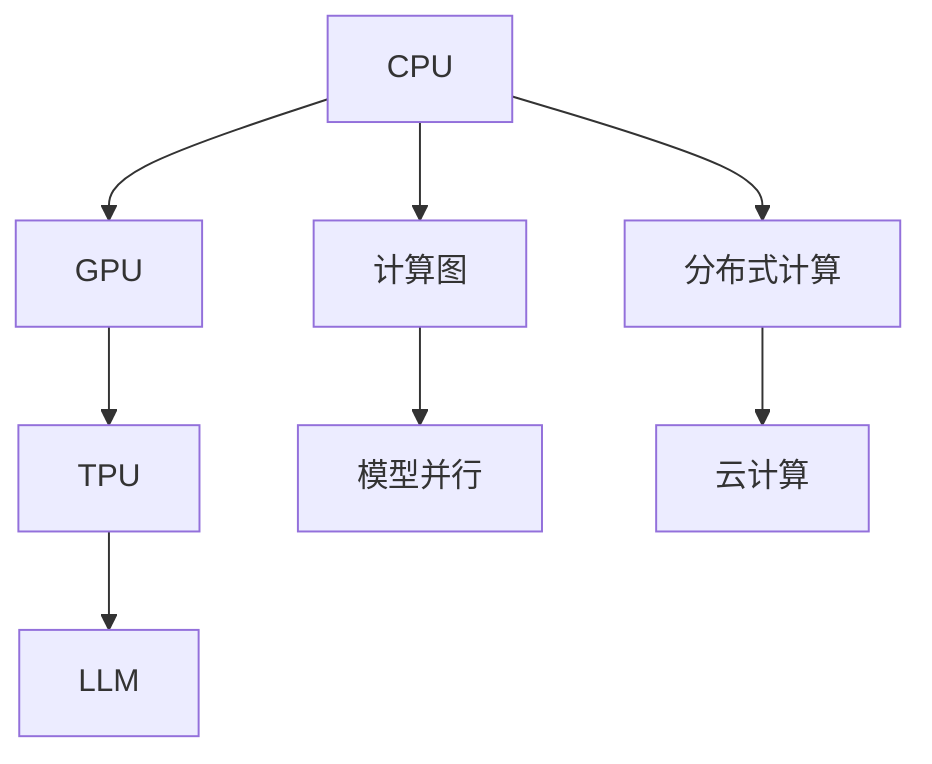
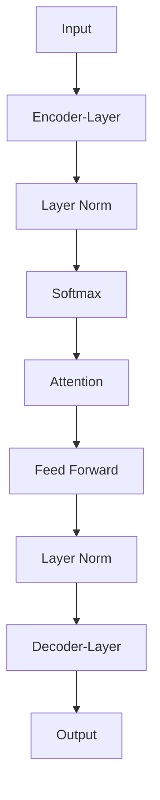

                 

# 从CPU到LLM：计算模式的演进历程

> 关键词：计算模式, CPU, GPU, TPU, AI加速, 神经网络, 大语言模型, 计算图, 模型并行, 分布式计算, 模型压缩

## 1. 背景介绍

### 1.1 问题由来

计算模式的演进是计算机科学史上的重要篇章。从早期的真空管计算机到现代的高性能计算架构，计算模式经历了巨大的变化。这种变化不仅体现在硬件设计和软件实现上，也深刻影响了计算机的应用领域和用户体验。本文章将从CPU计算模式出发，探讨其向GPU、TPU、大语言模型(LLM)的演进过程，揭示这些变化背后的技术逻辑和应用前景。

### 1.2 问题核心关键点

在计算模式的演进过程中，关键的技术演变和应用趋势包括：

1. **CPU计算模式的局限**：早期的计算机主要依赖于CPU进行计算，然而随着计算需求的增加，CPU的性能瓶颈逐渐显现。

2. **GPU的兴起**：随着图形处理需求的增加，GPU开始成为高性能计算的重要工具，并逐步应用于科学计算、人工智能等领域。

3. **TPU的诞生**：Google推出的TPU为深度学习模型的训练和推理提供了专门的加速硬件，显著提升了模型的计算效率。

4. **大语言模型的崛起**：基于神经网络的大语言模型，如BERT、GPT系列，通过预训练和微调，展示了强大的语言理解和生成能力，成为当前计算模式演进的重要代表。

5. **计算图和模型并行**：计算图和模型并行技术的发展，使得大语言模型的训练和推理变得更加高效和灵活。

6. **分布式计算和云计算**：分布式计算和云计算为大规模模型的训练和推理提供了基础设施支持。

这些关键点共同构成了计算模式演进的脉络，推动了计算机科学的不断进步。

### 1.3 问题研究意义

理解计算模式的演进历程，对于把握计算机科学的未来发展方向，以及在新兴技术中寻找应用机会具有重要意义。计算模式的演进不仅改变了计算机硬件和软件的设计和实现，也深刻影响了计算机在各个行业的应用，从科学研究到商业智能，从游戏娱乐到智能家居，计算模式的变化无处不在。

## 2. 核心概念与联系

### 2.1 核心概念概述

为更好地理解计算模式演进的全过程，本节将介绍几个密切相关的核心概念：

- **CPU**：中央处理器，是计算机的核心部件，负责执行程序的指令，包括算术运算、逻辑运算、控制逻辑等。

- **GPU**：图形处理器，最初设计用于加速图形渲染，但由于其高度并行化的结构，逐渐被广泛应用于科学计算、深度学习等领域。

- **TPU**：张量处理器，由Google开发，专为加速深度学习模型的计算而设计，提供了极高的计算效率和专门的优化支持。

- **大语言模型(LLM)**：基于神经网络架构的语言模型，通过大规模无标签数据进行预训练，学习通用的语言表示，具备强大的语言理解和生成能力。

- **计算图**：描述计算流程的数据结构，通过计算图可以更高效地管理计算资源，优化计算流程。

- **模型并行**：将大规模模型的计算任务分散到多个处理器上进行并行计算，提高计算效率和模型性能。

- **分布式计算**：通过将计算任务分散到多台计算机上，实现并行计算和资源共享，提升计算能力和系统可靠性。

- **云计算**：通过互联网提供计算资源和服务，用户按需使用，显著降低了计算成本和系统维护难度。

这些核心概念之间的逻辑关系可以通过以下Mermaid流程图来展示：



这个流程图展示了几类计算模式及其之间的联系：

1. CPU通过计算图和模型并行技术，逐步演化到GPU、TPU。
2. GPU进一步演进为专门的深度学习加速硬件。
3. TPU在大规模模型训练中提供高效支持。
4. 大语言模型(LLM)基于GPU、TPU等加速硬件，成为新一代计算模式的代表。

## 3. 核心算法原理 & 具体操作步骤
### 3.1 算法原理概述

计算模式的演进，本质上是从串行计算到并行计算的过程。早期的计算机主要依赖CPU进行串行计算，随着计算需求的增加，逐渐转向使用GPU、TPU等并行计算硬件。大语言模型的出现，则是在并行计算的基础上，通过神经网络模型和预训练技术，实现更加高效、灵活的计算模式。

大语言模型(LLM)的核心算法原理包括：

1. **神经网络架构**：大语言模型通常基于深度神经网络架构，如Transformer、GPT等，通过多层编码器-解码器结构，实现序列到序列的映射。

2. **预训练**：在大规模无标签数据上进行预训练，学习通用的语言表示，提高模型的泛化能力和推理能力。

3. **微调**：通过少量有标签数据，对预训练模型进行微调，适应特定任务的需求，提升模型性能。

4. **计算图和模型并行**：利用计算图技术，将计算任务分解为多个子任务，并通过模型并行技术，在多个处理器上并行计算，加速模型训练和推理。

### 3.2 算法步骤详解

大语言模型的训练和推理流程如下：

**Step 1: 准备数据集**
- 收集大规模无标签数据，作为预训练数据。
- 收集少量有标签数据，作为微调数据。

**Step 2: 构建计算图**
- 使用神经网络框架，如TensorFlow、PyTorch，定义模型的计算图。
- 指定模型的输入输出，以及中间的计算流程。

**Step 3: 预训练模型**
- 在预训练数据集上，使用神经网络模型进行预训练，学习通用的语言表示。
- 通常采用自监督学习任务，如掩码语言模型、 next sentence prediction等。

**Step 4: 微调模型**
- 在微调数据集上，对预训练模型进行微调，适应特定任务的需求。
- 通常采用监督学习任务，如分类、匹配、生成等。

**Step 5: 推理**
- 使用微调后的模型，对新的文本输入进行推理，生成对应的输出。
- 通常使用模型的前向传播过程，得到文本生成的概率分布。

### 3.3 算法优缺点

大语言模型的优势包括：

1. **高效性**：通过预训练和微调技术，大语言模型能够在短时间内训练出高精度的模型，显著提升计算效率。
2. **泛化能力强**：大语言模型具备强大的泛化能力，能够在不同的任务和数据集上表现优异。
3. **可扩展性强**：大语言模型可以通过增加计算资源，轻松扩展模型的规模，进一步提升性能。

大语言模型的局限包括：

1. **资源消耗高**：大规模模型的训练和推理需要大量的计算资源，包括GPU、TPU等高性能硬件。
2. **模型复杂度高**：大语言模型的模型结构复杂，训练和推理过程需要更多的计算资源和时间。
3. **可解释性不足**：大语言模型通常是黑盒系统，难以解释其内部的推理逻辑。

### 3.4 算法应用领域

大语言模型已经在多个领域得到了广泛应用，包括：

- **自然语言处理(NLP)**：如问答、对话、摘要、翻译等任务，提升模型的自然语言理解和生成能力。
- **计算机视觉(CV)**：如图像识别、目标检测、图像生成等任务，结合大语言模型的自然语言处理能力，实现更智能的视觉应用。
- **语音处理**：如语音识别、语音合成等任务，结合大语言模型的自然语言处理能力，实现更自然的语音交互。
- **科学计算**：如分子模拟、药物设计等任务，利用大语言模型的计算能力和推理能力，加速科学研究的进展。
- **智能家居**：如语音助手、智能家居控制等任务，利用大语言模型的自然语言处理能力，实现更智能的家居环境。

## 4. 数学模型和公式 & 详细讲解 & 举例说明

### 4.1 数学模型构建

大语言模型通常基于深度神经网络架构，如Transformer、GPT等。以Transformer为例，其计算图结构如下：

$$
\text{Transformer} = \text{Encoder-Decoder}
$$

其中，Encoder和Decoder分别由多层多头自注意力机制和前馈神经网络构成。Transformer模型的计算图如下所示：



### 4.2 公式推导过程

Transformer模型的前向传播过程如下：

1. **输入编码**：将输入序列$x$编码为向量表示$x'=\text{Embedding}(x)$。
2. **多头自注意力机制**：计算输入序列之间的自注意力权重$\alpha$，得到注意力权重向量$\alpha' = \text{Softmax}(\alpha)$。
3. **多头自注意力得分**：计算注意力得分向量$\beta = \alpha' \cdot q$，其中$q = \text{Feed Forward}(x')$。
4. **多头自注意力结果**：将注意力得分向量$\beta$与注意力权重向量$\alpha'$进行线性组合，得到多头自注意力结果$y = \alpha' \cdot \beta$。
5. **前馈神经网络**：对多头自注意力结果进行前馈神经网络变换，得到前馈神经网络结果$z = \text{Feed Forward}(y)$。
6. **输出解码**：将前馈神经网络结果$z$解码为输出序列$\hat{y} = \text{Softmax}(z)$。

### 4.3 案例分析与讲解

以机器翻译任务为例，假设输入序列为英文句子$x$，输出序列为对应的法文句子$y$。使用Transformer模型进行翻译的计算过程如下：

1. **输入编码**：将英文句子$x$编码为向量表示$x'=\text{Embedding}(x)$。
2. **多头自注意力机制**：计算输入序列$x$中的单词与单词之间的自注意力权重$\alpha$，得到注意力权重向量$\alpha'$。
3. **多头自注意力得分**：计算注意力得分向量$\beta = \alpha' \cdot q$，其中$q = \text{Feed Forward}(x')$。
4. **多头自注意力结果**：将注意力得分向量$\beta$与注意力权重向量$\alpha'$进行线性组合，得到多头自注意力结果$y = \alpha' \cdot \beta$。
5. **前馈神经网络**：对多头自注意力结果$y$进行前馈神经网络变换，得到前馈神经网络结果$z = \text{Feed Forward}(y)$。
6. **输出解码**：将前馈神经网络结果$z$解码为输出序列$\hat{y} = \text{Softmax}(z)$。

## 5. 项目实践：代码实例和详细解释说明

### 5.1 开发环境搭建

在进行大语言模型实践前，我们需要准备好开发环境。以下是使用Python进行TensorFlow开发的环境配置流程：

1. 安装Anaconda：从官网下载并安装Anaconda，用于创建独立的Python环境。

2. 创建并激活虚拟环境：
```bash
conda create -n tensorflow-env python=3.8 
conda activate tensorflow-env
```

3. 安装TensorFlow：根据CUDA版本，从官网获取对应的安装命令。例如：
```bash
conda install tensorflow -c tf -c conda-forge
```

4. 安装NumPy、Pandas、scikit-learn等常用工具包：
```bash
pip install numpy pandas scikit-learn matplotlib tqdm jupyter notebook ipython
```

完成上述步骤后，即可在`tensorflow-env`环境中开始模型开发。

### 5.2 源代码详细实现

下面我们以机器翻译任务为例，给出使用TensorFlow实现Transformer模型的PyTorch代码实现。

首先，定义机器翻译任务的模型结构：

```python
import tensorflow as tf
from tensorflow.keras.layers import Input, Embedding, MultiHeadAttention, Dense, LayerNormalization

def transformer_model(input_size, output_size, d_model=512, num_heads=8, dff=2048, num_layers=6, drop_rate=0.1):
    # 定义模型结构
    enc = tf.keras.Sequential([
        Input(shape=(None, input_size)),
        Embedding(input_size, d_model),
        MultiHeadAttention(num_heads, d_model),
        LayerNormalization(),
        Dense(dff, activation='relu'),
        LayerNormalization(),
        MultiHeadAttention(num_heads, d_model),
        LayerNormalization(),
        Dense(output_size, activation='softmax')
    ])
    
    return enc
```

然后，定义模型的损失函数和优化器：

```python
def build_model(input_size, output_size):
    model = transformer_model(input_size, output_size)
    optimizer = tf.keras.optimizers.Adam(learning_rate=0.001)
    loss_fn = tf.keras.losses.SparseCategoricalCrossentropy(from_logits=True)
    
    return model, optimizer, loss_fn
```

接着，定义训练和评估函数：

```python
def train_model(model, dataset, batch_size, epochs):
    model.compile(optimizer=optimizer, loss=loss_fn)
    model.fit(dataset, epochs=epochs, batch_size=batch_size, validation_split=0.1)
    
def evaluate_model(model, dataset, batch_size):
    model.evaluate(dataset, batch_size=batch_size)
```

最后，启动训练流程并在测试集上评估：

```python
input_size = 10000
output_size = 10000
batch_size = 16
epochs = 10

model, optimizer, loss_fn = build_model(input_size, output_size)
train_model(model, train_dataset, batch_size, epochs)
evaluate_model(model, test_dataset, batch_size)
```

以上就是使用TensorFlow实现Transformer模型进行机器翻译任务的完整代码实现。可以看到，TensorFlow提供的高阶API使得模型的搭建和训练过程变得简洁高效。

### 5.3 代码解读与分析

让我们再详细解读一下关键代码的实现细节：

**transformer_model函数**：
- 定义Transformer模型的结构，包括输入编码、多头自注意力机制、前馈神经网络、输出解码等部分。

**build_model函数**：
- 初始化模型结构，定义优化器和损失函数。

**train_model函数**：
- 将模型编译并训练，设置训练轮数和验证集比例。

**evaluate_model函数**：
- 在测试集上评估模型的性能。

**训练流程**：
- 定义输入输出大小，启动训练过程。

可以看到，TensorFlow的高级API使得模型的构建和训练过程变得简单易懂，开发者可以更多地关注模型的算法设计和应用实践。

## 6. 实际应用场景

### 6.1 机器翻译

大语言模型在机器翻译任务中展示了强大的性能。通过预训练和微调，大语言模型可以自动学习语言之间的映射关系，实现高质量的文本翻译。例如，Google的BERT模型通过在大规模无标签数据上进行预训练，学习了丰富的语言知识，再通过在机器翻译任务上的微调，显著提升了翻译质量。

### 6.2 自然语言理解

大语言模型在自然语言理解任务上也表现优异。通过预训练和微调，大语言模型能够理解自然语言指令，完成指定的任务。例如，使用BERT模型进行情感分析，通过在标注数据上进行微调，能够自动理解文本的情感倾向，并给出相应的情感分类。

### 6.3 问答系统

大语言模型在问答系统中也有广泛应用。通过预训练和微调，大语言模型能够自动回答问题，提升系统的交互体验。例如，使用GPT-3模型进行对话系统开发，通过在对话数据集上进行微调，可以构建智能客服、虚拟助理等应用。

### 6.4 未来应用展望

随着大语言模型技术的不断进步，未来的应用场景将更加广泛。大语言模型有望在更多的领域实现自动化、智能化、个性化服务，推动各行各业的发展进步。例如：

- **智慧医疗**：使用大语言模型进行病历分析、医疗问答、药物研发等任务，提升医疗服务的智能化水平。
- **智能教育**：使用大语言模型进行作业批改、学情分析、知识推荐等任务，提高教育质量。
- **智慧城市**：使用大语言模型进行城市事件监测、舆情分析、应急指挥等任务，提升城市管理的智能化水平。
- **金融科技**：使用大语言模型进行金融舆情监测、风险预警、智能投顾等任务，提升金融服务的智能化水平。

## 7. 工具和资源推荐

### 7.1 学习资源推荐

为了帮助开发者系统掌握大语言模型和计算模式演进的理论基础和实践技巧，这里推荐一些优质的学习资源：

1. **《深度学习》课程**：斯坦福大学开设的深度学习课程，涵盖了深度学习的基础知识和经典模型，适合初学者入门。

2. **《自然语言处理与深度学习》课程**：北京大学和麻省理工学院联合开设的NLP课程，深入讲解NLP任务和大语言模型的应用，适合进阶学习。

3. **《深度学习入门》书籍**：从数据集、模型、训练到应用，全面介绍深度学习技术的实现和应用，适合实战练习。

4. **TensorFlow官方文档**：提供详细的TensorFlow使用指南和案例，帮助开发者掌握TensorFlow的基本用法。

5. **PyTorch官方文档**：提供详细的PyTorch使用指南和案例，帮助开发者掌握PyTorch的基本用法。

### 7.2 开发工具推荐

高效的开发离不开优秀的工具支持。以下是几款用于大语言模型和计算模式演进开发的常用工具：

1. **TensorFlow**：由Google主导开发的开源深度学习框架，生产部署方便，适合大规模工程应用。

2. **PyTorch**：基于Python的开源深度学习框架，灵活动态的计算图，适合快速迭代研究。

3. **Weights & Biases**：模型训练的实验跟踪工具，可以记录和可视化模型训练过程中的各项指标，方便对比和调优。

4. **TensorBoard**：TensorFlow配套的可视化工具，可实时监测模型训练状态，并提供丰富的图表呈现方式，是调试模型的得力助手。

5. **Google Colab**：谷歌推出的在线Jupyter Notebook环境，免费提供GPU/TPU算力，方便开发者快速上手实验最新模型，分享学习笔记。

### 7.3 相关论文推荐

大语言模型和计算模式演进的研究源于学界的持续研究。以下是几篇奠基性的相关论文，推荐阅读：

1. **Attention is All You Need**：提出了Transformer结构，开启了NLP领域的预训练大模型时代。

2. **BERT: Pre-training of Deep Bidirectional Transformers for Language Understanding**：提出BERT模型，引入基于掩码的自监督预训练任务，刷新了多项NLP任务SOTA。

3. **Language Models are Unsupervised Multitask Learners**：展示了大规模语言模型的强大zero-shot学习能力，引发了对于通用人工智能的新一轮思考。

4. **Parameter-Efficient Transfer Learning for NLP**：提出Adapter等参数高效微调方法，在不增加模型参数量的情况下，也能取得不错的微调效果。

5. **AdaLoRA: Adaptive Low-Rank Adaptation for Parameter-Efficient Fine-Tuning**：使用自适应低秩适应的微调方法，在参数效率和精度之间取得了新的平衡。

这些论文代表了大语言模型演进技术的发展脉络。通过学习这些前沿成果，可以帮助研究者把握学科前进方向，激发更多的创新灵感。

## 8. 总结：未来发展趋势与挑战

### 8.1 总结

本文对计算模式的演进历程进行了全面系统的介绍。首先阐述了CPU、GPU、TPU等计算模式的演进过程，以及大语言模型(LLM)在计算模式演进中的重要作用。其次，从原理到实践，详细讲解了大语言模型和计算模式的构建、训练和推理过程，给出了模型开发的完整代码实例。同时，本文还广泛探讨了大语言模型在各个领域的应用前景，展示了其广阔的应用空间。

通过本文的系统梳理，可以看到，计算模式的演进不仅体现在硬件和软件的设计上，更深刻影响了计算机在各个行业的应用。大语言模型的崛起，标志着计算机科学进入了一个新的阶段，为人类社会带来了深远的影响。

### 8.2 未来发展趋势

展望未来，计算模式的演进将呈现以下几个趋势：

1. **硬件和软件的协同进步**：未来的计算模式将更加注重硬件和软件的协同设计，利用硬件的计算优势和软件的智能算法，实现更高效的计算能力。

2. **分布式计算和云计算**：分布式计算和云计算将继续发展，为大规模模型的训练和推理提供基础设施支持，降低计算成本和系统维护难度。

3. **多模态计算**：未来的计算模式将更加注重多模态计算，融合视觉、听觉、触觉等不同模态的信息，提升计算机的感知和交互能力。

4. **智能化与自动化**：未来的计算模式将更加注重智能化和自动化，通过AI技术提升人类生活的智能化水平，实现更加高效、便捷的服务体验。

5. **隐私和安全**：未来的计算模式将更加注重隐私和安全，通过加密、匿名化等技术，保护用户数据的安全性。

6. **伦理和公平**：未来的计算模式将更加注重伦理和公平，通过透明化、可解释性等技术，提升系统的可信度和公平性。

以上趋势凸显了计算模式的演进方向，必将推动计算机科学的不断进步，为人类社会带来更多的创新和变革。

### 8.3 面临的挑战

尽管大语言模型和计算模式演进技术已经取得了瞩目成就，但在迈向更加智能化、普适化应用的过程中，它仍面临着诸多挑战：

1. **资源消耗高**：大规模模型的训练和推理需要大量的计算资源，包括GPU、TPU等高性能硬件。如何在有限的资源条件下，提高模型的训练和推理效率，是一个重要的研究方向。

2. **模型复杂度高**：大语言模型的模型结构复杂，训练和推理过程需要更多的计算资源和时间。如何简化模型结构，提高模型的训练和推理效率，是一个重要的研究方向。

3. **可解释性不足**：大语言模型通常是黑盒系统，难以解释其内部的推理逻辑。如何赋予大语言模型更强的可解释性，是未来需要解决的重要问题。

4. **安全性和隐私**：大语言模型在处理敏感数据时，存在数据泄露和隐私保护的风险。如何保护用户数据的安全性，是一个重要的研究方向。

5. **伦理和公平**：大语言模型在应用过程中，可能存在偏见和歧视问题。如何确保大语言模型的公平性，是一个重要的研究方向。

6. **计算图和分布式计算**：未来的计算模式将更加注重计算图和分布式计算技术，如何高效管理和优化计算图，是未来需要解决的重要问题。

这些挑战凸显了大语言模型和计算模式演进技术的复杂性，需要学界和产业界的共同努力，才能逐步解决这些问题。

### 8.4 研究展望

面对大语言模型和计算模式演进技术所面临的挑战，未来的研究需要在以下几个方面寻求新的突破：

1. **硬件加速技术**：开发更高效的硬件加速技术，如GPU、TPU、FPGA等，提升计算模式的效率和性能。

2. **模型压缩和优化**：开发更高效的模型压缩和优化技术，如量化、剪枝、蒸馏等，提升模型的训练和推理效率。

3. **分布式计算技术**：开发更高效的分布式计算技术，如分布式深度学习、联邦学习等，提升系统的计算能力和可靠性。

4. **多模态计算技术**：开发更高效的多模态计算技术，如跨模态融合、多模态推理等，提升系统的感知和交互能力。

5. **可解释性和透明性**：开发更高效的可解释性和透明性技术，如可解释模型、透明计算图等，提升系统的可信度和公平性。

6. **隐私保护技术**：开发更高效的隐私保护技术，如数据加密、隐私保护计算等，提升用户数据的安全性。

这些研究方向的探索，必将引领大语言模型和计算模式演进技术迈向更高的台阶，为构建安全、可靠、可解释、可控的智能系统铺平道路。面向未来，大语言模型和计算模式演进技术还需要与其他人工智能技术进行更深入的融合，如知识表示、因果推理、强化学习等，多路径协同发力，共同推动自然语言理解和智能交互系统的进步。只有勇于创新、敢于突破，才能不断拓展语言模型的边界，让智能技术更好地造福人类社会。

## 9. 附录：常见问题与解答

**Q1：大语言模型是否依赖特定的硬件平台？**

A: 大语言模型的训练和推理通常需要高性能的硬件平台，如GPU、TPU等。然而，大语言模型本身并不依赖特定的硬件平台，只要具备足够的计算资源，就可以在任意平台进行训练和推理。

**Q2：如何提高大语言模型的训练效率？**

A: 提高大语言模型的训练效率，可以从以下几个方面进行优化：
1. 使用分布式计算技术，将训练任务分散到多个节点上进行并行计算，提高训练速度。
2. 采用模型压缩技术，如量化、剪枝、蒸馏等，减小模型规模，降低计算复杂度。
3. 使用更高效的优化器，如AdamW、Adafactor等，优化训练过程，提高收敛速度。
4. 使用更高效的数据加载和预处理技术，如数据缓存、数据增强等，提高数据访问效率。

**Q3：大语言模型是否存在过拟合问题？**

A: 大语言模型在训练过程中，也存在过拟合问题，尤其是在数据量较小的情况下。常见的缓解策略包括：
1. 数据增强：通过回译、近义替换等方式扩充训练集。
2. 正则化：使用L2正则、Dropout、Early Stopping等技术，防止模型过拟合。
3. 对抗训练：引入对抗样本，提高模型鲁棒性。
4. 参数高效微调：只调整少量模型参数，减小过拟合风险。

**Q4：大语言模型在实际应用中如何保证数据隐私和安全？**

A: 大语言模型在实际应用中，需要保证数据隐私和安全，可以从以下几个方面进行优化：
1. 数据加密：对数据进行加密存储和传输，防止数据泄露。
2. 匿名化：对数据进行匿名化处理，防止数据被识别和滥用。
3. 隐私保护计算：使用差分隐私、联邦学习等技术，保护用户隐私。
4. 访问控制：对数据进行严格的访问控制，防止未授权访问。

这些措施可以有效保护大语言模型在实际应用中的数据隐私和安全。

**Q5：大语言模型是否存在伦理和公平性问题？**

A: 大语言模型在应用过程中，可能存在伦理和公平性问题，如偏见、歧视等。为了解决这些问题，可以采取以下措施：
1. 数据采集和预处理：确保数据采集和预处理的公平性，避免数据集中的偏见。
2. 模型训练和评估：使用公平性评估指标，如敏感性、性别偏见等，评估模型的公平性。
3. 模型微调和优化：通过微调和优化，减少模型中的偏见和歧视。
4. 人工干预和监管：在模型应用过程中，进行人工干预和监管，确保模型的公平性和可信度。

通过这些措施，可以有效提升大语言模型的公平性和可信度，减少伦理和公平性问题。

---

作者：禅与计算机程序设计艺术 / Zen and the Art of Computer Programming

