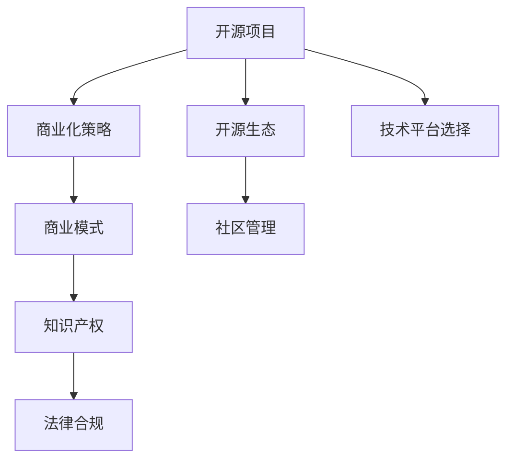

                 

# 从代码到现金：开源项目商业化策略

> 关键词：开源项目,商业化策略,开源生态,商业模式,开源社区,创新企业

## 1. 背景介绍

### 1.1 问题由来
随着互联网的迅猛发展和开源文化的兴起，开源项目逐渐成为技术创新和知识共享的重要平台。许多世界级公司和创新型企业，如Google、Facebook、Microsoft等，都积极推动开源项目的发展，以期在竞争激烈的市场中获取技术优势和品牌影响力。

然而，尽管开源项目为技术创新提供了巨大便利，但其商业化过程仍面临着诸多挑战。如何将开源项目成功转化为商业产品，并获得可观的经济收益，成为开源社区和商业组织共同关心的问题。

### 1.2 问题核心关键点
开源项目商业化涉及的要素包括但不限于：

- 技术平台的选择与搭建：如何选择一个合适的开源平台或自研开源项目，以支撑商业化运作？
- 商业模式的设计与实施：如何设计一种灵活的、可持续的商业模式，以实现商业收入最大化？
- 社区与企业的协同管理：如何在开源社区与商业实体间建立有效的沟通与协作机制，共同推进项目商业化？
- 用户需求的精准把握：如何深入了解用户需求，提供高价值的产品和服务？
- 知识产权与法律合规：如何在商业化过程中保护开源项目的知识产权，遵守相关法律法规？

针对以上关键点，本文将从技术、商业、社区、法律等多个角度，系统分析开源项目的商业化策略，探讨其在实际应用中的可行性和实现路径。

## 2. 核心概念与联系

### 2.1 核心概念概述

为更好地理解开源项目商业化的核心概念，本节将介绍几个密切相关的核心概念：

- 开源项目：指公开源代码的软件项目，可自由使用、修改和分发。
- 商业化策略：指将开源项目转化为商业产品，并从中实现经济收益的策略和方法。
- 开源生态：指围绕开源项目形成的一系列合作组织、工具、服务，以及开发者、用户、企业等利益相关方构成的网络。
- 商业模式：指企业盈利的方式，包括但不限于产品销售、订阅服务、广告、合作开发等。
- 社区管理：指开源社区的运营管理，包括项目维护、贡献者激励、用户互动等。
- 知识产权：指由智力活动产生的创造性成果所享有的专有权利，包括著作权、专利权等。

这些核心概念之间的逻辑关系可以通过以下Mermaid流程图来展示：



这个流程图展示了大语言模型的核心概念及其之间的关系：

1. 开源项目作为技术平台，是商业化的基础。
2. 商业化策略决定了开源项目如何转换为商业产品。
3. 开源生态提供了必要的工具和资源，支持项目商业化。
4. 商业模式指导商业化策略的具体实施。
5. 社区管理维护了开源项目的稳定性和活跃度。
6. 知识产权保护开源项目的合法权益。
7. 法律合规确保商业化过程符合相关法律法规。

这些概念共同构成了开源项目商业化的框架，使得开源项目能够从源代码走向市场，实现商业价值。

## 3. 核心算法原理 & 具体操作步骤
### 3.1 算法原理概述

开源项目商业化的核心在于找到一个平衡点，既能充分发挥开源项目的优势，又能获取商业利润。核心算法原理包括但不限于：

- **版本控制与发布管理**：使用版本控制系统（如Git）进行代码管理，确保代码的规范性、可追踪性和可回滚性。
- **问题跟踪与项目管理**：引入问题跟踪工具（如JIRA），帮助团队高效管理和追踪任务，保证项目按时交付。
- **贡献者管理与激励**：通过Gerrit、GitHub等平台，吸引和激励开发者贡献代码，同时管理贡献者的权限和贡献度。
- **社区与用户互动**：使用Discourse、Slack等社区管理工具，促进用户交流和反馈，提升用户满意度。
- **商业模式设计**：根据项目特性，选择合适的商业模式，如免费版+付费订阅、开源社区+商业版等。

### 3.2 算法步骤详解

开源项目商业化的操作步骤大致如下：

**Step 1: 评估项目成熟度与价值**
- 评估项目的技术栈、社区活跃度、市场潜力等指标，确定项目是否适合商业化。
- 确定项目的关键功能模块，分析其商业价值和潜在用户群体。

**Step 2: 选择开源平台**
- 选择适合的开源平台，如GitHub、Apache等。
- 创建项目代码库，并按规范提交代码，确保项目的开源性。

**Step 3: 设计商业模型**
- 确定项目的主要盈利方式，如软件销售、订阅服务、SaaS模式等。
- 制定产品定位、定价策略、市场推广等商业计划。

**Step 4: 实施社区管理**
- 建立社区管理机制，如代码审查流程、贡献者激励机制、用户反馈渠道等。
- 定期发布项目进展，吸引更多开发者和用户参与。

**Step 5: 实现产品化**
- 将开源项目核心功能实现为商业产品，确保产品的稳定性、安全性、易用性。
- 进行系统测试、性能优化、用户体验改进等。

**Step 6: 推广与市场化**
- 通过社交媒体、技术博客、行业会议等渠道，推广商业产品。
- 组织用户培训、技术支持，帮助用户快速上手并满足其需求。

**Step 7: 持续改进与迭代**
- 根据用户反馈和市场动态，持续优化和改进产品。
- 通过迭代开发，快速响应市场变化和技术进步。

### 3.3 算法优缺点

开源项目商业化的优点包括：

- 借助开源社区的力量，快速构建技术基础，提升开发效率。
- 减少研发投入，通过开源社区汇聚全球人才资源，降低开发成本。
- 增强品牌影响力，提升企业的技术实力和市场竞争力。

同时，其缺点也不可忽视：

- 开源社区与商业团队的利益冲突，可能影响商业产品的质量和进度。
- 开源许可证的限制，可能影响商业模式的灵活性和盈利能力。
- 知识产权保护难度大，容易面临侵权诉讼风险。
- 用户需求多样，难以平衡商业利益和社区贡献。

尽管存在这些局限，但开源项目商业化仍然是大企业技术创新的重要策略之一。成功的开源项目商业化不仅能实现商业收益，还能推动技术进步，促进社会合作。

### 3.4 算法应用领域

开源项目商业化在多个领域已得到广泛应用，例如：

- **软件开发**：许多软件开发公司通过开源项目吸引了大量开发者，同时推出了商业版软件，实现了商业价值。
- **云计算**：亚马逊AWS、微软Azure等云服务提供商，利用开源项目提升了云平台的稳定性和扩展性，吸引了更多用户。
- **大数据**：Apache Hadoop、Spark等开源项目在商业领域得到了广泛应用，支持企业进行大规模数据处理。
- **物联网**：许多物联网平台利用开源项目实现了硬件设备的互联互通，并提供了云服务和大数据分析功能。
- **人工智能**：TensorFlow、PyTorch等开源AI项目在商业领域得到了广泛应用，推动了人工智能技术的落地应用。

## 4. 数学模型和公式 & 详细讲解 & 举例说明（备注：数学公式请使用latex格式，latex嵌入文中独立段落使用 $$，段落内使用 $)
### 4.1 数学模型构建

本节将使用数学语言对开源项目商业化的策略进行更加严格的刻画。

假设开源项目 $P$ 的商业化目标为最大化利润 $\Pi$，其中 $\pi$ 为商业化成本，$\omega$ 为商业收入。则数学模型为：

$$
\Pi = \omega - \pi
$$

在实践中，我们通常将目标分解为两个关键部分：

- **开源成本**：包括软件开发、社区管理、市场营销等成本。
- **商业收入**：通过销售软件、订阅服务、广告收入等获得。

具体而言，开源项目商业化模型可以表示为：

$$
\begin{aligned}
&\max_{\omega, \pi} \omega - \pi \\
&\text{s.t.} \\
&\omega \leq \max(\text{CSD}, \text{Ad}), \\
&\pi \leq \text{CSR}, \\
&\omega \geq 0, \pi \geq 0,
\end{aligned}
$$

其中：
- $\text{CSD}$ 为通过软件销售获得的收入。
- $\text{Ad}$ 为通过广告获得的收入。
- $\text{CSR}$ 为社区管理的支出，包括开发、测试、运营等。

### 4.2 公式推导过程

以下我们以开源软件商业化为例，推导成本与收入的计算公式。

假设开源项目 $P$ 的开发成本为 $C$，社区管理成本为 $R$。则商业收入 $\omega$ 可以表示为：

$$
\omega = C_{\text{SD}} + C_{\text{CS}} + C_{\text{AS}}
$$

其中：
- $C_{\text{SD}}$ 为通过销售软件获得的收入。
- $C_{\text{CS}}$ 为订阅服务的收入。
- $C_{\text{AS}}$ 为广告收入。

成本 $\pi$ 可以表示为：

$$
\pi = R + \text{Marketing}
$$

其中 $R$ 为社区管理成本，$\text{Marketing}$ 为市场推广等额外成本。

通过上述公式，我们可以求解商业化模型的最优解，即在满足成本约束和收入最大化的情况下，找到最优的商业策略。

### 4.3 案例分析与讲解

假设某开源软件开发项目 $P$ 的开发成本为 $C=100000$，社区管理成本为 $R=50000$，市场推广成本为 $Marketing=10000$。该项目可以通过销售软件获得收入 $C_{\text{SD}}=50000$，订阅服务收入 $C_{\text{CS}}=10000$，广告收入 $C_{\text{AS}}=10000$。

则商业收入 $\omega$ 和成本 $\pi$ 分别为：

$$
\begin{aligned}
\omega &= 50000 + 10000 + 10000 \\
&= 70000
\end{aligned}
$$

$$
\begin{aligned}
\pi &= 50000 + 10000 \\
&= 60000
\end{aligned}
$$

则总利润为：

$$
\Pi = \omega - \pi = 70000 - 60000 = 10000
$$

可以看到，通过合理设计商业模式和成本控制，开源项目 $P$ 实现了显著的商业收益。

## 5. 项目实践：代码实例和详细解释说明
### 5.1 开发环境搭建

在进行开源项目商业化实践前，我们需要准备好开发环境。以下是使用Python进行Django开发的环境配置流程：

1. 安装Python：下载并安装Python，选择适当的版本。
2. 安装Django：使用pip安装Django框架，创建项目和应用。
3. 安装虚拟环境：使用virtualenv创建虚拟环境，隔离项目依赖。
4. 安装第三方库：使用pip安装Django和其他必要库。

### 5.2 源代码详细实现

下面以开源社区管理平台为例，给出使用Django框架进行开源项目商业化开发的PyTorch代码实现。

首先，定义开源项目模型：

```python
from django.db import models

class Project(models.Model):
    name = models.CharField(max_length=100)
    description = models.TextField()
    repository = models.CharField(max_length=255)
    contributors = models.ManyToManyField('User')
    licenses = models.ManyToManyField('License')
```

然后，定义用户模型：

```python
class User(models.Model):
    username = models.CharField(max_length=50, unique=True)
    email = models.EmailField(unique=True)
    is_contributor = models.BooleanField(default=False)
    is_admin = models.BooleanField(default=False)
```

接着，定义开源许可证模型：

```python
class License(models.Model):
    name = models.CharField(max_length=100)
    description = models.TextField()
```

最后，定义开源项目和用户之间的关联：

```python
class Contribution(models.Model):
    user = models.ForeignKey(User, on_delete=models.CASCADE)
    project = models.ForeignKey(Project, on_delete=models.CASCADE)
    commit_message = models.TextField()
    commit_time = models.DateTimeField(auto_now_add=True)
```

完成上述步骤后，即可在Django中进行开源项目商业化的开发。

### 5.3 代码解读与分析

让我们再详细解读一下关键代码的实现细节：

**Project模型**：
- `name` 和 `description` 字段用于存储项目的名称和描述。
- `repository` 字段用于存储项目的Git仓库地址。
- `contributors` 字段通过ManyToMany关系，关联多个用户，记录项目的贡献者。
- `licenses` 字段通过ManyToMany关系，关联多个许可证，记录项目的开源许可证。

**User模型**：
- `username` 和 `email` 字段用于存储用户的用户名和邮箱，保证唯一性。
- `is_contributor` 和 `is_admin` 字段用于标记用户是否为项目的贡献者或管理员。

**License模型**：
- `name` 和 `description` 字段用于存储许可证的名称和描述。

**Contribution模型**：
- `user` 和 `project` 字段通过ForeignKey关系，关联用户和项目，记录用户的贡献信息。
- `commit_message` 字段用于存储用户提交的代码变更详情。
- `commit_time` 字段用于记录代码变更的时间。

这些模型定义了开源项目的基本结构和用户管理功能，是开源社区管理平台的核心组件。通过Django的强大ORM功能，可以轻松地进行数据管理和查询。

## 6. 实际应用场景
### 6.1 开源软件开发平台

开源软件开发平台通过收集和维护高质量的开源软件项目，吸引大量开发者贡献代码，同时推出商业版软件，实现商业化运作。例如，Red Hat的Fedora项目，通过提供高质量的开源软件和社区支持，吸引了大量开发者，同时推出了商业版Fedora Linux，获得了可观的商业收入。

### 6.2 云计算服务平台

云计算服务平台利用开源项目构建稳定可靠的云基础设施，同时提供商业云服务。例如，亚马逊AWS的Linux内核开源项目，通过社区贡献和商业云服务相结合，形成了广泛的生态系统。

### 6.3 大数据处理平台

大数据处理平台通过开源项目整合全球数据处理资源，同时推出商业版大数据分析工具。例如，Apache Hadoop的开源社区，吸引了大量企业参与，推出了商业版Hadoop发行版，支持企业进行大规模数据处理。

### 6.4 未来应用展望

随着开源项目商业化的不断成熟，开源社区与商业生态的深度融合，未来的应用场景将更加丰富：

1. **开源工具商业化**：越来越多的开源工具被整合到商业解决方案中，提供更加全面和高效的服务。
2. **开源基础设施**：基于开源项目构建的基础设施，如操作系统、数据库、中间件等，将更加稳定可靠，支持更多商业应用。
3. **开源社区商业化**：开源社区通过提供商业服务、推出商业版软件等方式，实现商业化运作。
4. **开源生态融合**：开源社区与商业企业合作，共同推进技术进步和市场创新。
5. **开源文化普及**：开源文化将进一步普及，成为全球技术创新的重要驱动力。

## 7. 工具和资源推荐
### 7.1 学习资源推荐

为了帮助开发者系统掌握开源项目商业化的理论基础和实践技巧，这里推荐一些优质的学习资源：

1. **《开源文化：从零开始构建开源社区》**：本书介绍了如何建立和维护开源社区，详细讲解了社区管理、贡献者激励等关键点。
2. **《开源项目商业化指南》**：本书从技术、商业、法律等多个角度，全面介绍了开源项目的商业化策略和实践案例。
3. **《Django实战：从零开始构建开源社区》**：本书以Django框架为例，介绍了开源社区管理和商业化开发的关键技术和最佳实践。
4. **《GitHub开源社区运营手册》**：GitHub提供的官方运营指南，介绍了如何管理开源项目、吸引贡献者、保护社区安全等。
5. **《开源软件商业化案例分析》**：本文从多个开源项目商业化的成功案例中，提炼出了可行的商业策略和关键经验。

通过对这些资源的学习实践，相信你一定能够快速掌握开源项目商业化的精髓，并用于解决实际的商业问题。

### 7.2 开发工具推荐

高效的开发离不开优秀的工具支持。以下是几款用于开源项目商业化开发的常用工具：

1. **GitHub**：全球最大的开源平台，提供代码托管、问题跟踪、社区协作等功能，是开源项目商业化的重要工具。
2. **GitLab**：与GitHub类似，支持代码托管、持续集成、容器化部署等，适合开源项目的管理和开发。
3. **JIRA**：项目管理工具，支持问题跟踪、任务管理、版本控制等，帮助团队高效协作。
4. **Slack**：社区管理工具，支持即时通讯、文件共享、会议安排等功能，促进用户和开发者互动。
5. **Zoom**：在线会议工具，支持视频会议、屏幕共享、文件传输等功能，方便团队远程协作。
6. **PyTorch**：深度学习框架，支持分布式训练、模型压缩等，加速开源项目的技术开发和商业化。

合理利用这些工具，可以显著提升开源项目商业化的开发效率，加快创新迭代的步伐。

### 7.3 相关论文推荐

开源项目商业化涉及的学术研究相对较少，但仍有一些重要的论文，推荐阅读：

1. **《开源社区的演化机制与商业化策略》**：该论文探讨了开源社区的发展机制和商业化策略，为开源项目商业化提供了理论基础。
2. **《开源项目的商业化之路：从社区到市场》**：该论文从多个开源项目的商业化实践中，提炼出了可行的商业策略和关键经验。
3. **《开源软件商业化的经济学分析》**：该论文从经济学角度，分析了开源软件的商业化模型和成本收益。
4. **《开源社区的治理与商业化》**：该论文探讨了开源社区的治理结构和商业化模式，为开源项目商业化提供了参考。

这些论文代表了大语言模型商业化技术的发展脉络。通过学习这些前沿成果，可以帮助研究者把握学科前进方向，激发更多的创新灵感。

## 8. 总结：未来发展趋势与挑战
### 8.1 总结

本文对开源项目商业化的核心概念和操作步骤进行了全面系统的介绍。首先阐述了开源项目商业化的背景和意义，明确了开源项目如何转化为商业产品，以实现商业化运作。其次，从技术、商业、社区、法律等多个角度，详细讲解了开源项目商业化的操作步骤和关键点，提供了可行的商业化模型和实践案例。

通过本文的系统梳理，可以看到，开源项目商业化不仅能提升开源项目的经济价值，还能推动技术进步和创新。开源项目商业化在实践中取得了诸多成功案例，证明了其可行性和重要意义。

### 8.2 未来发展趋势

展望未来，开源项目商业化将呈现以下几个发展趋势：

1. **开源生态的多样化**：开源生态将更加丰富，涵盖更多技术和领域，吸引更多开发者和用户。
2. **商业模式的灵活化**：更多的商业模式将涌现，如订阅服务、按需付费、开源商业结合等，满足不同用户的需求。
3. **商业化的全球化**：开源项目商业化将拓展到更多国家和地区，形成全球化的开源社区和市场。
4. **社区与企业的协同化**：开源社区与商业企业将更加紧密合作，共同推动技术创新和商业化进程。
5. **知识产权的保护**：开源项目商业化将更加重视知识产权保护，防止侵权诉讼和盗版风险。

以上趋势凸显了开源项目商业化的广阔前景。这些方向的探索发展，将进一步提升开源项目的商业价值，加速开源技术的产业化进程。

### 8.3 面临的挑战

尽管开源项目商业化已经取得了显著进展，但在迈向更加智能化、普适化应用的过程中，仍面临诸多挑战：

1. **开源社区与商业团队的利益冲突**：开源项目商业化过程中，社区贡献与商业利益的平衡问题，可能影响项目的稳定性和发展。
2. **开源许可证的限制**：不同的开源许可证可能影响商业模式的灵活性和盈利能力。
3. **知识产权保护难度大**：开源项目的知识产权保护难度大，容易面临侵权诉讼和盗版风险。
4. **用户需求多样**：开源项目可能难以满足所有用户的需求，导致商业化的灵活性和适应性不足。
5. **技术积累不足**：部分开源项目在商业化过程中，可能缺乏技术积累和资源，难以满足市场的高标准要求。

尽管存在这些挑战，但开源项目商业化仍是大企业技术创新的重要策略之一。成功的开源项目商业化不仅能实现商业收益，还能推动技术进步，促进社会合作。

### 8.4 研究展望

面对开源项目商业化所面临的种种挑战，未来的研究需要在以下几个方面寻求新的突破：

1. **社区与企业的协同机制**：建立有效的沟通与协作机制，促进开源社区与商业企业的协同创新。
2. **商业模式的创新**：探索新的商业化模式，如开源商业结合、订阅服务等，满足不同用户的需求。
3. **知识产权保护**：加强开源项目的知识产权保护，防止侵权诉讼和盗版风险。
4. **用户需求管理**：深入了解用户需求，提供高价值的产品和服务，增强用户满意度和粘性。
5. **技术积累与资源整合**：加强开源项目的技术积累和资源整合，提升商业化的成功率和可持续性。

这些研究方向的探索，将推动开源项目商业化向更高的台阶发展，为开源技术落地应用提供新的思路和方法。

## 9. 附录：常见问题与解答

**Q1：开源项目是否必须完全开源？**

A: 并非必须完全开源。许多开源项目通过部分开放代码，同时保留核心算法和商业代码，既保护了知识产权，又吸引了大量开发者和用户参与。例如，Apache Hadoop保留了商业版Hadoop的源代码，同时开放了开源版，形成了广泛的生态系统。

**Q2：如何选择合适的开源平台？**

A: 选择开源平台需要考虑多个因素，包括平台的用户基础、技术支持、社区活跃度等。可以参考GitHub、Apache等知名平台的特色和优势，结合自身项目的需求进行综合评估。

**Q3：开源项目商业化是否需要重新开发？**

A: 不一定。开源项目通常已经具备一定的技术基础，可以基于其进行商业化开发。但需要重新设计商业模式和用户界面，以满足商业需求。

**Q4：开源项目商业化过程中如何保护知识产权？**

A: 开源项目商业化过程中，需要严格遵守开源许可证的条款，同时保留商业版代码的版权和专利。可以使用商业软件许可证或专用许可证，保护商业化的成果。

**Q5：开源项目商业化是否影响社区贡献？**

A: 适当的商业化可以增强开源项目的稳定性和可持续性，吸引更多的开发者和用户参与。但需要平衡商业利益和社区贡献，避免对社区贡献造成负面影响。

---

作者：禅与计算机程序设计艺术 / Zen and the Art of Computer Programming

