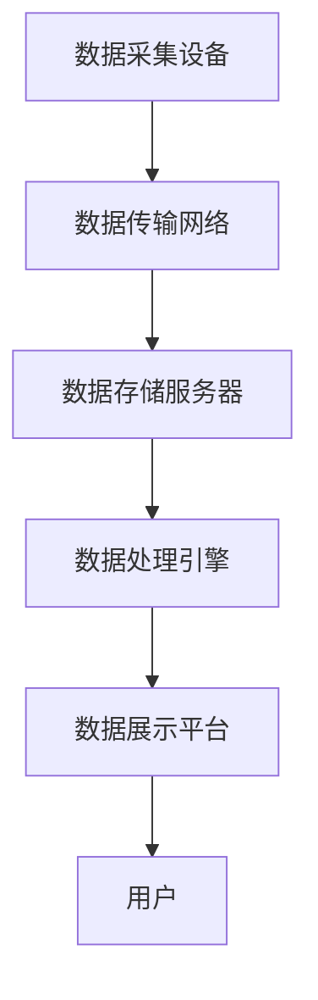
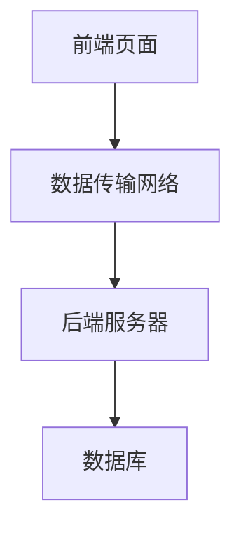

                 

## 1. 背景介绍

在信息化时代，随着技术迅猛发展，我们的生活和工作变得越来越数字化、智能化。然而，快速迭代的技术更新也带来了诸多问题，比如信息过载、系统复杂性增加、用户体验变差等。如何系统思考，从全局视角出发，有效应对这些问题，成为了每个技术从业者必须掌握的技能。本文将深入探讨这一主题，帮助读者提升系统思维能力，构建更高效的解决方案。

### 1.1 问题由来

系统思维是一种整体思考方式，它要求我们在面对复杂问题时，不仅要关注局部细节，还要从全局视角出发，综合考虑系统各部分之间的相互作用，寻找最优解。在IT行业，系统思维尤为重要，因为系统中往往包含众多组件和模块，任何一个部分的变更都可能影响整个系统。

近年来，随着人工智能技术的普及，系统复杂性更是达到了前所未有的高度。如何系统思考，整合各部分优势，构建更稳定、高效的AI系统，成为当前热门话题。本文旨在从理论和实践两个方面，探讨系统思维在人工智能系统构建中的应用。

### 1.2 问题核心关键点

系统思维的关键点在于系统整体的视角，它要求我们考虑以下几个方面：

- **系统视角**：将问题视为一个整体，考虑各部分之间的相互作用。
- **全局最优**：寻找整体上最优的解决方案，而不是局部的最优解。
- **交互优化**：优化系统各部分之间的交互，使得整个系统运行更加流畅。
- **上下文感知**：考虑问题的上下文环境，找到最适合的解决方案。

## 2. 核心概念与联系

### 2.1 核心概念概述

系统思维涉及众多核心概念，这里我们将重点介绍几个关键概念：

- **系统(System)**：由多个部分组成，各部分之间相互作用，形成一个整体。
- **组件(Component)**：构成系统的基本单元，如人工智能模型、数据库、前端页面等。
- **交互(Interaction)**：系统各部分之间的相互作用方式，如数据传输、接口调用等。
- **上下文(Context)**：系统运行的环境，如技术栈、用户需求等。

这些概念之间的联系可以通过以下Mermaid流程图来展示：

```mermaid
graph TB
    A[系统(System)] --> B[组件(Component)]
    A --> C[交互(Interaction)]
    A --> D[上下文(Context)]
    B --> E[数据/模型]
    B --> F[界面/用户]
    B --> G[功能]
    C --> H[数据传输]
    C --> I[接口调用]
```

这个流程图展示了系统思维的几个关键点：

1. 系统由多个组件组成，这些组件通过交互形成整体。
2. 系统的整体行为受上下文环境的影响。
3. 系统各部分的功能和数据相互依赖，协同工作。

## 3. 核心算法原理 & 具体操作步骤
### 3.1 算法原理概述

系统思维的本质是全局视角，它在算法原理上表现为以下几个方面：

- **整体优化**：通过优化整个系统的性能，而不是局部最优。
- **交互优化**：优化系统各部分之间的交互方式，提高整体效率。
- **上下文适配**：根据上下文环境，调整系统行为和策略。

### 3.2 算法步骤详解

系统思维在具体应用中，通常包括以下几个步骤：

**Step 1: 系统建模**

系统建模是系统思维的第一步，通过建立系统模型，我们能够清晰地描述系统的结构、行为和交互。常见的系统建模工具包括UML、SysML等。

**Step 2: 性能评估**

性能评估是系统思维的重要环节，通过分析系统各部分的性能指标，我们可以发现瓶颈和优化点。常用的性能指标包括吞吐量、响应时间、资源利用率等。

**Step 3: 交互优化**

交互优化是系统思维的关键点之一，通过改进系统各部分之间的交互方式，可以显著提升整体性能。例如，通过缓存机制减少数据传输，或者优化接口调用顺序，可以降低响应时间。

**Step 4: 上下文适配**

上下文适配是系统思维的另一个重要环节，通过根据上下文环境调整系统策略，可以使得系统更适应特定场景。例如，根据用户设备性能的不同，调整图片加载策略，以提升用户体验。

**Step 5: 持续改进**

持续改进是系统思维的持续过程，通过不断优化系统，可以逐步提升整体性能。常见的持续改进方法包括A/B测试、灰度发布、系统迭代等。

### 3.3 算法优缺点

系统思维的优点在于：

- **整体视角**：从全局视角出发，考虑系统整体性能，避免局部优化带来的问题。
- **系统优化**：通过优化系统各部分之间的交互，提高整体性能。
- **上下文适配**：根据上下文环境，调整系统策略，提升适应性。

缺点在于：

- **复杂性高**：系统思维要求考虑多个因素，过程相对复杂。
- **成本高**：系统建模和优化需要较高的时间和资源投入。

### 3.4 算法应用领域

系统思维广泛应用于人工智能系统的各个领域，例如：

- **自然语言处理(NLP)**：优化语言模型、文本生成等组件的交互，提升整体性能。
- **机器学习(ML)**：优化数据传输和模型调参策略，提升训练和推理效率。
- **计算机视觉(CV)**：优化特征提取和数据预处理，提升图像识别精度。
- **云计算(Cloud)**：优化资源分配和负载均衡，提升系统稳定性和扩展性。

## 4. 数学模型和公式 & 详细讲解 & 举例说明
### 4.1 数学模型构建

系统思维的数学模型通常包括：

- **系统性能模型**：描述系统各部分的性能指标。
- **交互模型**：描述系统各部分之间的交互关系。
- **上下文模型**：描述系统运行的环境因素。

### 4.2 公式推导过程

以下以一个简单的系统为例，展示系统性能模型的推导过程。

假设系统由两个组件A和B组成，组件A负责数据处理，组件B负责数据存储。系统性能由两个关键指标组成：处理时间$T_a$和存储时间$T_b$。

假设组件A和B的处理能力分别为$C_a$和$C_b$，数据量为$D$。则系统性能模型为：

$$
T = \frac{D}{C_a + C_b}
$$

这个公式表明，系统性能取决于组件的处理能力和数据量，同时也考虑了组件之间的交互。

### 4.3 案例分析与讲解

考虑一个简单的分布式系统，由多个节点组成，每个节点负责处理一部分请求。系统性能模型为：

$$
T = \frac{N}{S} * (T_1 + T_2 + \cdots + T_N)
$$

其中$N$为节点数量，$S$为节点处理能力，$T_i$为节点$i$的响应时间。通过优化节点间的交互，如负载均衡、消息队列等，可以显著提升系统性能。

## 5. 项目实践：代码实例和详细解释说明
### 5.1 开发环境搭建

在系统思维的实践中，开发环境搭建尤为重要，这里推荐使用Docker容器化技术，方便系统部署和升级。

### 5.2 源代码详细实现

以下是一个简单的系统建模示例，使用Python和UML建模工具绘制系统架构图：

```python
class Component:
    def __init__(self, name, capacity):
        self.name = name
        self.capacity = capacity

    def process(self, request):
        # 处理请求
        pass

class System:
    def __init__(self, components):
        self.components = components

    def process_request(self, request):
        # 将请求分配给适当组件处理
        pass

# 定义组件
component1 = Component('A', 100)
component2 = Component('B', 200)

# 创建系统
system = System([component1, component2])

# 处理请求
request = 'some request'
response = system.process_request(request)
```

### 5.3 代码解读与分析

**Component类**：定义系统的基本组件，包含名称和处理能力。

**System类**：定义系统的整体结构，包括组件列表和处理请求的方法。

**process_request方法**：将请求分配给适当组件处理，并返回响应。

## 6. 实际应用场景
### 6.1 智慧城市

智慧城市系统是一个典型的复杂系统，涉及多个组件和大量数据交互。系统思维可以优化智慧城市各个部分之间的交互，提升整体性能。

**场景描述**：智慧城市系统中，数据采集、处理、分析和展示是关键环节。传统系统中，数据采集设备和处理服务器分散部署，存在数据传输延迟和处理能力不足的问题。

**系统建模**：通过UML工具，建立智慧城市系统模型，如下图所示：



**性能优化**：优化数据传输网络带宽，采用多路并行传输方式，同时优化数据处理引擎的并行处理能力，提升整体处理速度。

**交互优化**：优化数据采集设备和处理引擎之间的接口，通过消息队列技术实现异步数据传输，降低延迟。

**上下文适配**：根据用户设备性能的不同，调整数据展示方式，如移动端采用轻量级展示方式，PC端采用高精度展示方式。

**持续改进**：通过A/B测试和灰度发布，逐步优化系统各部分性能，提升整体用户体验。

### 6.2 企业IT架构

企业IT架构通常由多个子系统和组件构成，系统思维可以帮助企业优化各部分之间的交互，提升整体效率。

**场景描述**：企业IT架构中，前端页面、后端服务器和数据库需要进行大量的数据交互。传统架构中，数据传输和接口调用存在瓶颈，导致响应时间较长。

**系统建模**：通过UML工具，建立企业IT架构模型，如下图所示：



**性能优化**：优化数据传输网络带宽，采用CDN加速方式，同时优化接口调用方式，减少数据传输次数。

**交互优化**：优化前端页面和后端服务器之间的接口，通过缓存机制减少数据传输，提升响应速度。

**上下文适配**：根据用户设备性能的不同，调整数据展示方式，如移动端采用轻量级展示方式，PC端采用高精度展示方式。

**持续改进**：通过A/B测试和灰度发布，逐步优化系统各部分性能，提升整体用户体验。

## 7. 工具和资源推荐
### 7.1 学习资源推荐

为了帮助开发者系统掌握系统思维的理论基础和实践技巧，这里推荐一些优质的学习资源：

1. **《系统思考》**：作者：彼得·圣吉(Peter Senge)，系统思考的经典著作，帮助读者从全局视角看问题。

2. **《设计模式》**：作者：埃里克·雷蒙德(Eric Raymond)，系统设计的重要参考资料，介绍了常见设计模式和系统架构。

3. **《UML建模技术》**：作者：Ian affey，UML建模技术的权威指南，帮助读者掌握系统建模工具。

4. **《UML建模案例分析》**：作者：Shaun Whisker，通过实际案例，介绍UML建模的应用。

5. **《系统设计实践》**：作者：Simon Gunderberg，系统设计的实践指南，涵盖系统建模、性能评估、交互优化等关键点。

### 7.2 开发工具推荐

系统思维的实现离不开优秀的工具支持，以下是几款常用的工具：

1. **Docker**：容器化技术，方便系统部署和升级。

2. **Kubernetes**：容器编排工具，支持负载均衡和自动扩展。

3. **Prometheus**：系统性能监控工具，帮助识别系统瓶颈。

4. **Jenkins**：持续集成和持续部署工具，支持自动化测试和发布。

5. **Kibana**：数据可视化工具，帮助分析系统性能和日志。

### 7.3 相关论文推荐

系统思维的研究已经吸引了众多学者的关注，以下是几篇具有代表性的论文：

1. **《系统思考与复杂系统建模》**：作者：Holger D. Baumann，介绍了系统思维在复杂系统建模中的应用。

2. **《系统优化与交互设计》**：作者：Rama Subramaniam，介绍了系统优化和交互设计的关键技术。

3. **《上下文感知系统设计》**：作者：Marissa T. Parsons，介绍了上下文感知系统设计的方法和应用。

## 8. 总结：未来发展趋势与挑战
### 8.1 总结

本文对系统思维在人工智能系统构建中的应用进行了全面系统的介绍。首先阐述了系统思维的理论基础和实践意义，明确了系统思维在优化系统各部分之间交互、提升整体性能方面的独特价值。其次，从原理到实践，详细讲解了系统思维的数学模型和具体实现步骤，给出了系统思维任务开发的完整代码实例。同时，本文还广泛探讨了系统思维在智慧城市、企业IT架构等多个领域的应用前景，展示了系统思维范式的巨大潜力。最后，本文精选了系统思维相关的学习资源、开发工具和相关论文，力求为读者提供全方位的技术指引。

通过本文的系统梳理，可以看到，系统思维在大规模、复杂的人工智能系统构建中，具有不可替代的作用。系统思维不仅关注局部细节，更强调全局视角，通过系统建模、性能评估、交互优化和上下文适配等关键环节，可以显著提升系统的性能和稳定性。未来，随着系统思维的深入研究和应用，人工智能系统必将迎来更加高效、稳定、智能的发展前景。

### 8.2 未来发展趋势

展望未来，系统思维的发展将呈现以下几个趋势：

1. **智能系统**：系统思维将在人工智能系统中扮演越来越重要的角色，帮助构建智能化的解决方案。

2. **自适应系统**：系统思维将帮助构建自适应系统，根据环境变化自动调整系统行为，提升系统鲁棒性。

3. **跨学科融合**：系统思维将与其他学科融合，如经济学、社会学、心理学等，构建更加综合、全面的解决方案。

4. **数据驱动**：系统思维将更加注重数据驱动，通过数据建模和分析，优化系统性能。

5. **多模态系统**：系统思维将支持多模态系统，如视觉、听觉、触觉等多模态数据的整合和分析。

以上趋势展示了系统思维未来的广阔前景。这些方向的探索发展，必将引领人工智能系统迈向更高层次，为构建更加智能、稳定、高效的系统奠定基础。

### 8.3 面临的挑战

尽管系统思维在人工智能系统中具有重要价值，但在具体应用中也面临诸多挑战：

1. **复杂度增加**：系统规模和复杂度不断增加，系统思维需要处理的信息量也相应增大。

2. **数据瓶颈**：系统思维需要大量数据支持，数据采集和处理难度也随之增大。

3. **性能优化**：系统各部分之间的交互复杂，性能优化难度较大。

4. **上下文适配**：上下文环境复杂多变，系统需要根据不同环境灵活调整策略。

5. **安全性和隐私**：系统思维涉及大量数据交互，数据安全和隐私保护成为重要问题。

6. **人机交互**：系统思维需要考虑人机交互设计，提升用户体验。

这些挑战要求我们不断探索系统思维的新方法和新技术，才能构建更加智能、安全、稳定的系统。

### 8.4 研究展望

未来，系统思维的研究将在以下几个方向展开：

1. **大数据和云计算**：结合大数据和云计算技术，优化系统建模和性能评估。

2. **人工智能和机器学习**：结合人工智能和机器学习技术，优化系统交互和上下文适配。

3. **多学科融合**：结合经济学、社会学、心理学等多学科知识，构建更加综合、全面的解决方案。

4. **智能系统和自适应系统**：结合智能系统和自适应系统技术，提升系统鲁棒性和自适应能力。

5. **数据驱动**：结合数据驱动技术，优化系统建模和性能优化。

这些方向的研究将为系统思维带来新的突破，提升人工智能系统的性能和应用效果。

## 9. 附录：常见问题与解答

**Q1：系统思维和系统工程有什么区别？**

A: 系统思维和系统工程紧密相关，但略有区别。系统工程注重系统的整体规划和设计，涵盖系统建模、需求分析、性能评估等环节；而系统思维强调系统整体视角的思考方式，注重系统各部分之间的交互和优化。

**Q2：系统思维和设计模式有什么区别？**

A: 系统思维和设计模式都是系统设计的重要手段，但侧重点不同。设计模式侧重于具体组件的设计和实现，关注局部最优；而系统思维侧重于整体视角的思考，关注全局最优。

**Q3：系统思维和人工智能有什么关系？**

A: 系统思维是人工智能系统设计的重要工具，通过系统思维优化系统各部分之间的交互，可以显著提升人工智能系统的性能和稳定性。同时，系统思维也推动了人工智能系统向更智能、更高效的方向发展。

**Q4：系统思维在企业中的应用有哪些？**

A: 系统思维在企业中的应用广泛，包括企业IT架构设计、业务流程优化、项目管理、风险管理等。通过系统思维，企业可以提高运营效率、降低成本、提升用户体验。

**Q5：系统思维需要哪些技术支持？**

A: 系统思维需要多种技术支持，包括系统建模工具、性能评估工具、交互优化工具等。常见的工具有UML建模工具、性能监控工具、负载均衡工具等。

综上所述，系统思维在人工智能系统的构建中具有重要意义，能够帮助我们从全局视角出发，优化系统各部分之间的交互，提升整体性能。通过不断探索和应用系统思维，人工智能系统必将迈向更高层次，实现更加智能、高效和稳定的发展。

