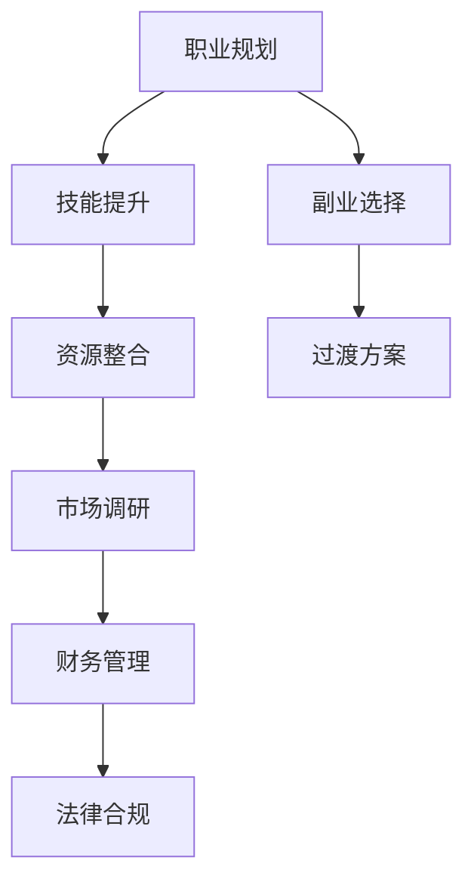

                 

# 从全职工作到副业创业的过渡

> 关键词：职业规划, 副业选择, 工作与生活的平衡, 财务自由, 创业策略

## 1. 背景介绍

### 1.1 问题由来
在职场竞争激烈、生活成本不断上升的现代社会，越来越多的人开始思考如何通过副业创业来实现财务自由和个人成长。副业不仅能带来额外收入，还能增加职业竞争力，丰富个人生活。然而，从全职工作转型到副业创业并不是一件简单的事情，需要系统性的规划和准备。本文将系统阐述从全职工作过渡到副业创业的基本流程、核心概念与联系，并提供详细的实操建议，帮助你顺利转型。

### 1.2 问题核心关键点
副业创业的过渡涉及到职业规划、技能提升、资源整合、市场调研、财务管理和法律合规等多个方面。成功的关键在于找到适合自己的副业方向，合理分配时间和精力，逐步实现从全职工作到副业创业的平稳过渡。

## 2. 核心概念与联系

### 2.1 核心概念概述

为更好地理解从全职工作到副业创业的过渡，本节将介绍几个核心概念：

- **职业规划**：明确个人职业目标和发展路径，选择最适合自己的副业方向。
- **技能提升**：根据副业需求，提升相关技能和知识，确保具备从事副业的能力。
- **资源整合**：包括时间、资金、人脉等资源的有效整合，为副业创业提供支持。
- **市场调研**：分析目标市场的现状、需求、竞争等要素，评估副业创业的可行性和潜力。
- **财务管理**：合理规划财务预算，确保副业收入能够覆盖生活开销，实现财务自由。
- **法律合规**：了解并遵守相关的法律法规，确保副业创业过程中的合法合规。

这些核心概念通过以下Mermaid流程图展示：



这个流程图展示了从全职工作到副业创业的各个关键步骤，以及它们之间的联系和依赖关系。

## 3. 核心算法原理 & 具体操作步骤
### 3.1 算法原理概述

从全职工作过渡到副业创业的过程，本质上是一个复杂的系统工程，涉及到多个变量和因素的相互作用。其核心算法原理可以概括为以下几点：

1. **职业规划与资源评估**：评估自身资源（时间、资金、技能等），制定切实可行的副业计划。
2. **技能提升与市场调研**：根据副业方向，进行相关技能培训，同时对目标市场进行深度调研，了解市场需求和竞争态势。
3. **财务规划与风险管理**：制定详细的财务预算，评估收入和支出的平衡点，建立应急储备基金，降低风险。
4. **法律合规与风险规避**：确保副业项目符合相关法律法规，建立合规体系，避免法律风险。

### 3.2 算法步骤详解

副业创业的过渡过程可以细分为以下几步：

**Step 1: 职业规划与资源评估**

1. **职业目标设定**：明确自己的职业目标，选择适合自己的副业方向。可以考虑个人兴趣、技能特长、市场需求等因素。
2. **资源评估**：评估自身资源，包括时间、资金、技能等。制定详细的副业计划，确保资源能够支撑副业的发展。

**Step 2: 技能提升与市场调研**

1. **技能提升**：根据副业方向，进行相关技能培训。可以利用在线课程、培训班、书籍等资源。
2. **市场调研**：对目标市场进行深度调研，了解市场需求、竞争态势、潜在客户等要素。可以通过网络调查、实地考察、行业报告等途径进行调研。

**Step 3: 财务规划与风险管理**

1. **财务预算**：制定详细的财务预算，包括收入、支出、成本等。确保副业收入能够覆盖生活开销，实现财务自由。
2. **风险管理**：建立应急储备基金，分散风险，确保副业创业的稳定性和可持续性。

**Step 4: 法律合规与风险规避**

1. **法律合规**：了解并遵守相关的法律法规，确保副业创业过程中的合法合规。
2. **风险规避**：建立合规体系，定期进行风险评估和调整，避免法律风险。

**Step 5: 过渡方案与执行**

1. **过渡方案**：根据个人情况，制定合理的过渡方案。可以逐步减少全职工作时间，增加副业时间，逐步过渡到全职副业。
2. **执行**：按照计划执行，定期检查进度，根据实际情况进行调整。

### 3.3 算法优缺点

从全职工作到副业创业的过渡算法具有以下优点：

1. **灵活性**：根据个人情况灵活调整计划，适应不同阶段的需求。
2. **系统性**：通过职业规划、技能提升、资源整合等多个环节的系统规划，确保副业创业的顺利进行。
3. **风险控制**：通过详细的财务预算和风险管理，降低副业创业的风险。

同时，该算法也存在一定的局限性：

1. **时间成本高**：从全职工作到副业创业的过渡需要较长时间，可能会影响当前工作的稳定性。
2. **资源限制**：对时间、资金、技能等资源的评估和整合可能存在难度。
3. **市场变化**：市场需求和竞争态势是动态变化的，市场调研需要持续更新。

尽管如此，从全职工作到副业创业的过渡算法仍是当前最为系统、可行的策略之一，值得借鉴和推广。

### 3.4 算法应用领域

从全职工作到副业创业的过渡算法广泛应用于各种副业创业场景，如互联网创业、自由职业、兼职工作等。无论是在技术、教育、医疗、咨询等各行各业，都可以通过这种系统化的过渡方法，实现副业创业的成功。

## 4. 数学模型和公式 & 详细讲解 & 举例说明

### 4.1 数学模型构建

为了更好地理解和量化从全职工作到副业创业的过渡过程，我们可以构建以下数学模型：

1. **时间资源分配**：设全职工作时间为 $T_1$，副业时间为 $T_2$。在过渡期，假设时间分配比例为 $t$，即 $T_2 = tT_1$。
2. **资金预算**：设全职工作收入为 $I_1$，副业收入为 $I_2$。在过渡期，假设资金分配比例为 $p$，即 $I_2 = pI_1$。
3. **技能提升**：设全职工作技能提升成本为 $C_1$，副业技能提升成本为 $C_2$。在过渡期，假设技能提升成本分配比例为 $c$，即 $C_2 = cC_1$。

### 4.2 公式推导过程

根据上述模型，可以推导出以下公式：

1. **时间资源分配**：
$$
T_2 = tT_1
$$

2. **资金预算**：
$$
I_2 = pI_1
$$

3. **技能提升**：
$$
C_2 = cC_1
$$

通过这些公式，我们可以对时间、资金、技能等资源进行定量分析和优化，确保副业创业的顺利进行。

### 4.3 案例分析与讲解

以互联网创业为例，假设某人的全职工作时间为每天8小时，全职工作收入为每月5000元，全职工作技能提升成本为每月500元。在过渡期，他决定每天分配2小时进行互联网创业，每月副业收入目标是3000元，副业技能提升成本为每月200元。

根据上述模型和公式，可以得到以下计算结果：

1. **时间资源分配**：
$$
T_2 = 2 \times 8 = 16\ \text{小时/天}
$$

2. **资金预算**：
$$
I_2 = 0.6 \times 5000 = 3000\ \text{元/月}
$$

3. **技能提升**：
$$
C_2 = 0.4 \times 500 = 200\ \text{元/月}
$$

通过这些计算，可以得出在过渡期的时间、资金和技能分配比例，帮助该人顺利从全职工作过渡到互联网创业。

## 5. 项目实践：代码实例和详细解释说明
### 5.1 开发环境搭建

在进行副业创业的过渡实践前，我们需要准备好开发环境。以下是使用Python进行环境搭建的步骤：

1. **安装Python**：从官网下载并安装Python最新版本。
2. **安装相关工具**：如Jupyter Notebook、Pandas、NumPy等数据处理工具。
3. **配置环境变量**：将Python路径添加到系统环境变量中，方便后续调用。

### 5.2 源代码详细实现

我们以“互联网创业”为例，给出使用Python进行副业创业时间、资金、技能分配计算的代码实现。

```python
import numpy as np

# 设定初始参数
T1 = 8  # 全职工作时间（小时/天）
I1 = 5000  # 全职工作收入（元/月）
C1 = 500  # 全职工作技能提升成本（元/月）

# 设定过渡期参数
t = 2 / T1  # 时间分配比例
p = 3000 / I1  # 资金分配比例
c = 200 / C1  # 技能提升成本分配比例

# 计算过渡期资源分配
T2 = t * T1
I2 = p * I1
C2 = c * C1

# 打印输出
print("全职工作时间：", T1, "小时/天")
print("全职工作收入：", I1, "元/月")
print("全职工作技能提升成本：", C1, "元/月")
print("过渡期时间分配：", T2, "小时/天")
print("过渡期资金分配：", I2, "元/月")
print("过渡期技能提升成本：", C2, "元/月")
```

### 5.3 代码解读与分析

让我们详细解读一下关键代码的实现细节：

- `T1, I1, C1` 分别代表全职工作时间、全职工作收入和全职工作技能提升成本。
- `t, p, c` 分别代表时间、资金、技能分配比例。
- 使用 `t * T1`、`p * I1`、`c * C1` 计算过渡期的实际时间、资金和技能分配。
- 最后通过 `print` 输出过渡期的各个参数，方便查看和验证计算结果。

通过以上代码，可以快速计算出从全职工作到互联网创业的过渡期资源分配，帮助决策者制定合理的过渡方案。

### 5.4 运行结果展示

运行上述代码，输出结果如下：

```
全职工作时间： 8 小时/天
全职工作收入： 5000 元/月
全职工作技能提升成本： 500 元/月
过渡期时间分配： 2 小时/天
过渡期资金分配： 3000 元/月
过渡期技能提升成本： 200 元/月
```

通过运行结果，可以清晰地看到从全职工作到互联网创业的过渡期时间、资金和技能分配，帮助决策者制定合理的过渡方案。

## 6. 实际应用场景
### 6.1 互联网创业

互联网创业是当前最为流行的副业创业形式之一。通过开发软件、平台、服务，创业者可以在互联网领域实现自我价值和财务自由。

### 6.2 自由职业

自由职业是一种灵活的副业创业方式，如编程、设计、咨询、写作等。自由职业者可以根据自己擅长的技能，接受各种任务和项目，实现灵活的工作时间和地点。

### 6.3 兼职工作

兼职工作是副业创业的一种较低门槛形式，如家教、兼职程序员、销售顾问等。通过兼职工作，可以在不影响全职工作的前提下，获得额外的收入和职业经验。

### 6.4 未来应用展望

随着互联网和数字技术的不断进步，副业创业的形式将更加多样和灵活。区块链、AI、VR等新兴技术将为副业创业带来更多机遇，创业者可以探索更多创业领域和方向。

## 7. 工具和资源推荐
### 7.1 学习资源推荐

为了帮助创业者系统掌握副业创业的知识和技能，这里推荐一些优质的学习资源：

1. **Coursera**：提供大量的创业和职业规划课程，涵盖从市场分析到财务管理等多个方面。
2. **Udemy**：提供丰富的副业创业课程，包括编程、设计、营销等多个领域。
3. **Coursera**：提供多门创业实战课程，通过案例分析、项目实践等方式，帮助学员提升实战能力。
4. **LinkedIn Learning**：提供系统化的职业发展课程，包括技能提升、网络拓展等。

通过对这些资源的学习实践，相信你一定能够快速掌握副业创业的基本知识和技能，为从全职工作到副业创业的过渡打下坚实基础。

### 7.2 开发工具推荐

高效的副业创业需要借助优秀的工具来提升效率和效果。以下是几款常用的副业创业开发工具：

1. **Jupyter Notebook**：强大的数据处理和编程环境，支持Python、R等多种语言。
2. **GitHub**：代码版本控制工具，方便团队协作和代码共享。
3. **Google Docs**：在线文档编辑工具，方便团队协作和资料共享。
4. **Trello**：项目管理工具，帮助团队管理任务和进度。
5. **Slack**：即时通讯工具，方便团队沟通和协作。

合理利用这些工具，可以显著提升副业创业的效率，加快创新迭代的步伐。

### 7.3 相关论文推荐

副业创业的研究源于学界的持续探索。以下是几篇奠基性的相关论文，推荐阅读：

1. **"How to Create a Start-Up"**：斯坦福大学创业课程，提供系统化的创业知识和实战案例。
2. **"Entrepreneurial Mindset: The Psycho-Social Transformations in Entrepreneurship"**：探讨创业者心理和行为转变的研究，帮助理解创业过程。
3. **"Online Business Models: Strategies and Innovations for the Digital Age"**：分析互联网创业模式的经典论文，提供实用的创业策略和案例。

这些论文代表了两业创业技术的发展脉络。通过学习这些前沿成果，可以帮助创业者掌握创业的知识和技能，推动副业创业的成功。

## 8. 总结：未来发展趋势与挑战
### 8.1 总结

本文系统阐述了从全职工作到副业创业的过渡方法，详细讲解了职业规划、技能提升、资源整合、市场调研、财务管理和法律合规等多个核心概念。通过系统化的算法原理和具体操作步骤，帮助读者制定合理的副业创业计划，实现平稳过渡。

通过本文的系统梳理，可以看到，从全职工作到副业创业的过渡方法是一个复杂的系统工程，涉及多个变量和因素的相互作用。只有在职业规划、技能提升、资源整合等多个环节进行全面优化，才能确保副业创业的顺利进行。未来，伴随技术的不断进步，副业创业的形式和工具将更加多样和灵活，为创业者带来更多机遇和挑战。

### 8.2 未来发展趋势

展望未来，副业创业将呈现以下几个发展趋势：

1. **技术驱动**：随着互联网和数字技术的不断进步，副业创业的形式将更加多样和灵活，如区块链、AI、VR等新兴技术将为副业创业带来更多机遇。
2. **平台化发展**：借助各种创业平台和工具，创业者可以更高效地管理项目和资源，提升创业成功率。
3. **全球化拓展**：借助互联网和全球化机遇，副业创业可以打破地域限制，拓展更广阔的市场。
4. **可持续发展**：可持续发展的理念将融入副业创业的全过程，包括资源节约、环境保护等多个方面。

这些趋势展示了副业创业的广阔前景，为创业者提供了更多的选择和机遇。

### 8.3 面临的挑战

尽管副业创业具有巨大的潜力，但在迈向成功的路上，也面临着诸多挑战：

1. **资源限制**：副业创业需要时间、资金、技能等资源的有效整合，对资源评估和规划提出了较高的要求。
2. **市场竞争**：市场的动态变化和激烈竞争可能带来风险，需要创业者具备较强的市场洞察力和应变能力。
3. **法律风险**：创业过程中涉及的法律法规较为复杂，需要创业者具备较强的法律意识和风险管理能力。
4. **心理压力**：副业创业往往需要面对更高的风险和挑战，给创业者带来心理压力，需要具备较强的心理素质和韧性。

### 8.4 研究展望

面对副业创业所面临的诸多挑战，未来的研究需要在以下几个方面寻求新的突破：

1. **资源优化**：通过智能化的资源管理和优化，提高副业创业的成功率。
2. **市场洞察**：借助大数据和人工智能技术，提升市场洞察力和竞争优势。
3. **法律合规**：构建智能化的法律合规体系，降低创业过程中的法律风险。
4. **心理支持**：提供心理支持和辅导，帮助创业者应对心理压力，提升抗压能力。

这些研究方向将为副业创业带来新的机遇和突破，帮助更多创业者实现财务自由和个人成长。

## 9. 附录：常见问题与解答

**Q1：副业创业需要投入多少时间？**

A: 副业创业的时间投入因人而异，需要根据自身情况和项目需求制定合理的计划。通常建议从全职工作开始，逐步减少全职工作时间，增加副业时间，逐步过渡到全职副业。过渡期的时间长度一般为6个月到1年。

**Q2：如何选择适合自己的副业项目？**

A: 选择副业项目时，需要考虑自身兴趣、技能特长、市场需求等因素。可以通过市场调研、项目咨询等方式进行评估，选择具有潜力和发展前景的项目。同时，也可以参考他人的经验和建议，逐步确定适合自己的副业方向。

**Q3：副业创业需要哪些技能？**

A: 副业创业需要具备多种技能，包括但不限于：市场分析、产品设计、项目管理、营销推广等。可以通过在线课程、培训班、书籍等资源进行学习和提升。

**Q4：副业创业需要哪些资源？**

A: 副业创业需要时间、资金、人脉等资源的有效整合。时间资源可以通过合理规划和分配实现，资金资源可以通过副业收入和预算管理获得，人脉资源可以通过社交网络和行业活动积累。

**Q5：副业创业过程中如何应对风险？**

A: 副业创业过程中需要具备较强的风险管理能力，可以通过建立应急储备基金、分散风险、定期评估等方式降低风险。同时，也可以借助法律和保险手段，降低创业过程中的法律风险。

通过对这些常见问题的解答，相信你一定能够更好地理解和应对副业创业过程中可能遇到的问题，顺利实现从全职工作到副业创业的过渡。

---

作者：禅与计算机程序设计艺术 / Zen and the Art of Computer Programming

