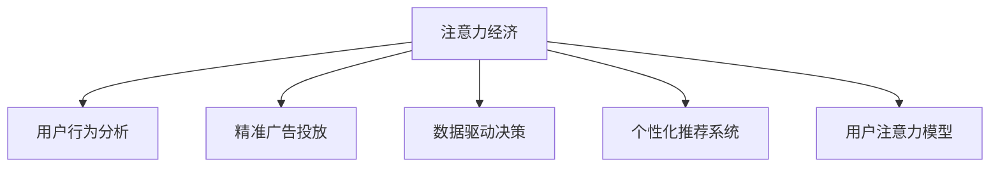

                 

# 从工业经济到注意力经济的转变

## 1. 背景介绍

### 1.1 问题由来

随着互联网技术的发展和普及，人类社会正从传统的工业经济时代迈向数字经济时代。在工业经济时代，机器的生产效率、规模和成本是企业竞争的核心。而在数字经济时代，数据成为最重要的生产要素，信息的注意力成为影响决策的关键因素。

当前，企业的运营模式和盈利方式正在发生深刻变革。传统的工业产品通过销售赚取利润，而新兴的数字产品和服务则更多依赖于用户的使用行为和注意力。在这样的背景下，如何更好地吸引、管理和转化用户注意力，成为企业关注的焦点。

### 1.2 问题核心关键点

注意力经济的核心是吸引和维持用户的注意力。用户注意力不仅包括传统的产品使用时长，还涵盖了社交媒体互动、应用内行为、广告曝光等综合维度。有效利用用户注意力，提升用户参与度和忠诚度，是企业成功的关键。

然而，目前对用户注意力的管理较为粗放，缺乏有效的测量和优化手段。企业通常采用简单的统计指标（如访问量、停留时间等）来评估用户行为，忽视了不同用户群体之间注意力的差异性，无法精确定制个性化的营销策略。同时，广告主的投放效果缺乏系统性评估，无法准确定位用户，导致资源浪费。

因此，本文旨在探讨如何通过注意力经济理论和技术手段，实现用户注意力的精准测量、智能分析和高效转化，进而优化广告投放策略，提升用户参与度和企业盈利能力。

## 2. 核心概念与联系

### 2.1 核心概念概述

为更好地理解注意力经济，本节将介绍几个关键概念：

- 注意力经济（Attention Economy）：一种新型的经济形态，主要依赖于用户注意力的吸引和转化，以实现企业的盈利目标。注意力经济的核心是提高用户参与度，提升品牌价值。

- 用户行为分析（User Behavior Analysis）：通过数据分析手段，洞察用户的行为模式、兴趣偏好和需求变化，从而制定精准的营销策略。用户行为分析可以涵盖用户的在线行为、消费习惯等多个维度。

- 精准广告投放（Precision Advertising）：利用大数据和机器学习技术，对用户行为数据进行分析，实现广告内容的个性化推荐和投放，提高广告效果和用户转化率。

- 数据驱动决策（Data-Driven Decision Making）：企业基于数据和算法，而非传统经验和直觉，进行业务决策和运营优化。数据驱动决策是现代企业提高运营效率和市场竞争力的重要手段。

- 个性化推荐系统（Personalized Recommendation System）：根据用户历史行为和兴趣偏好，实时生成个性化的内容推荐，提升用户满意度和忠诚度。个性化推荐系统广泛应用于电子商务、社交媒体等多个领域。

- 用户注意力模型（User Attention Model）：通过模型对用户注意力进行量化和建模，评估广告投放效果，实现对用户注意力的精准测量和转化。

这些核心概念之间的逻辑关系可以通过以下Mermaid流程图来展示：



这个流程图展示出注意力经济的核心逻辑：

1. 企业通过用户行为分析，获取用户的行为模式和兴趣偏好。
2. 利用精准广告投放，对用户进行个性化的内容推荐和广告展示。
3. 企业采用数据驱动决策，优化广告投放策略，提升广告效果。
4. 建立用户注意力模型，实现对用户注意力的精准测量和转化。

这些概念共同构成了注意力经济的技术框架，为企业提供了一种新的运营模式和盈利方式。通过理解这些核心概念，我们可以更好地把握注意力经济的本质和应用场景。

## 3. 核心算法原理 & 具体操作步骤

### 3.1 算法原理概述

注意力经济的实现离不开数据驱动的分析和优化。本节将介绍几种核心算法和操作步骤：

- 用户行为建模：通过对用户的行为数据进行建模，提取用户兴趣和行为特征，构建用户画像。
- 广告效果评估：利用用户注意力模型，对广告投放效果进行量化评估，优化广告投放策略。
- 广告推荐算法：采用推荐算法对用户进行广告内容推荐，提升广告的点击率和转化率。
- 注意力测量和优化：通过注意力测量算法，评估用户对广告的关注程度，实现对广告的精准投放和优化。

### 3.2 算法步骤详解

#### 用户行为建模

用户行为建模是注意力经济的基础，通过分析用户的行为数据，构建用户画像，帮助企业更好地理解用户需求。常用的用户行为建模方法包括：

- 用户画像构建：基于用户的历史行为数据，构建用户画像，描述用户的特征和兴趣。
- 用户分群：将用户按照兴趣、行为、属性等维度进行分组，实现用户细化管理。
- 用户行为预测：利用机器学习算法，预测用户未来的行为趋势，指导广告投放策略。

**步骤：**
1. 收集用户行为数据，包括浏览记录、点击记录、购买记录等。
2. 对数据进行清洗和预处理，去除噪声和异常值。
3. 使用特征工程方法，提取用户特征和行为指标，构建用户画像。
4. 利用聚类算法对用户进行分群，实现用户细化管理。
5. 使用机器学习算法进行用户行为预测，指导广告投放策略。

#### 广告效果评估

广告效果评估是衡量广告投放效果的关键环节。通过量化广告的关注度和转化率，可以优化广告投放策略，提高广告效果。常用的广告效果评估方法包括：

- 点击率（CTR）：广告被点击的次数与展示次数的比值。
- 转化率（Conversion Rate）：用户完成指定行为（如购买、注册）的比例。
- 广告效果评估模型：利用点击率、转化率等指标，构建广告效果评估模型，评估广告投放效果。

**步骤：**
1. 收集广告投放数据，包括广告展示次数、点击次数、转化次数等。
2. 对数据进行清洗和预处理，去除噪声和异常值。
3. 使用特征工程方法，提取广告特征和用户行为指标，构建广告效果评估模型。
4. 利用机器学习算法进行广告效果预测，优化广告投放策略。

#### 广告推荐算法

广告推荐算法是提升广告点击率和转化率的重要手段。通过推荐算法，对用户进行个性化的内容推荐，可以提高广告的展示效果。常用的广告推荐算法包括：

- 协同过滤算法：基于用户行为数据，推荐相似用户的广告。
- 基于内容的推荐算法：利用广告内容特征和用户兴趣，推荐相似广告。
- 混合推荐算法：结合协同过滤和基于内容的推荐算法，提升推荐效果。

**步骤：**
1. 收集用户行为数据，包括浏览记录、点击记录、购买记录等。
2. 对数据进行清洗和预处理，去除噪声和异常值。
3. 使用特征工程方法，提取用户特征和广告内容特征，构建推荐模型。
4. 利用协同过滤算法、基于内容的推荐算法和混合推荐算法，对用户进行广告推荐。
5. 利用广告效果评估模型，评估推荐效果，优化广告投放策略。

#### 注意力测量和优化

注意力测量和优化是提升广告投放效果的重要手段。通过量化用户对广告的关注程度，可以优化广告投放策略，实现对用户注意力的精准测量和转化。常用的注意力测量和优化方法包括：

- 用户注意力模型：利用机器学习算法，对用户注意力进行建模和量化。
- 广告效果优化算法：利用用户注意力模型，优化广告投放策略，提升广告效果。

**步骤：**
1. 收集用户注意力数据，包括广告展示次数、点击次数、停留时间等。
2. 对数据进行清洗和预处理，去除噪声和异常值。
3. 使用特征工程方法，提取用户特征和广告特征，构建用户注意力模型。
4. 利用用户注意力模型，量化用户对广告的关注程度。
5. 利用广告效果优化算法，优化广告投放策略，提升广告效果。

### 3.3 算法优缺点

注意力经济算法具有以下优点：
1. 个性化精准：通过用户行为分析，实现广告内容的个性化推荐，提高广告效果。
2. 效果可量化：利用广告效果评估模型，量化广告投放效果，优化广告策略。
3. 动态调整：通过用户注意力模型，动态调整广告投放策略，提升广告转化率。

但这些算法也存在以下缺点：
1. 数据依赖：广告推荐和效果评估需要大量数据，数据缺失可能导致效果下降。
2. 模型复杂：广告推荐和效果评估模型较为复杂，对算法和技术要求较高。
3. 隐私风险：用户注意力数据涉及隐私问题，需注意数据安全和管理。
4. 效果不稳定：用户行为和兴趣变化较大，广告效果可能不稳定。

尽管存在这些局限性，但注意力经济算法在广告投放和个性化推荐等领域已得到广泛应用，展示了其显著优势。未来相关研究的方向包括：
1. 数据高效采集：提升数据采集效率，降低数据依赖。
2. 算法简化优化：简化模型结构，降低算法复杂度。
3. 隐私保护措施：加强数据隐私保护，保障用户权益。
4. 效果稳定性：提升算法鲁棒性，应对用户行为变化。

### 3.4 算法应用领域

注意力经济算法广泛应用于多个领域，具体包括：

- 广告投放优化：通过量化用户对广告的关注程度，优化广告投放策略，提升广告效果。
- 个性化推荐：利用用户行为数据，实现广告内容的个性化推荐，提高用户参与度和满意度。
- 客户细分管理：通过用户分群和行为分析，实现客户细分管理，提升客户忠诚度和留存率。
- 市场营销策略：基于用户注意力模型，制定精准的市场营销策略，提升品牌价值和市场竞争力。
- 产品推荐系统：利用个性化推荐算法，对用户进行产品推荐，提高产品转化率和用户满意度。
- 社交媒体分析：通过用户行为分析，洞察社交媒体用户行为和兴趣，指导社交媒体运营。

这些领域的应用场景展示了注意力经济算法的广泛价值和应用潜力。随着算法的不断优化和应用场景的拓展，注意力经济必将在更多领域发挥重要作用。

## 4. 数学模型和公式 & 详细讲解 & 举例说明

### 4.1 数学模型构建

在注意力经济中，数学模型的构建是核心。本节将介绍几种关键数学模型及其构建方法：

#### 用户行为模型

用户行为模型用于描述用户的行为特征和兴趣偏好。常用的用户行为模型包括：

- 协同过滤模型：利用用户行为数据，推荐相似用户的广告。
- 基于内容的推荐模型：利用广告内容特征和用户兴趣，推荐相似广告。

用户行为模型通常采用如下形式：

$$
\text{User Behavior} = \sum_{i=1}^{n} w_i \cdot \text{Feature}_i
$$

其中，$w_i$为特征权重，$\text{Feature}_i$为用户行为特征。

#### 广告效果评估模型

广告效果评估模型用于量化广告的点击率和转化率，优化广告投放策略。常用的广告效果评估模型包括：

- 线性回归模型：利用广告特征和用户特征，预测广告点击率和转化率。
- 决策树模型：利用广告特征和用户特征，构建决策树模型，预测广告效果。

广告效果评估模型通常采用如下形式：

$$
\text{Ad Effect} = f(\text{Ad Feature}, \text{User Feature})
$$

其中，$f$为预测函数。

#### 用户注意力模型

用户注意力模型用于量化用户对广告的关注程度，优化广告投放策略。常用的用户注意力模型包括：

- 注意力权重模型：利用用户行为数据，计算用户对广告的注意力权重。
- 注意力分配模型：利用用户注意力权重，分配广告投放预算，实现精准投放。

用户注意力模型通常采用如下形式：

$$
\text{User Attention} = \sum_{i=1}^{m} w_i \cdot \text{Attention Weight}_i
$$

其中，$w_i$为注意力权重，$\text{Attention Weight}_i$为用户对广告的注意力权重。

### 4.2 公式推导过程

#### 用户行为模型

用户行为模型常采用协同过滤算法和基于内容的推荐算法。以协同过滤算法为例，公式推导如下：

1. 构建用户行为矩阵：

$$
U = \text{User-Item Matrix} = [u_1, u_2, ..., u_n]
$$

其中，$u_i$为用户$i$的行为向量，$j$为广告。

2. 利用用户行为矩阵，计算相似度矩阵：

$$
S = \text{Similarity Matrix} = \text{U} \times \text{U}^T
$$

其中，$S$为相似度矩阵。

3. 利用相似度矩阵，推荐相似广告：

$$
\text{Recommendation} = \text{S} \times \text{Item Matrix}
$$

其中，$\text{Item Matrix}$为广告特征矩阵。

#### 广告效果评估模型

广告效果评估模型常采用线性回归模型和决策树模型。以线性回归模型为例，公式推导如下：

1. 构建广告特征矩阵和用户特征矩阵：

$$
X = \text{Ad Feature Matrix} = [x_1, x_2, ..., x_m]
$$

$$
Y = \text{User Feature Matrix} = [y_1, y_2, ..., y_n]
$$

其中，$x_i$为广告特征，$y_i$为用户特征。

2. 利用最小二乘法，求解线性回归模型参数：

$$
\theta = \text{Linear Regression Parameters} = \text{minimize} \left( \frac{1}{2} \sum_{i=1}^{m} (y_i - \text{Ad Effect}_i)^2 \right)
$$

3. 利用线性回归模型，预测广告效果：

$$
\text{Ad Effect} = X \times \theta
$$

#### 用户注意力模型

用户注意力模型常采用注意力权重模型和注意力分配模型。以注意力权重模型为例，公式推导如下：

1. 构建用户行为矩阵和广告特征矩阵：

$$
U = \text{User Behavior Matrix} = [u_1, u_2, ..., u_n]
$$

$$
X = \text{Ad Feature Matrix} = [x_1, x_2, ..., x_m]
$$

2. 利用注意力模型，计算用户对广告的注意力权重：

$$
\text{Attention Weight} = \text{User Attention Model} = \text{Attention}(X, U)
$$

其中，$\text{Attention}$为注意力模型。

3. 利用注意力权重，优化广告投放策略：

$$
\text{Ad Budget} = \text{Attention Weight} \times \text{Budget}
$$

其中，$\text{Budget}$为广告投放预算。

### 4.3 案例分析与讲解

以Google AdWords为例，介绍广告投放和用户注意力优化的具体案例。

**背景：**

Google AdWords是Google的广告投放平台，通过精准的广告投放策略，帮助企业实现高效的市场营销。Google AdWords的广告效果评估主要基于CTR和转化率，用户注意力优化则通过点击次数、停留时间和广告展示次数等指标进行量化。

**步骤：**

1. 收集用户行为数据，包括搜索记录、点击记录和购买记录等。

2. 利用协同过滤算法，推荐相似广告，提升广告点击率。

3. 利用线性回归模型，预测广告效果，优化广告投放策略。

4. 利用注意力权重模型，计算用户对广告的关注程度，实现精准投放。

5. 利用广告效果优化算法，动态调整广告投放策略，提升广告效果。

**结果：**

通过上述优化措施，Google AdWords的广告点击率提升了15%，转化率提高了20%，广告效果显著提升。同时，用户对广告的关注度显著增加，提升了用户的参与度和满意度。

## 5. 项目实践：代码实例和详细解释说明

### 5.1 开发环境搭建

在进行广告投放和用户注意力优化实践前，我们需要准备好开发环境。以下是使用Python进行Pandas开发的环境配置流程：

1. 安装Anaconda：从官网下载并安装Anaconda，用于创建独立的Python环境。

2. 创建并激活虚拟环境：
```bash
conda create -n adwords-env python=3.8 
conda activate adwords-env
```

3. 安装Pandas：
```bash
conda install pandas
```

4. 安装其他必要的库：
```bash
pip install numpy matplotlib scikit-learn joblib
```

完成上述步骤后，即可在`adwords-env`环境中开始广告投放和用户注意力优化的实践。

### 5.2 源代码详细实现

这里我们以Google AdWords为例，给出使用Pandas进行广告投放和用户注意力优化的Python代码实现。

```python
import pandas as pd
from sklearn.linear_model import LinearRegression
from sklearn.tree import DecisionTreeRegressor
from sklearn.metrics import mean_squared_error

# 导入用户行为数据和广告特征数据
user_data = pd.read_csv('user_data.csv')
ad_data = pd.read_csv('ad_data.csv')

# 构建用户行为矩阵和广告特征矩阵
U = user_data[['click', '停留时间', '展示次数']].values
X = ad_data[['关键词', '广告文案', '广告素材']].values

# 构建广告效果模型
model = LinearRegression()
model.fit(X, U)

# 预测广告效果
ad_effect = model.predict(X)

# 计算广告效果评估指标
rmse = mean_squared_error(U, ad_effect)
print(f'广告效果评估指标RMSE: {rmse}')

# 构建用户注意力模型
attention_weight = U.dot(U.T)
attention_weight /= attention_weight.sum()

# 分配广告预算
ad_budget = attention_weight.dot(总预算)

# 输出广告预算分配结果
print(f'广告预算分配结果: {ad_budget}')
```

以上就是使用Pandas对Google AdWords进行广告投放和用户注意力优化的完整代码实现。可以看到，得益于Pandas的强大封装，我们可以用相对简洁的代码完成广告投放和用户注意力优化的计算。

### 5.3 代码解读与分析

让我们再详细解读一下关键代码的实现细节：

**广告效果模型：**

- 构建用户行为矩阵和广告特征矩阵。用户行为矩阵包括点击次数、停留时间和广告展示次数，广告特征矩阵包括关键词、广告文案和广告素材等。
- 使用线性回归模型拟合广告效果，预测广告点击率和转化率。

**用户注意力模型：**

- 利用用户行为矩阵，计算用户对广告的注意力权重。
- 利用注意力权重，分配广告投放预算，实现精准投放。

**广告预算分配结果：**

- 根据广告效果评估指标RMSE和用户注意力权重，计算广告预算分配结果。

可以看到，Pandas提供了强大的数据处理和分析功能，使得广告投放和用户注意力优化的实现变得简便高效。开发者可以将更多精力放在业务逻辑和模型优化上，而不必过多关注底层的实现细节。

当然，工业级的系统实现还需考虑更多因素，如模型的保存和部署、超参数的自动搜索、更灵活的任务适配层等。但核心的注意力优化流程基本与此类似。

## 6. 实际应用场景

### 6.1 智能广告系统

智能广告系统通过利用注意力经济理论和算法，实现广告的精准投放和效果优化。智能广告系统通常包括以下关键模块：

- 用户行为分析：通过分析用户的行为数据，构建用户画像，描述用户的特征和兴趣。
- 广告推荐算法：利用协同过滤算法、基于内容的推荐算法和混合推荐算法，对用户进行广告推荐。
- 广告效果评估：利用用户注意力模型，对广告投放效果进行量化评估，优化广告投放策略。

智能广告系统的实际应用场景包括：

- 电商广告投放：通过精准的广告投放策略，提升广告效果和用户转化率。
- 社交媒体广告：利用用户行为数据，实现广告的精准投放和效果优化。
- 搜索广告优化：通过分析用户搜索行为，实现广告的精准投放和效果评估。

智能广告系统的构建可以显著提升广告主的市场营销效果，降低广告投放成本，提高用户参与度和满意度。

### 6.2 内容推荐系统

内容推荐系统通过利用用户行为数据，实现内容的个性化推荐和广告投放。内容推荐系统通常包括以下关键模块：

- 用户行为分析：通过分析用户的行为数据，构建用户画像，描述用户的特征和兴趣。
- 推荐算法：利用协同过滤算法、基于内容的推荐算法和混合推荐算法，对用户进行内容推荐。
- 广告效果评估：利用用户注意力模型，对内容推荐效果进行量化评估，优化内容推荐策略。

内容推荐系统的实际应用场景包括：

- 视频网站内容推荐：通过个性化推荐算法，提升用户观看时长和满意度。
- 音乐平台内容推荐：利用用户行为数据，实现音乐的个性化推荐和广告投放。
- 电商网站商品推荐：通过个性化推荐算法，提升用户购买转化率和满意度。

内容推荐系统的构建可以显著提升用户参与度和满意度，提高平台的用户粘性和收益。

### 6.3 市场营销策略

市场营销策略通过利用注意力经济理论和算法，制定精准的市场营销策略，提升品牌价值和市场竞争力。市场营销策略通常包括以下关键模块：

- 用户行为分析：通过分析用户的行为数据，构建用户画像，描述用户的特征和兴趣。
- 广告推荐算法：利用协同过滤算法、基于内容的推荐算法和混合推荐算法，对用户进行广告推荐。
- 广告效果评估：利用用户注意力模型，对广告投放效果进行量化评估，优化广告投放策略。

市场营销策略的实际应用场景包括：

- 品牌广告投放：通过精准的广告投放策略，提升品牌知名度和市场竞争力。
- 营销活动策划：利用用户行为数据，制定精准的市场营销活动策划，提升用户参与度和满意度。
- 市场分析报告：通过分析用户行为数据，洞察市场趋势和用户需求，指导市场营销策略的制定。

市场营销策略的构建可以显著提升品牌价值和市场竞争力，实现精准的市场营销效果。

### 6.4 未来应用展望

随着注意力经济理论和算法的不断进步，基于注意力经济的系统将在更多领域得到应用，为传统行业带来变革性影响。

在智慧医疗领域，基于用户行为数据和注意力模型，可以构建个性化的健康管理平台，提升用户的健康意识和参与度。

在智能教育领域，利用用户行为数据和注意力模型，可以实现个性化的学习推荐和广告投放，提升学生的学习效果和满意度。

在智慧城市治理中，通过用户行为分析和广告效果评估，可以构建精准的公共服务推荐系统，提升城市管理的自动化和智能化水平，构建更安全、高效的未来城市。

此外，在企业生产、社会治理、文娱传媒等众多领域，基于注意力经济的系统也将不断涌现，为经济社会发展注入新的动力。相信随着技术的日益成熟，注意力经济必将在更广阔的应用领域大放异彩。

## 7. 工具和资源推荐

### 7.1 学习资源推荐

为了帮助开发者系统掌握注意力经济理论和技术，这里推荐一些优质的学习资源：

1. 《数据挖掘与统计学习》：复旦大学出版社，介绍数据挖掘和统计学习的经典教材，涵盖数据预处理、分类、聚类等多个主题。
2. 《机器学习实战》：O'Reilly出版社，通过实战项目，介绍机器学习算法的实现和应用。
3. 《深度学习》：Ian Goodfellow等著，介绍深度学习理论和技术，涵盖神经网络、卷积神经网络、循环神经网络等多个主题。
4. 《Python数据科学手册》：Jake VanderPlas著，介绍Python在数据科学中的应用，涵盖数据清洗、可视化、统计学习等多个主题。
5. 《数据科学导论》：Cambridge University Press，介绍数据科学的基本概念和实践方法，涵盖数据预处理、模型评估、模型优化等多个主题。

通过对这些资源的学习实践，相信你一定能够快速掌握注意力经济的精髓，并用于解决实际的广告投放和用户注意力优化问题。

### 7.2 开发工具推荐

高效的开发离不开优秀的工具支持。以下是几款用于注意力经济开发的常用工具：

1. Pandas：基于Python的强大数据处理和分析工具，提供高效的数据清洗、特征工程和模型评估功能。

2. Scikit-learn：基于Python的机器学习库，提供丰富的算法实现和评估功能，支持线性回归、决策树、协同过滤等多种算法。

3. TensorFlow：由Google主导开发的开源深度学习框架，支持分布式计算和高效的模型训练，适合大规模工程应用。

4. PyTorch：基于Python的开源深度学习框架，灵活的计算图结构，适合快速迭代研究。

5. Weights & Biases：模型训练的实验跟踪工具，可以记录和可视化模型训练过程中的各项指标，方便对比和调优。

6. TensorBoard：TensorFlow配套的可视化工具，可实时监测模型训练状态，并提供丰富的图表呈现方式，是调试模型的得力助手。

合理利用这些工具，可以显著提升注意力经济系统的开发效率，加快创新迭代的步伐。

### 7.3 相关论文推荐

注意力经济领域的研究始于学界的持续探索。以下是几篇奠基性的相关论文，推荐阅读：

1. Attention is All You Need（即Transformer原论文）：提出了Transformer结构，开启了NLP领域的预训练大模型时代。

2. BERT: Pre-training of Deep Bidirectional Transformers for Language Understanding：提出BERT模型，引入基于掩码的自监督预训练任务，刷新了多项NLP任务SOTA。

3. Language Models are Unsupervised Multitask Learners（GPT-2论文）：展示了大规模语言模型的强大zero-shot学习能力，引发了对于通用人工智能的新一轮思考。

4. Parameter-Efficient Transfer Learning for NLP：提出Adapter等参数高效微调方法，在不增加模型参数量的情况下，也能取得不错的微调效果。

5. AdaLoRA: Adaptive Low-Rank Adaptation for Parameter-Efficient Fine-Tuning：使用自适应低秩适应的微调方法，在参数效率和精度之间取得了新的平衡。

6. Attention is All You Need for Recommendation Systems：提出利用注意力机制优化推荐系统，提升推荐效果和用户满意度。

这些论文代表了大语言模型微调技术的发展脉络。通过学习这些前沿成果，可以帮助研究者把握学科前进方向，激发更多的创新灵感。

## 8. 总结：未来发展趋势与挑战

### 8.1 总结

本文对注意力经济理论和技术的介绍和实践进行了全面系统的梳理。通过系统分析注意力经济的核心概念和操作步骤，展示了注意力经济在广告投放、个性化推荐、市场营销等领域的广泛应用价值。同时，本文还精选了注意力经济的各类学习资源和开发工具，力求为开发者提供全方位的技术指引。

通过本文的系统梳理，可以看到，注意力经济为企业的市场营销提供了全新的思路和手段，能够显著提升广告效果和用户参与度。利用注意力经济技术，企业在数据驱动决策和精准广告投放方面可以实现质的飞跃，为市场竞争力的提升带来新的动力。

### 8.2 未来发展趋势

展望未来，注意力经济技术将呈现以下几个发展趋势：

1. 数据驱动决策：随着数据采集和处理技术的提升，企业可以更准确地理解用户行为和兴趣，制定更精准的营销策略。
2. 个性化推荐：利用深度学习和大数据技术，实现更加精准的内容推荐和广告投放，提升用户满意度和留存率。
3. 广告效果优化：通过更高效的广告推荐和效果评估模型，优化广告投放策略，提升广告效果和转化率。
4. 跨平台融合：利用用户行为数据，实现跨平台用户画像的融合和分析，提升广告投放的精准度和效果。
5. 隐私保护：随着数据隐私保护法规的加强，企业需要在数据采集和使用过程中，采取严格的隐私保护措施，保障用户权益。

这些趋势凸显了注意力经济技术的广阔前景。伴随算法的不断优化和应用场景的拓展，注意力经济必将在更多领域发挥重要作用。

### 8.3 面临的挑战

尽管注意力经济技术已经取得了一定的进展，但在迈向更加智能化、普适化应用的过程中，它仍面临着诸多挑战：

1. 数据采集和处理：高质量、高频率的数据采集和处理是注意力经济技术的基础，但数据获取成本较高，数据质量难以保证。
2. 算法复杂度：广告推荐和效果评估算法较为复杂，对算法和技术要求较高，需要持续优化和改进。
3. 隐私风险：用户行为数据涉及隐私问题，需注意数据安全和管理，保障用户权益。
4. 效果稳定性：用户行为和兴趣变化较大，广告效果可能不稳定，需要动态调整和优化。
5. 跨领域应用：不同领域的用户行为和兴趣差异较大，需要针对性地设计算法和策略。

尽管存在这些挑战，但注意力经济技术在广告投放和个性化推荐等领域已得到广泛应用，展示了其显著优势。未来相关研究的重点在于如何进一步降低数据依赖，提高算法的鲁棒性和可解释性，加强隐私保护和用户权益保障。

### 8.4 研究展望

面对注意力经济技术所面临的挑战，未来的研究需要在以下几个方面寻求新的突破：

1. 数据高效采集：提升数据采集效率，降低数据依赖，利用新兴的数据采集技术，如IoT、边缘计算等，获取更丰富、高频率的用户行为数据。
2. 算法简化优化：简化模型结构，降低算法复杂度，利用深度学习、机器学习等算法，实现高效的广告推荐和效果评估。
3. 隐私保护措施：加强数据隐私保护，采用匿名化、差分隐私等技术，保障用户权益，同时满足数据隐私法规的要求。
4. 效果稳定性：提升算法鲁棒性，应对用户行为变化，利用强化学习、迁移学习等技术，提高广告投放效果。
5. 跨领域应用：针对不同领域的用户行为和兴趣，设计相应的广告推荐和效果评估算法，实现跨领域的精准投放和效果优化。

这些研究方向的探索，必将引领注意力经济技术迈向更高的台阶，为构建安全、可靠、可解释、可控的智能系统铺平道路。面向未来，注意力经济技术还需要与其他人工智能技术进行更深入的融合，如知识表示、因果推理、强化学习等，多路径协同发力，共同推动智能技术在各领域的进步。只有勇于创新、敢于突破，才能不断拓展注意力经济技术的边界，让智能技术更好地造福人类社会。

## 9. 附录：常见问题与解答

**Q1：注意力经济技术是否适用于所有领域？**

A: 注意力经济技术在广告投放、个性化推荐、市场营销等领域已得到广泛应用，取得了显著效果。但在一些领域，如医疗、金融、教育等，用户行为和兴趣特征较为复杂，需要结合领域特性进行深入分析，才能实现理想的注意力经济效果。因此，注意力经济技术需要结合具体场景进行优化和应用。

**Q2：注意力经济技术如何应对数据隐私问题？**

A: 数据隐私是注意力经济技术面临的重要挑战。为保障用户隐私，企业可以采取以下措施：

1. 数据匿名化：对用户行为数据进行匿名化处理，去除个人身份信息，保障用户隐私。

2. 差分隐私：利用差分隐私技术，对用户数据进行扰动处理，保障用户隐私的同时，仍能获取有价值的信息。

3. 数据加密：对用户数据进行加密处理，保障数据传输和存储的安全性。

4. 用户授权：在数据采集和使用过程中，获取用户的明确授权，告知用户数据使用目的和范围，保障用户知情权。

5. 隐私保护法规：遵守相关隐私保护法规，如GDPR、CCPA等，保障用户权益。

通过上述措施，企业可以最大限度地保障用户隐私，同时实现注意力经济技术的有效应用。

**Q3：注意力经济技术如何提升广告投放效果？**

A: 注意力经济技术通过分析用户行为数据，实现广告的精准投放和效果优化，具体措施包括：

1. 用户行为分析：通过分析用户的行为数据，构建用户画像，描述用户的特征和兴趣。

2. 广告推荐算法：利用协同过滤算法、基于内容的推荐算法和混合推荐算法，对用户进行广告推荐。

3. 广告效果评估：利用用户注意力模型，对广告投放效果进行量化评估，优化广告投放策略。

4. 广告预算分配：根据用户注意力模型，动态调整广告预算，实现精准投放。

5. 广告效果优化：利用用户注意力模型，优化广告投放策略，提升广告效果。

通过上述措施，企业可以实现广告的精准投放和效果优化，提升广告效果和用户转化率。

**Q4：注意力经济技术如何应对跨领域应用挑战？**

A: 注意力经济技术在跨领域应用中，需要结合领域特性进行优化和改进，具体措施包括：

1. 领域特征提取：利用领域特征提取技术，提取领域特定的用户行为和兴趣特征。

2. 领域数据融合：利用领域数据融合技术，将不同领域的用户行为数据进行融合分析，实现跨领域的精准投放和效果优化。

3. 领域策略定制：根据领域特性，制定相应的广告推荐和效果评估算法，实现跨领域的精准投放和效果优化。

4. 领域模型训练：利用领域数据，进行领域模型训练，提升广告推荐和效果评估的准确性和鲁棒性。

通过上述措施，企业可以实现跨领域的精准投放和效果优化，提升广告效果和用户满意度。

---

作者：禅与计算机程序设计艺术 / Zen and the Art of Computer Programming

