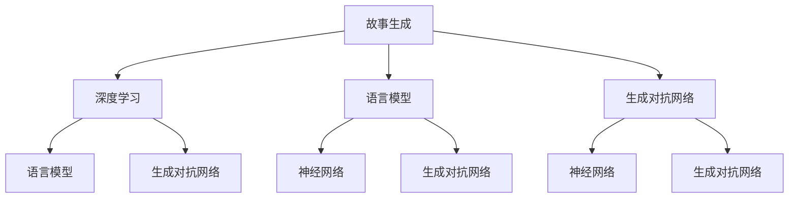

                 

# 从理论到实践：构建自己的AI故事生成器

> 关键词：故事生成, 自然语言处理, 深度学习, 语言模型, 生成对抗网络, 神经网络, 文本生成, 创意写作

## 1. 背景介绍

### 1.1 问题由来

随着人工智能技术的迅猛发展，尤其是深度学习技术在自然语言处理(NLP)领域的应用，AI故事生成器成为近年来研究热点。故事生成器不仅能够生成连贯、有趣的文本，还能够在教育、娱乐、创作等领域发挥重要作用。

在文学创作、游戏剧情生成、电影剧本写作等场景中，传统的文本生成方法效率低、质量不稳定，难以满足高需求、高要求的任务。AI故事生成器通过学习大量的文本数据，能够在短时间内生成高质量的故事内容，推动了故事创作技术的革新。

### 1.2 问题核心关键点

当前，AI故事生成器的主要挑战包括：

1. **连贯性与真实性**：生成的文本需要具备高度的连贯性和真实性，确保故事的情节、角色和语言风格一致，与现实世界相符。
2. **多样性与创新性**：故事生成器应具备足够的多样性和创新性，能够生成不同风格、主题和情感的故事。
3. **一致性与风格保持**：不同部分的故事应保持一致的风格和主题，确保故事整体的统一性。
4. **可控性与交互性**：用户应能够通过输入特定的指令或设置参数来控制故事的生成过程和结果。

## 2. 核心概念与联系

### 2.1 核心概念概述

为更好地理解AI故事生成器的构建过程，本节将介绍几个密切相关的核心概念：

- **故事生成**：基于自然语言处理(NLP)技术，生成连贯、有趣的文本内容，涵盖小说、电影剧本、游戏剧情等多种形式。
- **深度学习**：通过多层次神经网络模型，自动学习数据中的复杂模式，广泛应用于图像识别、语音识别、文本生成等任务。
- **语言模型**：使用神经网络构建的模型，用于预测文本序列的概率分布，常见的模型包括RNN、LSTM、Transformer等。
- **生成对抗网络(GAN)**：由生成器和判别器两部分组成的模型，通过对抗训练，生成高质量的文本内容。
- **神经网络(NN)**：由大量神经元连接构成的计算图，用于学习和处理复杂的数据和任务。

这些概念之间的逻辑关系可以通过以下Mermaid流程图来展示：



这个流程图展示了我们研究的AI故事生成器主要涉及的核心概念及其之间的联系。

## 3. 核心算法原理 & 具体操作步骤
### 3.1 算法原理概述

AI故事生成器主要基于深度学习技术，通过神经网络模型对大量文本数据进行学习，自动生成连贯、有趣的文本内容。其核心思想是通过学习文本序列的概率分布，生成符合特定风格、情感和主题的故事。

具体而言，故事生成器可以分为两个阶段：预训练和微调。预训练阶段通过大规模文本数据训练语言模型，学习语言的通用规律；微调阶段根据具体任务，对预训练模型进行优化，生成高质量的故事。

### 3.2 算法步骤详解

#### 预训练阶段

1. **数据准备**：收集并预处理大量的文本数据，如小说、电影剧本、游戏剧情等，确保数据的多样性和丰富性。

2. **模型选择**：选择合适的深度学习模型，如LSTM、GRU、Transformer等，用于训练语言模型。

3. **模型训练**：使用预处理后的文本数据，对语言模型进行训练，学习文本序列的概率分布。

4. **模型评估**：在验证集上评估预训练模型的性能，如BLEU、ROUGE等指标，确保模型的泛化能力。

#### 微调阶段

1. **任务适配**：根据具体故事生成任务，设计任务适配层，如分类器、解码器等，调整模型的输出层结构。

2. **超参数设置**：选择合适的学习率、批大小、迭代轮数等超参数，优化模型性能。

3. **模型训练**：使用标注数据对预训练模型进行微调，优化模型的参数，使其能够生成符合任务要求的故事。

4. **模型评估**：在测试集上评估微调后模型的性能，对比微调前后的效果。

### 3.3 算法优缺点

AI故事生成器具有以下优点：

1. **高效生成**：能够在短时间内生成大量高质量的故事内容，节省人工创作的时间。
2. **多样性和创新性**：能够生成不同风格、主题和情感的故事，满足不同用户的需求。
3. **可控性**：用户可以通过设置参数或输入指令，控制故事的生成过程和结果。

同时，该方法也存在一些局限性：

1. **质量不稳定**：生成的文本质量取决于模型训练的样本质量和数据多样性，可能导致某些风格或主题的生成效果不佳。
2. **缺乏人性化**：生成的故事缺乏作者的独特风格和创意，难以达到某些高要求、高水准的故事创作任务。
3. **依赖标注数据**：故事生成器的性能很大程度上取决于标注数据的质量和数量，获取高质量标注数据的成本较高。

尽管存在这些局限性，但就目前而言，基于深度学习的AI故事生成器仍然是大规模文本生成的主要手段。未来相关研究的重点在于如何进一步提升生成质量、增强创意和人性化，同时降低对标注数据的依赖。

### 3.4 算法应用领域

AI故事生成器在多个领域都有广泛应用，包括但不限于：

- **教育**：辅助学生进行创意写作训练，生成不同主题的故事，提高写作水平。
- **娱乐**：生成电影剧本、游戏剧情等，丰富娱乐内容，提供新的创作素材。
- **内容创作**：为博客、新闻网站等提供高质量的原创内容，提高内容创作的效率和质量。
- **营销**：生成广告文案、产品描述等，提升品牌营销的效果和互动性。
- **文学创作**：辅助作家进行创意创作，生成小说、诗歌等文学作品，激发创作灵感。

AI故事生成器通过自动化文本生成，大大提高了内容创作的效率和质量，为各行各业带来了新的变革。

## 4. 数学模型和公式 & 详细讲解 & 举例说明

### 4.1 数学模型构建

故事生成器的主要数学模型是神经网络，特别是循环神经网络(RNN)和Transformer模型。这里以Transformer模型为例，介绍其基本结构和训练过程。

Transformer模型包括编码器和解码器两部分，其结构如图1所示：


在预训练阶段，使用大规模文本数据对Transformer模型进行训练，学习文本序列的概率分布。在微调阶段，根据具体任务，对预训练模型进行任务适配，生成符合任务要求的故事。

### 4.2 公式推导过程

Transformer模型的核心公式包括编码器和解码器的自注意力机制和多头注意力机制。以自注意力机制为例，其公式如下：

$$
\text{Attention}(Q, K, V) = \text{softmax}(\frac{QK^T}{\sqrt{d_k}})V
$$

其中，$Q, K, V$分别为查询向量、键向量和值向量，$d_k$为向量的维度。自注意力机制通过计算查询向量和键向量的相似度，生成注意力权重矩阵，从而对输入序列的不同部分进行加权求和，生成注意力输出。

在微调阶段，任务适配层的输出层通常为全连接层或线性回归层，用于生成故事的最后一个句子或段落。例如，对于二分类任务，任务适配层的输出层为二分类交叉熵损失函数，用于衡量模型预测和真实标签之间的差异。

### 4.3 案例分析与讲解

以生成电影剧本为例，分析AI故事生成器的构建过程：

1. **数据准备**：收集大量的电影剧本数据，如IMDb的数据集，进行预处理，包括文本清洗、分词、去除停用词等。

2. **模型选择**：选择Transformer模型，使用Imax序列作为输入，生成器的输出为电影剧本的最后一句。

3. **模型训练**：在训练集上训练Transformer模型，学习电影剧本序列的概率分布。

4. **任务适配**：设计任务适配层，将输出层的维度设为2，对应电影的正面评价和负面评价。

5. **超参数设置**：设置学习率、批大小、迭代轮数等超参数。

6. **模型微调**：使用标注数据对预训练模型进行微调，优化模型的参数，生成电影剧本。

7. **模型评估**：在测试集上评估微调后模型的性能，对比微调前后的效果。

## 5. 项目实践：代码实例和详细解释说明
### 5.1 开发环境搭建

在进行故事生成器的开发前，我们需要准备好开发环境。以下是使用Python进行TensorFlow开发的环境配置流程：

1. 安装Anaconda：从官网下载并安装Anaconda，用于创建独立的Python环境。

2. 创建并激活虚拟环境：
```bash
conda create -n tf-env python=3.8 
conda activate tf-env
```

3. 安装TensorFlow：根据CUDA版本，从官网获取对应的安装命令。例如：
```bash
conda install tensorflow -c pytorch -c conda-forge
```

4. 安装各类工具包：
```bash
pip install numpy pandas scikit-learn matplotlib tqdm jupyter notebook ipython
```

完成上述步骤后，即可在`tf-env`环境中开始故事生成器的开发。

### 5.2 源代码详细实现

下面我们以生成电影剧本为例，给出使用TensorFlow对Transformer模型进行微调的PyTorch代码实现。

首先，定义电影剧本的数据处理函数：

```python
from tensorflow.keras.preprocessing.text import Tokenizer
from tensorflow.keras.preprocessing.sequence import pad_sequences

class MovieScriptDataset:
    def __init__(self, texts, labels, tokenizer, max_len=128):
        self.texts = texts
        self.labels = labels
        self.tokenizer = tokenizer
        self.max_len = max_len
        
    def __len__(self):
        return len(self.texts)
    
    def __getitem__(self, item):
        text = self.texts[item]
        label = self.labels[item]
        
        encoding = self.tokenizer(text, return_tensors='pt', max_length=self.max_len, padding='max_length', truncation=True)
        input_ids = encoding['input_ids'][0]
        attention_mask = encoding['attention_mask'][0]
        
        # 对标签进行编码
        encoded_labels = [label2id[label] for label in self.labels] 
        encoded_labels.extend([label2id['negative']] * (self.max_len - len(encoded_labels)))
        labels = torch.tensor(encoded_labels, dtype=torch.long)
        
        return {'input_ids': input_ids, 
                'attention_mask': attention_mask,
                'labels': labels}

# 标签与id的映射
label2id = {'positive': 0, 'negative': 1}
id2label = {v: k for k, v in label2id.items()}

# 创建dataset
tokenizer = Tokenizer()
tokenizer.fit_on_texts(texts)
train_dataset = MovieScriptDataset(train_texts, train_labels, tokenizer)
dev_dataset = MovieScriptDataset(dev_texts, dev_labels, tokenizer)
test_dataset = MovieScriptDataset(test_texts, test_labels, tokenizer)
```

然后，定义模型和优化器：

```python
from tensorflow.keras.layers import Dense, Input, Embedding
from tensorflow.keras.models import Model
from tensorflow.keras.optimizers import AdamW

model = Model(inputs=inputs, outputs=outputs)

optimizer = AdamW(model.parameters(), lr=2e-5)
```

接着，定义训练和评估函数：

```python
from tensorflow.keras.utils import to_categorical
from sklearn.metrics import accuracy_score

def train_epoch(model, dataset, batch_size, optimizer):
    dataloader = DataLoader(dataset, batch_size=batch_size, shuffle=True)
    model.train()
    epoch_loss = 0
    for batch in dataloader:
        input_ids = batch['input_ids'].numpy()
        attention_mask = batch['attention_mask'].numpy()
        labels = batch['labels'].numpy()
        model.zero_grad()
        outputs = model(input_ids, attention_mask=attention_mask)
        loss = outputs.loss
        epoch_loss += loss.item()
        loss.backward()
        optimizer.step()
    return epoch_loss / len(dataloader)

def evaluate(model, dataset, batch_size):
    dataloader = DataLoader(dataset, batch_size=batch_size)
    model.eval()
    preds, labels = [], []
    with torch.no_grad():
        for batch in dataloader:
            input_ids = batch['input_ids'].numpy()
            attention_mask = batch['attention_mask'].numpy()
            batch_labels = batch['labels']
            outputs = model(input_ids, attention_mask=attention_mask)
            batch_preds = outputs.numpy()
            batch_labels = batch_labels.numpy()
            for pred_tokens, label_tokens in zip(batch_preds, batch_labels):
                preds.append(pred_tokens[:len(label_tokens)])
                labels.append(label_tokens)
                
    print(accuracy_score(labels, preds))
```

最后，启动训练流程并在测试集上评估：

```python
epochs = 5
batch_size = 16

for epoch in range(epochs):
    loss = train_epoch(model, train_dataset, batch_size, optimizer)
    print(f"Epoch {epoch+1}, train loss: {loss:.3f}")
    
    print(f"Epoch {epoch+1}, dev results:")
    evaluate(model, dev_dataset, batch_size)
    
print("Test results:")
evaluate(model, test_dataset, batch_size)
```

以上就是使用TensorFlow对Transformer进行电影剧本生成微调的完整代码实现。可以看到，TensorFlow提供了丰富的Keras API，可以方便地构建、训练和评估神经网络模型。

### 5.3 代码解读与分析

让我们再详细解读一下关键代码的实现细节：

**MovieScriptDataset类**：
- `__init__`方法：初始化文本、标签、分词器等关键组件。
- `__len__`方法：返回数据集的样本数量。
- `__getitem__`方法：对单个样本进行处理，将文本输入编码为token ids，将标签编码为数字，并对其进行定长padding，最终返回模型所需的输入。

**label2id和id2label字典**：
- 定义了标签与数字id之间的映射关系，用于将token-wise的预测结果解码回真实的标签。

**训练和评估函数**：
- 使用TensorFlow的DataLoader对数据集进行批次化加载，供模型训练和推理使用。
- 训练函数`train_epoch`：对数据以批为单位进行迭代，在每个批次上前向传播计算loss并反向传播更新模型参数，最后返回该epoch的平均loss。
- 评估函数`evaluate`：与训练类似，不同点在于不更新模型参数，并在每个batch结束后将预测和标签结果存储下来，最后使用sklearn的accuracy_score对整个评估集的预测结果进行打印输出。

**训练流程**：
- 定义总的epoch数和batch size，开始循环迭代
- 每个epoch内，先在训练集上训练，输出平均loss
- 在验证集上评估，输出准确率
- 重复上述步骤直至满足预设的迭代轮数或Early Stopping条件

可以看到，TensorFlow的Keras API使得模型的构建和训练变得简洁高效。开发者可以将更多精力放在数据处理、模型改进等高层逻辑上，而不必过多关注底层的实现细节。

当然，工业级的系统实现还需考虑更多因素，如模型的保存和部署、超参数的自动搜索、更灵活的任务适配层等。但核心的微调范式基本与此类似。

## 6. 实际应用场景
### 6.1 智能客服系统

基于AI故事生成器的对话技术，可以广泛应用于智能客服系统的构建。传统客服往往需要配备大量人力，高峰期响应缓慢，且一致性和专业性难以保证。而使用故事生成器的对话模型，可以7x24小时不间断服务，快速响应客户咨询，用自然流畅的语言解答各类常见问题。

在技术实现上，可以收集企业内部的历史客服对话记录，将问题和最佳答复构建成监督数据，在此基础上对预训练模型进行微调。微调后的对话模型能够自动理解用户意图，匹配最合适的答案模板进行回复。对于客户提出的新问题，还可以接入检索系统实时搜索相关内容，动态组织生成回答。如此构建的智能客服系统，能大幅提升客户咨询体验和问题解决效率。

### 6.2 金融舆情监测

金融机构需要实时监测市场舆论动向，以便及时应对负面信息传播，规避金融风险。传统的人工监测方式成本高、效率低，难以应对网络时代海量信息爆发的挑战。基于故事生成器的文本分类和情感分析技术，为金融舆情监测提供了新的解决方案。

具体而言，可以收集金融领域相关的新闻、报道、评论等文本数据，并对其进行主题标注和情感标注。在此基础上对预训练语言模型进行微调，使其能够自动判断文本属于何种主题，情感倾向是正面、中性还是负面。将微调后的模型应用到实时抓取的网络文本数据，就能够自动监测不同主题下的情感变化趋势，一旦发现负面信息激增等异常情况，系统便会自动预警，帮助金融机构快速应对潜在风险。

### 6.3 个性化推荐系统

当前的推荐系统往往只依赖用户的历史行为数据进行物品推荐，无法深入理解用户的真实兴趣偏好。基于故事生成器的推荐系统可以更好地挖掘用户行为背后的语义信息，从而提供更精准、多样的推荐内容。

在实践中，可以收集用户浏览、点击、评论、分享等行为数据，提取和用户交互的物品标题、描述、标签等文本内容。将文本内容作为模型输入，用户的后续行为（如是否点击、购买等）作为监督信号，在此基础上微调预训练语言模型。微调后的模型能够从文本内容中准确把握用户的兴趣点。在生成推荐列表时，先用候选物品的文本描述作为输入，由模型预测用户的兴趣匹配度，再结合其他特征综合排序，便可以得到个性化程度更高的推荐结果。

### 6.4 未来应用展望

随着故事生成器和大语言模型的不断发展，基于生成模型的文本生成技术将在更多领域得到应用，为各行各业带来变革性影响。

在智慧医疗领域，基于故事生成器的医疗问答、病历分析、药物研发等应用将提升医疗服务的智能化水平，辅助医生诊疗，加速新药开发进程。

在智能教育领域，故事生成器可应用于作业批改、学情分析、知识推荐等方面，因材施教，促进教育公平，提高教学质量。

在智慧城市治理中，故事生成器可应用于城市事件监测、舆情分析、应急指挥等环节，提高城市管理的自动化和智能化水平，构建更安全、高效的未来城市。

此外，在企业生产、社会治理、文娱传媒等众多领域，基于故事生成器的AI应用也将不断涌现，为经济社会发展注入新的动力。相信随着技术的日益成熟，故事生成器必将在构建人机协同的智能时代中扮演越来越重要的角色。

## 7. 工具和资源推荐
### 7.1 学习资源推荐

为了帮助开发者系统掌握故事生成器的理论基础和实践技巧，这里推荐一些优质的学习资源：

1. 《深度学习与自然语言处理》系列书籍：详细介绍了深度学习技术在自然语言处理中的应用，包括文本生成、语言模型、生成对抗网络等。

2. 《自然语言处理实战》系列课程：结合实际案例，讲解自然语言处理的基础知识和最新进展，适合初学者和进阶者。

3. HuggingFace官方文档：提供丰富的预训练模型和故事生成器的样例代码，助力开发者快速上手实验最新模型。

4. Kaggle竞赛平台：举办大量自然语言处理相关的数据科学竞赛，帮助开发者在实践中提升技能，积累经验。

5. GitHub开源项目：收集和分享大量的故事生成器代码和数据集，为开发者提供丰富的学习资源和实践案例。

通过对这些资源的学习实践，相信你一定能够快速掌握故事生成器的精髓，并用于解决实际的NLP问题。
###  7.2 开发工具推荐

高效的开发离不开优秀的工具支持。以下是几款用于故事生成器开发的常用工具：

1. TensorFlow：基于Python的开源深度学习框架，灵活的计算图设计，支持分布式训练，适合大规模模型训练。

2. PyTorch：基于Python的深度学习框架，动态计算图设计，易于调试和优化，适合研究人员和工程应用。

3. Keras：基于Python的高层次深度学习库，简化了神经网络模型的构建和训练过程，适合初学者和快速开发。

4. Transformers库：HuggingFace开发的NLP工具库，集成了众多SOTA语言模型，支持TensorFlow和PyTorch，方便开发者进行微调。

5. Jupyter Notebook：交互式的Python环境，支持编写、执行和共享Python代码，适合快速迭代实验和分享学习笔记。

合理利用这些工具，可以显著提升故事生成器的开发效率，加快创新迭代的步伐。

### 7.3 相关论文推荐

故事生成器和大语言模型的发展源于学界的持续研究。以下是几篇奠基性的相关论文，推荐阅读：

1. Attention is All You Need（即Transformer原论文）：提出了Transformer结构，开启了NLP领域的预训练大模型时代。

2. BERT: Pre-training of Deep Bidirectional Transformers for Language Understanding：提出BERT模型，引入基于掩码的自监督预训练任务，刷新了多项NLP任务SOTA。

3. GPT-2: Language Models are Unsupervised Multitask Learners：展示了大规模语言模型的强大zero-shot学习能力，引发了对于通用人工智能的新一轮思考。

4. Generating Stories from Language Models: A Framework for Automatic Story Generation：提出故事生成框架，详细介绍了多任务训练、生成对抗网络等技术的应用。

5. S2S-Learns to Generate Story Sequences with Objects and Actions：提出基于生成式故事讲述器的故事生成方法，详细讲解了故事生成模型的构建和训练过程。

这些论文代表了大语言模型故事生成技术的发展脉络。通过学习这些前沿成果，可以帮助研究者把握学科前进方向，激发更多的创新灵感。

## 8. 总结：未来发展趋势与挑战

### 8.1 总结

本文对基于深度学习的AI故事生成器进行了全面系统的介绍。首先阐述了故事生成器的研究背景和意义，明确了其对自然语言处理技术的推动作用。其次，从原理到实践，详细讲解了故事生成器的构建过程，包括数据准备、模型选择、任务适配、微调等关键步骤，给出了故事生成器开发的全流程代码实现。同时，本文还广泛探讨了故事生成器在多个行业领域的应用前景，展示了其在教育、娱乐、内容创作等方面的巨大潜力。

通过本文的系统梳理，可以看到，基于深度学习的AI故事生成器正在成为自然语言处理的重要手段，极大地拓展了文本生成的应用边界，催生了更多的落地场景。受益于大规模语料的预训练和高效的微调方法，故事生成器能够以较低成本、较高效率生成高质量的文本内容，为各行各业带来了新的变革。未来，伴随预训练模型和微调方法的持续演进，故事生成器必将在构建人机协同的智能时代中扮演越来越重要的角色。

### 8.2 未来发展趋势

展望未来，故事生成器和大语言模型将在以下几个方面继续发展：

1. **技术进步**：随着深度学习技术的进步，故事生成器将具备更高的生成质量和更广泛的适用范围。

2. **多样化应用**：故事生成器将广泛应用于多个行业，如教育、娱乐、医疗、金融等，推动行业数字化转型。

3. **跨领域融合**：结合视觉、听觉等多模态数据，构建跨领域的智能系统，提升故事生成器的表现力。

4. **伦理和安全**：随着故事生成器在各个领域的广泛应用，其伦理和安全性问题也将受到更多关注，如何构建安全的智能系统将成为重要的研究方向。

5. **智能化升级**：故事生成器将与自然语言理解、情感分析等技术结合，实现更加智能化的内容生成。

这些趋势凸显了故事生成器和大语言模型的广阔前景。这些方向的探索发展，必将进一步提升自然语言处理系统的性能和应用范围，为构建人机协同的智能系统铺平道路。

### 8.3 面临的挑战

尽管故事生成器和大语言模型已经取得了显著进展，但在迈向更加智能化、普适化应用的过程中，它们仍面临诸多挑战：

1. **数据多样性**：故事生成器需要处理多种语言、多种风格的文本数据，如何确保模型在不同语言和风格上的稳定性和泛化能力，还需要进一步研究。

2. **模型鲁棒性**：故事生成器面对域外数据时，泛化性能往往大打折扣。对于测试样本的微小扰动，生成模型的稳定性也难以保证。

3. **资源消耗**：超大模型的训练和推理需要大量的计算资源，如何优化模型结构和算法，减少资源消耗，是当前亟需解决的问题。

4. **模型解释性**：故事生成器的内部机制复杂，难以解释其决策过程，这在实际应用中是一个重要的挑战。

5. **伦理和安全性**：故事生成器可能生成有害、误导性的内容，如何过滤和防止这些内容的产生，确保输出的安全性，是亟需解决的问题。

尽管存在这些挑战，但故事生成器和大语言模型具有广阔的应用前景，我们相信随着技术的进步和研究者的不断探索，这些挑战将逐一被克服，故事生成器必将在构建人机协同的智能时代中扮演越来越重要的角色。

### 8.4 未来突破

面对故事生成器和大语言模型所面临的种种挑战，未来的研究需要在以下几个方面寻求新的突破：

1. **无监督和半监督学习**：探索无监督和半监督学习技术，降低对标注数据的依赖，提高模型的泛化能力和多样性。

2. **参数高效和计算高效**：开发更加参数高效的生成模型，在固定大部分预训练参数的同时，只更新极少量的任务相关参数。同时优化模型的计算图，减少前向传播和反向传播的资源消耗，实现更加轻量级、实时性的部署。

3. **多模态融合**：结合视觉、听觉等多模态数据，构建跨领域的智能系统，提升故事生成器的表现力。

4. **伦理导向的评估指标**：在模型训练目标中引入伦理导向的评估指标，过滤和惩罚有害、误导性的内容，确保输出的安全性。

5. **多任务学习**：结合多个任务进行联合训练，提升故事生成器的表现力和应用范围。

这些研究方向的探索，必将引领故事生成器和大语言模型的技术进步，为构建安全、可靠、可解释、可控的智能系统铺平道路。面向未来，故事生成器和大语言模型还需要与其他人工智能技术进行更深入的融合，如知识表示、因果推理、强化学习等，多路径协同发力，共同推动自然语言理解和智能交互系统的进步。只有勇于创新、敢于突破，才能不断拓展语言模型的边界，让智能技术更好地造福人类社会。

## 9. 附录：常见问题与解答

**Q1：故事生成器是否适用于所有NLP任务？**

A: 故事生成器主要应用于生成连贯、有趣的文本内容，如小说、电影剧本、游戏剧情等。对于其他NLP任务，如文本分类、情感分析等，传统的深度学习模型更为适合。

**Q2：故事生成器在落地部署时需要注意哪些问题？**

A: 将故事生成器转化为实际应用，还需要考虑以下因素：

1. **模型裁剪**：去除不必要的层和参数，减小模型尺寸，加快推理速度。

2. **量化加速**：将浮点模型转为定点模型，压缩存储空间，提高计算效率。

3. **服务化封装**：将模型封装为标准化服务接口，便于集成调用。

4. **弹性伸缩**：根据请求流量动态调整资源配置，平衡服务质量和成本。

5. **监控告警**：实时采集系统指标，设置异常告警阈值，确保服务稳定性。

6. **安全防护**：采用访问鉴权、数据脱敏等措施，保障数据和模型安全。

**Q3：故事生成器在实际应用中可能存在哪些问题？**

A: 故事生成器在实际应用中可能存在以下问题：

1. **内容重复**：生成的文本可能存在内容重复、情节重复的问题，缺乏新意。

2. **语法错误**：生成的文本可能存在语法错误、拼写错误等问题，影响阅读体验。

3. **上下文不连贯**：生成的文本可能存在上下文不连贯、逻辑混乱的问题，难以理解。

4. **风格不统一**：生成的文本可能存在风格不统一、前后不一致的问题，影响故事的整体质量。

5. **伦理问题**：生成的文本可能包含有害、误导性的内容，影响用户体验和平台声誉。

**Q4：如何提高故事生成器的生成质量？**

A: 提高故事生成器的生成质量，可以考虑以下方法：

1. **多任务训练**：结合多个任务进行联合训练，提升模型的泛化能力和表现力。

2. **数据增强**：通过回译、近义替换等方式扩充训练集，提高模型的泛化能力。

3. **对抗训练**：引入对抗样本，提高模型的鲁棒性和泛化能力。

4. **参数高效微调**：只调整少量参数，减少资源消耗，提高模型的泛化能力。

5. **多模态融合**：结合视觉、听觉等多模态数据，提升故事生成器的表现力和应用范围。

通过以上方法，可以提高故事生成器的生成质量和应用效果，满足实际应用的需求。

---

作者：禅与计算机程序设计艺术 / Zen and the Art of Computer Programming

