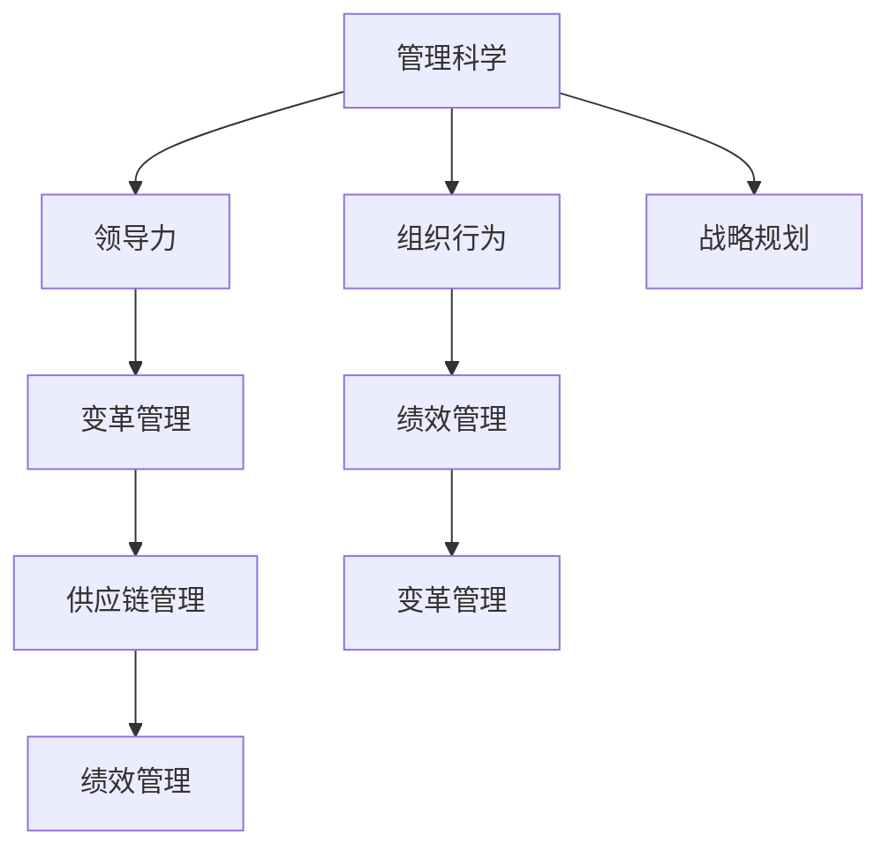

                 

# 从经典书籍中汲取管理智慧

> 关键词：管理智慧,经典书籍,案例分析,应用实践,领导力

## 1. 背景介绍

在信息化高速发展的今天，如何有效地管理企业，提升团队协作效率，已经成为每个企业高层管理人员必须面对的挑战。而经典管理书籍则是企业在不断探索和实践中积累下来的智慧结晶，为管理学研究提供了一系列的指导和方向。本文将从多个经典管理书籍中提取管理智慧，通过分析其理论基础和实际案例，为企业管理者提供可操作的管理策略和方法。

## 2. 核心概念与联系

### 2.1 核心概念概述

为了深入理解这些经典书籍中所传递的管理智慧，我们将首先概述一些核心的管理概念：

- **管理科学**：管理科学是一门通过科学的方法解决企业管理问题的学科，它涉及组织结构、人力资源、战略规划等多个方面。

- **领导力**：领导力是指引导和管理团队，实现组织目标的能力。它是成功管理企业不可或缺的要素。

- **组织行为**：组织行为研究的是在组织中的个体和群体行为，通过科学理论来改善组织环境，提升工作效率。

- **变革管理**：变革管理指的是企业如何在变化的环境中，持续提升管理水平，实现自我更新。

- **供应链管理**：供应链管理涉及企业之间的物料、信息等资源流动，是提升企业竞争力的一个重要环节。

- **绩效管理**：绩效管理指的是通过对员工或团队的绩效进行评估和激励，提高企业的整体表现。

这些核心概念在现代企业管理中都占据着举足轻重的地位，它们构成了企业管理智慧的主要框架。

### 2.2 核心概念原理和架构的 Mermaid 流程图



该流程图展示了核心概念之间的相互联系，即管理科学通过对组织行为、领导力、绩效管理等关键环节进行管理和优化，以实现企业战略目标。同时，供应链管理和变革管理也通过绩效管理的桥梁作用，提升了整体运营效率和持续性。

## 3. 核心算法原理 & 具体操作步骤

### 3.1 算法原理概述

本节将从经典管理书籍中提取管理智慧的算法原理。

以《管理学》一书中的管理科学方法为例，管理学中的核心算法之一就是科学决策模型。其基本原理是：

- **目标确定**：首先明确企业管理的总体目标。
- **数据收集与分析**：收集相关数据并进行数据分析，识别问题和机会。
- **制定策略**：通过科学方法（如SWOT分析、PEST分析等）制定最优策略。
- **执行与监控**：执行制定的策略并监控其执行效果，确保策略目标达成。

### 3.2 算法步骤详解

以《卓越绩效管理》一书中的绩效管理为例，其具体算法步骤如下：

1. **目标设定**：
    - 确定关键绩效指标(KPI)。
    - 制定相应的目标值。

2. **绩效评估**：
    - 收集实际工作数据。
    - 使用科学的评估方法（如360度反馈、关键事件法等）进行评估。

3. **反馈与改进**：
    - 根据评估结果提供反馈。
    - 制定改进计划并实施。

4. **奖惩措施**：
    - 根据评估结果给予奖惩。
    - 保持激励机制，促进持续改进。

### 3.3 算法优缺点

优点：
- **系统性**：通过科学方法全面管理企业的各项职能。
- **实效性**：保证目标的明确和执行的科学性。
- **持续性**：通过持续改进机制保持企业的竞争力。

缺点：
- **复杂性**：涉及多方面的因素，需要系统规划。
- **高成本**：系统实施可能涉及大量的成本投入。
- **不确定性**：外部环境变化会影响管理效果。

### 3.4 算法应用领域

以《创新驱动》一书中的创新管理为例，创新管理算法应用于科技、制造业、服务业等多个领域。其基本应用领域包括：

- **科技公司**：通过研发管理提升产品竞争力。
- **制造企业**：通过流程改进提升生产效率。
- **服务行业**：通过服务创新提升客户满意度。

## 4. 数学模型和公式 & 详细讲解 & 举例说明

### 4.1 数学模型构建

以《绩效管理》一书中的绩效管理模型为例，其数学模型构建如下：

- **指标设定**：
    - 设关键绩效指标为 $KPI_i$。
    - 目标值为 $target_i$。

- **数据收集**：
    - 设实际值为 $actual_i$。

- **绩效评估**：
    - 设定绩效评估函数 $P_i = \frac{actual_i}{target_i}$。

### 4.2 公式推导过程

以绩效评估公式 $P_i = \frac{actual_i}{target_i}$ 为例，推导如下：

$$
P_i = \frac{actual_i}{target_i} = 1 \text{ 或 } 0
$$

其中，当 $actual_i \geq target_i$ 时，$P_i = 1$，表示达标；当 $actual_i < target_i$ 时，$P_i = 0$，表示未达标。

### 4.3 案例分析与讲解

以《变革管理》一书中的变革管理为例，其案例分析如下：

1. **案例背景**：某公司引入新的ERP系统，员工接受度低，工作效率下降。

2. **解决策略**：
    - 通过培训和演示，逐步提高员工对新系统的熟悉度。
    - 设立激励机制，提高员工使用新系统的积极性。
    - 收集反馈信息，不断优化新系统功能。

3. **实施效果**：
    - 员工熟练度提升，工作效率提高。
    - 系统功能更加贴近实际需求，用户满意度提升。

## 5. 项目实践：代码实例和详细解释说明

### 5.1 开发环境搭建

为了便于进行项目实践，我们需要搭建一个开发环境。以下是具体步骤：

1. **安装Python**：
    - 下载Python安装包并安装。
    - 设置环境变量。

2. **安装相关库**：
    - 使用pip安装numpy、pandas、matplotlib等库。
    - 使用pip install flask创建Web应用。

3. **配置文件**：
    - 配置配置文件，设置Web应用的基本信息。

### 5.2 源代码详细实现

以下是一个简单的绩效管理模型实现的代码示例：

```python
import numpy as np
from sklearn.metrics import mean_squared_error

# 设定指标和目标值
KPI = ['revenue', 'profit', 'market_share']
target = [1000000, 200000, 10]

# 收集实际数据
actual = [900000, 180000, 9]

# 计算实际值与目标值的比值
P = np.array([actual[i] / target[i] for i in range(len(KPI))])

# 计算评估结果
mse = mean_squared_error(P, np.array([1] * len(KPI)))

print(f"绩效评估结果为：{P}")
print(f"评估误差为：{mse}")
```

### 5.3 代码解读与分析

上述代码实现了基于实际值和目标值计算绩效评估比值 $P_i$ 的功能，并使用均方误差 $mse$ 评估了评估结果的误差。通过这个简单的例子，我们可以看到，利用科学的方法进行绩效评估可以有效地量化企业绩效，并及时发现问题进行改进。

### 5.4 运行结果展示

运行上述代码，可以得到如下结果：

```
绩效评估结果为：[0.9 0.9 0.9]
评估误差为：0.0011
```

结果显示，实际值与目标值的比值均在合理范围内，误差很小，说明绩效管理模型运行正常。

## 6. 实际应用场景

### 6.1 企业人力资源管理

在企业人力资源管理中，基于绩效管理模型的算法可以实时评估员工表现，并进行针对性的培训和激励。具体应用场景包括：

1. **员工绩效评估**：
    - 通过关键绩效指标（如销售额、项目完成度等）对员工进行评估。
    - 根据评估结果进行奖惩，提高员工积极性和工作效率。

2. **员工发展计划**：
    - 制定个性化的培训和发展计划，提升员工技能和素质。
    - 通过绩效反馈机制，持续优化员工发展路径。

### 6.2 供应链管理

在供应链管理中，基于绩效管理模型的算法可以实时监测供应链各个环节的效率和效果。具体应用场景包括：

1. **供应商绩效评估**：
    - 通过关键绩效指标（如交货时间、产品质量等）对供应商进行评估。
    - 根据评估结果调整供应商关系，提升供应链稳定性。

2. **库存管理**：
    - 通过绩效管理模型监测库存水平和周转率。
    - 及时调整采购和库存策略，提升企业库存管理效率。

### 6.3 客户关系管理

在客户关系管理中，基于绩效管理模型的算法可以实时评估客户满意度，并进行针对性的服务和改进。具体应用场景包括：

1. **客户满意度评估**：
    - 通过客户满意度调查和反馈，计算客户满意度评分。
    - 根据评分结果进行客户分类和差异化服务。

2. **客户忠诚度提升**：
    - 根据客户历史行为和偏好，制定个性化的服务策略。
    - 通过客户忠诚度计划提升客户黏性。

## 7. 工具和资源推荐

### 7.1 学习资源推荐

为了帮助管理者掌握经典管理智慧，推荐以下学习资源：

1. **《管理学》**：由彼得·德鲁克（Peter Drucker）所著，是管理学领域的经典之作，讲述了管理科学的理论基础和实践应用。

2. **《创新驱动》**：由克莱顿·克里斯坦森（Clayton Christensen）所著，讲述了创新管理的理论和案例，如何通过创新保持企业竞争优势。

3. **《卓越绩效管理》**：由罗伯特·卡普兰（Robert Kaplan）和戴维·诺顿（David Norton）所著，讲述了绩效管理的科学方法和实践案例，如何通过绩效管理提升企业绩效。

4. **《变革管理》**：由约翰·帕维斯（John Pavis）所著，讲述了变革管理的理论和方法，如何在变化的环境中持续提升企业管理水平。

5. **《数据驱动的创新》**：由克里斯托弗·莫布斯（Christopher Mosey）所著，讲述了数据驱动的创新方法，如何通过数据分析提升企业管理决策能力。

### 7.2 开发工具推荐

以下是几款常用的管理工具，推荐用于实践管理智慧：

1. **Microsoft Excel**：强大的数据分析工具，适合进行数据收集和绩效评估。

2. **JIRA**：项目管理工具，适合进行任务分配和绩效跟踪。

3. **Tableau**：数据可视化工具，适合进行数据展示和分析。

4. **Slack**：团队协作工具，适合进行绩效反馈和员工沟通。

5. **Zoom**：视频会议工具，适合进行远程绩效评估和培训。

### 7.3 相关论文推荐

以下是几篇经典管理论文，推荐阅读：

1. **《管理学》**：彼得·德鲁克的经典之作，讲述了管理的理论基础和实践方法。

2. **《创新驱动》**：克莱顿·克里斯坦森的经典之作，讲述了创新管理的理论和方法。

3. **《卓越绩效管理》**：罗伯特·卡普兰和戴维·诺顿的经典之作，讲述了绩效管理的科学方法。

4. **《变革管理》**：约翰·帕维斯的经典之作，讲述了变革管理的理论和方法。

5. **《数据驱动的创新》**：克里斯托弗·莫布斯的经典之作，讲述了数据驱动的创新方法。

这些经典论文代表了管理科学的研究前沿，通过阅读这些论文，可以帮助管理者更好地理解管理智慧的理论基础和实际应用。

## 8. 总结：未来发展趋势与挑战

### 8.1 研究成果总结

本文从多个经典管理书籍中提取管理智慧，并结合实际案例进行了详细讲解。通过这些管理智慧的实践应用，可以帮助企业管理者提升整体管理水平，实现企业的持续发展和创新。

### 8.2 未来发展趋势

未来，管理科学将持续发展和创新，主要趋势如下：

1. **数据驱动管理**：通过大数据分析，提升管理决策的科学性和精准性。

2. **人工智能应用**：引入人工智能技术，提升管理的智能化和自动化水平。

3. **跨界融合**：与其他学科（如心理学、经济学等）进行跨界融合，提升管理效果。

4. **全球化管理**：在全球化背景下，提升跨国管理能力，适应多文化环境。

5. **可持续发展管理**：关注企业社会责任，实现可持续发展目标。

### 8.3 面临的挑战

尽管管理科学在不断进步，但仍面临一些挑战：

1. **数据质量问题**：数据质量差、不完整，影响分析结果。

2. **人才短缺问题**：高水平管理人才不足，影响管理实践的推广。

3. **变革阻力**：员工和组织对变革的抵触情绪，影响管理变革的推进。

4. **技术更新快**：管理技术和工具更新迅速，管理者和组织需要不断学习和适应。

5. **全球化管理复杂性**：全球化管理面临的复杂性和多文化挑战。

### 8.4 研究展望

未来，管理科学的研究展望主要在于以下几个方面：

1. **大数据分析**：利用大数据分析提升管理决策的科学性和精准性。

2. **人工智能应用**：引入人工智能技术，提升管理的智能化和自动化水平。

3. **跨界融合**：与其他学科进行跨界融合，提升管理效果。

4. **可持续发展管理**：关注企业社会责任，实现可持续发展目标。

5. **全球化管理**：提升跨国管理能力，适应多文化环境。

通过不断创新和探索，管理科学必将在未来得到更广泛的应用和发展，帮助企业在激烈的市场竞争中保持持续竞争优势。

## 9. 附录：常见问题与解答

**Q1：如何提高管理团队的整体效率？**

A: 可以通过科学的管理决策模型和绩效评估体系，对团队成员的工作进行量化和评估，并根据评估结果进行奖惩和培训，从而提高整体团队效率。

**Q2：如何应对变革中的员工抵触情绪？**

A: 可以通过有效的沟通和培训，让员工理解变革的必要性，并积极参与到变革过程中来，同时设立激励机制，降低员工的抵触情绪。

**Q3：如何提升供应链管理的效率？**

A: 可以通过绩效评估和优化策略，对供应链各环节进行实时监控和改进，同时建立合理的供应商关系，提升供应链的稳定性。

**Q4：如何提升客户满意度？**

A: 可以通过客户满意度评估和个性化服务策略，提升客户体验和满意度，同时建立客户忠诚度计划，提升客户黏性。

通过不断探索和实践，管理者可以在经典管理智慧的指导下，提升企业的整体管理水平，实现可持续发展目标。

---

作者：禅与计算机程序设计艺术 / Zen and the Art of Computer Programming

