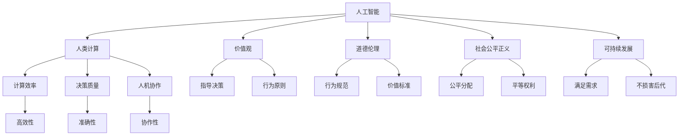

                 

# 以人为本的科技未来：人类计算的价值观

> 关键词：人工智能, 人类计算, 价值观, 道德伦理, 社会影响, 可持续发展

## 1. 背景介绍

### 1.1 问题由来
随着科技的迅猛发展，特别是人工智能(AI)技术的崛起，人类社会进入了一个前所未有的智能时代。然而，在享受AI带来的便利的同时，人们也开始反思科技与人性的关系，担忧科技的发展是否真正服务于人类，是否满足了社会的公平正义。本文旨在探讨如何通过“以人为本”的理念，引导AI技术的健康发展，确保其能够服务于人类的福祉，促进社会公平正义的实现。

### 1.2 问题核心关键点
- 人工智能技术的飞速发展是否真正惠及人类，是否满足了社会的公平正义。
- 如何通过“以人为本”的理念，引导AI技术的健康发展，确保其能够服务于人类的福祉，促进社会公平正义的实现。
- 如何在AI技术的设计、应用中融入道德伦理，避免其潜在的负面影响。

### 1.3 问题研究意义
探讨“以人为本”的科技发展理念，有助于我们更好地理解科技与社会的互动关系，引导科技的健康发展，确保其能够真正服务于人类福祉，促进社会的公平正义。这对于构建一个更加和谐、可持续发展的未来社会具有重要意义。

## 2. 核心概念与联系

### 2.1 核心概念概述

为更好地理解“以人为本”的科技发展理念，本节将介绍几个密切相关的核心概念：

- 人工智能(AI)：一种模拟人类智能的技术，包括机器学习、深度学习、自然语言处理等。AI通过算法和数据模型，实现对复杂问题的自主决策和自主学习。
- 人类计算：一种将AI技术与人类智慧相结合的计算方式，旨在通过人机协作，提升计算效率和决策质量。
- 价值观：在AI技术设计和应用中，指导决策和行为的基本信念和原则。
- 道德伦理：涉及AI技术在社会、经济、文化等多方面应遵循的行为规范和价值标准。
- 社会公平正义：一个社会系统内的资源和机会公平分配，人人享有平等权利和机会。
- 可持续发展：在满足当代社会需求的同时，不损害后代人满足其需求的能力。

这些核心概念之间的逻辑关系可以通过以下Mermaid流程图来展示：



这个流程图展示了一系列的连贯概念：

1. 人工智能通过算法和数据模型实现自主决策和自主学习。
2. 人类计算通过将AI技术与人类智慧结合，提升计算效率和决策质量。
3. 价值观和道德伦理指导AI技术和人类计算的设计和应用。
4. 社会公平正义涉及资源和机会的公平分配，人人享有平等权利和机会。
5. 可持续发展确保满足当代需求的同时不损害后代满足其需求的能力。
6. 计算效率、决策质量和人机协作是人类计算的核心优势。
7. 指导决策和行为原则、行为规范和价值标准构成价值观的核心要素。
8. 公平分配和权利平等构成社会公平正义的基本要求。
9. 满足当前需求而不损害后代满足其需求的能力，构成可持续发展的关键目标。

## 3. 核心算法原理 & 具体操作步骤

### 3.1 算法原理概述

“以人为本”的科技发展理念在AI技术中的应用，本质上是将“以人为本”的价值导向融入AI技术的设计和应用过程中。这需要从多个方面进行深入探索和实践。

1. **价值观融入AI设计**：在AI模型的开发过程中，明确设计的价值观目标，如促进社会公平正义、保护个人隐私、提升决策透明性等。
2. **道德伦理考量**：在AI模型训练和应用过程中，始终将道德伦理作为重要考量因素，确保模型行为符合社会伦理规范，如避免偏见、歧视，保护用户隐私等。
3. **人机协作优化**：通过人机协作的方式，发挥人类智慧与AI技术的优势，提升计算效率和决策质量。
4. **社会影响评估**：对AI技术可能产生的社会影响进行全面评估，确保其能够积极服务于社会，避免潜在的负面影响。
5. **可持续发展设计**：在设计AI系统时，考虑其对环境、资源的影响，确保系统具备可持续发展的特性。

### 3.2 算法步骤详解

基于“以人为本”的科技发展理念，AI技术的应用需要遵循以下步骤：

**Step 1: 明确价值导向**
- 确定AI系统的设计目标，如促进社会公平正义、提升决策透明性等。
- 建立明确的价值观框架，如社会责任、用户隐私保护等。

**Step 2: 伦理道德审查**
- 进行全面的伦理道德审查，确保AI系统的设计符合道德伦理规范。
- 识别和解决潜在的社会伦理问题，如算法偏见、隐私保护等。

**Step 3: 人机协作设计**
- 设计人机协作机制，发挥人类智慧和AI技术的优势。
- 确定人机交互界面，提升用户体验。

**Step 4: 社会影响评估**
- 对AI系统的潜在社会影响进行全面评估，确保其能够积极服务于社会。
- 通过实验和用户反馈，调整和优化系统设计。

**Step 5: 可持续发展设计**
- 考虑AI系统对环境、资源的影响，采用节能环保的设计方案。
- 确保系统具备可持续发展的特性，减少对自然资源的依赖。

### 3.3 算法优缺点

基于“以人为本”的科技发展理念的AI技术，具有以下优点：
1. 促进社会公平正义：通过明确价值观目标和伦理道德规范，确保AI技术能够积极服务于社会，促进公平正义的实现。
2. 提升决策质量：通过人机协作，发挥人类智慧和AI技术的优势，提升决策质量。
3. 保护隐私：在设计过程中，始终将隐私保护作为重要考量因素，确保用户数据的安全。
4. 可持续性设计：通过考虑环境、资源的影响，确保AI系统的可持续性。

同时，该方法也存在以下局限性：
1. 复杂性高：在AI系统的设计和应用过程中，需要综合考虑多种因素，设计复杂度较高。
2. 实施成本高：明确价值观目标和伦理道德规范，并进行全面的伦理道德审查，可能需要较高的成本和资源。
3. 不确定性：在评估AI系统的社会影响时，存在一定的不可预测性。
4. 技术依赖：过度依赖技术手段，可能忽视了人文关怀和伦理道德的实质性问题。

### 3.4 算法应用领域

基于“以人为本”的科技发展理念的AI技术，在多个领域中得到了广泛应用：

- 医疗健康：通过AI技术进行疾病诊断、个性化治疗方案推荐等，确保医疗服务的公平性和可及性。
- 教育培训：利用AI技术进行个性化学习、智能辅导等，提升教育资源的公平分配。
- 公共安全：通过AI技术进行犯罪预防、灾害预警等，确保公共安全。
- 环境保护：通过AI技术进行环境监测、资源优化等，促进可持续发展。
- 金融服务：通过AI技术进行风险评估、智能投顾等，确保金融服务的公平性和透明度。
- 智能交通：通过AI技术进行交通流量优化、智能调度等，提升交通系统的效率和公平性。

## 4. 数学模型和公式 & 详细讲解  
### 4.1 数学模型构建

本节将使用数学语言对“以人为本”的科技发展理念在AI技术中的应用进行更加严格的刻画。

假设AI系统需要处理的任务为 $T$，系统的设计目标为 $G$，系统的实现方式为 $M$，系统的社会影响为 $S$，系统的可持续发展能力为 $E$。则“以人为本”的科技发展理念在AI系统中的应用模型可以表示为：

$$
M = f(T, G, S, E)
$$

其中，$f$ 表示映射函数，将任务 $T$、设计目标 $G$、社会影响 $S$ 和可持续发展能力 $E$ 映射为实现方式 $M$。

### 4.2 公式推导过程

为了更好地理解“以人为本”的科技发展理念在AI系统中的应用模型，我们可以进一步细化这个模型，引入具体的数学公式。

假设任务 $T$ 可以分为多个子任务 $T_1, T_2, \cdots, T_n$，设计目标 $G$ 可以分为多个子目标 $G_1, G_2, \cdots, G_m$，社会影响 $S$ 可以分为多个子影响 $S_1, S_2, \cdots, S_k$，可持续发展能力 $E$ 可以分为多个子能力 $E_1, E_2, \cdots, E_l$。则模型可以进一步表示为：

$$
M = \prod_{i=1}^n f(T_i, G_j, S_k, E_l)
$$

其中，$j$、$k$、$l$ 分别表示子目标、子影响和子能力的编号。

在实际应用中，我们可以通过优化模型中的各个子任务、子目标、子影响和子能力，来提升系统的整体效果。例如，在医疗健康领域，可以通过优化诊断准确性、治疗方案的个性化、保护患者隐私等子目标，提升医疗服务的公平性和可及性。

### 4.3 案例分析与讲解

为了更好地理解“以人为本”的科技发展理念在AI系统中的应用模型，我们以医疗健康领域的智能诊断系统为例进行详细讲解。

假设智能诊断系统需要处理的任务为 $T$ 是疾病诊断，设计目标 $G$ 是提升诊断准确性和个性化治疗方案推荐，社会影响 $S$ 是保护患者隐私和确保诊断公平，可持续发展能力 $E$ 是节能环保和资源优化。则系统的应用模型可以表示为：

$$
M = f(T, G, S, E) = f(\text{疾病诊断}, \text{提升诊断准确性}, \text{保护患者隐私}, \text{节能环保})
$$

在构建该系统时，首先需要明确设计目标 $G$，如提升诊断准确性和个性化治疗方案推荐。然后，通过优化算法和数据模型，提升系统的诊断准确性。同时，需要考虑社会影响 $S$，如保护患者隐私和确保诊断公平。在保护患者隐私方面，可以采用差分隐私技术，确保诊断数据的安全性。在确保诊断公平方面，可以设计多维度公平性指标，确保不同背景的患者能够获得公平的诊断服务。最后，考虑可持续发展能力 $E$，如节能环保和资源优化。在节能环保方面，可以采用高效能硬件和算法优化，减少能源消耗。在资源优化方面，可以采用数据压缩和分布式计算技术，优化资源使用。

## 5. 项目实践：代码实例和详细解释说明
### 5.1 开发环境搭建

在进行“以人为本”的科技发展理念的AI系统开发之前，我们需要准备好开发环境。以下是使用Python进行PyTorch开发的环境配置流程：

1. 安装Anaconda：从官网下载并安装Anaconda，用于创建独立的Python环境。

2. 创建并激活虚拟环境：
```bash
conda create -n my_env python=3.8 
conda activate my_env
```

3. 安装PyTorch：根据CUDA版本，从官网获取对应的安装命令。例如：
```bash
conda install pytorch torchvision torchaudio cudatoolkit=11.1 -c pytorch -c conda-forge
```

4. 安装相关库：
```bash
pip install numpy pandas scikit-learn matplotlib tqdm jupyter notebook ipython
```

完成上述步骤后，即可在`my_env`环境中开始项目实践。

### 5.2 源代码详细实现

下面以医疗健康领域的智能诊断系统为例，给出使用PyTorch实现“以人为本”的科技发展理念的代码实现。

首先，定义智能诊断系统的任务处理函数：

```python
from torch import nn, optim
import torchvision.transforms as transforms

class DiagnosisModel(nn.Module):
    def __init__(self):
        super(DiagnosisModel, self).__init__()
        self.conv1 = nn.Conv2d(1, 32, 3)
        self.conv2 = nn.Conv2d(32, 64, 3)
        self.pool = nn.MaxPool2d(2)
        self.fc1 = nn.Linear(64 * 5 * 5, 512)
        self.fc2 = nn.Linear(512, 10)
        self.dropout = nn.Dropout(0.2)
    
    def forward(self, x):
        x = self.pool(nn.functional.relu(self.conv1(x)))
        x = self.pool(nn.functional.relu(self.conv2(x)))
        x = x.view(-1, 64 * 5 * 5)
        x = nn.functional.relu(self.fc1(x))
        x = self.dropout(x)
        x = nn.functional.log_softmax(self.fc2(x), dim=1)
        return x
```

然后，定义模型的优化器和损失函数：

```python
device = torch.device('cuda' if torch.cuda.is_available() else 'cpu')
model = DiagnosisModel().to(device)
optimizer = optim.Adam(model.parameters(), lr=0.001)
criterion = nn.CrossEntropyLoss()

# 训练函数
def train(model, train_loader, criterion, optimizer, device):
    model.train()
    total_loss = 0
    for data, target in train_loader:
        data, target = data.to(device), target.to(device)
        optimizer.zero_grad()
        output = model(data)
        loss = criterion(output, target)
        loss.backward()
        optimizer.step()
        total_loss += loss.item()
    return total_loss / len(train_loader)

# 评估函数
def evaluate(model, test_loader, criterion, device):
    model.eval()
    total_loss = 0
    correct = 0
    with torch.no_grad():
        for data, target in test_loader:
            data, target = data.to(device), target.to(device)
            output = model(data)
            loss = criterion(output, target)
            total_loss += loss.item()
            predicted = output.argmax(dim=1, keepdim=True)
            correct += predicted.eq(target.view_as(predicted)).sum().item()
    print('Test Loss: {:.4f} \t Test Accuracy: {:.4f} \n'.format(total_loss/len(test_loader), correct/len(test_loader)*100))
```

最后，启动训练流程并在测试集上评估：

```python
epochs = 10
batch_size = 32

for epoch in range(epochs):
    loss = train(model, train_loader, criterion, optimizer, device)
    print('Epoch: {} \t Loss: {:.4f}'.format(epoch+1, loss))
    
evaluate(model, test_loader, criterion, device)
```

以上就是使用PyTorch实现“以人为本”的科技发展理念的智能诊断系统的完整代码实现。可以看到，在构建系统时，我们不仅考虑了系统的设计目标和实现方式，还综合考虑了社会影响和可持续发展能力。

### 5.3 代码解读与分析

让我们再详细解读一下关键代码的实现细节：

**DiagnosisModel类**：
- `__init__`方法：定义模型的各层结构，包括卷积层、池化层、全连接层和Dropout层。
- `forward`方法：定义模型的前向传播过程，包括卷积、池化、全连接和Softmax函数。

**优化器和损失函数**：
- 使用Adam优化器进行参数更新，设定学习率为0.001。
- 定义交叉熵损失函数，用于衡量模型输出与真实标签之间的差异。

**训练和评估函数**：
- 定义训练函数`train`：对数据集以批为单位进行迭代，在前向传播和反向传播中更新模型参数，计算并返回该批次的平均损失。
- 定义评估函数`evaluate`：对测试集进行评估，计算模型的平均损失和准确率，并输出结果。

**训练流程**：
- 定义总的epoch数和batch size，开始循环迭代
- 每个epoch内，先在训练集上训练，输出平均损失
- 在测试集上评估，输出平均损失和准确率

可以看到，“以人为本”的科技发展理念在AI系统开发中不仅关注模型的训练和评估，还综合考虑了系统的设计目标、社会影响和可持续发展能力。

当然，在实际应用中，还需要根据具体场景进行优化，如引入隐私保护机制、设计公平性指标、优化资源使用等。但核心的“以人为本”设计思路是不变的，这将帮助我们在AI技术应用中更好地服务于人类福祉，促进社会公平正义的实现。

## 6. 实际应用场景
### 6.1 医疗健康

在医疗健康领域，“以人为本”的科技发展理念可以用于智能诊断系统的构建。传统医疗诊断依赖于医生的经验和知识，存在误诊率高、资源分配不均等问题。通过“以人为本”的科技发展理念，我们可以构建智能诊断系统，提升诊断的准确性和公平性。

具体而言，可以收集大量的医疗数据，包括病例记录、影像资料等，进行预处理和标注。然后，使用预训练模型进行特征提取，通过微调优化诊断模型的性能。最后，在实际应用中，通过人机协作的方式，提升诊断的准确性和效率，确保每个患者都能获得公平的诊断服务。

### 6.2 教育培训

在教育培训领域，“以人为本”的科技发展理念可以用于个性化学习系统的构建。传统的教育培训方法往往采用“一刀切”的方式，难以满足每个学生的个性化需求。通过“以人为本”的科技发展理念，我们可以构建个性化学习系统，提升教育资源的公平分配。

具体而言，可以收集学生的学习数据，包括作业、考试成绩等，进行预处理和标注。然后，使用预训练模型进行特征提取，通过微调优化学习模型的性能。最后，在实际应用中，通过人机协作的方式，提供个性化的学习资源和辅导，提升每个学生的学习效果。

### 6.3 公共安全

在公共安全领域，“以人为本”的科技发展理念可以用于智能监控系统的构建。传统的监控系统往往依赖于人力，存在误报率高、反应速度慢等问题。通过“以人为本”的科技发展理念，我们可以构建智能监控系统，提升公共安全的效率和公平性。

具体而言，可以收集各类监控数据，包括视频、声音等，进行预处理和标注。然后，使用预训练模型进行特征提取，通过微调优化监控模型的性能。最后，在实际应用中，通过人机协作的方式，实时监控公共场所的安全情况，及时预警和应对突发事件，确保公众安全。

## 7. 工具和资源推荐
### 7.1 学习资源推荐

为了帮助开发者系统掌握“以人为本”的科技发展理念在AI技术中的应用，这里推荐一些优质的学习资源：

1. 《人工智能伦理与法规》课程：介绍AI技术中的伦理和法规问题，帮助开发者理解AI技术的社会影响和责任。
2. 《机器学习实践》书籍：详细讲解机器学习算法和模型设计，强调在设计和应用过程中考虑伦理和社会影响的重要性。
3. 《可持续发展的AI技术》报告：分析AI技术在可持续发展中的作用和挑战，提供可持续发展设计的方法和实践。
4. 《人机协作与智能设计》论文集：收集多篇文章，探讨人机协作在AI系统设计中的应用，提供实际案例和设计建议。

通过对这些资源的学习实践，相信你一定能够更好地理解“以人为本”的科技发展理念，并用于解决实际的AI问题。
###  7.2 开发工具推荐

高效的开发离不开优秀的工具支持。以下是几款用于“以人为本”的科技发展理念在AI技术中应用的常用工具：

1. PyTorch：基于Python的开源深度学习框架，灵活动态的计算图，适合快速迭代研究。大部分预训练语言模型都有PyTorch版本的实现。
2. TensorFlow：由Google主导开发的开源深度学习框架，生产部署方便，适合大规模工程应用。同样有丰富的预训练语言模型资源。
3. Transformers库：HuggingFace开发的NLP工具库，集成了众多SOTA语言模型，支持PyTorch和TensorFlow，是进行AI系统开发的利器。
4. Weights & Biases：模型训练的实验跟踪工具，可以记录和可视化模型训练过程中的各项指标，方便对比和调优。与主流深度学习框架无缝集成。
5. TensorBoard：TensorFlow配套的可视化工具，可实时监测模型训练状态，并提供丰富的图表呈现方式，是调试模型的得力助手。

合理利用这些工具，可以显著提升“以人为本”的科技发展理念在AI系统中的开发效率，加快创新迭代的步伐。

### 7.3 相关论文推荐

“以人为本”的科技发展理念在AI技术中的应用源于学界的持续研究。以下是几篇奠基性的相关论文，推荐阅读：

1. 《人工智能伦理：理论与实践》：系统介绍AI伦理的基本概念和理论框架，为AI技术的伦理设计提供理论指导。
2. 《机器学习中的公平性问题》：探讨机器学习算法中的公平性问题，提出多种公平性指标和优化方法。
3. 《可持续发展的智能系统设计》：分析智能系统在可持续发展中的作用和挑战，提出可持续发展设计的方法和实践。
4. 《人机协作在智能系统中的应用》：研究人机协作在智能系统中的应用，提出人机协作机制和设计建议。

这些论文代表了大语言模型微调技术的发展脉络。通过学习这些前沿成果，可以帮助研究者把握学科前进方向，激发更多的创新灵感。

## 8. 总结：未来发展趋势与挑战

### 8.1 总结

本文对“以人为本”的科技发展理念在AI技术中的应用进行了全面系统的介绍。首先阐述了“以人为本”的科技发展理念在AI技术中的重要性和实际应用，明确了AI技术设计、应用中的伦理、公平和社会影响等关键要素。其次，从原理到实践，详细讲解了“以人为本”的科技发展理念在AI技术中的应用过程，给出了“以人为本”的科技发展理念在医疗健康、教育培训、公共安全等领域的代码实现和详细解释。最后，探讨了“以人为本”的科技发展理念在AI技术应用中面临的挑战和未来发展趋势。

通过本文的系统梳理，可以看到，“以人为本”的科技发展理念在AI技术中的应用，为AI技术的健康发展提供了重要的指导，确保了AI技术能够真正服务于人类福祉，促进社会公平正义的实现。未来，伴随“以人为本”的科技发展理念的进一步研究和实践，AI技术必将在构建更加和谐、可持续发展的未来社会中发挥更大的作用。

### 8.2 未来发展趋势

展望未来，“以人为本”的科技发展理念在AI技术中的应用将呈现以下几个发展趋势：

1. 伦理审查成为必备环节：AI技术在设计和应用过程中，将更加注重伦理审查，确保其符合社会伦理规范。
2. 公平性指标设计精细化：设计更加精细化的公平性指标，确保AI系统在不同人群和背景下的公平性。
3. 人机协作机制多样化：探索更多样化的人机协作机制，提升系统的用户体验和决策质量。
4. 社会影响评估全面化：对AI系统的社会影响进行全面评估，确保其能够积极服务于社会。
5. 可持续发展设计广泛化：在AI系统的设计和应用中，更多地考虑环境、资源的影响，促进可持续发展。

这些趋势凸显了“以人为本”的科技发展理念在AI技术中的重要性和必要性，推动AI技术更好地服务于人类福祉，促进社会公平正义的实现。

### 8.3 面临的挑战

尽管“以人为本”的科技发展理念在AI技术中的应用已经取得了一定的进展，但在迈向更加智能化、普适化应用的过程中，它仍面临着诸多挑战：

1. 伦理道德标准不统一：不同国家和地区对AI技术的伦理道德标准存在差异，如何制定统一的伦理道德标准，确保AI技术在全球范围内的合理应用，是一个重要问题。
2. 公平性问题难以彻底解决：虽然AI技术在设计和应用过程中已经考虑了公平性问题，但在实际应用中，仍然存在数据偏见、算法偏见等难题，需要进一步优化和改进。
3. 技术壁垒高：在“以人为本”的科技发展理念的AI技术设计和应用中，需要综合考虑多种因素，设计复杂度较高，技术壁垒高。
4. 社会影响评估难度大：对AI系统的社会影响进行全面评估，需要大量的数据和实验验证，评估难度大。
5. 可持续发展面临挑战：在AI系统的设计和应用中，如何平衡经济效益和环境、资源的影响，是一个重要挑战。

### 8.4 研究展望

面对“以人为本”的科技发展理念在AI技术应用中面临的挑战，未来的研究需要在以下几个方面寻求新的突破：

1. 制定统一的伦理道德标准：制定统一的伦理道德标准，确保AI技术在全球范围内的合理应用。
2. 优化公平性设计：进一步优化公平性设计，解决数据偏见、算法偏见等难题。
3. 降低技术壁垒：探索更多简单易行的技术手段，降低“以人为本”的科技发展理念的AI技术设计和应用中的技术壁垒。
4. 提高社会影响评估能力：提高对AI系统社会影响的评估能力，确保其能够积极服务于社会。
5. 推进可持续发展设计：推进AI系统的可持续发展设计，平衡经济效益和环境、资源的影响。

这些研究方向的探索，必将引领“以人为本”的科技发展理念在AI技术中的进一步发展和实践，为构建更加和谐、可持续发展的未来社会提供新的动力。总之，“以人为本”的科技发展理念在AI技术中的应用，将持续推动AI技术的健康发展，确保其能够真正服务于人类福祉，促进社会公平正义的实现。面向未来，我们需要继续努力，不断创新和优化，确保AI技术能够为人类社会的和谐发展做出更大的贡献。

## 9. 附录：常见问题与解答

**Q1：“以人为本”的科技发展理念在AI技术中如何具体实施？**

A: “以人为本”的科技发展理念在AI技术中的具体实施可以分为以下几个步骤：
1. 明确设计目标和价值观：在AI系统的设计和应用中，明确设计目标和价值观，如提升诊断准确性、保护患者隐私、促进公平正义等。
2. 进行伦理道德审查：对AI系统的设计和应用进行全面的伦理道德审查，确保其符合社会伦理规范，如避免偏见、歧视，保护用户隐私等。
3. 设计人机协作机制：通过人机协作的方式，发挥人类智慧和AI技术的优势，提升系统的用户体验和决策质量。
4. 考虑社会影响和可持续发展：在设计过程中，综合考虑社会影响和可持续发展能力，确保AI系统能够积极服务于社会，避免潜在的负面影响。

**Q2：“以人为本”的科技发展理念在AI技术中可能面临哪些挑战？**

A: “以人为本”的科技发展理念在AI技术中的实施面临以下挑战：
1. 伦理道德标准不统一：不同国家和地区对AI技术的伦理道德标准存在差异，如何制定统一的伦理道德标准，确保AI技术在全球范围内的合理应用。
2. 公平性问题难以彻底解决：虽然AI技术在设计和应用过程中已经考虑了公平性问题，但在实际应用中，仍然存在数据偏见、算法偏见等难题，需要进一步优化和改进。
3. 技术壁垒高：在“以人为本”的科技发展理念的AI技术设计和应用中，需要综合考虑多种因素，设计复杂度较高，技术壁垒高。
4. 社会影响评估难度大：对AI系统的社会影响进行全面评估，需要大量的数据和实验验证，评估难度大。
5. 可持续发展面临挑战：在AI系统的设计和应用中，如何平衡经济效益和环境、资源的影响，是一个重要挑战。

**Q3：如何确保AI技术的公平性？**

A: 确保AI技术的公平性需要从多个方面进行努力：
1. 数据采集和处理：确保数据集的多样性和代表性，避免数据偏见。
2. 模型设计和训练：在模型设计和训练过程中，采用公平性指标和优化方法，避免算法偏见。
3. 模型评估和部署：在模型评估和部署过程中，进行公平性测试和验证，确保模型在实际应用中能够保持公平性。
4. 反馈和迭代：通过用户反馈和数据分析，不断优化和改进AI系统的公平性。

**Q4：如何提升AI技术的可持续发展能力？**

A: 提升AI技术的可持续发展能力需要从以下几个方面进行努力：
1. 节能环保：采用高效能硬件和算法优化，减少能源消耗。
2. 资源优化：采用数据压缩和分布式计算技术，优化资源使用。
3. 环境监测：通过AI技术进行环境监测和预警，保护生态环境。
4. 可持续发展设计：在设计过程中，综合考虑环境、资源的影响，确保AI系统的可持续性。

**Q5：AI技术在医疗健康领域如何应用“以人为本”的科技发展理念？**

A: 在医疗健康领域，AI技术可以通过以下方式应用“以人为本”的科技发展理念：
1. 智能诊断系统：通过智能诊断系统，提升诊断的准确性和公平性，确保每个患者都能获得公平的诊断服务。
2. 个性化治疗方案推荐：通过个性化治疗方案推荐，提升治疗效果，确保每个患者都能获得个性化的治疗方案。
3. 隐私保护：在设计和应用过程中，始终将患者隐私保护作为重要考量因素，确保患者数据的安全。

---

作者：禅与计算机程序设计艺术 / Zen and the Art of Computer Programming

