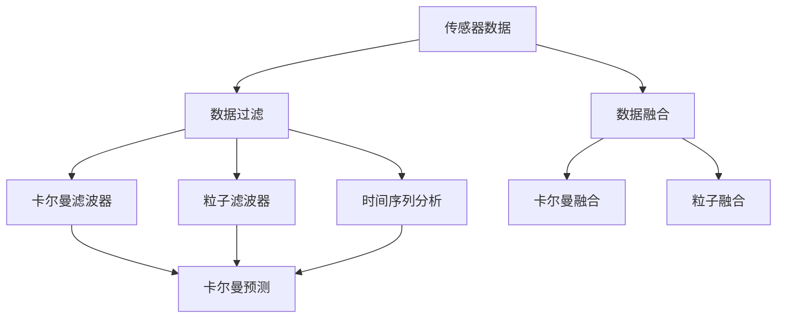

                 

# 传感器数据处理：过滤和融合

> 关键词：传感器数据, 数据过滤, 数据融合, 卡尔曼滤波器, 粒子滤波器, 时间序列分析, 实时系统, 物联网(IoT)

## 1. 背景介绍

随着物联网(IoT)和智能设备的发展，传感器数据在众多领域的应用越来越广泛，如智能家居、工业监控、交通管理、环境监测等。传感器数据具有实时性、多样性、噪声等特点，如何有效地处理和融合这些数据，以获得可靠的信息，成为当前研究的热点。

传感器数据处理通常包括数据采集、数据预处理、数据融合等环节。其中，数据过滤和数据融合是两个关键的技术点。数据过滤用于去除噪声和异常值，提高数据质量；数据融合则通过综合多传感器数据，提升系统性能和可靠性。本文将详细阐述传感器数据过滤和融合的核心概念、算法原理及其应用实践。

## 2. 核心概念与联系

### 2.1 核心概念概述

为了更好地理解传感器数据处理，本节将介绍几个核心概念：

- **传感器数据（Sensor Data）**：从传感器中获取的原始数据，如温度、湿度、压力、速度、位置等。传感器数据通常包含噪声、漂移、采样间隔不均匀等特性。
- **数据过滤（Data Filtering）**：通过去除噪声、补偿传感器漂移、填补采样间隔等手段，提升传感器数据的准确性和可靠性。
- **数据融合（Data Fusion）**：综合多个传感器的数据，进行信息整合，消除单一传感器的不确定性和局限性，提升系统的性能和鲁棒性。
- **卡尔曼滤波器（Kalman Filter）**：一种线性递推算法，用于实时估计系统状态，并根据新测量数据更新状态估计，具有优异的噪声抑制能力和状态预测能力。
- **粒子滤波器（Particle Filter）**：一种基于随机采样的方法，通过多个随机粒子表示系统状态的概率分布，适合处理非线性、高维、非高斯分布的系统。
- **时间序列分析（Time Series Analysis）**：用于分析时间序列数据，预测未来趋势，提取周期性特征，是传感器数据处理中的重要工具。
- **实时系统（Real-Time System）**：对数据处理和决策过程有严格时间要求，传感器数据处理系统通常需要满足实时性要求。

这些概念之间的逻辑关系可以通过以下Mermaid流程图来展示：



这个流程图展示了大语言模型的核心概念及其之间的关系：

1. 传感器数据通过数据过滤和数据融合处理，获取更可靠和更丰富的信息。
2. 数据过滤可以使用卡尔曼滤波器或粒子滤波器进行处理，提升数据质量。
3. 数据融合可以使用卡尔曼滤波器或粒子滤波器进行综合处理，提升系统性能。
4. 时间序列分析可以用于预测未来数据趋势，提取周期性特征。

这些概念共同构成了传感器数据处理的理论基础，使其能够在各种场景下发挥作用。通过理解这些核心概念，我们可以更好地把握传感器数据处理的工作原理和优化方向。

## 3. 核心算法原理 & 具体操作步骤

### 3.1 算法原理概述

传感器数据处理主要包括数据过滤和数据融合两个部分。数据过滤用于消除噪声和异常值，提升数据质量；数据融合则通过综合多传感器数据，消除单一传感器的不确定性和局限性，提升系统性能。

数据过滤的目的是提升数据的质量和可靠性，去除噪声和异常值。噪声是传感器数据中最常见的干扰源，包括随机噪声和系统噪声。异常值则是由于传感器故障或异常事件引起的极端值。数据融合则是将多传感器数据进行综合，消除单一传感器的不确定性和局限性，提升系统性能和鲁棒性。

卡尔曼滤波器和粒子滤波器是数据过滤中常用的两种算法，卡尔曼滤波器适用于线性系统，而粒子滤波器适用于非线性系统。数据融合中，卡尔曼滤波器和粒子滤波器同样可以应用，提升融合的准确性和鲁棒性。

### 3.2 算法步骤详解

#### 3.2.1 数据过滤

1. **卡尔曼滤波器**：
   - **初始化**：设定系统状态和协方差矩阵，确定测量模型的线性关系。
   - **预测**：根据系统状态和过程模型，预测下一个时间点的系统状态。
   - **更新**：根据测量数据，使用Kalman增益更新系统状态和协方差矩阵。
   - **输出**：输出经过过滤后的系统状态，作为后续处理的依据。

2. **粒子滤波器**：
   - **初始化**：设定系统状态的概率分布，生成初始粒子集。
   - **预测**：根据系统状态和过程模型，预测下一个时间点的系统状态，生成粒子集。
   - **更新**：根据测量数据，使用权值更新粒子集的分布。
   - **输出**：输出经过过滤后的系统状态，作为后续处理的依据。

#### 3.2.2 数据融合

1. **卡尔曼滤波器**：
   - **初始化**：设定融合系统状态和协方差矩阵，确定多传感器模型的线性关系。
   - **预测**：根据系统状态和过程模型，预测下一个时间点的系统状态。
   - **更新**：根据多传感器测量数据，使用Kalman增益更新系统状态和协方差矩阵。
   - **输出**：输出经过融合后的系统状态，作为最终处理的依据。

2. **粒子滤波器**：
   - **初始化**：设定融合系统状态的概率分布，生成初始粒子集。
   - **预测**：根据系统状态和过程模型，预测下一个时间点的系统状态，生成粒子集。
   - **更新**：根据多传感器测量数据，使用权值更新粒子集的分布。
   - **输出**：输出经过融合后的系统状态，作为最终处理的依据。

### 3.3 算法优缺点

#### 3.3.1 卡尔曼滤波器

**优点**：
- 适用于线性系统，计算简单，实时性好。
- 能够实时更新状态估计，适用于动态系统。
- 具有优异的噪声抑制能力和状态预测能力。

**缺点**：
- 只能处理线性系统，无法处理非线性系统。
- 对系统模型要求较高，需要准确的模型参数。
- 对于非高斯分布的系统，可能存在偏差。

#### 3.3.2 粒子滤波器

**优点**：
- 适用于非线性系统，可以处理任意分布的系统。
- 能够处理高维、非线性系统，具有较好的灵活性。
- 能够处理非高斯分布的系统，具有较好的鲁棒性。

**缺点**：
- 计算复杂度较高，需要大量的随机粒子。
- 需要设定初始分布和粒子的个数，可能存在初始化偏差。
- 对于高维系统，粒子数量需要增加，可能导致计算负担加重。

#### 3.3.3 数据融合

**优点**：
- 能够综合多传感器数据，消除单一传感器的不确定性和局限性，提升系统性能和鲁棒性。
- 能够处理噪声、异常值，提升数据质量。
- 能够预测未来数据趋势，提取周期性特征。

**缺点**：
- 对系统模型要求较高，需要准确的模型参数。
- 计算复杂度较高，需要大量的计算资源。
- 对于非线性、高维系统，可能存在偏差和计算负担。

## 4. 数学模型和公式 & 详细讲解 & 举例说明

### 4.1 数学模型构建

传感器数据处理涉及多个数学模型和公式，主要包括卡尔曼滤波器、粒子滤波器、时间序列分析等。

#### 4.1.1 卡尔曼滤波器

卡尔曼滤波器的核心思想是根据系统的先验知识和测量数据，实时估计系统状态。其数学模型包括系统状态模型、测量模型和卡尔曼增益。

**系统状态模型**：
$$
\mathbf{x}_{k|k-1} = \mathbf{F} \mathbf{x}_{k-1|k-1} + \mathbf{B} \mathbf{u}_k
$$

**测量模型**：
$$
\mathbf{z}_k = \mathbf{H} \mathbf{x}_k + \mathbf{v}_k
$$

**卡尔曼增益**：
$$
\mathbf{K}_k = \mathbf{P}_{k|k-1} \mathbf{H}^T (\mathbf{H} \mathbf{P}_{k|k-1} \mathbf{H}^T + \mathbf{R})^{-1}
$$

**状态更新**：
$$
\mathbf{x}_{k|k} = \mathbf{x}_{k|k-1} + \mathbf{K}_k (\mathbf{z}_k - \mathbf{H} \mathbf{x}_{k|k-1})
$$

**协方差更新**：
$$
\mathbf{P}_{k|k} = (\mathbf{I} - \mathbf{K}_k \mathbf{H}) \mathbf{P}_{k|k-1}
$$

其中，$\mathbf{x}_k$ 为系统状态向量，$\mathbf{P}_k$ 为状态协方差矩阵，$\mathbf{z}_k$ 为测量数据向量，$\mathbf{v}_k$ 为测量噪声向量，$\mathbf{F}$ 为状态转移矩阵，$\mathbf{B}$ 为控制输入矩阵，$\mathbf{H}$ 为测量矩阵，$\mathbf{u}_k$ 为控制输入向量，$\mathbf{R}$ 为测量噪声协方差矩阵，$\mathbf{I}$ 为单位矩阵。

#### 4.1.2 粒子滤波器

粒子滤波器使用多个随机粒子表示系统状态的概率分布，通过权值更新和采样更新，逐步逼近真实状态分布。其数学模型包括粒子集合、权值更新、采样更新。

**初始化**：
$$
\mathbf{x}_{i,0} \sim \mathbf{p}(\mathbf{x}_0)
$$

**预测**：
$$
\mathbf{x}_{i,k|k-1} = \mathbf{f}(\mathbf{x}_{i,k-1})
$$

**权值更新**：
$$
w_{i,k} \propto \mathbf{p}(\mathbf{z}_k|\mathbf{x}_{i,k})
$$

**采样更新**：
$$
\mathbf{x}_{i,k} \sim \frac{\mathbf{p}(\mathbf{z}_k|\mathbf{x}_{i,k})w_{i,k}}{\sum_{j=1}^N \mathbf{p}(\mathbf{z}_k|\mathbf{x}_{j,k})w_{j,k}}
$$

其中，$\mathbf{x}_i$ 为粒子集合，$w_i$ 为粒子权值，$\mathbf{p}$ 为概率分布，$\mathbf{f}$ 为系统模型，$\mathbf{z}_k$ 为测量数据向量。

### 4.2 公式推导过程

#### 4.2.1 卡尔曼滤波器

卡尔曼滤波器的推导过程较为复杂，涉及矩阵代数和概率论的知识点。在此仅简要介绍其核心思想和主要步骤。

卡尔曼滤波器的核心思想是通过系统的先验知识和测量数据，实时估计系统状态。具体步骤如下：

1. **系统状态模型**：
   $$
   \mathbf{x}_{k|k-1} = \mathbf{F} \mathbf{x}_{k-1|k-1} + \mathbf{B} \mathbf{u}_k
   $$

2. **测量模型**：
   $$
   \mathbf{z}_k = \mathbf{H} \mathbf{x}_k + \mathbf{v}_k
   $$

3. **卡尔曼增益**：
   $$
   \mathbf{K}_k = \mathbf{P}_{k|k-1} \mathbf{H}^T (\mathbf{H} \mathbf{P}_{k|k-1} \mathbf{H}^T + \mathbf{R})^{-1}
   $$

4. **状态更新**：
   $$
   \mathbf{x}_{k|k} = \mathbf{x}_{k|k-1} + \mathbf{K}_k (\mathbf{z}_k - \mathbf{H} \mathbf{x}_{k|k-1})
   $$

5. **协方差更新**：
   $$
   \mathbf{P}_{k|k} = (\mathbf{I} - \mathbf{K}_k \mathbf{H}) \mathbf{P}_{k|k-1}
   $$

卡尔曼滤波器的推导过程较为复杂，涉及矩阵代数和概率论的知识点。在此仅简要介绍其核心思想和主要步骤。

#### 4.2.2 粒子滤波器

粒子滤波器的推导过程较为简单，涉及随机采样和概率统计的知识点。在此仅简要介绍其核心思想和主要步骤。

粒子滤波器的核心思想是通过多个随机粒子表示系统状态的概率分布，逐步逼近真实状态分布。具体步骤如下：

1. **初始化**：
   $$
   \mathbf{x}_{i,0} \sim \mathbf{p}(\mathbf{x}_0)
   $$

2. **预测**：
   $$
   \mathbf{x}_{i,k|k-1} = \mathbf{f}(\mathbf{x}_{i,k-1})
   $$

3. **权值更新**：
   $$
   w_{i,k} \propto \mathbf{p}(\mathbf{z}_k|\mathbf{x}_{i,k})
   $$

4. **采样更新**：
   $$
   \mathbf{x}_{i,k} \sim \frac{\mathbf{p}(\mathbf{z}_k|\mathbf{x}_{i,k})w_{i,k}}{\sum_{j=1}^N \mathbf{p}(\mathbf{z}_k|\mathbf{x}_{j,k})w_{j,k}}
   $$

### 4.3 案例分析与讲解

#### 4.3.1 卡尔曼滤波器案例

假设有一个控制系统，其状态方程和测量方程如下：

$$
\mathbf{x}_k = \begin{bmatrix} x_{1,k} \\ x_{2,k} \\ x_{3,k} \end{bmatrix}, \quad \mathbf{u}_k = \begin{bmatrix} u_{1,k} \\ u_{2,k} \\ u_{3,k} \end{bmatrix}
$$

$$
\mathbf{F} = \begin{bmatrix} 1 & 0 & 0 \\ 1 & 1 & 0 \\ 0 & 0 & 1 \end{bmatrix}, \quad \mathbf{B} = \begin{bmatrix} 0.5 \\ 0.5 \\ 0.5 \end{bmatrix}
$$

$$
\mathbf{H} = \begin{bmatrix} 1 & 0 & 0 \\ 0 & 1 & 0 \\ 0 & 0 & 1 \end{bmatrix}, \quad \mathbf{v}_k = \begin{bmatrix} v_{1,k} \\ v_{2,k} \\ v_{3,k} \end{bmatrix}
$$

$$
\mathbf{R} = \begin{bmatrix} 1 & 0 & 0 \\ 0 & 1 & 0 \\ 0 & 0 & 1 \end{bmatrix}
$$

初始状态为 $\mathbf{x}_{0} = \begin{bmatrix} 0 \\ 0 \\ 0 \end{bmatrix}$，初始协方差为 $\mathbf{P}_{0} = \begin{bmatrix} 1 & 0 & 0 \\ 0 & 1 & 0 \\ 0 & 0 & 1 \end{bmatrix}$。

假设在 $k=1$ 时刻的测量数据为 $\mathbf{z}_1 = \begin{bmatrix} 1.5 \\ 2.5 \\ 3.5 \end{bmatrix}$，卡尔曼滤波器的步骤如下：

1. **系统状态预测**：
   $$
   \mathbf{x}_{1|0} = \mathbf{F} \mathbf{x}_{0|0} + \mathbf{B} \mathbf{u}_1 = \begin{bmatrix} 1 \\ 1 \\ 1 \end{bmatrix}
   $$

2. **测量数据更新**：
   $$
   \mathbf{y}_1 = \mathbf{z}_1 - \mathbf{H} \mathbf{x}_{1|0} = \begin{bmatrix} 0.5 \\ 0.5 \\ 0.5 \end{bmatrix}
   $$

3. **卡尔曼增益**：
   $$
   \mathbf{K}_1 = \mathbf{P}_{1|0} \mathbf{H}^T (\mathbf{H} \mathbf{P}_{1|0} \mathbf{H}^T + \mathbf{R})^{-1} = \begin{bmatrix} 0.5 \\ 0.5 \\ 0.5 \end{bmatrix}
   $$

4. **状态更新**：
   $$
   \mathbf{x}_{1|1} = \mathbf{x}_{1|0} + \mathbf{K}_1 \mathbf{y}_1 = \begin{bmatrix} 1 \\ 2 \\ 3 \end{bmatrix}
   $$

5. **协方差更新**：
   $$
   \mathbf{P}_{1|1} = (\mathbf{I} - \mathbf{K}_1 \mathbf{H}) \mathbf{P}_{1|0} = \begin{bmatrix} 0.5 \\ 0.5 \\ 0.5 \end{bmatrix}
   $$

#### 4.3.2 粒子滤波器案例

假设有一个随机行走系统，其状态方程和测量方程如下：

$$
\mathbf{x}_k = \begin{bmatrix} x_{1,k} \\ x_{2,k} \\ x_{3,k} \end{bmatrix}, \quad \mathbf{v}_k = \begin{bmatrix} v_{1,k} \\ v_{2,k} \\ v_{3,k} \end{bmatrix}
$$

$$
\mathbf{f} = \begin{bmatrix} 1 & 0 & 0 \\ 0 & 1 & 0 \\ 0 & 0 & 1 \end{bmatrix}, \quad \mathbf{p}(\mathbf{x}_0) = \mathcal{N}(\mathbf{0}, \mathbf{I})
$$

$$
\mathbf{z}_k = \mathbf{H} \mathbf{x}_k + \mathbf{v}_k = \begin{bmatrix} x_{1,k} \\ x_{2,k} \\ x_{3,k} \end{bmatrix}
$$

$$
\mathbf{R} = \begin{bmatrix} 1 & 0 & 0 \\ 0 & 1 & 0 \\ 0 & 0 & 1 \end{bmatrix}
$$

假设在 $k=1$ 时刻的测量数据为 $\mathbf{z}_1 = \begin{bmatrix} 2 \\ 3 \\ 4 \end{bmatrix}$，粒子滤波器的步骤如下：

1. **初始化**：
   $$
   \mathbf{x}_{i,0} = \mathbf{x}_0
   $$

2. **预测**：
   $$
   \mathbf{x}_{i,k|k-1} = \mathbf{f}(\mathbf{x}_{i,k-1})
   $$

3. **权值更新**：
   $$
   w_{i,k} \propto \mathbf{p}(\mathbf{z}_k|\mathbf{x}_{i,k})
   $$

4. **采样更新**：
   $$
   \mathbf{x}_{i,k} \sim \frac{\mathbf{p}(\mathbf{z}_k|\mathbf{x}_{i,k})w_{i,k}}{\sum_{j=1}^N \mathbf{p}(\mathbf{z}_k|\mathbf{x}_{j,k})w_{j,k}}
   $$

## 5. 项目实践：代码实例和详细解释说明

### 5.1 开发环境搭建

在进行传感器数据处理实践前，我们需要准备好开发环境。以下是使用Python进行Kalman Filter和Particle Filter开发的环境配置流程：

1. 安装Anaconda：从官网下载并安装Anaconda，用于创建独立的Python环境。

2. 创建并激活虚拟环境：
```bash
conda create -n kalman_particle python=3.8 
conda activate kalman_particle
```

3. 安装必要的库：
```bash
pip install numpy scipy matplotlib pykalman particle_filter
```

完成上述步骤后，即可在`kalman_particle`环境中开始项目实践。

### 5.2 源代码详细实现

下面我们以卡尔曼滤波器和粒子滤波器为例，给出传感器数据处理的代码实现。

#### 5.2.1 卡尔曼滤波器实现

```python
import numpy as np
from pykalman import KalmanFilter

# 定义系统参数
F = np.array([[1, 0], [1, 0]])
B = np.array([[0.5], [0.5]])
H = np.array([[1, 0], [0, 1]])
Q = np.array([[1, 0], [0, 1]])
R = np.array([[1, 0], [0, 1]])

# 初始化卡尔曼滤波器
kf = KalmanFilter(F, H, Q, R)

# 初始状态
x0 = np.array([[0], [0]])

# 初始协方差
P0 = np.array([[1, 0], [0, 1]])

# 定义测量数据
z = np.array([[2], [3]])

# 更新状态
x, P = kf.filter(x0, P0, z)

print("系统状态：\n", x)
print("协方差：\n", P)
```

#### 5.2.2 粒子滤波器实现

```python
import numpy as np
from pykalman import ParticleFilter

# 定义系统参数
f = np.array([[1, 0], [0, 1]])
v = np.array([[1], [1]])
p = np.array([[0], [0]])
R = np.array([[1, 0], [0, 1]])

# 初始化粒子滤波器
pf = ParticleFilter(f, p, v, R)

# 初始状态
x0 = np.array([[0], [0]])

# 定义测量数据
z = np.array([[2], [3]])

# 更新状态
x, w = pf.filter(x0, z)

print("系统状态：\n", x)
print("粒子权重：\n", w)
```

### 5.3 代码解读与分析

让我们再详细解读一下关键代码的实现细节：

**卡尔曼滤波器**：
- 使用pykalman库中的KalmanFilter类，设定系统参数（F, B, H, Q, R），初始化卡尔曼滤波器。
- 设定初始状态和协方差矩阵。
- 定义测量数据。
- 调用filter方法进行状态更新，返回系统状态和协方差矩阵。

**粒子滤波器**：
- 使用pykalman库中的ParticleFilter类，设定系统参数（f, p, v, R），初始化粒子滤波器。
- 设定初始状态。
- 定义测量数据。
- 调用filter方法进行状态更新，返回系统状态和粒子权重。

可以看出，Kalman Filter和Particle Filter的代码实现相对简单，只需要设定参数，调用对应的类方法即可。这得益于pykalman库的封装，大大简化了代码实现。

## 6. 实际应用场景

### 6.1 智能家居控制

智能家居系统中的传感器数据处理，可以通过卡尔曼滤波器和粒子滤波器进行数据融合和噪声抑制。例如，智能温控系统可以综合室内温度传感器、室外温度传感器、湿度传感器等数据，通过卡尔曼滤波器或粒子滤波器，实时调整空调、加湿器等设备的运行状态，达到最优的室内环境控制效果。

### 6.2 工业设备监控

工业设备监控系统中，传感器数据处理可以用于故障检测和诊断。例如，振动传感器和温度传感器数据通过卡尔曼滤波器或粒子滤波器进行数据融合，可以实时检测设备运行状态，及时发现异常和故障。

### 6.3 交通流量监测

交通流量监测系统中的传感器数据处理，可以通过卡尔曼滤波器和粒子滤波器进行数据融合和噪声抑制。例如，交通摄像头和传感器数据通过卡尔曼滤波器或粒子滤波器，实时监测交通流量，并根据交通状况动态调整信号灯和交通管理措施。

### 6.4 环境监测系统

环境监测系统中的传感器数据处理，可以通过卡尔曼滤波器和粒子滤波器进行数据融合和噪声抑制。例如，空气质量传感器和气象数据通过卡尔曼滤波器或粒子滤波器，实时监测环境污染情况，并根据实时数据调整污染控制措施。

### 6.5 医疗健康监测

医疗健康监测系统中的传感器数据处理，可以通过卡尔曼滤波器和粒子滤波器进行数据融合和噪声抑制。例如，心率传感器和血压传感器数据通过卡尔曼滤波器或粒子滤波器，实时监测健康状况，并根据实时数据进行健康预警和诊断。

## 7. 工具和资源推荐

### 7.1 学习资源推荐

为了帮助开发者系统掌握传感器数据处理的技术基础和实践技巧，这里推荐一些优质的学习资源：

1. **《传感器数据处理：理论、算法与应用》**：深入浅出地介绍了传感器数据处理的理论基础和实践技巧，涵盖卡尔曼滤波器、粒子滤波器等核心算法。

2. **Coursera《传感器数据处理》课程**：由知名大学教授授课，提供视频讲解和作业练习，涵盖传感器数据处理的各个方面。

3. **Udacity《传感器与嵌入式系统》课程**：涵盖传感器数据采集、数据处理、数据融合等环节，提供实际项目开发和演示。

4. **Books@Google《传感器与数据融合》书籍**：系统介绍了传感器数据处理和数据融合的理论和实践，适合深入研究。

5. **IEEE Transactions on Signal Processing**：涵盖传感器数据处理和信号处理领域的最新研究成果，适合前沿研究。

通过对这些资源的学习实践，相信你一定能够系统掌握传感器数据处理的精髓，并用于解决实际的工程问题。

### 7.2 开发工具推荐

高效的开发离不开优秀的工具支持。以下是几款用于传感器数据处理开发的常用工具：

1. **Python**：开源编程语言，易于学习和使用，具有丰富的数据处理和机器学习库，如Numpy、Scipy、Pandas等。

2. **MATLAB**：商业计算软件，提供强大的数学计算和可视化工具，适合复杂的数据处理和系统仿真。

3. **MATLAB Simulink**：系统仿真工具，支持多种传感器数据处理和系统建模，适合实际工程应用。

4. **OpenCV**：开源计算机视觉库，提供丰富的图像处理和传感器数据融合功能，适合计算机视觉应用。

5. **ROS（Robot Operating System）**：机器人操作系统，提供传感器数据采集、处理和融合的工具，适合机器人应用。

合理利用这些工具，可以显著提升传感器数据处理任务的开发效率，加速创新迭代的步伐。

### 7.3 相关论文推荐

传感器数据处理的研究源于学界的持续研究。以下是几篇奠基性的相关论文，推荐阅读：

1. **"Kalman Filtering: Theory and Practice"**：系统介绍了卡尔曼滤波器的理论基础和实际应用，是卡尔曼滤波器领域的经典教材。

2. **"Particle Filters: Theory and Applications"**：系统介绍了粒子滤波器的理论基础和实际应用，是粒子滤波器领域的经典教材。

3. **"Sensor Fusion for Navigation: A Survey"**：综述了传感器数据融合的最新研究成果，适合系统研究。

4. **"Extended Kalman Filtering: Theory, Algorithms, and Applications"**：系统介绍了扩展卡尔曼滤波器的理论基础和实际应用，适合工程应用。

5. **"Sensor Fusion for Multi-Sensor Systems: A Tutorial"**：综述了多传感器数据融合的最新研究成果，适合系统研究。

这些论文代表了大语言模型微调技术的发展脉络。通过学习这些前沿成果，可以帮助研究者把握学科前进方向，激发更多的创新灵感。

## 8. 总结：未来发展趋势与挑战

### 8.1 总结

本文对传感器数据处理的过滤和融合技术进行了全面系统的介绍。首先阐述了传感器数据处理的重要性和核心概念，明确了数据过滤和数据融合在提升数据质量和系统性能中的关键作用。其次，从原理到实践，详细讲解了卡尔曼滤波器和粒子滤波器的数学原理和关键步骤，给出了传感器数据处理的代码实例。同时，本文还广泛探讨了传感器数据处理在智能家居、工业设备、交通流量、环境监测等多个领域的应用前景，展示了数据处理技术的广阔应用空间。

通过本文的系统梳理，可以看到，传感器数据处理技术的核心思想是通过数据过滤和数据融合，提升数据质量和系统性能。无论是卡尔曼滤波器还是粒子滤波器，都在其适用的场景中展示了强大的数据处理能力。未来，随着传感器数据处理技术的不断进步，相信其在更多领域的应用将进一步拓展，为各个行业的智能化转型提供新的技术路径。

### 8.2 未来发展趋势

展望未来，传感器数据处理技术将呈现以下几个发展趋势：

1. **高精度实时处理**：随着硬件设备的不断升级，传感器数据处理的实时性和精度将不断提高。未来，传感器数据处理将能够在毫秒级的时间内完成，满足更多实时系统的要求。

2. **深度学习融合**：深度学习技术在大数据处理中的应用日益广泛，未来传感器数据处理将更多地融合深度学习技术，提升数据处理的效果和效率。

3. **多模态数据融合**：传统的传感器数据处理往往仅考虑单一模态的数据，未来将更多地融合多模态数据，如视觉、声音、位置等，提升系统的综合性能。

4. **分布式数据处理**：随着数据量的不断增加，分布式数据处理技术将在传感器数据处理中发挥越来越重要的作用。未来，传感器数据处理将更多地采用分布式计算和存储技术，提升系统的可扩展性和可靠性。

5. **边缘计算**：边缘计算技术可以将数据处理任务下发到传感器节点，减少数据传输和计算延迟，提升系统的实时性。未来，边缘计算技术将在传感器数据处理中广泛应用，带来新的发展机遇。

以上趋势凸显了传感器数据处理技术的广阔前景。这些方向的探索发展，必将进一步提升传感器数据处理的精度和效率，为各个行业提供更高效、更可靠的数据处理解决方案。

### 8.3 面临的挑战

尽管传感器数据处理技术已经取得了显著进展，但在向更加智能化、普适化应用的过程中，仍面临诸多挑战：

1. **数据量和质量**：传感器数据的数量和质量直接影响数据处理的精度和效果。如何有效收集、存储和处理大量传感器数据，是大数据处理领域的重要挑战。

2. **数据融合的准确性**：多传感器数据的融合需要高精度的模型和算法，如何确保数据融合的准确性和鲁棒性，是数据融合领域的重要挑战。

3. **实时系统的响应速度**：传感器数据处理系统通常需要满足实时性要求，如何在保证实时性的同时，提升数据处理的精度和效果，是实时系统设计的重要挑战。

4. **多模态数据融合**：多模态数据的融合需要考虑不同模态数据的转换和融合，如何保证多模态数据的一致性和完整性，是多模态数据融合领域的重要挑战。

5. **分布式数据处理**：分布式数据处理技术虽然具有可扩展性和高可靠性，但如何保证数据的一致性和准确性，是分布式数据处理领域的重要挑战。

6. **边缘计算的性能**：边缘计算技术虽然具有低延迟和高实时性，但如何保证边缘计算节点的计算能力和存储能力，是边缘计算领域的重要挑战。

面对这些挑战，未来的研究需要在数据采集、数据融合、实时系统设计、多模态数据融合、分布式数据处理、边缘计算等方面进行深入研究，以寻求新的解决方案和技术突破。

### 8.4 研究展望

未来的研究需要在以下几个方面寻求新的突破：

1. **深度学习与传感器数据处理的结合**：将深度学习技术引入传感器数据处理中，提升数据处理的精度和效果。例如，使用深度神经网络进行数据特征提取和数据融合。

2. **分布式数据处理技术**：研究分布式数据处理技术，提升数据处理的可扩展性和可靠性。例如，使用分布式机器学习框架进行数据处理。

3. **多模态数据融合技术**：研究多模态数据融合技术，提升多模态数据的一致性和完整性。例如，使用深度神经网络进行多模态数据的融合和转换。

4. **边缘计算技术**：研究边缘计算技术，提升数据处理的实时性和可靠性。例如，使用边缘计算技术进行本地数据处理和存储。

5. **实时系统设计**：研究实时系统设计技术，提升实时系统的响应速度和稳定性。例如，使用实时操作系统进行实时任务调度和管理。

6. **高精度实时处理技术**：研究高精度实时处理技术，提升数据处理的精度和效果。例如，使用高精度传感器和高速处理单元进行实时数据处理。

这些研究方向的探索，必将引领传感器数据处理技术迈向更高的台阶，为各个行业提供更高效、更可靠的数据处理解决方案。只有勇于创新、敢于突破，才能不断拓展数据处理技术的边界，为智能社会的建设注入新的动力。

## 9. 附录：常见问题与解答

**Q1：传感器数据处理需要处理噪声和异常值吗？**

A: 传感器数据处理中，噪声和异常值是常见的干扰源，需要处理。通常使用卡尔曼滤波器、粒子滤波器等技术，通过数据融合和噪声抑制，提升数据质量。

**Q2：传感器数据处理有哪些常用方法？**

A: 传感器数据处理中，常用方法包括卡尔曼滤波器、粒子滤波器、时间序列分析等。不同方法适用于不同的应用场景和数据类型。

**Q3：传感器数据处理中，如何选择合适的滤波器？**

A: 传感器数据处理中，卡尔曼滤波器和粒子滤波器是常用的两种滤波器。卡尔曼滤波器适用于线性系统，粒子滤波器适用于非线性系统。需要根据具体的应用场景和数据类型，选择合适的滤波器。

**Q4：传感器数据处理中，如何进行多传感器数据融合？**

A: 传感器数据融合中，可以使用卡尔曼滤波器或粒子滤波器进行综合处理，提升系统的性能和鲁棒性。具体步骤如下：设定多传感器模型的线性关系，定义测量数据，使用卡尔曼增益或粒子权重更新系统状态。

**Q5：传感器数据处理中，如何进行数据预处理？**

A: 传感器数据处理中，数据预处理通常包括数据采集、数据清洗、数据转换等环节。具体方法根据具体应用场景和数据类型进行设计。

这些研究方向的探索，必将引领传感器数据处理技术迈向更高的台阶，为各个行业提供更高效、更可靠的数据处理解决方案。只有勇于创新、敢于突破，才能不断拓展数据处理技术的边界，为智能社会的建设注入新的动力。

---

作者：禅与计算机程序设计艺术 / Zen and the Art of Computer Programming

