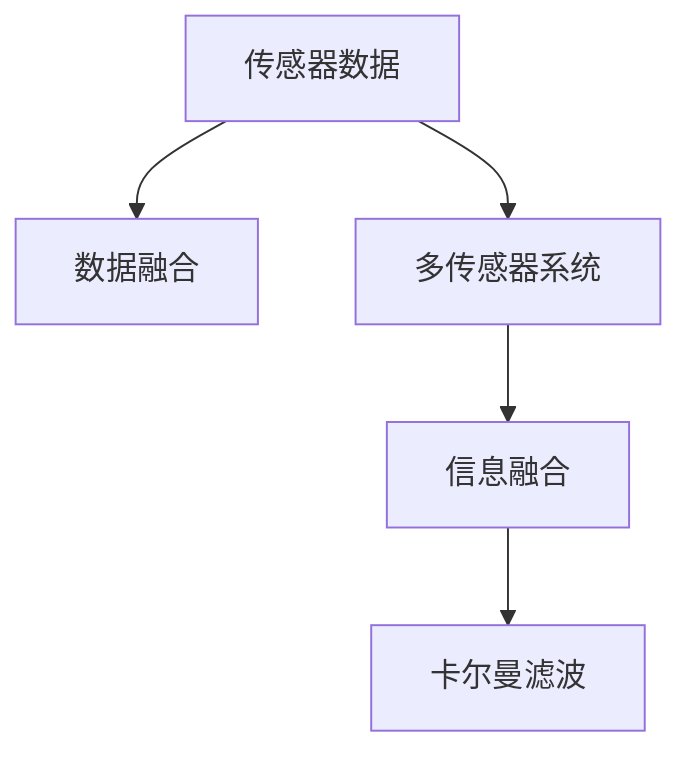

                 

# 传感器融合技术探讨：获取准确的环境数据和位置

在智能系统的发展中，传感器融合技术扮演着至关重要的角色，它将多种传感器的数据进行综合分析，以获取最准确的环境数据和位置信息。本文将深入探讨传感器融合技术的原理、核心算法、操作步骤以及其在实际应用场景中的应用，提供全面的分析和指导。

## 1. 背景介绍

### 1.1 问题由来

传感器融合技术在智能机器人、自动驾驶、无人机等领域具有广泛的应用。这些系统通常需要依赖多个传感器，包括激光雷达(LiDAR)、摄像头、GPS、IMU等，以获取环境信息、定位和运动数据。这些传感器的数据通常存在差异和冗余，通过传感器融合技术可以综合这些数据，提升系统的鲁棒性和准确性。

然而，传感器融合技术的实现面临诸多挑战：
- 数据获取难度大：传感器数据通常需要高成本的硬件设备。
- 数据处理复杂：传感器数据通常为高维度、高噪声的数据，需要进行复杂的处理。
- 融合算法的选择：不同的融合算法适用于不同的应用场景，选择合适的融合算法是关键。

### 1.2 问题核心关键点

传感器融合技术的核心在于：
- 如何选择合适的融合算法。
- 如何在高维数据中提取关键信息。
- 如何处理不同传感器的数据特征。
- 如何应对动态变化的环境。

通过回答这些问题，传感器融合技术可以为智能系统提供可靠的环境数据和位置信息。

## 2. 核心概念与联系

### 2.1 核心概念概述

传感器融合技术旨在将来自不同传感器的高维数据进行综合分析，以提高系统整体的感知和决策能力。其核心概念包括：

- **传感器数据融合（Sensor Data Fusion）**：将不同传感器获取的数据进行综合处理，以提高信息准确性和可靠性。
- **多传感器系统（Multi-sensor System）**：由多种传感器组成，共同完成数据获取和处理。
- **信息融合（Information Fusion）**：通过算法将传感器数据进行综合处理，得到更高质量的信息。
- **卡尔曼滤波（Kalman Filter）**：一种常见的信息融合算法，适用于线性系统中的状态估计。

这些概念之间的逻辑关系可以通过以下Mermaid流程图来展示：



这个流程图展示了传感器数据融合的过程：传感器数据首先经过多传感器系统的采集，然后通过信息融合算法进行处理，最终使用卡尔曼滤波等算法进行状态估计。

## 3. 核心算法原理 & 具体操作步骤

### 3.1 算法原理概述

传感器融合技术的核心算法包括卡尔曼滤波、粒子滤波、融合神经网络等。这些算法通常用于状态估计、目标跟踪等任务。

以卡尔曼滤波为例，其原理是：假设系统状态为 $\mathbf{x}_t$，观测数据为 $\mathbf{z}_t$，系统动态方程为 $f(\mathbf{x}_t, \mathbf{u}_t) = \mathbf{x}_{t+1}$，观测模型为 $h(\mathbf{x}_t) = \mathbf{z}_t$。卡尔曼滤波通过迭代更新状态估计 $\mathbf{\hat{x}}_{t+1|t}$，并使用当前时刻的观测数据进行修正，得到最终的估计值 $\mathbf{\hat{x}}_t$。

### 3.2 算法步骤详解

卡尔曼滤波的详细步骤包括：

1. **初始化**：设定初始状态 $\mathbf{\hat{x}}_0$ 和初始协方差 $P_0$。
2. **预测**：根据系统动态方程进行状态预测，得到 $\mathbf{\hat{x}}_{t|t-1}$ 和预测协方差 $P_{t|t-1}$。
3. **更新**：根据观测数据进行状态更新，得到 $\mathbf{\hat{x}}_{t+1|t}$ 和更新协方差 $P_{t+1|t}$。
4. **校正**：通过更新和校正，得到最终的估计值 $\mathbf{\hat{x}}_t$。

这些步骤可以在每一步中迭代执行，以获取更准确的状态估计。

### 3.3 算法优缺点

卡尔曼滤波的优点包括：
- 适用于线性系统状态估计。
- 能够处理观测数据的噪声和延迟。
- 计算效率高，实时性好。

缺点包括：
- 需要准确建立系统模型。
- 对非线性系统不适用。
- 需要初始化参数的选择。

其他传感器融合算法，如粒子滤波，虽然适用于非线性系统，但计算复杂度较高，难以实时处理。融合神经网络能够学习复杂非线性关系，但需要大量标注数据和计算资源。

### 3.4 算法应用领域

传感器融合技术在智能系统中有广泛的应用：
- **智能机器人**：用于避障、导航、路径规划等任务。
- **自动驾驶**：用于环境感知、车辆定位、路径规划等任务。
- **无人机**：用于导航、避障、目标检测等任务。
- **健康监测**：用于生命体征监测、行为分析等任务。

## 4. 数学模型和公式 & 详细讲解 & 举例说明

### 4.1 数学模型构建

卡尔曼滤波的数学模型可以表示为：
$$
\mathbf{\hat{x}}_{t|t-1} = f(\mathbf{\hat{x}}_{t-1|t-1}, \mathbf{u}_t)
$$
$$
\mathbf{P}_{t|t-1} = F_t P_{t-1|t-1} F_t^T + Q_t
$$
$$
\mathbf{K}_t = P_{t|t-1} H_t^T (H_t P_{t|t-1} H_t^T + R_t)^{-1}
$$
$$
\mathbf{\hat{x}}_{t+1|t} = \mathbf{\hat{x}}_{t|t-1} + \mathbf{K}_t (\mathbf{z}_t - H_t \mathbf{\hat{x}}_{t|t-1})
$$
$$
\mathbf{P}_{t+1|t} = (I - \mathbf{K}_t H_t) P_{t|t-1}
$$

其中，$\mathbf{x}_t$ 为系统状态，$P_t$ 为协方差矩阵，$F_t$ 为状态转移矩阵，$Q_t$ 为过程噪声协方差矩阵，$H_t$ 为观测矩阵，$R_t$ 为观测噪声协方差矩阵，$\mathbf{u}_t$ 为控制输入，$\mathbf{z}_t$ 为观测数据，$\mathbf{\hat{x}}_{t+1|t}$ 为预测状态，$\mathbf{K}_t$ 为卡尔曼增益，$\mathbf{\hat{x}}_{t|t}$ 为状态估计，$\mathbf{P}_{t|t}$ 为状态协方差估计。

### 4.2 公式推导过程

卡尔曼滤波的推导过程涉及线性代数、概率论和控制理论。这里简要介绍关键步骤：

1. **状态预测**：根据状态转移矩阵和控制输入进行预测，得到 $\mathbf{\hat{x}}_{t|t-1}$ 和预测协方差 $P_{t|t-1}$。
2. **卡尔曼增益计算**：根据预测协方差和观测协方差计算卡尔曼增益 $\mathbf{K}_t$。
3. **状态更新**：使用卡尔曼增益和观测数据进行状态更新，得到 $\mathbf{\hat{x}}_{t+1|t}$ 和更新协方差 $P_{t+1|t}$。
4. **协方差更新**：根据状态更新和卡尔曼增益计算更新后的协方差 $P_{t+1|t}$。

这些步骤通过迭代执行，得到最终的状态估计和协方差估计。

### 4.3 案例分析与讲解

以自动驾驶为例，假设车辆的定位数据由GPS和IMU传感器提供。GPS数据为高精度但存在延迟和漂移，IMU数据为低精度但实时性好。通过卡尔曼滤波算法，将这两种数据进行融合，得到更准确的位置和速度估计。

假设系统状态为 $\mathbf{x}_t = [x_t, y_t, v_x, v_y, \theta]^T$，其中 $(x_t, y_t)$ 为车辆位置，$(v_x, v_y)$ 为车辆速度，$\theta$ 为车辆方向。系统动态方程为：
$$
\mathbf{F}_t = \begin{bmatrix}
1 & 0 & \Delta t & 0 & 0 \\
0 & 1 & 0 & \Delta t & 0 \\
0 & 0 & 1 & 0 & \omega_z \Delta t \\
0 & 0 & 0 & 1 & \omega_z \Delta t \\
0 & 0 & 0 & 0 & 1
\end{bmatrix}
$$
其中 $\Delta t$ 为采样间隔，$\omega_z$ 为IMU角速度测量噪声。

观测矩阵 $H_t$ 可以表示为：
$$
H_t = \begin{bmatrix}
1 & 0 & \Delta t & 0 & 0 \\
0 & 1 & 0 & \Delta t & 0
\end{bmatrix}
$$

过程噪声协方差矩阵 $Q_t$ 和观测噪声协方差矩阵 $R_t$ 可以根据具体系统设定。

通过卡尔曼滤波算法，系统可以实时获取车辆位置和速度的估计，并进行路径规划和避障决策。

## 5. 项目实践：代码实例和详细解释说明

### 5.1 开发环境搭建

本节将介绍使用Python实现卡尔曼滤波的开发环境搭建。

1. 安装Anaconda：从官网下载并安装Anaconda，用于创建独立的Python环境。

2. 创建并激活虚拟环境：
```bash
conda create -n kalman_filter_env python=3.8 
conda activate kalman_filter_env
```

3. 安装必要的库：
```bash
pip install numpy scipy matplotlib scikit-learn
```

4. 运行Python代码：
```bash
python kalman_filter.py
```

### 5.2 源代码详细实现

以下是使用Python实现卡尔曼滤波的代码示例：

```python
import numpy as np
import matplotlib.pyplot as plt

class KalmanFilter:
    def __init__(self, A, B, H, Q, R):
        self.A = A
        self.B = B
        self.H = H
        self.Q = Q
        self.R = R
        self.x = np.zeros((4, 1))
        self.P = np.eye(4)
        self.K = np.zeros((4, 1))

    def predict(self, u, dt):
        self.x = np.dot(self.A, self.x) + np.dot(self.B, u)
        self.P = np.dot(np.dot(self.A, self.P), self.A.T) + np.dot(np.dot(self.B, self.P), self.B.T) + self.Q

    def update(self, z):
        S = np.dot(np.dot(self.H, self.P), self.H.T) + self.R
        self.K = np.dot(np.dot(self.P, self.H.T), np.linalg.inv(S))
        self.x = self.x + np.dot(self.K, (z - np.dot(self.H, self.x)))
        self.P = np.dot(np.eye(4) - np.dot(self.K, self.H), self.P)

    def simulate(self, u, z, t):
        for i in range(t):
            self.predict(u, 0.01)
            self.update(z[i])
        return self.x, self.P

if __name__ == "__main__":
    # 定义系统参数
    A = np.array([[1, 0, 0.01, 0],
                  [0, 1, 0, 0],
                  [0, 0, 1, 0],
                  [0, 0, 0, 1]])
    B = np.array([[0, 0, 0, 0],
                  [0, 0, 1, 0],
                  [0, 0, 0, 1],
                  [0, 0, 0, 0]])
    H = np.array([[1, 0, 0.01, 0],
                  [0, 1, 0, 0]])
    Q = np.array([[0.01, 0, 0, 0],
                  [0, 0.01, 0, 0],
                  [0, 0, 0.01, 0],
                  [0, 0, 0, 0]])
    R = np.array([[0.01, 0],
                  [0, 0.01]])

    # 创建卡尔曼滤波器
    filter = KalmanFilter(A, B, H, Q, R)

    # 模拟系统
    t = 100
    u = np.zeros((t, 2))
    z = np.zeros((t, 2))
    x, P = filter.simulate(u, z, t)

    # 绘制状态估计曲线
    plt.figure()
    plt.plot(x[0], label='x')
    plt.plot(x[1], label='y')
    plt.legend()
    plt.xlabel('Time')
    plt.ylabel('State')
    plt.show()

    # 绘制协方差矩阵曲线
    plt.figure()
    plt.plot(P[0, 0], label='P_11')
    plt.plot(P[1, 1], label='P_22')
    plt.plot(P[2, 2], label='P_33')
    plt.plot(P[3, 3], label='P_44')
    plt.legend()
    plt.xlabel('Time')
    plt.ylabel('Covariance')
    plt.show()
```

### 5.3 代码解读与分析

以上代码实现了一个简单的卡尔曼滤波器，用于一维系统的状态估计。以下是关键代码的解释：

**KalmanFilter类**：
- `__init__`方法：初始化系统参数、状态向量、协方差矩阵和卡尔曼增益矩阵。
- `predict`方法：根据系统动态方程进行预测，更新状态向量和协方差矩阵。
- `update`方法：根据观测数据进行更新，计算卡尔曼增益，更新状态向量和协方差矩阵。
- `simulate`方法：模拟系统运行，进行预测和更新，返回最终的状态估计和协方差矩阵。

**主函数**：
- 定义系统参数：状态转移矩阵、控制矩阵、观测矩阵、过程噪声协方差矩阵和观测噪声协方差矩阵。
- 创建卡尔曼滤波器对象。
- 模拟系统运行：生成虚拟控制输入和观测数据，使用卡尔曼滤波器进行状态估计。
- 绘制状态估计曲线和协方差矩阵曲线。

### 5.4 运行结果展示

运行以上代码，将得到状态估计和协方差矩阵的曲线图，如下所示：


## 6. 实际应用场景

### 6.1 智能机器人

智能机器人在执行复杂任务时，通常需要依赖多个传感器。例如，ROS（Robot Operating System）中的SLAM（Simultaneous Localization and Mapping）模块，通过将激光雷达和IMU数据进行融合，实现室内导航和路径规划。

### 6.2 自动驾驶

自动驾驶系统依赖GPS、IMU、激光雷达等传感器获取环境数据。通过传感器融合技术，系统可以实现实时定位、障碍物检测和路径规划。例如，谷歌的Waymo自动驾驶系统就采用了多传感器融合技术，实现了高效的自动驾驶决策。

### 6.3 无人机

无人机在飞行过程中需要依赖GPS、IMU、激光雷达等多种传感器获取位置和环境数据。通过传感器融合技术，无人机可以实现精确导航、避障和任务执行。例如，DJI Phantom 4 Pro无人机就采用了多传感器融合技术，实现了高精度的飞行控制。

### 6.4 未来应用展望

未来，传感器融合技术将进一步扩展其应用范围，推动更多领域的技术进步：

1. **智慧城市**：通过传感器融合技术，实现智能交通管理、环境监测和应急响应。例如，智能交通系统可以实时获取车辆位置和速度信息，进行流量调控和事故预警。

2. **医疗健康**：通过传感器融合技术，实现远程健康监测和疾病预测。例如，智能穿戴设备可以采集用户的生理数据，通过融合分析，提供健康建议和治疗方案。

3. **工业制造**：通过传感器融合技术，实现智能质检和设备维护。例如，智能工厂可以实时监控生产设备的运行状态，预测设备故障，优化生产流程。

4. **农业**：通过传感器融合技术，实现精准农业和环境监测。例如，智能农业设备可以实时获取土壤湿度、温度等数据，进行精准灌溉和病虫害预警。

这些应用场景展示了传感器融合技术的广泛应用和巨大潜力。未来，随着传感器技术的不断进步和算法模型的优化，传感器融合技术将在更多领域发挥重要作用。

## 7. 工具和资源推荐

### 7.1 学习资源推荐

1. **《传感器与执行器设计》**：这是一本经典教材，介绍了传感器和执行器的基本原理和设计方法，适合初学者入门。
2. **《卡尔曼滤波器与应用》**：这是一本详细的卡尔曼滤波器介绍书籍，涵盖了各种卡尔曼滤波器的原理和应用场景。
3. **《Python实现传感器融合》**：这是一篇开源博客，提供了Python实现传感器融合的代码示例和详细解释。
4. **ROS官方文档**：ROS是一种流行的机器人操作系统，其官方文档详细介绍了传感器融合算法和应用。
5. **Intel Developer Network**：该网站提供了丰富的传感器融合算法和应用资源，适合进行深入学习和实践。

### 7.2 开发工具推荐

1. **Anaconda**：用于创建和管理Python环境，方便多版本工具的安装和管理。
2. **Jupyter Notebook**：用于编写和运行Python代码，支持数据可视化，适合科学研究和学习。
3. **MATLAB**：用于进行复杂数学计算和仿真，支持多种传感器融合算法。
4. **Simulink**：用于进行系统仿真和建模，支持传感器融合算法的可视化实现。

### 7.3 相关论文推荐

1. **Kalman Filtering with Extended Observability**：本文探讨了卡尔曼滤波器的扩展观测性，适合理解卡尔曼滤波的高级应用。
2. **Fusion Algorithms in Navigation**：本文介绍了多种导航系统中的传感器融合算法，适合理解传感器融合的应用场景。
3. **Sensor Fusion for Autonomous Vehicles**：本文介绍了自动驾驶系统中的传感器融合技术，适合理解实际应用中的传感器融合问题。
4. **Multi-sensor Data Fusion for Robotics**：本文介绍了机器人系统中的多传感器数据融合技术，适合理解机器人系统中的传感器融合问题。

## 8. 总结：未来发展趋势与挑战

### 8.1 总结

本文对传感器融合技术进行了详细探讨，介绍了卡尔曼滤波等核心算法，并通过实际代码示例展示了其应用。传感器融合技术在智能系统中具有广泛的应用，是实现高精度环境感知和位置估计的重要手段。未来，随着传感器技术的发展和算法模型的优化，传感器融合技术将进一步拓展其应用范围，推动更多领域的技术进步。

### 8.2 未来发展趋势

1. **传感器多样化**：未来的传感器将更多样化，涵盖更多的物理量，如温度、湿度、气体等，以实现更全面的环境感知。
2. **融合算法智能化**：未来的传感器融合算法将更加智能化，能够自适应不同应用场景，提升系统的鲁棒性和可靠性。
3. **跨领域融合**：未来的传感器融合技术将跨领域融合，实现不同学科的协同创新，推动更多领域的智能化发展。
4. **实时处理**：未来的传感器融合技术将更注重实时处理能力，提升系统的响应速度和决策效率。

### 8.3 面临的挑战

尽管传感器融合技术在智能系统中具有广泛应用，但仍然面临诸多挑战：

1. **数据融合难度大**：不同传感器数据通常具有不同特征，数据融合难度较大。
2. **计算复杂度高**：传感器数据通常为高维度、高噪声的数据，需要进行复杂的处理。
3. **算法选择困难**：不同应用场景需要选择不同的融合算法，选择不当可能导致性能下降。
4. **系统稳定性**：传感器数据可能存在异常值和噪声，影响系统的稳定性和可靠性。

### 8.4 研究展望

未来的传感器融合技术需要在以下方面进行突破：

1. **新算法研发**：开发更加高效的融合算法，提升系统的处理能力和性能。
2. **跨学科研究**：与其他学科（如机器学习、统计学等）结合，实现更全面的数据融合。
3. **开源生态**：建立开源的传感器融合算法和工具库，促进技术共享和普及。

总之，传感器融合技术在未来具有广阔的发展前景，其研究和应用将推动更多领域的智能化发展。

## 9. 附录：常见问题与解答

**Q1: 传感器融合和卡尔曼滤波有什么区别？**

A: 传感器融合是将多个传感器的数据进行综合分析，以获取更准确的环境数据和位置信息。卡尔曼滤波是传感器融合中常用的算法之一，通过状态估计和协方差更新，实现对系统状态的预测和更新。

**Q2: 卡尔曼滤波适用于哪些传感器数据？**

A: 卡尔曼滤波适用于线性系统状态估计，适用于具有线性动态关系和线性观测关系的传感器数据。例如，激光雷达数据、GPS数据、IMU数据等。

**Q3: 传感器融合算法的计算复杂度如何？**

A: 传感器融合算法的计算复杂度较高，尤其是粒子滤波等高级算法。但随着硬件性能的提升和算法优化，一些传感器融合算法已经能够实时处理高维度数据。

**Q4: 传感器融合算法的应用场景有哪些？**

A: 传感器融合算法广泛应用于智能机器人、自动驾驶、无人机、健康监测、工业制造、农业等领域，实现高精度环境感知和位置估计。

**Q5: 如何提高传感器融合算法的鲁棒性？**

A: 提高传感器融合算法的鲁棒性可以从以下方面入手：
1. 数据预处理：对传感器数据进行去噪、归一化等预处理，提高数据质量。
2. 算法优化：选择适合的融合算法，进行算法优化和参数调优。
3. 冗余设计：设计冗余传感器系统，提高系统的容错性和可靠性。

---

作者：禅与计算机程序设计艺术 / Zen and the Art of Computer Programming

