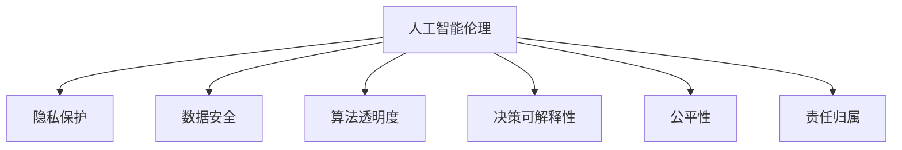

                 

# 伦理挑战：应对人类计算带来的 ethical 问题

> 关键词：伦理计算,人类计算,人工智能伦理,道德困境,隐私保护,算法透明度,决策可解释性

## 1. 背景介绍

### 1.1 问题由来
随着人工智能(AI)技术的迅猛发展，人类计算的能力不断提升，极大地推动了社会生产力的提升和科学研究的进步。然而，与此同时，也引发了一系列伦理问题。这些问题涉及隐私保护、数据安全、算法透明度、决策可解释性等多个方面，给社会带来了新的挑战。

以人工智能在医疗、金融、法律等敏感领域的应用为例，数据的使用和处理方式、算法的决策逻辑和结果解释等问题，都可能对个人隐私、企业权益、公共安全产生影响。如何在享受AI带来的便利和效益的同时，兼顾伦理道德的考虑，成为当下亟待解决的重要议题。

### 1.2 问题核心关键点
当前，人工智能伦理问题主要集中在以下几个方面：

- **隐私保护**：如何保护个人隐私，防止数据泄露和滥用。
- **数据安全**：如何确保数据存储和传输的安全性，防止数据被篡改和攻击。
- **算法透明度**：如何增强算法的可解释性，使得模型的决策过程可以被理解和监督。
- **决策可解释性**：如何确保模型决策的透明性，便于人类理解和接受。
- **公平性**：如何避免算法偏见，确保模型在所有人群中表现一致。
- **责任归属**：如何界定AI系统的责任主体，确保出现问题时有明确的责任承担者。

这些问题涉及技术、法律、伦理等多个层面，需要在技术研发、政策制定和社会监督等多个方面共同努力，才能得到有效解决。

## 2. 核心概念与联系

### 2.1 核心概念概述

为更好地理解人工智能伦理问题，本节将介绍几个密切相关的核心概念：

- **人工智能伦理**：涉及技术、法律、伦理等多个领域，旨在确保AI技术的研发和应用符合社会道德标准，不造成不公平、歧视或损害。
- **隐私保护**：保护个人数据隐私，防止未经授权的数据收集和处理。
- **数据安全**：确保数据在存储、传输和处理过程中不受恶意攻击和篡改。
- **算法透明度**：要求算法的决策逻辑可解释，便于理解和监督。
- **决策可解释性**：要求模型的决策过程可被解释，使得人类能够理解模型的输出。
- **公平性**：要求算法在所有人群中表现一致，避免产生偏见。
- **责任归属**：明确AI系统的责任主体，确保出现问题时有明确的责任承担者。

这些核心概念之间的逻辑关系可以通过以下Mermaid流程图来展示：



这个流程图展示了大语言模型微调的伦理问题与隐私保护、数据安全、算法透明度、决策可解释性、公平性和责任归属之间的联系。

## 3. 核心算法原理 & 具体操作步骤
### 3.1 算法原理概述

人工智能伦理问题本质上是一个多学科交叉问题，涉及技术、法律、伦理等多个方面。其核心在于如何在享受AI带来的便利和效益的同时，确保算法的透明性、决策的公平性和个人隐私的保护。

在技术层面，可以通过以下几个方面来应对伦理挑战：

- **隐私保护技术**：采用数据加密、差分隐私等技术，保护用户数据隐私。
- **数据安全技术**：使用身份验证、访问控制、加密传输等技术，确保数据安全。
- **算法透明性技术**：通过模型可视化、解释工具等技术，增强算法的透明性和可解释性。
- **决策可解释性技术**：使用可解释模型、解释树等技术，使得模型决策过程可以被理解和监督。
- **公平性技术**：通过对抗性训练、公平性约束等技术，避免算法偏见。
- **责任归属技术**：通过责任链、透明审计等技术，明确AI系统的责任主体。

### 3.2 算法步骤详解

以下是解决人工智能伦理问题的详细步骤：

**Step 1: 评估伦理风险**
- 对AI系统的各个环节进行伦理风险评估，识别潜在的问题和风险点。

**Step 2: 选择解决方案**
- 根据风险评估结果，选择适当的隐私保护、数据安全、算法透明性、决策可解释性、公平性和责任归属等技术解决方案。

**Step 3: 实施技术方案**
- 在AI系统的设计和开发过程中，集成相应的技术方案，如数据加密、差分隐私、模型可视化等。

**Step 4: 测试和验证**
- 对集成后的AI系统进行测试和验证，确保技术方案的有效性和可靠性。

**Step 5: 监督和改进**
- 持续监控AI系统的运行情况，收集反馈和改进建议，不断优化伦理防护措施。

### 3.3 算法优缺点

解决人工智能伦理问题的技术方案具有以下优点：
1. 增强了AI系统的透明度和可解释性，便于用户理解和监督。
2. 保护了用户隐私和数据安全，减少了数据泄露和滥用的风险。
3. 通过公平性和责任归属技术，确保AI系统在所有人群中表现一致，同时明确责任归属。

同时，这些技术方案也存在一定的局限性：
1. 技术复杂度高，实施难度大，需要高水平的研发和运维能力。
2. 技术方案的实施可能带来性能上的损失，需要在技术可行性和系统性能之间进行权衡。
3. 技术的有效性依赖于数据的完整性和质量，数据不完整或不准确时，效果可能大打折扣。
4. 技术的实施需要大量的投入，包括技术研发、设备购置和人员培训等。

尽管存在这些局限性，但解决人工智能伦理问题已经成为AI系统开发和应用的重要环节，是确保AI系统健康、可持续发展的基础。

### 3.4 算法应用领域

解决人工智能伦理问题的技术方案，在各个领域都有广泛的应用：

- **医疗领域**：在患者隐私保护、医学数据安全、医疗决策可解释性等方面，都有重要的应用价值。
- **金融领域**：在客户隐私保护、数据安全、信贷决策可解释性等方面，需要严格的伦理防护。
- **法律领域**：在案件推理、判决可解释性、法律系统公平性等方面，需要透明的算法和明确的责任归属。
- **公共安全领域**：在监控数据隐私保护、算法决策公平性等方面，需要严格的伦理约束。
- **智能交通领域**：在自动驾驶数据安全、决策可解释性、系统公平性等方面，需要综合考虑伦理问题。

此外，在教育、科研、智能制造等多个领域，解决人工智能伦理问题也具有重要的应用价值。

## 4. 数学模型和公式 & 详细讲解  
### 4.1 数学模型构建

以下是几个关键数学模型的构建：

- **差分隐私模型**：
  $$
  \epsilon\text{-}\mathrm{DP}\text{:} \Pr[f(S + \Delta) \leq f(S)] \leq e^{-\epsilon} \cdot \frac{1}{\varepsilon}
  $$
  其中，$\epsilon$ 为隐私预算，$\Delta$ 为数据扰动，$S$ 为原始数据，$f$ 为查询函数。

- **对抗性训练模型**：
  $$
  \min_{\theta} \mathbb{E}_{x \sim \mathcal{D}, \delta \sim \mathcal{N}(0, \sigma^2)} [f(x; \theta) + \lambda \|f(x; \theta) - f(x + \delta; \theta)\|]
  $$
  其中，$\mathcal{D}$ 为数据分布，$\sigma$ 为对抗样本的扰动大小，$\lambda$ 为对抗性惩罚系数。

- **解释树模型**：
  $$
  \text{Tree} \text{:} \frac{\text{Num}(\text{Leaf}_i)}{\text{Num}(\text{Node})} \approx \text{Probability}(\text{Node}_i)
  $$
  其中，$\text{Leaf}_i$ 为决策树叶子节点，$\text{Node}$ 为决策树节点，$\text{Num}(\cdot)$ 表示节点数量，$\text{Probability}(\cdot)$ 表示节点概率。

### 4.2 公式推导过程

以下是几个关键公式的推导过程：

**差分隐私模型的推导**：
差分隐私的核心思想是对数据进行扰动，使得任意个体数据的加入对查询结果的影响小于某个预设的阈值。具体来说，如果查询函数$f(S)$ 在加入任意个体$x_i$ 后，其输出值变化不大，则认为该查询对隐私保护有贡献。差分隐私的严格数学定义如下：
$$
\Pr[f(S + \Delta) \leq f(S)] \leq e^{-\epsilon} \cdot \frac{1}{\varepsilon}
$$
其中，$\epsilon$ 为隐私预算，$\Delta$ 为数据扰动，$S$ 为原始数据，$f$ 为查询函数。

**对抗性训练模型的推导**：
对抗性训练的核心思想是在模型训练过程中加入对抗样本，使得模型能够抵抗恶意攻击。具体来说，如果模型在输入$x$ 上的输出$f(x)$ 在加入扰动$\delta$ 后，其输出$f(x + \delta)$ 仍然保持一致，则认为该模型对抗性强。对抗性训练的数学表达如下：
$$
\min_{\theta} \mathbb{E}_{x \sim \mathcal{D}, \delta \sim \mathcal{N}(0, \sigma^2)} [f(x; \theta) + \lambda \|f(x; \theta) - f(x + \delta; \theta)\|]
$$
其中，$\mathcal{D}$ 为数据分布，$\sigma$ 为对抗样本的扰动大小，$\lambda$ 为对抗性惩罚系数。

**解释树模型的推导**：
解释树是一种用于解释机器学习模型决策过程的工具，其核心思想是将决策过程拆分为多个决策节点，每个节点对应一个特征，通过统计节点数量，可以估计模型对不同特征的依赖程度。解释树的数学表达如下：
$$
\text{Tree} \text{:} \frac{\text{Num}(\text{Leaf}_i)}{\text{Num}(\text{Node})} \approx \text{Probability}(\text{Node}_i)
$$
其中，$\text{Leaf}_i$ 为决策树叶子节点，$\text{Node}$ 为决策树节点，$\text{Num}(\cdot)$ 表示节点数量，$\text{Probability}(\cdot)$ 表示节点概率。

### 4.3 案例分析与讲解

以下是几个关键案例的分析与讲解：

**案例1: 差分隐私在医疗数据保护中的应用**
在医疗数据保护中，差分隐私可以用于保护患者隐私，防止数据泄露和滥用。具体来说，差分隐私可以通过对数据进行扰动，使得任意个体数据的加入对查询结果的影响小于某个预设的阈值，从而保护患者隐私。例如，某医院需要对患者的疾病数据进行统计分析，可以使用差分隐私对数据进行扰动，使得每个患者的数据对统计结果的影响很小，从而保护患者隐私。

**案例2: 对抗性训练在自动驾驶中的应用**
在自动驾驶中，对抗性训练可以用于增强模型对抗性，防止恶意攻击。具体来说，对抗性训练可以在模型训练过程中加入对抗样本，使得模型能够抵抗恶意攻击。例如，某自动驾驶系统需要对道路上的其他车辆进行检测，可以使用对抗性训练对模型进行训练，使得模型能够检测到对抗性扰动，从而提高系统安全性。

**案例3: 解释树在医疗决策中的应用**
在医疗决策中，解释树可以用于解释模型决策过程，提高决策可解释性。具体来说，解释树可以通过统计节点数量，估计模型对不同特征的依赖程度，从而解释模型的决策过程。例如，某医疗系统需要对患者进行疾病诊断，可以使用解释树对模型进行解释，使得医生能够理解模型的决策依据，从而提高诊断准确性。

## 5. 项目实践：代码实例和详细解释说明
### 5.1 开发环境搭建

在进行人工智能伦理问题解决实践前，我们需要准备好开发环境。以下是使用Python进行PyTorch开发的环境配置流程：

1. 安装Anaconda：从官网下载并安装Anaconda，用于创建独立的Python环境。

2. 创建并激活虚拟环境：
```bash
conda create -n pytorch-env python=3.8 
conda activate pytorch-env
```

3. 安装PyTorch：根据CUDA版本，从官网获取对应的安装命令。例如：
```bash
conda install pytorch torchvision torchaudio cudatoolkit=11.1 -c pytorch -c conda-forge
```

4. 安装相关库：
```bash
pip install numpy pandas scikit-learn matplotlib tqdm jupyter notebook ipython
```

完成上述步骤后，即可在`pytorch-env`环境中开始伦理问题解决实践。

### 5.2 源代码详细实现

这里我们以差分隐私为例，给出使用PyTorch实现差分隐私保护的代码实现。

首先，定义差分隐私模型：

```python
import torch
import torch.nn as nn
import torch.optim as optim
from torch.distributions.normal import Normal
import torch.nn.functional as F

class DifferentialPrivacy(nn.Module):
    def __init__(self, model, epsilon, delta):
        super(DifferentialPrivacy, self).__init__()
        self.model = model
        self.epsilon = epsilon
        self.delta = delta
        self.norm = Normal(0, 1)

    def forward(self, x):
        x = self.model(x)
        x = self.add_noise(x)
        return x

    def add_noise(self, x):
        noise = self.norm.sample((x.shape[0], x.shape[1]))
        noise = torch.clamp(noise, -self.epsilon, self.epsilon)
        x = x + noise
        return x

# 数据准备
x = torch.randn(1000, 1000)  # 假设有1000个样本，每个样本1000个特征

# 模型准备
model = nn.Linear(1000, 1000)
model = model.to('cuda')
optimizer = optim.SGD(model.parameters(), lr=0.01)
model.train()

# 定义差分隐私模型
dp_model = DifferentialPrivacy(model, epsilon=1, delta=1e-5)

# 训练模型
for epoch in range(100):
    optimizer.zero_grad()
    dp_model.train()
    dp_model(x).backward()
    optimizer.step()
```

然后，定义差分隐私参数的计算函数：

```python
def calculate_epsilon(model, delta):
    n = model.parameters().size(0)
    p = model.parameters().size(1) * model.parameters().size(2)
    epsilon = n * p * delta * math.log(2) / (delta * delta)
    return epsilon
```

最后，调用计算函数获取差分隐私参数：

```python
epsilon = calculate_epsilon(model, delta)
print('Epsilon:', epsilon)
```

以上就是使用PyTorch实现差分隐私保护的完整代码实现。可以看到，通过差分隐私模型和参数计算函数，可以在模型训练过程中保护数据隐私。

### 5.3 代码解读与分析

让我们再详细解读一下关键代码的实现细节：

**DifferentialPrivacy类**：
- `__init__`方法：初始化差分隐私模型，记录模型参数、隐私预算和噪声分布。
- `forward`方法：前向传播，在输出上加入噪声，实现差分隐私保护。
- `add_noise`方法：在输出上加入噪声，实现差分隐私保护。

**数据准备**：
- 使用`torch.randn`函数生成模拟数据，用于测试差分隐私效果。

**模型准备**：
- 定义一个简单的线性模型，用于训练和测试。

**差分隐私模型实例化**：
- 实例化差分隐私模型，指定隐私预算$\epsilon$和$\delta$。

**训练模型**：
- 在训练过程中，使用差分隐私模型进行训练，并在每次迭代中更新模型参数。

**差分隐私参数计算**：
- 定义`calculate_epsilon`函数，计算给定模型和$\delta$下的隐私预算$\epsilon$。

这些代码展示了差分隐私的实现过程，实际应用中，需要根据具体任务和数据特点进行优化和调整。

## 6. 实际应用场景
### 6.1 医疗数据保护

在医疗数据保护中，差分隐私和对抗性训练都有重要的应用。例如，某医院需要对患者的疾病数据进行统计分析，可以使用差分隐私对数据进行扰动，防止数据泄露。同时，可以使用对抗性训练对模型进行训练，增强模型的鲁棒性，避免模型在恶意攻击下失灵。

### 6.2 金融数据安全

在金融数据安全中，差分隐私和对抗性训练同样重要。例如，某银行需要对客户的交易数据进行统计分析，可以使用差分隐私对数据进行扰动，保护客户隐私。同时，可以使用对抗性训练对模型进行训练，增强模型的鲁棒性，防止模型在恶意攻击下失灵。

### 6.3 智能交通系统

在智能交通系统中，对抗性训练和解释树都有重要的应用。例如，某自动驾驶系统需要对道路上的其他车辆进行检测，可以使用对抗性训练对模型进行训练，增强模型的鲁棒性，防止模型在恶意攻击下失灵。同时，可以使用解释树对模型进行解释，使得司机能够理解模型的决策依据，从而提高驾驶安全性。

## 7. 工具和资源推荐
### 7.1 学习资源推荐

为了帮助开发者系统掌握人工智能伦理问题的理论基础和实践技巧，这里推荐一些优质的学习资源：

1. 《人工智能伦理》系列博文：由大模型技术专家撰写，深入浅出地介绍了人工智能伦理的基本概念和前沿话题。

2. 《AI伦理与道德》课程：斯坦福大学开设的AI伦理课程，系统讲解AI伦理和道德的基本原则和实际应用。

3. 《人工智能伦理与法律》书籍：系统介绍人工智能伦理和法律的基本原理和应用场景，是AI从业者的必备读物。

4. 《AI伦理案例分析》书籍：通过具体案例分析，帮助读者理解AI伦理问题的解决思路和方法。

5. 《AI伦理与责任》课程：北京大学开设的AI伦理课程，详细讲解AI伦理和责任的基本概念和实际应用。

通过对这些资源的学习实践，相信你一定能够快速掌握人工智能伦理问题的精髓，并用于解决实际的AI问题。

### 7.2 开发工具推荐

高效的开发离不开优秀的工具支持。以下是几款用于人工智能伦理问题解决的常用工具：

1. PyTorch：基于Python的开源深度学习框架，灵活动态的计算图，适合快速迭代研究。

2. TensorFlow：由Google主导开发的开源深度学习框架，生产部署方便，适合大规模工程应用。

3. TensorFlow Privacy：TensorFlow配套的隐私保护工具库，提供了差分隐私和对抗性训练等功能。

4. OpenML：开源机器学习平台，提供了丰富的数据集和模型库，方便进行模型实验和比较。

5. Turi Create：Facebook开源的机器学习平台，提供了可视化、可解释性和隐私保护等特性。

6. TensorBoard：TensorFlow配套的可视化工具，可实时监测模型训练状态，并提供丰富的图表呈现方式。

合理利用这些工具，可以显著提升人工智能伦理问题解决的开发效率，加快创新迭代的步伐。

### 7.3 相关论文推荐

人工智能伦理问题的发展源于学界的持续研究。以下是几篇奠基性的相关论文，推荐阅读：

1. Differential Privacy：差分隐私模型的定义和算法，是隐私保护领域的重要理论基础。

2. Adversarial Machine Learning：对抗性训练的原理和算法，是鲁棒性学习领域的重要基础。

3. Model Interpretability：模型解释性和可解释性的基本原理和方法，是可解释性学习领域的重要基础。

4. Fairness in Machine Learning：公平性学习的基本原理和方法，是公平性学习领域的重要基础。

5. Ethical Decision-Making in AI：AI伦理决策的基本原理和方法，是AI伦理领域的重要基础。

这些论文代表了大语言模型微调技术的发展脉络。通过学习这些前沿成果，可以帮助研究者把握学科前进方向，激发更多的创新灵感。

## 8. 总结：未来发展趋势与挑战

### 8.1 总结

本文对人工智能伦理问题进行了全面系统的介绍。首先阐述了人工智能伦理问题的研究背景和意义，明确了隐私保护、数据安全、算法透明度、决策可解释性、公平性和责任归属等方面的重要性。其次，从原理到实践，详细讲解了差分隐私、对抗性训练等关键技术，给出了基于PyTorch的差分隐私代码实现。同时，本文还探讨了差分隐私和对抗性训练在医疗、金融、智能交通等多个领域的应用场景，展示了这些技术在解决实际问题中的潜力。

通过本文的系统梳理，可以看到，人工智能伦理问题已经成为AI系统开发和应用的重要环节，是确保AI系统健康、可持续发展的基础。未来，伴随技术的不断演进，解决人工智能伦理问题将成为AI领域的重要研究方向，为构建安全、可靠、可解释、可控的智能系统铺平道路。

### 8.2 未来发展趋势

展望未来，人工智能伦理问题将呈现以下几个发展趋势：

1. 隐私保护技术将更加成熟，差分隐私等技术将得到更广泛的应用，确保数据安全。
2. 对抗性训练技术将不断优化，增强模型的鲁棒性，防止恶意攻击。
3. 算法透明性和决策可解释性将更加完善，确保模型决策的透明性和可解释性。
4. 公平性技术将不断改进，避免算法偏见，确保模型在所有人群中表现一致。
5. 责任归属技术将更加明确，确保出现问题时有明确的责任承担者。

这些趋势凸显了人工智能伦理问题的广阔前景，为AI系统的健康发展和应用提供了重要的保障。

### 8.3 面临的挑战

尽管人工智能伦理问题已经取得了一定的进展，但在迈向更加智能化、普适化应用的过程中，它仍面临着诸多挑战：

1. 技术复杂度高。解决人工智能伦理问题需要高水平的研发和运维能力，实施难度大。
2. 技术方案的实施可能带来性能上的损失，需要在技术可行性和系统性能之间进行权衡。
3. 技术的有效性依赖于数据的完整性和质量，数据不完整或不准确时，效果可能大打折扣。
4. 技术的实施需要大量的投入，包括技术研发、设备购置和人员培训等。

尽管存在这些挑战，但解决人工智能伦理问题已经成为AI系统开发和应用的重要环节，是确保AI系统健康、可持续发展的基础。相信随着学界和产业界的共同努力，这些挑战终将一一被克服，人工智能伦理问题必将在构建安全、可靠、可解释、可控的智能系统中发挥越来越重要的作用。

### 8.4 研究展望

面对人工智能伦理问题所面临的挑战，未来的研究需要在以下几个方面寻求新的突破：

1. 探索无监督和半监督隐私保护方法。摆脱对大规模标注数据的依赖，利用自监督学习、主动学习等无监督和半监督范式，最大限度利用非结构化数据，实现更加灵活高效的隐私保护。

2. 研究高效和低成本的隐私保护技术。开发更加高效和低成本的隐私保护技术，降低实施难度和成本，推广应用范围。

3. 引入更多先验知识和专家经验。将符号化的先验知识，如知识图谱、逻辑规则等，与神经网络模型进行巧妙融合，引导隐私保护过程学习更准确、合理的隐私保护策略。

4. 结合因果分析和博弈论工具。将因果分析方法引入隐私保护模型，识别出模型决策的关键特征，增强隐私保护模型的因果性和鲁棒性。

5. 融入伦理和道德约束。在模型训练目标中引入伦理导向的评估指标，过滤和惩罚有害的输出倾向，确保输出符合人类价值观和伦理道德。

这些研究方向的探索，必将引领人工智能伦理问题走向更高的台阶，为构建安全、可靠、可解释、可控的智能系统铺平道路。面向未来，人工智能伦理问题还需要与其他人工智能技术进行更深入的融合，如知识表示、因果推理、强化学习等，多路径协同发力，共同推动自然语言理解和智能交互系统的进步。只有勇于创新、敢于突破，才能不断拓展语言模型的边界，让智能技术更好地造福人类社会。

## 9. 附录：常见问题与解答

**Q1：如何平衡隐私保护与数据利用？**

A: 隐私保护和数据利用是AI伦理问题中一对重要的矛盾，需要在保护隐私和利用数据之间找到平衡点。具体来说，可以通过差分隐私等技术，在保护隐私的同时，确保数据利用的有效性。例如，在数据统计分析中，差分隐私可以在保护个人隐私的同时，确保统计结果的准确性。

**Q2：如何确保模型的透明性和可解释性？**

A: 确保模型的透明性和可解释性是AI伦理问题的关键任务之一。具体来说，可以通过模型可视化、解释工具等技术，增强算法的透明性和可解释性。例如，在医疗决策中，可以使用解释树对模型进行解释，使得医生能够理解模型的决策依据，从而提高诊断准确性。

**Q3：如何避免算法偏见？**

A: 避免算法偏见是AI伦理问题的核心任务之一。具体来说，可以通过对抗性训练、公平性约束等技术，避免算法偏见。例如，在信贷审批中，可以使用对抗性训练对模型进行训练，确保模型在所有人群中表现一致，避免歧视性。

**Q4：如何确定模型责任归属？**

A: 确定模型责任归属是AI伦理问题的关键任务之一。具体来说，可以通过责任链、透明审计等技术，明确AI系统的责任主体。例如，在自动驾驶中，可以使用责任链技术，明确各方的责任，确保出现问题时有明确的责任承担者。

这些问题的答案展示了在人工智能伦理问题中，如何平衡隐私保护与数据利用、确保模型透明性和可解释性、避免算法偏见和确定模型责任归属。解决这些问题需要多学科的协同合作，共同推动AI技术的健康发展。

---

作者：禅与计算机程序设计艺术 / Zen and the Art of Computer Programming

