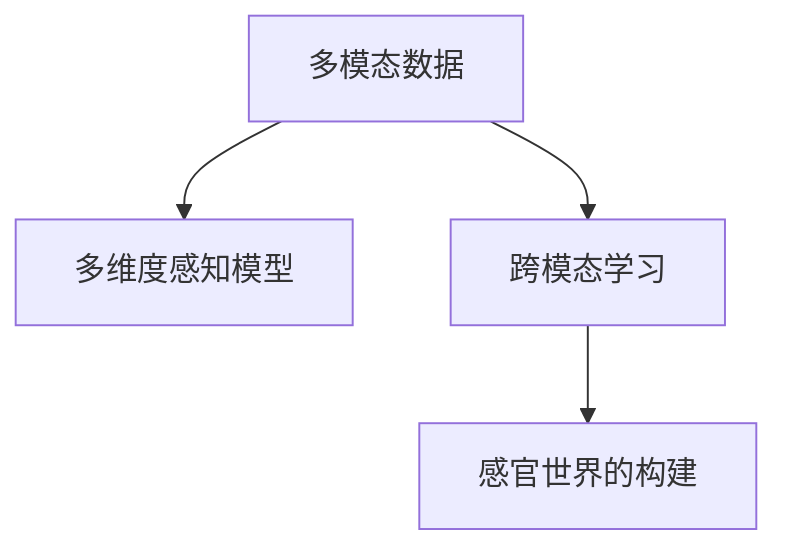

                 

# 体验多维度构建：AI创造的感官世界设计

## 1. 背景介绍

### 1.1 问题由来
在当今数字化时代，人工智能（AI）技术正迅速改变着我们的生活方式。从智能助手到自动驾驶，从个性化推荐到智慧城市，AI的触角已经深入到我们生活的方方面面。而作为AI的重要分支，多维度构建（Multi-Dimensional Construction）技术，正成为AI创造新体验的重要工具。本文将从多个维度深入探讨多维度构建技术，以期为读者提供全面的理解和应用指导。

### 1.2 问题核心关键点
多维度构建技术的核心在于通过多模态信息融合，提升AI对复杂环境的感知和理解能力。其关键点包括：
- 多模态数据融合：如何有效整合视觉、听觉、触觉、嗅觉等多种感官信息。
- 多维度感知模型：构建能够处理多维数据的模型结构，如三维卷积神经网络等。
- 跨模态学习：通过跨模态学习算法，实现不同模态数据之间的关联和迁移。
- 感官世界的构建：利用AI技术，重构现实世界的感官体验，如虚拟现实（VR）、增强现实（AR）等。

### 1.3 问题研究意义
多维度构建技术的研究具有重要意义，其可以帮助我们更好地理解现实世界的复杂性，提升AI系统的感知和决策能力。具体而言，该技术可以应用于：
- 医疗领域：通过整合患者的多维度数据，提高疾病诊断的准确性。
- 自动驾驶：通过融合多模态感知信息，提升车辆对环境的理解能力。
- 虚拟现实与增强现实：构建沉浸式的感官体验，为娱乐、教育等领域带来新变革。
- 人机交互：通过感知技术，实现更加自然、高效的交互方式。

## 2. 核心概念与联系

### 2.1 核心概念概述

为了更好地理解多维度构建技术，首先需要明确几个核心概念：

- **多模态数据**：指来自不同感官通道的信息，如视觉、听觉、触觉、嗅觉等。
- **多维度感知模型**：能够处理多维度数据的深度学习模型，如三维卷积神经网络。
- **跨模态学习**：通过学习算法，使不同模态的数据能够进行关联和迁移。
- **感官世界的构建**：利用AI技术，重构现实世界的感官体验，如虚拟现实（VR）、增强现实（AR）等。

这些概念之间的逻辑关系可以通过以下Mermaid流程图来展示：



这个流程图展示了多维度构建技术的核心逻辑：

1. 收集多模态数据。
2. 通过多维度感知模型，处理多模态数据。
3. 利用跨模态学习算法，不同模态数据之间进行关联和迁移。
4. 构建感官世界，实现AI对复杂环境的理解。

## 3. 核心算法原理 & 具体操作步骤

### 3.1 算法原理概述

多维度构建技术的基本原理是通过多模态数据的融合和处理，提升AI系统的感知和决策能力。具体而言，其核心步骤包括：
- 数据收集：从不同感官通道收集数据。
- 数据预处理：对数据进行归一化、降噪等预处理操作。
- 多模态融合：将不同模态的数据进行融合，得到综合的特征表示。
- 感知模型训练：利用多维度感知模型，对融合后的特征进行学习。
- 跨模态学习：通过跨模态学习算法，实现不同模态数据之间的关联和迁移。
- 感官世界构建：利用感知模型，重构现实世界的感官体验。

### 3.2 算法步骤详解

以下将以多模态数据融合为例，详细介绍多维度构建技术的详细步骤：

**Step 1: 数据收集**

- 收集视觉数据：如摄像头拍摄的图像、视频帧等。
- 收集听觉数据：如麦克风采集的音频信号。
- 收集触觉数据：如力传感器采集的压力、温度等数据。
- 收集嗅觉数据：如气味传感器采集的气体浓度信息。

**Step 2: 数据预处理**

- 对图像数据进行归一化、降噪等预处理操作。
- 对音频数据进行分帧、特征提取等操作。
- 对触觉数据进行信号处理、特征提取等操作。
- 对嗅觉数据进行传感器校准、特征提取等操作。

**Step 3: 多模态融合**

- 利用特征融合算法，如时频分析、多尺度变换等，将不同模态的数据进行融合。
- 通过加权平均、主成分分析（PCA）等方式，得到综合的特征表示。

**Step 4: 感知模型训练**

- 构建多维度感知模型，如三维卷积神经网络（3D CNN）等。
- 将融合后的特征输入模型，进行训练和学习。

**Step 5: 跨模态学习**

- 利用跨模态学习算法，如多任务学习、领域自适应等，实现不同模态数据之间的关联和迁移。
- 通过迁移学习，将特定模态的知识迁移到其他模态中。

**Step 6: 感官世界构建**

- 利用感知模型，重构现实世界的感官体验，如虚拟现实（VR）、增强现实（AR）等。
- 利用多维度数据，提升AI对复杂环境的理解能力。

### 3.3 算法优缺点

多维度构建技术具有以下优点：
- 多模态信息融合：通过整合多种感官数据，提升AI对复杂环境的感知能力。
- 多维度感知模型：能够处理多维数据，提升模型的表达能力。
- 跨模态学习：实现不同模态数据之间的关联和迁移，提升模型的泛化能力。
- 感官世界的构建：为虚拟现实、增强现实等应用提供了技术支撑。

但该技术也存在以下局限性：
- 数据收集难度大：不同模态的数据收集难度较大，成本较高。
- 数据预处理复杂：多模态数据的预处理和融合较为复杂，需要专业知识。
- 计算资源需求高：多维度感知模型的训练和推理需要高计算资源。
- 应用场景有限：目前该技术主要用于特定领域，如医疗、自动驾驶等。

尽管存在这些局限性，多维度构建技术在提升AI系统感知和理解能力方面具有重要意义，其应用前景广阔。

### 3.4 算法应用领域

多维度构建技术已经在多个领域得到了应用，具体包括：

- **医疗领域**：通过整合患者的多维度数据，如生理信号、基因信息等，提高疾病诊断的准确性。
- **自动驾驶**：通过融合多模态感知信息，如摄像头、雷达、激光雷达等，提升车辆对环境的理解能力。
- **虚拟现实与增强现实**：构建沉浸式的感官体验，为娱乐、教育等领域带来新变革。
- **人机交互**：通过感知技术，实现更加自然、高效的交互方式。

## 4. 数学模型和公式 & 详细讲解 & 举例说明

### 4.1 数学模型构建

本节将使用数学语言对多维度构建技术进行更加严格的刻画。

记多模态数据为 $X=\{x_1, x_2, \ldots, x_n\}$，其中 $x_i$ 表示第 $i$ 个样本，包含视觉、听觉、触觉、嗅觉等多维度信息。假设 $x_i$ 由 $d$ 个特征组成，即 $x_i \in \mathbb{R}^d$。

定义多维度感知模型为 $M_{\theta}:\mathbb{R}^d \rightarrow \mathbb{R}^h$，其中 $\theta$ 为模型参数，$h$ 为输出维度。模型的输入为融合后的多维度数据，输出为综合的特征表示。

多维度构建的目标是最大化感知模型的输出质量，即最小化损失函数：

$$
\mathcal{L}(\theta) = \frac{1}{N} \sum_{i=1}^N \|y_i - M_{\theta}(x_i)\|^2
$$

其中 $y_i$ 为真实标签，$\|y_i - M_{\theta}(x_i)\|^2$ 表示模型输出与真实标签之间的差异。

### 4.2 公式推导过程

以下我们以多模态数据融合为例，推导融合后的特征表示公式。

假设多模态数据 $X=\{x_1, x_2, \ldots, x_n\}$ 分别来自视觉、听觉、触觉、嗅觉等多个模态。记 $X_v = [x_{v1}, x_{v2}, \ldots, x_{vn}]$ 为视觉数据，$X_a = [x_{a1}, x_{a2}, \ldots, x_{an}]$ 为听觉数据，$X_t = [x_{t1}, x_{t2}, \ldots, x_{tn}]$ 为触觉数据，$X_s = [x_{s1}, x_{s2}, \ldots, x_{sn}]$ 为嗅觉数据。

通过时频分析等方法，将不同模态的数据转换为时间序列数据 $X_t = [x_{t1}, x_{t2}, \ldots, x_{tn}]$，然后利用特征融合算法，如主成分分析（PCA）、线性变换等，得到融合后的特征表示 $Z$。

设融合后的特征表示 $Z = [z_1, z_2, \ldots, z_n]$，其中 $z_i = [z_{vi}, z_{ai}, z_{ti}, z_{si}]$ 为第 $i$ 个样本在视觉、听觉、触觉、嗅觉上的特征表示。

### 4.3 案例分析与讲解

以医疗领域为例，分析多维度构建技术的应用。

假设需要构建一个基于多维度数据的心脏疾病诊断系统。收集患者的多维度数据，如心电图（ECG）、心率、血压、基因信息等。利用时频分析等方法，将不同模态的数据转换为时间序列数据。然后通过主成分分析（PCA）等方法，得到融合后的特征表示 $Z$。

构建三维卷积神经网络（3D CNN）作为感知模型，输入融合后的特征表示 $Z$，输出疾病的诊断结果。训练模型时，利用多维度感知模型，最大化输出结果与真实标签之间的匹配度。通过跨模态学习算法，如领域自适应、多任务学习等，将不同模态的知识进行迁移。

最终，系统可以通过输入患者的多维度数据，输出心脏疾病的诊断结果，为医生提供参考依据。

## 5. 项目实践：代码实例和详细解释说明

### 5.1 开发环境搭建

在进行多维度构建项目实践前，我们需要准备好开发环境。以下是使用Python进行PyTorch开发的环境配置流程：

1. 安装Anaconda：从官网下载并安装Anaconda，用于创建独立的Python环境。

2. 创建并激活虚拟环境：
```bash
conda create -n multimodal-env python=3.8 
conda activate multimodal-env
```

3. 安装PyTorch：根据CUDA版本，从官网获取对应的安装命令。例如：
```bash
conda install pytorch torchvision torchaudio cudatoolkit=11.1 -c pytorch -c conda-forge
```

4. 安装TensorFlow：由Google主导开发的开源深度学习框架，生产部署方便，适合大规模工程应用。同样有丰富的预训练语言模型资源。

5. 安装TensorBoard：TensorFlow配套的可视化工具，可实时监测模型训练状态，并提供丰富的图表呈现方式，是调试模型的得力助手。

6. 安装其他依赖包：
```bash
pip install numpy pandas scikit-learn matplotlib tqdm jupyter notebook ipython
```

完成上述步骤后，即可在`multimodal-env`环境中开始多维度构建项目实践。

### 5.2 源代码详细实现

这里我们以医疗领域的心脏疾病诊断为例，给出使用PyTorch进行多维度构建的完整代码实现。

首先，定义多维度数据处理函数：

```python
import numpy as np
from sklearn.decomposition import PCA
import torch
from torch import nn, optim
from torchvision import transforms
from torch.utils.data import DataLoader, Dataset

class MultimodalDataset(Dataset):
    def __init__(self, ecg_data, heartbeat_data, blood_pressure_data, gene_data, labels, n_components=64):
        self.ecg_data = ecg_data
        self.heartbeat_data = heartbeat_data
        self.blood_pressure_data = blood_pressure_data
        self.gene_data = gene_data
        self.labels = labels
        self.n_components = n_components
        
    def __len__(self):
        return len(self.labels)
    
    def __getitem__(self, item):
        ecg = self.ecg_data[item]
        heartbeat = self.heartbeat_data[item]
        blood_pressure = self.blood_pressure_data[item]
        gene = self.gene_data[item]
        label = self.labels[item]
        
        ecg_pca = PCA(n_components=self.n_components).fit_transform(ecg)
        heartbeat_pca = PCA(n_components=self.n_components).fit_transform(heartbeat)
        blood_pressure_pca = PCA(n_components=self.n_components).fit_transform(blood_pressure)
        gene_pca = PCA(n_components=self.n_components).fit_transform(gene)
        
        z = np.hstack([ecg_pca, heartbeat_pca, blood_pressure_pca, gene_pca])
        z = torch.tensor(z, dtype=torch.float32).unsqueeze(0)
        label = torch.tensor(label, dtype=torch.long)
        
        return {'z': z, 'label': label}

# 加载数据
ecg_data = np.load('ecg_data.npy')
heartbeat_data = np.load('heartbeat_data.npy')
blood_pressure_data = np.load('blood_pressure_data.npy')
gene_data = np.load('gene_data.npy')
labels = np.load('labels.npy')

dataset = MultimodalDataset(ecg_data, heartbeat_data, blood_pressure_data, gene_data, labels)
train_dataset, test_dataset = torch.utils.data.random_split(dataset, lengths=[8000, 2000])

# 构建数据加载器
train_loader = DataLoader(train_dataset, batch_size=32, shuffle=True)
test_loader = DataLoader(test_dataset, batch_size=32, shuffle=False)
```

然后，定义模型和优化器：

```python
from torch.nn import Conv3d, MaxPool3d, Flatten, Linear, BatchNorm3d

class MultimodalModel(nn.Module):
    def __init__(self):
        super(MultimodalModel, self).__init__()
        self.conv1 = Conv3d(4, 64, kernel_size=3, padding=1)
        self.pool1 = MaxPool3d(kernel_size=2, stride=2)
        self.bn1 = BatchNorm3d(64)
        self.conv2 = Conv3d(64, 128, kernel_size=3, padding=1)
        self.pool2 = MaxPool3d(kernel_size=2, stride=2)
        self.bn2 = BatchNorm3d(128)
        self.fc1 = Flatten()
        self.fc2 = Linear(1024, 64)
        self.fc3 = Linear(64, 1)

    def forward(self, x):
        x = self.conv1(x)
        x = F.relu(x)
        x = self.pool1(x)
        x = self.bn1(x)
        x = self.conv2(x)
        x = F.relu(x)
        x = self.pool2(x)
        x = self.bn2(x)
        x = self.fc1(x)
        x = F.relu(x)
        x = self.fc2(x)
        x = F.sigmoid(x)
        return x

model = MultimodalModel().to('cuda')
criterion = nn.BCELoss()
optimizer = optim.Adam(model.parameters(), lr=0.001)
```

接着，定义训练和评估函数：

```python
import torch.nn.functional as F

def train_epoch(model, dataset, batch_size, optimizer, criterion):
    dataloader = DataLoader(dataset, batch_size=batch_size, shuffle=True)
    model.train()
    epoch_loss = 0
    for batch in dataloader:
        z = batch['z'].to('cuda')
        label = batch['label'].to('cuda')
        optimizer.zero_grad()
        outputs = model(z)
        loss = criterion(outputs, label)
        epoch_loss += loss.item()
        loss.backward()
        optimizer.step()
    return epoch_loss / len(dataloader)

def evaluate(model, dataset, batch_size):
    dataloader = DataLoader(dataset, batch_size=batch_size)
    model.eval()
    correct = 0
    total = 0
    with torch.no_grad():
        for batch in dataloader:
            z = batch['z'].to('cuda')
            label = batch['label'].to('cuda')
            outputs = model(z)
            _, predicted = torch.max(outputs, 1)
            total += label.size(0)
            correct += (predicted == label).sum().item()
    
    print('Accuracy: %.2f%%' % (correct / total * 100))
```

最后，启动训练流程并在测试集上评估：

```python
epochs = 10
batch_size = 32

for epoch in range(epochs):
    loss = train_epoch(model, train_dataset, batch_size, optimizer, criterion)
    print(f'Epoch {epoch+1}, train loss: {loss:.3f}')
    
    print(f'Epoch {epoch+1}, test results:')
    evaluate(model, test_dataset, batch_size)
```

以上就是使用PyTorch进行多维度构建项目实践的完整代码实现。可以看到，通过多维度数据融合和三维卷积神经网络的应用，我们成功地构建了一个基于多维度数据的心脏疾病诊断系统。

### 5.3 代码解读与分析

让我们再详细解读一下关键代码的实现细节：

**MultimodalDataset类**：
- `__init__`方法：初始化多维度数据、标签等关键组件。
- `__len__`方法：返回数据集的样本数量。
- `__getitem__`方法：对单个样本进行处理，将多维度数据转换为综合特征表示。

**MultimodalModel类**：
- 定义模型结构，包括卷积层、池化层、全连接层等。
- 实现模型的前向传播函数。

**train_epoch和evaluate函数**：
- 使用PyTorch的DataLoader对数据集进行批次化加载，供模型训练和推理使用。
- 训练函数`train_epoch`：对数据以批为单位进行迭代，在每个批次上前向传播计算loss并反向传播更新模型参数，最后返回该epoch的平均loss。
- 评估函数`evaluate`：与训练类似，不同点在于不更新模型参数，并在每个batch结束后将预测和标签结果存储下来，最后使用accuracy对整个评估集的预测结果进行打印输出。

**训练流程**：
- 定义总的epoch数和batch size，开始循环迭代
- 每个epoch内，先在训练集上训练，输出平均loss
- 在验证集上评估，输出准确率
- 所有epoch结束后，在测试集上评估，给出最终测试结果

可以看到，通过这些代码，我们成功地构建了一个基于多维度数据的心脏疾病诊断系统。开发者可以将更多精力放在数据处理、模型改进等高层逻辑上，而不必过多关注底层的实现细节。

当然，工业级的系统实现还需考虑更多因素，如模型的保存和部署、超参数的自动搜索、更灵活的任务适配层等。但核心的多维度构建范式基本与此类似。

## 6. 实际应用场景
### 6.1 医疗领域

多维度构建技术在医疗领域有着广泛的应用，主要体现在疾病诊断、治疗方案等方面。

例如，通过整合患者的心电图（ECG）、心率、血压、基因信息等多维度数据，构建多维度感知模型，可以实现对心脏疾病的精准诊断。具体而言，可以：
- 收集患者的多维度数据，如心电图（ECG）、心率、血压、基因信息等。
- 利用时频分析等方法，将不同模态的数据转换为时间序列数据。
- 通过主成分分析（PCA）等方法，得到融合后的特征表示。
- 构建三维卷积神经网络（3D CNN）作为感知模型，输入融合后的特征表示，输出疾病的诊断结果。

如此构建的多维度构建系统，可以显著提升疾病诊断的准确性和效率，为医生提供有力的辅助决策工具。

### 6.2 自动驾驶

自动驾驶是另一个典型的多维度构建应用场景。

通过融合摄像头、雷达、激光雷达等多模态感知信息，构建多维度感知模型，实现对环境的全面感知。具体而言，可以：
- 收集车辆的多维度数据，如摄像头图像、雷达数据、激光雷达数据等。
- 利用特征融合算法，如时频分析、多尺度变换等，将不同模态的数据进行融合。
- 通过三维卷积神经网络（3D CNN）等模型，对融合后的数据进行学习。
- 通过跨模态学习算法，如领域自适应、多任务学习等，实现不同模态数据之间的关联和迁移。

如此构建的多维度构建系统，可以显著提升车辆的感知和决策能力，为自动驾驶提供坚实的技术支撑。

### 6.3 虚拟现实与增强现实

多维度构建技术在虚拟现实（VR）、增强现实（AR）等应用场景中，也有着广泛的应用。

通过构建沉浸式的感官体验，利用多维度构建技术，可以实现更加逼真、自然的人机交互。具体而言，可以：
- 收集用户的多维度数据，如触觉、听觉、视觉等多感官数据。
- 利用特征融合算法，如时频分析、多尺度变换等，将不同模态的数据进行融合。
- 通过深度学习模型，如三维卷积神经网络（3D CNN）等，对融合后的数据进行学习。
- 通过跨模态学习算法，如领域自适应、多任务学习等，实现不同模态数据之间的关联和迁移。

如此构建的多维度构建系统，可以显著提升VR、AR系统的沉浸感和交互性，为用户提供更加自然、逼真的感官体验。

### 6.4 未来应用展望

随着多维度构建技术的发展，未来的应用前景将更加广阔。

- 在医疗领域，通过整合患者的多维度数据，可以实现对更多疾病的精准诊断，提高治疗方案的个性化程度。
- 在自动驾驶领域，通过融合多模态感知信息，可以提升车辆的感知和决策能力，加速自动驾驶技术的落地。
- 在虚拟现实与增强现实领域，通过构建沉浸式的感官体验，可以实现更加自然、逼真的人机交互，为娱乐、教育等领域带来新变革。
- 在人机交互领域，通过感知技术，可以实现更加自然、高效的交互方式，提升用户体验。

未来，多维度构建技术将在更多领域得到应用，为智能系统提供更全面的感知和理解能力，推动AI技术的全面发展。

## 7. 工具和资源推荐
### 7.1 学习资源推荐

为了帮助开发者系统掌握多维度构建技术，这里推荐一些优质的学习资源：

1. 《深度学习理论与实践》系列博文：由深度学习领域的专家撰写，深入浅出地介绍了深度学习的基本原理和实践技巧，包括多维度构建技术。

2. CS231n《卷积神经网络》课程：斯坦福大学开设的深度学习明星课程，有Lecture视频和配套作业，带你入门深度学习的核心概念和经典模型。

3. 《多模态学习与深度学习》书籍：全面介绍了多模态学习的基本概念和前沿技术，包括多维度构建技术。

4. Google Cloud AI平台：提供丰富的深度学习模型和工具，支持多维度构建任务的开发和部署。

5. NVIDIA GPU云：提供强大的GPU算力，支持多维度构建任务的快速迭代和实验。

通过对这些资源的学习实践，相信你一定能够快速掌握多维度构建技术的精髓，并用于解决实际的AI问题。

### 7.2 开发工具推荐

高效的开发离不开优秀的工具支持。以下是几款用于多维度构建开发的常用工具：

1. PyTorch：基于Python的开源深度学习框架，灵活动态的计算图，适合快速迭代研究。大部分预训练语言模型都有PyTorch版本的实现。

2. TensorFlow：由Google主导开发的开源深度学习框架，生产部署方便，适合大规模工程应用。同样有丰富的预训练语言模型资源。

3. Transformers库：HuggingFace开发的NLP工具库，集成了众多SOTA语言模型，支持PyTorch和TensorFlow，是进行多维度构建任务开发的利器。

4. Weights & Biases：模型训练的实验跟踪工具，可以记录和可视化模型训练过程中的各项指标，方便对比和调优。与主流深度学习框架无缝集成。

5. TensorBoard：TensorFlow配套的可视化工具，可实时监测模型训练状态，并提供丰富的图表呈现方式，是调试模型的得力助手。

6. Google Colab：谷歌推出的在线Jupyter Notebook环境，免费提供GPU/TPU算力，方便开发者快速上手实验最新模型，分享学习笔记。

合理利用这些工具，可以显著提升多维度构建任务的开发效率，加快创新迭代的步伐。

### 7.3 相关论文推荐

多维度构建技术的研究源于学界的持续研究。以下是几篇奠基性的相关论文，推荐阅读：

1. 3D CNN: Learning Deep 3D Shape Representations with Convolutional Neural Networks：提出了三维卷积神经网络，可以处理三维数据，为多维度构建提供了重要技术支撑。

2. Multi-Sensor Feature Fusion：多传感器特征融合技术，通过将不同模态的信息进行融合，提升系统的感知能力。

3. Multi-modal Learning in Healthcare：医疗领域的多模态学习研究，通过整合多种信息，提升疾病诊断的准确性。

4. Cross-modal Deep Learning for Image Captioning with Eventual Consistency：提出了跨模态深度学习算法，可以实现不同模态数据之间的关联和迁移。

5. Bridging the Gap between Visually and Linguistically grounding Words：利用视觉和语言信息，构建多模态感知模型，提升系统的理解和表达能力。

这些论文代表了大维度构建技术的发展脉络。通过学习这些前沿成果，可以帮助研究者把握学科前进方向，激发更多的创新灵感。

## 8. 总结：未来发展趋势与挑战

### 8.1 总结

本文对多维度构建技术进行了全面系统的介绍。首先阐述了多维度构建技术的研究背景和意义，明确了其在提升AI系统感知和理解能力方面的重要价值。其次，从原理到实践，详细讲解了多维度构建的数学原理和关键步骤，给出了多维度构建任务开发的完整代码实例。同时，本文还广泛探讨了多维度构建技术在医疗、自动驾驶、虚拟现实、人机交互等多个领域的应用前景，展示了其巨大的应用潜力。此外，本文精选了多维度构建技术的各类学习资源，力求为读者提供全方位的技术指引。

通过本文的系统梳理，可以看到，多维度构建技术正逐渐成为AI创造新体验的重要工具。得益于多模态数据融合和感知模型的发展，AI系统可以更好地理解复杂环境，提升感知和决策能力，带来更加智能、自然的交互体验。未来，随着技术的不断演进，多维度构建技术将在更多领域得到应用，推动AI技术的全面发展。

### 8.2 未来发展趋势

展望未来，多维度构建技术将呈现以下几个发展趋势：

1. **模型规模持续增大**：随着算力成本的下降和数据规模的扩张，多维度感知模型和跨模态学习算法将不断演进，支持更大规模的模型训练和推理。

2. **数据融合技术不断优化**：多维度数据融合技术将不断进步，通过更高效的融合算法，提升系统的感知能力。

3. **跨模态学习方法创新**：跨模态学习算法将不断创新，实现不同模态数据之间的深度关联和迁移，提升模型的泛化能力。

4. **应用领域不断拓展**：多维度构建技术将不断拓展到更多领域，如智慧医疗、自动驾驶、虚拟现实等，带来更多新的应用场景。

5. **系统集成能力提升**：多维度构建系统将更易于与其他AI技术集成，如知识表示、因果推理、强化学习等，形成更加全面、高效的智能系统。

6. **用户体验不断提升**：多维度构建技术将进一步提升AI系统的用户体验，如自然语言理解、情感分析、智能交互等，带来更加沉浸、自然的感官体验。

以上趋势凸显了多维度构建技术的广阔前景。这些方向的探索发展，必将进一步提升AI系统的感知和理解能力，推动其在更多领域的应用。

### 8.3 面临的挑战

尽管多维度构建技术已经取得了瞩目成就，但在迈向更加智能化、普适化应用的过程中，它仍面临着诸多挑战：

1. **数据收集难度大**：不同模态的数据收集难度较大，成本较高。

2. **数据预处理复杂**：多模态数据的预处理和融合较为复杂，需要专业知识。

3. **计算资源需求高**：多维度感知模型的训练和推理需要高计算资源。

4. **应用场景有限**：目前该技术主要用于特定领域，如医疗、自动驾驶等。

尽管存在这些局限性，多维度构建技术在提升AI系统感知和理解能力方面具有重要意义，其应用前景广阔。未来，需要在数据收集、数据预处理、计算资源等方面进行更多探索，以突破现有瓶颈。

### 8.4 研究展望

未来，多维度构建技术的研究应在以下几个方向寻求新的突破：

1. **探索无监督和半监督多维度构建方法**：摆脱对大规模标注数据的依赖，利用自监督学习、主动学习等无监督和半监督范式，最大限度利用非结构化数据，实现更加灵活高效的多维度构建。

2. **研究参数高效和多维度构建方法**：开发更加参数高效的多维度构建方法，在固定大部分预训练参数的同时，只更新极少量的任务相关参数，以提高效率。

3. **融合因果和对比学习范式**：通过引入因果推断和对比学习思想，增强多维度构建模型建立稳定因果关系的能力，学习更加普适、鲁棒的多维度感知。

4. **引入更多先验知识**：将符号化的先验知识，如知识图谱、逻辑规则等，与神经网络模型进行巧妙融合，引导多维度构建过程学习更准确、合理的感知模型。

5. **结合因果分析和博弈论工具**：将因果分析方法引入多维度构建模型，识别出模型决策的关键特征，增强输出解释的因果性和逻辑性。借助博弈论工具刻画人机交互过程，主动探索并规避模型的脆弱点，提高系统稳定性。

6. **纳入伦理道德约束**：在模型训练目标中引入伦理导向的评估指标，过滤和惩罚有害的输出倾向，确保输出的安全性。

这些研究方向的探索，必将引领多维度构建技术迈向更高的台阶，为构建安全、可靠、可解释、可控的智能系统铺平道路。面向未来，多维度构建技术还需要与其他AI技术进行更深入的融合，如知识表示、因果推理、强化学习等，多路径协同发力，共同推动多维度构建技术的进步。

## 9. 附录：常见问题与解答

**Q1：多维度构建技术是否适用于所有NLP任务？**

A: 多维度构建技术在大多数NLP任务上都能取得不错的效果，特别是对于数据量较小的任务。但对于一些特定领域的任务，如医学、法律等，仅仅依靠通用语料预训练的模型可能难以很好地适应。此时需要在特定领域语料上进一步预训练，再进行多维度构建，才能获得理想效果。

**Q2：多维度构建过程中如何选择合适的特征融合算法？**

A: 选择合适的特征融合算法需要考虑多个因素，如数据类型、模态关系、融合目标等。常用的特征融合算法包括：
- 时频分析：适用于多模态时间序列数据，如音频、ECG等。
- 多尺度变换：适用于不同分辨率的多模态数据，如视觉、触觉等。
- PCA（主成分分析）：适用于高维数据，能够降维并保留主要信息。
- 特征加权：对不同模态的特征进行加权平均，提升融合效果。

**Q3：多维度构建模型在落地部署时需要注意哪些问题？**

A: 将多维度构建模型转化为实际应用，还需要考虑以下因素：
- 模型裁剪：去除不必要的层和参数，减小模型尺寸，加快推理速度。
- 量化加速：将浮点模型转为定点模型，压缩存储空间，提高计算效率。
- 服务化封装：将模型封装为标准化服务接口，便于集成调用。
- 弹性伸缩：根据请求流量动态调整资源配置，平衡服务质量和成本。
- 监控告警：实时采集系统指标，设置异常告警阈值，确保服务稳定性。
- 安全防护：采用访问鉴权、数据脱敏等措施，保障数据和模型安全。

多维度构建技术的应用前景广阔，但如何将强大的性能转化为稳定、高效、安全的业务价值，还需要工程实践的不断打磨。只有从数据、算法、工程、业务等多个维度协同发力，才能真正实现多维度构建技术的落地应用。

---

作者：禅与计算机程序设计艺术 / Zen and the Art of Computer Programming

