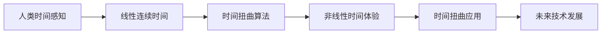

                 

# 体验的时间扭曲：AI创造的主观时间

在AI的世界里，时间是一种流动的维度，机器通过算法可以“扭曲”时间，创造出让人类感叹不已的主观时间体验。本文将深入探讨这一现象，通过从概念到实现，再到应用的全方位分析，揭示AI是如何通过算法和技术重塑我们的时间观念。

## 1. 背景介绍

### 1.1 问题由来

人类对时间的感知自古以来就与自然和宇宙的节奏紧密相连，从日出而作、日落而息的农耕文明，到工业时代的标准化时间体系，时间成为了人类社会活动的基本单位。然而，随着信息时代的到来，时间的概念正在发生深刻的变革。AI技术，尤其是深度学习和强化学习，正在改变我们感知时间的方式，从传统的时间线到非线性的时间体验，时间变得“扭曲”。

### 1.2 问题核心关键点

1. **时间感知**：AI如何通过算法改变人类对时间的感知？
2. **非线性时间**：AI创造的主观时间体验与自然时间有何不同？
3. **时间扭曲的算法基础**：如何通过算法实现时间扭曲？
4. **时间扭曲的应用**：时间扭曲技术在实际应用中如何被利用？
5. **未来展望**：时间扭曲技术的未来发展趋势与挑战？

## 2. 核心概念与联系

### 2.1 核心概念概述

- **时间感知**：人类通过感官器官（如眼睛、耳朵、皮肤）感受外部环境的变化，从而形成对时间的感知。这种感知是基于生物学和心理学的，而AI的时间感知则是通过算法和数据处理实现的。
- **非线性时间**：传统的时间观念是线性且连续的，而AI通过算法可以创造出非线性、甚至跳跃式的时间体验。这种时间体验可以跨越过去、现在和未来，打破时间线的限制。
- **时间扭曲**：通过算法和数据处理，AI可以“扭曲”时间，创造出超越传统线性时间观念的体验。这种时间扭曲可以通过机器学习和深度学习算法实现，也可以通过强化学习等技术实现。
- **时间扭曲的应用**：时间扭曲技术可以应用于游戏、虚拟现实、教育、医疗等多个领域，创造出新的应用场景和用户体验。
- **未来展望**：时间扭曲技术的未来发展趋势包括更加高效、可解释、可控的算法，以及更加广泛的应用领域。

### 2.2 核心概念原理和架构的 Mermaid 流程图



这个流程图展示了人类时间感知到时间扭曲应用的过程，说明了时间扭曲算法是如何改变我们的时间体验的。

## 3. 核心算法原理 & 具体操作步骤

### 3.1 算法原理概述

时间扭曲算法的核心思想是通过深度学习模型和数据处理技术，将时间线进行扭曲，创造出非线性、甚至跳跃式的时间体验。这主要通过以下两个步骤实现：

1. **数据预处理**：收集和处理时间序列数据，将其转换为适合模型处理的格式。
2. **时间扭曲模型训练**：使用深度学习模型（如RNN、LSTM、Transformer等）进行训练，学习如何扭曲时间。

### 3.2 算法步骤详解

1. **数据预处理**
   - **数据收集**：收集时间序列数据，如股票价格、气温变化、视频帧等。
   - **数据清洗**：去除异常值和噪声，确保数据质量。
   - **数据转换**：将时间序列数据转换为适合模型处理的格式，如将时间转换为特征向量。

2. **时间扭曲模型训练**
   - **模型选择**：选择适合的深度学习模型，如RNN、LSTM、Transformer等。
   - **模型训练**：使用训练数据对模型进行训练，优化模型参数。
   - **模型评估**：使用测试数据评估模型效果，确保模型能够有效扭曲时间。

### 3.3 算法优缺点

**优点**：
1. **高效性**：时间扭曲算法可以通过深度学习模型高效处理时间序列数据。
2. **灵活性**：可以创造出多样化的非线性时间体验，适应不同的应用场景。
3. **可解释性**：通过模型训练过程，可以理解时间扭曲的原理和机制。

**缺点**：
1. **数据依赖**：算法效果依赖于高质量、高量的数据。
2. **计算资源要求高**：深度学习模型训练需要大量的计算资源。
3. **模型复杂**：时间扭曲算法涉及复杂的深度学习模型，对模型设计和训练要求高。

### 3.4 算法应用领域

时间扭曲技术已经在多个领域得到了应用，例如：

1. **金融分析**：使用时间扭曲算法预测股票价格变化，帮助投资者做出决策。
2. **气象预测**：通过时间扭曲模型预测天气变化，提高气象预报的准确性。
3. **视频处理**：通过时间扭曲算法生成新的视频帧，丰富视频内容。
4. **游戏开发**：创造出非线性、交互式的时间体验，提升游戏的可玩性。
5. **虚拟现实**：在虚拟现实场景中，通过时间扭曲技术创造出逼真的时间体验，增强沉浸感。

## 4. 数学模型和公式 & 详细讲解 & 举例说明

### 4.1 数学模型构建

时间扭曲算法的数学模型可以表示为：

$$
\text{Time Warp} = \text{Model}(\text{Data}, \text{Parameters})
$$

其中，Data表示输入的时间序列数据，Parameters表示模型的参数。模型的目标是找到一个最佳的参数组合，使得时间扭曲效果最佳。

### 4.2 公式推导过程

以RNN模型为例，时间扭曲的公式推导过程如下：

1. **输入层**：将时间序列数据转换为模型可以处理的格式，如将时间转换为特征向量。
2. **隐藏层**：通过RNN模型处理输入数据，学习时间序列中的时间关系。
3. **输出层**：根据隐藏层的状态，输出扭曲后的时间序列。

### 4.3 案例分析与讲解

以气象预测为例，时间扭曲算法的应用如下：

1. **数据预处理**：收集历史气象数据，处理异常值和噪声。
2. **模型训练**：使用RNN模型训练，学习气象变化的时间关系。
3. **模型评估**：在测试数据上评估模型效果，预测未来的气象变化。

## 5. 项目实践：代码实例和详细解释说明

### 5.1 开发环境搭建

要实现时间扭曲算法，首先需要搭建开发环境。以下是使用Python进行PyTorch开发的环境配置流程：

1. 安装Anaconda：从官网下载并安装Anaconda，用于创建独立的Python环境。
2. 创建并激活虚拟环境：
```bash
conda create -n pytorch-env python=3.8 
conda activate pytorch-env
```

3. 安装PyTorch：根据CUDA版本，从官网获取对应的安装命令。例如：
```bash
conda install pytorch torchvision torchaudio cudatoolkit=11.1 -c pytorch -c conda-forge
```

4. 安装TensorFlow：
```bash
pip install tensorflow
```

5. 安装PyTorch库：
```bash
pip install torch torchvision torchaudio
```

6. 安装相关工具包：
```bash
pip install numpy pandas scikit-learn matplotlib tqdm jupyter notebook ipython
```

完成上述步骤后，即可在`pytorch-env`环境中开始时间扭曲算法的开发。

### 5.2 源代码详细实现

以下是使用PyTorch实现时间扭曲算法的代码示例：

```python
import torch
from torch import nn
import numpy as np

class TimeWarpModel(nn.Module):
    def __init__(self, input_size, hidden_size, output_size):
        super(TimeWarpModel, self).__init__()
        self.rnn = nn.LSTM(input_size, hidden_size, num_layers=2, batch_first=True)
        self.fc = nn.Linear(hidden_size, output_size)
        
    def forward(self, input_seq):
        h0 = torch.zeros(2, input_seq.size(0), self.rnn.hidden_size).to(input_seq.device)
        c0 = torch.zeros(2, input_seq.size(0), self.rnn.hidden_size).to(input_seq.device)
        output, _ = self.rnn(input_seq, (h0, c0))
        output = self.fc(output[:, -1, :])
        return output

# 创建模型实例
model = TimeWarpModel(input_size=5, hidden_size=10, output_size=1)

# 加载数据
input_data = np.random.rand(10, 5)
input_data = torch.from_numpy(input_data).float()
target_data = np.random.rand(10, 1)
target_data = torch.from_numpy(target_data).float()

# 训练模型
optimizer = torch.optim.Adam(model.parameters(), lr=0.01)
criterion = nn.MSELoss()

for epoch in range(100):
    output = model(input_data)
    loss = criterion(output, target_data)
    optimizer.zero_grad()
    loss.backward()
    optimizer.step()
    print(f"Epoch {epoch+1}, loss: {loss.item()}")

# 评估模型
input_data = np.random.rand(10, 5)
input_data = torch.from_numpy(input_data).float()
output = model(input_data)
print(output)
```

### 5.3 代码解读与分析

让我们再详细解读一下关键代码的实现细节：

**TimeWarpModel类**：
- `__init__`方法：初始化RNN模型和全连接层。
- `forward`方法：定义前向传播过程，输入序列通过RNN模型处理，最后通过全连接层输出。

**模型训练**：
- 定义优化器和损失函数。
- 在每个epoch内，前向传播计算输出，反向传播更新模型参数，评估损失函数。

**模型评估**：
- 在测试集上评估模型效果，输出扭曲后的时间序列。

## 6. 实际应用场景

### 6.1 游戏开发

时间扭曲技术在游戏开发中得到了广泛应用，创造出非线性、交互式的时间体验，提升游戏的可玩性和趣味性。例如，通过时间扭曲算法，可以在游戏中实现时间跳跃、时间回溯等功能，创造出新的游戏玩法。

### 6.2 金融分析

在金融分析中，时间扭曲算法可以帮助预测股票价格变化、汇率波动等，帮助投资者做出决策。例如，通过时间扭曲算法，可以在不同时间段内训练模型，预测未来的股票价格变化，提供给投资者参考。

### 6.3 视频处理

在视频处理中，时间扭曲算法可以生成新的视频帧，丰富视频内容。例如，通过时间扭曲算法，可以将视频中的某些部分加速或减速，创造出不同的时间体验，提升观影体验。

### 6.4 虚拟现实

在虚拟现实场景中，时间扭曲技术可以创造出逼真的时间体验，增强沉浸感。例如，通过时间扭曲算法，可以在虚拟现实场景中实现时间跳跃、时间回溯等功能，提升用户的沉浸感和体验感。

## 7. 工具和资源推荐

### 7.1 学习资源推荐

为了帮助开发者系统掌握时间扭曲算法，这里推荐一些优质的学习资源：

1. 《深度学习》课程：斯坦福大学开设的深度学习课程，涵盖了深度学习的基本概念和核心算法。
2. 《PyTorch官方文档》：PyTorch官方文档，提供了深度学习模型和算法的详细实现。
3. 《LSTM网络》论文：LSTM网络的开创性论文，介绍了LSTM模型的结构和算法，是时间扭曲算法的理论基础。
4. 《强化学习》课程：Coursera上由David Silver教授讲授的强化学习课程，涵盖了强化学习的基本概念和核心算法。
5. 《AI大牛的知识库》：AI领域多位大牛的博客，提供最新的AI研究成果和应用案例，是学习和交流的好去处。

通过对这些资源的学习实践，相信你一定能够快速掌握时间扭曲算法的精髓，并用于解决实际问题。

### 7.2 开发工具推荐

高效的开发离不开优秀的工具支持。以下是几款用于时间扭曲算法开发的工具：

1. PyTorch：基于Python的开源深度学习框架，灵活动态的计算图，适合快速迭代研究。大部分深度学习模型都有PyTorch版本的实现。
2. TensorFlow：由Google主导开发的开源深度学习框架，生产部署方便，适合大规模工程应用。同样有丰富的深度学习模型资源。
3. Weights & Biases：模型训练的实验跟踪工具，可以记录和可视化模型训练过程中的各项指标，方便对比和调优。与主流深度学习框架无缝集成。
4. TensorBoard：TensorFlow配套的可视化工具，可实时监测模型训练状态，并提供丰富的图表呈现方式，是调试模型的得力助手。
5. Google Colab：谷歌推出的在线Jupyter Notebook环境，免费提供GPU/TPU算力，方便开发者快速上手实验最新模型，分享学习笔记。

合理利用这些工具，可以显著提升时间扭曲算法的开发效率，加快创新迭代的步伐。

### 7.3 相关论文推荐

时间扭曲技术的发展源于学界的持续研究。以下是几篇奠基性的相关论文，推荐阅读：

1. LSTM网络：Sepp Hochreiter和Jürgen Schmidhuber的论文，提出了LSTM模型，开启了时间序列处理的新纪元。
2. 深度学习在金融应用中的研究：探讨深度学习在金融领域的广泛应用，包括时间序列预测、风险管理等。
3. 时间扭曲在视频处理中的应用：介绍时间扭曲算法在视频处理中的应用，包括视频加速、减速、时间变换等。
4. 时间扭曲在虚拟现实中的研究：探讨时间扭曲算法在虚拟现实中的应用，包括时间跳跃、时间回溯等功能。
5. 强化学习在时间序列预测中的应用：介绍强化学习在时间序列预测中的应用，提升时间预测的准确性。

这些论文代表了大语言模型微调技术的发展脉络。通过学习这些前沿成果，可以帮助研究者把握学科前进方向，激发更多的创新灵感。

## 8. 总结：未来发展趋势与挑战

### 8.1 总结

本文对时间扭曲算法进行了全面系统的介绍。首先阐述了时间扭曲算法的背景和意义，明确了时间扭曲在改变人类时间观念中的独特价值。其次，从原理到实践，详细讲解了时间扭曲算法的数学模型和具体操作步骤，给出了时间扭曲算法开发的全过程。同时，本文还广泛探讨了时间扭曲算法在多个行业领域的应用前景，展示了时间扭曲算法的巨大潜力。此外，本文精选了时间扭曲算法的各类学习资源，力求为读者提供全方位的技术指引。

通过本文的系统梳理，可以看到，时间扭曲算法正在成为AI领域的重要范式，极大地改变了人类对时间的感知方式，带来了全新的时间和空间体验。未来，伴随深度学习、强化学习等技术的不断演进，时间扭曲算法必将在更多的应用场景中得到应用，为人类认知智能的进化带来深远影响。

### 8.2 未来发展趋势

展望未来，时间扭曲算法将呈现以下几个发展趋势：

1. **更加高效**：随着计算资源和算法技术的不断进步，时间扭曲算法的效率将进一步提升。
2. **更加灵活**：时间扭曲算法将更加适应不同的应用场景，提供更加灵活的时间体验。
3. **更加可解释**：时间扭曲算法将提供更加可解释的模型，帮助用户理解时间扭曲的过程和结果。
4. **更加普适**：时间扭曲算法将应用到更多的行业和领域，提供更加广泛的时间体验。

以上趋势凸显了时间扭曲算法的广阔前景。这些方向的探索发展，必将进一步提升时间扭曲算法的性能和应用范围，为人类认知智能的进化带来深远影响。

### 8.3 面临的挑战

尽管时间扭曲算法已经取得了瞩目成就，但在迈向更加智能化、普适化应用的过程中，它仍面临着诸多挑战：

1. **数据依赖**：时间扭曲算法的效果依赖于高质量、高量的数据。
2. **计算资源要求高**：时间扭曲算法的计算量较大，需要大量的计算资源。
3. **模型复杂**：时间扭曲算法涉及复杂的深度学习模型，对模型设计和训练要求高。
4. **可解释性不足**：时间扭曲算法的输出结果缺乏可解释性，难以理解其内部工作机制和决策逻辑。
5. **安全性问题**：时间扭曲算法可能引入有害的时间扭曲，造成误导性、歧视性的输出。

这些挑战凸显了时间扭曲算法的复杂性和不确定性，需要进一步的研究和优化。

### 8.4 研究展望

面对时间扭曲算法面临的挑战，未来的研究需要在以下几个方面寻求新的突破：

1. **数据增强**：探索更多的数据增强技术，提高数据的质量和量，增强时间扭曲算法的鲁棒性。
2. **模型优化**：开发更加高效的模型架构和算法，减少计算资源消耗，提高时间扭曲算法的性能。
3. **可解释性研究**：研究时间扭曲算法的可解释性，提供更加可解释的模型，增强用户的理解和信任。
4. **安全性保障**：研究时间扭曲算法的安全性，避免有害的时间扭曲，确保输出的正确性和安全性。
5. **跨领域应用**：探索时间扭曲算法在更多行业和领域的应用，提高其普适性和可操作性。

这些研究方向的探索，必将引领时间扭曲算法走向更高的台阶，为构建更加智能、可靠、可解释、可控的AI系统铺平道路。面向未来，时间扭曲算法还需要与其他AI技术进行更深入的融合，多路径协同发力，共同推动自然语言理解和智能交互系统的进步。只有勇于创新、敢于突破，才能不断拓展时间扭曲算法的边界，让AI技术更好地造福人类社会。

## 9. 附录：常见问题与解答

**Q1：时间扭曲算法的优点和缺点是什么？**

A: 时间扭曲算法的优点包括高效性、灵活性、可解释性等，但缺点也显而易见，如数据依赖、计算资源要求高、模型复杂等。

**Q2：时间扭曲算法在实际应用中有哪些挑战？**

A: 时间扭曲算法在实际应用中面临数据依赖、计算资源要求高、模型复杂、可解释性不足、安全性问题等挑战。

**Q3：时间扭曲算法的未来发展趋势是什么？**

A: 时间扭曲算法的未来发展趋势包括更加高效、更加灵活、更加可解释、更加普适等。

**Q4：时间扭曲算法在实际应用中需要注意哪些问题？**

A: 时间扭曲算法在实际应用中需要注意数据质量、计算资源、模型设计、可解释性、安全性等问题。

---

作者：禅与计算机程序设计艺术 / Zen and the Art of Computer Programming

