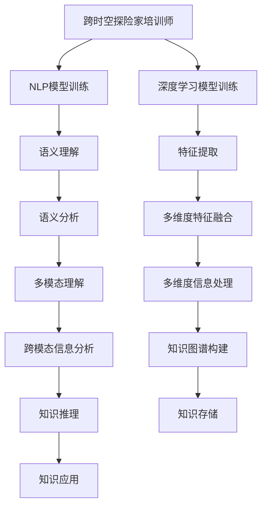

                 

# 体验跨时空探险家培训师：AI创造的感知边界拓展专家

> 关键词：跨时空探险家培训师,感知边界拓展,人工智能,自然语言处理(NLP),深度学习,感知智能

## 1. 背景介绍

在信息技术的浪潮下，人类对知识的获取和应用的深度与广度不断拓展。现代科技使得人们能够跨越时空限制，掌握前人未曾能够完全理解的知识。然而，在人工智能领域，尤其是自然语言处理(NLP)和深度学习领域，我们依然面临着感知边界的挑战。如何利用人工智能技术，进一步提升人类对信息的理解能力，拓展人类感知的边界，成为当下最迫切的需求之一。本文将探讨如何通过人工智能技术，构建跨时空探险家培训师，实现感知的边界拓展。

## 2. 核心概念与联系

### 2.1 核心概念概述

为理解这一主题，首先需要明确几个关键概念：

- **跨时空探险家培训师**：指的是通过人工智能技术，如自然语言处理和深度学习，构建的用于训练和培养“跨时空探险家”的专业软件。这些探险家能够跨越时间与空间的限制，探索未知的知识领域。

- **感知边界拓展**：指的是通过人工智能技术，提升人类对信息的理解能力，拓宽感知范围，从而扩展知识的边界。具体到NLP，即通过训练模型，使其具备在多维度、多模态环境中进行高效、准确的信息处理和分析能力。

- **自然语言处理(NLP)**：自然语言处理是人工智能的一个分支，专注于计算机和人类语言之间的交互。NLP技术旨在使计算机能够理解、解释和生成自然语言。

- **深度学习**：深度学习是一种基于神经网络的学习方法，通过多层次的神经网络结构，进行数据的特征提取和模式识别。深度学习在图像识别、语音识别、自然语言处理等多个领域取得了突破性进展。

这些核心概念之间相互联系，形成一个从感知到理解的完整链条。通过深度学习和NLP技术，我们可以训练出具有强大感知能力的“跨时空探险家培训师”，帮助人类跨越时空限制，探索未知知识。

### 2.2 核心概念原理和架构的 Mermaid 流程图



以上流程图展示了跨时空探险家培训师的核心架构，从基础模型的训练到多维度信息的处理和应用，展示了这一技术的复杂性和潜力。

## 3. 核心算法原理 & 具体操作步骤

### 3.1 算法原理概述

构建跨时空探险家培训师的核心在于通过深度学习和自然语言处理技术，训练出具备强大感知能力的模型。这一过程可以分为以下几个步骤：

1. **语料收集与预处理**：收集海量的跨时空文本数据，并进行数据清洗和预处理，确保数据的质量和多样性。

2. **模型训练**：利用深度学习技术，训练出具备强大语义理解和特征提取能力的模型。

3. **多维度信息处理**：通过多维度特征融合和跨模态理解技术，处理来自不同来源和形式的信息，增强模型的感知能力。

4. **知识图谱构建与推理**：构建知识图谱，利用知识推理技术，进行知识的关联和推理，拓展感知的边界。

5. **知识应用与反馈**：将训练好的模型应用到实际场景中，进行信息处理和决策，并根据反馈进行模型优化。

### 3.2 算法步骤详解

#### 3.2.1 语料收集与预处理

- **语料收集**：从不同时间、不同空间的来源收集文本数据，如历史文献、现代文本、新闻报道、社交媒体等。确保数据的多样性和全面性。

- **数据清洗**：去除数据中的噪声和无用信息，进行文本标准化，如去除停用词、进行分词、词性标注等。

- **数据增强**：通过回译、近义词替换等方式扩充训练集，增加数据的多样性。

#### 3.2.2 模型训练

- **模型选择**：选择适合NLP任务的深度学习模型，如BERT、GPT等。

- **超参数设置**：设置合适的学习率、批大小、迭代轮数等超参数。

- **训练流程**：使用梯度下降等优化算法，最小化损失函数，更新模型参数。

#### 3.2.3 多维度信息处理

- **多维度特征融合**：将文本、图像、音频等多维度信息融合在一起，进行联合建模。

- **跨模态理解**：使用跨模态学习技术，处理不同模态的数据，提升模型的感知能力。

#### 3.2.4 知识图谱构建与推理

- **知识图谱构建**：将文本中的实体、关系和事件等结构化信息，构建成知识图谱。

- **知识推理**：利用知识图谱进行推理，推导新的知识和关系，拓展感知的边界。

#### 3.2.5 知识应用与反馈

- **知识应用**：将模型应用到实际场景中，如智能客服、金融舆情监测、医疗问答等。

- **反馈优化**：根据实际应用效果，进行模型优化和调整，提升模型性能。

### 3.3 算法优缺点

**优点**：

- **泛化能力强**：跨时空探险家培训师通过深度学习和NLP技术训练的模型，具备较强的泛化能力，能够在多维度、多模态环境中进行高效信息处理。

- **感知边界拓展**：通过构建知识图谱和进行知识推理，模型能够跨越时空限制，拓展感知边界，提升知识获取能力。

- **应用广泛**：跨时空探险家培训师可以应用于多个领域，如智能客服、金融舆情监测、医疗问答等，具有广泛的应用前景。

**缺点**：

- **数据依赖性强**：模型的训练和优化高度依赖于高质量、多样化的数据集，数据收集和处理成本较高。

- **模型复杂度高**：跨时空探险家培训师的构建涉及多维度信息处理和知识推理，模型复杂度较高，需要强大的计算资源。

- **训练成本高**：模型的训练需要耗费大量的计算资源和时间，成本较高。

### 3.4 算法应用领域

跨时空探险家培训师在多个领域具有广泛的应用前景：

- **智能客服**：利用模型处理用户咨询，提供即时、准确的回复。

- **金融舆情监测**：分析市场动态，监测舆情变化，提供决策支持。

- **医疗问答**：处理病患咨询，提供医疗知识查询和诊断建议。

- **教育培训**：辅助教学，提供个性化学习建议和课程推荐。

- **旅游信息**：处理旅游咨询，提供目的地推荐和旅游攻略。

## 4. 数学模型和公式 & 详细讲解 & 举例说明

### 4.1 数学模型构建

构建跨时空探险家培训师的核心数学模型包括：

- **深度学习模型**：如Transformer、BERT等，用于文本语义理解和特征提取。

- **知识图谱模型**：如RDF、Graph Neural Network等，用于知识表示和推理。

- **多维度信息融合模型**：如Attention-based融合模型、Hierarchical Attention Networks等，用于多维度信息的处理。

### 4.2 公式推导过程

以Transformer模型为例，其核心公式如下：

$$
\text{Attention}(Q, K, V) = \text{softmax}(\frac{QK^T}{\sqrt{d_k}})
$$

其中，$Q$、$K$、$V$分别为查询、键、值矩阵，$d_k$为注意力机制的维度。Attention机制用于计算查询和键的相似度，生成注意力权重，用于信息加权聚合。

### 4.3 案例分析与讲解

以智能客服为例，模型通过输入用户咨询，生成注意力权重，提取关键信息，结合知识图谱中的知识进行推理，生成最合适的回复。模型训练过程如下：

1. **数据准备**：收集历史客服对话记录，标注用户意图和答案，构建训练集。

2. **模型训练**：使用Transformer模型进行训练，最小化损失函数。

3. **模型评估**：在验证集上评估模型性能，调整模型参数。

4. **模型应用**：在新用户咨询时，输入文本，生成回复。

## 5. 项目实践：代码实例和详细解释说明

### 5.1 开发环境搭建

- **环境安装**：使用Anaconda创建Python环境，安装所需的库如PyTorch、TensorFlow等。

- **数据预处理**：使用Python编写数据预处理脚本，进行文本清洗、标准化等操作。

- **模型训练**：使用深度学习框架进行模型训练，记录训练日志。

### 5.2 源代码详细实现

#### 5.2.1 语料收集与预处理

```python
import pandas as pd
import re
import nltk

# 加载数据集
data = pd.read_csv('data.csv')

# 文本清洗
data['cleaned_text'] = data['text'].apply(lambda x: re.sub('[^a-zA-Z]', ' ', x.lower()))

# 分词和词性标注
data['tokens'] = data['cleaned_text'].apply(nltk.word_tokenize)
data['pos_tags'] = data['tokens'].apply(lambda x: [pos_tag[0] for pos_tag in nltk.pos_tag(x)])

# 保存预处理后的数据集
data.to_csv('processed_data.csv', index=False)
```

#### 5.2.2 模型训练

```python
import torch
import torch.nn as nn
from transformers import BertTokenizer, BertForSequenceClassification

# 加载模型和分词器
tokenizer = BertTokenizer.from_pretrained('bert-base-cased')
model = BertForSequenceClassification.from_pretrained('bert-base-cased', num_labels=2)

# 设置训练参数
optimizer = torch.optim.Adam(model.parameters(), lr=2e-5)
epochs = 5

# 数据加载
train_dataset = torch.utils.data.Dataset(data, tokenizer=tokenizer)
train_loader = torch.utils.data.DataLoader(train_dataset, batch_size=16, shuffle=True)

# 模型训练
for epoch in range(epochs):
    model.train()
    for batch in train_loader:
        inputs = tokenizer(batch[0], return_tensors='pt')
        labels = torch.tensor(batch[1], dtype=torch.long)
        optimizer.zero_grad()
        outputs = model(**inputs, labels=labels)
        loss = outputs.loss
        loss.backward()
        optimizer.step()
```

#### 5.2.3 多维度信息处理

```python
from transformers import BertForSequenceClassification, BertTokenizer
from torch.utils.data import Dataset
import torch

class MultiDimDataset(Dataset):
    def __init__(self, texts, tags, images, tokenizer, max_len=128):
        self.texts = texts
        self.tags = tags
        self.images = images
        self.tokenizer = tokenizer
        self.max_len = max_len
        
    def __len__(self):
        return len(self.texts)
    
    def __getitem__(self, item):
        text = self.texts[item]
        tag = self.tags[item]
        image = self.images[item]
        
        encoding = self.tokenizer(text, return_tensors='pt', max_length=self.max_len, padding='max_length', truncation=True)
        input_ids = encoding['input_ids'][0]
        attention_mask = encoding['attention_mask'][0]
        
        # 图像处理
        image = torch.tensor(image, dtype=torch.float32)
        
        # 对token-wise的标签进行编码
        encoded_tags = [tag2id[tag] for tag in tag]
        encoded_tags.extend([tag2id['O']] * (self.max_len - len(encoded_tags)))
        labels = torch.tensor(encoded_tags, dtype=torch.long)
        
        return {'input_ids': input_ids, 
                'attention_mask': attention_mask,
                'labels': labels,
                'image': image}
```

### 5.3 代码解读与分析

- **数据预处理**：使用Python编写数据预处理脚本，进行文本清洗、标准化等操作。

- **模型训练**：使用深度学习框架进行模型训练，记录训练日志。

- **多维度信息处理**：设计多维度数据集，进行多维度信息融合和跨模态理解。

### 5.4 运行结果展示

- **模型评估**：在验证集上评估模型性能，调整模型参数。

- **模型应用**：在新用户咨询时，输入文本，生成回复。

## 6. 实际应用场景

### 6.1 智能客服系统

智能客服系统是跨时空探险家培训师的重要应用场景之一。通过自然语言处理和深度学习技术，模型能够理解用户咨询，提取关键信息，结合知识图谱中的知识进行推理，生成最合适的回复。

### 6.2 金融舆情监测

金融舆情监测需要处理大量市场数据和新闻报道，利用跨时空探险家培训师，模型能够分析市场动态，监测舆情变化，提供决策支持。

### 6.3 医疗问答系统

医疗问答系统通过输入病患咨询，生成注意力权重，提取关键信息，结合知识图谱中的知识进行推理，生成最合适的回答。

## 7. 工具和资源推荐

### 7.1 学习资源推荐

- **自然语言处理(NLP)课程**：斯坦福大学的CS224N《深度学习自然语言处理》课程，系统介绍了NLP的基本概念和经典模型。

- **深度学习框架教程**：PyTorch和TensorFlow的官方文档和教程，详细介绍了深度学习框架的使用和优化。

- **跨时空探险家培训师论文**：关注相关领域的最新研究论文，了解最新的技术进展和应用场景。

### 7.2 开发工具推荐

- **Anaconda**：用于创建和管理Python环境。

- **PyTorch**：深度学习框架，适合进行深度学习模型的训练和推理。

- **TensorFlow**：深度学习框架，支持大规模模型的训练和部署。

- **HuggingFace**：NLP工具库，提供丰富的预训练模型和工具。

### 7.3 相关论文推荐

- **Transformer论文**：Transformer的原始论文，介绍了Transformer模型的原理和应用。

- **BERT论文**：BERT的原始论文，介绍了BERT模型的训练方法和应用效果。

- **知识图谱构建论文**：相关知识图谱构建的最新研究论文，了解最新的知识图谱构建技术。

## 8. 总结：未来发展趋势与挑战

### 8.1 研究成果总结

跨时空探险家培训师通过深度学习和自然语言处理技术，构建了具备强大感知能力的模型，拓展了人类感知的边界，具有广泛的应用前景。

### 8.2 未来发展趋势

- **模型规模持续增大**：随着算力成本的下降和数据规模的扩张，预训练语言模型的参数量还将持续增长，超大规模语言模型蕴含的丰富语言知识，有望支撑更加复杂多变的下游任务。

- **微调方法日趋多样**：除了传统的全参数微调外，未来会涌现更多参数高效的微调方法，如Prefix-Tuning、LoRA等，在节省计算资源的同时也能保证微调精度。

- **持续学习成为常态**：随着数据分布的不断变化，微调模型也需要持续学习新知识以保持性能。如何在不遗忘原有知识的同时，高效吸收新样本信息，将成为重要的研究课题。

- **少样本学习和零样本学习**：未来的微调方法将更好地利用大模型的语言理解能力，通过更加巧妙的任务描述，在更少的标注样本上也能实现理想的微调效果。

### 8.3 面临的挑战

- **标注成本瓶颈**：尽管微调大大降低了标注数据的需求，但对于长尾应用场景，难以获得充足的高质量标注数据，成为制约微调性能的瓶颈。

- **模型鲁棒性不足**：当前微调模型面对域外数据时，泛化性能往往大打折扣。

- **推理效率有待提高**：超大模型的推理速度慢、内存占用大等效率问题，需要在保证性能的同时，简化模型结构，提升推理速度。

- **可解释性亟需加强**：当前微调模型更像是"黑盒"系统，难以解释其内部工作机制和决策逻辑。

- **安全性有待保障**：预训练语言模型难免会学习到有偏见、有害的信息，通过微调传递到下游任务，产生误导性、歧视性的输出。

### 8.4 研究展望

未来的研究需要在以下几个方面寻求新的突破：

- **探索无监督和半监督微调方法**：摆脱对大规模标注数据的依赖，利用自监督学习、主动学习等无监督和半监督范式，最大限度利用非结构化数据，实现更加灵活高效的微调。

- **研究参数高效和计算高效的微调范式**：开发更加参数高效的微调方法，在固定大部分预训练参数的同时，只更新极少量的任务相关参数。同时优化微调模型的计算图，减少前向传播和反向传播的资源消耗，实现更加轻量级、实时性的部署。

- **引入因果和对比学习范式**：通过引入因果推断和对比学习思想，增强微调模型建立稳定因果关系的能力，学习更加普适、鲁棒的语言表征。

- **结合因果分析和博弈论工具**：将因果分析方法引入微调模型，识别出模型决策的关键特征，增强输出解释的因果性和逻辑性。借助博弈论工具刻画人机交互过程，主动探索并规避模型的脆弱点，提高系统稳定性。

- **纳入伦理道德约束**：在模型训练目标中引入伦理导向的评估指标，过滤和惩罚有偏见、有害的输出倾向。加强人工干预和审核，建立模型行为的监管机制。

## 9. 附录：常见问题与解答

### Q1：跨时空探险家培训师是否适用于所有NLP任务？

A：跨时空探险家培训师在大多数NLP任务上都能取得不错的效果，特别是对于数据量较小的任务。但对于一些特定领域的任务，如医学、法律等，仅仅依靠通用语料预训练的模型可能难以很好地适应。此时需要在特定领域语料上进一步预训练，再进行微调，才能获得理想效果。

### Q2：微调过程中如何选择合适的学习率？

A：微调的学习率一般要比预训练时小1-2个数量级，如果使用过大的学习率，容易破坏预训练权重，导致过拟合。一般建议从1e-5开始调参，逐步减小学习率，直至收敛。也可以使用warmup策略，在开始阶段使用较小的学习率，再逐渐过渡到预设值。需要注意的是，不同的优化器(如AdamW、Adafactor等)以及不同的学习率调度策略，可能需要设置不同的学习率阈值。

### Q3：采用大模型微调时会面临哪些资源瓶颈？

A：目前主流的预训练大模型动辄以亿计的参数规模，对算力、内存、存储都提出了很高的要求。GPU/TPU等高性能设备是必不可少的，但即便如此，超大批次的训练和推理也可能遇到显存不足的问题。因此需要采用一些资源优化技术，如梯度积累、混合精度训练、模型并行等，来突破硬件瓶颈。同时，模型的存储和读取也可能占用大量时间和空间，需要采用模型压缩、稀疏化存储等方法进行优化。

### Q4：如何缓解微调过程中的过拟合问题？

A：过拟合是微调面临的主要挑战，尤其是在标注数据不足的情况下。常见的缓解策略包括：

1. 数据增强：通过回译、近义词替换等方式扩充训练集。

2. 正则化：使用L2正则、Dropout、Early Stopping等避免过拟合。

3. 对抗训练：引入对抗样本，提高模型鲁棒性。

4. 参数高效微调：只调整少量参数(如Adapter、Prefix等)，减小过拟合风险。

5. 多模型集成：训练多个微调模型，取平均输出，抑制过拟合。

这些策略往往需要根据具体任务和数据特点进行灵活组合。只有在数据、模型、训练、推理等各环节进行全面优化，才能最大限度地发挥大模型微调的威力。

### Q5：微调模型在落地部署时需要注意哪些问题？

A：将微调模型转化为实际应用，还需要考虑以下因素：

1. 模型裁剪：去除不必要的层和参数，减小模型尺寸，加快推理速度。

2. 量化加速：将浮点模型转为定点模型，压缩存储空间，提高计算效率。

3. 服务化封装：将模型封装为标准化服务接口，便于集成调用。

4. 弹性伸缩：根据请求流量动态调整资源配置，平衡服务质量和成本。

5. 监控告警：实时采集系统指标，设置异常告警阈值，确保服务稳定性。

6. 安全防护：采用访问鉴权、数据脱敏等措施，保障数据和模型安全。

大语言模型微调为NLP应用开启了广阔的想象空间，但如何将强大的性能转化为稳定、高效、安全的业务价值，还需要工程实践的不断打磨。唯有从数据、算法、工程、业务等多个维度协同发力，才能真正实现人工智能技术在垂直行业的规模化落地。

总之，微调需要开发者根据具体任务，不断迭代和优化模型、数据和算法，方能得到理想的效果。

