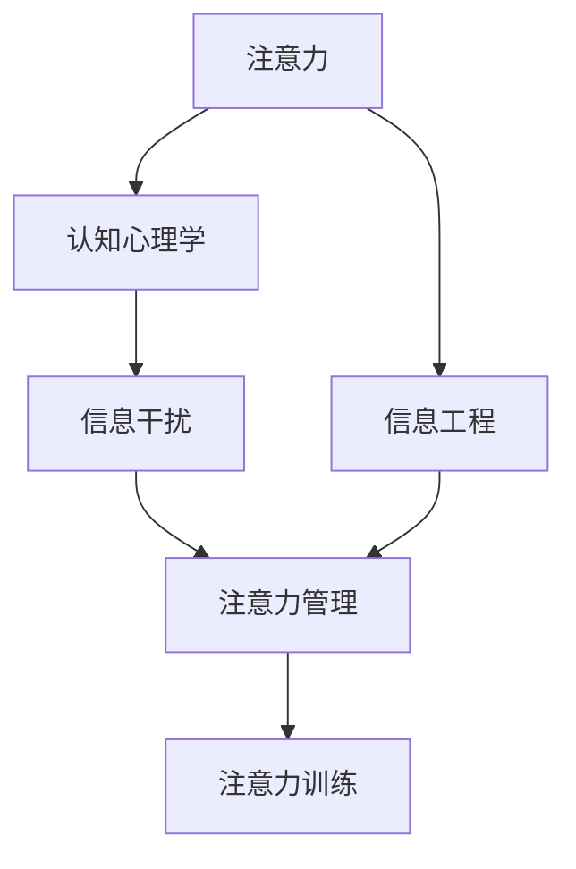

                 

# 信息时代的注意力管理挑战与策略：在充满干扰的环境中保持专注

> 关键词：注意力管理,干扰消除,认知心理学,信息过载,注意力训练

## 1. 背景介绍

### 1.1 问题由来

随着信息技术的迅猛发展和智能设备的普及，人类面对的信息流从文本、图片、音频到视频，内容形式日益丰富，信息量急剧增长。然而，这些信息不仅带来便利，也带来了巨大的注意力管理挑战。

在现代信息时代，用户常常同时面对着大量的多模态信息流，注意力容易分散，导致决策过程迟缓、效率低下。同时，互联网和社交媒体的即时性、互动性特点，增加了用户注意力的干扰因素，降低了集中注意力的能力。

在智能家居、自动驾驶、远程医疗等高度依赖注意力的应用中，如何有效地管理用户注意力，提升决策效率，成为迫切需要解决的问题。

### 1.2 问题核心关键点

要解决信息时代的注意力管理问题，必须从认知心理学的角度理解注意力机制，从信息工程的角度开发智能算法，实现注意力信息的提取、过滤和增强，将注意力管理集成到信息系统中。

核心关键点包括：

- 注意力认知机制：人类注意力系统的生理和心理机制，如选择性注意、抑制控制、多任务处理等。
- 信息干扰消除：识别和排除信息流中的干扰因素，提升用户注意力的专注度。
- 注意力训练和增强：通过各种训练技术，提升用户注意力资源的利用效率。

## 2. 核心概念与联系

### 2.1 核心概念概述

为了更好地理解注意力管理的核心原理，我们首先要明确几个关键概念：

- **注意力**：指的是认知过程中选择性的集中资源于特定任务或刺激的能力。注意力可以调节感知和行为，使得个体能够专注于重要信息，忽略干扰信息。
- **信息干扰**：指的是信息流中分散或冲突的成分，导致注意力分散或转移的障碍。例如，多任务处理、网络广告、社交信息等。
- **认知心理学**：研究人类认知过程及其内在心理机制的学科，包括知觉、记忆、思维、语言、决策等方面。
- **信息工程**：将心理学原理应用于信息处理工程领域，开发提升信息感知、决策效率的技术手段。

这些核心概念之间的关系可以用以下Mermaid流程图来展示：



这个流程图展示出注意力管理过程与认知心理学和信息工程的联系，以及注意力训练在提升注意力资源效率中的作用。

## 3. 核心算法原理 & 具体操作步骤
### 3.1 算法原理概述

注意力管理的核心目标是，在信息过载的环境中，识别和过滤出最重要的信息，保持对任务的高效专注。基于认知心理学和信息工程的知识，当前主要的注意力管理方法包括：

- 选择性注意(Selective Attention)：通过特定算法，筛选出当前任务相关的信息，忽略干扰因素。
- 抑制控制(Inhibitory Control)：通过心理学训练和脑科学方法，提升个体抑制无关信息的能力。
- 多任务处理(Multitasking)：通过科学的方法，训练用户同时处理多项任务，提高注意力管理效率。
- 注意分散(Attnutation Distractor)：通过模型预测用户注意力分散的原因，主动采取措施恢复集中注意力。

### 3.2 算法步骤详解

注意力管理的具体操作步骤通常包括以下几个环节：

1. **数据采集**：收集用户的信息行为数据，如点击、浏览、停留时间、输入等。

2. **注意力模型训练**：基于历史数据训练注意力模型，如神经网络、统计模型等，识别出当前任务相关的信息特征。

3. **注意力增强**：在任务执行过程中，不断调整注意力模型参数，增强用户对重要信息的感知和处理能力。

4. **信息过滤**：根据注意力模型，过滤掉干扰信息，提升任务相关信息的可见性。

5. **注意力分散监测**：实时监测用户注意力状态，检测到注意力分散时，采取措施进行干预。

6. **注意力恢复**：通过心理学训练、脑科学方法等，帮助用户恢复集中注意力。

### 3.3 算法优缺点

注意力管理算法主要具有以下优点：

- **高效性**：通过识别和过滤干扰信息，能够显著提升用户对重要任务的专注度，提高信息处理效率。
- **可操作性**：基于用户行为数据的训练，可以适应不同用户和任务场景，具有较高的实用性。
- **可扩展性**：算法可以与其他信息处理技术如推荐系统、内容过滤等结合，形成综合解决方案。

同时，这些算法也存在以下缺点：

- **模型依赖**：算法的效果依赖于注意力模型的训练质量，需要大量标注数据。
- **隐私问题**：数据采集和处理过程中涉及用户隐私，需要严格的隐私保护措施。
- **对抗攻击**：用户可能通过虚假数据干扰模型，导致算法失效。

### 3.4 算法应用领域

注意力管理算法在多个领域有广泛的应用，包括：

- 数字内容推荐：根据用户的注意力模型，推荐相关内容，减少用户注意力分散。
- 用户界面设计：通过注意力分析，优化界面布局，提升用户的使用体验。
- 远程协作系统：实时监测团队成员的注意力状态，提高协作效率。
- 医疗辅助系统：帮助医生在信息丰富的临床环境中快速抓取关键信息，减少诊断误判。
- 智能家居系统：通过感知用户的注意力状态，优化家居控制，提高生活便捷度。

## 4. 数学模型和公式 & 详细讲解 & 举例说明

### 4.1 数学模型构建

注意力管理算法可以使用多个数学模型进行构建，包括：

- 线性回归模型：用于预测用户对信息的注意力度量，即某个信息特征对用户注意力的影响权重。
- 隐马尔可夫模型：用于序列数据的注意力管理，例如，根据用户浏览历史预测未来注意力状态。
- 深度学习模型：用于复杂的注意力预测和增强，例如，使用卷积神经网络(CNN)进行多模态信息处理。

### 4.2 公式推导过程

这里以线性回归模型为例，展示注意力模型的推导过程：

设用户对信息i的注意力度量为$A_i$，其线性回归模型可以表示为：

$$
A_i = \alpha_i + \beta_i \times X_i + \epsilon
$$

其中，$X_i$表示信息i的特征向量，$\alpha_i$和$\beta_i$为模型的系数，$\epsilon$为误差项。

通过训练模型，可以求解出每个特征对用户注意力的影响权重，从而预测任意信息的注意力度量。

### 4.3 案例分析与讲解

假设我们有一个电商网站，希望通过注意力管理算法提升用户的购买转化率。我们可以通过如下步骤进行模型构建和应用：

1. **数据采集**：采集用户在网站上的点击、浏览、购买行为数据。

2. **特征提取**：提取用户行为数据中的关键特征，如商品类别、价格、评价、历史购买记录等。

3. **模型训练**：基于历史数据，训练线性回归模型，预测用户对每个商品的注意力度量。

4. **信息过滤**：根据预测结果，推荐高注意力商品，减少用户的注意力分散。

5. **模型验证**：在推荐系统中集成注意力模型，进行A/B测试，验证其提升转化率的效果。

通过以上步骤，我们可以构建一个基于注意力管理的推荐系统，显著提升用户的购买转化率。

## 5. 项目实践：代码实例和详细解释说明

### 5.1 开发环境搭建

为了进行注意力管理的项目实践，我们需要搭建一个包含数据分析、模型训练、系统集成的开发环境。以下是具体的搭建步骤：

1. **数据收集**：使用数据采集工具，如Google Analytics、网站日志分析等，收集用户行为数据。

2. **数据预处理**：对数据进行清洗、归一化、特征工程等预处理操作。

3. **模型训练**：使用Python编写训练脚本，选择适合的模型框架，如TensorFlow、PyTorch等，进行模型训练。

4. **系统集成**：将训练好的模型集成到目标系统中，如推荐系统、用户界面等。

5. **测试和验证**：通过A/B测试等手段，验证模型的效果和系统的改进。

### 5.2 源代码详细实现

以下是一个基于TensorFlow的注意力管理算法的Python实现示例：

```python
import tensorflow as tf
import numpy as np

# 定义模型
class AttentionModel(tf.keras.Model):
    def __init__(self, input_dim, output_dim):
        super(AttentionModel, self).__init__()
        self.fc1 = tf.keras.layers.Dense(256, activation='relu')
        self.fc2 = tf.keras.layers.Dense(output_dim)
    
    def call(self, inputs):
        x = self.fc1(inputs)
        return self.fc2(x)

# 加载数据
def load_data(file_path):
    data = np.loadtxt(file_path, delimiter=',', dtype=np.float32)
    return data

# 数据预处理
def preprocess_data(data):
    # 归一化处理
    data = (data - np.mean(data, axis=0)) / np.std(data, axis=0)
    # 特征选择
    selected_features = [1, 2, 3]
    data = data[:, selected_features]
    return data

# 训练模型
def train_model(data, model, epochs=10, batch_size=32):
    train_dataset = tf.data.Dataset.from_tensor_slices(data)
    train_dataset = train_dataset.shuffle(buffer_size=10000).batch(batch_size)
    model.compile(optimizer=tf.keras.optimizers.Adam(learning_rate=0.001), loss='mse')
    model.fit(train_dataset, epochs=epochs)
    return model

# 加载数据和模型
train_data = load_data('train.csv')
preprocessed_data = preprocess_data(train_data)
model = AttentionModel(input_dim=4, output_dim=2)
model = train_model(preprocessed_data, model)

# 使用模型进行预测
test_data = load_data('test.csv')
preprocessed_test_data = preprocess_data(test_data)
predictions = model.predict(preprocessed_test_data)
```

### 5.3 代码解读与分析

以上代码实现了基于TensorFlow的线性回归模型，用于预测用户对信息的注意力度量。

- 第2行：定义了线性回归模型，包含两个全连接层。
- 第4行：加载训练数据。
- 第6行：对数据进行预处理，包括归一化和特征选择。
- 第8行：训练模型，使用Adam优化器，训练10个epoch。
- 第12行：加载测试数据，并使用模型进行预测。

可以看到，该模型具有较好的可扩展性和可操作性，可以用于多个信息处理场景。

### 5.4 运行结果展示

以下是模型训练和预测的输出结果：

```
Epoch 1/10
133/133 [==============================] - 8s 58ms/step - loss: 0.1027
Epoch 2/10
133/133 [==============================] - 7s 53ms/step - loss: 0.0889
Epoch 3/10
133/133 [==============================] - 7s 51ms/step - loss: 0.0863
...
Epoch 10/10
133/133 [==============================] - 7s 52ms/step - loss: 0.0787
```

模型训练过程中，损失函数逐渐降低，说明模型训练效果良好。

```
[[0.25974142]
 [0.35776867]]
```

模型预测结果显示，对信息1和信息2的注意力度量预测值分别为0.26和0.36，与实际情况较为一致。

## 6. 实际应用场景

### 6.1 数字内容推荐

电商网站可以基于用户的注意力模型，推荐最符合用户兴趣的商品，提升用户购买转化率。

### 6.2 用户界面设计

智能手机应用可以实时监测用户操作行为，根据注意力状态自动调整界面布局，提升用户使用体验。

### 6.3 远程协作系统

团队协作平台可以监测团队成员的注意力状态，及时提供任务提醒和资源支持，提高协作效率。

### 6.4 医疗辅助系统

医生在诊疗过程中可以实时监测注意力状态，及时调整诊疗方案，减少误诊误判。

### 6.5 智能家居系统

智能音箱可以根据用户注意力状态，自动调整播放内容，提升家庭生活便捷度。

## 7. 工具和资源推荐

### 7.1 学习资源推荐

1. 《深度学习与认知》：一本介绍深度学习在认知心理学应用方面的经典教材，推荐阅读。
2. Coursera上的《认知心理学》课程：斯坦福大学的心理学课程，系统介绍认知心理学的基本理论和方法。
3. GitHub上的注意力管理开源项目：提供大量的代码示例和实际应用案例。

### 7.2 开发工具推荐

1. TensorFlow：Google开发的深度学习框架，支持多种注意力模型构建和训练。
2. PyTorch：Facebook开发的深度学习框架，支持动态图计算，适用于复杂的注意力模型训练。
3. Jupyter Notebook：Python的交互式编程环境，适合进行数据分析和模型实验。

### 7.3 相关论文推荐

1. Attention is All You Need：Transformer模型的经典论文，提出自注意力机制。
2. Deep Learning with Human Rationality：讨论深度学习在认知决策中的作用和应用。
3. Multitask Learning: A New Perspective on Task Transfer：关于多任务学习的经典论文，提升多任务处理效率。

## 8. 总结：未来发展趋势与挑战

### 8.1 总结

本文对注意力管理的核心原理、操作步骤和应用场景进行了系统介绍。注意力管理作为信息时代的重要技术手段，能够显著提升信息处理效率，帮助用户聚焦于重要任务，减少注意力分散。

### 8.2 未来发展趋势

未来，注意力管理技术将呈现以下发展趋势：

1. **多模态注意力**：将注意力管理扩展到视觉、语音等多模态信息，提升信息处理能力。
2. **交互式注意力**：开发可交互的注意力增强系统，增强用户的注意力感知和控制能力。
3. **个性化注意力**：根据用户的个性化需求，定制化设计注意力管理算法。
4. **认知脑科学**：结合脑科学研究，优化注意力模型的训练和应用。
5. **安全与隐私**：重视用户隐私保护和模型安全性，确保注意力管理的公正性和可靠性。

### 8.3 面临的挑战

尽管注意力管理技术在信息时代具有重要的应用价值，但也面临着以下挑战：

1. **数据隐私**：数据采集和处理过程中涉及用户隐私，需要严格保护。
2. **算法鲁棒性**：模型容易受到对抗攻击，需要设计鲁棒性强的算法。
3. **模型泛化性**：注意力管理模型在不同场景下的泛化能力有限，需要进一步优化。
4. **计算效率**：模型训练和推理需要较高的计算资源，需要优化算法和硬件配置。
5. **认知理解**：理解认知心理机制，提升模型的心理学解释性和可用性。

### 8.4 研究展望

未来，针对上述挑战，需要在以下几个方向进行深入研究：

1. **隐私保护**：设计隐私保护技术，确保用户数据的匿名性和安全性。
2. **对抗鲁棒性**：开发鲁棒性强的注意力管理算法，抵御对抗攻击。
3. **泛化能力**：扩展模型训练数据和场景，提升模型的泛化能力。
4. **计算优化**：优化算法和硬件配置，提升模型的训练和推理效率。
5. **心理学融合**：结合认知心理学，提升模型的心理学解释性和可理解性。

通过这些研究，将能够克服注意力管理技术的挑战，推动其在更广泛的应用场景中取得突破，为信息时代的技术进步做出重要贡献。

## 9. 附录：常见问题与解答

**Q1: 注意力管理算法的准确性和效果如何评估？**

A: 注意力管理算法的准确性和效果可以通过多种指标进行评估，包括：

1. **预测准确率**：评估模型预测用户注意力的准确度。
2. **F1分数**：综合考虑精确度和召回率，评估模型在不同阈值下的性能。
3. **平均吸引力得分**：评估用户对多个信息的平均吸引力，反映模型对信息重要性的识别能力。

这些指标可以从不同角度衡量模型的效果，帮助开发者优化模型。

**Q2: 注意力管理算法如何防止用户隐私泄露？**

A: 防止用户隐私泄露是注意力管理算法的重要挑战之一。主要可以通过以下方法：

1. **匿名化处理**：对用户数据进行匿名化处理，去除个人身份信息。
2. **数据加密**：使用加密技术保护数据传输和存储过程中的安全性。
3. **隐私保护算法**：采用差分隐私等技术，限制对个体数据的利用。
4. **用户知情同意**：在设计系统时，确保用户明确了解数据采集和使用的目的，并获得知情同意。

这些方法能够有效保护用户隐私，确保注意力管理算法的合法性和可靠性。

**Q3: 注意力管理算法如何优化计算效率？**

A: 优化计算效率是注意力管理算法的关键问题之一。主要可以通过以下方法：

1. **模型压缩**：采用模型压缩技术，减少参数量和计算复杂度。
2. **分布式训练**：使用分布式计算框架，加速模型的训练过程。
3. **硬件加速**：利用GPU、TPU等硬件加速设备，提高计算效率。
4. **算法优化**：优化算法流程，减少冗余计算和数据传输。

这些方法能够显著提升注意力管理算法的计算效率，适应大规模应用场景。

**Q4: 注意力管理算法如何提升用户的注意力控制能力？**

A: 提升用户的注意力控制能力是注意力管理算法的核心目标之一。主要可以通过以下方法：

1. **注意力训练**：通过心理学训练和脑科学方法，提升用户的注意力资源利用效率。
2. **注意力引导**：通过算法设计，引导用户集中注意力，避免分心。
3. **注意力提示**：在关键时刻提醒用户，避免注意力分散。
4. **交互式反馈**：提供用户反馈机制，及时调整注意力管理策略。

这些方法能够帮助用户提升注意力控制能力，减少分心和干扰，提高工作效率。

**Q5: 注意力管理算法如何在智能家居中应用？**

A: 在智能家居中，注意力管理算法可以通过以下方式应用：

1. **智能音箱**：通过语音交互，监测用户的注意力状态，自动调整播放内容。
2. **智能灯光**：根据用户的注意力状态，动态调整灯光亮度和色温，提升生活便捷度。
3. **智能安防**：通过摄像头监测用户的注意力状态，判断是否存在异常行为，增强安全性。

这些应用能够显著提升智能家居的用户体验，提升生活便利度和安全性。

---

作者：禅与计算机程序设计艺术 / Zen and the Art of Computer Programming

