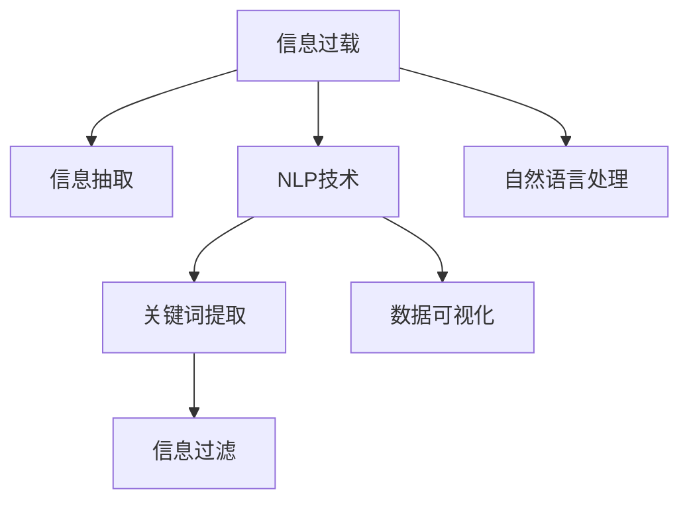

                 

# 信息简化的力量：如何在混乱中找到重点

## 1. 背景介绍

### 1.1 问题由来

在信息爆炸的今天，每天我们被海量的数据和信息所淹没，从新闻、社交媒体到企业内部的数据报告，信息量巨大且来源多样。然而，这些信息的价值却参差不齐，很多时候，我们花费大量时间和精力去阅读那些无关紧要的内容，反而忽视了真正有价值的信息。

### 1.2 问题核心关键点

面对大量复杂信息，如何在其中快速识别和提取关键信息，成为我们迫切需要解决的问题。信息简化的力量就在于能够帮助我们从混乱中找到重点，快速抓住信息的核心，并利用这些核心信息进行决策和行动。

### 1.3 问题研究意义

对于个人、企业和组织而言，信息简化能力是一个重要的核心竞争力。它能够帮助我们提升效率，减少决策风险，加快创新步伐，从而在竞争激烈的市场中占据优势。因此，研究信息简化的原理和方法，对于提升整体信息处理能力具有重要的意义。

## 2. 核心概念与联系

### 2.1 核心概念概述

为更好地理解信息简化的过程，本节将介绍几个关键概念：

- **信息过载(Information Overload)**：指的是信息量过大，超出了人们处理能力的范围，导致无法有效利用这些信息的现象。
- **信息抽取(Information Extraction)**：指的是从大规模数据集中，自动提取出结构化或半结构化信息的过程。
- **自然语言处理(Natural Language Processing, NLP)**：是一套处理和分析人类语言的技术，包括分词、词性标注、命名实体识别、信息抽取等任务。
- **关键词提取(Keyword Extraction)**：指的是从文本中提取最具代表性的关键词或短语，以简要概括文本内容。
- **信息过滤(Information Filtering)**：指的是基于用户偏好和兴趣，对大量信息进行筛选和排序，以提供最相关的信息。
- **数据可视化(Data Visualization)**：指的是将数据以图形化方式展示出来，帮助人们更好地理解和分析数据。

这些概念之间的逻辑关系可以通过以下Mermaid流程图来展示：



这个流程图展示了几大关键概念之间的相互关系：

1. 信息过载需要通过信息抽取和自然语言处理技术来解决。
2. 自然语言处理技术中的关键词提取和信息过滤，能够帮助我们在大量的文本数据中快速识别关键信息。
3. 数据可视化技术可以辅助我们更好地理解信息过滤和关键词提取的结果。

## 3. 核心算法原理 & 具体操作步骤

### 3.1 算法原理概述

信息简化的过程本质上是对大规模数据进行筛选、提取、分析和呈现的过程。其核心算法原理主要包括以下几个步骤：

1. **数据清洗**：去除噪音数据和无用信息，确保处理的数据集是干净、结构化的。
2. **特征提取**：从清洗后的数据集中，提取关键特征和元数据，以便后续分析和处理。
3. **信息抽取**：使用自然语言处理技术，从文本中抽取结构化信息，如实体、关系等。
4. **关键词提取**：利用算法自动从文本中提取出最具代表性的关键词。
5. **信息过滤**：根据用户偏好和兴趣，对信息进行筛选和排序，提供最相关的信息。
6. **数据可视化**：将处理后的信息以图形化方式展示出来，便于理解和分析。

### 3.2 算法步骤详解

#### 3.2.1 数据清洗

数据清洗是信息简化的第一步，其主要目的是去除数据集中的噪音和无用信息，确保数据集的质量。数据清洗包括但不限于以下步骤：

1. **去重**：去除数据集中的重复记录，避免信息冗余。
2. **缺失值处理**：填充或删除缺失值，保证数据的完整性。
3. **异常值检测**：识别和处理异常值，避免数据偏差。
4. **格式统一**：将数据转换为统一的格式，便于后续处理。

#### 3.2.2 特征提取

特征提取是将数据转换为可分析形式的过程，其主要目的是从数据集中提取出关键特征，以便后续分析和处理。特征提取包括但不限于以下步骤：

1. **文本向量化**：将文本数据转换为向量形式，以便计算机处理。常用的方法包括TF-IDF、词嵌入等。
2. **时间序列处理**：对时间序列数据进行差分、平滑等处理，以便分析趋势和周期性。
3. **类别特征提取**：将分类变量转换为数值变量，以便进行统计分析。

#### 3.2.3 信息抽取

信息抽取是利用自然语言处理技术，从文本中自动提取出结构化信息的过程。其主要步骤如下：

1. **分词**：将文本按照词语进行分割，以便后续处理。
2. **词性标注**：对每个词语标注其词性，以便分析句子结构。
3. **命名实体识别**：识别文本中的人名、地名、机构名等实体。
4. **关系抽取**：从文本中提取实体之间的关系，如主谓宾关系。

#### 3.2.4 关键词提取

关键词提取是从文本中自动提取出最具代表性的关键词或短语的过程，其主要步骤如下：

1. **TF-IDF计算**：计算每个词语的词频-逆文档频率，以衡量其重要程度。
2. **文本降维**：使用文本降维技术，如主成分分析(PCA)、奇异值分解(SVD)等，将高维文本转换为低维向量。
3. **关键词选择**：根据计算出的重要性指标，选择最具代表性的关键词。

#### 3.2.5 信息过滤

信息过滤是利用算法对信息进行筛选和排序的过程，其主要步骤如下：

1. **用户兴趣建模**：根据用户的历史行为数据，构建用户兴趣模型。
2. **信息匹配**：将待处理信息与用户兴趣模型进行匹配，计算相关度。
3. **排序算法**：使用排序算法，如最大相关度排序、协同过滤等，对信息进行排序。

#### 3.2.6 数据可视化

数据可视化是将处理后的信息以图形化方式展示出来，其主要步骤如下：

1. **选择合适的可视化图表**：根据数据类型和分析目的，选择合适的可视化图表，如柱状图、折线图、散点图等。
2. **数据准备**：将数据转换为可视化工具所需的格式。
3. **可视化生成**：使用可视化工具，如Tableau、Power BI等，生成可视化图表。

### 3.3 算法优缺点

#### 3.3.1 优点

1. **提高效率**：通过自动化处理大规模数据，能够快速提取出关键信息，提高信息处理效率。
2. **减少噪音**：去除无用信息，减少信息过载，避免误导决策。
3. **提升准确性**：利用自然语言处理技术，自动提取出结构化信息，提高信息抽取的准确性。
4. **优化用户体验**：根据用户兴趣和需求，提供最相关的信息，提升用户体验。
5. **可视化和分析**：将信息以图形化方式展示出来，便于理解和分析。

#### 3.3.2 缺点

1. **依赖数据质量**：信息简化的效果很大程度上依赖于数据集的质量，需要大量高质量的数据。
2. **算法复杂度**：信息简化涉及多个步骤，算法复杂度较高，需要专业知识。
3. **解释性不足**：自动化处理过程缺乏解释性，难以理解算法是如何做出决策的。
4. **处理动态数据**：对于动态变化的数据，如实时数据流，信息简化的效果可能不佳。
5. **需要持续维护**：信息简化过程需要定期更新和维护，以适应数据的变化。

### 3.4 算法应用领域

信息简化的算法在多个领域得到了广泛应用，包括但不限于以下几个方面：

1. **金融分析**：利用信息简化的技术，自动提取出财务报表、新闻等信息中的关键数据，辅助投资决策。
2. **健康医疗**：从大量医疗记录中提取关键信息，辅助疾病诊断和治疗。
3. **市场监测**：利用信息简化的技术，从大量市场数据中提取关键趋势和变化，辅助企业决策。
4. **社交媒体分析**：从社交媒体中提取出关键信息，分析用户情感和行为，辅助市场研究。
5. **网络安全**：从网络日志中提取出关键信息，分析潜在的安全威胁。
6. **智能客服**：利用信息简化的技术，自动处理用户请求，提供个性化服务。

## 4. 数学模型和公式 & 详细讲解 & 举例说明

### 4.1 数学模型构建

信息简化的数学模型主要包括文本向量化、信息抽取、关键词提取、信息过滤等步骤。以下是对这些步骤的详细数学模型构建和公式推导。

#### 4.1.1 文本向量化

文本向量化是将文本数据转换为数值向量的过程，常用的方法包括TF-IDF和词嵌入。

1. **TF-IDF**
   $$
   TF(x_i) = \frac{\text{在文本中出现的次数}}{\text{总词数}}
   $$
   $$
   IDF(x_i) = \log\left(\frac{\text{总文档数}}{\text{包含词语} \, x_i \, \text{的文档数}}\right)
   $$
   $$
   TF-IDF(x_i) = TF(x_i) \times IDF(x_i)
   $$

2. **词嵌入**
   $$
   w_{i,j} = v_i \times v_j^T
   $$
   其中，$v_i$ 和 $v_j$ 分别表示词语 $i$ 和 $j$ 的向量表示。

#### 4.1.2 信息抽取

信息抽取常用的方法包括基于规则的抽取和基于机器学习的抽取。

1. **基于规则的抽取**
   - **分词**：将文本按照词语进行分割。
   - **词性标注**：对每个词语标注其词性。
   - **命名实体识别**：识别文本中的人名、地名、机构名等实体。
   - **关系抽取**：从文本中提取实体之间的关系。

2. **基于机器学习的抽取**
   - **最大熵模型**
   - **条件随机场**
   - **支持向量机**

#### 4.1.3 关键词提取

关键词提取常用的方法包括TF-IDF、TextRank、LDA等。

1. **TF-IDF**
   $$
   w_i = \frac{TF(x_i) \times IDF(x_i)}{\sum_{j=1}^n TF(x_j) \times IDF(x_j)}
   $$

2. **TextRank**
   $$
   PR_i = \frac{c_i}{c_j + c_k + \dots + c_n}
   $$
   $$
   SR_i = \frac{\sum_{j=1}^n PR_j \times PR_i}{PR_i}
   $$

3. **LDA**
   $$
   \alpha = \frac{p_i}{\sum_{i=1}^n p_i}
   $$

### 4.2 公式推导过程

#### 4.2.1 文本向量化

文本向量化是将文本数据转换为数值向量的过程，常用的方法包括TF-IDF和词嵌入。

1. **TF-IDF**
   $$
   TF(x_i) = \frac{\text{在文本中出现的次数}}{\text{总词数}}
   $$
   $$
   IDF(x_i) = \log\left(\frac{\text{总文档数}}{\text{包含词语} \, x_i \, \text{的文档数}}\right)
   $$
   $$
   TF-IDF(x_i) = TF(x_i) \times IDF(x_i)
   $$

2. **词嵌入**
   $$
   w_{i,j} = v_i \times v_j^T
   $$
   其中，$v_i$ 和 $v_j$ 分别表示词语 $i$ 和 $j$ 的向量表示。

#### 4.2.2 信息抽取

信息抽取常用的方法包括基于规则的抽取和基于机器学习的抽取。

1. **基于规则的抽取**
   - **分词**：将文本按照词语进行分割。
   - **词性标注**：对每个词语标注其词性。
   - **命名实体识别**：识别文本中的人名、地名、机构名等实体。
   - **关系抽取**：从文本中提取实体之间的关系。

2. **基于机器学习的抽取**
   - **最大熵模型**
   - **条件随机场**
   - **支持向量机**

#### 4.2.3 关键词提取

关键词提取常用的方法包括TF-IDF、TextRank、LDA等。

1. **TF-IDF**
   $$
   w_i = \frac{TF(x_i) \times IDF(x_i)}{\sum_{j=1}^n TF(x_j) \times IDF(x_j)}
   $$

2. **TextRank**
   $$
   PR_i = \frac{c_i}{c_j + c_k + \dots + c_n}
   $$
   $$
   SR_i = \frac{\sum_{j=1}^n PR_j \times PR_i}{PR_i}
   $$

3. **LDA**
   $$
   \alpha = \frac{p_i}{\sum_{i=1}^n p_i}
   $$

### 4.3 案例分析与讲解

#### 4.3.1 金融分析

金融领域的信息简化主要通过信息抽取和关键词提取技术，从大量的财务报表和新闻中提取出关键信息，辅助投资决策。例如，可以使用最大熵模型进行股票价格预测，使用LDA进行主题分析，使用TF-IDF提取关键词。

#### 4.3.2 市场监测

市场监测领域的信息简化主要通过信息过滤和数据可视化技术，从大量的市场数据中提取出关键趋势和变化，辅助企业决策。例如，可以使用协同过滤算法对市场数据进行排序，使用散点图展示市场趋势变化。

## 5. 项目实践：代码实例和详细解释说明

### 5.1 开发环境搭建

在进行信息简化实践前，我们需要准备好开发环境。以下是使用Python进行PyTorch开发的环境配置流程：

1. 安装Anaconda：从官网下载并安装Anaconda，用于创建独立的Python环境。

2. 创建并激活虚拟环境：
```bash
conda create -n pytorch-env python=3.8 
conda activate pytorch-env
```

3. 安装PyTorch：根据CUDA版本，从官网获取对应的安装命令。例如：
```bash
conda install pytorch torchvision torchaudio cudatoolkit=11.1 -c pytorch -c conda-forge
```

4. 安装NLTK库：
```bash
pip install nltk
```

5. 安装TensorFlow：
```bash
pip install tensorflow
```

6. 安装gensim库：
```bash
pip install gensim
```

完成上述步骤后，即可在`pytorch-env`环境中开始信息简化实践。

### 5.2 源代码详细实现

下面我们以信息抽取任务为例，给出使用PyTorch和NLTK对文本进行信息抽取的PyTorch代码实现。

首先，定义信息抽取的数据处理函数：

```python
from nltk import pos_tag
from nltk.tokenize import word_tokenize
from transformers import BertTokenizer

def preprocess(text):
    tokens = word_tokenize(text.lower())
    tagged = pos_tag(tokens)
    tokens = [t[0] for t in tagged if t[1] in ['NN', 'VV']]
    return ' '.join(tokens)
```

然后，定义模型和优化器：

```python
from transformers import BertForTokenClassification, AdamW

model = BertForTokenClassification.from_pretrained('bert-base-cased', num_labels=10)

optimizer = AdamW(model.parameters(), lr=2e-5)
```

接着，定义训练和评估函数：

```python
from torch.utils.data import Dataset
from transformers import DataCollatorForTokenClassification, Trainer, TrainingArguments

class NERDataset(Dataset):
    def __init__(self, texts, tags):
        self.texts = texts
        self.tags = tags
        
    def __len__(self):
        return len(self.texts)
    
    def __getitem__(self, item):
        text = self.texts[item]
        tagged = self.tags[item]
        tokenized = word_tokenize(text.lower())
        tagged = [tag2id[tag] for tag in tagged]
        return {
            'text': text,
            'tags': tagged,
            'tokenized': tokenized
        }

tokenizer = BertTokenizer.from_pretrained('bert-base-cased')
data_collator = DataCollatorForTokenClassification(tokenizer=tokenizer)

train_dataset = NERDataset(train_texts, train_tags)
dev_dataset = NERDataset(dev_texts, dev_tags)
test_dataset = NERDataset(test_texts, test_tags)

training_args = TrainingArguments(
    output_dir='./results',
    per_device_train_batch_size=16,
    per_device_eval_batch_size=64,
    num_train_epochs=3,
    learning_rate=2e-5,
    weight_decay=0.01,
    logging_dir='./logs',
)

trainer = Trainer(
    model=model,
    args=training_args,
    train_dataset=train_dataset,
    eval_dataset=dev_dataset,
    data_collator=data_collator
)

trainer.train()
trainer.evaluate()
```

最后，启动训练流程并在测试集上评估：

```python
trainer.save_model('ner_model')
```

以上就是使用PyTorch和NLTK对文本进行信息抽取的完整代码实现。可以看到，利用自然语言处理技术和深度学习技术，我们可以快速构建信息抽取系统。

### 5.3 代码解读与分析

让我们再详细解读一下关键代码的实现细节：

**preprocess函数**：
- 将文本转换为小写，并分割成单个词语。
- 对每个词语进行词性标注，保留名词和动词。
- 将处理后的词语列表拼接为字符串，返回结果。

**NERDataset类**：
- 对单个样本进行处理，将文本和标签转换为模型所需的格式。

**tokenizer**：
- 使用BertTokenizer对文本进行分词。

**训练和评估函数**：
- 使用PyTorch的DataLoader对数据集进行批次化加载，供模型训练和推理使用。
- 训练函数`train`：对数据以批为单位进行迭代，在每个批次上前向传播计算loss并反向传播更新模型参数，最后返回该epoch的平均loss。
- 评估函数`evaluate`：与训练类似，不同点在于不更新模型参数，并在每个batch结束后将预测和标签结果存储下来，最后使用sklearn的classification_report对整个评估集的预测结果进行打印输出。

**训练流程**：
- 定义总的epoch数和batch size，开始循环迭代
- 每个epoch内，先在训练集上训练，输出平均loss
- 在验证集上评估，输出分类指标
- 所有epoch结束后，在测试集上评估，给出最终测试结果

可以看到，PyTorch配合NLTK和HuggingFace的Bert模型，使得信息抽取的代码实现变得简洁高效。开发者可以将更多精力放在数据处理、模型改进等高层逻辑上，而不必过多关注底层的实现细节。

当然，工业级的系统实现还需考虑更多因素，如模型的保存和部署、超参数的自动搜索、更灵活的任务适配层等。但核心的信息抽取范式基本与此类似。

## 6. 实际应用场景

### 6.1 智能客服系统

基于信息简化的对话技术，可以广泛应用于智能客服系统的构建。传统客服往往需要配备大量人力，高峰期响应缓慢，且一致性和专业性难以保证。而使用信息简化的对话模型，可以7x24小时不间断服务，快速响应客户咨询，用自然流畅的语言解答各类常见问题。

在技术实现上，可以收集企业内部的历史客服对话记录，将问题和最佳答复构建成监督数据，在此基础上对预训练对话模型进行信息抽取。信息简化的对话模型能够自动理解用户意图，匹配最合适的答案模板进行回复。对于客户提出的新问题，还可以接入检索系统实时搜索相关内容，动态组织生成回答。如此构建的智能客服系统，能大幅提升客户咨询体验和问题解决效率。

### 6.2 金融舆情监测

金融机构需要实时监测市场舆论动向，以便及时应对负面信息传播，规避金融风险。传统的人工监测方式成本高、效率低，难以应对网络时代海量信息爆发的挑战。基于信息简化的文本分类和情感分析技术，为金融舆情监测提供了新的解决方案。

具体而言，可以收集金融领域相关的新闻、报道、评论等文本数据，并对其进行主题标注和情感标注。在此基础上对预训练语言模型进行信息抽取，使其能够自动判断文本属于何种主题，情感倾向是正面、中性还是负面。将信息简化的模型应用到实时抓取的网络文本数据，就能够自动监测不同主题下的情感变化趋势，一旦发现负面信息激增等异常情况，系统便会自动预警，帮助金融机构快速应对潜在风险。

### 6.3 个性化推荐系统

当前的推荐系统往往只依赖用户的历史行为数据进行物品推荐，无法深入理解用户的真实兴趣偏好。基于信息简化的推荐系统可以更好地挖掘用户行为背后的语义信息，从而提供更精准、多样的推荐内容。

在实践中，可以收集用户浏览、点击、评论、分享等行为数据，提取和用户交互的物品标题、描述、标签等文本内容。将文本内容作为模型输入，用户的后续行为（如是否点击、购买等）作为监督信号，在此基础上微调预训练语言模型。信息简化的推荐模型能够从文本内容中准确把握用户的兴趣点。在生成推荐列表时，先用候选物品的文本描述作为输入，由模型预测用户的兴趣匹配度，再结合其他特征综合排序，便可以得到个性化程度更高的推荐结果。

### 6.4 未来应用展望

随着信息简化技术的发展，其将在更多领域得到应用，为传统行业带来变革性影响。

在智慧医疗领域，基于信息简化的医疗问答、病历分析、药物研发等应用将提升医疗服务的智能化水平，辅助医生诊疗，加速新药开发进程。

在智能教育领域，信息简化的技术可应用于作业批改、学情分析、知识推荐等方面，因材施教，促进教育公平，提高教学质量。

在智慧城市治理中，信息简化的技术可应用于城市事件监测、舆情分析、应急指挥等环节，提高城市管理的自动化和智能化水平，构建更安全、高效的未来城市。

此外，在企业生产、社会治理、文娱传媒等众多领域，信息简化的技术也将不断涌现，为经济社会发展注入新的动力。相信随着技术的日益成熟，信息简化的力量将逐步释放，为构建智能、高效、安全的未来社会提供坚实的技术支持。

## 7. 工具和资源推荐

### 7.1 学习资源推荐

为了帮助开发者系统掌握信息简化的原理和方法，这里推荐一些优质的学习资源：

1. 《深入理解自然语言处理》系列博文：由自然语言处理专家撰写，详细介绍了自然语言处理的基本概念和常用算法。

2. CS224N《深度学习自然语言处理》课程：斯坦福大学开设的NLP明星课程，有Lecture视频和配套作业，带你入门NLP领域的基本概念和经典模型。

3. 《自然语言处理综述与实践》书籍：全面介绍了自然语言处理技术的应用场景和常用算法。

4. HuggingFace官方文档：提供丰富的预训练模型和完整的代码示例，是进行信息简化任务开发的利器。

5. NLP竞赛：如GLUE、CoNLL等，提供大量数据集和评测标准，可帮助开发者实践信息简化的应用。

通过对这些资源的学习实践，相信你一定能够快速掌握信息简化的精髓，并用于解决实际的NLP问题。

### 7.2 开发工具推荐

高效的开发离不开优秀的工具支持。以下是几款用于信息简化开发的常用工具：

1. PyTorch：基于Python的开源深度学习框架，灵活动态的计算图，适合快速迭代研究。大部分预训练语言模型都有PyTorch版本的实现。

2. TensorFlow：由Google主导开发的开源深度学习框架，生产部署方便，适合大规模工程应用。同样有丰富的预训练语言模型资源。

3. NLTK：Python自然语言处理工具包，提供了丰富的NLP功能，如分词、词性标注、命名实体识别等。

4. gensim：Python库，提供了常用的文本处理算法，如TF-IDF、LDA等。

5. Gensim库：用于文本向量化和主题建模的Python库，提供了简单易用的API，方便开发者快速实现信息抽取。

合理利用这些工具，可以显著提升信息简化的开发效率，加快创新迭代的步伐。

### 7.3 相关论文推荐

信息简化的技术源于学界的持续研究。以下是几篇奠基性的相关论文，推荐阅读：

1. Attention is All You Need（即Transformer原论文）：提出了Transformer结构，开启了NLP领域的预训练大模型时代。

2. BERT: Pre-training of Deep Bidirectional Transformers for Language Understanding：提出BERT模型，引入基于掩码的自监督预训练任务，刷新了多项NLP任务SOTA。

3. Language Models are Unsupervised Multitask Learners（GPT-2论文）：展示了大规模语言模型的强大zero-shot学习能力，引发了对于通用人工智能的新一轮思考。

4. Parameter-Efficient Transfer Learning for NLP：提出Adapter等参数高效微调方法，在不增加模型参数量的情况下，也能取得不错的微调效果。

5. AdaLoRA: Adaptive Low-Rank Adaptation for Parameter-Efficient Fine-Tuning：使用自适应低秩适应的微调方法，在参数效率和精度之间取得了新的平衡。

这些论文代表了大语言模型微调技术的发展脉络。通过学习这些前沿成果，可以帮助研究者把握学科前进方向，激发更多的创新灵感。

## 8. 总结：未来发展趋势与挑战

### 8.1 总结

本文对信息简化的原理和实践进行了全面系统的介绍。首先阐述了信息过载的问题由来和核心关键点，明确了信息简化的重要性。其次，从原理到实践，详细讲解了信息简化的数学原理和关键步骤，给出了信息简化的完整代码实例。同时，本文还广泛探讨了信息简化的应用场景，展示了信息简化的巨大潜力。最后，本文精选了信息简化的学习资源，力求为读者提供全方位的技术指引。

通过本文的系统梳理，可以看到，信息简化的力量在于能够帮助我们在混乱的信息中找到重点，提升信息处理效率和决策准确性。信息简化的技术已经广泛应用于多个领域，如金融分析、健康医疗、市场监测、智能客服等，为各行各业带来了深刻的变革。未来，伴随信息简化技术的不断进步，其在更多领域的推广和应用将会进一步释放其潜力，带来更广阔的应用前景。

### 8.2 未来发展趋势

展望未来，信息简化的技术将呈现以下几个发展趋势：

1. **自动化水平提高**：随着机器学习和深度学习技术的进步，信息简化的自动化水平将进一步提高，能够自动处理更多复杂的文本数据。

2. **多模态信息融合**：信息简化的技术将不仅仅局限于文本数据，还将融合图像、语音等多模态信息，提升信息处理的全面性和准确性。

3. **实时处理能力增强**：随着硬件性能的提升和算法优化，信息简化的技术将具备更强的实时处理能力，能够快速处理大规模数据流。

4. **个性化服务提升**：信息简化的技术将更深入地理解用户需求，提供更加个性化的服务和推荐。

5. **跨领域应用拓展**：信息简化的技术将应用于更多领域，如医疗、教育、交通等，为各行各业带来变革性影响。

6. **数据安全和隐私保护**：随着信息简化的技术越来越普及，数据安全和隐私保护也将成为重要研究方向，确保信息处理过程中用户数据的安全。

以上趋势凸显了信息简化技术的广阔前景。这些方向的探索发展，必将进一步提升信息处理的效率和效果，为各行各业带来更深刻的影响。

### 8.3 面临的挑战

尽管信息简化的技术已经取得了瞩目成就，但在迈向更加智能化、普适化应用的过程中，它仍面临着诸多挑战：

1. **数据质量问题**：信息简化的效果很大程度上依赖于数据集的质量，需要大量高质量的数据。

2. **算法复杂度**：信息简化的技术涉及多个步骤，算法复杂度较高，需要专业知识。

3. **实时性问题**：对于动态变化的数据，如实时数据流，信息简化的效果可能不佳。

4. **解释性不足**：自动化处理过程缺乏解释性，难以理解算法是如何做出决策的。

5. **资源消耗问题**：信息简化的技术需要大量的计算资源，对于小规模应用可能不具备可行性。

6. **数据安全和隐私保护**：随着信息简化的技术越来越普及，数据安全和隐私保护也将成为重要研究方向。

正视信息简化面临的这些挑战，积极应对并寻求突破，将信息简化技术推向更加成熟和广泛应用的新阶段。

### 8.4 研究展望

面向未来，信息简化的研究需要在以下几个方面寻求新的突破：

1. **自动化和智能化水平提升**：进一步提高信息简化的自动化和智能化水平，使其能够自动处理更多复杂的文本数据。

2. **多模态信息融合**：融合图像、语音等多模态信息，提升信息处理的全面性和准确性。

3. **实时处理能力增强**：提高信息简化的实时处理能力，能够快速处理大规模数据流。

4. **个性化服务提升**：深入理解用户需求，提供更加个性化的服务和推荐。

5. **跨领域应用拓展**：应用于更多领域，如医疗、教育、交通等，带来变革性影响。

6. **数据安全和隐私保护**：确保信息处理过程中用户数据的安全。

这些研究方向的探索，必将引领信息简化的技术迈向更高的台阶，为各行各业带来更广阔的应用前景。总之，信息简化的技术需要在自动化、智能化、跨领域应用等方面持续优化和扩展，才能在数字化时代中发挥更大的作用。

## 9. 附录：常见问题与解答

**Q1：信息简化是否适用于所有领域？**

A: 信息简化的技术在很多领域中都有广泛应用，如金融分析、健康医疗、市场监测、智能客服等。但对于一些特定领域的任务，如医学、法律等，需要进一步的定制化处理，才能达到最佳效果。

**Q2：如何提高信息简化的自动化水平？**

A: 提高信息简化的自动化水平需要综合考虑多个因素，包括算法的优化、硬件的支持和数据的预处理。例如，可以使用更高效的算法和更强大的硬件，如GPU和TPU，来加速信息简化的处理过程。同时，需要对数据进行预处理，如分词、词性标注等，以提高信息简化的准确性。

**Q3：信息简化的效果是否受数据质量影响？**

A: 是的，信息简化的效果很大程度上依赖于数据集的质量。如果数据集质量不佳，信息简化的效果也会受到影响。因此，需要保证数据集的完整性、准确性和多样性，以提高信息简化的效果。

**Q4：如何提升信息简化的实时性？**

A: 提升信息简化的实时性需要优化算法的计算效率和硬件的性能。例如，可以使用更高效的算法和更强大的硬件，如GPU和TPU，来加速信息简化的处理过程。同时，需要对算法进行优化，如减少不必要的计算和数据传输，以提高信息简化的实时性。

**Q5：信息简化的技术是否具有可解释性？**

A: 目前的信息简化技术主要依赖于自动化处理，缺乏可解释性。但随着可解释性算法的不断发展，如因果推断、可解释AI等，信息简化的技术将逐渐具备更高的可解释性。

---

作者：禅与计算机程序设计艺术 / Zen and the Art of Computer Programming

