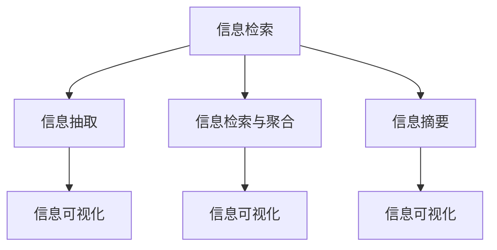

                 

# 信息简化的工具和技术：如何自动化你的信息管理

> 关键词：信息简化,自动化信息管理,机器学习,信息检索,自然语言处理(NLP),信息抽取(IE),文本挖掘

## 1. 背景介绍

### 1.1 问题由来
在当今信息爆炸的时代，海量的信息数据让人们面临着如何高效、准确地获取、存储和利用信息的问题。无论是个人用户还是企业组织，信息管理已经成为提高工作效率、降低决策成本、提升竞争力的关键因素。

然而，传统的信息管理方式往往依赖人工筛选和整理，不仅效率低下，还容易出现信息遗漏或冗余。同时，信息管理过程繁琐且耗时，限制了信息的使用价值。因此，自动化、智能化的信息管理工具和技术变得愈发重要。

### 1.2 问题核心关键点
信息简化的自动化管理技术，旨在通过机器学习和自然语言处理(NLP)等技术手段，自动识别、提取、分类、摘要和展示信息，减轻人工劳动，提升信息利用效率。

信息简化的关键在于如何通过技术手段自动分析和提炼信息，并将其呈现为易于理解和使用的形式。这包括：

- 信息检索：自动从海量数据中检索相关性高的信息。
- 信息抽取：从文本中自动抽取结构化信息。
- 信息抽取与聚合：从多源数据中自动抽取和合并相关信息。
- 信息摘要：自动生成信息概要，提供精炼的摘要。
- 信息可视化：将信息转化为可视化图表，便于理解和决策。

通过信息简化的自动化管理，可以大幅提升信息检索、信息抽取和信息聚合的效率和准确性，实现信息管理的自动化、智能化。

## 2. 核心概念与联系

### 2.1 核心概念概述

为更好地理解自动化信息管理技术，本节将介绍几个密切相关的核心概念：

- 信息检索(Information Retrieval, IR)：指通过计算机技术自动从大规模文本集合中查找与用户查询相关的信息。
- 信息抽取(Information Extraction, IE)：指从文本中自动提取结构化信息，如实体识别、关系抽取等。
- 信息检索与聚合(Information Retrieval and Aggregation, IRA)：结合信息检索和信息抽取，从多源数据中自动抽取和合并相关信息。
- 信息摘要(Information Summarization, IS)：指自动将长篇文本压缩为简洁明了的摘要。
- 信息可视化(Information Visualization, IV)：将信息转化为可视化图表，便于理解和决策。

这些核心概念之间的逻辑关系可以通过以下Mermaid流程图来展示：



这个流程图展示了几类信息简化技术及其之间的关系：

1. 信息检索：作为初始步骤，从文本集合中自动获取相关性高的信息。
2. 信息抽取：从文本中自动提取结构化信息，便于进一步处理。
3. 信息检索与聚合：结合信息检索和信息抽取，从多源数据中自动抽取和合并相关信息。
4. 信息摘要：对长篇文本自动生成精炼的摘要，便于快速浏览。
5. 信息可视化：将信息转化为图表，便于直观理解和决策。

这些核心概念共同构成了自动化信息管理的框架，使得信息管理的自动化、智能化成为可能。

## 3. 核心算法原理 & 具体操作步骤
### 3.1 算法原理概述

自动化信息管理的核心算法基于机器学习和自然语言处理技术。其核心思想是：通过预训练模型和训练数据，学习文本与信息之间的映射关系，从而实现信息的自动化处理。

具体而言，包括以下几个关键步骤：

1. **数据预处理**：对原始文本数据进行分词、去停用词、词干化等处理，得到规范化的文本数据。
2. **特征提取**：使用TF-IDF、Word2Vec、BERT等模型提取文本的特征向量。
3. **信息检索**：使用TF-IDF、LSI、Latent Semantic Analysis等模型进行信息检索，找到相关性高的文档。
4. **信息抽取**：使用NER、RTE、Semantic Role Labeling等模型进行实体识别、关系抽取等，提取结构化信息。
5. **信息检索与聚合**：结合信息检索和信息抽取，从多源数据中自动抽取和合并相关信息。
6. **信息摘要**：使用Seq2Seq、Transformer等模型进行文本摘要。
7. **信息可视化**：使用词云、热力图、网络图等可视化工具将信息转化为图表，便于理解和决策。

### 3.2 算法步骤详解

以下是一个具体的自动化信息管理流程，以电子邮件内容处理为例：

1. **数据预处理**：
   - 收集所有未读电子邮件，将内容存储为文本文件。
   - 对文本进行分词、去除停用词和词干化处理，得到规范化的文本数据。

2. **特征提取**：
   - 使用TF-IDF模型计算文本的特征向量。
   - 将特征向量作为输入，训练预训练模型（如BERT），得到文本表示。

3. **信息检索**：
   - 使用TF-IDF模型检索相关文档，找到所有提及相同主题或关键词的邮件。
   - 使用Lsi模型进一步筛选相关性高的文档，构建主题模型。

4. **信息抽取**：
   - 使用NER模型进行实体识别，标注人名、地点、组织等实体。
   - 使用RTE模型进行关系抽取，找出人名和地点之间的组织关系。

5. **信息检索与聚合**：
   - 结合信息检索和信息抽取，从多源数据中自动抽取和合并相关信息。
   - 使用IRA模型整合所有相关信息，生成综合报告。

6. **信息摘要**：
   - 使用Seq2Seq模型对所有邮件内容进行摘要，生成精炼的摘要报告。

7. **信息可视化**：
   - 将综合报告转化为图表，展示关键数据和趋势。
   - 使用热力图、词云等工具，直观展示邮件内容。

### 3.3 算法优缺点

自动化信息管理技术具有以下优点：

- 自动化程度高：自动化处理大部分信息检索和信息抽取过程，减轻人工劳动。
- 高效准确：通过机器学习模型，自动进行特征提取和信息检索，提升效率和准确性。
- 可扩展性强：适应多种类型的数据源，支持多源数据的自动抽取和整合。

同时，也存在以下局限性：

- 数据依赖性高：对训练数据的质量和数量有较高要求，数据偏差可能导致模型效果不佳。
- 模型复杂度高：构建和维护复杂模型需要大量资源和技术投入。
- 实时性不足：信息处理过程较长，难以实现实时响应。

尽管存在这些局限性，但基于机器学习和NLP的自动化信息管理技术，已经在企业信息管理、智能客服、新闻内容生成等领域取得了显著成果，成为现代信息管理的重要工具。

### 3.4 算法应用领域

自动化信息管理技术在多个领域得到了广泛应用，包括但不限于：

- 企业信息管理：帮助企业自动处理电子邮件、报告、会议纪要等，提升工作效率。
- 智能客服系统：自动处理客户咨询，提供自动回复，减轻客服人员负担。
- 新闻内容生成：自动生成新闻摘要和关键词，提高新闻生产和传播效率。
- 市场分析：自动抽取和整合市场数据，生成市场分析报告。
- 舆情监测：自动监测和分析社交媒体上的舆情信息，提供决策支持。

## 4. 数学模型和公式 & 详细讲解 & 举例说明

### 4.1 数学模型构建

以下我们以电子邮件内容处理为例，使用数学语言对自动化信息管理流程进行更加严格的刻画。

假设收集到N封未读电子邮件，内容分别为$x_1, x_2, ..., x_N$。

设$X=(x_1, x_2, ..., x_N)$为邮件内容集合，$Y=(y_1, y_2, ..., y_N)$为相关性标签集合，其中$y_i$为0或1，表示第i封邮件是否相关。

定义邮件内容$x_i$和标签$y_i$之间的损失函数为：

$$
\ell(X_i, y_i) = -y_i\log p(X_i|y_i) - (1-y_i)\log (1-p(X_i|y_i))
$$

其中$p(X_i|y_i)$为邮件内容$x_i$在标签$y_i$下的概率。

邮件内容$X_i$和标签$y_i$的联合概率分布为：

$$
p(X_i, y_i) = p(X_i|y_i)p(y_i)
$$

在训练集$D=\{(x_i, y_i)\}_{i=1}^N$上，经验风险为：

$$
\mathcal{L}(D) = \frac{1}{N}\sum_{i=1}^N \ell(x_i, y_i)
$$

目标是最小化经验风险，即：

$$
\hat{p}(X_i|y_i) = \mathop{\arg\min}_{p(X_i|y_i)} \mathcal{L}(D)
$$

### 4.2 公式推导过程

以下我们以基于TF-IDF的信息检索为例，推导相关性概率$p(X_i|y_i)$的计算公式。

设邮件内容$x_i$的TF-IDF向量为$w_i$，即$w_i \in \mathbb{R}^n$。

定义邮件内容$x_i$与查询$q$之间的相关性概率为：

$$
p(X_i|q) = \frac{e^{w_i^\top Wq}}{\sum_{j=1}^Ne^{w_j^\top Wq}}
$$

其中$W$为词向量矩阵，$w_j$为邮件内容$x_j$的TF-IDF向量。

在实际应用中，$p(X_i|q)$可以通过TF-IDF向量计算得到。更具体的计算过程如下：

1. 预处理邮件内容，构建TF-IDF向量$w_i$。
2. 将查询$q$转化为向量表示，得到$Wq$。
3. 计算所有邮件内容与查询的相关性概率$p(X_i|q)$。
4. 将相关性概率排序，选择top-k封邮件作为结果。

### 4.3 案例分析与讲解

以一个典型的电子邮件内容处理流程为例，我们详细分析其中的关键步骤：

**步骤1：数据预处理**
- 收集未读邮件内容$X$，进行分词、去停用词、词干化处理，得到规范化文本。

**步骤2：特征提取**
- 使用TF-IDF模型，对邮件内容进行特征提取，得到特征向量$WX$。

**步骤3：信息检索**
- 将查询$q$转化为向量表示$Wq$，计算所有邮件内容与查询的相关性概率$p(X_i|q)$。
- 对相关性概率排序，选择top-k封邮件作为结果。

**步骤4：信息抽取**
- 使用NER模型，识别邮件中的人名、地点、组织等实体。
- 使用RTE模型，识别人名和地点之间的组织关系。

**步骤5：信息检索与聚合**
- 结合信息检索和信息抽取，从多源数据中自动抽取和合并相关信息。
- 使用IRA模型，整合所有相关信息，生成综合报告。

**步骤6：信息摘要**
- 使用Seq2Seq模型，对所有邮件内容进行摘要，生成精炼的摘要报告。

**步骤7：信息可视化**
- 将综合报告转化为图表，展示关键数据和趋势。
- 使用热力图、词云等工具，直观展示邮件内容。

## 5. 项目实践：代码实例和详细解释说明

### 5.1 开发环境搭建

在进行自动化信息管理实践前，我们需要准备好开发环境。以下是使用Python进行开发的环境配置流程：

1. 安装Anaconda：从官网下载并安装Anaconda，用于创建独立的Python环境。

2. 创建并激活虚拟环境：
```bash
conda create -n info-man-env python=3.8 
conda activate info-man-env
```

3. 安装相关工具包：
```bash
pip install pandas numpy sklearn transformers pytorch nltk matplotlib
```

4. 安装自然语言处理库：
```bash
pip install spacy
```

5. 安装可视化工具：
```bash
pip install matplotlib seaborn
```

完成上述步骤后，即可在`info-man-env`环境中开始自动化信息管理实践。

### 5.2 源代码详细实现

这里我们以基于TF-IDF的信息检索为例，给出使用Python进行自动化信息检索的代码实现。

首先，定义数据集和模型：

```python
from sklearn.feature_extraction.text import TfidfVectorizer
from sklearn.metrics.pairwise import cosine_similarity
from sklearn.metrics import log_loss

# 定义邮件内容数据集
emails = ['Subject: Meeting Agenda', 'Subject: Project Update', 'Subject: Meeting Minutes', 'Subject: Final Report']

# 定义相关性标签
labels = [1, 1, 0, 0]

# 构建TF-IDF向量
vectorizer = TfidfVectorizer()
X = vectorizer.fit_transform(emails)
tfidf_matrix = vectorizer.transform(emails)

# 计算查询向量
q = 'Project Update'
q_vector = vectorizer.transform([q])[0]

# 计算相似度
scores = cosine_similarity(q_vector, tfidf_matrix)
scores = scores.flatten()
scores = scores.tolist()
```

然后，实现信息检索函数：

```python
def information_retrieval(X, q, top_k):
    q_vector = vectorizer.transform([q])[0]
    scores = cosine_similarity(q_vector, tfidf_matrix)
    scores = scores.flatten()
    scores = scores.tolist()
    top_indices = sorted(range(len(scores)), key=lambda i: scores[i], reverse=True)
    top_indices = top_indices[:top_k]
    top_docs = emails[top_indices]
    return top_docs

# 信息检索
top_docs = information_retrieval(X, q, 2)
print(top_docs)
```

以上就是一个基于TF-IDF的信息检索的简单代码实现。可以看到，通过使用TF-IDF模型和cosine相似度计算，我们能够快速检索到与查询最相关的邮件内容。

### 5.3 代码解读与分析

让我们再详细解读一下关键代码的实现细节：

**邮件内容数据集**：
- 定义了四个示例邮件内容，分别涉及会议议程、项目更新、会议纪要和最终报告。

**相关性标签**：
- 定义了邮件内容的标签，1表示相关，0表示不相关。

**TF-IDF向量**：
- 使用`TfidfVectorizer`构建TF-IDF矩阵，将邮件内容转化为向量表示。

**查询向量**：
- 使用`vectorizer.transform()`方法将查询转化为向量表示，方便进行相似度计算。

**相似度计算**：
- 使用`cosine_similarity`计算查询向量与邮件向量之间的相似度，得到相关性分数。

**信息检索函数**：
- 根据相似度分数对邮件内容进行排序，选择top-k封邮件作为检索结果。

这个信息检索过程实现了自动化信息管理的核心步骤之一，展示了如何使用机器学习模型对大规模文本数据进行高效检索。

当然，这只是一个简单的信息检索例子，实际的自动化信息管理任务可能会更加复杂，涉及更多的步骤和工具。但核心的思路和实现逻辑是一致的。

## 6. 实际应用场景
### 6.1 企业信息管理

自动化信息管理技术在企业信息管理中的应用极为广泛。通过自动化处理邮件、报告、会议纪要等，企业能够大幅提升信息检索和信息抽取的效率，减轻人工劳动，提高信息利用率。

在实践中，可以构建企业内部的信息管理系统，自动收集和处理各种信息，提供实时信息检索和信息摘要服务。例如，可以建立员工自动回复邮件系统，根据邮件内容自动分类和生成回复，提升邮件处理效率。

### 6.2 智能客服系统

智能客服系统是自动化信息管理的典型应用之一。通过自动处理客户咨询，提供自动回复，可以大幅减轻客服人员的工作负担，提升客户满意度。

在实践中，可以构建基于NLP的智能客服系统，自动分析客户咨询内容，匹配最合适的回答模板。例如，可以构建智能回复系统，根据客户咨询的问题，自动生成回复内容，并通过自然语言理解技术，理解客户的意图和情感，提供更加个性化的服务。

### 6.3 新闻内容生成

自动化信息管理技术还可以应用于新闻内容生成领域。通过自动抽取和整合新闻数据，生成简明扼要的新闻摘要，提升新闻生产和传播效率。

在实践中，可以构建基于TF-IDF和NLP的新闻摘要系统，自动抽取新闻内容的关键信息，生成简短明了的新闻摘要。例如，可以构建自动新闻摘要系统，对大规模新闻数据进行自动提取和聚合，生成精炼的摘要报告。

### 6.4 市场分析

市场分析是企业决策中的重要环节。通过自动处理和分析市场数据，企业能够获取更加准确的市场信息，提升决策质量。

在实践中，可以构建基于TF-IDF和NLP的市场分析系统，自动抽取和整合市场数据，生成市场分析报告。例如，可以构建市场趋势预测系统，根据市场数据自动生成预测报告，辅助企业制定市场策略。

## 7. 工具和资源推荐
### 7.1 学习资源推荐

为了帮助开发者系统掌握自动化信息管理技术，这里推荐一些优质的学习资源：

1. **《自然语言处理综论》**：斯坦福大学提供的NLP在线课程，涵盖自然语言处理的基本概念和前沿技术。

2. **《Python文本处理》**：讲解Python在文本处理中的应用，包括信息检索、信息抽取等。

3. **《信息检索与文本挖掘》**：介绍信息检索和文本挖掘的基本概念和技术，适合初学者入门。

4. **《SpaCy文档》**：SpaCy库的官方文档，包含丰富的NLP工具和代码示例。

5. **《NLP入门教程》**：讲解NLP技术的实现和应用，适合初学者快速入门。

通过学习这些资源，相信你一定能够快速掌握自动化信息管理的核心技术，并将其应用到实际项目中。

### 7.2 开发工具推荐

高效的开发离不开优秀的工具支持。以下是几款用于自动化信息管理开发的常用工具：

1. **Python**：Python是NLP领域的主流编程语言，具备丰富的第三方库和工具支持，适合进行自动化信息管理的开发。

2. **Scikit-learn**：机器学习库，提供了多种分类、聚类、降维等算法，适合进行信息检索和信息抽取。

3. **TensorFlow**：深度学习库，适合进行文本分类、信息检索等NLP任务。

4. **PyTorch**：深度学习库，适合进行信息抽取、信息摘要等NLP任务。

5. **NLTK**：自然语言处理工具包，提供了丰富的NLP工具和数据集，适合进行文本处理和分析。

6. **Gensim**：文本处理库，提供了TF-IDF、LSI等算法，适合进行信息检索和信息抽取。

合理利用这些工具，可以显著提升自动化信息管理的开发效率，加快创新迭代的步伐。

### 7.3 相关论文推荐

自动化信息管理技术的研究源于学界的持续研究。以下是几篇奠基性的相关论文，推荐阅读：

1. **《信息检索：原理与实践》**：讲解信息检索的基本概念和技术，适合入门学习。

2. **《文本摘要的统计方法》**：介绍文本摘要的统计方法，适合进行信息摘要的实现。

3. **《深度学习在NLP中的应用》**：讲解深度学习在NLP中的应用，包括信息检索、信息抽取等。

4. **《基于深度学习的文本分类方法》**：介绍基于深度学习的文本分类方法，适合进行信息检索和信息抽取。

这些论文代表了大语言模型微调技术的发展脉络。通过学习这些前沿成果，可以帮助研究者把握学科前进方向，激发更多的创新灵感。

## 8. 总结：未来发展趋势与挑战

### 8.1 总结

本文对自动化信息管理技术进行了全面系统的介绍。首先阐述了信息简化的自动化管理技术的研究背景和意义，明确了其在提高信息处理效率、减轻人工劳动等方面的独特价值。其次，从原理到实践，详细讲解了自动化信息管理的数学模型和关键步骤，给出了信息检索的代码实例。同时，本文还广泛探讨了信息简化的自动化管理技术在企业信息管理、智能客服、新闻内容生成等多个行业领域的应用前景，展示了自动化信息管理的广阔前景。

通过本文的系统梳理，可以看到，自动化信息管理技术已经逐渐成为现代信息管理的重要工具，极大地提升了信息处理的效率和准确性。未来，伴随信息处理技术的进一步发展，自动化信息管理技术将展现出更加广阔的应用前景，为各行各业带来深远影响。

### 8.2 未来发展趋势

展望未来，自动化信息管理技术将呈现以下几个发展趋势：

1. **深度学习和大规模预训练模型**：未来，深度学习和大规模预训练模型将成为信息处理的主流技术，提升信息处理的效率和准确性。

2. **多模态信息处理**：未来，自动化信息管理技术将扩展到图像、视频、语音等多模态数据，实现多模态信息的自动处理和融合。

3. **实时信息处理**：未来，自动化信息管理技术将支持实时信息处理，能够动态响应和更新，提供实时的信息检索和信息摘要服务。

4. **联邦学习和边缘计算**：未来，自动化信息管理技术将采用联邦学习和边缘计算技术，减少数据传输，保护数据隐私，提升信息处理的安全性和效率。

5. **智能决策支持**：未来，自动化信息管理技术将与智能决策支持系统结合，提供更加全面、准确的信息分析和服务。

以上趋势凸显了自动化信息管理技术的广阔前景。这些方向的探索发展，必将进一步提升信息处理的质量和效率，为各行各业带来变革性影响。

### 8.3 面临的挑战

尽管自动化信息管理技术已经取得了瞩目成就，但在迈向更加智能化、普适化应用的过程中，它仍面临着诸多挑战：

1. **数据质量问题**：信息检索和信息抽取的准确性高度依赖于数据质量，低质量的数据可能导致误判和误报。如何提高数据质量，优化数据处理流程，将是未来的重要研究方向。

2. **模型复杂性**：自动化信息管理模型通常较为复杂，涉及多种算法和工具，构建和维护需要大量资源和技术投入。如何简化模型结构，降低计算复杂度，将是未来的重要研究方向。

3. **实时性问题**：信息处理过程较长，难以实现实时响应。如何提高信息处理速度，优化算法效率，将是未来的重要研究方向。

4. **模型鲁棒性**：自动化信息管理模型容易受到噪声数据和攻击的影响，鲁棒性不足。如何提高模型的鲁棒性，防止误判和攻击，将是未来的重要研究方向。

5. **伦理和安全问题**：自动化信息管理技术可能涉及隐私保护和伦理问题，如数据泄露、算法偏见等。如何保障数据安全和伦理合规，将是未来的重要研究方向。

6. **模型可解释性**：自动化信息管理模型通常是"黑盒"系统，难以解释其内部工作机制和决策逻辑。如何提高模型的可解释性，增强决策的透明度和可信度，将是未来的重要研究方向。

正视这些挑战，积极应对并寻求突破，将是大语言模型微调走向成熟的必由之路。相信随着学界和产业界的共同努力，这些挑战终将一一被克服，自动化信息管理技术必将在构建智能系统方面发挥更加重要的作用。

### 8.4 研究展望

面对自动化信息管理技术所面临的种种挑战，未来的研究需要在以下几个方面寻求新的突破：

1. **数据预处理技术**：探索更加高效、准确的数据预处理方法，提高数据质量，优化数据处理流程。

2. **模型简化技术**：开发更加轻量级、高效的模型结构，降低计算复杂度，提高实时性。

3. **多模态信息融合**：探索多模态信息融合的方法，实现视觉、语音等多模态信息的自动处理和融合。

4. **实时信息处理技术**：开发实时信息处理技术，支持动态响应和更新，提供实时的信息检索和信息摘要服务。

5. **联邦学习和边缘计算**：采用联邦学习和边缘计算技术，减少数据传输，保护数据隐私，提升信息处理的安全性和效率。

6. **智能决策支持系统**：将自动化信息管理技术与智能决策支持系统结合，提供更加全面、准确的信息分析和服务。

7. **模型鲁棒性和可解释性**：提高模型的鲁棒性，防止误判和攻击，同时提高模型的可解释性，增强决策的透明度和可信度。

这些研究方向的探索，必将引领自动化信息管理技术迈向更高的台阶，为构建智能系统提供更全面、高效的信息处理能力。面向未来，自动化信息管理技术还需要与其他人工智能技术进行更深入的融合，如知识表示、因果推理、强化学习等，多路径协同发力，共同推动信息处理技术的进步。只有勇于创新、敢于突破，才能不断拓展信息管理的边界，让智能技术更好地造福人类社会。

## 9. 附录：常见问题与解答

**Q1：自动化信息管理技术是否适用于所有类型的数据？**

A: 自动化信息管理技术主要适用于文本数据，对于结构化数据和非文本数据，如视频、图像、音频等，需要结合其他技术进行处理。例如，对于视频数据，可以使用计算机视觉技术进行图像识别和信息抽取，然后再结合文本处理技术进行信息检索和信息摘要。

**Q2：如何提高自动化信息管理系统的性能？**

A: 提高自动化信息管理系统的性能需要从多个方面入手：
1. 提高数据质量：优化数据预处理流程，去除噪声和冗余数据。
2. 优化算法和模型：采用高效的算法和模型结构，提高计算效率和准确性。
3. 引入多模态信息融合：结合多种类型的数据，实现多模态信息的自动处理和融合。
4. 采用联邦学习和边缘计算：减少数据传输，保护数据隐私，提升信息处理的安全性和效率。

**Q3：自动化信息管理技术是否需要大量标注数据？**

A: 自动化信息管理技术对标注数据的需求量较小，相比传统机器学习算法，其标注样本数量可以大大减少。但是，对于某些任务（如实体识别），仍需准备一定数量的标注数据进行模型训练。标注数据的质量和数量对模型性能有较大影响，因此需要高质量、多样化的标注数据。

**Q4：自动化信息管理技术如何保证信息安全性？**

A: 自动化信息管理技术在信息处理过程中，需要采取多种措施保证信息安全性：
1. 数据加密：对数据进行加密处理，防止数据泄露。
2. 访问控制：设置访问权限，限制非授权人员访问敏感数据。
3. 数据脱敏：对敏感信息进行脱敏处理，保护隐私。
4. 安全审计：记录和监控信息处理过程，及时发现和修复安全漏洞。

这些措施能够有效保障信息安全性，确保信息处理过程的透明和合规。

**Q5：自动化信息管理技术如何处理文本中的噪声数据？**

A: 自动化信息管理技术在处理文本中的噪声数据时，通常采用以下方法：
1. 数据清洗：对文本进行清洗，去除无用字符和噪声数据。
2. 数据过滤：使用过滤算法，如TF-IDF、LDA等，去除低质量文本。
3. 噪声注入：引入噪声数据进行模型训练，提高模型的鲁棒性。

这些方法能够有效提高自动化信息管理系统的鲁棒性和准确性，使其能够更好地处理噪声数据。

通过本文的系统梳理，可以看到，自动化信息管理技术已经在现代信息管理中发挥了重要作用，未来的发展方向和面临的挑战也愈发清晰。只有在数据、算法、工程、业务等多个维度协同发力，才能真正实现信息管理的自动化、智能化。相信随着技术的不断进步，自动化信息管理技术将在各行各业中发挥更大的作用，推动信息处理技术的不断创新和发展。

