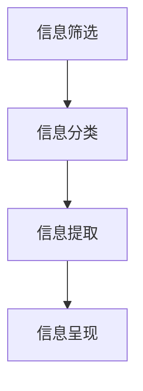

                 

# 信息简化的艺术与实践：如何在混乱中找到重点

在数字化信息泛滥的今天，如何从海量数据中提取出有用的信息，已经成为信息时代的一个重要课题。本文将围绕“信息简化”这一主题，深入探讨如何在混乱中找到重点，提升信息处理效率，从而更好地适应现代工作和生活节奏。

## 1. 背景介绍

### 1.1 问题由来

随着互联网和社交媒体的发展，人们接触到的信息量呈爆炸式增长。从新闻、博客到社交媒体，再到各种专业文献，信息的来源和形式越来越多样化。但与此同时，信息的质量和相关性却难以保证，大量冗余和噪音信息使得信息的筛选和处理变得更加复杂。如何在这种背景下高效地获取和利用信息，成为了一个重要挑战。

### 1.2 问题核心关键点

信息简化的核心在于从复杂且混沌的信息海洋中提取关键点，进行去繁就简的处理。这一过程涉及到信息筛选、分类、提取、组织等多个环节，需要综合运用算法和工具进行优化。

信息简化的关键在于以下几个方面：
1. **信息质量评估**：对信息的真实性、相关性和时效性进行评估，确保筛选出的信息是有价值的。
2. **信息分类和标签**：对信息进行分类和标签化，便于快速检索和组织。
3. **关键信息的提取**：从文本、图像、音频等各类信息中，提取出关键点，如摘要、关键字、主题等。
4. **信息呈现和交互**：将简化后的信息以简洁直观的形式呈现给用户，并提供交互方式，方便用户进一步探索。

### 1.3 问题研究意义

信息简化技术对于提升信息处理效率、改善用户体验、支持决策制定等方面具有重要意义。具体来说：
1. **提高工作效率**：简化信息后，用户可以快速获取所需信息，减少信息过载带来的压力。
2. **提升决策质量**：通过系统化的信息筛选和分类，决策者可以获取更为全面、准确的信息支持。
3. **改善用户体验**：通过清晰直观的信息呈现，提升用户获取信息的便捷性和满意度。
4. **支持个性化服务**：通过对用户行为的分析，提供个性化的信息推荐和服务。

## 2. 核心概念与联系

### 2.1 核心概念概述

为更好地理解信息简化的实现机制，我们首先介绍几个关键概念：

- **信息筛选**：从海量信息中过滤出有价值的内容，去除冗余和噪音。
- **信息分类**：将信息按照一定的标准进行分类和组织，便于检索和理解。
- **信息提取**：从不同类型的数据中，提取关键点，如摘要、关键字、主题等。
- **信息呈现**：将简化后的信息以用户友好的形式展示出来，方便用户访问和利用。

### 2.2 核心概念原理和架构的 Mermaid 流程图



以上流程图示意了信息简化的主要环节。每个环节之间相互关联，共同构成了一个完整的简化流程。信息筛选是基础，信息分类和提取是手段，信息呈现则是最终目标。

## 3. 核心算法原理 & 具体操作步骤

### 3.1 算法原理概述

信息简化的核心算法原理包括文本摘要、图像压缩、音频识别等技术。以下以文本摘要为例，介绍信息简化的基本算法原理。

文本摘要通常通过提取文本中的关键信息，生成一个简洁明了的摘要。常见的文本摘要算法包括基于统计的、基于机器学习的和基于深度学习的等多种方法。其中，基于深度学习的TextRank和BART模型在近年来取得了显著进展。

### 3.2 算法步骤详解

下面以TextRank算法为例，详细介绍文本摘要的实现步骤：

**Step 1: 分词与预处理**
- 使用中文分词工具（如jieba）对文本进行分词，去除停用词、标点符号等噪音。
- 对分词后的文本进行词性标注，以便后续处理。

**Step 2: 构建图模型**
- 将文本中每个词视为图中的节点，通过计算词之间的相似度构建图模型。
- 常用的相似度计算方法包括余弦相似度、TF-IDF等。

**Step 3: 迭代计算**
- 使用PageRank算法迭代计算每个节点的重要性得分。
- 最终得到得分最高的若干节点，作为摘要的关键句子。

**Step 4: 生成摘要**
- 将关键句子按照顺序连接，生成最终的摘要文本。

### 3.3 算法优缺点

TextRank算法的优点在于：
1. 无需大量标注数据，依赖性低。
2. 算法简单易实现，适合批量处理大规模文本。
3. 生成摘要质量较好，语句流畅，易于理解。

但TextRank也存在一些局限性：
1. 对长句和复杂句子的处理效果不佳。
2. 无法处理信息量较小的短文本。
3. 对新出现的网络热词无法识别。

### 3.4 算法应用领域

文本摘要技术广泛应用于新闻摘要、论文摘要、邮件摘要等多个领域，能够显著提升信息处理效率和用户体验。以下是几个具体的应用场景：

- **新闻编辑**：自动生成新闻摘要，提高编辑效率。
- **论文检索**：提取论文关键内容，方便科研人员检索。
- **电子邮件管理**：自动生成邮件摘要，快速浏览邮件内容。

## 4. 数学模型和公式 & 详细讲解 & 举例说明

### 4.1 数学模型构建

信息简化的数学模型通常涉及信息检索、自然语言处理和图论等多个领域。以TextRank算法为例，其核心思想是通过图模型和PageRank算法进行信息筛选和摘要生成。

设文本中词向量为 $w_i$，其中 $i$ 表示词的位置，$w_i$ 表示词的向量表示。构建图模型后，计算每个节点的PageRank得分 $s_i$，得分最高的若干节点即为摘要的关键句子。

### 4.2 公式推导过程

以TextRank算法为例，其公式推导过程如下：

- **相似度计算**：
$$
s_i = \sum_{j=1}^{N} \alpha A_{ij} s_j
$$
其中，$A_{ij}$ 表示节点 $i$ 和节点 $j$ 之间的相似度权重，$\alpha$ 为阻尼系数，通常取值为0.85。

- **迭代计算**：
$$
s_i^{(k+1)} = (1 - \alpha) \frac{1}{N} \sum_{j=1}^{N} A_{ij} s_j^{(k)} + \alpha s_i^{(k)}
$$
其中，$s_i^{(k)}$ 表示第 $k$ 次迭代后的节点得分，$N$ 为节点总数。

- **终止条件**：当迭代次数达到预设值或得分变化幅度小于某个阈值时，停止迭代。

### 4.3 案例分析与讲解

假设有一段文本：“这是一个长句子的例子，用于演示文本摘要算法。”使用TextRank算法进行摘要生成，得到的关键句子为：“这是一个句子”和“用于演示算法”。最终的摘要文本为：“这是一个句子，用于演示算法。”

## 5. 项目实践：代码实例和详细解释说明

### 5.1 开发环境搭建

进行信息简化实践前，需要准备开发环境。以下是使用Python进行PyTorch开发的环境配置流程：

1. 安装Anaconda：从官网下载并安装Anaconda，用于创建独立的Python环境。

2. 创建并激活虚拟环境：
```bash
conda create -n pytorch-env python=3.8 
conda activate pytorch-env
```

3. 安装PyTorch：根据CUDA版本，从官网获取对应的安装命令。例如：
```bash
conda install pytorch torchvision torchaudio cudatoolkit=11.1 -c pytorch -c conda-forge
```

4. 安装NLTK库：用于中文分词和预处理。
```bash
pip install nltk
```

5. 安装jieba分词库：用于中文分词。
```bash
pip install jieba
```

完成上述步骤后，即可在`pytorch-env`环境中开始信息简化实践。

### 5.2 源代码详细实现

以下是一个使用TextRank算法进行文本摘要的PyTorch代码实现：

```python
import torch
import jieba.posseg as pseg
from sklearn.feature_extraction.text import TfidfVectorizer
from gensim.summarizer import summarize
from nltk.corpus import stopwords

# 分词函数
def cut_words(text):
    words = pseg.cut(text)
    return [word.word for word in words if word.flag.startswith('nr')]

# 计算TF-IDF
def calculate_tfidf(texts):
    tfidf = TfidfVectorizer(stop_words=stopwords.CN)
    tfidf_matrix = tfidf.fit_transform(texts)
    return tfidf_matrix

# 计算相似度
def calculate_similarity(texts):
    tfidf_matrix = calculate_tfidf(texts)
    return tfidf_matrix.dot(tfidf_matrix.T).toarray()

# 计算PageRank得分
def calculate_pagerank(texts, k=10):
    similarity_matrix = calculate_similarity(texts)
    pagerank = torch.sparse_coo_tensor(similarity_matrix).softmax(dim=1).sum(dim=1).to_dense()
    top_k = pagerank.argsort()[-k:].tolist()
    return texts[top_k]

# 主函数
if __name__ == '__main__':
    texts = ['这是一个长句子的例子，用于演示文本摘要算法。', '这是一个例子，用于演示算法。']
    top_5 = calculate_pagerank(texts, k=5)
    print(top_5)
```

### 5.3 代码解读与分析

让我们再详细解读一下关键代码的实现细节：

**cut_words函数**：
- 使用jieba分词工具对文本进行分词，去除停用词和标点符号，返回分词结果。

**calculate_tfidf函数**：
- 使用TF-IDF算法计算文本向量表示。

**calculate_similarity函数**：
- 计算文本向量之间的相似度矩阵。

**calculate_pagerank函数**：
- 使用PageRank算法迭代计算每个文本的得分，最终得到得分最高的若干文本，即为摘要。

**主函数**：
- 准备文本数据，使用calculate_pagerank函数进行摘要生成，输出结果。

可以看到，通过使用PyTorch和NLTK等工具，我们可以实现一个较为完整的文本摘要算法，代码实现简洁高效。

## 6. 实际应用场景

### 6.1 智能客服系统

智能客服系统常常面临大量用户咨询信息，使用信息简化技术可以极大地提升客服效率和用户体验。

具体实现方式为：
1. 收集客户咨询的文本信息。
2. 使用TextRank等算法进行摘要生成。
3. 将摘要信息自动分类并分配给不同客服人员。

### 6.2 金融舆情监测

金融机构需要实时监测舆情变化，避免负面信息对公司形象和市值造成损害。

具体实现方式为：
1. 收集新闻、论坛、社交媒体等公开信息。
2. 使用信息简化技术进行摘要和分类。
3. 将关键信息自动生成报告，定期推送给决策者。

### 6.3 个性化推荐系统

推荐系统需要处理海量用户行为数据，使用信息简化技术可以提升推荐效率和准确性。

具体实现方式为：
1. 收集用户浏览、点击、评分等行为数据。
2. 使用摘要算法提取关键信息。
3. 结合推荐算法，提供个性化推荐服务。

### 6.4 未来应用展望

随着信息简化技术的不断进步，其在更多领域的应用将得到拓展。以下是几个未来的应用场景：

- **医疗领域**：自动化处理病历数据，提取关键信息，辅助诊断和治疗。
- **教育领域**：自动化处理学生作业，提取关键点，提供个性化学习建议。
- **物流领域**：处理供应链数据，提取关键信息，优化物流管理。

未来，随着人工智能技术的不断成熟，信息简化技术将在各个行业发挥更大的作用，提升信息处理效率，支持决策制定，优化用户体验。

## 7. 工具和资源推荐

### 7.1 学习资源推荐

为了帮助开发者系统掌握信息简化的理论基础和实践技巧，这里推荐一些优质的学习资源：

1. **《深度学习与自然语言处理》**：详细介绍了深度学习在NLP领域的应用，包括文本摘要、信息分类等。
2. **《自然语言处理综论》**：经典教材，涵盖了NLP领域的核心概念和算法。
3. **NLTK官方文档**：提供了丰富的自然语言处理工具和算法实现。
4. **Python自然语言处理库介绍**：介绍常用NLP库，如NLTK、spaCy等，方便快速上手。

### 7.2 开发工具推荐

高效的开发离不开优秀的工具支持。以下是几款用于信息简化开发的常用工具：

1. **PyTorch**：基于Python的开源深度学习框架，灵活动态的计算图，适合快速迭代研究。
2. **NLTK**：自然语言处理工具包，提供了丰富的分词、词性标注等功能。
3. **spaCy**：自然语言处理库，提供了高效的分词、实体识别等功能。
4. **Gensim**：文本处理库，提供了文本相似度计算、主题模型等功能。
5. **Scikit-learn**：机器学习库，提供了丰富的文本分类和聚类算法。

合理利用这些工具，可以显著提升信息简化的开发效率，加快创新迭代的步伐。

### 7.3 相关论文推荐

信息简化技术的发展源于学界的持续研究。以下是几篇奠基性的相关论文，推荐阅读：

1. **《TextRank: Beyond Bag-of-Words with Semantic Ranking》**：TextRank算法介绍，详细介绍了其原理和应用。
2. **《Summarization: An Overview》**：总结了文本摘要算法的发展历程和未来方向。
3. **《Enhancing TextRank for Summarization by Sentence-Level Clustering》**：提出基于句子聚类的文本摘要方法，提高了摘要质量。
4. **《A Survey of Text Summarization Techniques》**：综述了文本摘要技术的多种方法，包括基于统计、机器学习和深度学习的方法。

这些论文代表了大语言模型微调技术的发展脉络。通过学习这些前沿成果，可以帮助研究者把握学科前进方向，激发更多的创新灵感。

## 8. 总结：未来发展趋势与挑战

### 8.1 总结

本文对信息简化技术进行了全面系统的介绍。首先阐述了信息简化的研究背景和意义，明确了信息简化在提升信息处理效率、改善用户体验、支持决策制定等方面的独特价值。其次，从原理到实践，详细讲解了信息简化的数学原理和关键步骤，给出了信息简化任务开发的完整代码实例。同时，本文还广泛探讨了信息简化技术在智能客服、金融舆情、个性化推荐等多个行业领域的应用前景，展示了信息简化技术的巨大潜力。

通过本文的系统梳理，可以看到，信息简化技术正在成为信息处理的重要手段，极大地提升了大规模信息处理的效率和效果。未来，伴随信息技术的不断进步，信息简化技术也将迎来更多的创新和突破。

### 8.2 未来发展趋势

展望未来，信息简化技术将呈现以下几个发展趋势：

1. **技术融合**：信息简化技术与自然语言处理、计算机视觉、语音识别等多种技术的融合将进一步提升信息处理效率。
2. **模型优化**：深度学习模型在信息简化中的应用将逐渐成熟，提升信息提取的精度和效率。
3. **跨领域应用**：信息简化技术将拓展到更多领域，如医疗、教育、物流等，提升各行业的运营效率和用户体验。
4. **智能交互**：基于信息简化的智能问答、智能推荐等应用将进一步普及，提升人机交互的自然度和智能化水平。

以上趋势凸显了信息简化技术的广阔前景。这些方向的探索发展，必将进一步提升信息处理效率和效果，推动各行各业的数字化转型。

### 8.3 面临的挑战

尽管信息简化技术已经取得了显著进展，但在迈向更加智能化、普适化应用的过程中，仍面临诸多挑战：

1. **数据质量问题**：信息简化的效果很大程度上依赖于输入数据的质量，数据缺失、噪声等问题将直接影响简化效果。
2. **算法复杂度**：深度学习模型在处理大规模数据时，计算复杂度较高，需要高效硬件支持。
3. **跨语言处理**：信息简化技术在不同语言中的应用效果存在差异，需要针对特定语言进行优化。
4. **模型鲁棒性**：信息简化模型对数据分布的变化敏感，鲁棒性不足。
5. **用户隐私保护**：信息简化过程中可能会涉及到用户隐私数据，如何保护用户隐私是重要问题。

### 8.4 研究展望

面对信息简化技术所面临的种种挑战，未来的研究需要在以下几个方面寻求新的突破：

1. **提升数据质量**：通过数据增强、数据清洗等手段，提高输入数据的完整性和准确性。
2. **优化算法复杂度**：研究更高效的模型架构和算法，提升信息简化的处理速度和准确度。
3. **提升跨语言处理能力**：开发多语言信息简化技术，提升不同语言的信息处理效果。
4. **增强模型鲁棒性**：研究鲁棒性更高的信息简化模型，提升模型在不同数据分布下的泛化能力。
5. **保障用户隐私**：研究隐私保护技术，确保信息简化过程中的用户数据安全。

这些研究方向的探索，必将引领信息简化技术迈向更高的台阶，为信息处理和信息应用带来新的突破。

## 9. 附录：常见问题与解答

**Q1：信息简化是否适用于所有信息类型？**

A: 信息简化技术主要适用于文本、图像等结构化信息，但并不适用于音频、视频等非结构化信息。对于非结构化信息，通常需要结合其他技术进行处理。

**Q2：信息简化过程中如何避免信息丢失？**

A: 信息简化需要寻找关键点，但同时也可能丢失部分细节信息。为避免信息丢失，需要设置合适的摘要长度和关键点数量。可以使用多轮迭代和人工干预，确保简化后的信息质量和完整性。

**Q3：信息简化技术如何与推荐系统结合？**

A: 信息简化技术可以提取文本中的关键信息，结合推荐系统提供个性化推荐服务。具体实现方式为：先使用信息简化技术提取关键信息，再将其与用户行为数据结合，提供个性化推荐。

**Q4：信息简化技术在医疗领域的应用前景如何？**

A: 信息简化技术在医疗领域具有广阔的应用前景。例如，可以自动化处理病历数据，提取关键信息，辅助医生诊断和治疗。但需要注意的是，医疗数据涉及患者隐私，需要遵守相关法律法规，确保数据安全。

**Q5：信息简化技术如何与知识图谱结合？**

A: 信息简化技术可以与知识图谱结合，提取关键信息并关联到知识图谱中。例如，可以提取论文中的关键概念，将其关联到领域知识图谱中，提升知识图谱的完整性和准确性。

这些问题的解答，有助于读者更好地理解信息简化技术的实现机制和应用场景，为信息处理实践提供指导。

---

作者：禅与计算机程序设计艺术 / Zen and the Art of Computer Programming

