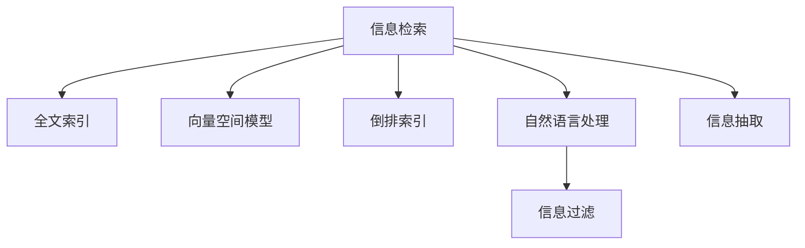

                 

# 信息过载与信息搜索策略：在庞大的信息海洋中找到有价值的信息

## 1. 背景介绍

### 1.1 问题由来
在信息时代，我们每天面临着海量的信息。从社交媒体上的动态到新闻网站上的文章，从电子邮件到广告推送，信息无处不在。尽管信息技术的迅猛发展极大地改变了我们的生活和工作方式，但也带来了信息过载的问题。信息过载（Information Overload）指的是人们在信息爆炸的时代，由于信息量过于庞大，超出了人们处理、吸收和利用的能力，导致信息丢失、决策困难和注意力分散的现象。信息过载不仅影响个人学习和工作效率，还对企业和政府组织的管理决策造成负面影响。

### 1.2 问题核心关键点
信息过载的核心问题是如何在庞大的信息海洋中找到有价值的信息。目前，信息检索技术是解决这一问题的主要手段之一。有效的信息检索不仅能够提高信息获取的效率，还能够降低误导信息的干扰，确保信息的质量和可靠性。本文将围绕信息检索技术展开，探讨其在信息过载时代的应用和优化。

### 1.3 问题研究意义
研究如何高效地从海量的信息中提取有价值的信息，对于提高信息处理的效率、减少决策偏差、增强知识发现和创新能力具有重要意义。通过有效的信息搜索策略，可以帮助用户快速定位所需信息，降低信息过载对生产力和生活的负面影响。此外，信息检索技术的发展还将促进信息时代下知识的传播和利用，推动创新经济的发展。

## 2. 核心概念与联系

### 2.1 核心概念概述

为更好地理解信息搜索技术，本节将介绍几个密切相关的核心概念：

- **信息检索（Information Retrieval, IR）**：指根据用户的信息需求，从信息集合中查找相关信息的自动化过程。信息检索是信息管理的基础技术，广泛应用于图书馆、搜索引擎、企业信息管理系统等领域。
- **全文索引（Full-Text Indexing）**：一种将文本内容进行分词、标引，并建立倒排索引的技术，以便快速定位包含特定关键词的文档。
- **向量空间模型（Vector Space Model, VSM）**：将文本表示为高维空间中的向量，通过计算向量之间的距离或夹角，衡量文档间的相似度。
- **倒排索引（Inverted Index）**：一种快速查找包含特定关键词的文档的数据结构，通过将关键词与文档ID进行映射，实现高效的文档检索。
- **自然语言处理（Natural Language Processing, NLP）**：处理、分析和生成人类语言的技术，包括词性标注、命名实体识别、情感分析等。
- **信息过滤（Information Filtering）**：根据用户的兴趣和行为，对检索结果进行筛选和排序，提高相关性和用户体验。
- **信息抽取（Information Extraction, IE）**：从非结构化文本中提取结构化信息，如实体、关系、事件等。

这些核心概念之间的逻辑关系可以通过以下Mermaid流程图来展示：



这个流程图展示了一组核心概念及其之间的关系：

1. 信息检索是整个信息管理的基础。
2. 全文索引、向量空间模型和倒排索引是信息检索的核心技术。
3. 自然语言处理技术支持更精确的文本处理和语义理解。
4. 信息过滤技术可以根据用户需求对检索结果进行定制。
5. 信息抽取技术从文本中提取结构化信息，为数据挖掘和知识发现提供支持。

这些概念共同构成了信息检索技术的框架，帮助用户在庞大的信息海洋中找到有价值的信息。

## 3. 核心算法原理 & 具体操作步骤
### 3.1 算法原理概述

信息检索的核心是如何在海量的文档集合中，根据用户的查询需求找到最相关的文档。传统的基于关键词的检索方法无法处理复杂的语义关系和实体识别，因此现代信息检索技术主要采用以下几种算法：

1. **向量空间模型（VSM）**：将文本表示为高维空间中的向量，通过计算向量之间的距离或夹角，衡量文档间的相似度。
2. **倒排索引（Inverted Index）**：一种快速查找包含特定关键词的文档的数据结构，通过将关键词与文档ID进行映射，实现高效的文档检索。
3. **语言模型（Language Model）**：通过统计语言规律，评估文本中的词语或句子出现的概率，从而衡量文档的相关性。
4. **深度学习模型**：如Transformer、BERT等，能够捕捉复杂的语义关系，提升检索准确性和召回率。

这些算法在信息检索中各有优劣，通常需要组合使用，以实现更高效的信息检索。

### 3.2 算法步骤详解

信息检索的详细步骤包括：

1. **预处理**：包括分词、去除停用词、词干提取等文本预处理步骤，以提高文本的表示精度。
2. **特征提取**：将文本转换为高维向量或词频-逆文档频率（TF-IDF）矩阵等特征表示，以便后续处理。
3. **相似度计算**：通过计算查询向量与文档向量之间的相似度，筛选出最相关的文档。
4. **排序和过滤**：根据相似度排序，结合信息过滤技术，提高检索结果的相关性和用户体验。
5. **检索结果展示**：将最相关的文档展示给用户，并提供搜索建议、相关文档等辅助信息。

### 3.3 算法优缺点

信息检索算法具有以下优点：

1. **高效性**：采用倒排索引和向量空间模型等技术，可以实现快速检索，提高信息获取效率。
2. **可扩展性**：能够处理大规模文档集，适用于企业和政府等机构的信息管理。
3. **准确性**：深度学习模型能够捕捉复杂的语义关系，提高检索准确性和召回率。

同时，信息检索算法也存在一定的局限性：

1. **语义理解不足**：传统的关键词匹配方法难以理解文本的语义关系和语境信息，导致误检率高。
2. **数据依赖性强**：依赖高质量的语料库和标注数据，对标注和处理成本较高。
3. **用户满意度低**：搜索结果与用户期望的匹配度不高，需要进一步改进信息过滤技术。
4. **计算复杂度高**：深度学习模型通常需要较长的训练时间和较大的计算资源，增加信息检索的成本。

尽管存在这些局限性，但信息检索算法在信息时代的应用仍然非常广泛，是解决信息过载问题的有效手段。

### 3.4 算法应用领域

信息检索技术在以下领域得到了广泛应用：

- **搜索引擎**：如Google、Bing等，为用户提供高效的信息检索服务。
- **图书馆**：采用图书馆信息检索系统，管理纸质和电子书籍，提供快速借阅和检索服务。
- **企业信息管理系统**：如企业门户、文档管理系统等，提高文档管理效率和信息共享水平。
- **政府信息公开**：通过政府信息检索系统，公开政策文件、法规等，便于公众查询和监督。
- **在线教育平台**：如Coursera、edX等，帮助学生查找学习资源和课程信息。

除了这些领域外，信息检索技术还在社交媒体、金融、医疗等众多领域得到应用，为信息管理提供了强有力的支撑。

## 4. 数学模型和公式 & 详细讲解 & 举例说明
### 4.1 数学模型构建

信息检索的数学模型主要基于向量空间模型（VSM），将文本表示为高维向量，并通过计算向量之间的相似度来衡量文档的相关性。

设文档集合 $D=\{d_1, d_2, ..., d_M\}$，查询向量 $q$，文档向量 $t_i$ 的表示为 $t_i=[t_{i1}, t_{i2}, ..., t_{im}]$，其中 $t_{ik}$ 表示文档 $d_i$ 中第 $k$ 个词语的出现频率或权重。查询向量 $q$ 和文档向量 $t_i$ 的相似度 $s_i$ 计算公式为：

$$
s_i = \frac{q \cdot t_i}{\|q\| \cdot \|t_i\|}
$$

其中 $\cdot$ 表示向量点乘，$\| \cdot \|$ 表示向量的欧几里得范数。

### 4.2 公式推导过程

将查询向量 $q$ 和文档向量 $t_i$ 代入上述公式，进行点乘运算：

$$
q \cdot t_i = \sum_{k=1}^m q_k \cdot t_{ik}
$$

根据欧几里得范数的定义，计算查询向量和文档向量的范数：

$$
\|q\| = \sqrt{\sum_{k=1}^m q_k^2}, \|t_i\| = \sqrt{\sum_{k=1}^m t_{ik}^2}
$$

将上述公式代入相似度计算公式，得到：

$$
s_i = \frac{\sum_{k=1}^m q_k \cdot t_{ik}}{\sqrt{\sum_{k=1}^m q_k^2} \cdot \sqrt{\sum_{k=1}^m t_{ik}^2}}
$$

### 4.3 案例分析与讲解

假设查询向量 $q=[0.5, 0.3, 0.1, 0.7]$，文档向量 $t_1=[0.3, 0.4, 0.2, 0.1]$，$t_2=[0.1, 0.2, 0.7, 0.4]$。计算查询向量与文档向量 $t_1$ 和 $t_2$ 的相似度：

$$
s_1 = \frac{0.5 \cdot 0.3 + 0.3 \cdot 0.4 + 0.1 \cdot 0.2 + 0.7 \cdot 0.1}{\sqrt{0.5^2 + 0.3^2 + 0.1^2 + 0.7^2} \cdot \sqrt{0.3^2 + 0.4^2 + 0.2^2 + 0.1^2}}
$$

$$
s_2 = \frac{0.5 \cdot 0.1 + 0.3 \cdot 0.2 + 0.1 \cdot 0.7 + 0.7 \cdot 0.4}{\sqrt{0.5^2 + 0.3^2 + 0.1^2 + 0.7^2} \cdot \sqrt{0.1^2 + 0.2^2 + 0.7^2 + 0.4^2}}
$$

计算结果为：

$$
s_1 = 0.475, s_2 = 0.237
$$

由此可以看出，查询向量 $q$ 与文档向量 $t_1$ 的相似度高于与 $t_2$ 的相似度，因此，文档 $d_1$ 更相关。

## 5. 项目实践：代码实例和详细解释说明
### 5.1 开发环境搭建

在进行信息检索实践前，我们需要准备好开发环境。以下是使用Python进行Elasticsearch开发的开发环境配置流程：

1. 安装Anaconda：从官网下载并安装Anaconda，用于创建独立的Python环境。

2. 创建并激活虚拟环境：
```bash
conda create -n elasticsearch-env python=3.8 
conda activate elasticsearch-env
```

3. 安装Elasticsearch-Py：从官网获取并安装Elasticsearch-Py，用于Python语言与Elasticsearch的交互。

4. 安装Flask：用于构建Web应用，方便对Elasticsearch进行API调用。

```bash
pip install flask
```

5. 安装Elasticsearch：从官网获取并安装Elasticsearch，用于存储和检索文档。

完成上述步骤后，即可在`elasticsearch-env`环境中开始信息检索实践。

### 5.2 源代码详细实现

下面以搜索引擎为例，给出使用Elasticsearch-Py对文档进行检索的Python代码实现。

首先，定义Elasticsearch客户端和索引：

```python
from elasticsearch import Elasticsearch

es = Elasticsearch(['localhost:9200'])
es.indices.create(index='my_index', ignore=[400, 404])
```

然后，定义文档索引和查询：

```python
from elasticsearch_dsl import Document, Index

class MyDocument(Document):
    title = Text(analyzer='standard')
    content = Text(analyzer='standard')
    keywords = Keyword(analyzer='standard')

    class Meta:
        index = 'my_index'
        properties = {'content': {'type': 'text'}}

document = MyDocument()
document.title = 'Title of the Document'
document.content = 'This is the content of the document.'
document.keywords = 'keywords, document, indexing, search'
document.save()
```

接着，定义查询函数：

```python
from elasticsearch import helpers

def search(query):
    search_result = helpers.search(
        client=es,
        query={"query": {"match": {"content": query}}},
        index='my_index',
        size=10
    )
    return search_result
```

最后，启动搜索并输出结果：

```python
results = search('Elasticsearch')
for hit in results['hits']['hits']:
    print(hit['_source'])
```

以上就是使用Python对Elasticsearch进行文档检索的完整代码实现。可以看到，Elasticsearch-Py提供了方便的API接口，使得文档存储和检索变得简单易行。

### 5.3 代码解读与分析

让我们再详细解读一下关键代码的实现细节：

**Elasticsearch客户端定义**：
- `Elasticsearch(['localhost:9200'])`：定义Elasticsearch客户端，连接到本地的9200端口。

**索引创建**：
- `es.indices.create(index='my_index', ignore=[400, 404])`：创建名为`my_index`的索引，如果索引已存在，忽略400和404错误。

**文档定义**：
- `class MyDocument(Document):`：定义Elasticsearch中的文档类型`MyDocument`，继承自`Document`类。
- `title = Text(analyzer='standard')`：定义`title`字段，使用`standard`分词器。
- `content = Text(analyzer='standard')`：定义`content`字段，使用`standard`分词器。
- `keywords = Keyword(analyzer='standard')`：定义`keywords`字段，使用`keyword`分词器。
- `class Meta:`：定义元数据，指定索引名称和文档属性。

**文档保存**：
- `document.title = 'Title of the Document'`：设置文档的`title`字段。
- `document.content = 'This is the content of the document.'`：设置文档的`content`字段。
- `document.keywords = 'keywords, document, indexing, search'`：设置文档的`keywords`字段。
- `document.save()`：保存文档到Elasticsearch索引中。

**查询定义**：
- `search_result = helpers.search(...)`：调用Elasticsearch-Py的`search`方法，进行查询。
- `{"query": {"match": {"content": query}}}`：定义查询条件，匹配`content`字段中包含查询字符串的文档。
- `index='my_index'`：指定查询的索引名称。
- `size=10`：指定返回文档的数量。

**结果输出**：
- `for hit in results['hits']['hits']:`：遍历查询结果，输出文档内容。
- `print(hit['_source'])`：输出文档的源数据，即`title`和`content`字段的值。

可以看到，通过Elasticsearch-Py的简单调用，我们能够轻松实现文档的存储和检索。这大大简化了信息检索系统的开发过程。

## 6. 实际应用场景
### 6.1 智能推荐系统

智能推荐系统是信息检索技术的重要应用之一。通过分析用户的浏览、购买历史和兴趣标签，推荐系统能够为用户推荐最相关的内容，提升用户体验。

在技术实现上，可以采用基于内容推荐和协同过滤等多种推荐算法，结合用户画像和行为数据，构建高效的推荐引擎。Elasticsearch等搜索引擎技术可以提供快速的数据存储和检索服务，帮助推荐系统快速响应用户请求，并实时更新推荐结果。

### 6.2 搜索引擎优化（SEO）

搜索引擎优化（SEO）是提高网站在搜索引擎中排名的重要手段。通过优化网站内容、结构和链接，提升搜索引擎对网站的理解和索引，从而提高网站的可见性和点击率。

在SEO实践中，可以使用Elasticsearch等搜索引擎技术，分析网站的访问量、关键词和用户行为，进行针对性的优化。例如，通过关键词分析，优化网站标题和内容，提高搜索引擎的爬取效率和收录质量。通过用户行为分析，优化网站布局和推荐算法，提升用户体验和转化率。

### 6.3 知识图谱构建

知识图谱是构建语义网络的重要工具，能够帮助机器理解和处理复杂的语义关系。通过Elasticsearch等搜索引擎技术，可以高效地从大规模语料库中抽取实体和关系，构建知识图谱。

在知识图谱构建中，可以使用自然语言处理技术，对文本进行实体识别和关系抽取。例如，通过命名实体识别（NER）技术，提取文本中的实体名称和类型，并通过关系抽取技术，识别实体之间的关系。Elasticsearch等搜索引擎技术可以高效地存储和管理这些实体和关系，并支持快速的查询和检索。

### 6.4 未来应用展望

随着信息检索技术的不断发展，未来在信息过载时代的应用还将更加广泛：

- **跨领域知识图谱**：通过将不同领域的知识图谱进行融合，构建跨领域的知识网络，支持更广泛的语义理解和知识发现。
- **多模态信息检索**：结合视觉、音频和文本等多种信息源，提供更丰富的检索体验和内容展示。
- **智能问答系统**：通过自然语言处理技术，构建智能问答系统，能够理解自然语言问题，并提供准确的答案。
- **自动化内容生成**：结合生成对抗网络（GAN）等技术，自动生成高质量的内容，支持自动化写作、摘要和翻译等任务。
- **个性化推荐引擎**：通过深度学习和知识图谱技术，构建个性化推荐引擎，实现用户需求的高效匹配和推荐。

这些应用将推动信息检索技术的进一步发展，为社会各领域带来革命性的变革。

## 7. 工具和资源推荐
### 7.1 学习资源推荐

为了帮助开发者系统掌握信息检索技术，这里推荐一些优质的学习资源：

1. **《信息检索原理与实践》**：张俊林等著，全面介绍了信息检索的基本原理和应用实践，适合初学者和中级开发者阅读。
2. **《自然语言处理综述》**：戴维·帕梅拉、丹尼尔·L·李编，涵盖了NLP领域的各个方面，包括信息检索、文本分类、实体识别等。
3. **《Python Elasticsearch Cookbook》**：Don Wise等著，提供了丰富的Elasticsearch使用技巧和代码示例，适合开发者实战练习。
4. **Coursera上的《信息检索与文本挖掘》课程**：由康奈尔大学开设，介绍了信息检索的基本概念和技术，适合在线学习。
5. **Kaggle上的信息检索竞赛**：通过参加实际竞赛，了解信息检索技术的最新应用和挑战。

通过对这些资源的学习实践，相信你一定能够快速掌握信息检索技术的精髓，并用于解决实际问题。

### 7.2 开发工具推荐

高效的开发离不开优秀的工具支持。以下是几款用于信息检索开发的常用工具：

1. Elasticsearch：开源搜索引擎，提供高效的数据存储和检索服务。
2. Apache Solr：开源搜索引擎，支持大规模数据的存储和查询。
3. Apache Lucene：开源文本搜索库，提供全文索引和文本分析功能。
4. Whoosh：Python的搜索引擎库，支持多种文本索引和搜索方式。
5. Elasticsearch-Py：Python的Elasticsearch接口，方便与Elasticsearch进行交互。

合理利用这些工具，可以显著提升信息检索系统的开发效率，加快创新迭代的步伐。

### 7.3 相关论文推荐

信息检索技术的发展源于学界的持续研究。以下是几篇奠基性的相关论文，推荐阅读：

1. **《文本信息检索》**：郭燕平著，介绍了信息检索的基本概念和算法。
2. **《基于模型的文本信息检索》**：陈明强著，介绍了信息检索中的统计模型和深度学习模型。
3. **《信息检索算法》**：李平著，介绍了常见的信息检索算法及其应用。
4. **《Web信息检索技术》**：张锐著，介绍了Web信息检索的基本原理和实现技术。
5. **《信息检索系统的构建与优化》**：周志华著，介绍了信息检索系统的构建和优化方法。

这些论文代表了大规模信息检索技术的发展脉络，通过学习这些前沿成果，可以帮助研究者把握学科前进方向，激发更多的创新灵感。

## 8. 总结：未来发展趋势与挑战
### 8.1 总结

本文对信息检索技术进行了全面系统的介绍。首先阐述了信息过载的问题由来和核心关键点，明确了信息检索技术在解决信息过载问题中的重要作用。其次，从原理到实践，详细讲解了信息检索的数学模型和关键算法，给出了信息检索任务开发的完整代码实例。同时，本文还广泛探讨了信息检索技术在智能推荐系统、搜索引擎优化、知识图谱构建等多个领域的应用前景，展示了信息检索技术的巨大潜力。此外，本文精选了信息检索技术的各类学习资源，力求为读者提供全方位的技术指引。

通过本文的系统梳理，可以看到，信息检索技术正在成为信息时代的重要基础技术，极大地提高了信息处理的效率和质量。未来，伴随信息检索技术的不断发展，其在信息过载时代的应用将更加广泛，推动社会的各个领域实现智能化和数字化。

### 8.2 未来发展趋势

展望未来，信息检索技术将呈现以下几个发展趋势：

1. **深度学习与知识图谱结合**：深度学习技术能够捕捉复杂的语义关系，知识图谱技术能够构建语义网络，两者的结合将大大提升信息检索的准确性和召回率。
2. **多模态信息检索**：结合视觉、音频和文本等多种信息源，提供更丰富的检索体验和内容展示。
3. **个性化推荐引擎**：通过深度学习和知识图谱技术，构建个性化推荐引擎，实现用户需求的高效匹配和推荐。
4. **智能问答系统**：通过自然语言处理技术，构建智能问答系统，能够理解自然语言问题，并提供准确的答案。
5. **自动化内容生成**：结合生成对抗网络（GAN）等技术，自动生成高质量的内容，支持自动化写作、摘要和翻译等任务。
6. **跨领域知识图谱**：通过将不同领域的知识图谱进行融合，构建跨领域的知识网络，支持更广泛的语义理解和知识发现。

这些趋势将推动信息检索技术的进一步发展，为社会各领域带来革命性的变革。

### 8.3 面临的挑战

尽管信息检索技术已经取得了瞩目成就，但在迈向更加智能化、普适化应用的过程中，它仍面临着诸多挑战：

1. **语义理解不足**：传统的关键词匹配方法难以理解文本的语义关系和语境信息，导致误检率高。
2. **数据依赖性强**：依赖高质量的语料库和标注数据，对标注和处理成本较高。
3. **用户满意度低**：搜索结果与用户期望的匹配度不高，需要进一步改进信息过滤技术。
4. **计算复杂度高**：深度学习模型通常需要较长的训练时间和较大的计算资源，增加信息检索的成本。
5. **可扩展性不足**：在大规模数据集上的检索效率和精度仍需进一步提升。
6. **隐私保护问题**：在数据收集和处理过程中，需要严格遵守数据隐私保护法规，确保用户数据的安全。

尽管存在这些挑战，但信息检索技术在信息时代的应用仍然非常广泛，是解决信息过载问题的有效手段。

### 8.4 研究展望

面对信息检索技术所面临的挑战，未来的研究需要在以下几个方面寻求新的突破：

1. **深度学习与知识图谱结合**：探索如何将深度学习与知识图谱技术进行融合，提升信息检索的准确性和召回率。
2. **多模态信息检索**：研究如何结合视觉、音频和文本等多种信息源，提供更丰富的检索体验和内容展示。
3. **个性化推荐引擎**：开发更加个性化的推荐算法，实现用户需求的高效匹配和推荐。
4. **智能问答系统**：构建能够理解自然语言问题的智能问答系统，提升用户互动体验。
5. **自动化内容生成**：结合生成对抗网络（GAN）等技术，实现高质量内容的自动化生成。
6. **跨领域知识图谱**：探索如何将不同领域的知识图谱进行融合，构建跨领域的知识网络。
7. **隐私保护**：研究如何在使用信息检索技术的同时，保障用户的隐私和数据安全。

这些研究方向将推动信息检索技术的不断进步，为社会各领域带来更加智能化和高效的信息获取方式。

## 9. 附录：常见问题与解答

**Q1：如何提高信息检索的准确性和召回率？**

A: 提高信息检索的准确性和召回率，主要从以下几个方面入手：

1. **数据预处理**：包括分词、去除停用词、词干提取等文本预处理步骤，以提高文本的表示精度。
2. **特征提取**：采用TF-IDF、词向量等方法，将文本转换为高维向量或词频-逆文档频率（TF-IDF）矩阵等特征表示，以便后续处理。
3. **相似度计算**：采用向量空间模型（VSM）、余弦相似度、Jaccard相似度等方法，计算查询向量与文档向量之间的相似度，筛选出最相关的文档。
4. **优化算法**：采用深度学习、主动学习、半监督学习等方法，优化信息检索算法，提高检索效果。

**Q2：如何在大规模数据集上进行高效的信息检索？**

A: 在大规模数据集上进行高效的信息检索，主要从以下几个方面入手：

1. **分布式存储**：采用分布式文件系统如Hadoop、Spark等，实现数据的分布式存储，提高数据访问速度。
2. **索引优化**：采用倒排索引、倒排列表等高效的数据结构，快速定位包含特定关键词的文档。
3. **查询优化**：采用查询重写、查询融合等方法，优化查询语句，提高检索效率。
4. **缓存技术**：采用缓存技术，将热门查询和检索结果缓存到内存中，提高查询响应速度。
5. **并行处理**：采用并行处理技术，如MapReduce、Spark等，并行化检索过程，提高检索效率。

**Q3：信息检索技术在实际应用中需要注意哪些问题？**

A: 在实际应用中，信息检索技术需要注意以下几个问题：

1. **语义理解不足**：传统的关键词匹配方法难以理解文本的语义关系和语境信息，导致误检率高。需要结合深度学习、知识图谱等技术，提升语义理解能力。
2. **数据依赖性强**：依赖高质量的语料库和标注数据，对标注和处理成本较高。需要采用自动标注、半监督学习等方法，降低标注成本。
3. **用户满意度低**：搜索结果与用户期望的匹配度不高，需要进一步改进信息过滤技术，提升用户满意度。
4. **计算复杂度高**：深度学习模型通常需要较长的训练时间和较大的计算资源，增加信息检索的成本。需要优化模型结构，提高计算效率。
5. **隐私保护问题**：在数据收集和处理过程中，需要严格遵守数据隐私保护法规，确保用户数据的安全。

这些问题的解决将推动信息检索技术在实际应用中的广泛应用。

---

作者：禅与计算机程序设计艺术 / Zen and the Art of Computer Programming

