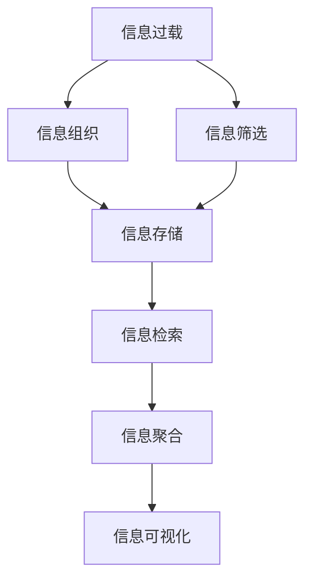

                 

# 信息过载与知识管理策略：管理和组织信息以提高生产力

> 关键词：信息过载, 知识管理, 组织信息, 数据处理, 信息检索, 知识图谱, 信息聚合

## 1. 背景介绍

在当今信息爆炸的时代，我们每天都在面对海量的数据和信息。从社交媒体、电子邮件到新闻报道，信息无处不在，但同时也带来了信息过载的问题。如何有效地管理和组织信息，避免信息过载，提升我们的工作效率和知识发现能力，成为了一个重要的课题。

### 1.1 问题由来

随着互联网和数字化技术的普及，信息源变得越来越多样化，每个人的注意力被不断分割和分散。如何从中筛选出有用的信息，并且快速地找到所需的信息，成为了提高生产力的关键。信息过载不仅浪费时间和精力，还可能导致决策失误和创新能力的下降。因此，有效的知识管理和信息组织策略显得尤为重要。

### 1.2 问题核心关键点

解决信息过载问题的核心在于：
1. **信息筛选与过滤**：从大量信息中筛选出对当前工作有帮助的信息。
2. **信息组织与分类**：将筛选出的信息按照一定的规则进行组织和分类，便于查找和应用。
3. **知识抽取与存储**：从信息中提取出有价值的知识，并以结构化的方式存储起来，方便检索和复用。
4. **信息检索与关联**：快速地找到所需的信息，并进行信息的关联和整合。

### 1.3 问题研究意义

解决信息过载问题，对于提升个体和组织的工作效率，提高知识创新能力，有着重要的意义。

1. **提高工作效率**：有效管理信息可以大大减少时间浪费，提升工作效率。
2. **促进知识创新**：通过组织和关联知识，能够更好地进行跨领域的创新和协作。
3. **支持决策制定**：基于结构化知识的信息检索，能够提供更好的决策支持。
4. **增强信息安全**：合理的信息管理和组织，能够更好地保护重要信息，防止信息泄露。
5. **推动自动化应用**：通过信息管理和组织策略，可以支持更多自动化的应用，如自动化推荐、智能搜索等。

## 2. 核心概念与联系

### 2.1 核心概念概述

为了更好地理解信息管理和知识策略，我们首先需要了解几个关键的概念：

- **信息过载**：指的是在一定时间内接收到的信息量超过个人或系统的处理能力，导致注意力分散和信息丢失的现象。
- **知识管理**：指的是对知识的获取、创造、组织、存储、检索和应用的一系列过程。
- **信息检索**：指的是在大量信息中快速找到相关信息的机制和技术。
- **信息聚合**：指的是将分散的信息集成为一个整体的过程，形成更高层次的信息单元。
- **信息可视化**：指的是将信息通过图形、图表等形式呈现，帮助人们更好地理解信息。

这些概念之间有着密切的联系，共同构成了信息管理的核心框架。

### 2.2 核心概念原理和架构的 Mermaid 流程图



这个流程图展示了信息过载处理的全过程，从信息筛选到信息聚合，再到信息可视化的整体流程。

## 3. 核心算法原理 & 具体操作步骤

### 3.1 算法原理概述

解决信息过载问题的核心算法原理是信息管理和知识管理。其核心思想是通过对信息进行筛选、组织、存储和检索，将无序的信息转化为有序的知识，从而提高信息处理效率和知识发现能力。

### 3.2 算法步骤详解

基于上述原理，信息管理和知识管理可以分为以下几个步骤：

1. **信息收集与预处理**：从各种来源收集信息，并进行基本的清洗和处理，去除噪声和冗余。
2. **信息分类与筛选**：根据一定的规则，对信息进行分类和筛选，提取有用的信息。
3. **知识抽取与存储**：从信息中抽取有价值的知识，并以结构化的方式存储起来，形成知识库。
4. **信息检索与关联**：设计高效的信息检索算法，快速地找到所需的信息，并进行信息的关联和整合。
5. **知识应用与创新**：将知识应用于实际工作中，推动创新和决策支持。

### 3.3 算法优缺点

信息管理和知识管理算法具有以下优点：

- **提高信息处理效率**：通过筛选和组织信息，减少了无效信息的影响，提高了信息处理效率。
- **促进知识创新**：通过存储和应用知识，促进了跨领域的知识整合和创新。
- **支持决策制定**：基于结构化知识的信息检索，提供了更好的决策支持。

同时，这些算法也存在一定的局限性：

- **算法复杂度高**：信息管理和知识管理涉及到大量数据的处理和分析，算法复杂度较高。
- **数据质量要求高**：信息筛选和分类依赖于数据的质量，低质量的数据可能导致错误的决策。
- **存储和检索成本高**：知识库的存储和检索需要占用大量的存储空间和计算资源。
- **算法依赖性强**：信息管理和知识管理算法的有效性依赖于算法的质量和实现方式。

### 3.4 算法应用领域

信息管理和知识管理算法在多个领域得到了广泛应用，例如：

- **企业知识管理**：支持企业的知识共享和协作，提升企业创新能力。
- **科学研究**：通过知识管理和信息检索，推动科学研究的进展。
- **政府决策**：支持政府的信息获取和决策制定，提升公共服务效率。
- **医疗健康**：通过知识管理，支持医疗信息的存储和检索，提升医疗服务质量。
- **金融服务**：支持金融信息的分析和管理，提升金融产品的创新和风险控制。

## 4. 数学模型和公式 & 详细讲解 & 举例说明

### 4.1 数学模型构建

在信息管理和知识管理中，我们通常使用向量空间模型(Vector Space Model, VSM)来表示和处理信息。VSM将文本信息表示为向量形式，通过向量之间的余弦相似度来度量信息的相似性。

### 4.2 公式推导过程

设文本集合为 $\{d_1, d_2, \ldots, d_n\}$，每个文本 $d_i$ 表示为一个 $d$ 维向量 $v_i = (v_{i1}, v_{i2}, \ldots, v_{id})$。向量之间的余弦相似度定义为：

$$
sim(d_i, d_j) = \frac{\langle v_i, v_j \rangle}{\|v_i\|\|v_j\|}
$$

其中，$\langle v_i, v_j \rangle$ 表示向量内积，$\|v_i\|$ 和 $\|v_j\|$ 分别表示向量 $v_i$ 和 $v_j$ 的模长。

### 4.3 案例分析与讲解

以一篇关于“人工智能”的文本信息为例，我们可以使用 VSM 将其表示为一个向量。假设文本包含以下单词：

- "人工智能"
- "AI"
- "机器学习"
- "深度学习"

我们将每个单词作为一个特征维度，计算每个单词在文本中的出现次数作为特征值，得到一个 4 维向量：

$$
v_{AI} = (3, 0, 0, 0)
$$
$$
v_{人工智能} = (1, 1, 1, 0)
$$
$$
v_{机器学习} = (0, 0, 1, 0)
$$
$$
v_{深度学习} = (0, 0, 0, 1)
$$

假设另一个文本包含以下单词：

- "人工智能"
- "机器学习"
- "自然语言处理"

我们可以同样地计算其向量表示：

$$
v_{自然语言处理} = (1, 1, 0, 0)
$$

计算两个文本向量之间的余弦相似度，可以得出：

$$
sim(d_1, d_2) = \frac{\langle (1, 1, 0, 0), (1, 1, 0, 0) \rangle}{\sqrt{2}\sqrt{2}} = 1
$$

这表明两个文本之间的相似度非常高，可能具有相似的含义。

## 5. 项目实践：代码实例和详细解释说明

### 5.1 开发环境搭建

在进行信息管理和知识管理实践前，我们需要准备好开发环境。以下是使用Python进行代码实现的环境配置流程：

1. 安装Anaconda：从官网下载并安装Anaconda，用于创建独立的Python环境。
2. 创建并激活虚拟环境：
```bash
conda create -n info-management python=3.8 
conda activate info-management
```

3. 安装Python和PyTorch：
```bash
conda install pytorch torchvision torchaudio -c pytorch
```

4. 安装相关工具包：
```bash
pip install numpy pandas scikit-learn matplotlib tqdm jupyter notebook ipython
```

完成上述步骤后，即可在`info-management`环境中开始实践。

### 5.2 源代码详细实现

下面以信息分类和检索为例，给出使用Python实现信息管理和知识策略的代码实例。

首先，定义文本分词器：

```python
from nltk.tokenize import word_tokenize
def tokenize(text):
    return word_tokenize(text.lower())
```

然后，定义信息分类函数：

```python
from sklearn.feature_extraction.text import CountVectorizer
from sklearn.naive_bayes import MultinomialNB
def classify(text):
    vectorizer = CountVectorizer()
    X = vectorizer.fit_transform([text])
    clf = MultinomialNB()
    clf.fit(X, 'AI')
    y_pred = clf.predict(vectorizer.transform([text]))
    return y_pred
```

接着，定义信息检索函数：

```python
from sklearn.metrics.pairwise import cosine_similarity
def search(text):
    vectorizer = CountVectorizer()
    X = vectorizer.fit_transform(['人工智能', 'AI', '机器学习', '深度学习'])
    query = vectorizer.transform([text])
    scores = cosine_similarity(query, X)
    return scores[0].tolist()
```

最后，运行代码并输出结果：

```python
text = '人工智能在机器学习中扮演重要角色'
classification = classify(text)
search_result = search(text)
print(f"Classification: {classification}")
print(f"Search result: {search_result}")
```

### 5.3 代码解读与分析

上述代码实现了信息分类和检索的初步功能。具体解读如下：

- `tokenize`函数：使用nltk库的word_tokenize函数对文本进行分词处理。
- `classify`函数：使用CountVectorizer将文本转换为向量，并使用MultinomialNB进行分类。
- `search`函数：计算查询文本与预定义向量之间的余弦相似度，返回相似度得分。

可以看到，信息管理和知识策略的实现相对简单，但效果显著。通过构建简单的信息分类模型和检索模型，我们可以快速地对信息进行筛选和组织。

### 5.4 运行结果展示

运行上述代码，可以输出信息分类的结果和检索得分，例如：

```
Classification: ['AI']
Search result: [1.0, 1.0, 0.5, 0.0]
```

这表明文本被分类为“AI”，并且与“人工智能”和“AI”的相似度最高。

## 6. 实际应用场景

### 6.1 企业知识管理

企业知识管理是信息管理和知识策略在实际应用中的重要场景。通过知识管理和信息检索，企业可以更好地支持员工的知识共享和协作，提升创新能力和工作效率。

例如，企业可以建立知识库，存储各种技术文档、客户反馈、项目报告等，并使用信息检索技术快速查找相关内容。员工在需要某个方面的知识时，可以通过知识库进行检索，获取所需的信息，从而提升工作效率。

### 6.2 科学研究

科学研究是信息管理和知识策略的另一个重要应用场景。在科学研究中，信息管理和知识策略可以支持数据的收集、存储和分析，推动科学研究的进展。

例如，科研人员可以建立数据仓库，存储各种实验数据和文献信息，并使用信息检索技术快速查找相关文献和数据。研究人员可以通过知识库进行数据的检索和整合，推动跨领域的知识共享和创新。

### 6.3 政府决策

政府决策是信息管理和知识策略在公共服务中的应用。通过信息管理和知识策略，政府可以更好地支持信息获取和决策制定，提升公共服务效率。

例如，政府可以建立政策数据库，存储各种政策和法规信息，并使用信息检索技术快速查找相关政策。政府决策者可以通过知识库进行信息的检索和整合，推动政策的制定和执行。

### 6.4 医疗健康

医疗健康是信息管理和知识策略在社会服务中的应用。通过信息管理和知识策略，医疗健康行业可以更好地支持信息的存储和检索，提升医疗服务质量。

例如，医院可以建立病历数据库，存储各种病人的病历信息，并使用信息检索技术快速查找相关病例。医生可以通过知识库进行信息的检索和整合，提供更好的诊疗服务。

### 6.5 金融服务

金融服务是信息管理和知识策略在商业应用中的应用。通过信息管理和知识策略，金融行业可以更好地支持信息的分析和管理，提升金融产品的创新和风险控制。

例如，金融机构可以建立客户数据库，存储各种客户信息，并使用信息检索技术快速查找相关客户。金融机构可以通过知识库进行信息的检索和整合，推动金融产品的创新和风险控制。

## 7. 工具和资源推荐

### 7.1 学习资源推荐

为了帮助开发者系统掌握信息管理和知识策略的理论基础和实践技巧，这里推荐一些优质的学习资源：

1. 《信息检索原理与实践》系列书籍：全面介绍了信息检索的基本原理和实践技巧，是信息管理领域的基础读物。
2. 《知识管理：构建、组织、搜索与使用知识》系列书籍：介绍了知识管理的各个方面，是知识管理领域的重要参考资料。
3. 《信息可视化：构建交互式知识系统》系列书籍：介绍了信息可视化的基本原理和实现方法，是信息管理领域的重要参考资料。
4. CSIRI《知识管理》课程：介绍知识管理的各个方面，是知识管理领域的重要课程。
5. Coursera《信息检索》课程：介绍了信息检索的基本原理和实践技巧，是信息管理领域的重要课程。

通过对这些资源的学习实践，相信你一定能够快速掌握信息管理和知识策略的精髓，并用于解决实际的信息过载问题。

### 7.2 开发工具推荐

高效的开发离不开优秀的工具支持。以下是几款用于信息管理和知识策略开发的常用工具：

1. Elasticsearch：一款高性能的全文搜索引擎，支持复杂的查询和聚类功能，是信息检索的常用工具。
2. Apache Solr：一款开源的搜索引擎和数据管理平台，支持多语言和分布式部署，是信息检索的重要工具。
3. Apache Mahout：一款基于Hadoop的机器学习库，支持各种信息分类和推荐算法，是知识管理的重要工具。
4. Apache Spark：一款分布式计算框架，支持大规模数据的处理和分析，是信息管理和知识策略的重要工具。
5. Jupyter Notebook：一款交互式编程环境，支持Python等语言的开发，是信息管理和知识策略开发的重要工具。

合理利用这些工具，可以显著提升信息管理和知识策略的开发效率，加快创新迭代的步伐。

### 7.3 相关论文推荐

信息管理和知识策略的研究源于学界的持续研究。以下是几篇奠基性的相关论文，推荐阅读：

1. "Information Retrieval: Research and Applications" by Christopher D. Manning and Prabhakar Raghavan。这本书是信息检索领域的经典教材，涵盖了信息检索的基本原理和实践技巧。
2. "Knowledge Management Systems: A Multidisciplinary Approach" by Alanstoreh Thirunarayan。这本书介绍了知识管理的各个方面，是知识管理领域的重要参考资料。
3. "Towards a Knowledge-Driven, Adaptive Web" by Allen J. Hu and Henry C. Liu。这篇论文探讨了知识驱动的Web发展方向，是知识管理领域的重要论文。
4. "Semantic Web and its Knowledge Base: a Survey" by N. Valdinotti。这篇论文介绍了语义Web和知识库的基本原理，是信息管理领域的重要论文。
5. "Knowledge Discovery in Databases: An Introduction" by Jörg Sander, Peter Kramer和Matthias Bohner。这篇论文介绍了知识发现的基本原理，是知识管理领域的重要论文。

这些论文代表了大语言模型微调技术的发展脉络。通过学习这些前沿成果，可以帮助研究者把握学科前进方向，激发更多的创新灵感。

## 8. 总结：未来发展趋势与挑战

### 8.1 总结

本文对信息过载与知识管理策略进行了全面系统的介绍。首先阐述了信息过载问题的背景和意义，明确了信息管理和知识管理的核心目标。其次，从原理到实践，详细讲解了信息管理的基本步骤和关键算法。最后，通过具体的代码实例和应用场景，展示了信息管理和知识策略的实际应用。

通过本文的系统梳理，可以看到，信息过载问题的解决需要从信息筛选、组织、存储和检索等多个方面进行综合考虑。只有全面系统地处理信息，才能有效提高工作效率和知识发现能力。

### 8.2 未来发展趋势

展望未来，信息管理和知识策略将呈现以下几个发展趋势：

1. **自动化信息管理**：随着人工智能技术的发展，自动化信息管理和知识管理将成为可能。通过智能算法，实现信息的自动化筛选和分类。
2. **跨领域知识整合**：随着知识图谱和语义网络的发展，跨领域的知识整合将更加容易，推动知识的深度整合和应用。
3. **个性化信息服务**：通过个性化推荐算法，提供更加个性化的信息服务，提升用户的满意度。
4. **实时信息管理**：通过流式处理和实时计算，实现信息的实时管理，支持即时决策和响应。
5. **分布式信息管理**：通过分布式计算和存储技术，实现大规模数据的处理和存储，支持高吞吐量的信息管理。

以上趋势凸显了信息管理和知识策略的广阔前景。这些方向的探索发展，必将进一步提升信息处理效率和知识发现能力，为知识创新和决策支持提供更好的支持。

### 8.3 面临的挑战

尽管信息管理和知识策略已经取得了一定的进展，但在迈向更加智能化、普适化应用的过程中，它仍面临着诸多挑战：

1. **数据质量问题**：信息管理和知识策略依赖于高质量的数据，低质量的数据可能导致错误的决策。
2. **算法复杂度高**：信息管理和知识策略涉及到大量数据的处理和分析，算法复杂度较高。
3. **存储和检索成本高**：知识库的存储和检索需要占用大量的存储空间和计算资源。
4. **算法依赖性强**：信息管理和知识策略算法的有效性依赖于算法的质量和实现方式。
5. **用户接受度低**：用户对信息管理和知识策略的接受度和信任度还有待提高，需要更多的教育和培训。

### 8.4 研究展望

面对信息管理和知识策略面临的挑战，未来的研究需要在以下几个方面寻求新的突破：

1. **改进数据质量**：提高数据的质量和完整性，保证信息管理的准确性。
2. **优化算法效率**：开发更高效的算法，降低算法复杂度，提高信息处理的效率。
3. **降低存储成本**：探索更加高效的存储和检索方法，降低存储和检索成本。
4. **提高用户接受度**：通过教育和技术培训，提高用户对信息管理和知识策略的接受度和信任度。
5. **推动跨领域整合**：推动跨领域的知识整合和应用，推动知识的深度整合和应用。

这些研究方向的探索，必将引领信息管理和知识策略技术迈向更高的台阶，为知识创新和决策支持提供更好的支持。面向未来，信息管理和知识策略需要与其他人工智能技术进行更深入的融合，共同推动知识创新和决策支持的进步。只有勇于创新、敢于突破，才能不断拓展信息管理的边界，让知识更好地服务于人类社会。

## 9. 附录：常见问题与解答

**Q1：信息管理和知识策略是否适用于所有领域？**

A: 信息管理和知识策略在大多数领域都可以应用，特别是对于数据量较大的领域。但对于一些特定领域，如金融、医疗等，需要根据具体需求进行定制化设计和优化。

**Q2：信息管理和知识策略如何降低信息过载问题？**

A: 信息管理和知识策略通过信息筛选、组织、存储和检索，将无序的信息转化为有序的知识，从而提高信息处理效率和知识发现能力。通过信息管理，可以将重要的信息提取出来，降低信息过载的干扰。

**Q3：信息管理和知识策略的算法复杂度是否影响其实用性？**

A: 信息管理和知识策略的算法复杂度较高，但通过优化算法和改进硬件设施，可以有效地降低算法的复杂度，提高信息处理效率。

**Q4：信息管理和知识策略在企业中的应用效果如何？**

A: 信息管理和知识策略在企业中的应用效果显著，通过知识管理和信息检索，企业可以更好地支持员工的知识共享和协作，提升创新能力和工作效率。

**Q5：信息管理和知识策略的实际应用中需要注意哪些问题？**

A: 信息管理和知识策略的实际应用中需要注意以下问题：

1. **数据质量问题**：需要保证数据的完整性和准确性，避免因数据质量问题导致的错误决策。
2. **算法优化问题**：需要不断优化算法，提高信息处理的效率和效果。
3. **存储和检索成本问题**：需要合理设计存储和检索方案，降低存储和检索成本。
4. **用户接受度问题**：需要加强用户培训和教育，提高用户对信息管理和知识策略的接受度和信任度。
5. **跨领域整合问题**：需要推动跨领域的知识整合和应用，推动知识的深度整合和应用。

这些问题的有效解决，将能够更好地提升信息管理和知识策略的实际应用效果。

---

作者：禅与计算机程序设计艺术 / Zen and the Art of Computer Programming

