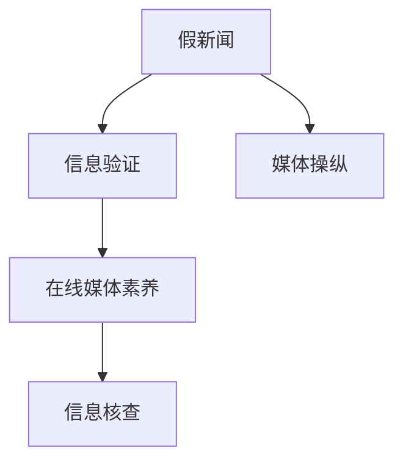

                 

## 1. 背景介绍

在当今信息爆炸的时代，假新闻和媒体操纵已经成为全球面临的严峻挑战。社交媒体、搜索引擎、新闻网站等平台上的信息真假难辨，受众容易受到误导，甚至引发社会动荡和政治危机。这种背景下，信息验证和在线媒体素养的重要性愈发凸显。

### 1.1 问题由来

假新闻和误导性信息的存在，源于多方面原因：
- **技术滥用**：利用自动化工具生成和传播虚假信息。
- **利益驱动**：某些机构或个人为了影响舆论或达成特定目标，故意制造虚假信息。
- **信息过载**：真实信息与假信息混杂，难以甄别。

假新闻不仅对个人生活带来误导，还会对社会稳定和公共决策产生负面影响。因此，提升公众的信息验证能力和在线媒体素养，是应对假新闻和媒体操纵的重要举措。

### 1.2 问题核心关键点

在线媒体素养主要包括以下几个关键点：
- **信息识别**：区分真实和虚假信息的能力。
- **批判性思维**：评估信息的来源、目的和可靠性。
- **事实核查**：验证信息是否真实准确。
- **媒体消费**：合理使用媒体资源，避免信息过载。

本文将围绕信息验证和在线媒体素养的关键问题，探讨如何导航在假新闻和媒体操纵的时代。

## 2. 核心概念与联系

### 2.1 核心概念概述

在探讨信息验证和在线媒体素养时，涉及以下核心概念：

- **假新闻**：故意捏造或歪曲事实的新闻报道，旨在误导公众或实现特定目的。
- **媒体操纵**：通过影响新闻内容、传播渠道等方式，操控舆论和公众认知。
- **在线媒体素养**：公众在互联网环境下，正确理解和消费媒体的能力。
- **信息验证**：通过技术手段和批判性思维，辨别信息真伪的过程。
- **事实核查**：对信息进行详细的核实，确保其准确性。

这些概念相互关联，共同构成了应对假新闻和媒体操纵的框架。以下将通过一个Mermaid流程图展示这些概念之间的联系：



这个流程图展示了假新闻与信息验证之间的直接关系，以及在线媒体素养和信息核查对媒体操纵的影响。

## 3. 核心算法原理 & 具体操作步骤
### 3.1 算法原理概述

信息验证和在线媒体素养的提升，可以采用数据驱动和认知导向的方法。数据驱动侧重于通过统计和计算技术，识别假新闻的特征；认知导向则侧重于提升用户的批判性思维和信息素养。

数据驱动的方法包括：
- **文本相似性分析**：通过比较新旧文本的相似性，识别重复和假冒内容。
- **关键词分析**：统计文本中的高频词汇，识别与事实不符的关键词。
- **链接验证**：检查新闻中引用的链接是否真实有效。

认知导向的方法包括：
- **批判性思维训练**：提升用户分析和评估信息的能力。
- **事实核查工具**：提供可靠的第三方事实核查资源，辅助信息验证。
- **信息素养教育**：通过课程和培训，提升用户的信息处理和决策能力。

### 3.2 算法步骤详解

以下详细介绍信息验证和在线媒体素养提升的具体操作步骤：

#### 数据驱动方法
1. **文本预处理**：对文本进行分词、去停用词、词干提取等处理。
2. **特征提取**：计算文本的TF-IDF、词频、关键词等特征。
3. **模型训练**：使用机器学习模型（如分类器、聚类器）训练，识别假新闻特征。
4. **结果验证**：使用验证集评估模型性能，调整参数以提高准确率。
5. **结果应用**：将模型应用于实际新闻的验证，标记出疑似假新闻。

#### 认知导向方法
1. **批判性思维教育**：提供批判性思维的培训课程，教授如何评估信息的来源、目的和可靠性。
2. **事实核查工具**：开发事实核查应用，集成多源数据和第三方核查资源，提供可信度评估。
3. **信息素养课程**：设计互动性强的课程，通过游戏化学习、案例分析等方式，提升用户的信息处理能力。

### 3.3 算法优缺点

数据驱动方法的优势在于：
- **自动化程度高**：能够快速处理大量文本，提高信息验证效率。
- **客观性**：依赖算法和统计结果，减少了主观偏见的影响。

但缺点同样明显：
- **假新闻特征泛化困难**：假新闻的特征复杂多样，难以用一个简单的模型全面覆盖。
- **误报率高**：模型误判真新闻为假新闻，影响用户信任。

认知导向方法的优点在于：
- **用户参与度提升**：用户通过批判性思维训练和信息素养教育，增强了自我保护能力。
- **误报率低**：用户通过深度分析和事实核查，提高了信息验证的准确性。

但缺点也显而易见：
- **主观性强**：用户的信息素养依赖于个人认知水平，难以达到统一标准。
- **时间成本高**：用户需要花费大量时间和精力进行信息验证和素养提升。

### 3.4 算法应用领域

信息验证和在线媒体素养的应用领域广泛，包括但不限于以下几方面：

- **新闻媒体平台**：如社交媒体、新闻网站、博客等，进行假新闻检测和用户教育。
- **教育系统**：在课堂教学中融入信息素养教育，提升学生的信息处理能力。
- **公共决策**：在政策制定过程中，引入事实核查工具，确保决策依据的真实性。
- **企业和政府**：提升员工和公务员的信息素养，防范信息安全风险。

## 4. 数学模型和公式 & 详细讲解 & 举例说明
### 4.1 数学模型构建

信息验证的核心模型是文本分类器，其目标是判断一篇文本是否为假新闻。形式化表示为：

$$
y = f(x; \theta)
$$

其中 $x$ 为文本特征向量，$y$ 为分类结果，$f(\cdot)$ 为分类函数，$\theta$ 为模型参数。

### 4.2 公式推导过程

以朴素贝叶斯分类器为例，其训练目标是最小化经验风险：

$$
\min_{\theta} \frac{1}{N} \sum_{i=1}^N \ell(y_i, f(x_i; \theta))
$$

其中 $\ell(\cdot)$ 为损失函数，$N$ 为样本数量。

具体公式推导过程如下：

1. **先验概率**：计算文本的先验概率 $P(X)$。
2. **条件概率**：计算给定文本条件下每个类别 $y$ 的条件概率 $P(y|X)$。
3. **后验概率**：通过贝叶斯定理计算后验概率 $P(y|X)$。
4. **分类决策**：选择后验概率最大的类别作为分类结果。

### 4.3 案例分析与讲解

以Google Fact Check工具为例，其核心算法为神经网络，具体步骤如下：
1. **数据收集**：收集大量假新闻和真实新闻的语料库。
2. **特征提取**：提取文本的TF-IDF、关键词、链接等特征。
3. **模型训练**：使用神经网络模型进行训练，优化损失函数。
4. **结果验证**：在验证集上进行评估，调整模型参数。
5. **结果应用**：将模型应用于新文本的验证，输出可信度评分。

## 5. 项目实践：代码实例和详细解释说明
### 5.1 开发环境搭建

信息验证和在线媒体素养项目的开发，需要以下开发环境：

1. **Python**：选择Python 3.x版本，如3.7、3.8、3.9等。
2. **PyTorch**：用于搭建和训练深度学习模型。
3. **NLTK**：自然语言处理工具包，用于文本预处理。
4. **TensorBoard**：可视化工具，用于监控模型训练过程。
5. **Jupyter Notebook**：交互式开发环境，便于编写和调试代码。

以下是在Python中搭建开发环境的步骤：

```bash
# 安装Python
sudo apt-get update
sudo apt-get install python3
# 创建虚拟环境
python3 -m venv myenv
# 激活虚拟环境
source myenv/bin/activate
# 安装必要的Python包
pip install torch nltk tensorboard jupyter notebook
```

### 5.2 源代码详细实现

以下是一个简单的信息验证项目的代码实现，使用朴素贝叶斯分类器对假新闻进行识别：

```python
import numpy as np
from sklearn.feature_extraction.text import CountVectorizer
from sklearn.naive_bayes import MultinomialNB
from sklearn.metrics import accuracy_score, confusion_matrix

# 文本预处理
texts = ["This is a fake news", "This is a real news"]
labels = [0, 1]

# 特征提取
vectorizer = CountVectorizer(stop_words='english')
X = vectorizer.fit_transform(texts)

# 模型训练
clf = MultinomialNB(alpha=1.0)
clf.fit(X, labels)

# 结果验证
X_test = vectorizer.transform(["This is another fake news"])
preds = clf.predict(X_test)
print(accuracy_score(labels, preds))
print(confusion_matrix(labels, preds))
```

### 5.3 代码解读与分析

以上代码实现了一个简单的文本分类器，用于识别假新闻。关键步骤包括：

1. **文本预处理**：使用NLTK库进行文本分词、去停用词、词干提取等处理。
2. **特征提取**：使用CountVectorizer提取文本的TF-IDF特征。
3. **模型训练**：使用MultinomialNB训练朴素贝叶斯分类器。
4. **结果验证**：在测试集上进行预测，评估模型性能。

## 6. 实际应用场景
### 6.1 假新闻检测

在新闻媒体平台，假新闻检测是信息验证的重要应用场景。通过集成事实核查工具和信息验证模型，新闻平台可以对用户提交的内容进行自动检测，标记出可能的假新闻，并提供可信度评分。

### 6.2 新闻聚合与推荐

新闻聚合平台可以根据用户的历史阅读记录和兴趣标签，推荐可信度高的新闻。平台集成事实核查工具，确保推荐内容真实可靠。

### 6.3 公共政策制定

在公共决策过程中，政府和智库可以使用事实核查工具，对政策提案和新闻报道进行核查，确保决策依据的真实性和科学性。

### 6.4 教育培训

教育系统可以通过信息素养课程和在线工具，提升学生的信息处理能力，帮助他们识别假新闻，增强批判性思维。

## 7. 工具和资源推荐
### 7.1 学习资源推荐

以下是一些有用的学习资源，帮助提升信息验证和在线媒体素养：

1. **Coursera**：提供多门自然语言处理和信息验证的在线课程，如斯坦福大学的《自然语言处理》课程。
2. **Kaggle**：数据科学竞赛平台，提供大量假新闻和事实核查数据集。
3. **Google Fact Check**：官方事实核查工具，提供可信度评分和详细的验证信息。
4. **Mediawiki**：开源维基百科平台，提供丰富的教育资源和事实核查信息。
5. **JSTOR**：学术数据库，提供高质量的研究论文和文献资源。

### 7.2 开发工具推荐

以下是一些推荐的开发工具和平台：

1. **PyTorch**：用于深度学习模型训练和推理，支持动态图和静态图两种模式。
2. **TensorBoard**：可视化工具，监控模型训练和推理过程，生成详细的图表和报告。
3. **Jupyter Notebook**：交互式开发环境，支持Python、R等语言，便于代码调试和数据可视化。
4. **NLTK**：自然语言处理工具包，提供文本处理和特征提取功能。
5. **Scikit-learn**：机器学习库，包含多种分类、回归、聚类算法。

### 7.3 相关论文推荐

以下是一些相关领域的经典论文：

1. "Automatically Detecting False News on Social Media" by Hasan Rashid et al.（2017）：研究使用深度学习技术检测假新闻的准确性和鲁棒性。
2. "DeepFact: A Deep Learning Framework for Fact-Checking News Articles" by Sayantika Bose et al.（2020）：提出基于深度学习的假新闻检测框架，并进行广泛的实验验证。
3. "Verifying News Validity with Multimodal Deep Learning" by Pernille China et al.（2019）：使用多模态深度学习模型进行新闻可信度评估。
4. "Teaching Media Literacy with AI" by Kevin Wagner et al.（2018）：研究人工智能在教育系统中提升媒体素养的应用。

## 8. 总结：未来发展趋势与挑战
### 8.1 总结

本文系统介绍了信息验证和在线媒体素养的概念及其在假新闻和媒体操纵时代的导航方法。从数据驱动和认知导向两个角度，探讨了提升信息素养的技术手段和教育路径。通过具体的算法实现和案例分析，展示了信息验证的应用前景和挑战。

通过本文的系统梳理，可以看到，信息验证和在线媒体素养在假新闻和媒体操纵时代具有重要的现实意义，帮助公众识别和对抗假新闻，提升信息素养。未来，伴随技术的进步和认知导向教育的发展，信息素养和信息验证将在更广泛的应用场景中发挥重要作用。

### 8.2 未来发展趋势

信息验证和在线媒体素养的发展趋势如下：

1. **自动化和智能化**：未来将更加依赖自动化工具和人工智能技术，提升信息验证的效率和准确性。
2. **多模态融合**：结合视觉、音频、文本等多模态信息，进行更全面的信息核查和验证。
3. **跨领域应用**：信息验证和媒体素养将应用到更多领域，如公共决策、医疗健康、金融服务等。
4. **隐私保护**：在提升信息素养的同时，注重用户隐私保护，确保数据安全。
5. **伦理道德**：信息验证工具和教育内容将引入伦理道德考量，确保技术的公正和透明。

### 8.3 面临的挑战

尽管信息验证和在线媒体素养的应用前景广阔，但在实际推广和应用过程中，仍面临诸多挑战：

1. **数据隐私**：大规模数据采集和使用可能涉及用户隐私，引发法律和伦理问题。
2. **算法偏见**：信息验证模型的训练数据可能存在偏见，影响模型的公平性和准确性。
3. **用户接受度**：信息素养教育和工具的推广，需要克服用户的抵触和习惯性依赖。
4. **成本和技术门槛**：信息验证和在线媒体素养技术的应用，需要一定的技术支持和成本投入。
5. **效果评估**：如何科学评估信息验证和在线媒体素养的效果，仍然是一个开放性问题。

### 8.4 研究展望

未来的研究将集中在以下几个方面：

1. **隐私保护技术**：开发隐私保护技术，确保信息验证和在线媒体素养的应用合法合规。
2. **公平性研究**：深入研究信息验证模型的公平性问题，消除算法偏见，提升模型的公正性。
3. **用户参与度提升**：通过游戏化、社交化等方式，提高用户对信息验证和在线媒体素养的参与度和接受度。
4. **跨领域应用研究**：探索信息验证和在线媒体素养在公共决策、医疗健康等领域的实际应用，进行效果评估和优化。

通过积极应对这些挑战，不断推进信息验证和在线媒体素养的研究与应用，相信能够在假新闻和媒体操纵时代，为公众提供更可靠、高效、可信赖的信息环境。

## 9. 附录：常见问题与解答

**Q1：什么是信息验证？**

A: 信息验证是指通过技术手段和批判性思维，辨别信息真伪的过程。包括文本相似性分析、关键词提取、链接验证等方法。

**Q2：信息验证和在线媒体素养有什么区别？**

A: 信息验证主要侧重于通过技术手段识别假新闻，而在线媒体素养则侧重于提升用户的批判性思维和信息处理能力，涵盖更广泛的信息消费和传播行为。

**Q3：为什么信息验证和在线媒体素养在假新闻时代至关重要？**

A: 假新闻和媒体操纵已成为全球性问题，误导公众、影响决策。信息验证和在线媒体素养能够帮助公众识别假新闻，提升信息素养，减少信息误导和舆论操纵的影响。

**Q4：如何进行信息验证？**

A: 信息验证通常包括文本相似性分析、关键词提取、链接验证等步骤。使用机器学习模型进行文本分类，识别可能的假新闻。

**Q5：信息素养教育有哪些方法？**

A: 信息素养教育可以通过课程、培训、互动游戏等方式进行。例如，设计基于案例分析的教学模块，提升用户的信息处理和批判性思维能力。

---

作者：禅与计算机程序设计艺术 / Zen and the Art of Computer Programming

