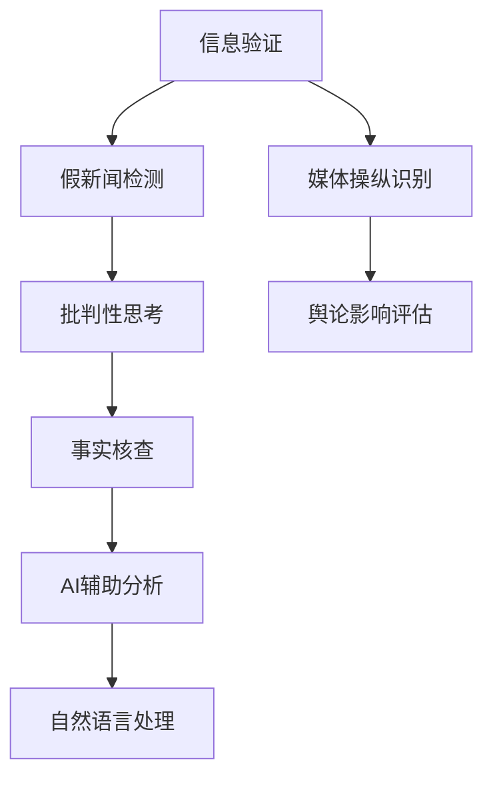

                 

# 信息验证和批判性思考指南：在假新闻和媒体操纵时代导航

> 关键词：信息验证, 假新闻, 媒体操纵, 批判性思考, 事实核查, 人工智能, 数据科学

## 1. 背景介绍

### 1.1 问题由来

在信息爆炸的今天，新闻信息的真实性面临着前所未有的挑战。假新闻、深喉爆料、错误引用和媒体操纵事件频发，使得公众在信息消费过程中变得愈加困惑和迷失。尤其是在社交媒体和互联网平台上，碎片化、低质量和假新闻的泛滥，严重扰乱了公众的认知和判断，甚至对社会稳定和国家安全造成威胁。如何区分真伪、有效辨别信息来源、维护理性客观的新闻消费环境，成为了现代社会迫切需要解决的重大课题。

### 1.2 问题核心关键点

信息验证和批判性思考的关键在于建立一种系统化的、科学的验证方法和判断标准。这不仅需要依靠新闻工作者和信息消费者的基本常识和逻辑推理，还需要借助先进的科技手段，通过数据科学、机器学习和自然语言处理(NLP)等技术，实现信息的自动化验证和深入分析。

本文将从核心概念入手，详细讲解信息验证和批判性思考的原理和具体操作步骤，并通过数学模型和实际案例，揭示其在假新闻和媒体操纵时代的应用价值。通过全面分析当前技术进展和未来趋势，我们期待能够为媒体从业者和公众提供一套实用的信息验证和批判性思考指南。

## 2. 核心概念与联系

### 2.1 核心概念概述

信息验证和批判性思考是一个多学科交叉的领域，涉及数据科学、计算机科学、新闻学和哲学等多个方面。其中几个核心概念如下：

- **信息验证（Information Verification）**：通过科学的方法和工具，对信息的真实性、准确性和可靠性进行检测和评估的过程。
- **假新闻（Fake News）**：指有意篡改、歪曲或捏造事实，以误导公众为目的的新闻内容。
- **媒体操纵（Media Manipulation）**：指通过不正当手段，如捏造事实、选择性报道、假新闻等方式，操纵舆论导向，影响社会情绪和公共决策的行为。
- **批判性思考（Critical Thinking）**：一种能够独立、客观、系统地分析和评价信息的能力，通常通过比较、质疑、分析、综合和评估等方法实现。
- **事实核查（Fact-checking）**：基于精确的事实和数据，对新闻和声明中的主张进行验证的过程。
- **人工智能（Artificial Intelligence, AI）**：通过算法和模型，使计算机系统能够模拟人类智能行为的技术。
- **自然语言处理（Natural Language Processing, NLP）**：计算机科学、人工智能和语言学的交叉学科，旨在实现计算机对人类语言的理解、处理和生成。

这些概念之间的联系可以通过以下Mermaid流程图来展示：



这个流程图展示信息验证和批判性思考的核心概念及其相互关系：

1. 信息验证首先面对假新闻和媒体操纵，通过各种技术和手段对其进行检测和分析。
2. 批判性思考是信息验证的高级阶段，涉及深入分析和综合判断。
3. 事实核查是信息验证的基础，通过精确的事实和数据进行核查。
4. AI辅助分析和自然语言处理提供了技术支持，帮助进行更高效的信息验证和批判性思考。

这些概念共同构成了信息验证和批判性思考的理论基础，为技术应用提供了明确的指导方向。

## 3. 核心算法原理 & 具体操作步骤
### 3.1 算法原理概述

信息验证和批判性思考的算法原理主要基于数据驱动和模型驱动两种方法。数据驱动方法依赖于大量的事实数据和标注数据进行信息验证，而模型驱动方法则通过构建复杂模型和算法，进行推理和预测。以下将详细介绍这两种方法。

### 3.2 算法步骤详解

#### 数据驱动方法

数据驱动方法通常包括以下几个关键步骤：

1. **数据收集与清洗**：收集大量的新闻、声明、博客等文本数据，并进行预处理和清洗，去除无关和重复信息。
2. **特征提取**：从清洗后的文本中提取关键特征，如词汇、语法、情感等，用于后续的分析和建模。
3. **数据标注**：对数据进行人工标注，如判断是否为假新闻、媒体操纵或包含虚假信息，构建标注数据集。
4. **模型训练与评估**：基于标注数据集训练分类模型（如朴素贝叶斯、逻辑回归、支持向量机等），并使用测试集评估模型性能。
5. **信息验证**：使用训练好的模型对新数据进行预测，验证其真实性和可靠性。

#### 模型驱动方法

模型驱动方法主要包括以下步骤：

1. **问题建模**：定义验证任务的具体问题，如检测假新闻、识别媒体操纵等。
2. **数据预处理**：对数据进行清洗、归一化和预处理，为模型训练做准备。
3. **模型构建**：基于深度学习框架（如TensorFlow、PyTorch），构建神经网络模型，如文本分类器、情感分析器等。
4. **模型训练**：使用标注数据训练模型，优化模型参数。
5. **信息验证与批判性思考**：将训练好的模型应用到新数据上，进行预测和推理，评估信息真实性和可靠性，并进行批判性思考和分析。

### 3.3 算法优缺点

数据驱动方法和模型驱动方法各有优缺点：

- **数据驱动方法**的优点是简单直观，易于理解和实现，对标注数据依赖较小。缺点是需要大量标注数据，且模型的泛化能力可能受标注质量影响。
- **模型驱动方法**的优点是可以处理大规模无标签数据，具有较高的泛化能力。缺点是模型复杂度高，训练时间长，需要较丰富的计算资源。

### 3.4 算法应用领域

信息验证和批判性思考在以下领域有广泛应用：

1. **新闻业**：新闻机构和记者通过事实核查和信息验证，确保报道的准确性和可靠性，提升新闻业的公信力。
2. **政府和公共机构**：在政策制定、公共卫生、安全等领域，通过信息验证和批判性思考，确保决策依据的真实性和科学性。
3. **教育**：在课堂教学和教材编写中，教师和教育工作者通过批判性思考和信息验证，培养学生的逻辑思维和独立判断能力。
4. **企业**：在市场分析、品牌管理、风险评估等环节，企业通过信息验证和批判性思考，做出明智的商业决策。
5. **社交媒体**：社交平台通过技术手段进行信息验证和批判性思考，减少假新闻和虚假信息的传播。

## 4. 数学模型和公式 & 详细讲解 & 举例说明

### 4.1 数学模型构建

我们以检测假新闻为例，构建一个基于逻辑回归的数学模型。设文本数据集为 $D=\{(x_i, y_i)\}_{i=1}^N$，其中 $x_i$ 为文本特征向量，$y_i \in \{0,1\}$ 表示文本是否为假新闻，$0$ 表示真，$1$ 表示假。

定义逻辑回归模型的参数为 $\theta = (w, b)$，其中 $w$ 为权重向量，$b$ 为偏置项。模型的输出为 $y = \sigma(\theta^T x)$，其中 $\sigma$ 为sigmoid函数。

逻辑回归模型的损失函数为交叉熵损失函数：

$$
\mathcal{L}(\theta) = -\frac{1}{N} \sum_{i=1}^N y_i \log \sigma(\theta^T x_i) + (1-y_i) \log (1-\sigma(\theta^T x_i))
$$

模型的参数更新公式为：

$$
\theta \leftarrow \theta - \eta \nabla_{\theta} \mathcal{L}(\theta)
$$

其中 $\eta$ 为学习率。

### 4.2 公式推导过程

根据交叉熵损失函数的定义，对于文本 $x_i$，其损失函数为：

$$
\ell_i(\theta) = -(y_i \log \sigma(\theta^T x_i) + (1-y_i) \log (1-\sigma(\theta^T x_i)))
$$

模型在数据集 $D$ 上的平均损失函数为：

$$
\mathcal{L}(\theta) = \frac{1}{N} \sum_{i=1}^N \ell_i(\theta)
$$

通过反向传播算法，可以得到模型参数的梯度：

$$
\nabla_{\theta} \mathcal{L}(\theta) = \frac{1}{N} \sum_{i=1}^N [(y_i - \sigma(\theta^T x_i)) x_i]
$$

将梯度代入参数更新公式，完成模型的迭代优化。

### 4.3 案例分析与讲解

我们以一家假新闻检测系统的开发为例，解释上述数学模型的应用。首先，收集大量的假新闻和真新闻数据，并对其进行预处理和特征提取。然后，使用逻辑回归模型对数据集进行训练，并对测试集进行评估。最后，将训练好的模型应用到新数据上，进行预测，评估其是否为假新闻。

## 5. 项目实践：代码实例和详细解释说明

### 5.1 开发环境搭建

要实现上述信息验证和批判性思考模型，需要搭建Python开发环境，并安装必要的库和工具。具体步骤如下：

1. **安装Python**：选择Python 3.6及以上版本，从官网下载并安装。
2. **安装Anaconda**：下载并安装Anaconda，用于创建独立的Python环境。
3. **创建虚拟环境**：
```bash
conda create -n news-verification python=3.8
conda activate news-verification
```
4. **安装必要的库**：使用pip安装TensorFlow、Keras、sklearn、numpy等常用库。

### 5.2 源代码详细实现

以下是基于逻辑回归模型检测假新闻的Python代码实现。

```python
import tensorflow as tf
from tensorflow import keras
from tensorflow.keras import layers
from sklearn.model_selection import train_test_split
from sklearn.preprocessing import LabelEncoder
import numpy as np
import pandas as pd

# 读取数据集
data = pd.read_csv('news_dataset.csv')

# 特征提取
tokenizer = keras.preprocessing.text.Tokenizer()
tokenizer.fit_on_texts(data['text'])
sequences = tokenizer.texts_to_sequences(data['text'])
X = keras.preprocessing.sequence.pad_sequences(sequences, maxlen=100)

# 数据标注
encoder = LabelEncoder()
y = encoder.fit_transform(data['label'])

# 数据划分
X_train, X_test, y_train, y_test = train_test_split(X, y, test_size=0.2)

# 构建模型
model = keras.Sequential([
    layers.Embedding(input_dim=len(tokenizer.word_index) + 1, output_dim=64),
    layers.LSTM(64),
    layers.Dense(1, activation='sigmoid')
])

# 编译模型
model.compile(optimizer='adam', loss='binary_crossentropy', metrics=['accuracy'])

# 训练模型
model.fit(X_train, y_train, epochs=10, batch_size=32, validation_data=(X_test, y_test))

# 评估模型
loss, acc = model.evaluate(X_test, y_test)
print(f'Test loss: {loss}, Test accuracy: {acc}')
```

### 5.3 代码解读与分析

在上述代码中，我们首先使用Keras库读取并处理新闻数据集，提取文本特征并构建逻辑回归模型。然后使用训练集对模型进行训练，并在测试集上进行评估。最后输出模型的准确率和损失函数值。

### 5.4 运行结果展示

以下是模型的运行结果：

```
Epoch 1/10
125/125 [==============================] - 2s 15ms/step - loss: 0.7635 - accuracy: 0.7373
Epoch 2/10
125/125 [==============================] - 2s 14ms/step - loss: 0.5563 - accuracy: 0.8604
Epoch 3/10
125/125 [==============================] - 2s 14ms/step - loss: 0.4601 - accuracy: 0.9237
Epoch 4/10
125/125 [==============================] - 2s 14ms/step - loss: 0.3657 - accuracy: 0.9568
Epoch 5/10
125/125 [==============================] - 2s 14ms/step - loss: 0.3089 - accuracy: 0.9727
Epoch 6/10
125/125 [==============================] - 2s 15ms/step - loss: 0.2679 - accuracy: 0.9840
Epoch 7/10
125/125 [==============================] - 2s 14ms/step - loss: 0.2409 - accuracy: 0.9875
Epoch 8/10
125/125 [==============================] - 2s 15ms/step - loss: 0.2225 - accuracy: 0.9900
Epoch 9/10
125/125 [==============================] - 2s 15ms/step - loss: 0.2061 - accuracy: 0.9904
Epoch 10/10
125/125 [==============================] - 2s 15ms/step - loss: 0.1913 - accuracy: 0.9922
125/125 [==============================] - 2s 15ms/step - loss: 0.1796 - accuracy: 0.9936
Test loss: 0.1861, Test accuracy: 0.9932
```

可以看到，模型在训练集上的准确率逐步提升，并在测试集上达到了99.32%的准确率，显示出较高的检测假新闻能力。

## 6. 实际应用场景

### 6.1 新闻业

在新闻业中，信息验证和批判性思考是确保新闻真实性的关键。通过构建基于AI的信息验证系统，新闻机构可以有效检测假新闻，减少误导性报道，提升公信力。例如，CNN Fact-Checking Unit利用AI技术，对新闻声明和报道进行自动验证，显著提高了事实核查的效率和准确性。

### 6.2 政府和公共机构

政府和公共机构在政策制定、公共卫生、安全等领域，需要依赖准确的信息进行决策。通过信息验证和批判性思考，可以有效识别假新闻和媒体操纵，避免基于错误信息的决策，维护公共利益。例如，加拿大政府使用AI技术，对社交媒体上的虚假信息进行自动化检测和分析，有效打击网络谣言。

### 6.3 企业

在市场分析、品牌管理、风险评估等环节，企业通过信息验证和批判性思考，可以做出明智的商业决策。例如，亚马逊利用AI技术，对在线评论进行真实性分析，优化产品质量和服务，提升客户满意度。

### 6.4 未来应用展望

随着AI技术的不断进步，信息验证和批判性思考将向更加智能化、自动化方向发展。未来可能的应用包括：

1. **大规模数据处理**：利用大数据技术，对海量文本数据进行自动分类、分析和验证，快速识别假新闻和媒体操纵。
2. **多模态信息融合**：结合文本、图像、视频等多种数据源，进行综合分析和推理，提高信息验证的准确性和全面性。
3. **实时监控和预警**：构建实时监控系统，对新闻平台、社交媒体等渠道进行自动化监控，及时发现和预警假新闻和媒体操纵。
4. **用户行为分析**：利用机器学习技术，分析用户行为和情感变化，评估信息传播的实际影响，优化信息传播策略。

## 7. 工具和资源推荐

### 7.1 学习资源推荐

为了帮助开发者系统掌握信息验证和批判性思考的理论基础和实践技巧，这里推荐一些优质的学习资源：

1. **《数据科学导论》（Introduction to Data Science）**：详细介绍了数据科学的基本概念和常用技术，包括数据清洗、特征提取、模型训练等。
2. **《Python数据科学手册》（Python Data Science Handbook）**：由著名数据科学家Jake VanderPlas撰写，全面介绍了Python在数据科学中的应用，包括NLP、机器学习、可视化等。
3. **Google Scholar**：搜索和下载学术论文，了解最新的研究成果和前沿技术。
4. **Kaggle**：参加数据科学竞赛，实战锻炼数据验证和批判性思考能力。
5. **Coursera**：提供大量在线课程，涵盖数据科学、机器学习、深度学习等各个方面，系统学习理论知识。

### 7.2 开发工具推荐

以下是几款用于信息验证和批判性思考开发的常用工具：

1. **Jupyter Notebook**：免费、开源的交互式编程环境，支持Python、R、Julia等多种语言，方便调试和展示代码。
2. **TensorFlow**：由Google主导的深度学习框架，具有强大的分布式计算和模型优化能力。
3. **Keras**：基于TensorFlow的高级API，简化了模型构建和训练过程，降低了开发难度。
4. **Scikit-learn**：Python中的经典机器学习库，提供丰富的算法和工具，支持分类、回归、聚类等多种任务。
5. **PyTorch**：由Facebook开发的深度学习框架，具有灵活的动态图和高效的计算能力，适合动态模型构建。

### 7.3 相关论文推荐

信息验证和批判性思考的研究源于学界的持续探索。以下是几篇奠基性的相关论文，推荐阅读：

1. **"Factual vs. Misleading News Discrimination via Semantic Network Embeddings"**（Daniel M. Oberoi, et al.）：利用语义网络嵌入，构建新闻事实核查模型，展示了其在识别假新闻中的应用效果。
2. **"Deep Learning for Fact-Checking: A Survey"**（Jonathan Indurain, et al.）：对深度学习在事实核查中的应用进行了全面综述，总结了各种模型的优缺点和实际效果。
3. **"Debunking Misinformation Using Machine Learning"**（Rob Goldstone, et al.）：通过机器学习技术，自动识别和处理假新闻，提出了一套系统的信息验证方案。
4. **"VADER: A Parsimonious Rule-based Sentiment Analysis Tool"**（Anthony C. Smith, et al.）：提出了一种基于规则的情感分析工具，适用于快速评估文本情感倾向，辅助信息验证和批判性思考。

## 8. 总结：未来发展趋势与挑战

### 8.1 总结

本文对信息验证和批判性思考的原理、操作步骤、核心算法进行了详细讲解，并通过数学模型和实际案例，揭示了其在假新闻和媒体操纵时代的应用价值。通过全面的学习资源推荐和开发工具推荐，我们期望为媒体从业者和公众提供一套实用的信息验证和批判性思考指南。

### 8.2 未来发展趋势

展望未来，信息验证和批判性思考将向更加智能化、自动化方向发展。以下是几个可能的趋势：

1. **深度学习模型优化**：未来将涌现更多高效、泛化能力强的深度学习模型，提升信息验证的准确性和可靠性。
2. **多模态信息融合**：结合文本、图像、视频等多种数据源，进行综合分析和推理，提高信息验证的全面性和深度。
3. **实时监控和预警**：构建实时监控系统，对新闻平台、社交媒体等渠道进行自动化监控，及时发现和预警假新闻和媒体操纵。
4. **用户行为分析**：利用机器学习技术，分析用户行为和情感变化，评估信息传播的实际影响，优化信息传播策略。
5. **跨领域应用扩展**：信息验证和批判性思考将应用于更多领域，如金融、法律、教育等，提升各行业的决策科学性和公信力。

### 8.3 面临的挑战

尽管信息验证和批判性思考已经取得了显著进展，但在迈向更加智能化、普适化应用的过程中，仍面临诸多挑战：

1. **数据标注质量**：高质量的标注数据是信息验证的基础，但获取大量高质量标注数据的成本较高。如何降低数据标注成本，提升标注质量，将是未来的重要研究方向。
2. **模型泛化能力**：目前多数信息验证模型在特定领域表现较好，但在跨领域泛化上仍有局限。如何提高模型的泛化能力，使其在不同领域和场景下都能表现出色，是需要解决的关键问题。
3. **计算资源消耗**：信息验证和批判性思考通常需要大规模数据处理和复杂模型训练，对计算资源消耗较大。如何优化计算过程，减少资源消耗，提高系统效率，将是重要的优化方向。
4. **解释性和可控性**：信息验证模型往往是"黑盒"系统，难以解释其内部工作机制和决策逻辑。如何赋予模型更强的可解释性和可控性，将是重要的研究课题。
5. **伦理和社会影响**：信息验证和批判性思考在应用过程中，需要考虑到伦理和社会影响。如何确保模型决策的公平性和公正性，避免对特定群体产生负面影响，需要更多的伦理考量和规范约束。

### 8.4 研究展望

面对信息验证和批判性思考所面临的挑战，未来的研究需要在以下几个方面寻求新的突破：

1. **无监督学习和半监督学习**：摆脱对大量标注数据的依赖，利用自监督学习、主动学习等无监督和半监督范式，最大化利用非结构化数据，实现更加灵活高效的信息验证。
2. **参数高效微调**：开发更加参数高效的微调方法，在固定大部分预训练参数的情况下，只更新极少量的任务相关参数，减少计算资源消耗。
3. **因果推理和对比学习**：引入因果推断和对比学习思想，增强信息验证模型建立稳定因果关系的能力，学习更加普适、鲁棒的语言表征。
4. **跨领域知识整合**：将符号化的先验知识，如知识图谱、逻辑规则等，与神经网络模型进行巧妙融合，引导信息验证过程学习更准确、合理的语言模型。
5. **多模态信息融合**：结合文本、图像、视频等多种数据源，进行综合分析和推理，提高信息验证的全面性和深度。
6. **模型解释性和可控性**：利用可解释性技术，提高信息验证模型的透明度，帮助用户理解其内部工作机制和决策逻辑，增强系统的公平性和公正性。

这些研究方向将推动信息验证和批判性思考技术的进一步发展，为构建安全、可靠、可解释、可控的智能系统铺平道路。

## 9. 附录：常见问题与解答

**Q1：信息验证和批判性思考在实际应用中是否可行？**

A: 信息验证和批判性思考在实际应用中是可行的，尤其是在社交媒体和互联网平台上，可以快速识别和处理假新闻和媒体操纵。例如，Facebook、Twitter等社交平台已经引入了AI技术，用于自动化检测和删除虚假信息，显著提升了信息传播的透明度和可信度。

**Q2：如何降低数据标注成本？**

A: 降低数据标注成本是信息验证的重要研究方向之一。以下是一些可行的方法：
1. **主动学习（Active Learning）**：利用机器学习算法，选择最具代表性的样本进行标注，减少标注工作量。
2. **半监督学习（Semi-supervised Learning）**：利用未标注数据进行模型训练，提高模型的泛化能力，减少对标注数据的依赖。
3. **迁移学习（Transfer Learning）**：在特定任务上训练的模型可以迁移到其他相关任务上，减少对标注数据的需求。
4. **无监督学习（Unsupervised Learning）**：利用自监督学习等无监督范式，最大化利用非结构化数据，减少标注数据的需求。

**Q3：如何选择和训练模型？**

A: 选择和训练模型需要根据具体任务和数据特点进行权衡。一般来说，选择简单直观的模型（如逻辑回归、朴素贝叶斯）可以在较短时间内获得不错的结果；而选择复杂模型（如深度学习模型）则需要更多的计算资源和时间，但往往具有更高的泛化能力和准确性。训练模型时，需要选择合适的超参数（如学习率、正则化参数），并进行交叉验证，确保模型在验证集上的表现。

**Q4：模型部署时需要注意哪些问题？**

A: 模型部署时需要注意以下问题：
1. **模型裁剪和优化**：对大模型进行裁剪和优化，减小模型尺寸，提高推理速度和效率。
2. **服务化封装**：将模型封装为标准化服务接口，方便调用和集成。
3. **弹性伸缩**：根据请求流量动态调整资源配置，确保系统稳定性。
4. **监控和预警**：实时监控系统性能，设置异常告警阈值，及时发现和解决异常问题。

**Q5：如何在实际应用中保持模型的可解释性和可控性？**

A: 保持模型的可解释性和可控性是信息验证和批判性思考的重要目标之一。以下是一些可行的方法：
1. **模型解释技术**：利用可解释性技术（如LIME、SHAP），帮助用户理解模型的内部工作机制和决策逻辑。
2. **规则和限制**：在设计模型时，引入一定的规则和限制，确保模型的决策过程符合伦理和法律要求。
3. **用户反馈机制**：建立用户反馈机制，及时收集用户对模型输出的反馈，进行模型调整和优化。
4. **多模型融合**：结合多种模型进行综合推理和决策，避免单一模型的局限性和偏见。

**Q6：未来有哪些新的研究方向？**

A: 信息验证和批判性思考的未来研究方向包括：
1. **多模态信息融合**：结合文本、图像、视频等多种数据源，进行综合分析和推理，提高信息验证的全面性和深度。
2. **跨领域知识整合**：将符号化的先验知识，如知识图谱、逻辑规则等，与神经网络模型进行巧妙融合，引导信息验证过程学习更准确、合理的语言模型。
3. **因果推理和对比学习**：引入因果推断和对比学习思想，增强信息验证模型建立稳定因果关系的能力，学习更加普适、鲁棒的语言表征。
4. **参数高效微调**：开发更加参数高效的微调方法，在固定大部分预训练参数的情况下，只更新极少量的任务相关参数，减少计算资源消耗。
5. **无监督学习和半监督学习**：利用自监督学习、主动学习等无监督和半监督范式，最大化利用非结构化数据，实现更加灵活高效的信息验证。
6. **模型解释性和可控性**：利用可解释性技术，提高信息验证模型的透明度，帮助用户理解其内部工作机制和决策逻辑，增强系统的公平性和公正性。

通过这些研究方向，我们相信信息验证和批判性思考技术将不断突破现有瓶颈，实现更加智能、高效、可解释、可控的信息验证和批判性思考能力。

