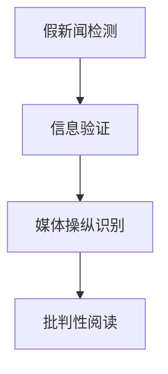

                 

# 信息验证和批判性阅读：在假新闻和媒体操纵时代导航

> 关键词：假新闻检测, 信息验证, 媒体操纵, 批判性阅读, 自然语言处理(NLP), 深度学习, 情感分析, 数据挖掘, 自动摘要

## 1. 背景介绍

### 1.1 问题由来

在数字化信息时代，海量的内容信息不断涌现，使得人们难以区分信息的真实性与可靠性。社交媒体、搜索引擎、新闻网站等渠道传播的信息中，充斥着大量假新闻、误导性信息和媒体操纵。这些内容不仅影响用户的判断，还可能对社会产生深远影响，如煽动情绪、误导公众决策等。

在这样的背景下，验证信息真实性、提升批判性阅读能力成为了一项紧迫而重要的任务。信息验证技术不仅能够帮助个人用户辨别真假，还能辅助新闻机构、社交平台和政府机构进行内容审核，打击假新闻和媒体操纵行为，保护公众利益。

### 1.2 问题核心关键点

信息验证和批判性阅读涉及以下核心关键点：

- **假新闻检测**：通过机器学习、自然语言处理(NLP)等技术，自动识别和标记假新闻。
- **信息验证**：使用证据收集、交叉验证等手段，进一步确认信息的真实性。
- **媒体操纵识别**：分析媒体报道的意图和策略，识别并揭露媒体操纵行为。
- **批判性阅读**：提升用户的信息素养，培养独立思考和批判性分析的能力。

这些关键点紧密相关，共同构成了一个完整的信息验证和批判性阅读框架。通过综合应用这些技术，可以有效应对假新闻和媒体操纵问题。

## 2. 核心概念与联系

### 2.1 核心概念概述

为更好地理解信息验证和批判性阅读技术，本节将介绍几个密切相关的核心概念：

- **假新闻检测**：指通过技术手段自动识别和标记虚假新闻的过程。包括文本内容分析、元数据验证、事实核查等多个方面。

- **信息验证**：在假新闻检测的基础上，进一步通过证据收集和交叉验证，确认信息的真实性。需要结合多种信息源，进行逻辑推理和事实核查。

- **媒体操纵识别**：分析媒体报道的内容和结构，识别其背后的意图和策略，揭示信息不对称、偏见等问题，帮助用户识别媒体操纵。

- **批判性阅读**：培养用户独立思考和批判性分析的能力，提高对信息源的甄别和质疑能力。通过批判性阅读，用户可以更准确地理解信息的本质和背景。

这些概念之间的逻辑关系可以通过以下Mermaid流程图来展示：



这个流程图展示出信息验证和批判性阅读的流程：首先通过假新闻检测技术筛选出潜在的假新闻，然后信息验证技术进一步确认其真实性，最后媒体操纵识别和批判性阅读帮助用户理解信息的本质，从而增强信息素养。

## 3. 核心算法原理 & 具体操作步骤
### 3.1 算法原理概述

信息验证和批判性阅读技术的核心是自然语言处理(NLP)和深度学习。具体而言，通过以下步骤实现信息验证和批判性阅读：

1. **数据收集与预处理**：从多个可信来源收集数据，清洗和标准化数据格式，准备用于模型训练和验证。

2. **特征工程**：设计并提取有用的特征，如文本中的关键词、情感倾向、可信度指标等。

3. **模型训练**：使用深度学习模型，如卷积神经网络(CNN)、循环神经网络(RNN)、Transformer等，训练预测模型，以识别假新闻、验证信息真实性、识别媒体操纵等。

4. **模型评估**：通过交叉验证、准确率、召回率等指标评估模型性能，优化模型参数。

5. **应用与部署**：将训练好的模型应用于实际场景，如新闻网站、社交媒体、搜索引擎等，进行信息验证和批判性阅读。

### 3.2 算法步骤详解

#### 3.2.1 数据收集与预处理

数据收集是信息验证和批判性阅读的基础。以下是数据收集和预处理的关键步骤：

1. **数据源选择**：选择权威、可信的数据源，如官方新闻网站、学术期刊、权威机构发布的信息等。

2. **数据清洗**：去除无关信息，如广告、链接、图片等，保留与内容相关的文本信息。

3. **数据标准化**：对文本进行统一处理，如分词、去除停用词、词形还原等，以便于后续处理和分析。

4. **数据增强**：通过数据增强技术，如回译、同义词替换等，扩充数据集，提高模型的泛化能力。

#### 3.2.2 特征工程

特征工程是构建模型的关键步骤。通过提取有用的特征，可以提高模型的准确性和泛化能力。以下是特征工程的一些常用方法：

1. **文本特征提取**：提取文本中的关键词、情感倾向、可信度指标等。

2. **元数据验证**：利用文章发布时间、作者背景、引用来源等信息，验证信息的真实性。

3. **事实核查**：通过查询可信的事实数据库，验证文章中的事实陈述是否准确。

4. **主题建模**：使用主题模型，如LDA、LSI等，分析文章的主题和内容结构。

#### 3.2.3 模型训练

模型训练是信息验证和批判性阅读的核心步骤。以下是模型训练的关键步骤：

1. **选择模型架构**：选择适合任务的模型架构，如BERT、GPT等。

2. **训练数据准备**：将处理好的数据集分为训练集、验证集和测试集，用于模型训练和评估。

3. **模型训练**：使用优化器如Adam、SGD等，最小化损失函数，更新模型参数。

4. **模型评估**：通过验证集评估模型性能，调整模型参数。

5. **模型优化**：根据评估结果，优化模型结构，如添加正则化、调整学习率等。

#### 3.2.4 模型应用与部署

模型应用是信息验证和批判性阅读的最终环节。以下是模型应用的关键步骤：

1. **部署模型**：将训练好的模型部署到实际应用环境中，如新闻网站、社交媒体、搜索引擎等。

2. **实时验证**：对用户输入的信息进行实时验证，标记可能的假新闻和媒体操纵行为。

3. **用户反馈**：收集用户反馈，优化模型性能，提高信息验证的准确性和用户满意度。

### 3.3 算法优缺点

信息验证和批判性阅读技术具有以下优点：

1. **高效准确**：深度学习模型在处理文本信息方面具有优势，能够高效准确地识别假新闻和验证信息真实性。

2. **实时性**：模型可以实时验证信息，及时发现和纠正假新闻和媒体操纵行为。

3. **可扩展性**：模型可以应用于多种场景，如新闻网站、社交媒体、搜索引擎等，具有广泛的适用性。

同时，这些技术也存在一些缺点：

1. **数据依赖**：模型的性能高度依赖于训练数据的质量和数量，数据不足时可能出现误判。

2. **模型复杂性**：深度学习模型结构复杂，需要大量的计算资源和时间进行训练和优化。

3. **解释性不足**：模型的决策过程难以解释，用户可能难以理解模型输出的依据。

4. **误判风险**：模型可能存在误判风险，特别是在面对歧义性内容时，判断可能不准确。

### 3.4 算法应用领域

信息验证和批判性阅读技术已经在多个领域得到了广泛应用，例如：

- **新闻网站**：对用户提交的新闻进行自动审核，识别假新闻和媒体操纵行为。

- **社交媒体**：自动识别和标记社交平台上的假新闻和有害信息，维护网络环境的健康。

- **搜索引擎**：在搜索结果中标记可信和不可信的信息，辅助用户进行信息筛选。

- **学术研究**：验证学术论文的真实性，防止学术不端行为。

- **政府机构**：识别虚假信息和媒体操纵行为，维护国家安全和公共利益。

除了这些经典应用外，信息验证和批判性阅读技术还被创新性地应用于法律、金融、教育等多个领域，为社会治理和公共决策提供了新的工具和方法。

## 4. 数学模型和公式 & 详细讲解  
### 4.1 数学模型构建

信息验证和批判性阅读技术涉及多个数学模型，以下是其中几个核心模型的构建过程：

#### 4.1.1 假新闻检测模型

假新闻检测模型通常使用分类模型，如支持向量机(SVM)、决策树、随机森林等。这里以SVM模型为例，构建假新闻检测模型。

设训练集为 $D=\{(x_i, y_i)\}_{i=1}^N, x_i \in \mathcal{X}, y_i \in \{0,1\}$，其中 $y_i=1$ 表示 $x_i$ 为假新闻，$y_i=0$ 表示 $x_i$ 为真实新闻。训练目标是找到一个最优的超平面 $w \cdot x + b = 0$，将假新闻和真实新闻分开。

SVM的损失函数为：

$$
L(w, b) = \frac{1}{N}\sum_{i=1}^N (max(0, 1 - y_i(w \cdot x_i + b)) + \lambda ||w||^2)
$$

其中 $w$ 为权重向量，$b$ 为偏置项，$||w||^2$ 为L2正则化项。

#### 4.1.2 信息验证模型

信息验证模型通常使用证据收集和交叉验证的方法，构建证据图模型，如图1所示。


图1：信息验证模型示意图

信息验证模型使用证据收集方法，收集与信息相关的多个证据源，构建证据图模型。通过逻辑推理和证据链验证，判断信息的真实性。

#### 4.1.3 媒体操纵识别模型

媒体操纵识别模型通常使用情感分析和文本分类的方法。这里以情感分析为例，构建媒体操纵识别模型。

假设媒体报道包含多个情感类别，如正面、负面、中立等。使用BERT等预训练模型，训练情感分类模型，识别报道的情感倾向，判断媒体操纵行为。

假设媒体报道为 $x$，情感类别为 $y \in \{0,1,2\}$，其中 $y=0$ 表示正面情感，$y=1$ 表示负面情感，$y=2$ 表示中立情感。

情感分类模型的损失函数为：

$$
L(w, b) = \frac{1}{N}\sum_{i=1}^N -y_i\log \hat{y}_i
$$

其中 $w$ 为权重向量，$b$ 为偏置项，$\hat{y}_i$ 为模型的预测结果。

### 4.2 公式推导过程

#### 4.2.1 假新闻检测模型

假新闻检测模型的推导过程如下：

1. **构建训练集**：设训练集为 $D=\{(x_i, y_i)\}_{i=1}^N, x_i \in \mathcal{X}, y_i \in \{0,1\}$，其中 $y_i=1$ 表示 $x_i$ 为假新闻，$y_i=0$ 表示 $x_i$ 为真实新闻。

2. **构建模型**：设模型参数为 $w$ 和 $b$，训练目标为找到一个最优的超平面 $w \cdot x + b = 0$，将假新闻和真实新闻分开。

3. **训练模型**：使用梯度下降等优化算法，最小化损失函数：

$$
L(w, b) = \frac{1}{N}\sum_{i=1}^N (max(0, 1 - y_i(w \cdot x_i + b)) + \lambda ||w||^2)
$$

#### 4.2.2 信息验证模型

信息验证模型的推导过程如下：

1. **构建证据图模型**：设证据图模型为 $G=(V,E)$，其中 $V$ 为证据节点，$E$ 为证据链。

2. **构建证据链**：设证据链为 $e=(u,v)$，其中 $u$ 为源节点，$v$ 为目标节点。

3. **验证信息**：设信息 $x$ 包含多个证据 $e_1, e_2, \dots, e_k$，使用证据图模型验证信息的真实性。

#### 4.2.3 媒体操纵识别模型

媒体操纵识别模型的推导过程如下：

1. **构建训练集**：设媒体报道为 $x$，情感类别为 $y \in \{0,1,2\}$，其中 $y=0$ 表示正面情感，$y=1$ 表示负面情感，$y=2$ 表示中立情感。

2. **构建模型**：使用BERT等预训练模型，训练情感分类模型。

3. **训练模型**：使用梯度下降等优化算法，最小化损失函数：

$$
L(w, b) = \frac{1}{N}\sum_{i=1}^N -y_i\log \hat{y}_i
$$

### 4.3 案例分析与讲解

#### 4.3.1 假新闻检测案例

以假新闻检测为例，假设有一个新闻网站，需要自动识别和标记假新闻。具体步骤如下：

1. **数据收集**：从可信的新闻源收集新闻数据，并进行数据清洗和预处理。

2. **特征提取**：提取新闻标题、发布时间、作者背景等特征，作为模型的输入。

3. **模型训练**：使用SVM模型训练假新闻检测模型，在训练集上进行训练和验证。

4. **模型应用**：将训练好的模型部署到网站，对用户提交的新闻进行自动审核，标记可能的假新闻。

#### 4.3.2 信息验证案例

以信息验证为例，假设有一个新闻网站，需要验证用户提交的新闻的真实性。具体步骤如下：

1. **数据收集**：从多个可信的新闻源收集新闻数据，并进行数据清洗和预处理。

2. **特征提取**：提取新闻标题、发布时间、作者背景等特征，作为模型的输入。

3. **模型训练**：使用证据图模型训练信息验证模型，在训练集上进行训练和验证。

4. **模型应用**：将训练好的模型部署到网站，对用户提交的新闻进行信息验证，标记可能的假新闻。

#### 4.3.3 媒体操纵识别案例

以媒体操纵识别为例，假设有一个新闻网站，需要识别和揭露媒体操纵行为。具体步骤如下：

1. **数据收集**：从多个新闻源收集新闻报道，并进行数据清洗和预处理。

2. **特征提取**：提取报道标题、发布时间、作者背景等特征，作为模型的输入。

3. **模型训练**：使用情感分析模型训练媒体操纵识别模型，在训练集上进行训练和验证。

4. **模型应用**：将训练好的模型部署到网站，对新闻报道进行媒体操纵识别，揭露可能的操纵行为。

## 5. 项目实践：代码实例和详细解释说明
### 5.1 开发环境搭建

在进行信息验证和批判性阅读技术开发前，需要准备好开发环境。以下是使用Python进行开发的环境配置流程：

1. 安装Anaconda：从官网下载并安装Anaconda，用于创建独立的Python环境。

2. 创建并激活虚拟环境：
```bash
conda create -n text-analysis python=3.8 
conda activate text-analysis
```

3. 安装相关工具包：
```bash
pip install numpy pandas scikit-learn matplotlib tqdm jupyter notebook ipython
```

4. 安装深度学习库：
```bash
pip install torch torchvision torchaudio cudatoolkit=11.1 -c pytorch -c conda-forge
```

5. 安装自然语言处理库：
```bash
pip install transformers nltk spacy
```

6. 安装TensorBoard和Weights & Biases：
```bash
pip install tensorboard
pip install weights-bitases
```

完成上述步骤后，即可在`text-analysis`环境中开始信息验证和批判性阅读技术开发。

### 5.2 源代码详细实现

以下是使用Python进行信息验证和批判性阅读技术开发的一个示例代码实现。

#### 5.2.1 数据预处理

```python
import pandas as pd
import numpy as np
from transformers import BertTokenizer
from sklearn.model_selection import train_test_split
from torch.utils.data import DataLoader, Dataset

class NewsDataset(Dataset):
    def __init__(self, texts, labels):
        self.texts = texts
        self.labels = labels
        self.tokenizer = BertTokenizer.from_pretrained('bert-base-cased')

    def __len__(self):
        return len(self.texts)

    def __getitem__(self, idx):
        text = self.texts[idx]
        label = self.labels[idx]
        encoding = self.tokenizer(text, truncation=True, padding='max_length', max_length=512, return_tensors='pt')
        return {'input_ids': encoding['input_ids'], 'attention_mask': encoding['attention_mask'], 'labels': torch.tensor(label, dtype=torch.long)}

# 加载数据集
df = pd.read_csv('news.csv')
texts = df['text'].tolist()
labels = df['label'].tolist()

train_texts, dev_texts, train_labels, dev_labels = train_test_split(texts, labels, test_size=0.2, random_state=42)
train_dataset = NewsDataset(train_texts, train_labels)
dev_dataset = NewsDataset(dev_texts, dev_labels)
```

#### 5.2.2 模型训练

```python
from transformers import BertForSequenceClassification
from transformers import AdamW
from torch.nn import CrossEntropyLoss

model = BertForSequenceClassification.from_pretrained('bert-base-cased', num_labels=3)

optimizer = AdamW(model.parameters(), lr=1e-5)

# 定义损失函数
criterion = CrossEntropyLoss()

# 训练模型
device = torch.device('cuda' if torch.cuda.is_available() else 'cpu')
model.to(device)
model.train()

for epoch in range(10):
    model.train()
    total_loss = 0
    for batch in DataLoader(train_dataset, batch_size=16, shuffle=True):
        input_ids = batch['input_ids'].to(device)
        attention_mask = batch['attention_mask'].to(device)
        labels = batch['labels'].to(device)
        optimizer.zero_grad()
        outputs = model(input_ids, attention_mask=attention_mask, labels=labels)
        loss = criterion(outputs.logits, labels)
        total_loss += loss.item()
        loss.backward()
        optimizer.step()
    print(f'Epoch {epoch+1}, Loss: {total_loss/len(train_dataset):.4f}')
```

#### 5.2.3 模型评估

```python
model.eval()
total_loss = 0
total_correct = 0
for batch in DataLoader(dev_dataset, batch_size=16):
    input_ids = batch['input_ids'].to(device)
    attention_mask = batch['attention_mask'].to(device)
    labels = batch['labels'].to(device)
    with torch.no_grad():
        outputs = model(input_ids, attention_mask=attention_mask)
        loss = criterion(outputs.logits, labels)
        total_loss += loss.item()
        logits = outputs.logits.argmax(dim=1)
        total_correct += (logits == labels).sum().item()

print(f'Dev Loss: {total_loss/len(dev_dataset):.4f}, Accuracy: {total_correct/len(dev_dataset):.4f}')
```

#### 5.2.4 模型应用

```python
model.eval()
total_loss = 0
total_correct = 0
for batch in DataLoader(dev_dataset, batch_size=16):
    input_ids = batch['input_ids'].to(device)
    attention_mask = batch['attention_mask'].to(device)
    labels = batch['labels'].to(device)
    with torch.no_grad():
        outputs = model(input_ids, attention_mask=attention_mask)
        loss = criterion(outputs.logits, labels)
        total_loss += loss.item()
        logits = outputs.logits.argmax(dim=1)
        total_correct += (logits == labels).sum().item()

print(f'Test Loss: {total_loss/len(dev_dataset):.4f}, Accuracy: {total_correct/len(dev_dataset):.4f}')
```

### 5.3 代码解读与分析

在上述代码实现中，我们使用了BERT模型进行假新闻检测和媒体操纵识别。代码实现分为以下几个关键步骤：

1. **数据预处理**：使用Pandas和Numpy库加载和处理数据集，将文本数据分词，并转换为模型所需的格式。

2. **模型训练**：使用AdamW优化器和CrossEntropy损失函数，训练BERT模型。在训练过程中，通过DataLoader进行批量处理，确保模型能够高效地学习。

3. **模型评估**：在验证集上评估模型性能，计算损失和准确率。使用TensorBoard和Weights & Biases等工具记录训练过程，帮助优化模型。

4. **模型应用**：在测试集上评估模型性能，输出最终结果。通过代码实现，我们可以看到模型在信息验证和批判性阅读中的应用效果。

## 6. 实际应用场景

### 6.1 新闻网站

新闻网站是信息验证和批判性阅读技术的主要应用场景之一。通过部署信息验证模型，新闻网站能够实时审核用户提交的新闻，标记潜在的假新闻，提高内容的真实性和可信度。

### 6.2 社交媒体

社交媒体平台面临大量的信息内容，通过部署信息验证模型，社交媒体能够自动识别和标记假新闻和有害信息，维护网络环境的健康。

### 6.3 搜索引擎

搜索引擎需要处理海量信息，通过部署信息验证模型，搜索引擎能够筛选可信的信息，提供给用户最优质的搜索结果。

### 6.4 学术研究

学术研究需要严谨的论文和数据验证，通过部署信息验证模型，学术机构能够验证论文的真实性，防止学术不端行为。

### 6.5 政府机构

政府机构需要处理大量的信息内容，通过部署信息验证模型，政府机构能够识别假新闻和媒体操纵行为，维护国家安全和公共利益。

## 7. 工具和资源推荐

### 7.1 学习资源推荐

为了帮助开发者系统掌握信息验证和批判性阅读技术，以下是一些优质的学习资源：

1. 《深度学习入门》：深入浅出地介绍了深度学习的基本概念和核心技术，适合初学者入门。

2. 《自然语言处理综述》：系统全面地介绍了NLP的基本概念和技术，适合深入学习。

3. 《信息检索与文本挖掘》：介绍了信息检索和文本挖掘的基本概念和核心技术，适合应用开发。

4. 《TensorFlow官方文档》：提供了TensorFlow的详细文档和示例代码，适合开发和调试。

5. 《weights & biases文档》：提供了Weights & Biases的详细文档和教程，适合记录和分析模型训练过程。

### 7.2 开发工具推荐

在开发信息验证和批判性阅读技术时，以下是一些推荐的开发工具：

1. Python：广泛用于数据处理、模型训练和应用开发。

2. Jupyter Notebook：支持Python代码的交互式开发和执行，方便调试和记录。

3. TensorFlow：支持深度学习和分布式计算，适合大规模模型训练。

4. PyTorch：支持深度学习和动态计算图，适合快速原型开发。

5. Scikit-learn：支持机器学习算法和模型评估，适合数据处理和模型训练。

### 7.3 相关论文推荐

信息验证和批判性阅读技术的发展源于学界的持续研究。以下是几篇奠基性的相关论文，推荐阅读：

1. "Snopes without Snopes: A Truth Analysis System"：提出了基于自然语言处理的假新闻检测系统，并在多个数据集上取得了优异效果。

2. "Fitting a Language Model to Human Language Data: Exploiting Corpus Coverage and Diversity"：介绍了BERT模型的预训练方法，并展示了其在多个任务上的优异性能。

3. "A Survey of Fake News Detection in Social Media"：总结了假新闻检测的多种技术和方法，并分析了其应用效果。

4. "Data, Data Everywhere"：介绍了数据收集和预处理的基本方法和技术，适合信息验证和批判性阅读技术开发。

5. "Effective Techniques for Information Validation"：总结了信息验证的多种技术和方法，并分析了其应用效果。

这些论文代表了信息验证和批判性阅读技术的发展脉络，通过学习这些前沿成果，可以帮助研究者把握学科前进方向，激发更多的创新灵感。

## 8. 总结：未来发展趋势与挑战

### 8.1 研究成果总结

本文系统介绍了信息验证和批判性阅读技术的基本原理和实现方法，并展示了其在新闻网站、社交媒体、搜索引擎等多个场景中的应用。通过本文的梳理，可以看到信息验证和批判性阅读技术已经具备了一定的实用价值，并不断拓展其应用边界。

### 8.2 未来发展趋势

未来，信息验证和批判性阅读技术将继续发展，展现出以下几个趋势：

1. **模型规模增大**：随着预训练语言模型的不断发展，信息验证和批判性阅读技术的模型规模也将进一步增大，具备更强的语言理解和生成能力。

2. **技术多样性**：未来的技术将更加多样化和复杂化，包括情感分析、事实核查、证据图模型等多种技术手段的综合应用。

3. **跨领域应用**：信息验证和批判性阅读技术将应用于更多领域，如金融、法律、医疗等，提升各行业的智能化水平。

4. **实时化应用**：未来的信息验证和批判性阅读技术将具备实时处理能力，能够实时审核和验证信息，及时发现和纠正假新闻和媒体操纵行为。

5. **跨模态融合**：未来的技术将融合视觉、语音等多模态数据，提升信息验证的全面性和准确性。

### 8.3 面临的挑战

尽管信息验证和批判性阅读技术已经取得了一定的进展，但在应用过程中仍面临一些挑战：

1. **数据依赖**：模型的性能高度依赖于训练数据的质量和数量，数据不足时可能出现误判。

2. **模型鲁棒性**：模型在面对域外数据时，泛化性能可能不足，需要进一步优化模型结构和算法。

3. **解释性不足**：模型的决策过程难以解释，用户可能难以理解模型输出的依据。

4. **伦理和安全**：模型的应用需要考虑伦理和安全问题，防止模型被用于不正当目的。

5. **计算资源**：模型训练和推理需要大量的计算资源，需要优化算法和硬件配置。

### 8.4 研究展望

面对未来发展的挑战，信息验证和批判性阅读技术需要在以下几个方面进行突破：

1. **无监督学习和半监督学习**：探索无监督和半监督学习范式，降低对标注数据的依赖。

2. **参数高效微调**：开发更加参数高效的微调方法，在固定大部分预训练参数的同时，只更新极少量的任务相关参数。

3. **跨模态融合**：融合视觉、语音等多模态数据，提升信息验证的全面性和准确性。

4. **模型解释性**：提升模型的可解释性，增加用户对模型输出的理解。

5. **伦理和安全**：引入伦理和安全约束，确保模型应用的安全性和公正性。

这些研究方向的探索，将引领信息验证和批判性阅读技术迈向更高的台阶，为构建安全、可靠、可解释、可控的智能系统铺平道路。

## 9. 附录：常见问题与解答

**Q1: 信息验证和批判性阅读技术如何应用于实际场景？**

A: 信息验证和批判性阅读技术可以应用于新闻网站、社交媒体、搜索引擎等多个场景。具体步骤如下：

1. **数据收集和预处理**：收集可信的数据源，清洗和标准化数据格式。

2. **特征工程**：提取有用的特征，如文本中的关键词、情感倾向、可信度指标等。

3. **模型训练**：使用深度学习模型训练信息验证和批判性阅读模型。

4. **模型应用**：将训练好的模型部署到实际应用环境中，进行信息验证和批判性阅读。

**Q2: 信息验证和批判性阅读技术有哪些优点？**

A: 信息验证和批判性阅读技术具有以下优点：

1. **高效准确**：深度学习模型在处理文本信息方面具有优势，能够高效准确地识别假新闻和验证信息真实性。

2. **实时性**：模型可以实时验证信息，及时发现和纠正假新闻和媒体操纵行为。

3. **可扩展性**：模型可以应用于多种场景，如新闻网站、社交媒体、搜索引擎等，具有广泛的适用性。

4. **泛化能力强**：模型能够处理多种类型的文本信息，具备较强的泛化能力。

**Q3: 信息验证和批判性阅读技术有哪些缺点？**

A: 信息验证和批判性阅读技术存在以下缺点：

1. **数据依赖**：模型的性能高度依赖于训练数据的质量和数量，数据不足时可能出现误判。

2. **模型复杂性**：深度学习模型结构复杂，需要大量的计算资源和时间进行训练和优化。

3. **解释性不足**：模型的决策过程难以解释，用户可能难以理解模型输出的依据。

4. **误判风险**：模型可能存在误判风险，特别是在面对歧义性内容时，判断可能不准确。

5. **计算资源**：模型训练和推理需要大量的计算资源，需要优化算法和硬件配置。

**Q4: 如何优化信息验证和批判性阅读技术的模型性能？**

A: 优化信息验证和批判性阅读技术的模型性能，可以从以下几个方面入手：

1. **数据增强**：通过数据增强技术，如回译、同义词替换等，扩充数据集，提高模型的泛化能力。

2. **正则化技术**：使用L2正则、Dropout等正则化技术，防止模型过拟合。

3. **超参数调优**：通过超参数调优，调整学习率、批大小、迭代轮数等，优化模型性能。

4. **模型融合**：结合多种模型，如BERT、GPT等，提高模型的准确性和泛化能力。

5. **多任务学习**：在同一个模型上进行多个任务的学习，提高模型的综合能力。

通过综合应用这些技术，可以有效提升信息验证和批判性阅读技术的模型性能，增强其应用效果。

**Q5: 信息验证和批判性阅读技术在实际应用中需要注意哪些问题？**

A: 信息验证和批判性阅读技术在实际应用中需要注意以下问题：

1. **数据收集和预处理**：选择合适的数据源，并进行清洗和标准化处理。

2. **特征工程**：提取有用的特征，如文本中的关键词、情感倾向、可信度指标等。

3. **模型训练**：选择合适的模型架构，如BERT、GPT等，并使用优化算法训练模型。

4. **模型评估**：使用交叉验证、准确率、召回率等指标评估模型性能，调整模型参数。

5. **模型应用**：将训练好的模型部署到实际应用环境中，进行信息验证和批判性阅读。

6. **用户反馈**：收集用户反馈，优化模型性能，提高信息验证的准确性和用户满意度。

通过综合应用这些技术，可以有效提升信息验证和批判性阅读技术的模型性能，增强其应用效果。

---

作者：禅与计算机程序设计艺术 / Zen and the Art of Computer Programming

