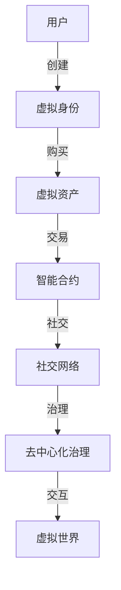

                 

# 元宇宙中的虚拟社区：全球社交网络的新形态

> 关键词：元宇宙,虚拟社区,社交网络,区块链技术,Web3.0,去中心化,数字身份,社会形态,网络治理,用户赋能

## 1. 背景介绍

### 1.1 元宇宙概念与趋势

元宇宙（Metaverse），一个将互联网、人工智能、区块链、虚拟现实等多种技术的高度融合，旨在构建一个跨越物理与数字世界的虚拟世界。元宇宙的设想起源于科幻作品，但随着科技的进步和用户需求的增长，这一概念正逐步从科幻走向现实。

近年来，元宇宙呈现出迅猛发展的态势。**2021** 年，多家知名企业积极入局，如 **Facebook** 宣布更名为 **Meta** ，并投入大量资源发展元宇宙业务。苹果、微软、英伟达等科技巨头也纷纷推出相关产品和技术。此外，**Roblox** 和 **Decentraland** 等平台成功上市，进一步证明了元宇宙的商业模式和生态系统的可行性。

元宇宙以沉浸式体验、高度互动性和跨平台性为特点，有望彻底改变人类的社交、工作、学习、娱乐等各个方面。元宇宙不仅是虚拟现实世界的建设，更代表着一种全新的社交网络形态，将重塑人类的社会关系和互动方式。

### 1.2 元宇宙的核心驱动力

元宇宙的核心驱动力在于以下几方面：

- **技术创新**：**AI**、**VR/AR**、**区块链**、**物联网** 等技术的多元融合，使得虚拟世界更加逼真、互动和智能。
- **社会需求**：疫情的推动下，人们迫切需要一种新的社交方式来满足日益增长的交互需求。
- **经济激励**：**NFT**、**加密货币**等经济激励机制，驱动用户在元宇宙内进行交易、创造和消费。
- **文化创新**：元宇宙提供了一个开放的平台，鼓励用户进行大胆的创意和探索。

## 2. 核心概念与联系

### 2.1 核心概念概述

元宇宙中的虚拟社区，即建立在元宇宙平台上的社交网络。这些社区通过虚拟世界构建高度互动的社交环境，支持用户在虚拟空间内进行社交、创作、交易、娱乐等多维活动。虚拟社区的核心概念包括：

- **虚拟身份**：用户在虚拟世界中的唯一身份标识，与现实世界身份相对应。
- **虚拟资产**：用户在虚拟社区内所创建或购买的虚拟物品、艺术作品等。
- **虚拟经济**：基于区块链技术的经济体系，支持虚拟货币、NFT等数字资产的流通和交换。
- **社交网络**：虚拟社区内的用户关系网，通过好友、群组、论坛等形式实现互动。
- **智能合约**：用于自动执行和监督数字资产交易的编程合约，保证交易的安全性和透明性。
- **去中心化治理**：社区成员共同参与决策和治理，提升透明度和民主性。

这些概念通过区块链、Web3.0、去中心化身份等前沿技术的支撑，形成一个完整的虚拟生态系统。用户在其中不仅可以沉浸式体验虚拟世界，还能进行真正的社会互动和数字经济活动。

### 2.2 核心概念原理和架构的 Mermaid 流程图



## 3. 核心算法原理 & 具体操作步骤

### 3.1 算法原理概述

元宇宙中虚拟社区的构建，依赖于一系列关键算法和技术：

- **区块链算法**：保障虚拟资产的流转安全、透明，保证社区的去中心化治理。
- **分布式计算**：支持大规模的虚拟世界渲染和实时互动。
- **数字身份认证**：利用公钥加密、零知识证明等技术，实现用户身份的验证和匿名性保护。
- **交互协议**：定义用户之间的交互规则和行为规范，保证虚拟社区的稳定和秩序。
- **共识机制**：保障社区内的集体决策和交易安全性，如PoW、PoS、DPoS等。

### 3.2 算法步骤详解

1. **身份认证**：用户通过去中心化身份认证系统，生成自己的虚拟身份，包括身份证明、隐私信息和数字证书。

2. **资产创造**：用户创建或购买虚拟资产，包括NFT、虚拟货币、虚拟物品等。

3. **社交网络构建**：用户通过好友、群组、论坛等功能，构建自己的社交关系网，实现互动和交流。

4. **虚拟经济运作**：用户参与虚拟经济活动，如交易、投资、创建等，并通过智能合约保障交易的安全性和透明性。

5. **社区治理**：社区成员参与决策和治理，通过投票机制、代币激励等手段，共同制定社区规则和政策。

6. **智能合约执行**：智能合约自动执行社区内的各项交易和活动，确保规则的有效执行和监督。

### 3.3 算法优缺点

#### 优点

- **去中心化**：所有用户平等参与，降低信任成本，提升安全性。
- **开放性**：任何人都可以在虚拟社区中自由创造和交流，激发更多创新。
- **跨平台性**：支持多种设备和平台，增加用户粘性。
- **经济激励**：虚拟经济体系激励用户参与，提升社区活力。

#### 缺点

- **隐私保护**：虚拟社区对用户的隐私保护面临挑战，数据安全和隐私保护需重点考虑。
- **技术门槛**：元宇宙的构建和运营需要高水平的技术支持和资金投入。
- **监管挑战**：虚拟社区的复杂性和跨界性，带来监管和法律的难题。
- **用户体验**：技术瓶颈如延迟、卡顿等问题，可能影响用户体验。

### 3.4 算法应用领域

元宇宙中的虚拟社区技术，已在多个领域得到应用：

- **游戏与娱乐**：如 **Roblox**、**Snowball**、**Vivox** 等平台，用户可以创建虚拟物品，进行互动游戏和社交。
- **教育与培训**：利用虚拟教室和虚拟实验，提供沉浸式学习体验，如 **EduSlate**、**Katana Learning** 等。
- **商业与营销**：企业通过元宇宙进行品牌推广、虚拟展会和虚拟商品销售，如 **The Sandbox**、**Decentraland** 等。
- **虚拟办公与会议**：通过虚拟会议和办公环境，提升工作效率，如 **Microsoft Mesh**、**NearVR** 等。

## 4. 数学模型和公式 & 详细讲解 & 举例说明

### 4.1 数学模型构建

元宇宙中的虚拟社区，涉及多个复杂系统的协同运作。这里，我们以区块链系统的核心部分——**智能合约**为例，进行数学模型的构建。

智能合约是一种自动执行、去中心化的代码合约，可以确保在一定条件下执行特定操作。典型的智能合约模型包括以下几部分：

- **条件判断**：判断当前状态是否满足合约执行条件。
- **逻辑执行**：根据合约逻辑执行相应的操作。
- **资产转移**：实现数字资产的转移和分配。
- **状态更新**：记录合约的执行过程和结果。

### 4.2 公式推导过程

以**NFT**交易为例，智能合约的执行过程可以简化为以下公式：

$$
\text{Transfer}(\text{Buyer}, \text{Seller}, \text{NFT}, \text{Price}) = \begin{cases}
\text{Transfer NFT from Seller to Buyer} & \text{if } \text{Price} = \text{Seller's Bid} \\
\text{Fail} & \text{otherwise}
\end{cases}
$$

其中，`Buyer` 和 `Seller` 分别是买家和卖家，`NFT` 代表非同质化资产，`Price` 表示交易价格。当买家出价等于卖家设置的最低价时，合约执行 `Transfer NFT from Seller to Buyer` 操作。

### 4.3 案例分析与讲解

**案例一**：**Roblox** 中的虚拟经济系统。Roblox 平台允许用户创建、购买和销售虚拟资产，如服装、道具和建筑。通过智能合约，用户可以自由交易，保障交易的透明性和安全性。

**案例二**：**Decentraland** 中的土地拍卖。用户可以通过智能合约参与土地竞拍，自动记录拍卖结果，并转移土地所有权。这一过程完全去中心化，减少了中间环节和成本。

## 5. 项目实践：代码实例和详细解释说明

### 5.1 开发环境搭建

**工具链搭建**：
1. **Python** 3.8+：用于编程语言。
2. **Solidity**：用于智能合约编程语言。
3. **Truffle Suite**：开发框架，提供IDE和测试工具。
4. **Ganache**：本地区块链测试环境。
5. **MyEtherWallet**：支持加密货币的钱包。

**开发环境配置**：
1. 安装 **Python** 和 **Solidity** 工具链。
2. 创建 Truffle 项目，编写智能合约。
3. 在 Ganache 中运行测试网，模拟交易过程。
4. 使用 MyEtherWallet 创建和管理钱包。

### 5.2 源代码详细实现

以下是一个简单的智能合约示例，实现虚拟物品的买卖功能。

**示例代码**：
```solidity
// SPDX-License-Identifier: MIT
pragma solidity ^0.8.0;

contract ItemMarket {
    uint256 public itemID;
    address public buyer;
    uint256 public price;
    bool public sold;
    
    constructor(uint256 _itemID, uint256 _price) {
        itemID = _itemID;
        price = _price;
        buyer = address(0);
        sold = false;
    }
    
    function buy(uint256 _buyer, uint256 _newPrice) public payable {
        require(msg.value == _newPrice, "Invalid price");
        require(sold == false, "Item already sold");
        buyer = _buyer;
        sold = true;
    }
}
```

**代码解释**：
- **`constructor`**：初始化智能合约，记录物品ID、初始价格和买家地址。
- **`buy`**：买家支付指定价格后，智能合约记录买家信息，将物品标记为已售。

### 5.3 代码解读与分析

**代码结构**：
- **模块化设计**：智能合约分为初始化和交易两部分，便于维护和扩展。
- **事件驱动**：`buy` 函数触发事件，记录买卖信息。
- **条件判断**：确保价格和状态满足交易要求。
- **资产转移**：实际转移物品所有权和资金。

**代码优化**：
- **安全约束**：使用 `require` 语句进行安全约束，防止异常交易。
- **异常处理**：添加异常处理机制，提升合约的健壮性。
- **可扩展性**：预留可扩展接口，便于未来功能升级。

### 5.4 运行结果展示

**测试环境**：
在 Ganache 环境中，部署智能合约，并进行如下测试：
1. 创建智能合约实例，记录初始化信息。
2. 测试购买功能，成功转移物品所有权和资金。
3. 检查交易记录，验证交易结果。

**测试结果**：
- **部署成功**：智能合约成功部署到测试网络。
- **交易验证**：测试购买功能，记录买家信息，转移物品和资金。
- **数据查看**：查看智能合约状态，确认物品和资金已转移。

## 6. 实际应用场景

### 6.1 虚拟社区在元宇宙中的应用

**虚拟社交平台**：如 **Vivox**、**Microsoft Mesh**，用户通过虚拟身份参与互动和交流，进行游戏、教育、娱乐等多维活动。

**虚拟办公环境**：如 **Workbench**、**NextGen Office**，用户可以在虚拟空间中进行虚拟会议、远程办公，提升工作效率。

**虚拟旅游与展览**：如 **VR旅**、**Blue Horizon**，用户可以在虚拟环境中游览名胜古迹，参与虚拟展会和活动。

**虚拟金融市场**：如 **Metaverse Finance**、**The Sandbox**，用户可以参与虚拟金融交易、投资等活动。

### 6.2 未来应用展望

随着元宇宙的不断发展，虚拟社区将迎来更多创新应用：

- **全息互动**：利用 **AR/VR** 技术，提供更加沉浸式的社交体验。
- **实时协作**：支持多用户实时协作和创作，如 **Google Meet** 在元宇宙中的升级版。
- **跨平台整合**：实现不同平台间的无缝互通，提升用户粘性。
- **虚拟经济扩展**：引入更多金融工具和市场机制，拓展虚拟经济的规模。
- **数据隐私保护**：提升数据安全和隐私保护措施，增强用户信任。

## 7. 工具和资源推荐

### 7.1 学习资源推荐

1. **《元宇宙入门：理解虚拟世界的未来》**：介绍元宇宙的基本概念、技术和应用，适合入门学习。
2. **《Web3.0开发实战》**：涵盖区块链、智能合约、加密货币等技术，提供实战案例。
3. **《区块链技术基础》**：全面讲解区块链的基本原理和应用，适合深入学习。
4. **《元宇宙研究报告》**：由知名研究机构发布的元宇宙研究报告，分析行业动态和趋势。

### 7.2 开发工具推荐

1. **Truffle Suite**：智能合约开发框架，支持IDE和测试工具。
2. **Ganache**：本地区块链测试环境，便于开发和测试智能合约。
3. **Remix IDE**：Solidity代码编辑器，支持智能合约的编写、测试和部署。
4. **MyEtherWallet**：加密货币钱包，支持多种链和代币的生成和管理。

### 7.3 相关论文推荐

1. **《元宇宙：虚拟世界的技术体系与未来展望》**：探讨元宇宙的基本原理和关键技术。
2. **《区块链技术在元宇宙中的应用》**：分析区块链技术在元宇宙中的重要性和应用场景。
3. **《Web3.0技术在虚拟社区中的应用》**：讨论Web3.0技术在虚拟社区构建中的价值和实现方法。
4. **《元宇宙中社交网络的研究与实践》**：介绍元宇宙社交网络的技术架构和实现细节。

## 8. 总结：未来发展趋势与挑战

### 8.1 研究成果总结

元宇宙中的虚拟社区，代表了未来社交网络的发展方向。通过区块链、Web3.0、去中心化身份等前沿技术，构建了一个开放、互动、安全的虚拟生态系统，为用户的沉浸式体验和互动提供了无限可能。

### 8.2 未来发展趋势

- **技术融合**：元宇宙技术不断融合，提升虚拟社区的性能和体验。
- **经济体系**：虚拟经济体系更加成熟，促进更多商业和社交活动。
- **多模态交互**：利用多种交互方式，提升虚拟社区的互动性和沉浸感。
- **社会影响**：虚拟社区对社会关系和行为模式的深远影响。
- **法律与监管**：建立健全的法律法规和监管机制，保障虚拟社区的健康发展。

### 8.3 面临的挑战

- **技术难题**：元宇宙技术的高复杂性和多领域融合，带来开发和维护的挑战。
- **隐私保护**：虚拟社区对用户隐私保护的要求更高，需要更严格的数据安全和隐私保护措施。
- **市场竞争**：元宇宙市场竞争激烈，需要持续创新和差异化竞争策略。
- **用户教育**：提升用户对元宇宙的理解和使用能力，培养更多忠实用户。

### 8.4 研究展望

- **隐私保护技术**：研究更强的隐私保护算法和加密技术，确保数据安全和用户隐私。
- **跨平台技术**：开发跨平台的技术标准和协议，实现不同设备间的无缝互通。
- **智能合约优化**：提升智能合约的效率和安全性，降低开发和维护成本。
- **社区治理机制**：研究更有效的社区治理和用户赋能机制，提升社区自治能力。

## 9. 附录：常见问题与解答

**Q1: 什么是元宇宙？**

A: 元宇宙是一个融合了多种技术的虚拟世界，用户可以在其中进行互动和创作，提供沉浸式体验。

**Q2: 如何创建虚拟社区？**

A: 需要选择合适的平台，如 **Roblox**、**The Sandbox** 等，并按照平台的要求进行创建和运营。

**Q3: 智能合约在元宇宙中的应用场景有哪些？**

A: 智能合约在元宇宙中可以用于虚拟资产的流转、社区治理、经济活动等多个场景。

**Q4: 如何确保元宇宙社区的安全性？**

A: 需要采用区块链、加密技术等手段，保护数据和交易的安全性，同时建立完善的社区治理机制。

**Q5: 元宇宙技术目前存在哪些挑战？**

A: 包括技术复杂性、隐私保护、市场竞争、用户教育等多个方面，需要多方协同努力，逐步解决。

---

作者：禅与计算机程序设计艺术 / Zen and the Art of Computer Programming

