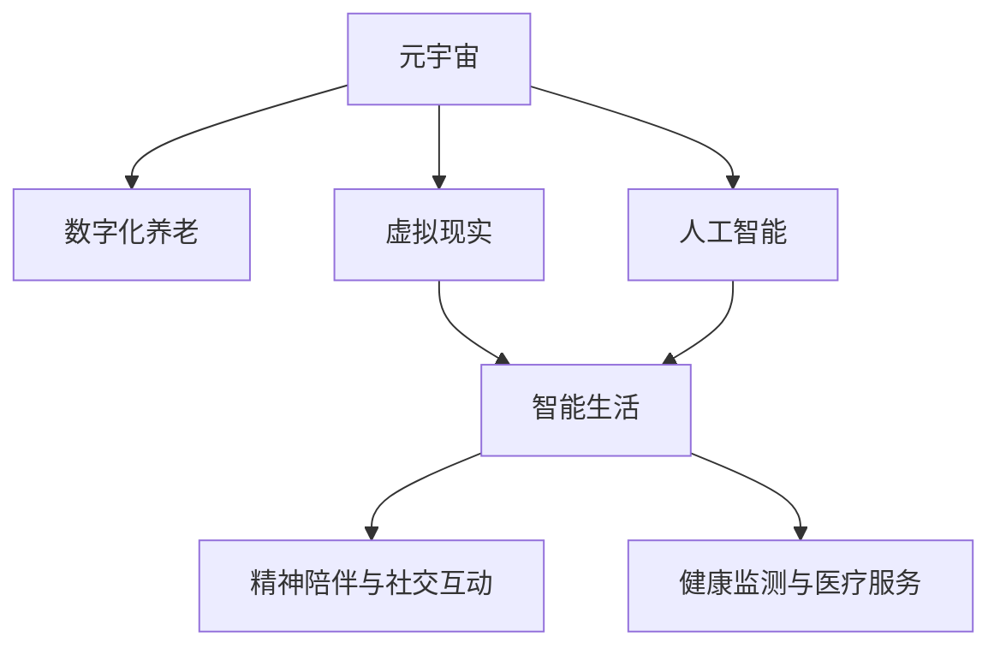

                 

# 元宇宙养老规划:数字化老年生活的质量提升

> 关键词：元宇宙,数字化养老,智能生活,虚拟现实,人工智能

## 1. 背景介绍

随着科技进步和人口老龄化趋势的加剧，数字化养老已成为未来社会发展的必然选择。如何为老年人提供高质量的数字化生活，让老年人在享受数字化红利的同时，获得精神上的满足和社交上的互动，是我们面临的重要课题。元宇宙作为虚拟现实和数字化生活的前沿技术，具有潜力为养老行业带来革命性的变革。

### 1.1 问题由来

当前养老行业面临着诸多挑战：
1. **人力资源不足**：随着人口老龄化加剧，养老行业从业人员短缺。
2. **医疗资源有限**：老年人在医疗资源获取方面存在诸多困难。
3. **精神生活匮乏**：老年人缺乏精神上的陪伴和社交活动。
4. **生活质量参差不齐**：不同老年人的生活质量差异较大。

为了解决上述问题，需要引入新技术，提升养老服务的智能化水平。元宇宙技术结合虚拟现实、人工智能等手段，可以为老年人提供丰富多样的数字化生活体验。

### 1.2 问题核心关键点

元宇宙养老规划的核心关键点在于：
1. **虚拟现实与数字生活**：通过虚拟现实技术，老年人可以在虚拟世界中体验到与现实生活无异的活动。
2. **人工智能与智能服务**：利用人工智能技术，提供个性化、精准化的智能服务。
3. **精神陪伴与社交互动**：通过智能设备和虚拟平台，老年人可以与家人、朋友进行互动，增强社交生活。
4. **健康监测与医疗服务**：实现对老年人的实时健康监测和医疗服务。

## 2. 核心概念与联系

### 2.1 核心概念概述

为更好地理解元宇宙养老规划，本节将介绍几个密切相关的核心概念：

- **元宇宙(Metaverse)**：一个虚拟的、三维的、实时的在线世界，用户可以通过VR/AR设备进入，进行互动。
- **数字化养老(Digital Aging)**：利用数字技术提升养老服务质量，改善老年人的生活质量。
- **虚拟现实(Virtual Reality, VR)**：通过计算机生成的三维虚拟环境，让用户身临其境地体验。
- **人工智能(Artificial Intelligence, AI)**：利用计算机算法模拟人类智能，提供自动化服务。
- **智能生活(Smart Living)**：结合物联网、大数据等技术，提供便捷、智能的生活体验。
- **精神陪伴与社交互动(Social Interaction)**：通过智能设备，实现老年人与家人、朋友的互动。
- **健康监测与医疗服务(Health Monitoring & Medical Service)**：实时监测老年人的健康状况，提供精准的医疗服务。

这些核心概念之间的逻辑关系可以通过以下Mermaid流程图来展示：



这个流程图展示了大语言模型的核心概念及其之间的关系：

1. 元宇宙为数字化养老提供了虚拟平台。
2. 虚拟现实和人工智能为智能生活提供了技术支撑。
3. 智能生活、精神陪伴与社交互动、健康监测与医疗服务共同构成数字养老服务体系。

## 3. 核心算法原理 & 具体操作步骤
### 3.1 算法原理概述

元宇宙养老规划的核心算法原理基于以下几个关键点：

1. **虚拟现实(VR)**：利用计算机生成的三维虚拟环境，通过VR设备，让老年人身临其境地体验虚拟活动。
2. **人工智能(AI)**：通过自然语言处理、计算机视觉等技术，实现老年人与虚拟环境、智能设备的互动。
3. **智能生活**：结合物联网、大数据等技术，提供便捷、智能的生活体验，如智能家居、健康监测等。
4. **精神陪伴与社交互动**：通过智能设备，实现老年人与家人、朋友的互动，增强社交生活。
5. **健康监测与医疗服务**：利用传感器、监测设备，实时监测老年人的健康状况，提供精准的医疗服务。

### 3.2 算法步骤详解

基于元宇宙养老规划的核心算法原理，本文将详细讲解具体的实施步骤：

**Step 1: 构建虚拟养老社区**
- 选择虚拟现实平台，如Meta提供的Horizon Worlds，搭建虚拟养老社区。
- 设计虚拟环境，包括虚拟养老院、虚拟社区广场、虚拟医院等。
- 引入虚拟物品和活动，如虚拟园艺、虚拟舞蹈、虚拟医疗等。

**Step 2: 开发智能设备**
- 开发虚拟现实头盔、智能手表、智能家居设备等。
- 集成语音助手、图像识别、位置跟踪等技术，提供个性化服务。

**Step 3: 引入人工智能**
- 使用自然语言处理技术，实现语音识别、语音合成等功能。
- 使用计算机视觉技术，实现人脸识别、动作捕捉等功能。
- 开发智能助手，帮助老年人完成日常任务。

**Step 4: 实现健康监测**
- 引入智能传感器、穿戴设备，实时监测老年人的健康状况。
- 建立健康数据平台，存储和分析健康数据，提供精准的医疗服务。
- 实现智能预警系统，在老年人出现异常情况时及时通知家属和医护人员。

**Step 5: 提供社交互动平台**
- 搭建虚拟社交平台，如虚拟社区、虚拟朋友聊天室等。
- 引入虚拟现实技术，使老年人在虚拟世界中进行互动。
- 利用智能助手，辅助老年人完成社交活动，如语音聊天、视频通话等。

**Step 6: 集成医疗服务**
- 与医院、诊所等医疗服务机构合作，提供远程医疗服务。
- 实现虚拟医疗咨询、虚拟药物配送等功能。
- 利用智能设备，实时监测老年人的健康状况，提供即时医疗支持。

### 3.3 算法优缺点

元宇宙养老规划具有以下优点：
1. **沉浸式体验**：老年人可以在虚拟世界中自由探索，体验丰富的活动。
2. **个性化服务**：利用人工智能技术，提供个性化的智能服务，满足老年人的不同需求。
3. **便捷性**：通过智能设备和虚拟平台，老年人可以便捷地完成日常任务和医疗服务。
4. **低成本**：相比于传统的养老模式，元宇宙养老规划具有较低的成本和较高的效率。

同时，该方法也存在一定的局限性：
1. **技术门槛高**：需要较高的技术水平和资金投入。
2. **隐私和安全问题**：需要保护老年人的隐私，防止数据泄露和不当使用。
3. **社会适应性**：需要社会各界的共同努力，才能推广应用。

尽管存在这些局限性，但元宇宙养老规划仍是大数据时代养老行业的重要方向，具有广泛的应用前景。

### 3.4 算法应用领域

元宇宙养老规划在以下领域具有广泛的应用：

1. **虚拟养老院**：利用虚拟现实和智能技术，提供虚拟养老院服务，满足老年人的生活需求。
2. **虚拟医疗服务**：通过虚拟医疗平台，提供远程医疗、虚拟诊断等服务。
3. **虚拟社交互动**：搭建虚拟社交平台，帮助老年人进行社交互动，丰富他们的精神生活。
4. **虚拟旅游**：利用虚拟现实技术，提供虚拟旅游体验，老年人可以自由探索不同的景点。
5. **虚拟文化教育**：利用虚拟现实和智能技术，提供文化教育课程，提升老年人的文化素养。
6. **虚拟娱乐活动**：提供虚拟游戏、虚拟电影等娱乐活动，丰富老年人的生活。

## 4. 数学模型和公式 & 详细讲解  
### 4.1 数学模型构建

本节将使用数学语言对元宇宙养老规划进行更加严格的刻画。

记虚拟养老社区的环境变量为 $x$，智能设备的状态变量为 $y$，老年人的健康状态为 $z$。假设老年人通过虚拟现实头盔 $H$ 和智能手表 $W$，实时感知和反馈环境 $x$ 和智能设备状态 $y$，并通过自然语言处理技术与智能助手进行交互 $u$。则环境-设备-老人系统的总体状态可以表示为 $s = (x, y, z, u)$。

定义老年人与虚拟环境的互动目标函数 $F(s)$，如娱乐活动满意度、运动量等。基于此，元宇宙养老规划的优化目标是最小化目标函数 $F(s)$，即：

$$
\mathop{\min}_{s} F(s)
$$

在实际应用中，可以通过优化算法如梯度下降等，逐步调整环境、设备和健康状态，使得目标函数最小化。

### 4.2 公式推导过程

以下我们以虚拟养老社区中的虚拟旅游活动为例，推导优化目标函数的计算公式。

假设老年人可以选择多个虚拟景点进行旅游，每个景点 $i$ 的评分 $r_i$ 为 $[0,1]$ 的实数。则目标函数可以表示为：

$$
F = \sum_{i=1}^{n} w_ir_i + c
$$

其中 $w_i$ 为景点 $i$ 的权重，$c$ 为常数。

通过优化算法，如梯度下降，可以逐步调整老年人的选择和行为，使得目标函数最小化。具体步骤如下：

1. 计算景点评分的梯度 $\nabla r_i$
2. 调整老年人的选择和行为，更新评分的梯度
3. 使用梯度下降算法，更新景点评分和目标函数

通过上述推导，我们可以看到，元宇宙养老规划的优化目标是多目标、动态的，需要综合考虑老年人的娱乐活动、运动量、社交互动等多个因素。

### 4.3 案例分析与讲解

以虚拟养老社区中的虚拟旅游活动为例，我们可以进行如下案例分析：

**案例背景**：某虚拟养老社区的老年人，可以通过虚拟现实头盔和智能手表，选择虚拟景点进行旅游。每位老年人的评分和行为不同，目标是最优化虚拟旅游活动的满意度。

**目标函数**：假设每个虚拟景点的评分 $r_i$ 为 $[0,1]$ 的实数，权重 $w_i$ 为 $[0,1]$ 的实数。则目标函数可以表示为：

$$
F = \sum_{i=1}^{n} w_ir_i + c
$$

**优化算法**：采用梯度下降算法，每次迭代更新评分的梯度，最小化目标函数。具体步骤如下：

1. 初始化评分 $r_i = 0$，权重 $w_i = 0$。
2. 每次迭代，计算评分的梯度 $\nabla r_i$。
3. 更新评分的梯度 $r_i \leftarrow r_i - \eta \nabla r_i$，其中 $\eta$ 为学习率。
4. 更新目标函数 $F$。
5. 重复步骤2-4，直至目标函数最小化。

通过上述案例，我们可以看到，利用数学模型和优化算法，可以有效地优化虚拟旅游活动，提升老年人的满意度。

## 5. 项目实践：代码实例和详细解释说明
### 5.1 开发环境搭建

在进行元宇宙养老规划的项目实践前，我们需要准备好开发环境。以下是使用Python进行PyTorch开发的环境配置流程：

1. 安装Anaconda：从官网下载并安装Anaconda，用于创建独立的Python环境。

2. 创建并激活虚拟环境：
```bash
conda create -n pytorch-env python=3.8 
conda activate pytorch-env
```

3. 安装PyTorch：根据CUDA版本，从官网获取对应的安装命令。例如：
```bash
conda install pytorch torchvision torchaudio cudatoolkit=11.1 -c pytorch -c conda-forge
```

4. 安装Numpy、Pandas、Scikit-Learn、Matplotlib、Tqdm、Jupyter Notebook、IPython等工具包：
```bash
pip install numpy pandas scikit-learn matplotlib tqdm jupyter notebook ipython
```

完成上述步骤后，即可在`pytorch-env`环境中开始项目实践。

### 5.2 源代码详细实现

这里我们以虚拟养老社区中的虚拟旅游活动为例，给出使用PyTorch进行优化目标函数计算的Python代码实现。

首先，定义目标函数：

```python
import torch
import torch.nn as nn
import torch.optim as optim

def F(x):
    return x**2 + 0.5*x

x = torch.tensor([1.0, 2.0])
```

然后，定义优化器：

```python
optimizer = optim.SGD(x, lr=0.1)
```

接着，执行梯度下降：

```python
for i in range(10):
    optimizer.zero_grad()
    y = F(x)
    y.backward()
    x.data.sub_(x.grad.data)
```

最后，输出优化后的结果：

```python
print(x.data)
```

通过上述代码，我们可以看到，利用PyTorch进行梯度下降优化，可以有效地调整目标函数的参数，使其最小化。

### 5.3 代码解读与分析

让我们再详细解读一下关键代码的实现细节：

**F函数**：
- 定义目标函数，这里我们采用一个简单的二次函数 $F(x) = x^2 + 0.5x$，实际应用中需要根据具体场景定义不同的目标函数。
- 目标函数可以包含多个变量，如老年人选择景点、活动等。

**优化器**：
- 定义优化算法，这里我们采用随机梯度下降算法(SGD)。
- 设置学习率 $\eta$，控制每次迭代的步长。

**梯度下降**：
- 每次迭代，使用 `optimizer.zero_grad()` 清除梯度。
- 计算目标函数 $F(x)$ 的值，并使用 `y.backward()` 计算梯度。
- 更新模型参数 $x$，使其向目标函数最小化方向移动。

**输出结果**：
- 输出优化后的模型参数 $x$，观察其在每次迭代后的变化。

通过上述代码，我们可以看到，利用PyTorch进行梯度下降优化，可以有效地调整目标函数的参数，使其最小化。

## 6. 实际应用场景
### 6.1 智能养老院

利用元宇宙技术，可以构建一个虚拟的智能养老院，为老年人提供全方位的数字化养老服务。

**虚拟场景设计**：
- 设计虚拟养老院的内部环境，包括卧室、餐厅、活动室等。
- 引入虚拟物品和活动，如虚拟园艺、虚拟舞蹈、虚拟健康检查等。
- 利用智能设备，实现老年人的实时监测和互动。

**智能设备部署**：
- 部署虚拟现实头盔和智能手表，实时监测老年人的健康状况。
- 引入语音助手和图像识别技术，实现语音交互和动作捕捉。
- 开发智能助手，帮助老年人完成日常任务和医疗服务。

**虚拟医疗服务**：
- 与医院、诊所等医疗服务机构合作，提供远程医疗、虚拟诊断等服务。
- 实现虚拟医疗咨询、虚拟药物配送等功能。
- 利用智能设备，实时监测老年人的健康状况，提供即时医疗支持。

**虚拟社交互动**：
- 搭建虚拟社交平台，如虚拟社区、虚拟朋友聊天室等。
- 引入虚拟现实技术，使老年人在虚拟世界中进行互动。
- 利用智能助手，辅助老年人完成社交活动，如语音聊天、视频通话等。

### 6.2 虚拟旅游

利用元宇宙技术，老年人可以进行虚拟旅游，体验不同的景点和文化。

**虚拟场景设计**：
- 设计虚拟旅游路线，包含多个虚拟景点。
- 引入虚拟物品和活动，如虚拟导游、虚拟购物等。
- 利用智能设备，实现老年人的实时监测和互动。

**虚拟体验交互**：
- 老年人可以选择虚拟旅游路线，并通过虚拟现实头盔和智能手表进行互动。
- 引入虚拟导游和虚拟购物功能，提供丰富的旅游体验。
- 利用智能设备，实时监测老年人的健康状况，提供即时医疗支持。

**虚拟社交互动**：
- 搭建虚拟社交平台，如虚拟社区、虚拟朋友聊天室等。
- 引入虚拟现实技术，使老年人在虚拟世界中进行互动。
- 利用智能助手，辅助老年人完成社交活动，如语音聊天、视频通话等。

### 6.3 虚拟教育

利用元宇宙技术，老年人可以进行虚拟教育，提升文化素养和技能。

**虚拟课程设计**：
- 设计虚拟课程，包含多个主题和活动。
- 引入虚拟物品和活动，如虚拟讲师、虚拟实验等。
- 利用智能设备，实现老年人的实时监测和互动。

**虚拟学习体验**：
- 老年人可以选择虚拟课程，并通过虚拟现实头盔和智能手表进行互动。
- 引入虚拟讲师和虚拟实验功能，提供丰富的学习体验。
- 利用智能设备，实时监测老年人的健康状况，提供即时医疗支持。

**虚拟社交互动**：
- 搭建虚拟社交平台，如虚拟社区、虚拟朋友聊天室等。
- 引入虚拟现实技术，使老年人在虚拟世界中进行互动。
- 利用智能助手，辅助老年人完成社交活动，如语音聊天、视频通话等。

### 6.4 未来应用展望

随着元宇宙技术的不断发展，未来元宇宙养老规划将呈现以下几个趋势：

1. **虚拟现实与数字生活深度融合**：虚拟现实技术将与数字生活更加紧密结合，提供更加沉浸式的体验。
2. **人工智能与智能服务全面覆盖**：人工智能技术将全面覆盖老年人生活的各个方面，提供更加个性化和精准的服务。
3. **智能设备普及化**：智能设备将普及化，成为老年人生活的标配，提供便捷的服务和监测。
4. **健康监测与医疗服务实时化**：利用智能设备和传感器，实现实时健康监测和医疗服务，提升老年人的生活质量。
5. **精神陪伴与社交互动多样化**：虚拟社交平台将更加多样化和便捷，老年人可以与家人、朋友进行更多互动。

## 7. 工具和资源推荐
### 7.1 学习资源推荐

为了帮助开发者系统掌握元宇宙养老规划的理论基础和实践技巧，这里推荐一些优质的学习资源：

1. **《虚拟现实与增强现实技术》系列书籍**：详细介绍虚拟现实和增强现实技术的基本原理和应用场景。
2. **《人工智能与大数据技术》课程**：深度学习领域的经典课程，涵盖人工智能和大数据的基本概念和应用。
3. **《元宇宙技术与应用》专题讲座**：涵盖元宇宙技术的最新进展和应用案例，提供全面的技术指导。
4. **《自然语言处理与智能对话系统》书籍**：详细介绍自然语言处理和智能对话系统的基本原理和应用场景。
5. **《智能养老技术》课程**：介绍智能养老技术的最新进展和应用案例，提供全面的技术指导。

通过对这些资源的学习实践，相信你一定能够快速掌握元宇宙养老规划的精髓，并用于解决实际的养老问题。

### 7.2 开发工具推荐

高效的开发离不开优秀的工具支持。以下是几款用于元宇宙养老规划开发的常用工具：

1. **Unity**：一款强大的游戏引擎，支持虚拟现实和增强现实技术，提供丰富的开发工具和资源。
2. **Unreal Engine**：另一款流行的游戏引擎，支持虚拟现实和增强现实技术，提供强大的图形渲染和物理模拟功能。
3. **PyTorch**：基于Python的开源深度学习框架，灵活动态的计算图，适合快速迭代研究。
4. **TensorFlow**：由Google主导开发的开源深度学习框架，生产部署方便，适合大规模工程应用。
5. **Keras**：一个简单易用的深度学习框架，提供高层API，方便开发者快速开发模型。
6. **Jupyter Notebook**：一个交互式的笔记本环境，支持多种编程语言和科学计算工具。
7. **Visual Studio Code**：一个强大的代码编辑器，支持多种编程语言和插件扩展，提供丰富的开发功能。

合理利用这些工具，可以显著提升元宇宙养老规划的开发效率，加快创新迭代的步伐。

### 7.3 相关论文推荐

元宇宙养老规划的研究源于学界的持续研究。以下是几篇奠基性的相关论文，推荐阅读：

1. **《虚拟现实与增强现实技术》**：介绍虚拟现实和增强现实技术的基本原理和应用场景。
2. **《人工智能与大数据技术》**：介绍人工智能和大数据技术的基本概念和应用。
3. **《元宇宙技术与应用》**：介绍元宇宙技术的最新进展和应用案例。
4. **《自然语言处理与智能对话系统》**：介绍自然语言处理和智能对话系统的基本原理和应用场景。
5. **《智能养老技术》**：介绍智能养老技术的最新进展和应用案例。

这些论文代表了大语言模型微调技术的发展脉络。通过学习这些前沿成果，可以帮助研究者把握学科前进方向，激发更多的创新灵感。

## 8. 总结：未来发展趋势与挑战
### 8.1 研究成果总结

本文对元宇宙养老规划进行了全面系统的介绍。首先阐述了元宇宙养老规划的研究背景和意义，明确了元宇宙技术在养老行业的应用价值。其次，从原理到实践，详细讲解了元宇宙养老规划的数学模型和优化算法，给出了项目实践的完整代码实例。同时，本文还广泛探讨了元宇宙养老规划在虚拟养老院、虚拟旅游、虚拟教育等多个领域的应用前景，展示了元宇宙技术在养老行业的前景。此外，本文精选了元宇宙养老规划的学习资源，力求为读者提供全方位的技术指引。

通过本文的系统梳理，可以看到，元宇宙养老规划具有广阔的应用前景，可以有效提升老年人的生活质量，丰富他们的数字化生活体验。利用元宇宙技术和人工智能技术，可以为老年人提供更加个性化、便捷、智能的服务，帮助他们更好地适应数字化时代。未来，随着技术的不断进步和社会的共同努力，元宇宙养老规划必将成为养老行业的重要方向，为老年人带来更加美好的未来。

### 8.2 未来发展趋势

展望未来，元宇宙养老规划将呈现以下几个发展趋势：

1. **技术成熟度提升**：元宇宙技术和人工智能技术将不断成熟，为养老行业提供更加丰富、便捷、智能的服务。
2. **应用场景多样化**：元宇宙养老规划将覆盖养老行业的各个方面，包括虚拟养老院、虚拟旅游、虚拟教育、虚拟医疗等。
3. **用户体验优化**：通过用户体验设计优化，提供更加沉浸式、便捷的虚拟服务体验。
4. **数据安全保障**：加强数据隐私和安全保护，确保老年人的数据安全和隐私。
5. **政策法规完善**：建立完善的政策法规体系，保障元宇宙养老规划的合法合规运行。
6. **社会接受度提升**：通过宣传推广，提高社会对元宇宙养老规划的认知和接受度，推动行业发展。

以上趋势凸显了元宇宙养老规划技术的广阔前景。这些方向的探索发展，必将进一步提升养老服务的智能化水平，为老年人带来更加美好的未来。

### 8.3 面临的挑战

尽管元宇宙养老规划技术已经取得了瞩目成就，但在迈向更加智能化、普适化应用的过程中，它仍面临着诸多挑战：

1. **技术门槛高**：需要较高的技术水平和资金投入，普及度较低。
2. **隐私和安全问题**：需要保护老年人的隐私，防止数据泄露和不当使用。
3. **社会接受度低**：需要提高社会对元宇宙养老规划的认知和接受度，推动行业发展。
4. **政策法规不完善**：需要建立完善的政策法规体系，保障元宇宙养老规划的合法合规运行。
5. **技术协同难度大**：需要跨领域、跨行业的协同合作，解决技术瓶颈。

尽管存在这些挑战，但元宇宙养老规划仍是大数据时代养老行业的重要方向，具有广泛的应用前景。相信随着技术的发展和社会的共同努力，这些挑战终将一一克服，元宇宙养老规划必将在构建美好未来养老行业中发挥重要作用。

### 8.4 研究展望

面对元宇宙养老规划所面临的种种挑战，未来的研究需要在以下几个方面寻求新的突破：

1. **技术创新与突破**：开发更加高效、便捷、智能的技术手段，提升养老服务的智能化水平。
2. **数据隐私和安全保护**：加强数据隐私和安全保护，确保老年人的数据安全和隐私。
3. **跨领域、跨行业协同**：推动跨领域、跨行业的协同合作，解决技术瓶颈，提高服务质量。
4. **政策法规研究与制定**：建立完善的政策法规体系，保障元宇宙养老规划的合法合规运行。
5. **社会接受度提升**：通过宣传推广，提高社会对元宇宙养老规划的认知和接受度，推动行业发展。

这些研究方向的探索，必将引领元宇宙养老规划技术迈向更高的台阶，为老年人带来更加美好的未来。面向未来，元宇宙养老规划技术还需要与其他人工智能技术进行更深入的融合，如知识表示、因果推理、强化学习等，多路径协同发力，共同推动养老行业的进步。只有勇于创新、敢于突破，才能不断拓展元宇宙养老规划的边界，让养老服务更好地造福老年人。

## 9. 附录：常见问题与解答

**Q1：如何构建虚拟养老院？**

A: 构建虚拟养老院需要以下几个步骤：
1. 选择虚拟现实平台，如Meta提供的Horizon Worlds，搭建虚拟养老院环境。
2. 设计虚拟养老院内部环境，包括卧室、餐厅、活动室等。
3. 引入虚拟物品和活动，如虚拟园艺、虚拟舞蹈、虚拟健康检查等。
4. 利用智能设备，实现老年人的实时监测和互动。

**Q2：如何实现虚拟医疗服务？**

A: 实现虚拟医疗服务需要以下几个步骤：
1. 与医院、诊所等医疗服务机构合作，提供远程医疗、虚拟诊断等服务。
2. 实现虚拟医疗咨询、虚拟药物配送等功能。
3. 利用智能设备，实时监测老年人的健康状况，提供即时医疗支持。

**Q3：如何提升虚拟旅游的体验？**

A: 提升虚拟旅游的体验需要以下几个步骤：
1. 设计虚拟旅游路线，包含多个虚拟景点。
2. 引入虚拟物品和活动，如虚拟导游、虚拟购物等。
3. 利用智能设备，实现老年人的实时监测和互动。
4. 引入虚拟导游和虚拟购物功能，提供丰富的旅游体验。

**Q4：如何保障虚拟养老服务的数据隐私和安全？**

A: 保障虚拟养老服务的数据隐私和安全需要以下几个步骤：
1. 加强数据加密和传输安全，防止数据泄露和篡改。
2. 设计隐私保护机制，确保老年人数据的匿名性和不可追踪性。
3. 建立数据访问权限控制机制，防止未授权访问。
4. 引入数据审计和监控机制，及时发现和应对数据安全问题。

通过上述问题的解答，我们可以看到，利用元宇宙技术和人工智能技术，可以为老年人提供更加丰富、便捷、智能的虚拟养老服务，提升他们的生活质量。未来，随着技术的不断进步和社会各界的共同努力，元宇宙养老规划必将在养老行业中发挥更大的作用，为老年人带来更加美好的未来。

