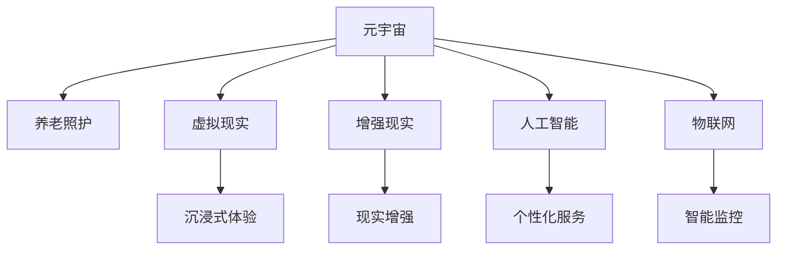
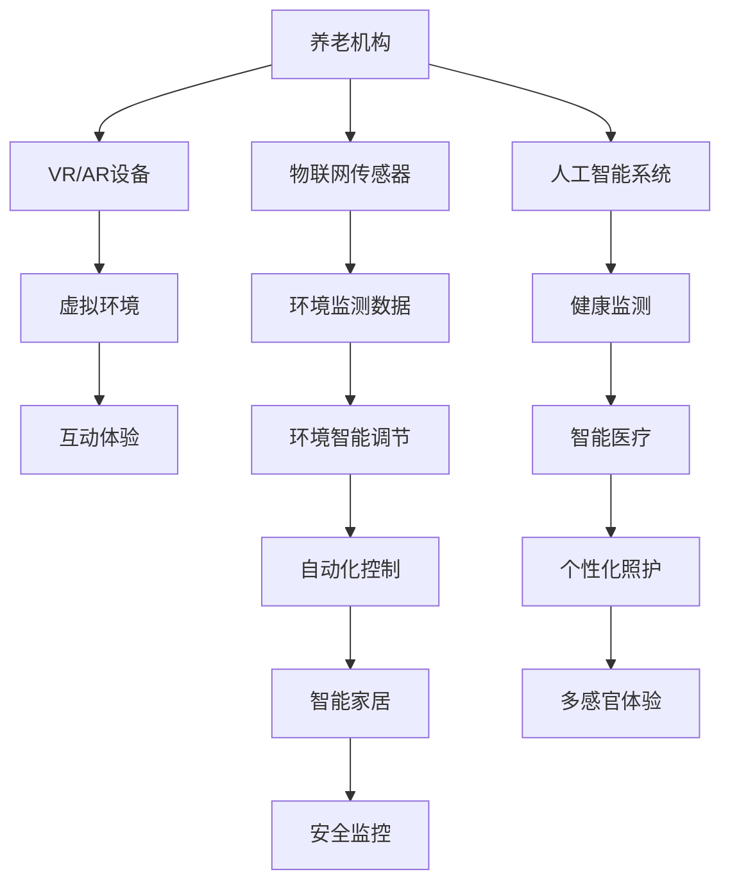

                 

# 元宇宙养老：数字化照护的创新模式

> 关键词：元宇宙,养老,数字化照护,虚拟现实,智能医疗,社会责任,技术伦理,人机协作

## 1. 背景介绍

### 1.1 问题由来

随着人口老龄化的加剧，传统养老模式面临诸多挑战，如照护资源短缺、成本高昂、情感关怀不足等。数字技术为养老模式带来了新的突破，特别是结合了人工智能、物联网、虚拟现实等前沿技术，数字养老正在逐步走向成熟。然而，传统的数字化养老模式仍存在诸多不足，如用户体验较差、隐私保护不到位、技术应用碎片化等。

元宇宙作为数字时代的新概念，将数字技术与虚拟现实结合，构建了一个完全沉浸的虚拟环境，为养老行业带来了新的可能。本文章将探讨元宇宙在养老行业中的应用，具体内容包括元宇宙养老的创新模式、核心技术、应用场景及未来展望。

### 1.2 问题核心关键点

元宇宙养老的核心关键点在于以下几个方面：

- **数字虚拟环境**：构建一个与现实世界高度相似、富有互动性的虚拟环境，让老年人可以在其中获得更多自由和体验。
- **技术融合创新**：结合物联网、AI、VR/AR等前沿技术，提供更个性化、智能化的养老服务。
- **多感官体验**：通过虚拟现实、触觉反馈等技术，实现多感官的全方位互动体验。
- **智能医疗健康**：提供实时健康监测、远程医疗服务、个性化健康管理等功能，提升养老服务质量。
- **社交互动**：建立虚拟社区、虚拟活动，促进老年人之间的社交互动，丰富其生活内容。

## 2. 核心概念与联系

### 2.1 核心概念概述

为了更好地理解元宇宙养老的原理与架构，本节将介绍几个关键概念：

- **元宇宙**：一个由多个互连的虚拟世界和数字内容组成的平台，其中每个世界都可以与其他世界交互。元宇宙将数字技术融入虚拟世界，实现从虚拟到实物的融合。
- **养老照护**：包括日常照料、医疗健康、心理关怀等多方面的服务，旨在提升老年人的生活质量和幸福感。
- **虚拟现实（VR）**：通过头戴设备和传感器，模拟真实世界的视觉和听觉体验，构建沉浸式环境。
- **增强现实（AR）**：通过将数字信息叠加在现实世界之上，提升用户体验和信息展示效果。
- **人工智能（AI）**：利用算法和模型，提供个性化的养老服务，如智能家居控制、语音识别、情感分析等。
- **物联网（IoT）**：通过传感器和智能设备，实现环境监控、健康监测、远程操控等功能。

这些概念之间的逻辑关系可以通过以下Mermaid流程图来展示：



### 2.2 核心概念原理和架构的 Mermaid 流程图

以下是一个元宇宙养老的核心概念和架构流程图的示例：



## 3. 核心算法原理 & 具体操作步骤

### 3.1 算法原理概述

元宇宙养老的核心算法原理主要包括：

- **虚拟环境构建**：利用3D建模和渲染技术，构建一个与现实世界相似、充满互动的虚拟环境。
- **智能交互与感知**：通过传感器、AI算法等技术，实现老年人与虚拟环境的智能互动和感知。
- **个性化健康管理**：利用AI算法，进行健康数据的实时监测和分析，提供个性化健康建议。
- **社交互动**：通过虚拟社区和虚拟活动，促进老年人之间的社交互动，增强其幸福感。

### 3.2 算法步骤详解

以下是一个典型的元宇宙养老算法流程：

1. **虚拟环境构建**：
   - 使用3D建模和渲染技术，构建一个与现实世界相似、充满互动的虚拟环境。
   - 通过VR/AR设备，将老年人带入这个虚拟环境。

2. **智能交互与感知**：
   - 利用传感器和AI算法，获取老年人的行为数据。
   - 通过多模态数据融合技术，实现对老年人情绪、活动状态的准确判断。
   - 根据老年人的行为数据，自动调整虚拟环境，提供个性化体验。

3. **个性化健康管理**：
   - 利用传感器和可穿戴设备，实时监测老年人的健康数据。
   - 通过AI算法，进行数据分析和预测，提供个性化的健康建议。
   - 通过远程医疗系统，进行健康咨询和诊断，提供远程医疗服务。

4. **社交互动**：
   - 构建虚拟社区和虚拟活动，促进老年人之间的社交互动。
   - 通过虚拟现实技术，实现跨地域的社交，增加老年人的社交机会。
   - 利用AI算法，进行社交情感分析，增强社交体验。

### 3.3 算法优缺点

元宇宙养老算法的优点包括：

- **沉浸式体验**：通过虚拟现实和增强现实技术，提供沉浸式体验，丰富老年人生活内容。
- **个性化服务**：利用AI算法，提供个性化健康管理、智能家居控制等服务，提升养老服务质量。
- **跨地域社交**：利用虚拟社区和虚拟活动，实现跨地域的社交互动，增加老年人的社交机会。

元宇宙养老算法的不足之处在于：

- **技术成本高**：构建虚拟环境和交互系统需要较高的技术投入和成本。
- **隐私保护问题**：老年人数据隐私保护是一个重要问题，需要严格的数据管理和隐私保护措施。
- **技术适应性**：老年人对新技术的适应性较慢，需要逐步引导和培训。
- **健康监测的准确性**：传感器和可穿戴设备的准确性可能影响健康监测的可靠性。

### 3.4 算法应用领域

元宇宙养老算法主要应用于以下几个领域：

- **智能家居**：通过智能家居设备和虚拟环境结合，实现老年人自主生活、环境调节等功能。
- **智能医疗**：通过虚拟环境和远程医疗系统，提供健康监测、远程诊断等医疗服务。
- **虚拟社交**：通过虚拟社区和虚拟活动，促进老年人之间的社交互动，增加社交机会。
- **虚拟娱乐**：通过虚拟游戏、虚拟旅行等，丰富老年人的娱乐生活。
- **教育培训**：通过虚拟教室和虚拟实验，提供老年人的教育和技能培训。

## 4. 数学模型和公式 & 详细讲解 & 举例说明

### 4.1 数学模型构建

元宇宙养老算法的数学模型主要涉及以下几个方面：

- **环境构建**：利用3D建模和渲染技术，构建虚拟环境。
- **交互感知**：利用传感器和AI算法，实现对老年人行为数据的感知和分析。
- **健康管理**：利用传感器和可穿戴设备，实时监测老年人的健康数据。
- **社交互动**：利用AI算法，进行社交情感分析。

### 4.2 公式推导过程

以下是一个简单的数学模型推导过程：

假设老年人A在虚拟环境中的位置为（x, y, z），其行为数据为（行为类型、时间、强度），系统进行行为分析的公式为：

$$
F(x, y, z, time, intensity) = \sum_{i=1}^n \alpha_i \times \beta_i
$$

其中，$\alpha_i$ 为行为类型权重，$\beta_i$ 为行为时间强度权重。通过该公式，系统可以计算出老年人的行为特征，并根据这些特征，自动调整虚拟环境。

在健康管理方面，利用传感器获取老年人健康数据（如心率、血压等），进行数据分析的公式为：

$$
H(t) = \sum_{i=1}^m \gamma_i \times \delta_i
$$

其中，$\gamma_i$ 为健康指标权重，$\delta_i$ 为传感器数据权重。通过该公式，系统可以实时监测老年人的健康状态，提供个性化的健康建议。

在社交互动方面，利用AI算法进行情感分析，公式为：

$$
S = \frac{\sum_{i=1}^k \eta_i \times \zeta_i}{\sum_{i=1}^k \eta_i}
$$

其中，$\eta_i$ 为情感特征权重，$\zeta_i$ 为情感值权重。通过该公式，系统可以判断老年人的情感状态，提供个性化的社交互动建议。

### 4.3 案例分析与讲解

以下是一个案例分析：

某养老机构利用元宇宙技术，为老年人提供虚拟社区服务。老年人通过VR设备，进入虚拟社区，参与虚拟活动，如虚拟聚会、虚拟旅游等。系统通过传感器和AI算法，实时监测老年人的行为数据，分析其情绪和活动状态，自动调整虚拟环境。例如，当老年人表现出孤独情绪时，系统自动引导其参与虚拟社区活动，增加其社交互动机会。

## 5. 项目实践：代码实例和详细解释说明

### 5.1 开发环境搭建

要进行元宇宙养老算法的项目实践，需要搭建以下开发环境：

1. **硬件设备**：VR/AR设备、传感器设备、可穿戴设备等。
2. **软件工具**：3D建模软件（如Blender）、虚拟现实引擎（如Unity）、AI框架（如TensorFlow）、操作系统（如Linux）等。

### 5.2 源代码详细实现

以下是一个简化的元宇宙养老系统源代码实现示例：

```python
# 导入必要的库和模块
import tensorflow as tf
import unity
import sensor

# 定义环境构建函数
def build_environment():
    # 使用3D建模软件和虚拟现实引擎构建虚拟环境
    # 返回虚拟环境对象
    return environment_object

# 定义行为感知函数
def perceive_behavior():
    # 使用传感器和AI算法获取行为数据
    # 返回行为特征
    return behavior_features

# 定义健康监测函数
def monitor_health():
    # 使用传感器和可穿戴设备获取健康数据
    # 返回健康状态
    return health_state

# 定义社交互动函数
def interact_socially():
    # 使用AI算法进行社交情感分析
    # 返回社交互动建议
    return social_interactions

# 主程序
if __name__ == '__main__':
    # 构建虚拟环境
    environment = build_environment()
    
    # 感知行为
    behavior = perceive_behavior()
    
    # 监测健康
    health = monitor_health()
    
    # 社交互动
    interaction = interact_socially()
    
    # 根据行为、健康、社交数据，自动调整虚拟环境
    adjust_environment(behavior, health, interaction)
```

### 5.3 代码解读与分析

以下是代码解读与分析：

**环境构建函数**：
- 使用3D建模软件和虚拟现实引擎，构建一个与现实世界相似、充满互动的虚拟环境。

**行为感知函数**：
- 通过传感器和AI算法，获取老年人的行为数据，分析其行为特征。

**健康监测函数**：
- 利用传感器和可穿戴设备，实时监测老年人的健康数据，提供个性化的健康建议。

**社交互动函数**：
- 通过AI算法，进行社交情感分析，提供个性化的社交互动建议。

**主程序**：
- 根据行为、健康、社交数据，自动调整虚拟环境，提供个性化的养老服务。

## 6. 实际应用场景

### 6.1 智能家居

智能家居是元宇宙养老的重要应用场景之一。通过智能家居设备和虚拟环境结合，老年人可以实现自主生活、环境调节等功能。例如：

- 利用虚拟现实技术，老年人可以在家中进行虚拟旅行，增加生活乐趣。
- 通过智能家居控制系统，老年人可以自主调节室内温度、照明等，提升生活舒适度。
- 通过智能语音助手，老年人可以语音控制家电，进行日常生活中的各种操作。

### 6.2 智能医疗

智能医疗是元宇宙养老的核心应用之一。通过虚拟环境和远程医疗系统，老年人可以获得健康监测、远程诊断等医疗服务。例如：

- 利用虚拟现实技术，老年人可以进行远程医疗咨询，避免去医院的麻烦。
- 通过健康监测系统，老年人可以实时获取健康数据，及时发现健康问题。
- 利用远程医疗系统，老年人可以进行远程诊断和咨询，获得专业的医疗服务。

### 6.3 虚拟社交

虚拟社交是元宇宙养老的重要功能之一。通过虚拟社区和虚拟活动，老年人可以丰富其社交生活，增加社交机会。例如：

- 利用虚拟社区平台，老年人可以参与各种虚拟活动，如虚拟聚会、虚拟旅游等。
- 通过虚拟社交系统，老年人可以与其他老年人交流互动，增强情感支持。
- 利用社交情感分析技术，系统可以根据老年人的情绪状态，推荐适合的虚拟活动。

### 6.4 未来应用展望

未来，元宇宙养老将有更广阔的应用前景。随着技术的不断进步，元宇宙养老将更加智能化、个性化，为老年人提供更全面的服务。以下是未来展望：

- **全息互动**：通过全息投影技术，老年人可以实现更加沉浸式的虚拟互动体验。
- **跨平台集成**：将元宇宙养老与智能家居、智能医疗等平台集成，提供一站式服务。
- **多感官融合**：通过虚拟现实、触觉反馈等技术，实现多感官的全方位互动体验。
- **社会化服务**：利用社交网络平台，老年人可以获取更多社会化服务，提升生活质量。

## 7. 工具和资源推荐

### 7.1 学习资源推荐

以下是一些学习资源推荐：

- **3D建模与渲染**：推荐学习3ds Max、Blender等3D建模软件，掌握3D建模和渲染技术。
- **虚拟现实技术**：推荐学习Unity、Unreal Engine等虚拟现实引擎，掌握虚拟现实开发技术。
- **人工智能与机器学习**：推荐学习TensorFlow、PyTorch等AI框架，掌握AI算法和模型开发技术。
- **物联网与传感器技术**：推荐学习Arduino、Raspberry Pi等物联网平台，掌握传感器和智能设备开发技术。
- **社会心理学**：推荐学习社会心理学相关知识，理解老年人的心理需求和行为特征。

### 7.2 开发工具推荐

以下是一些开发工具推荐：

- **3D建模软件**：Blender、Maya、3ds Max等。
- **虚拟现实引擎**：Unity、Unreal Engine、Vuforia等。
- **AI框架**：TensorFlow、PyTorch、Keras等。
- **操作系统**：Linux、Windows等。
- **传感器设备**：心率传感器、血压传感器、加速度计等。

### 7.3 相关论文推荐

以下是一些相关论文推荐：

- **《3D建模与渲染技术研究综述》**：详细介绍了3D建模和渲染技术的最新进展。
- **《虚拟现实与增强现实技术综述》**：全面介绍了虚拟现实和增强现实技术的原理和应用。
- **《人工智能与机器学习在养老中的应用研究》**：探讨了人工智能和机器学习在养老领域的应用前景。
- **《物联网与传感器技术在养老中的应用研究》**：研究了物联网和传感器技术在养老领域的创新应用。
- **《社会心理学在养老中的应用研究》**：探讨了社会心理学在养老中的作用和应用。

## 8. 总结：未来发展趋势与挑战

### 8.1 研究成果总结

元宇宙养老技术的研发取得了显著进展，具有以下主要研究成果：

- **虚拟环境构建**：利用3D建模和渲染技术，构建了一个与现实世界相似、充满互动的虚拟环境。
- **智能交互与感知**：通过传感器和AI算法，实现了对老年人行为数据的感知和分析。
- **个性化健康管理**：利用传感器和可穿戴设备，实时监测老年人的健康数据，提供个性化的健康建议。
- **社交互动**：利用AI算法，进行社交情感分析，提供个性化的社交互动建议。

### 8.2 未来发展趋势

未来，元宇宙养老技术将呈现以下发展趋势：

- **沉浸式体验**：通过虚拟现实和全息互动技术，提供更加沉浸式的虚拟体验。
- **智能化服务**：利用AI算法和传感器技术，提供更加智能化的养老服务。
- **个性化定制**：根据老年人的行为数据和健康状态，提供个性化定制的养老服务。
- **社会化融合**：将元宇宙养老与其他社会化服务进行融合，提升老年人的生活质量。
- **跨平台集成**：将元宇宙养老与智能家居、智能医疗等平台集成，提供一站式服务。

### 8.3 面临的挑战

元宇宙养老技术面临以下挑战：

- **技术成本高**：构建虚拟环境和交互系统需要较高的技术投入和成本。
- **隐私保护问题**：老年人数据隐私保护是一个重要问题，需要严格的数据管理和隐私保护措施。
- **技术适应性**：老年人对新技术的适应性较慢，需要逐步引导和培训。
- **健康监测的准确性**：传感器和可穿戴设备的准确性可能影响健康监测的可靠性。
- **社会化融合**：将元宇宙养老与其他社会化服务进行融合，需要解决数据互通、接口统一等问题。

### 8.4 研究展望

未来的研究方向包括：

- **跨领域融合**：将元宇宙养老与其他领域（如医疗、教育）进行融合，提供更全面的服务。
- **跨文化支持**：开发支持多语言和多文化的元宇宙养老系统，提升全球化服务能力。
- **智能安全监控**：利用AI算法进行智能安全监控，保障老年人的安全。
- **多模态融合**：将虚拟现实、触觉反馈等多模态技术进行融合，提升用户体验。
- **伦理道德研究**：研究元宇宙养老的伦理道德问题，确保技术应用符合人类价值观和伦理道德。

## 9. 附录：常见问题与解答

**Q1：元宇宙养老技术需要高昂的成本投入，如何降低成本？**

A: 可以通过以下措施降低成本：
- 利用开源技术和工具，减少开发成本。
- 采用云计算和边缘计算技术，降低硬件成本。
- 逐步引入智能化、自动化技术，减少人力成本。

**Q2：老年人对新技术的适应性较慢，如何提高其使用率？**

A: 可以通过以下措施提高老年人对新技术的适应性：
- 逐步引导和培训，逐步引入新技术。
- 设计易于操作的用户界面和功能，降低使用难度。
- 提供定制化的服务和支持，增加老年人的信心和信任。

**Q3：老年人隐私保护是一个重要问题，如何确保数据安全？**

A: 可以通过以下措施确保数据安全：
- 采用数据加密和匿名化技术，保护数据隐私。
- 严格控制数据访问权限，确保数据安全。
- 定期进行安全审计，发现和修复潜在漏洞。

**Q4：健康监测的准确性可能影响服务效果，如何提升监测准确性？**

A: 可以通过以下措施提升健康监测的准确性：
- 选择高性能的传感器和设备，提高数据采集的准确性。
- 利用机器学习和数据融合技术，提高数据分析的准确性。
- 定期进行设备校准和维护，确保数据采集的可靠性。

**Q5：如何应对社会化融合带来的挑战？**

A: 可以通过以下措施应对社会化融合带来的挑战：
- 制定统一的数据标准和接口协议，实现跨平台集成。
- 引入社会化服务提供商，提供更全面的服务。
- 建立跨领域合作机制，解决数据互通和功能协同问题。

