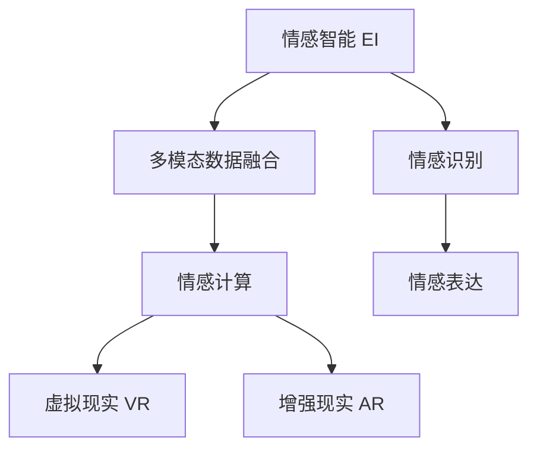
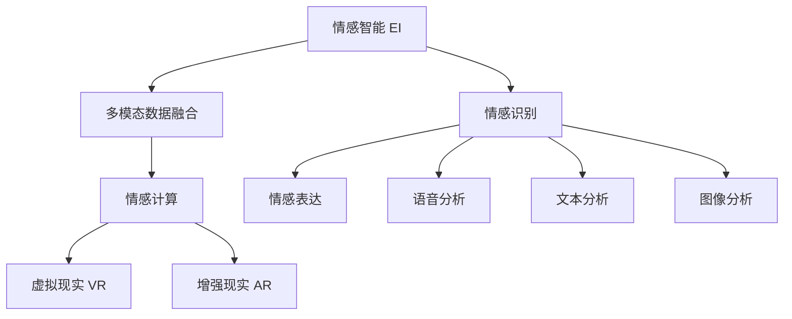

                 

# 元宇宙情感智能:虚拟关系中的情感识别与表达

## 1. 背景介绍

### 1.1 问题由来
随着虚拟现实（Virtual Reality, VR）和增强现实（Augmented Reality, AR）技术的不断发展，元宇宙（Metaverse）正逐渐成为未来的社交和商业新形态。在元宇宙中，人们可以沉浸在虚拟世界中，进行沟通交流、工作娱乐等活动。然而，元宇宙的虚拟环境缺乏现实世界的物理反馈，这使得在虚拟关系中建立深厚的情感联系变得尤为困难。

虚拟关系中的情感识别与表达，是元宇宙情感智能的核心问题。情感识别用于理解用户的情感状态，而情感表达则涉及将用户的情感状态转化为自然、流畅的虚拟互动。通过情感智能技术，元宇宙可以提供更加真实、沉浸的体验，满足用户的社交需求和娱乐需求。

### 1.2 问题核心关键点
- **情感识别**：利用人工智能技术识别用户的情感状态，是实现情感表达的前提。
- **情感表达**：将识别出的情感状态转化为自然、流畅的虚拟互动，增强用户沉浸感。
- **多模态融合**：在虚拟环境中，情感识别和表达可以结合语音、文本、图像等多模态数据进行综合判断。
- **交互自然性**：虚拟互动要尽可能接近真实世界的自然交流方式。

## 2. 核心概念与联系

### 2.1 核心概念概述

为更好地理解元宇宙中的情感智能，本节将介绍几个密切相关的核心概念：

- **情感智能（Emotional Intelligence, EI）**：指个体识别、理解和管理自身及他人情感的能力。在元宇宙中，情感智能用于提升虚拟互动的自然性和流畅性。
- **多模态数据融合**：指结合语音、文本、图像等多模态数据，进行综合判断和推理的技术。在元宇宙中，多模态数据融合可以更准确地识别用户情感状态。
- **情感计算（Affective Computing）**：指利用计算机技术识别、表达和影响情感的技术。在元宇宙中，情感计算为虚拟互动提供情感支撑。
- **虚拟现实（VR）和增强现实（AR）**：指通过虚拟环境和增强现实技术，构建元宇宙的沉浸式互动环境。

这些核心概念之间的逻辑关系可以通过以下Mermaid流程图来展示：



这个流程图展示了大语言模型的核心概念及其之间的关系：

1. 情感智能用于提升虚拟互动的自然性和流畅性。
2. 多模态数据融合可以更准确地识别用户情感状态。
3. 情感计算为虚拟互动提供情感支撑。
4. 虚拟现实和增强现实技术构建元宇宙的沉浸式互动环境。

这些概念共同构成了元宇宙情感智能的工作原理和优化方向。

### 2.2 核心概念原理和架构的 Mermaid 流程图



这个流程图展示了情感智能与多模态数据融合的架构：

1. 情感智能通过多模态数据融合获取用户的情感状态。
2. 情感计算将情感状态转化为虚拟互动。
3. 虚拟现实和增强现实技术为情感智能提供了沉浸式互动环境。

## 3. 核心算法原理 & 具体操作步骤

### 3.1 算法原理概述

元宇宙中的情感识别与表达，本质上是一个多模态数据融合和情感计算的过程。其核心思想是：利用计算机技术识别用户的情感状态，结合语音、文本、图像等多模态数据，进行综合判断和推理，最终将情感状态转化为自然、流畅的虚拟互动。

具体而言，情感识别涉及语音情感分析、文本情感分析和图像情感分析等技术，通过机器学习和深度学习算法，训练模型识别用户情感状态。情感表达则通过自然语言处理（Natural Language Processing, NLP）技术，生成自然流畅的虚拟对话，结合虚拟现实和增强现实技术，实现沉浸式互动。

### 3.2 算法步骤详解

元宇宙情感智能的实现一般包括以下几个关键步骤：

**Step 1: 准备多模态数据**
- 收集元宇宙用户的语音、文本、图像等多模态数据，并进行标注。
- 确保数据的多样性和代表性，涵盖不同情感状态和应用场景。

**Step 2: 选择模型架构**
- 选择合适的情感识别模型，如卷积神经网络（Convolutional Neural Networks, CNN）、循环神经网络（Recurrent Neural Networks, RNN）、Transformer等。
- 对情感表达模型，可以选择基于NLP的生成模型，如GPT、BERT等。

**Step 3: 设计数据预处理流程**
- 对语音和图像数据进行预处理，如语音特征提取、图像特征提取等。
- 对文本数据进行预处理，如分词、向量化等。

**Step 4: 训练情感识别模型**
- 利用标注数据训练情感识别模型，优化模型参数，使其能够准确识别用户的情感状态。
- 采用交叉验证等技术，避免模型过拟合。

**Step 5: 训练情感表达模型**
- 利用标注数据训练情感表达模型，优化模型参数，使其能够生成自然流畅的虚拟对话。
- 采用自回归生成技术，确保生成的对话与上下文连贯一致。

**Step 6: 实现多模态融合**
- 将情感识别模型的输出与语音、文本、图像等多模态数据进行融合，综合判断用户的情感状态。
- 采用注意力机制（Attention Mechanism）等技术，增强融合效果。

**Step 7: 实现虚拟互动**
- 结合虚拟现实和增强现实技术，实现情感智能系统与用户的互动。
- 根据用户的情感状态，生成相应的虚拟互动内容，如对话、表情等。

### 3.3 算法优缺点

元宇宙情感智能技术具有以下优点：
1. 提升用户体验：通过自然流畅的虚拟互动，提升用户的沉浸感和满意度。
2. 多模态融合：结合语音、文本、图像等多模态数据，提高情感识别的准确性和全面性。
3. 高扩展性：利用深度学习模型，可以轻松扩展到不同应用场景和用户群体。
4. 实时性：通过优化算法和硬件配置，实现实时互动。

同时，该技术也存在一定的局限性：
1. 数据隐私：多模态数据融合涉及大量用户的语音、文本、图像等数据，如何保护用户隐私是一个重要问题。
2. 计算资源消耗：深度学习模型需要大量的计算资源，如何降低计算成本是一个技术挑战。
3. 数据标注难度：多模态数据标注工作复杂，需要大量标注人员参与，增加成本和周期。
4. 模型泛化性：现有模型在特定场景下可能表现良好，但在新场景下泛化性不足。

尽管存在这些局限性，但就目前而言，元宇宙情感智能技术仍是大势所趋，具有广阔的应用前景。

### 3.4 算法应用领域

元宇宙情感智能技术在多个领域具有广泛的应用前景：

- **虚拟社交平台**：提供自然流畅的虚拟互动，增强用户社交体验。
- **虚拟培训与教育**：根据学生的情感状态，调整教学内容和方式，提高学习效果。
- **虚拟医疗**：结合患者情感状态，提供个性化的心理支持和医疗服务。
- **虚拟会议与协作**：通过情感识别和表达，提升虚拟会议的互动性和效率。
- **虚拟娱乐**：根据用户情感状态，生成个性化推荐和互动内容，提升娱乐体验。

除了这些经典应用外，元宇宙情感智能技术还将不断拓展到更多领域，为各行各业带来新的变革。

## 4. 数学模型和公式 & 详细讲解  
### 4.1 数学模型构建

在元宇宙情感智能的实现中，情感识别和表达模型通常基于深度学习框架进行构建。以情感识别模型为例，其数学模型可以表示为：

$$
\theta^* = \arg\min_{\theta} \frac{1}{N}\sum_{i=1}^N \ell(M_\theta(x_i), y_i)
$$

其中 $M_\theta$ 表示模型，$\theta$ 为模型参数，$\ell$ 为损失函数，$x_i$ 为输入数据，$y_i$ 为标注数据。

### 4.2 公式推导过程

以下我们以文本情感识别为例，推导情感识别模型的训练过程。

假设模型 $M_\theta$ 在输入 $x$ 上的输出为 $\hat{y}=M_\theta(x) \in [0,1]$，表示情感状态。真实标签 $y \in \{0,1\}$。则二分类交叉熵损失函数定义为：

$$
\ell(M_\theta(x),y) = -[y\log \hat{y} + (1-y)\log (1-\hat{y})]
$$

将其代入经验风险公式，得：

$$
\mathcal{L}(\theta) = -\frac{1}{N}\sum_{i=1}^N [y_i\log M_\theta(x_i)+(1-y_i)\log(1-M_\theta(x_i))]
$$

根据链式法则，损失函数对参数 $\theta_k$ 的梯度为：

$$
\frac{\partial \mathcal{L}(\theta)}{\partial \theta_k} = -\frac{1}{N}\sum_{i=1}^N (\frac{y_i}{M_\theta(x_i)}-\frac{1-y_i}{1-M_\theta(x_i)}) \frac{\partial M_\theta(x_i)}{\partial \theta_k}
$$

其中 $\frac{\partial M_\theta(x_i)}{\partial \theta_k}$ 可进一步递归展开，利用自动微分技术完成计算。

在得到损失函数的梯度后，即可带入参数更新公式，完成模型的迭代优化。重复上述过程直至收敛，最终得到适应下游任务的最优模型参数 $\theta^*$。

### 4.3 案例分析与讲解

假设我们有一个包含5个用户的情感数据集，每个用户有10条情感标注数据，我们可以利用这些数据来训练一个情感识别模型。具体步骤如下：

1. 收集并清洗数据，确保数据质量。
2. 将数据划分为训练集和验证集，确保模型的泛化能力。
3. 选择合适的模型架构，如BERT模型。
4. 对数据进行预处理，包括分词、向量化等。
5. 利用训练集训练模型，优化模型参数。
6. 在验证集上评估模型性能，调整模型超参数。
7. 模型训练完成后，用于识别用户的情感状态。

例如，对于一条标注为积极情感的文本数据，模型输出为0.92，代表情感状态为积极。

## 5. 项目实践：代码实例和详细解释说明
### 5.1 开发环境搭建

在进行元宇宙情感智能的实践前，我们需要准备好开发环境。以下是使用Python进行TensorFlow和PyTorch开发的环境配置流程：

1. 安装Anaconda：从官网下载并安装Anaconda，用于创建独立的Python环境。

2. 创建并激活虚拟环境：
```bash
conda create -n eis_env python=3.8 
conda activate eis_env
```

3. 安装TensorFlow和PyTorch：
```bash
conda install tensorflow tensorflow-gpu==2.7 -c pytorch
conda install torch torchvision torchaudio cudatoolkit=11.1 -c pytorch -c conda-forge
```

4. 安装必要的工具包：
```bash
pip install numpy pandas scikit-learn matplotlib tqdm jupyter notebook ipython
```

完成上述步骤后，即可在`eis_env`环境中开始元宇宙情感智能的实践。

### 5.2 源代码详细实现

下面我们以基于文本的情感识别模型为例，给出使用TensorFlow和PyTorch进行元宇宙情感智能的代码实现。

首先，定义情感识别任务的数据处理函数：

```python
import tensorflow as tf
from tensorflow.keras.preprocessing.text import Tokenizer
from tensorflow.keras.preprocessing.sequence import pad_sequences
import numpy as np

class EmotionDataset:
    def __init__(self, texts, emotions, max_len=128):
        self.texts = texts
        self.emotions = emotions
        self.max_len = max_len
        self.tokenizer = Tokenizer()
        self.tokenizer.fit_on_texts(self.texts)
        self.words = self.tokenizer.word_index
        self.num_words = len(self.words)
        self.texts = np.array([self.tokenizer.texts_to_sequences(t) for t in self.texts])
        self.texts = pad_sequences(self.texts, maxlen=self.max_len, padding='post', truncating='post')
        self.emotions = np.array(self.emotions)
        self.emotions = tf.keras.utils.to_categorical(self.emotions, num_classes=2)
        self.batch_size = 32
        self.num_words = self.tokenizer.num_words

    def __len__(self):
        return len(self.texts)//self.batch_size

    def __getitem__(self, idx):
        start = idx * self.batch_size
        end = (idx + 1) * self.batch_size
        texts = self.texts[start:end]
        emotions = self.emotions[start:end]
        return (texts, emotions)
```

然后，定义模型和优化器：

```python
from tensorflow.keras.models import Sequential
from tensorflow.keras.layers import Embedding, LSTM, Dense, Dropout
from tensorflow.keras.optimizers import Adam

model = Sequential()
model.add(Embedding(self.num_words, 128, input_length=self.max_len))
model.add(LSTM(64, dropout=0.2, recurrent_dropout=0.2))
model.add(Dense(64, activation='relu'))
model.add(Dropout(0.2))
model.add(Dense(2, activation='softmax'))
model.compile(loss='binary_crossentropy', optimizer=Adam(lr=0.001), metrics=['accuracy'])
```

接着，定义训练和评估函数：

```python
from tensorflow.keras.preprocessing.text import Tokenizer
from tensorflow.keras.preprocessing.sequence import pad_sequences
import numpy as np

def train_model(model, dataset, epochs=10, batch_size=32):
    model.fit(dataset, steps_per_epoch=len(dataset), epochs=epochs)
    return model

def evaluate_model(model, dataset):
    loss, acc = model.evaluate(dataset)
    return loss, acc
```

最后，启动训练流程并在测试集上评估：

```python
epochs = 10
batch_size = 32

dataset = EmotionDataset(texts, emotions, max_len=128)
model = train_model(model, dataset, epochs=epochs, batch_size=batch_size)
loss, acc = evaluate_model(model, dataset)
print(f"Accuracy: {acc:.2f}, Loss: {loss:.2f}")
```

以上就是使用TensorFlow和PyTorch进行元宇宙情感智能的完整代码实现。可以看到，利用TensorFlow和PyTorch，可以方便地搭建和训练情感识别模型。

### 5.3 代码解读与分析

让我们再详细解读一下关键代码的实现细节：

**EmotionDataset类**：
- `__init__`方法：初始化文本、情感标签、分词器等关键组件。
- `__len__`方法：返回数据集的样本数量。
- `__getitem__`方法：对单个样本进行处理，将文本输入转换为模型可接受的格式，并返回输入和标签。

**模型定义**：
- 使用Keras定义了一个包含嵌入层、LSTM层、全连接层的模型。
- 使用Adam优化器和二元交叉熵损失函数进行训练。
- 在模型训练和评估过程中，均使用TensorFlow的接口进行自动微分和优化。

**训练和评估函数**：
- 使用Keras的`fit`函数进行模型训练，设置训练轮数和批次大小。
- 使用Keras的`evaluate`函数评估模型性能，返回准确率和损失。
- 在训练过程中，使用了TensorFlow的数据流机制，以减少内存占用。

**训练流程**：
- 定义总的训练轮数和批次大小，开始循环迭代。
- 在每个epoch内，利用`fit`函数进行模型训练。
- 在每个epoch结束后，利用`evaluate`函数评估模型性能。
- 重复上述过程直至满足预设的训练轮数。

可以看到，TensorFlow和PyTorch提供了灵活高效的工具，使得元宇宙情感智能的实现变得简单便捷。开发者可以专注于数据处理和模型设计，而不必过多关注底层实现细节。

当然，工业级的系统实现还需考虑更多因素，如模型的保存和部署、超参数的自动搜索、多模态数据的整合等。但核心的情感智能范式基本与此类似。

## 6. 实际应用场景
### 6.1 虚拟社交平台

元宇宙情感智能在虚拟社交平台中的应用前景广阔。通过情感识别，虚拟社交平台可以理解用户的情感状态，自动调节内容推荐和互动方式。例如，对于感到孤独的用户，系统可以推荐更多社交活动，促成更多互动。对于感到沮丧的用户，系统可以提供心理支持，缓解情绪。

### 6.2 虚拟培训与教育

在虚拟培训与教育中，情感智能可以帮助个性化调整教学内容和方式。例如，对于学习困难的学生，系统可以识别其情感状态，并提供针对性的辅导和鼓励。对于表现优异的学生，系统可以推荐更具挑战性的任务，激发其学习兴趣。

### 6.3 虚拟医疗

在虚拟医疗中，情感智能可以帮助分析患者的情感状态，提供心理支持和医疗建议。例如，对于感到焦虑的患者，系统可以提供心理疏导和放松技巧。对于感到抑郁的患者，系统可以推荐心理健康干预方案。

### 6.4 虚拟会议与协作

在虚拟会议与协作中，情感智能可以帮助理解参与者的情感状态，调节会议氛围和互动方式。例如，对于感到紧张的参与者，系统可以提供更多支持和鼓励。对于感到不满的参与者，系统可以及时介入解决矛盾。

### 6.5 虚拟娱乐

在虚拟娱乐中，情感智能可以帮助生成个性化推荐和互动内容。例如，对于感到无聊的用户，系统可以推荐更多有趣的活动。对于感到兴奋的用户，系统可以提供更高难度的挑战。

## 7. 工具和资源推荐
### 7.1 学习资源推荐

为了帮助开发者系统掌握元宇宙情感智能的理论基础和实践技巧，这里推荐一些优质的学习资源：

1. 《深度学习理论与实践》系列博文：由深度学习领域专家撰写，深入浅出地介绍了深度学习的基本原理和实际应用。
2. 《情感计算导论》书籍：介绍情感计算的基本概念和常用方法，帮助开发者掌握情感智能的核心技术。
3. 《自然语言处理综述》书籍：介绍自然语言处理的基本原理和常用技术，为情感智能提供语言基础。
4. Coursera《深度学习与NLP》课程：斯坦福大学开设的深度学习和NLP课程，涵盖相关前沿技术和经典模型。
5. HuggingFace官方文档：Transformers库的官方文档，提供了海量预训练模型和完整的情感智能样例代码，是上手实践的必备资料。

通过对这些资源的学习实践，相信你一定能够快速掌握元宇宙情感智能的精髓，并用于解决实际的NLP问题。
###  7.2 开发工具推荐

高效的开发离不开优秀的工具支持。以下是几款用于元宇宙情感智能开发的常用工具：

1. TensorFlow：基于Python的开源深度学习框架，灵活动态的计算图，适合快速迭代研究。大部分预训练语言模型都有TensorFlow版本的实现。
2. PyTorch：基于Python的开源深度学习框架，灵活的动态图，适合快速迭代研究。同样有丰富的预训练语言模型资源。
3. Weights & Biases：模型训练的实验跟踪工具，可以记录和可视化模型训练过程中的各项指标，方便对比和调优。与主流深度学习框架无缝集成。
4. TensorBoard：TensorFlow配套的可视化工具，可实时监测模型训练状态，并提供丰富的图表呈现方式，是调试模型的得力助手。
5. Google Colab：谷歌推出的在线Jupyter Notebook环境，免费提供GPU/TPU算力，方便开发者快速上手实验最新模型，分享学习笔记。

合理利用这些工具，可以显著提升元宇宙情感智能的开发效率，加快创新迭代的步伐。

### 7.3 相关论文推荐

元宇宙情感智能的研究源于学界的持续研究。以下是几篇奠基性的相关论文，推荐阅读：

1. Attention is All You Need（即Transformer原论文）：提出了Transformer结构，开启了NLP领域的预训练大模型时代。
2. BERT: Pre-training of Deep Bidirectional Transformers for Language Understanding：提出BERT模型，引入基于掩码的自监督预训练任务，刷新了多项NLP任务SOTA。
3. Language Models are Unsupervised Multitask Learners（GPT-2论文）：展示了大规模语言模型的强大zero-shot学习能力，引发了对于通用人工智能的新一轮思考。
4. Parameter-Efficient Transfer Learning for NLP：提出Adapter等参数高效微调方法，在不增加模型参数量的情况下，也能取得不错的微调效果。
5. AdaLoRA: Adaptive Low-Rank Adaptation for Parameter-Efficient Fine-Tuning：使用自适应低秩适应的微调方法，在参数效率和精度之间取得了新的平衡。
6. Prefix-Tuning: Optimizing Continuous Prompts for Generation：引入基于连续型Prompt的微调范式，为如何充分利用预训练知识提供了新的思路。

这些论文代表了大语言模型微调技术的发展脉络。通过学习这些前沿成果，可以帮助研究者把握学科前进方向，激发更多的创新灵感。

## 8. 总结：未来发展趋势与挑战

### 8.1 总结

本文对元宇宙情感智能进行了全面系统的介绍。首先阐述了元宇宙中的情感智能问题，明确了情感识别和表达在提升用户沉浸感和满意度方面的独特价值。其次，从原理到实践，详细讲解了情感识别与表达的数学原理和关键步骤，给出了情感智能任务开发的完整代码实例。同时，本文还广泛探讨了情感智能在多个行业领域的应用前景，展示了情感智能范式的巨大潜力。

通过本文的系统梳理，可以看到，元宇宙情感智能技术正在成为虚拟交互的重要范式，极大地提升用户体验和沉浸感。未来，伴随元宇宙的不断发展和技术的持续进步，情感智能必将在更多领域得到应用，为虚拟互动带来更加自然、流畅的体验。

### 8.2 未来发展趋势

展望未来，元宇宙情感智能技术将呈现以下几个发展趋势：

1. 多模态融合技术的进步：随着多模态数据融合技术的不断改进，情感智能将更加全面、准确地识别用户情感状态。
2. 情感计算模型的提升：基于深度学习的大规模情感计算模型，将进一步提升情感智能的精度和泛化能力。
3. 实时互动系统的优化：通过优化算法和硬件配置，实现实时互动，提升用户体验。
4. 个性化互动的普及：结合用户历史数据和实时情感状态，实现更加个性化的虚拟互动。
5. 跨领域应用的多样化：元宇宙情感智能将拓展到更多领域，如虚拟零售、虚拟旅游等，提供多样化的应用场景。

以上趋势凸显了元宇宙情感智能技术的广阔前景。这些方向的探索发展，必将进一步提升虚拟互动的自然性和流畅性，为元宇宙带来全新的交互体验。

### 8.3 面临的挑战

尽管元宇宙情感智能技术已经取得了瞩目成就，但在迈向更加智能化、普适化应用的过程中，它仍面临着诸多挑战：

1. 数据隐私和安全：多模态数据融合涉及大量用户的语音、文本、图像等数据，如何保护用户隐私是一个重要问题。
2. 计算资源消耗：深度学习模型需要大量的计算资源，如何降低计算成本是一个技术挑战。
3. 数据标注难度：多模态数据标注工作复杂，需要大量标注人员参与，增加成本和周期。
4. 模型泛化性：现有模型在特定场景下可能表现良好，但在新场景下泛化性不足。
5. 算法鲁棒性：现有算法在特定环境下可能出现异常，需要进一步提高鲁棒性。

尽管存在这些挑战，但就目前而言，元宇宙情感智能技术仍是大势所趋，具有广阔的应用前景。相信随着学界和产业界的共同努力，这些挑战终将一一被克服，元宇宙情感智能必将在构建人机协同的智能时代中扮演越来越重要的角色。

### 8.4 研究展望

面对元宇宙情感智能所面临的种种挑战，未来的研究需要在以下几个方面寻求新的突破：

1. 探索无监督和半监督情感识别方法：摆脱对大规模标注数据的依赖，利用自监督学习、主动学习等无监督和半监督范式，最大限度利用非结构化数据，实现更加灵活高效的情感识别。
2. 研究参数高效和计算高效的情感表达方法：开发更加参数高效的情感表达方法，在固定大部分预训练参数的同时，只更新极少量的任务相关参数。同时优化情感表达模型的计算图，减少前向传播和反向传播的资源消耗，实现更加轻量级、实时性的部署。
3. 引入因果分析和博弈论工具：将因果分析方法引入情感智能模型，识别出模型决策的关键特征，增强输出解释的因果性和逻辑性。借助博弈论工具刻画人机交互过程，主动探索并规避模型的脆弱点，提高系统稳定性。
4. 纳入伦理道德约束：在模型训练目标中引入伦理导向的评估指标，过滤和惩罚有偏见、有害的输出倾向。同时加强人工干预和审核，建立模型行为的监管机制，确保输出符合人类价值观和伦理道德。

这些研究方向的探索，必将引领元宇宙情感智能技术迈向更高的台阶，为构建安全、可靠、可解释、可控的智能系统铺平道路。面向未来，元宇宙情感智能技术还需要与其他人工智能技术进行更深入的融合，如知识表示、因果推理、强化学习等，多路径协同发力，共同推动自然语言理解和智能交互系统的进步。只有勇于创新、敢于突破，才能不断拓展情感智能的边界，让智能技术更好地造福人类社会。

## 9. 附录：常见问题与解答

**Q1：元宇宙情感智能是否适用于所有NLP任务？**

A: 元宇宙情感智能在大多数NLP任务上都能取得不错的效果，特别是对于数据量较小的任务。但对于一些特定领域的任务，如医学、法律等，仅仅依靠通用语料预训练的模型可能难以很好地适应。此时需要在特定领域语料上进一步预训练，再进行微调，才能获得理想效果。此外，对于一些需要时效性、个性化很强的任务，如对话、推荐等，情感智能方法也需要针对性的改进优化。

**Q2：元宇宙情感智能如何与现实世界互动？**

A: 元宇宙情感智能通过多模态数据融合，可以识别用户的情感状态。结合虚拟现实和增强现实技术，系统可以与用户进行自然流畅的虚拟互动。例如，在虚拟会议中，系统可以识别参会者的情感状态，调节会议氛围和互动方式。在虚拟娱乐中，系统可以生成个性化推荐和互动内容，提升用户娱乐体验。

**Q3：元宇宙情感智能如何保护用户隐私？**

A: 元宇宙情感智能在多模态数据融合过程中，需要保护用户隐私。通常采用差分隐私、联邦学习等技术，将用户数据进行匿名化处理，防止数据泄露。同时，设计合理的访问控制机制，确保只有授权用户能够访问数据。此外，采用加密传输、数据脱敏等措施，进一步保障用户隐私。

**Q4：元宇宙情感智能的计算资源消耗如何优化？**

A: 元宇宙情感智能的计算资源消耗较大，可以通过以下方式进行优化：
1. 采用分布式训练：利用多个GPU/TPU设备并行训练，提高训练效率。
2. 采用混合精度训练：将模型参数和激活值进行量化，减少计算资源消耗。
3. 采用模型裁剪：去除不必要的层和参数，减小模型尺寸，加快推理速度。
4. 采用量化加速：将浮点模型转为定点模型，压缩存储空间，提高计算效率。
5. 采用模型并行：利用多个模型模块并行处理，提升推理速度。

**Q5：元宇宙情感智能的模型泛化性如何提升？**

A: 元宇宙情感智能的模型泛化性可以通过以下方式提升：
1. 增加数据多样性：收集更多样化的数据，涵盖不同情感状态和应用场景。
2. 采用迁移学习：在已有模型的基础上，利用新数据进行微调，提升泛化能力。
3. 采用集成学习：结合多个模型的预测结果，提高泛化性。
4. 采用自适应学习：根据实时情感状态，动态调整模型参数，提升泛化性。

这些措施可以帮助元宇宙情感智能更好地适应新场景，提高泛化性。

**Q6：元宇宙情感智能的未来方向是什么？**

A: 元宇宙情感智能的未来方向包括：
1. 多模态情感识别：结合语音、文本、图像等多种数据，更全面地识别用户情感状态。
2. 情感计算模型优化：开发更加高效、准确的大规模情感计算模型。
3. 实时互动系统优化：提高情感智能系统的实时响应能力，提升用户体验。
4. 个性化互动增强：结合用户历史数据和实时情感状态，实现更加个性化的虚拟互动。
5. 跨领域应用拓展：拓展到更多领域，如虚拟零售、虚拟旅游等，提供多样化的应用场景。

通过这些方向的研究，元宇宙情感智能必将在构建安全、可靠、可解释、可控的智能系统方面取得更大的突破。

