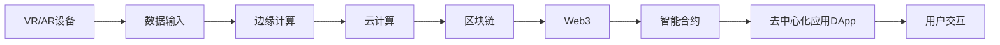

                 

# 元宇宙技术栈：从VR/AR到区块链

> 关键词：元宇宙,虚拟现实(VR),增强现实(AR),区块链,Web3,边缘计算,数据隐私

## 1. 背景介绍

随着技术的快速发展，元宇宙（Metaverse）的概念正在逐渐从科幻走向现实。元宇宙是一个由虚拟和现实世界融合构成的高度互动和可体验的数字空间，它可以通过VR/AR、云计算、区块链等技术实现对数字世界的虚拟重建和虚拟交互。在元宇宙中，用户可以体验到高度沉浸感、社交互动和实时数据反馈，从而将物理世界中的体验延伸到数字世界。

元宇宙技术栈是实现元宇宙各项功能的基础设施，它由多个层级组成，包括硬件层、软件层和网络层。本文将详细探讨元宇宙技术栈的核心组成，分析各个层级之间的联系和依赖关系，为构建元宇宙提供方向和参考。

## 2. 核心概念与联系

### 2.1 核心概念概述

要理解元宇宙技术栈，首先需要了解其核心概念。这些概念包括以下几个方面：

- **虚拟现实（VR）**：通过头戴式设备（如Oculus Rift、HTC Vive）和手部跟踪设备（如Leap Motion），为用户提供高度沉浸的虚拟体验。
- **增强现实（AR）**：通过智能眼镜（如Google Glass）和智能手机，将数字信息叠加在真实世界中，实现虚拟与现实世界的融合。
- **云计算**：通过网络云平台（如AWS、Azure、Google Cloud）提供计算资源和存储服务，支持大规模数据处理和实时渲染。
- **区块链**：基于去中心化的分布式账本技术，保障元宇宙中的数据安全和交易透明。
- **Web3**：构建在区块链技术之上的去中心化互联网，通过智能合约和DApp（去中心化应用）实现无需信任的网络交互。
- **边缘计算**：将数据处理和计算能力分散到网络边缘设备（如5G基站、边缘服务器），降低延迟并提高数据处理效率。
- **数据隐私**：在元宇宙中，用户生成数据（如位置、行为、交互数据）需要得到严格保护，防止被滥用。

### 2.2 核心概念原理和架构的 Mermaid 流程图

以下是一个简化的元宇宙技术栈Mermaid流程图，展示了各个层级之间的依赖关系：



这个流程图展示了从设备输入到用户交互的整个数据处理链路。

## 3. 核心算法原理 & 具体操作步骤

### 3.1 算法原理概述

元宇宙技术栈的算法原理涉及多个领域，包括计算机视觉、人工智能、分布式计算、密码学等。这些算法原理可以进一步细化为以下几类：

- **计算机视觉**：用于实现VR/AR中的图像识别、手势识别、场景重建等功能，主要依赖深度学习算法和特征提取技术。
- **人工智能**：用于处理和分析用户行为数据，实现推荐系统、交互模型等，主要依赖机器学习和强化学习算法。
- **分布式计算**：用于支持大规模数据处理和实时渲染，主要依赖云计算平台和边缘计算技术。
- **密码学**：用于保障数据安全和隐私保护，主要依赖公钥加密、哈希函数等技术。

### 3.2 算法步骤详解

构建元宇宙技术栈的步骤大致可以分为以下几个：

1. **硬件设备接入**：通过VR/AR设备采集用户数据，包括位置、姿态、手势等。

2. **数据处理与渲染**：利用边缘计算和云计算平台，对采集到的数据进行预处理和渲染，生成高质量的虚拟场景和图像。

3. **数据上传与存储**：将渲染后的数据上传到区块链，实现数据的去中心化存储和防篡改。

4. **智能合约与DApp开发**：基于Web3技术，开发智能合约和DApp，实现用户之间的信任互动和自动化交易。

5. **用户交互设计**：设计用户界面和交互逻辑，提供沉浸式体验和实时反馈。

### 3.3 算法优缺点

元宇宙技术栈的算法优势包括：

- **高度交互性**：通过VR/AR和实时数据反馈，提供沉浸式的用户体验。
- **数据安全性**：基于区块链和Web3技术，保障数据的安全性和隐私保护。
- **高性能计算**：利用边缘计算和云计算，支持大规模数据处理和实时渲染。

但同时也存在一些缺点：

- **技术复杂性高**：涉及多个技术和领域的融合，技术实现和集成难度较大。
- **数据隐私风险**：大量用户数据的集中存储和管理，增加了数据泄露的风险。
- **带宽和延迟问题**：高分辨率和实时渲染需要大带宽和低延迟的网络环境。

### 3.4 算法应用领域

元宇宙技术栈的应用领域包括但不限于以下几个：

- **娱乐与游戏**：通过虚拟现实和增强现实，提供沉浸式的游戏体验。
- **教育与培训**：利用虚拟环境进行远程教育和虚拟培训。
- **房地产与建筑**：通过虚拟现实展示建筑和房产，提升用户体验。
- **医疗与健康**：利用增强现实和智能合约，实现远程医疗和健康管理。
- **工业与制造**：通过虚拟现实和智能合约，优化生产流程和供应链管理。

## 4. 数学模型和公式 & 详细讲解 & 举例说明

### 4.1 数学模型构建

在元宇宙技术栈中，数学模型和公式的应用贯穿始终。以下列举几个关键模型和公式：

- **计算机视觉中的姿态估计算法**：使用Kalman滤波器（Kalman Filter）进行姿态估计。
- **深度学习中的特征提取算法**：使用卷积神经网络（CNN）和循环神经网络（RNN）进行特征提取。
- **机器学习中的推荐系统算法**：使用协同过滤算法（Collaborative Filtering）和内容过滤算法（Content-based Filtering）进行用户行为预测。
- **分布式计算中的负载均衡算法**：使用MapReduce算法进行负载均衡。
- **密码学中的公钥加密算法**：使用RSA算法进行公钥加密。

### 4.2 公式推导过程

以下是一个简单的例子，展示了如何使用Kalman滤波器进行姿态估计的推导过程。

设传感器测量得到当前位置和速度，记为 $x$ 和 $v$，则可以使用以下状态方程进行更新：

$$
\begin{cases}
x = x' + v\Delta t + \omega(\Delta t) \\
v = v' + \Omega(\Delta t) 
\end{cases}
$$

其中 $x'$ 和 $v'$ 为上一时刻的位置和速度，$\omega(\Delta t)$ 和 $\Omega(\Delta t)$ 为加速度扰动和噪声。

通过状态方程，可以递推得到当前位置和速度的估计值。

### 4.3 案例分析与讲解

例如，在一个VR应用中，用户佩戴头戴式设备进行游戏时，采集到的位置和姿态数据需要通过Kalman滤波器进行姿态估计。假设设备采集到当前位置和姿态信息 $x_0$ 和 $v_0$，下一时刻采集到 $x_1$ 和 $v_1$，则可以使用以下公式进行更新：

$$
\begin{cases}
x_1 = x_0 + v_0\Delta t + \omega(\Delta t) \\
v_1 = v_0 + \Omega(\Delta t)
\end{cases}
$$

计算出 $x_1$ 和 $v_1$ 后，可以进一步估计出下一时刻的位置和姿态。

## 5. 项目实践：代码实例和详细解释说明

### 5.1 开发环境搭建

在搭建元宇宙技术栈的开发环境时，需要以下几个步骤：

1. 安装VR/AR设备：如Oculus Rift、HTC Vive等。
2. 配置边缘计算平台：如AWS、Azure、Google Cloud等。
3. 搭建区块链网络：如Ethereum、Binance Smart Chain等。
4. 安装Web3框架：如Truffle、Infura等。

### 5.2 源代码详细实现

以下是一个简单的代码示例，展示如何使用Kalman滤波器进行姿态估计的Python实现：

```python
import numpy as np

def kalman_filter(x0, v0, x1, v1, dt):
    omega = 0.01  # 加速度扰动
    Omega = 0.01  # 噪声
    x = x0 + v0 * dt + omega * dt ** 2
    v = v0 + Omega * dt
    return x, v

# 初始位置和速度
x0, v0 = 0, 0

# 传感器采集到的当前位置和速度
x1, v1 = 0.5, 0.5

# 计算下一时刻的位置和速度
x_new, v_new = kalman_filter(x0, v0, x1, v1, 0.01)

print("Next Position: ", x_new)
print("Next Velocity: ", v_new)
```

### 5.3 代码解读与分析

上述代码实现了Kalman滤波器算法，计算下一时刻的位置和速度。具体步骤如下：

1. 初始化位置和速度。
2. 计算下一时刻的加速度扰动和噪声。
3. 通过状态方程计算出下一时刻的位置和速度。
4. 输出计算结果。

## 6. 实际应用场景

### 6.1 虚拟现实娱乐

在虚拟现实娱乐中，用户可以通过VR设备进入虚拟世界，体验各种游戏和互动。例如，在《Beat Saber》游戏中，用户佩戴Oculus Rift设备，感受真实的音乐节奏和游戏场景。通过Kalman滤波器，系统实时更新用户的位置和姿态，确保游戏体验的流畅和沉浸。

### 6.2 增强现实导航

在增强现实导航中，用户可以通过AR设备查看地图和实时路线。例如，Google Glass用户可以实时查看导航信息，而无需拿出手机。通过边缘计算，系统将地图数据快速渲染，实现实时导航。

### 6.3 远程医疗

在远程医疗中，医生可以通过VR设备进入虚拟手术室，实时观察手术过程并进行指导。通过区块链技术，手术数据得到加密和安全存储，保护患者隐私。

### 6.4 未来应用展望

未来，元宇宙技术栈的应用将更加广泛和深入：

1. **虚拟城市建设**：通过VR和AR技术，构建虚拟城市模型，提供城市规划和建筑设计的模拟环境。
2. **虚拟旅游**：利用VR和AR技术，展示旅游景点的虚拟场景，提供沉浸式旅游体验。
3. **虚拟教育**：通过VR和AR技术，提供虚拟实验室和教室，提升教育和培训的效果。

## 7. 工具和资源推荐

### 7.1 学习资源推荐

要学习元宇宙技术栈，可以参考以下资源：

1. **《虚拟现实技术》**：详细介绍VR/AR技术的原理和实现方法。
2. **《区块链技术基础》**：介绍区块链的基本概念和核心技术。
3. **《深度学习入门》**：介绍深度学习的基本原理和应用场景。
4. **《分布式系统原理与实践》**：介绍分布式计算和边缘计算的原理和实现方法。
5. **《Web3开发实战》**：介绍Web3技术和智能合约的开发方法。

### 7.2 开发工具推荐

以下工具可以帮助开发者快速开发元宇宙应用：

1. **Unity**：一款跨平台的游戏引擎，支持VR/AR开发。
2. **Blender**：一款开源的三维建模软件，支持VR/AR建模和渲染。
3. **AWS Lambda**：基于边缘计算平台，提供快速的数据处理能力。
4. **Ethereum**：主流的区块链平台，支持智能合约开发和应用部署。
5. **Truffle**：一款Web3开发框架，提供智能合约的开发和管理工具。

### 7.3 相关论文推荐

以下论文介绍了元宇宙技术栈的关键技术：

1. **《A Survey on Spatial Human-Computer Interaction in Virtual Reality》**：综述了VR中的人机交互技术。
2. **《Blockchain-Based Virtual Reality》**：探讨了区块链在VR中的应用。
3. **《Distributed Computing and Edge Computing for VR/AR Applications》**：介绍了边缘计算在VR/AR中的应用。
4. **《Secure Blockchain-based Interaction in Virtual Environments》**：探讨了区块链在元宇宙中的数据安全和隐私保护。
5. **《Web3 and Blockchain for Virtual Reality》**：介绍了Web3和区块链在VR中的应用。

## 8. 总结：未来发展趋势与挑战

### 8.1 研究成果总结

元宇宙技术栈作为前沿技术，正在快速发展并取得重要成果。以下是一些关键研究进展：

1. **VR/AR设备的普及**：VR/AR设备的性能和价格逐渐下降，用户群体不断扩大。
2. **云计算和边缘计算的融合**：云计算平台与边缘计算的融合，提高了数据处理效率和用户体验。
3. **区块链技术的成熟**：区块链技术逐渐成熟，支持更多的应用场景和安全性保障。
4. **Web3和智能合约的普及**：Web3技术和智能合约逐渐普及，为去中心化应用提供了坚实的基础。

### 8.2 未来发展趋势

未来，元宇宙技术栈的发展趋势包括：

1. **技术融合与集成**：VR/AR、云计算、区块链、Web3等技术的进一步融合，形成完整的技术栈。
2. **用户体验的提升**：通过先进算法和硬件设备的改进，提升用户体验和沉浸感。
3. **应用场景的拓展**：元宇宙技术栈的应用场景将不断拓展，涵盖更多领域和行业。
4. **数据隐私和安全**：数据隐私和安全的保障将越来越重要，成为技术栈的重要组成部分。

### 8.3 面临的挑战

元宇宙技术栈面临的挑战包括：

1. **技术复杂性**：元宇宙技术栈涉及多个领域和技术的融合，技术实现和集成难度较大。
2. **带宽和延迟问题**：高分辨率和实时渲染需要大带宽和低延迟的网络环境。
3. **数据隐私风险**：大量用户数据的集中存储和管理，增加了数据泄露的风险。
4. **用户交互性**：用户交互设计的复杂性和多样性增加了开发难度。

### 8.4 研究展望

未来的研究重点包括：

1. **新算法和模型的开发**：开发新的计算机视觉、深度学习算法，提升元宇宙应用的效果和性能。
2. **硬件设备的优化**：优化VR/AR设备和边缘计算设备，提升用户体验和计算能力。
3. **网络技术的提升**：提升网络带宽和降低延迟，支持大规模实时渲染和交互。
4. **数据隐私和安全**：研究数据隐私保护和安全技术，保障用户数据的安全和隐私。

## 9. 附录：常见问题与解答

**Q1: 什么是元宇宙？**

A: 元宇宙是一个由虚拟和现实世界融合构成的高度互动和可体验的数字空间。

**Q2: 元宇宙技术栈包括哪些核心技术？**

A: 元宇宙技术栈包括VR/AR、云计算、区块链、Web3、边缘计算、数据隐私等核心技术。

**Q3: 如何构建元宇宙应用？**

A: 构建元宇宙应用需要硬件设备接入、数据处理与渲染、数据上传与存储、智能合约与DApp开发、用户交互设计等步骤。

**Q4: 元宇宙技术栈有哪些优势？**

A: 元宇宙技术栈的优势包括高度交互性、数据安全性、高性能计算等。

**Q5: 元宇宙技术栈面临哪些挑战？**

A: 元宇宙技术栈面临的技术复杂性、带宽和延迟问题、数据隐私风险、用户交互性等挑战。

---

作者：禅与计算机程序设计艺术 / Zen and the Art of Computer Programming

