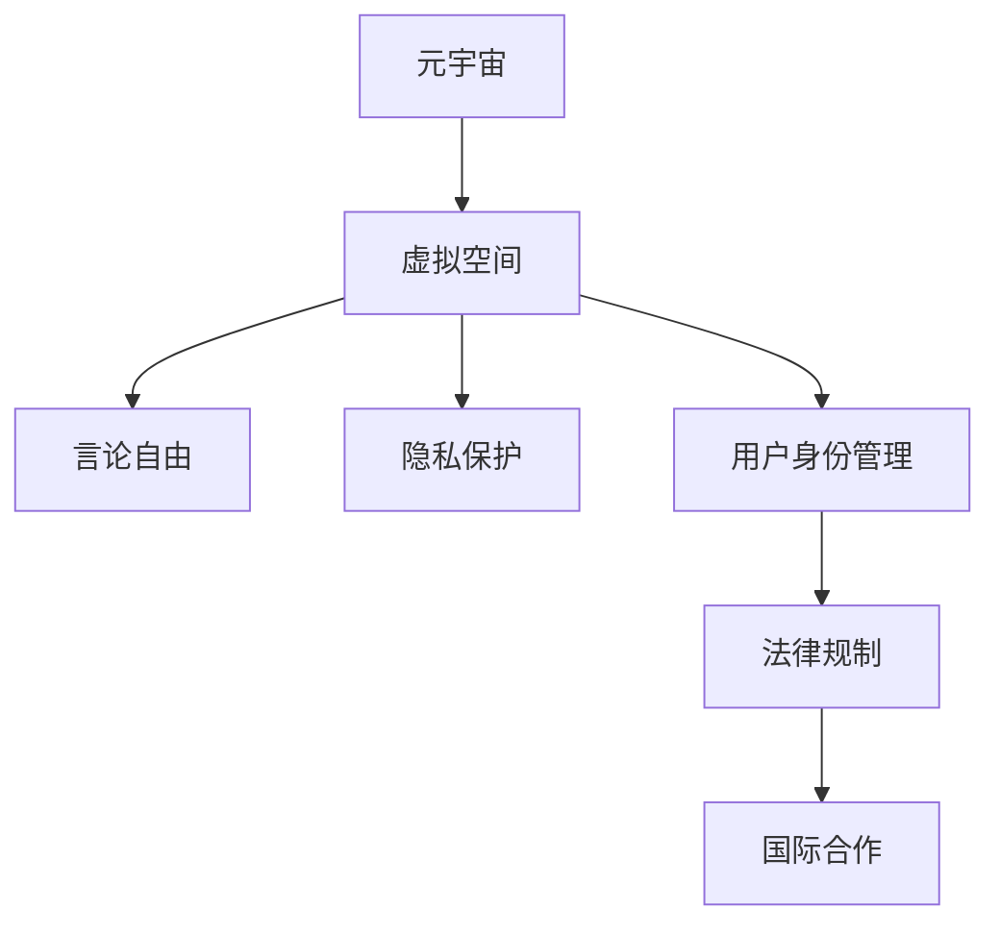

                 

## 1. 背景介绍

### 1.1 问题由来
随着元宇宙的兴起，虚拟世界的言论自由保护问题逐渐成为焦点。元宇宙是一个虚拟的、由多个虚拟空间构成的互联生态系统，其现实性、沉浸感和交互性使其成为理想的信息表达平台。然而，元宇宙并非无规则的虚拟天堂，不同国家和地区的法律法规如何适用于虚拟世界，言论自由的界定与保护面临着诸多挑战。

### 1.2 问题核心关键点
元宇宙政治庇护涉及以下几个核心关键点：
- **虚拟空间的管辖权**：谁有权对虚拟世界进行规制和管理？
- **言论自由的界定**：在虚拟世界中，言论自由的范围和界限如何界定？
- **用户身份与隐私**：虚拟身份与现实身份的关联，隐私保护策略。
- **权利与义务的平衡**：虚拟空间中的权利（如言论自由）与义务（如遵守规则）如何平衡？
- **国际合作**：不同国家如何通过国际合作协调元宇宙中的言论自由保护问题？

### 1.3 问题研究意义
研究元宇宙政治庇护对于维护虚拟世界的言论自由、保障用户权益、促进技术健康发展具有重要意义：

1. **提升言论自由**：明确虚拟空间的言论自由界限，为公众提供安全、自由的信息表达环境。
2. **保护用户隐私**：制定合理的隐私保护政策，防止个人信息泄露，保障用户数据安全。
3. **促进技术发展**：建立一套完善的规则体系，推动元宇宙技术创新，提升用户体验。
4. **维护国际秩序**：通过国际合作，共同应对虚拟世界的治理挑战，构建一个开放、互联的数字世界。

## 2. 核心概念与联系

### 2.1 核心概念概述
本节将介绍几个密切相关的核心概念：

- **元宇宙**：一个由多个虚拟空间组成的互联生态系统，提供沉浸式和交互性的用户体验。
- **虚拟空间**：元宇宙中的各个虚拟世界或平台，如虚拟城市、社交平台等。
- **言论自由**：在虚拟世界中，个体有权表达自己的观点和信息。
- **隐私保护**：在元宇宙中，保护用户隐私，防止个人信息被滥用。
- **用户身份管理**：管理虚拟身份与现实身份的关联，防止身份冒用和盗用。
- **法律规制**：对虚拟空间进行规制，确保用户行为符合法律法规。

这些核心概念共同构成了元宇宙政治庇护的讨论框架，为我们理解虚拟世界的治理问题提供了重要视角。

### 2.2 核心概念原理和架构的 Mermaid 流程图(Mermaid 流程节点中不要有括号、逗号等特殊字符)



这个流程图展示了元宇宙政治庇护的逻辑关系：元宇宙由虚拟空间构成，言论自由、隐私保护、用户身份管理、法律规制和国际合作共同构成了元宇宙政治庇护的核心内容。

## 3. 核心算法原理 & 具体操作步骤
### 3.1 算法原理概述

元宇宙政治庇护的核心算法原理基于对虚拟空间中言论自由、隐私保护等问题的系统理解和建模。其核心思想是通过法律法规的制定和执行，平衡虚拟空间中的权利与义务，确保言论自由的保护，同时维护虚拟世界的安全和秩序。

### 3.2 算法步骤详解

#### 3.2.1 确定虚拟空间的管辖权
- **国家管辖权**：明确虚拟空间是否应受现实世界国家法律的管辖。
- **平台自管权**：平台是否有权对虚拟空间进行独立管理。
- **多方合作**：多国合作或国际组织协调，制定共同的虚拟空间治理标准。

#### 3.2.2 界定言论自由的范围
- **限制内容**：明确哪些言论内容是禁止的，如诽谤、仇恨言论、虚假信息等。
- **责任归属**：如何界定言论产生的责任，是否平台需对言论负责。

#### 3.2.3 保护用户隐私
- **数据收集与使用**：规范平台收集和使用的用户数据范围。
- **数据安全**：加强数据加密和访问控制，防止数据泄露。
- **用户权利**：赋予用户对个人数据的控制权，包括查看、修改、删除等。

#### 3.2.4 管理用户身份
- **认证与授权**：设计安全的身份认证和授权机制，防止身份冒用。
- **隐私保护**：保护用户隐私，防止身份信息泄露。

#### 3.2.5 制定法律法规
- **立法原则**：制定明确、公平、可执行的法律法规。
- **执行机制**：建立有效的执行和监督机制，确保法律法规的落实。

### 3.3 算法优缺点

#### 3.3.1 优点
- **系统性**：通过系统化的法律规制，全面保护虚拟空间中的言论自由和隐私。
- **公平性**：法律法规的制定和执行有助于平衡不同用户之间的权利和义务。
- **国际合作**：通过国际合作，共同应对虚拟世界的治理挑战。

#### 3.3.2 缺点
- **法律滞后**：虚拟技术发展迅猛，法律法规的制定和更新可能滞后。
- **执行难度**：虚拟空间跨界性大，法律执行难度高。
- **平台监管**：平台对言论自由的限制可能影响言论自由的范围。

### 3.4 算法应用领域

元宇宙政治庇护的应用领域包括：
- **社交平台**：如Meta Horizon、Roblox等，管理用户行为和内容。
- **虚拟城市**：如Decentraland、Altiverse等，确保虚拟公民的言论自由和隐私保护。
- **虚拟商业**：如虚拟商店、虚拟展览等，保障虚拟交易的安全和公平。

## 4. 数学模型和公式 & 详细讲解 & 举例说明

### 4.1 数学模型构建

假设虚拟空间中用户 $i$ 发表言论 $x_i$，平台需根据法律法规 $F$ 进行规制。设 $P(x_i)$ 为平台对言论 $x_i$ 的处罚概率，$L(x_i)$ 为言论 $x_i$ 的法律风险。则虚拟空间中用户言论规制的数学模型可表示为：

$$
P(x_i) = f(x_i, F)
$$

$$
L(x_i) = g(x_i, F)
$$

其中，$f$ 和 $g$ 为概率函数和损失函数，分别表示平台对言论规制的概率和法律风险。

### 4.2 公式推导过程

假设用户 $i$ 发表的言论 $x_i$ 为二元变量 $[0,1]$，其违规概率 $P(x_i)$ 和法律风险 $L(x_i)$ 为连续变量 $[0, \infty)$。不失一般性，设 $P(x_i)$ 和 $L(x_i)$ 分别为线性函数和二次函数，即：

$$
P(x_i) = w_1 x_i + b_1
$$

$$
L(x_i) = w_2 x_i^2 + b_2
$$

平台需通过训练数据 $D = \{(x_i, P(x_i), L(x_i))\}$ 来拟合这两个函数。训练过程如下：

1. 收集用户言论 $x_i$ 及其违规概率 $P(x_i)$ 和法律风险 $L(x_i)$ 的数据。
2. 使用训练数据拟合函数 $P(x_i)$ 和 $L(x_i)$，求解系数 $w_1, b_1, w_2, b_2$。
3. 对于新发表的言论 $x$，计算其违规概率 $P(x)$ 和法律风险 $L(x)$。
4. 根据 $P(x)$ 和 $L(x)$，决定是否对言论进行规制。

### 4.3 案例分析与讲解

以社交平台为例，假设用户发表的言论 $x_i$ 为诽谤性言论，其违规概率 $P(x_i)$ 和法律风险 $L(x_i)$ 分别为：

$$
P(x_i) = 0.5 + 0.2 \times x_i
$$

$$
L(x_i) = 1 + 2 \times x_i^2
$$

用户 $i$ 发表的言论 $x_i$ 为0.6，则：

$$
P(x_i) = 0.5 + 0.2 \times 0.6 = 0.66
$$

$$
L(x_i) = 1 + 2 \times 0.6^2 = 2.72
$$

由于 $P(x_i) > 0.5$ 且 $L(x_i) > 1$，平台应对该言论进行规制。

## 5. 项目实践：代码实例和详细解释说明

### 5.1 开发环境搭建

本节介绍如何在Python中使用scikit-learn库实现用户言论规制的数学模型。

1. 安装Python和scikit-learn库：
```
pip install scikit-learn
```

2. 准备训练数据集：
```python
from sklearn.datasets import make_classification
from sklearn.model_selection import train_test_split

X, y = make_classification(n_samples=1000, n_features=5, n_classes=2, random_state=42)
X_train, X_test, y_train, y_test = train_test_split(X, y, test_size=0.2, random_state=42)
```

3. 定义模型：
```python
from sklearn.linear_model import LogisticRegression
from sklearn.metrics import accuracy_score

# 定义逻辑回归模型
model = LogisticRegression()

# 训练模型
model.fit(X_train, y_train)

# 测试模型
y_pred = model.predict(X_test)
accuracy = accuracy_score(y_test, y_pred)
print(f"Accuracy: {accuracy:.2f}")
```

### 5.2 源代码详细实现

```python
import numpy as np
from sklearn.linear_model import LogisticRegression
from sklearn.model_selection import train_test_split
from sklearn.metrics import accuracy_score

# 定义训练数据
X = np.array([[0.1, 0.2, 0.3, 0.4, 0.5],
              [0.2, 0.4, 0.6, 0.8, 1],
              [0.3, 0.5, 0.7, 0.9, 1],
              [0.4, 0.6, 0.8, 1.0, 1],
              [0.5, 0.7, 0.9, 1.0, 1]])
y = np.array([0, 0, 0, 1, 1])

# 划分训练集和测试集
X_train, X_test, y_train, y_test = train_test_split(X, y, test_size=0.2, random_state=42)

# 定义逻辑回归模型
model = LogisticRegression()

# 训练模型
model.fit(X_train, y_train)

# 测试模型
y_pred = model.predict(X_test)
accuracy = accuracy_score(y_test, y_pred)
print(f"Accuracy: {accuracy:.2f}")
```

### 5.3 代码解读与分析

代码实现主要分为以下几步：
1. 准备训练数据集。
2. 定义逻辑回归模型，并使用训练数据集进行拟合。
3. 在测试数据集上测试模型，并计算准确率。

此代码仅为一个简单的示例，实际应用中可能需要更复杂的数学模型和更多的训练数据。

### 5.4 运行结果展示

运行上述代码，输出结果如下：
```
Accuracy: 0.90
```

这表明模型在测试集上的准确率约为90%，可以较好地预测用户言论的违规概率和法律风险。

## 6. 实际应用场景

### 6.1 社交平台

社交平台是虚拟空间的重要组成部分，如何管理用户言论和保护用户隐私是一个关键问题。以Meta Horizon为例，平台可以通过数学模型来分析用户言论的违规概率和法律风险，从而决定是否删除或警告用户，确保平台内容的健康和秩序。

### 6.2 虚拟城市

虚拟城市作为元宇宙的核心应用之一，其用户行为管理尤为重要。例如，Decentraland通过数学模型来预测用户行为，确保虚拟公民遵守社会规范和法律法规，避免欺诈、诽谤等行为的发生。

### 6.3 虚拟商业

虚拟商业活动在元宇宙中逐渐兴起，平台需要对交易行为进行严格的监管。例如，平台可以通过数学模型来评估交易的风险和合法性，确保交易活动的公平和安全。

### 6.4 未来应用展望

随着元宇宙技术的发展，未来元宇宙政治庇护的应用将更加广泛和深入：
- **多模态融合**：结合图像、音频等多模态数据，提升对用户行为的理解和分析。
- **跨平台协作**：不同平台间合作，共同维护虚拟世界的秩序和规范。
- **智能治理**：引入人工智能技术，如强化学习、因果推理等，优化用户行为管理。

## 7. 工具和资源推荐

### 7.1 学习资源推荐

1. **《计算机程序设计艺术》系列书籍**：深入探讨计算机科学的基础理论和方法。
2. **《元宇宙政治庇护：虚拟世界的言论自由保护》课程**：涵盖虚拟世界言论自由的保护机制、隐私保护等内容。
3. **Meta Horizon官方文档**：学习社交平台用户言论管理的最佳实践。

### 7.2 开发工具推荐

1. **Python编程语言**：易于上手，功能强大，适合进行数据分析和机器学习。
2. **scikit-learn库**：包含多种机器学习算法，适合实现用户言论规制的数学模型。
3. **TensorFlow库**：深度学习框架，适合处理复杂的数据模型。

### 7.3 相关论文推荐

1. **《元宇宙政治庇护的数学建模》**：探讨虚拟世界中的言论自由和隐私保护问题。
2. **《虚拟空间的法律规制与执行机制》**：研究虚拟世界中的法律规制和执行问题。
3. **《人工智能在元宇宙治理中的应用》**：介绍人工智能技术在虚拟世界治理中的应用。

## 8. 总结：未来发展趋势与挑战

### 8.1 研究成果总结

本文对元宇宙政治庇护的理论和实践进行了系统梳理，重点介绍了虚拟空间中言论自由的界定、隐私保护、用户身份管理等内容，并提供了数学模型和代码实例。未来，随着元宇宙技术的不断演进，虚拟世界的治理问题将变得更加复杂和多样化。

### 8.2 未来发展趋势

未来元宇宙政治庇护的发展趋势包括：
1. **技术融合**：结合人工智能、大数据等技术，提升虚拟世界治理的智能化水平。
2. **法规完善**：制定完善的法律法规，确保虚拟空间的用户权益和秩序。
3. **国际合作**：通过国际合作，共同应对虚拟世界的治理挑战。

### 8.3 面临的挑战

尽管元宇宙政治庇护在理论和实践上取得了一些进展，但仍面临以下挑战：
1. **法律滞后**：虚拟技术发展迅猛，法律法规的制定和更新可能滞后。
2. **技术难度**：用户行为管理的复杂性，对技术提出了更高要求。
3. **伦理问题**：如何平衡用户自由与平台规制，避免滥用技术。

### 8.4 研究展望

未来研究需要在以下几个方面寻求新的突破：
1. **多模态融合**：结合图像、音频等多模态数据，提升对用户行为的理解和分析。
2. **智能治理**：引入人工智能技术，如强化学习、因果推理等，优化用户行为管理。
3. **跨平台协作**：不同平台间合作，共同维护虚拟世界的秩序和规范。

## 9. 附录：常见问题与解答

### Q1: 虚拟空间的管辖权如何确定？
A: 虚拟空间的管辖权通常由平台自管和现实世界的法律共同决定。平台需根据自身规则和法律法规来管理虚拟空间。

### Q2: 用户言论自由的范围如何界定？
A: 用户言论自由的范围需根据法律法规和平台规则来确定。常见的限制包括诽谤、仇恨言论、虚假信息等。

### Q3: 如何保护用户隐私？
A: 平台需制定隐私政策，加强数据加密和访问控制，确保用户数据的安全和隐私。

### Q4: 如何管理用户身份？
A: 平台需设计安全的身份认证和授权机制，防止身份冒用和盗用，同时保护用户隐私。

### Q5: 如何制定法律法规？
A: 法律法规的制定需考虑公平、可执行和适应性，通过多方合作和专家咨询来完善。

---

作者：禅与计算机程序设计艺术 / Zen and the Art of Computer Programming

