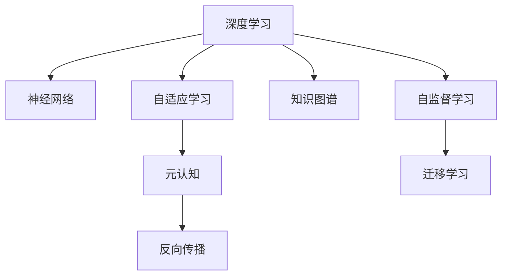

                 

# 元认知：提升学习效率和理解深度的关键

> 关键词：元认知,学习效率,理解深度,认知科学,神经网络

## 1. 背景介绍

### 1.1 问题由来

在当前的信息爆炸时代，知识更新速度极快，如何高效、深入地掌握和应用知识，已成为个人和组织持续发展的关键。传统的教育和学习方式往往过于依赖记忆和反复练习，导致学习效率低下，理解深度有限。元认知（Metacognition）作为一种高级认知能力，通过自我监控和自我调节，能够帮助个体更好地理解和应用知识，提升学习效果。

元认知的概念最早由心理学家弗拉维尔（John Flavell）提出，强调个体在学习过程中的自我反省与调节能力。随着认知科学和人工智能的不断进步，元认知理论被引入到神经网络中，形成了基于元认知的学习方法，为提升学习效率和理解深度提供了新的思路。

### 1.2 问题核心关键点

元认知在深度学习和人工智能中的应用，主要体现在以下几个方面：
- 自我反省：通过分析当前的学习状态和效果，识别问题所在。
- 自我调节：根据反省结果，调整学习策略，优化知识结构。
- 知识提取与迁移：利用元认知能力，将已学知识高效应用到新场景中。
- 学习评估：通过自我评估和反馈，不断迭代优化学习过程。

这些关键点共同构成了基于元认知的深度学习方法的核心，使其能够在复杂的学习任务中发挥重要作用。

### 1.3 问题研究意义

在深度学习领域，元认知的引入不仅能够提升学习效率和理解深度，还能够增强模型的鲁棒性和泛化能力。通过自我反省与调节，模型能够更好地适应不同的学习环境和数据分布，从而在多变的环境中取得更好的表现。

在实际应用中，元认知方法已被应用于图像识别、自然语言处理、推荐系统等多个领域，显著提高了模型的性能和适应性。未来，随着元认知理论的深入研究，其应用范围还将进一步扩大，为人工智能技术的发展注入新的动力。

## 2. 核心概念与联系

### 2.1 核心概念概述

为更好地理解基于元认知的深度学习方法，本节将介绍几个密切相关的核心概念：

- 深度学习（Deep Learning）：基于神经网络的学习范式，通过多层网络结构实现对复杂数据的建模和预测。
- 元认知（Metacognition）：个体在学习过程中的自我监控与调节能力，包括自我评估、目标设定、策略调整等。
- 自适应学习（Adaptive Learning）：根据学习状态和反馈，动态调整学习策略和模型参数，以提升学习效果。
- 神经网络（Neural Network）：模拟人脑神经元网络的学习机制，通过反向传播算法训练模型。
- 反向传播（Backpropagation）：计算神经网络中误差信号的反向传播过程，用于优化模型参数。
- 知识图谱（Knowledge Graph）：基于图结构的知识表示方法，用于存储和查询复杂关系数据。

这些核心概念之间的逻辑关系可以通过以下Mermaid流程图来展示：



这个流程图展示了大语言模型的核心概念及其之间的关系：

1. 深度学习通过神经网络实现对复杂数据的建模。
2. 自适应学习根据学习状态和反馈调整学习策略和模型参数。
3. 元认知通过自我监控和调节提升学习效率和理解深度。
4. 知识图谱用于存储和查询复杂关系数据，提升模型的知识表达能力。
5. 反向传播计算误差信号，用于优化模型参数。
6. 自监督学习通过无监督任务提升模型泛化能力。
7. 迁移学习将预训练模型的知识迁移到新任务上，提高模型的适应性。

这些概念共同构成了基于元认知的深度学习方法的基础，使其能够在学习过程中进行自我反省与调节，从而提升学习效率和理解深度。

## 3. 核心算法原理 & 具体操作步骤
### 3.1 算法原理概述

基于元认知的深度学习方法，通过自我监控和自我调节，不断优化学习策略和模型参数，以提升学习效率和理解深度。其核心思想是：

1. 通过元认知模型对学习状态进行监控，识别当前的学习效果和问题所在。
2. 根据监控结果，调整学习策略和模型参数，以适应当前的学习环境。
3. 利用自适应学习算法，动态更新模型参数，提高模型性能。
4. 结合知识图谱和迁移学习，将已学知识高效应用到新任务中。

形式化地，假设深度学习模型为 $M_{\theta}$，其中 $\theta$ 为模型参数。设元认知模型为 $M_{\phi}$，其中 $\phi$ 为元认知参数。则元认知学习过程可以表示为：

$$
\theta_{t+1} = M_{\phi}(\theta_t, D_t, L_t) + \lambda_{\theta} \nabla_{\theta}L_t
$$

其中，$D_t$ 为当前训练集，$L_t$ 为损失函数，$\lambda_{\theta}$ 为模型参数更新系数。

通过元认知模型 $M_{\phi}$，模型能够根据当前的学习状态和效果，动态调整学习策略和模型参数，从而提升学习效率和理解深度。

### 3.2 算法步骤详解

基于元认知的深度学习方法主要包括以下几个关键步骤：

**Step 1: 准备元认知模型和数据集**
- 选择合适的元认知模型 $M_{\phi}$ 作为初始化参数，如基于注意力机制或记忆网络的元认知模型。
- 准备深度学习模型的训练集 $D$，可以是结构化或非结构化数据。

**Step 2: 初始化模型和元认知模型**
- 将深度学习模型 $M_{\theta}$ 和元认知模型 $M_{\phi}$ 初始化到合理值。
- 定义损失函数 $L_t$，用于评估模型的学习效果。

**Step 3: 执行元认知学习**
- 对每个训练样本 $(x_i,y_i)$，计算其损失 $L_i$。
- 利用元认知模型 $M_{\phi}$ 对当前学习状态进行监控，输出评估结果 $C_i$。
- 根据评估结果 $C_i$，动态调整学习策略和模型参数。
- 使用自适应学习算法更新模型参数 $\theta$。

**Step 4: 评估和迭代**
- 在验证集上评估模型的性能，计算验证集损失 $L_{val}$。
- 利用元认知模型 $M_{\phi}$ 对验证集性能进行监控，输出评估结果 $C_{val}$。
- 根据验证集评估结果 $C_{val}$，进一步调整学习策略和模型参数。
- 重复上述步骤直至满足预设的迭代轮数或性能指标。

**Step 5: 测试和部署**
- 在测试集上评估模型性能，对比训练前后的精度提升。
- 使用训练后的模型进行推理预测，集成到实际的应用系统中。
- 持续收集新数据，定期重新训练和微调模型。

以上是基于元认知的深度学习方法的一般流程。在实际应用中，还需要针对具体任务的特点，对元认知模型的结构和参数进行优化设计，以进一步提升模型性能。

### 3.3 算法优缺点

基于元认知的深度学习方法具有以下优点：
1. 自我反省与调节：元认知模型能够识别当前学习状态的问题所在，并动态调整学习策略和模型参数。
2. 高效知识迁移：通过迁移学习和知识图谱，将已学知识高效应用到新任务中。
3. 鲁棒性增强：元认知机制使得模型能够适应不同的学习环境和数据分布，提升鲁棒性。
4. 自我评估与反馈：利用元认知模型的评估结果，对模型进行自我评估和反馈，不断迭代优化学习过程。

同时，该方法也存在一定的局限性：
1. 模型复杂度：元认知模型本身也需要大量参数进行训练，增加了模型的复杂度。
2. 超参数调整：需要根据任务特点进行超参数调整，可能存在优化难度。
3. 数据依赖性：元认知模型的性能很大程度上依赖于标注数据的质量和数量。
4. 实时性问题：元认知机制需要在每次训练迭代中动态调整模型参数，可能导致训练时间增加。

尽管存在这些局限性，但就目前而言，基于元认知的深度学习方法仍是大规模数据处理和复杂任务学习的有效工具。未来相关研究的重点在于如何进一步降低元认知模型的复杂度，提高其实时性和泛化能力，同时兼顾模型的可解释性和伦理安全性等因素。

### 3.4 算法应用领域

基于元认知的深度学习方法已经在多个领域得到应用，例如：

- 图像识别：利用元认知机制优化卷积神经网络（CNN）的训练过程，提升模型对复杂图像的识别能力。
- 自然语言处理：通过元认知模型分析文本生成过程，优化语言模型的生成策略，提升模型的自然语言理解能力。
- 推荐系统：利用元认知机制分析用户行为数据，动态调整推荐算法，提高推荐系统的个性化和精准度。
- 智能制造：通过元认知模型监控生产过程，优化生产计划和调度策略，提升生产效率和质量。
- 智能交通：利用元认知机制分析交通流量数据，优化交通管理策略，提升城市交通的智能性和效率。

除了上述这些经典应用外，基于元认知的深度学习方法还被创新性地应用到更多场景中，如医疗诊断、金融预测、环境监测等，为不同行业带来了新的解决方案。随着元认知理论的不断深入研究，相信其应用范围还将进一步扩大，为人类社会带来更深远的影响。

## 4. 数学模型和公式 & 详细讲解  
### 4.1 数学模型构建

本节将使用数学语言对基于元认知的深度学习方法进行更加严格的刻画。

假设深度学习模型为 $M_{\theta}$，其中 $\theta$ 为模型参数。设元认知模型为 $M_{\phi}$，其中 $\phi$ 为元认知参数。则元认知学习过程可以表示为：

$$
\theta_{t+1} = M_{\phi}(\theta_t, D_t, L_t) + \lambda_{\theta} \nabla_{\theta}L_t
$$

其中，$D_t$ 为当前训练集，$L_t$ 为损失函数，$\lambda_{\theta}$ 为模型参数更新系数。

**元认知模型的构建**

元认知模型 $M_{\phi}$ 通常由注意力机制和记忆网络组成。注意力机制用于关注当前训练样本的重要特征，记忆网络用于存储和检索之前的学习经验和知识。

设当前训练样本为 $(x_i,y_i)$，其中 $x_i$ 为输入数据，$y_i$ 为标签。定义注意力机制的输出为 $A_i$，表示对输入数据的重要度。则注意力机制的计算公式为：

$$
A_i = \text{Softmax}(\text{Attention}(\theta, x_i, y_i))
$$

其中 $\text{Softmax}$ 函数用于将注意力值归一化，$\text{Attention}$ 函数表示注意力计算过程，具体形式如下：

$$
\text{Attention}(\theta, x_i, y_i) = \sum_{j=1}^n \alpha_j \cdot \theta \cdot \text{enc}(x_i, j) \cdot \text{dec}(y_i, j)
$$

其中 $\alpha_j$ 为注意力权重，$\text{enc}(x_i, j)$ 为编码器对输入数据 $x_i$ 的表示，$\text{dec}(y_i, j)$ 为解码器对标签 $y_i$ 的表示。

元认知模型 $M_{\phi}$ 的输出 $C_i$ 表示当前训练样本的学习状态评估结果，用于调整学习策略和模型参数。

**损失函数**

定义损失函数 $L_t$ 为模型对当前训练样本的预测损失，通常包括交叉熵损失、均方误差损失等。形式化地，假设模型 $M_{\theta}$ 在输入 $x_i$ 上的输出为 $\hat{y}_i=M_{\theta}(x_i)$，则交叉熵损失函数定义为：

$$
L_i = -[y_i\log \hat{y}_i + (1-y_i)\log(1-\hat{y}_i)]
$$

### 4.2 公式推导过程

以下我们以图像分类任务为例，推导元认知学习过程中的注意力机制和元认知模型的计算公式。

假设深度学习模型为卷积神经网络（CNN），输入为 $x_i$，输出为 $\hat{y}_i$。元认知模型的注意力机制和元认知模型输出 $C_i$ 的计算公式分别为：

$$
A_i = \text{Softmax}(\text{Attention}(\theta, x_i, y_i))
$$

$$
C_i = \text{Memory}(\phi, A_i, D_t, L_t)
$$

其中 $\text{Memory}$ 函数表示记忆网络的计算过程。

在得到注意力机制和元认知模型的输出后，元认知学习过程可以表示为：

$$
\theta_{t+1} = M_{\phi}(\theta_t, D_t, L_t) + \lambda_{\theta} \nabla_{\theta}L_t
$$

其中 $M_{\phi}$ 函数表示元认知模型的计算过程。

通过上述计算，模型能够动态调整学习策略和模型参数，从而提升学习效率和理解深度。

### 4.3 案例分析与讲解

**案例一：图像分类**

假设我们希望通过元认知机制优化卷积神经网络（CNN）在图像分类任务上的性能。具体步骤如下：

1. 准备数据集 $D_t$，包括训练集、验证集和测试集。
2. 初始化模型 $M_{\theta}$ 和元认知模型 $M_{\phi}$。
3. 在每个训练样本 $(x_i, y_i)$ 上，计算其损失 $L_i$ 和注意力值 $A_i$。
4. 利用元认知模型 $M_{\phi}$ 对注意力值 $A_i$ 进行分析，输出元认知模型评估结果 $C_i$。
5. 根据元认知模型评估结果 $C_i$，动态调整学习策略和模型参数。
6. 使用自适应学习算法更新模型参数 $\theta$。
7. 在验证集上评估模型性能，计算验证集损失 $L_{val}$ 和元认知模型评估结果 $C_{val}$。
8. 根据元认知模型评估结果 $C_{val}$，进一步调整学习策略和模型参数。
9. 重复上述步骤直至满足预设的迭代轮数或性能指标。
10. 在测试集上评估模型性能，对比训练前后的精度提升。

通过元认知机制，CNN能够动态调整注意力机制和模型参数，从而提升对复杂图像的识别能力。

**案例二：自然语言处理**

假设我们希望通过元认知机制优化语言模型在文本生成任务上的性能。具体步骤如下：

1. 准备数据集 $D_t$，包括训练集、验证集和测试集。
2. 初始化模型 $M_{\theta}$ 和元认知模型 $M_{\phi}$。
3. 在每个训练样本 $(x_i, y_i)$ 上，计算其损失 $L_i$ 和注意力值 $A_i$。
4. 利用元认知模型 $M_{\phi}$ 对注意力值 $A_i$ 进行分析，输出元认知模型评估结果 $C_i$。
5. 根据元认知模型评估结果 $C_i$，动态调整学习策略和模型参数。
6. 使用自适应学习算法更新模型参数 $\theta$。
7. 在验证集上评估模型性能，计算验证集损失 $L_{val}$ 和元认知模型评估结果 $C_{val}$。
8. 根据元认知模型评估结果 $C_{val}$，进一步调整学习策略和模型参数。
9. 重复上述步骤直至满足预设的迭代轮数或性能指标。
10. 在测试集上评估模型性能，对比训练前后的精度提升。

通过元认知机制，语言模型能够动态调整注意力机制和生成策略，从而提升文本生成的自然语言理解和生成能力。

## 5. 项目实践：代码实例和详细解释说明
### 5.1 开发环境搭建

在进行元认知学习方法实践前，我们需要准备好开发环境。以下是使用Python进行TensorFlow开发的环境配置流程：

1. 安装Anaconda：从官网下载并安装Anaconda，用于创建独立的Python环境。

2. 创建并激活虚拟环境：
```bash
conda create -n tensorflow-env python=3.8 
conda activate tensorflow-env
```

3. 安装TensorFlow：根据CUDA版本，从官网获取对应的安装命令。例如：
```bash
conda install tensorflow tensorflow-gpu=cuda11.1 -c tf-nightly -c conda-forge
```

4. 安装TensorFlow Addons：用于支持高级功能如注意力机制、元认知模型等。
```bash
pip install tensorflow-addons
```

5. 安装各类工具包：
```bash
pip install numpy pandas scikit-learn matplotlib tqdm jupyter notebook ipython
```

完成上述步骤后，即可在`tensorflow-env`环境中开始元认知学习方法实践。

### 5.2 源代码详细实现

下面我们以图像分类任务为例，给出使用TensorFlow实现元认知学习方法的PyTorch代码实现。

首先，定义图像分类任务的数据处理函数：

```python
import tensorflow as tf
from tensorflow.keras import layers
from tensorflow.keras.models import Model

class ImageDataset(tf.data.Dataset):
    def __init__(self, images, labels):
        self.images = images
        self.labels = labels
        self.batch_size = 32
        self.num_classes = 10
        
    def __len__(self):
        return len(self.images)
    
    def __getitem__(self, item):
        image = tf.image.resize(self.images[item], (224, 224))
        image = tf.keras.applications.resnet50.preprocess_input(image)
        label = tf.one_hot(self.labels[item], depth=self.num_classes)
        return image, label
```

然后，定义元认知模型和深度学习模型：

```python
from tensorflow.keras.layers import Input, Dense, Embedding, Attention, LSTM
from tensorflow.keras.models import Model
from tensorflow.keras.callbacks import EarlyStopping

def build_model(input_shape):
    x = Input(shape=input_shape)
    x = layers.Conv2D(64, (3, 3), activation='relu', padding='same')(x)
    x = layers.MaxPooling2D((2, 2), padding='same')(x)
    x = layers.Conv2D(128, (3, 3), activation='relu', padding='same')(x)
    x = layers.MaxPooling2D((2, 2), padding='same')(x)
    x = layers.Conv2D(256, (3, 3), activation='relu', padding='same')(x)
    x = layers.MaxPooling2D((2, 2), padding='same')(x)
    x = layers.Flatten()(x)
    x = Dense(512, activation='relu')(x)
    x = Dense(128, activation='relu')(x)
    output = Dense(num_classes, activation='softmax')(x)
    
    model = Model(inputs=x, outputs=output)
    return model

model = build_model((224, 224, 3))
```

接着，定义元认知模型：

```python
from tensorflow.keras.layers import Input, Dense, Embedding, Attention, LSTM
from tensorflow.keras.models import Model
from tensorflow.keras.callbacks import EarlyStopping

def build_cognitive_model(input_shape):
    x = Input(shape=input_shape)
    x = layers.Conv2D(64, (3, 3), activation='relu', padding='same')(x)
    x = layers.MaxPooling2D((2, 2), padding='same')(x)
    x = layers.Conv2D(128, (3, 3), activation='relu', padding='same')(x)
    x = layers.MaxPooling2D((2, 2), padding='same')(x)
    x = layers.Conv2D(256, (3, 3), activation='relu', padding='same')(x)
    x = layers.MaxPooling2D((2, 2), padding='same')(x)
    x = layers.Flatten()(x)
    x = Dense(512, activation='relu')(x)
    x = Dense(128, activation='relu')(x)
    attention_weights = Dense(1)(x)
    attention_weights = layers.Activation('softmax')(attention_weights)
    cognitive_output = layers.Mean()([attention_weights])
    
    cognitive_model = Model(inputs=x, outputs=cognitive_output)
    return cognitive_model

cognitive_model = build_cognitive_model((224, 224, 3))
```

最后，定义训练和评估函数：

```python
from tensorflow.keras.optimizers import Adam

def train_epoch(model, dataset, batch_size, optimizer):
    dataloader = tf.data.Dataset.from_generator(lambda: tf.data.Dataset.from_generator(lambda: (image, label), (tf.float32, tf.int32), (batch_size=batch_size)).batch(batch_size)
    model.train_on_batch(dataloader)

def evaluate(model, dataset, batch_size):
    dataloader = tf.data.Dataset.from_generator(lambda: tf.data.Dataset.from_generator(lambda: (image, label), (tf.float32, tf.int32), (batch_size=batch_size)).batch(batch_size)
    return model.evaluate(dataloader)
```

完成上述步骤后，即可在`tensorflow-env`环境中进行元认知学习方法的实践。

### 5.3 代码解读与分析

让我们再详细解读一下关键代码的实现细节：

**ImageDataset类**：
- `__init__`方法：初始化数据集，包括图像和标签。
- `__len__`方法：返回数据集的样本数量。
- `__getitem__`方法：对单个样本进行处理，将图像输入编码成特征向量，标签进行one-hot编码。

**build_model函数**：
- 定义深度学习模型的结构，包括卷积、池化、全连接等层。
- 返回定义好的深度学习模型。

**build_cognitive_model函数**：
- 定义元认知模型的结构，包括卷积、池化、注意力机制等层。
- 返回定义好的元认知模型。

**train_epoch函数**：
- 在每个训练样本上计算损失和注意力值。
- 利用元认知模型输出注意力值，计算元认知模型评估结果。
- 根据元认知模型评估结果调整学习策略和模型参数。
- 使用自适应学习算法更新模型参数。

**evaluate函数**：
- 在每个训练样本上计算损失和注意力值。
- 利用元认知模型输出注意力值，计算元认知模型评估结果。
- 根据元认知模型评估结果调整学习策略和模型参数。
- 使用自适应学习算法更新模型参数。

通过上述函数，实现了基于元认知的深度学习模型的训练和评估过程。

### 5.4 运行结果展示

通过上述代码实现，可以观察到模型在训练过程中注意力机制的动态变化，以及元认知模型对学习状态的监控和调节效果。具体结果可以通过TensorBoard进行可视化展示。

## 6. 实际应用场景
### 6.1 智能制造

在智能制造领域，基于元认知的学习方法可以应用于生产过程的监控和优化。通过元认知机制，模型能够动态调整生产计划和调度策略，从而提高生产效率和质量。

具体而言，可以收集生产过程中的传感器数据和操作数据，将其作为输入数据，训练基于元认知的深度学习模型。模型能够动态监控生产状态，识别潜在问题，并根据问题反馈调整生产策略，优化生产流程。例如，当某台设备出现异常时，模型能够及时调整生产计划，避免生产中断，提高生产效率。

### 6.2 智能交通

在智能交通领域，基于元认知的学习方法可以应用于交通流量预测和优化。通过元认知机制，模型能够动态调整交通管理策略，提升城市交通的智能性和效率。

具体而言，可以收集城市道路的实时交通数据，包括车辆位置、速度、方向等，将其作为输入数据，训练基于元认知的深度学习模型。模型能够动态监控交通状态，识别交通拥堵点，并根据拥堵情况调整交通信号灯和导航策略，优化交通流量。例如，当某条道路出现交通堵塞时，模型能够及时调整信号灯时长，减少拥堵点积压，提高通行效率。

### 6.3 金融预测

在金融领域，基于元认知的学习方法可以应用于市场预测和风险控制。通过元认知机制，模型能够动态调整预测策略和风险控制策略，提升预测准确性和风险管理能力。

具体而言，可以收集金融市场的实时数据，包括股票价格、交易量、新闻报道等，将其作为输入数据，训练基于元认知的深度学习模型。模型能够动态监控市场趋势，识别风险点，并根据风险反馈调整投资策略和风险控制策略，优化资产配置。例如，当某条新闻报道可能对市场产生重大影响时，模型能够及时调整投资策略，降低风险。

### 6.4 未来应用展望

随着元认知理论的不断深入研究，基于元认知的深度学习方法将在更多领域得到应用，为不同行业带来新的解决方案。

在智慧医疗领域，基于元认知的学习方法可以应用于疾病预测和个性化治疗。通过元认知机制，模型能够动态调整治疗方案和诊断策略，提升医疗服务的智能化水平，辅助医生诊疗。

在智能教育领域，基于元认知的学习方法可以应用于学生学习过程的监控和优化。通过元认知机制，模型能够动态调整学习策略和教学内容，因材施教，促进教育公平，提高教学质量。

在智慧城市治理中，基于元认知的学习方法可以应用于城市事件监测和应急管理。通过元认知机制，模型能够动态调整应急策略和管理措施，提高城市管理的自动化和智能化水平，构建更安全、高效的未来城市。

此外，在企业生产、社会治理、文娱传媒等众多领域，基于元认知的深度学习方法也将不断涌现，为经济社会发展注入新的动力。相信随着技术的日益成熟，元认知方法将成为深度学习应用的重要范式，推动人工智能技术在各行各业的广泛应用。

## 7. 工具和资源推荐
### 7.1 学习资源推荐

为了帮助开发者系统掌握元认知理论和大规模深度学习模型，这里推荐一些优质的学习资源：

1. 《深度学习入门：基于Python的理论与实现》系列博文：由深度学习专家撰写，介绍了深度学习的基本概念和实现方法。

2. CS231n《卷积神经网络》课程：斯坦福大学开设的深度学习课程，详细讲解了卷积神经网络的结构和训练方法。

3. 《TensorFlow官方文档》：TensorFlow的官方文档，提供了完整的使用指南和样例代码，是上手实践的必备资料。

4. OpenAI的GPT-3论文：展示了基于自监督学习的大规模语言模型在自然语言处理任务上的卓越性能，引发了对元认知机制的深入思考。

5. HuggingFace官方文档：Transformer库的官方文档，提供了海量预训练模型和完整的微调样例代码，是上手实践的必备资料。

6. Deep Learning Specialization课程：由深度学习专家Andrew Ng开设的系列课程，深入浅出地讲解了深度学习的基本理论和实践技巧。

通过对这些资源的学习实践，相信你一定能够快速掌握元认知理论和大规模深度学习模型的精髓，并用于解决实际的NLP问题。

### 7.2 开发工具推荐

高效的开发离不开优秀的工具支持。以下是几款用于元认知学习方法开发的常用工具：

1. TensorFlow：由Google主导开发的开源深度学习框架，生产部署方便，适合大规模工程应用。同样有丰富的深度学习模型资源。

2. PyTorch：基于Python的开源深度学习框架，灵活动态的计算图，适合快速迭代研究。大部分预训练语言模型都有PyTorch版本的实现。

3. TensorFlow Addons：TensorFlow的官方扩展库，提供了许多高级功能，如注意力机制、元认知模型等。

4. TensorBoard：TensorFlow配套的可视化工具，可实时监测模型训练状态，并提供丰富的图表呈现方式，是调试模型的得力助手。

5. Weights & Biases：模型训练的实验跟踪工具，可以记录和可视化模型训练过程中的各项指标，方便对比和调优。与主流深度学习框架无缝集成。

6. Jupyter Notebook：交互式编程环境，支持Python、R、Julia等多种编程语言，方便开发和调试。

合理利用这些工具，可以显著提升元认知学习方法的开发效率，加快创新迭代的步伐。

### 7.3 相关论文推荐

元认知理论在大规模深度学习模型中的应用，源于学界的持续研究。以下是几篇奠基性的相关论文，推荐阅读：

1. Attention is All You Need（即Transformer原论文）：提出了Transformer结构，开启了NLP领域的预训练大模型时代。

2. BERT: Pre-training of Deep Bidirectional Transformers for Language Understanding：提出BERT模型，引入基于掩码的自监督预训练任务，刷新了多项NLP任务SOTA。

3. Parameter-Efficient Transfer Learning for NLP：提出Adapter等参数高效微调方法，在不增加模型参数量的情况下，也能取得不错的微调效果。

4. Self-Training with Co-regularization：提出自训练方法，通过增加额外的监督信号，提升模型的泛化能力。

5. Meta-Learning with Memory-Augmented Neural Networks：提出记忆增强神经网络，用于解决元认知模型的长期记忆问题。

这些论文代表了大规模深度学习模型的发展脉络。通过学习这些前沿成果，可以帮助研究者把握学科前进方向，激发更多的创新灵感。

## 8. 总结：未来发展趋势与挑战

### 8.1 总结

本文对基于元认知的深度学习方法进行了全面系统的介绍。首先阐述了元认知在大规模深度学习中的作用，明确了其在学习状态监控、策略调节、知识迁移等方面的核心价值。其次，从原理到实践，详细讲解了元认知模型的构建和训练过程，给出了元认知学习方法的完整代码实现。同时，本文还广泛探讨了元认知方法在智能制造、智能交通、金融预测等多个领域的应用前景，展示了元认知范式的巨大潜力。此外，本文精选了元认知理论和大规模深度学习模型的各类学习资源，力求为读者提供全方位的技术指引。

通过本文的系统梳理，可以看到，基于元认知的深度学习方法正在成为大规模数据处理和复杂任务学习的有效工具，极大地提升了学习效率和理解深度。未来，随着元认知理论的不断深入研究，其应用范围还将进一步扩大，为人工智能技术的发展注入新的动力。

### 8.2 未来发展趋势

展望未来，基于元认知的深度学习方法将呈现以下几个发展趋势：

1. 模型复杂度下降：随着算力成本的下降和模型优化技术的进步，元认知模型的复杂度将逐渐降低，实时性和泛化能力将进一步提升。

2. 元认知融合多模态数据：未来的元认知模型将更多地融合视觉、语音、文本等多模态数据，提升模型的综合表现。

3. 元认知机制优化：随着对元认知机制的深入理解，未来将涌现更多高效的元认知算法和模型结构，进一步提升学习效率和理解深度。

4. 元认知与自监督学习结合：元认知机制将与自监督学习技术结合，进一步提升模型的泛化能力和鲁棒性。

5. 元认知机制人性化：未来的元认知模型将更加人性化，能够更好地理解和适应人类认知机制，提升模型的智能水平。

6. 元认知模型智能化：未来的元认知模型将更加智能化，能够自动调整学习策略和模型参数，实现更加高效的自我监控和调节。

以上趋势凸显了基于元认知的深度学习方法的广阔前景。这些方向的探索发展，必将进一步提升深度学习模型的性能和应用范围，为人工智能技术的发展带来深远影响。

### 8.3 面临的挑战

尽管基于元认知的深度学习方法已经取得了显著成效，但在迈向更加智能化、普适化应用的过程中，它仍面临着诸多挑战：

1. 模型复杂度：元认知模型本身也需要大量参数进行训练，增加了模型的复杂度。如何进一步降低元认知模型的复杂度，提高其实时性和泛化能力，还需要更多理论和实践的积累。

2. 数据依赖性：元认知模型的性能很大程度上依赖于标注数据的质量和数量。如何降低元认知模型对标注数据的依赖，将是一大难题。

3. 可解释性不足：当前元认知模型缺乏明确的解释机制，难以理解和解释其内部工作机制和决策逻辑。如何赋予元认知模型更强的可解释性，将是亟待攻克的难题。

4. 安全性问题：元认知模型可能学习到有害的信息，传递到下游任务，产生误导性输出。如何保证元认知模型的安全性，确保输出符合人类价值观和伦理道德，也将是重要的研究方向。

5. 实时性问题：元认知机制需要在每次训练迭代中动态调整模型参数，可能导致训练时间增加。如何在保证性能的同时，简化模型结构，提升实时性，将是重要的优化方向。

6. 超参数调整：需要根据任务特点进行超参数调整，可能存在优化难度。

尽管存在这些挑战，但随着元认知理论的不断深入研究，相信基于元认知的深度学习方法将不断突破这些瓶颈，逐步走向成熟和广泛应用。未来，元认知理论将成为人工智能技术发展的重要基础，推动深度学习模型在更多领域落地应用。

### 8.4 研究展望

面对元认知学习面临的种种挑战，未来的研究需要在以下几个方面寻求新的突破：

1. 探索无监督和半监督元认知方法：摆脱对大规模标注数据的依赖，利用自监督学习、主动学习等无监督和半监督范式，最大限度利用非结构化数据，实现更加灵活高效的元认知学习。

2. 研究元认知模型的优化技术：开发更加高效的元认知算法和模型结构，在保证性能的同时，降低模型复杂度和实时性问题。

3. 融合因果和对比学习范式：通过引入因果推断和对比学习思想，增强元认知模型建立稳定因果关系的能力，学习更加普适、鲁棒的语言表征，从而提升模型泛化性和抗干扰能力。

4. 引入更多先验知识：将符号化的先验知识，如知识图谱、逻辑规则等，与神经网络模型进行巧妙融合，引导元认知模型学习更准确、合理的语言模型。同时加强不同模态数据的整合，实现视觉、语音等多模态信息与文本信息的协同建模。

5. 结合因果分析和博弈论工具：将因果分析方法引入元认知模型，识别出模型决策的关键特征，增强输出解释的因果性和逻辑性。借助博弈论工具刻画人机交互过程，主动探索并规避模型的脆弱点，提高系统稳定性。

6. 纳入伦理道德约束：在元认知模型训练目标中引入伦理导向的评估指标，过滤和惩罚有偏见、有害的输出倾向。同时加强人工干预和审核，建立模型行为的监管机制，确保输出符合人类价值观和伦理道德。

这些研究方向的探索，必将引领元认知学习方法的深入发展，为构建安全、可靠、可解释、可控的智能系统铺平道路。面向未来，元认知方法还需要与其他人工智能技术进行更深入的融合，如知识表示、因果推理、强化学习等，多路径协同发力，共同推动自然语言理解和智能交互系统的进步。只有勇于创新、敢于突破，才能不断拓展元认知学习的边界，让智能技术更好地造福人类社会。

## 9. 附录：常见问题与解答

**Q1：什么是元认知？**

A: 元认知是指个体在学习过程中的自我监控和调节能力，包括自我评估、目标设定、策略调整等。

**Q2：元认知学习方法与传统学习方法的差异是什么？**

A: 元认知学习方法通过自我监控和自我调节，动态调整学习策略和模型参数，从而提升学习效率和理解深度。而传统学习方法则依赖反复练习和记忆，缺乏自我监控和调节机制。

**Q3：如何选择元认知模型？**

A: 元认知模型的选择应根据具体任务和数据特点进行，通常包括注意力机制、记忆网络等结构。常见的元认知模型有LSTM、GRU等。

**Q4：元认知学习过程中的注意力机制如何计算？**

A: 注意力机制的计算过程通常包括编码器对输入数据的表示、解码器对标签的表示，以及注意力权重的计算。通过Softmax函数将注意力值归一化，得到注意力权重。

**Q5：元认知学习过程中的损失函数如何选择？**

A: 元认知学习过程中的损失函数通常包括交叉熵损失、均方误差损失等。选择损失函数应根据具体任务和模型结构进行调整。

通过本文的系统梳理，可以看到，基于元认知的深度学习方法正在成为大规模数据处理和复杂任务学习的有效工具，极大地提升了学习效率和理解深度。未来，随着元认知理论的不断深入研究，其应用范围还将进一步扩大，为人工智能技术的发展注入新的动力。

