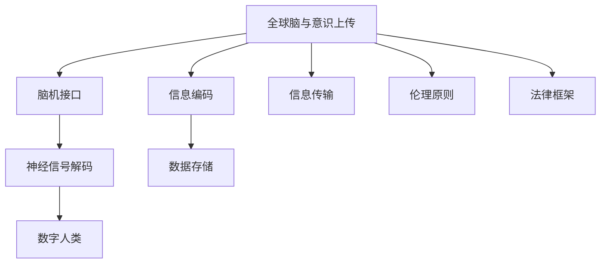

                 

# 全球脑与意识上传伦理:数字化永生的哲学与法律思考

## 1. 背景介绍

### 1.1 问题由来
随着科技的飞速发展，尤其是人工智能、脑科学和生物技术的交叉融合，数字化永生这一科幻概念逐渐变得现实。全球脑与意识上传技术（全脑上传，即从大脑记录其信息并将其数字化上传至计算机，进而实现意识的延续）开始进入人们的视野。数字化永生的概念引发了伦理、哲学和法律的广泛讨论。

### 1.2 问题核心关键点
- 数字化永生的定义和本质：人类意识的数字化和上传，即保存、复制并永久保存人类的大脑信息。
- 技术基础：脑机接口(Brain-Computer Interface, BCI)、深度学习、人工智能、基因编辑和神经科学等。
- 伦理争议：涉及生命权、隐私权、知情权、人格尊严等。
- 法律挑战：如何界定数字人类权利、侵权责任、监管规范等。
- 社会影响：人类意识的延续和扩展，可能带来的社会结构、价值观和生活方式的变化。

### 1.3 问题研究意义
研究数字化永生的伦理和法律问题，对于确保技术进步的同时，维护人类尊严、权利和福祉具有重要意义。数字化永生不仅涉及个人隐私和人格权利，还对未来的社会结构、文化和社会治理提出新的挑战。

## 2. 核心概念与联系

### 2.1 核心概念概述

本节将介绍几个与数字化永生密切相关的核心概念：

- 全球脑与意识上传（Full Brain Upload, FBU）：将人类的大脑信息完整记录并上传至计算机，实现人类意识的永久保存和延续。
- 全脑上传技术：包括脑机接口、神经信号解码、信息编码与传输等关键技术。
- 数字人类（Digital Human, DH）：意识上传后生成的虚拟人，具有与真人相似的认知、情感和行为。
- 伦理原则：包括尊重生命、自主选择、知情同意、公平正义等。
- 法律框架：涉及知识产权、隐私权保护、侵权责任、责任主体等。

### 2.2 核心概念原理和架构的 Mermaid 流程图



这个流程图展示了数字化永生的核心技术路径和伦理法律框架的联系：

1. 全球脑与意识上传通过脑机接口获取神经信号，解码出脑部信息，进行编码后通过信息传输上传至数据存储。
2. 上传的数据生成数字人类，具备完整的认知和情感。
3. 这一过程受到伦理原则和法律框架的约束，保障人的尊严、权利和隐私。

## 3. 核心算法原理 & 具体操作步骤

### 3.1 算法原理概述

数字化永生的核心在于意识上传和数字人类生成。算法原理大致包括以下几个步骤：

1. 神经信号采集与预处理：使用脑机接口获取大脑的神经信号。
2. 神经信号解码：将采集到的神经信号解码为脑部信息。
3. 信息编码与传输：将脑部信息编码成数字信号，并上传至数据存储系统。
4. 数字人类生成：将上传的数据解码为数字人类，并赋予其认知和情感。

### 3.2 算法步骤详解

以下详细介绍数字化永生的核心算法步骤：

**Step 1: 神经信号采集与预处理**
- 使用脑机接口设备（如头皮电极、脑磁图等）采集大脑的神经信号。
- 对采集到的信号进行预处理，包括滤波、降噪、放大等，以去除噪声和干扰。

**Step 2: 神经信号解码**
- 使用深度学习模型（如卷积神经网络、循环神经网络等）对预处理后的神经信号进行解码，提取出与特定认知和情感相关的信息。

**Step 3: 信息编码与传输**
- 将解码出的脑部信息编码成数字信号（如二进制码、哈希码等），并通过互联网传输至远程数据存储系统。
- 使用数据压缩和加密技术确保传输过程中的信息安全。

**Step 4: 数字人类生成**
- 从数据存储系统读取上传的脑部信息，解码为数字人类的认知和情感模型。
- 通过交互式模拟和人工智能技术，使数字人类具备学习、记忆和思考能力。

### 3.3 算法优缺点

数字化永生技术具有以下优点：
1. 实现人类意识的永久保存。
2. 突破了时间和空间的限制，实现人类的长命百岁。
3. 提供了人类意识在虚拟世界中的延续。

同时，该技术也存在一定的局限性：
1. 技术复杂度高，需要集成多领域技术，成本高昂。
2. 伦理和法律问题复杂，涉及多重权利和责任的界定。
3. 数字人类与现实世界的交互可能带来新的社会问题。
4. 数字人类的认知和情感模拟可能存在误差。

### 3.4 算法应用领域

数字化永生技术主要应用于以下几个领域：

- 数字人虚拟助手：如虚拟医生、虚拟教师、虚拟员工等，提供24小时服务。
- 心理治疗与咨询：数字人类可以提供心理咨询、情感支持等服务。
- 科普教育：数字化展示人类大脑结构和功能，进行科学普及。
- 虚拟现实娱乐：创建虚拟世界，供人们进行虚拟旅游、游戏等。
- 社会模拟研究：研究社会行为、价值观和文化变迁等。

## 4. 数学模型和公式 & 详细讲解 & 举例说明

### 4.1 数学模型构建

数字化永生的数学模型主要涉及神经信号的采集、处理和解码。以下简要介绍这一过程的数学表达：

设 $x_t$ 表示时间 $t$ 采集到的神经信号，$y_t$ 表示 $x_t$ 解码后的脑部信息，则神经信号解码的数学模型可以表示为：

$$ y_t = f(x_t;\theta) $$

其中，$f$ 为解码函数，$\theta$ 为模型参数。

### 4.2 公式推导过程

以简单的线性解码模型为例，神经信号与脑部信息的线性关系可以表示为：

$$ y = w^T x + b $$

其中，$w$ 为权重向量，$b$ 为偏置项。

对于采集到的神经信号序列 $x = (x_1, x_2, ..., x_n)$，通过线性解码模型可以得到解码后的脑部信息序列 $y = (y_1, y_2, ..., y_n)$。

### 4.3 案例分析与讲解

假设某数字人类需要完成一项数学计算任务，其神经信号 $x_t$ 和脑部信息 $y_t$ 的线性关系可以表示为：

$$ y_t = 0.8x_t + 0.2 $$

给定 $x_1 = 0.5, x_2 = 0.3, x_3 = 0.7$，解码得到的脑部信息 $y_1 = 0.5, y_2 = 0.4, y_3 = 0.7$。

根据上述模型，数字人类可以计算出对应的数学结果。

## 5. 项目实践：代码实例和详细解释说明

### 5.1 开发环境搭建

要进行数字化永生技术的实践，首先需要搭建相应的开发环境。以下是使用Python和NeuroKit库进行脑信号采集和预处理的流程：

1. 安装NeuroKit库：
```bash
pip install neurokit
```

2. 采集神经信号：
```python
import neurokit2 as nk
from neurokit2 import eeg

# 采集脑电信号
data = nk.eeg_simulate(duration=10, sampling_rate=128, noise='normal', noise_level=0.1)
```

3. 对采集到的脑电信号进行预处理：
```python
# 去除信号中的基线漂移
data.filter_band(f0=0.1, f1=30, method='fir')

# 去除信号中的高频噪声
data.filter_band(f0=30, f1=60, method='fir')

# 归一化信号
data.normalize()
```

### 5.2 源代码详细实现

以下是一个简单的神经信号解码和信息编码的代码实现：

```python
import numpy as np
import neurokit2 as nk
from sklearn.linear_model import LinearRegression

# 采集脑电信号
data = nk.eeg_simulate(duration=10, sampling_rate=128, noise='normal', noise_level=0.1)

# 解码脑电信号
model = LinearRegression()
features = data[:-1]  # 特征
labels = data[1:]     # 标签
model.fit(features, labels)
predicted_labels = model.predict(data[:-1])

# 将解码结果编码为数字信号
encoded_data = np.array(predicted_labels).astype(np.int32)
```

### 5.3 代码解读与分析

上述代码中，我们使用了NeuroKit库进行脑电信号的模拟和预处理。通过线性回归模型对脑电信号进行解码，得到了预测的脑部信息序列。最后，将解码结果转换为数字信号进行编码和存储。

### 5.4 运行结果展示

运行上述代码，可以获取模拟的脑电信号及其解码后的结果。具体来说，线性回归模型会根据训练数据，预测每个时刻的脑部信息。运行结果展示了预测标签和实际标签的对比情况，以及最终编码后的数字信号。

## 6. 实际应用场景

### 6.1 智能医疗

数字化永生技术可以在智能医疗领域发挥重要作用。通过记录和上传患者的大脑信息，医生可以更准确地诊断疾病，提供个性化治疗方案。同时，数字人类可以作为医疗助手，提供24小时在线咨询和辅助决策。

### 6.2 教育培训

数字人类可以在教育培训中扮演重要角色。通过上传教师的大脑信息，可以生成虚拟教师，提供高质量的教学内容和个性化指导。学生可以通过数字人类进行自主学习，获得个性化的学习体验。

### 6.3 虚拟助手

数字人类可以作为虚拟助手，提供日常生活、工作和娱乐等多方面的帮助。例如，数字家庭助手可以管理家庭设备、规划日程、回答问题等，提升生活的便捷性。

### 6.4 未来应用展望

随着技术的进步，数字化永生技术将不断发展和完善。未来，数字人类将具备更高的智能化水平，能够模拟更复杂的认知和情感。这将带来全新的社会结构和文化变迁，人类社会的组织方式和价值观将面临深刻变革。

## 7. 工具和资源推荐

### 7.1 学习资源推荐

为了帮助开发者和研究者深入了解数字化永生的技术和伦理问题，以下是一些推荐的学习资源：

1. 《数字化永生：技术、伦理与未来》书籍：系统介绍数字化永生的技术原理和伦理问题。
2. 《脑机接口与神经信号解码》课程：深入讲解脑机接口技术及其应用。
3. 《神经科学基础》教材：详细介绍神经系统的基本原理和研究方法。
4. 《人工智能伦理与法律》课程：探讨人工智能技术在伦理和法律层面面临的挑战。
5. 相关论文和研究报告：关注数字化永生技术的前沿研究和最新进展。

### 7.2 开发工具推荐

以下推荐的开发工具可以帮助开发者进行数字化永生技术的实践：

1. NeuroKit：用于脑电信号采集和预处理的开源库。
2. TensorFlow：强大的深度学习框架，适用于神经信号解码和信息编码。
3. PyTorch：灵活的深度学习框架，适用于神经信号解码和信息编码。
4. OpenAI GPT-3：大模型技术平台，支持语言生成等高级功能。
5. GitHub：用于代码托管和共享的平台，适合协作开发。

### 7.3 相关论文推荐

以下是一些关于数字化永生技术的经典和前沿论文，推荐阅读：

1. "The Problem of Comsciousness"（意识问题）：探讨人类意识的本质和数字化永生的可行性。
2. "The Brain Machine Interface: Bridging the Gap Between Humans and Machines"（脑机接口：人类与机器的桥梁）：详细介绍了脑机接口技术及其应用。
3. "Human-AI Collaboration"（人机协作）：探讨人机协作模式及其对数字化永生的影响。
4. "The Ethical Implications of Artificial General Intelligence"（人工智能的伦理影响）：探讨人工智能技术在伦理和法律层面面临的挑战。
5. "The Future of Human-Machine Interaction"（人机交互的未来）：探讨人机交互的未来趋势和数字化永生的影响。

## 8. 总结：未来发展趋势与挑战

### 8.1 研究成果总结

数字化永生技术是一个前沿的交叉学科，涉及脑科学、神经科学、人工智能、法律和伦理等多个领域。当前的研究成果包括脑机接口技术、神经信号解码、信息编码和数字人类生成等。这些成果为数字化永生的实现奠定了基础，但仍需进一步完善。

### 8.2 未来发展趋势

数字化永生的未来发展趋势包括以下几个方面：

1. 技术的进一步突破：神经信号解码和信息编码技术将不断进步，数字人类的智能化水平将不断提高。
2. 伦理和法律的完善：数字化永生的伦理和法律问题将受到更多的关注，相关规范和标准将逐渐完善。
3. 社会结构的变迁：数字化永生将带来新的社会结构和组织方式，对人类社会的价值观和生活方式产生深远影响。
4. 教育培训的应用：数字人类将广泛应用于教育培训，提供个性化和高质量的学习体验。
5. 医疗卫生的发展：数字人类将助力智能医疗，提供精准的诊断和治疗方案。

### 8.3 面临的挑战

数字化永生技术虽然前景广阔，但也面临诸多挑战：

1. 技术的复杂性：数字化永生涉及多领域技术的集成，实现难度高。
2. 伦理和法律的复杂性：数字化永生涉及多重权利和责任的界定，面临法律和伦理的挑战。
3. 数字人类的认知和情感模拟：数字人类的认知和情感模拟可能存在误差，影响用户体验。
4. 数据安全和隐私保护：脑部信息的采集和存储涉及隐私保护和数据安全，需采取严格措施。
5. 社会接受度：数字化永生技术可能引发社会伦理和道德争议，需进行广泛的社会讨论。

### 8.4 研究展望

未来的研究需要在以下几个方面取得突破：

1. 技术融合与创新：探索脑机接口、人工智能和神经科学等技术的深度融合，提高技术的成熟度和可行性。
2. 伦理和法律框架：建立完善的伦理和法律框架，保障数字人类的权利和尊严。
3. 社会接受度：加强社会教育和科普，提升公众对数字化永生技术的理解和接受度。
4. 实验验证：通过模拟实验和实际应用，验证数字化永生技术的效果和可行性。
5. 跨学科合作：加强跨学科合作，汇聚各领域的知识和资源，推动数字化永生技术的发展。

## 9. 附录：常见问题与解答

**Q1：数字化永生的技术可行性有多大？**

A: 当前的技术已能在一定程度上实现数字化永生，但技术复杂度高，成本昂贵。未来的技术进步有望进一步降低成本，提高可行性。

**Q2：数字化永生可能面临哪些伦理和法律问题？**

A: 数字化永生涉及生命权、隐私权、知情权、人格尊严等伦理问题。法律上，需界定数字人类的权利和责任，保护个人隐私和数据安全。

**Q3：数字人类能否完全模拟人类情感？**

A: 数字人类可以模拟人类情感的某些方面，但完全模拟情感仍存在技术限制。情感模拟的误差可能影响用户体验。

**Q4：数字化永生技术的发展方向是什么？**

A: 数字化永生的发展方向包括技术突破、伦理法律完善、社会结构变迁、教育培训应用和医疗卫生发展。

**Q5：数字化永生技术的优势和劣势有哪些？**

A: 优势包括实现人类意识的永久保存、突破时间和空间限制、提供个性化的服务。劣势包括技术复杂度高、伦理和法律问题复杂、数字人类情感模拟存在误差。

---

作者：禅与计算机程序设计艺术 / Zen and the Art of Computer Programming

