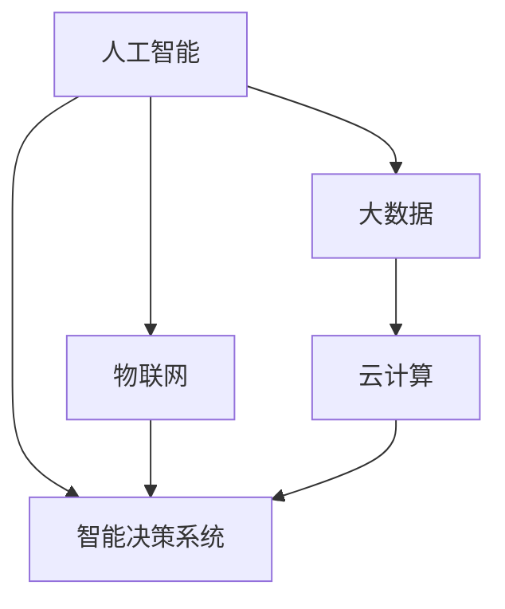

                 

## 1. 背景介绍

### 1.1 问题由来
随着全球气候变化和能源危机的日益严峻，可持续发展已成为全球共识。在能源、环境、经济等多方面交织的问题中，人类面临前所未有的挑战。如何以科技创新驱动能源革命，实现绿色发展，成为摆在面前的紧迫课题。

在探索绿色发展的路径上，人工智能和大数据技术作为颠覆性技术，以其强大的处理能力和高效的信息分析能力，提供了全新解决方案。基于大数据、云计算、物联网等技术的智能决策系统，使得能源消耗更加精准、可控。人工智能在大数据背景下，呈现出从“局部优化”向“全局优化”转变的趋势，有望引领全球脑与能源革命。

### 1.2 问题核心关键点
本文聚焦于人工智能在能源领域的创新应用，以大数据、云计算和物联网为基础，探索如何通过智能决策系统，实现能源的智慧化管理，推动全球脑与能源革命，构建绿色未来。

### 1.3 问题研究意义
人工智能在能源领域的应用，不仅能够显著提高能源利用效率，减少环境污染，还能推动经济增长，提升人类福祉。然而，这一领域的研究仍面临诸多挑战，如技术成熟度、数据隐私、社会接受度等。通过研究，可以为能源革命提供新的思路和技术支持，促进绿色低碳的全球转型。

## 2. 核心概念与联系

### 2.1 核心概念概述

为更好地理解人工智能与能源革命的融合，本节将介绍几个关键概念及其相互关系：

- **人工智能(AI)**：涵盖机器学习、深度学习、自然语言处理等技术的综合性学科，旨在让机器能够模拟人类智能。
- **大数据(Big Data)**：指数据体量大、数据种类多、数据处理速度快、价值密度低的数据集合，是人工智能发展的基础。
- **云计算(Cloud Computing)**：通过网络提供可扩展的计算资源和存储服务，使企业可以按需分配和使用计算资源，提升系统灵活性。
- **物联网(IoT)**：将设备、传感器、软件等通过互联网连接起来，实现智能感知和交互，提升生活和工作效率。
- **智能决策系统**：结合大数据、云计算、人工智能等技术，实现对海量数据的高效处理和智能决策，优化资源配置，提高决策效率。

这些概念之间的逻辑关系可以通过以下Mermaid流程图来展示：



这个流程图展示了大数据、云计算、物联网、人工智能与智能决策系统之间的相互依赖和支撑关系。

## 3. 核心算法原理 & 具体操作步骤
### 3.1 算法原理概述

人工智能在能源领域的应用，主要通过智能决策系统实现。其核心思想是：利用大数据、云计算和物联网技术，对能源数据进行收集、分析和预测，以优化能源配置和使用，提高能源利用效率，实现绿色能源管理。

具体而言，智能决策系统通过以下几个步骤，实现对能源的智慧化管理：

1. **数据采集与预处理**：从智能传感器、智能电网、能源消费设备等采集数据，并进行清洗、处理和标注。
2. **特征工程**：从原始数据中提取、选择和构造特征，建立输入数据的表达方式。
3. **模型训练**：使用机器学习、深度学习等算法，训练模型以拟合数据分布。
4. **预测与优化**：利用训练好的模型进行预测和优化，提供决策支持。
5. **部署与应用**：将模型部署到实际场景中，进行实时监控和调整。

### 3.2 算法步骤详解

以智能电网中的负荷预测和优化为例，详细讲解智能决策系统的具体操作步骤：

**Step 1: 数据采集与预处理**
- 从智能电表、能源管理系统、气象站等收集实时数据。
- 对数据进行清洗、缺失值填补、异常值处理等预处理操作。
- 对时间序列数据进行归一化处理，准备输入模型。

**Step 2: 特征工程**
- 从原始数据中提取时间特征、天气特征、用户行为特征等。
- 对提取的特征进行降维、选择和构造，以提高模型的泛化能力。
- 利用主成分分析(PCA)、小波变换等技术，进一步优化特征表达。

**Step 3: 模型训练**
- 选择合适的模型，如时间序列模型、深度学习模型、集成学习模型等。
- 使用历史数据进行模型训练，优化模型参数，防止过拟合。
- 通过交叉验证等技术，评估模型性能，调整模型结构。

**Step 4: 预测与优化**
- 利用训练好的模型对实时数据进行预测。
- 根据预测结果，动态调整负荷分配，优化电网运行。
- 引入强化学习、遗传算法等优化算法，提升决策效率。

**Step 5: 部署与应用**
- 将训练好的模型部署到智能电网管理系统中。
- 实时监控电网运行状态，根据预测结果调整负荷分配。
- 记录决策结果，进行反馈与优化，持续改进模型。

### 3.3 算法优缺点

人工智能在能源领域的应用具有以下优点：
1. **高效性**：通过智能决策系统，可以实现实时数据处理和优化，提高能源利用效率。
2. **可扩展性**：利用云计算技术，可以根据需求动态调整计算资源，满足大规模数据处理需求。
3. **预测准确性**：通过深度学习等算法，可以进行高精度预测，提供决策支持。
4. **灵活性**：利用物联网技术，可以实现设备互联互通，提高系统响应速度和灵活性。

同时，该方法也存在一定的局限性：
1. **数据依赖**：智能决策系统依赖高质量的数据输入，数据缺失或噪声会影响模型性能。
2. **模型复杂性**：深度学习等复杂模型需要大量计算资源和数据，模型训练和优化难度较大。
3. **隐私问题**：智能决策系统需要收集大量敏感数据，数据隐私和安全问题亟待解决。
4. **技术门槛高**：涉及大数据、云计算、人工智能等多个技术领域，需要多学科知识融合。

尽管存在这些局限性，但人工智能在能源领域的优势显著，特别是在提升能源利用效率、优化资源配置等方面，具有广阔的应用前景。

### 3.4 算法应用领域

人工智能在能源领域的应用广泛，涵盖多个层面：

- **智能电网**：通过实时监测和优化负荷，实现电力供需平衡。
- **可再生能源管理**：利用预测模型优化风电、光伏等可再生能源的接入和使用。
- **智能家居**：通过智能传感器和物联网技术，实现家庭能源的智慧化管理。
- **能源消费优化**：利用机器学习算法优化家庭或企业的能源使用模式，降低能耗。
- **能源市场分析**：通过大数据分析，预测能源价格趋势，优化能源投资和交易。

此外，人工智能在能源领域的应用还涉及智能运输、智能建筑、能源监测等多个方面，为实现全球脑与能源革命提供技术支持。

## 4. 数学模型和公式 & 详细讲解 & 举例说明

### 4.1 数学模型构建

本节将使用数学语言对人工智能在能源领域的应用进行更加严谨的描述。

记智能电网中的负荷数据为 $Y = \{y_t\}_{t=1}^T$，其中 $y_t$ 表示第 $t$ 时刻的负荷量。假设存在一个线性回归模型 $Y = X\beta + \epsilon$，其中 $X = \{X_t\}_{t=1}^T$ 为特征矩阵，$\beta$ 为模型系数，$\epsilon$ 为误差项。

为了实现对未来负荷的预测，构建如下的线性回归模型：

$$
y_{t+1} = \alpha_0 + \sum_{i=1}^p \alpha_i X_{t+1-i} + \epsilon
$$

其中 $\alpha_0,\alpha_i$ 为模型参数，$X_{t+1-i}$ 表示 $y_t$ 的滞后特征。

### 4.2 公式推导过程

对于上述线性回归模型，其最小二乘法（OLS）估计量为：

$$
\hat{\alpha} = \left(X^TX\right)^{-1}X^T Y
$$

其中 $\hat{\alpha}$ 为最优参数估计。

对于时间序列数据，可以采用ARIMA模型或LSTM模型进行建模。以LSTM模型为例，其预测公式为：

$$
\hat{y}_{t+1} = \sum_{i=1}^k \hat{\omega}_i \sigma(\hat{\boldsymbol{h}}_t) + \epsilon
$$

其中 $\hat{\omega}_i$ 为模型参数，$\sigma$ 为激活函数，$\hat{\boldsymbol{h}}_t$ 为LSTM的隐藏状态。

### 4.3 案例分析与讲解

以风电场风力预测为例，展示人工智能在可再生能源管理中的应用。

假设风力预测模型为 $F = \{f_t\}_{t=1}^T$，其中 $f_t$ 表示第 $t$ 时刻的风力大小。预测模型采用LSTM模型，其训练数据为历史风速、风向、气压等数据。

**Step 1: 数据准备**
- 收集历史风速、风向、气压等数据，并进行预处理。
- 对数据进行归一化处理，准备输入模型。

**Step 2: 特征工程**
- 提取时间特征、天气特征等，作为LSTM模型的输入。
- 对特征进行降维和选择，提高模型泛化能力。

**Step 3: 模型训练**
- 使用LSTM模型进行训练，优化模型参数。
- 利用交叉验证评估模型性能，调整模型结构。

**Step 4: 预测与优化**
- 利用训练好的模型对实时数据进行预测。
- 根据预测结果，优化风电场调度，实现风电的最大化利用。
- 引入强化学习算法，优化调度策略，提高风电利用效率。

**Step 5: 部署与应用**
- 将训练好的模型部署到风电场监控系统中。
- 实时监测风速、风向等数据，动态调整风电场运行。
- 记录预测结果，进行反馈与优化，持续改进模型。

## 5. 项目实践：代码实例和详细解释说明
### 5.1 开发环境搭建

在进行人工智能在能源领域的应用实践前，我们需要准备好开发环境。以下是使用Python进行TensorFlow开发的环境配置流程：

1. 安装Anaconda：从官网下载并安装Anaconda，用于创建独立的Python环境。

2. 创建并激活虚拟环境：
```bash
conda create -n tf-env python=3.8 
conda activate tf-env
```

3. 安装TensorFlow：根据CUDA版本，从官网获取对应的安装命令。例如：
```bash
conda install tensorflow -c pytorch -c conda-forge
```

4. 安装各类工具包：
```bash
pip install numpy pandas scikit-learn matplotlib tqdm jupyter notebook ipython
```

完成上述步骤后，即可在`tf-env`环境中开始人工智能在能源领域的应用实践。

### 5.2 源代码详细实现

这里以智能电网负荷预测为例，展示使用TensorFlow实现预测模型的过程。

首先，定义模型：

```python
import tensorflow as tf
from tensorflow.keras.models import Sequential
from tensorflow.keras.layers import LSTM, Dense

# 定义模型
model = Sequential()
model.add(LSTM(units=50, input_shape=(n_features, 1)))
model.add(Dense(units=1))
model.compile(optimizer='adam', loss='mse')
```

然后，加载数据并进行预处理：

```python
# 加载数据
data = load_data('electricity_data.csv')

# 数据预处理
X_train, y_train = preprocess_data(data['train'])
X_test, y_test = preprocess_data(data['test'])

# 划分训练集和测试集
train_data = X_train[:n_train], y_train[:n_train]
test_data = X_test[:n_test], y_test[:n_test]
```

接着，进行模型训练：

```python
# 训练模型
model.fit(train_data, epochs=100, batch_size=32, validation_data=test_data)
```

最后，进行模型评估和预测：

```python
# 模型评估
test_loss = model.evaluate(test_data)
print('Test loss:', test_loss)

# 预测负荷
X_new = preprocess_data(data['new'])
y_pred = model.predict(X_new)
```

以上即使用TensorFlow实现智能电网负荷预测的完整代码实现。可以看到，TensorFlow提供了简洁易用的API，使得模型训练和预测变得十分便捷。

### 5.3 代码解读与分析

让我们再详细解读一下关键代码的实现细节：

**模型定义**：
- 使用TensorFlow的Keras API定义模型，包括LSTM层和Dense层。LSTM层用于处理时间序列数据，Dense层用于输出预测结果。
- 使用Adam优化器和均方误差损失函数，进行模型编译。

**数据加载与预处理**：
- 从CSV文件中加载数据，并进行预处理。
- 将数据划分为训练集和测试集，并使用预处理函数对数据进行归一化和数据拆分。

**模型训练**：
- 使用训练数据对模型进行100个epoch的训练，每个epoch使用32个样本进行批量训练。
- 在每个epoch结束时，使用测试集数据进行模型评估，输出模型损失。

**模型评估与预测**：
- 使用测试集数据对模型进行评估，输出测试集损失。
- 对新的负荷数据进行预处理，并进行模型预测。

可以看到，TensorFlow提供了完整的工具链和丰富的API，使得模型训练和预测变得高效便捷。

## 6. 实际应用场景
### 6.1 智能电网

智能电网是人工智能在能源领域的重要应用场景之一。通过智能决策系统，可以实现电力供需平衡，提高电网运行效率，减少能源浪费。

在技术实现上，可以采用人工智能算法对负荷数据进行预测，并动态调整电网运行。智能电网管理系统可以根据实时负荷预测，自动调节变压器和输电线路的运行参数，实现实时优化。同时，通过机器学习算法对用户用电行为进行分析和预测，可以提供个性化的电力服务，提升用户体验。

### 6.2 可再生能源管理

可再生能源如风电、光伏等，具有随机性和不确定性，难以预测和调度。人工智能算法可以通过对历史数据的学习，提高可再生能源的预测精度，优化其接入和使用。

在实践中，可以采用LSTM等时间序列模型对风速、风向等气象数据进行预测，进而预测风力大小。根据预测结果，智能调度系统可以动态调整风电场运行，实现风力的最大化利用。同时，利用强化学习算法，优化风电场调度策略，提升风电利用效率。

### 6.3 智能家居

智能家居系统通过物联网技术，实现对家庭能源的智慧化管理。智能决策系统可以根据家庭成员的日常习惯，自动调整能源使用，优化家庭能源消耗。

在技术实现上，可以采用人工智能算法对家庭成员的行为数据进行分析和预测，优化家庭能源配置。智能家居管理系统可以根据家庭成员的用电习惯，自动调节电器设备的运行参数，实现节能减排。同时，利用深度学习算法，对家庭成员的用电行为进行建模，提供个性化的节能建议。

### 6.4 未来应用展望

随着人工智能技术的发展，未来在能源领域的应用将更加广泛和深入。以下是一些未来应用的展望：

- **智能交通**：通过人工智能算法对交通流量进行预测和优化，提高道路通行效率，减少能源消耗。
- **智能建筑**：利用物联网技术，实现对建筑能源的智慧化管理，优化建筑能耗。
- **能源市场分析**：利用大数据和机器学习算法，预测能源价格趋势，优化能源投资和交易。
- **分布式能源管理**：通过区块链等技术，实现分布式能源的协同管理和交易，提升能源利用效率。

## 7. 工具和资源推荐
### 7.1 学习资源推荐

为了帮助开发者系统掌握人工智能在能源领域的应用，这里推荐一些优质的学习资源：

1. 《深度学习在能源中的应用》系列博文：由能源领域专家撰写，介绍深度学习在电力、燃气、可再生能源等能源领域的应用。

2. 《人工智能与智慧能源》课程：由知名大学开设的NLP明星课程，涵盖人工智能在智慧能源领域的基本概念和经典模型。

3. 《智能电网与可再生能源管理》书籍：详细阐述智能电网和可再生能源管理的原理和实现方法，是了解这一领域的必备书籍。

4. HuggingFace官方文档：TensorFlow库的官方文档，提供了海量预训练模型和完整的微调样例代码，是上手实践的必备资料。

5. Energy Modeling Open Source (EMOS)：开源的能源系统建模平台，支持多种能源系统的建模和优化，助力能源系统分析。

通过对这些资源的学习实践，相信你一定能够快速掌握人工智能在能源领域的应用精髓，并用于解决实际的能源问题。
###  7.2 开发工具推荐

高效的开发离不开优秀的工具支持。以下是几款用于人工智能在能源领域的应用开发的常用工具：

1. TensorFlow：基于Python的开源深度学习框架，灵活动态的计算图，适合快速迭代研究。大多数预训练模型都有TensorFlow版本的实现。

2. PyTorch：基于Python的开源深度学习框架，提供灵活的动态计算图，适合研究性工作。

3. Keras：基于Python的高级神经网络API，提供简洁易用的API接口，适合快速原型开发。

4. Weights & Biases：模型训练的实验跟踪工具，可以记录和可视化模型训练过程中的各项指标，方便对比和调优。与主流深度学习框架无缝集成。

5. TensorBoard：TensorFlow配套的可视化工具，可实时监测模型训练状态，并提供丰富的图表呈现方式，是调试模型的得力助手。

6. Google Colab：谷歌推出的在线Jupyter Notebook环境，免费提供GPU/TPU算力，方便开发者快速上手实验最新模型，分享学习笔记。

合理利用这些工具，可以显著提升人工智能在能源领域的应用开发效率，加快创新迭代的步伐。

### 7.3 相关论文推荐

人工智能在能源领域的研究源于学界的持续研究。以下是几篇奠基性的相关论文，推荐阅读：

1. Deep Reinforcement Learning for Smart Grids（智能电网中的深度强化学习）：提出基于深度强化学习的智能电网调度优化算法，提高了电力供需平衡效率。

2. LSTM-Based Wind Speed Forecasting for Wind Farms（基于LSTM的风电场风速预测）：提出基于LSTM的时间序列预测模型，用于提高风电场的风速预测精度。

3. Neural Network-Based Smart Home Energy Management System（基于神经网络的家庭能源管理系统）：提出基于深度学习的家庭能源管理系统，实现对家庭能源的智慧化管理。

4. Energy Modeling and Analysis with Machine Learning（机器学习在能源建模与分析中的应用）：综述了机器学习在能源建模与分析中的研究进展，提供了丰富的案例和算法。

这些论文代表了大规模机器学习在能源领域的发展脉络。通过学习这些前沿成果，可以帮助研究者把握学科前进方向，激发更多的创新灵感。

## 8. 总结：未来发展趋势与挑战
### 8.1 总结

本文对人工智能在能源领域的应用进行了全面系统的介绍。首先阐述了人工智能在能源领域的研究背景和意义，明确了智能决策系统在优化能源配置和使用中的重要作用。其次，从原理到实践，详细讲解了人工智能在能源领域的具体操作步骤，提供了完整的代码实例和详细解释。同时，本文还广泛探讨了人工智能在智能电网、可再生能源管理、智能家居等领域的实际应用，展示了人工智能在能源领域的应用前景。此外，本文精选了人工智能在能源领域的各类学习资源，力求为读者提供全方位的技术指引。

通过本文的系统梳理，可以看到，人工智能在能源领域的应用前景广阔，具有显著的节能减排和经济效益。未来，伴随人工智能技术的不断演进，能源领域的智能化水平将进一步提升，推动全球脑与能源革命，构建绿色未来。

### 8.2 未来发展趋势

展望未来，人工智能在能源领域的应用将呈现以下几个发展趋势：

1. **模型融合与集成**：未来的能源管理将涉及多种能源类型和多个子系统，需要综合应用多种人工智能模型，实现多源数据的融合与协同优化。

2. **数据隐私保护**：随着数据量的大幅增加，数据隐私和安全问题将更加突出。未来需要开发更加高效的数据加密和隐私保护技术，确保数据安全。

3. **自适应与智能优化**：人工智能算法将更加注重自适应和智能优化，根据实际数据和环境动态调整模型参数，提升模型适应性和预测精度。

4. **边缘计算与本地化部署**：物联网设备的普及将带来海量数据，未来需要在设备端进行本地化计算和优化，以降低通信成本和提高响应速度。

5. **人机协作与用户参与**：未来的能源管理将更加注重人机协作，通过用户参与和智能推荐，实现更加个性化和高效的管理。

6. **跨学科融合**：能源管理涉及电力、交通、建筑等多个领域，需要跨学科融合，实现多领域的协同优化。

以上趋势凸显了人工智能在能源领域的应用潜力，为能源革命提供了新的思路和技术支持。这些方向的探索发展，必将进一步提升能源利用效率，推动全球脑与能源革命，构建绿色未来。

### 8.3 面临的挑战

尽管人工智能在能源领域的应用前景广阔，但在迈向更加智能化、普适化应用的过程中，它仍面临诸多挑战：

1. **技术成熟度**：当前的人工智能算法和模型仍处于不断迭代和优化的过程中，技术成熟度有待提升。如何设计更加高效、鲁棒的算法，是未来研究的重要方向。

2. **数据质量与获取**：高质量数据是人工智能应用的基础，但数据的获取和标注成本高，数据质量参差不齐。如何优化数据采集和预处理，是未来研究的关键问题。

3. **计算资源需求**：大规模深度学习模型的训练和推理需要大量计算资源，如何降低计算成本，提高模型效率，是未来研究的重要挑战。

4. **系统复杂性**：能源管理涉及多个子系统和多种能源类型，系统复杂性高，如何设计可扩展、易维护的系统架构，是未来研究的难点。

5. **隐私与安全**：人工智能算法需要处理大量敏感数据，数据隐私和安全问题亟待解决。如何设计更加安全、可靠的系统，是未来研究的重要方向。

6. **社会接受度**：人工智能在能源领域的应用需要社会各界的接受和支持，如何提高社会接受度，普及人工智能技术，是未来研究的重点。

以上挑战凸显了人工智能在能源领域的应用难点，需要各界共同努力，不断创新和突破。

### 8.4 研究展望

面对人工智能在能源领域面临的挑战，未来的研究需要在以下几个方面寻求新的突破：

1. **多模态数据融合**：未来需要开发更加高效的多模态数据融合技术，实现多种能源数据和设备数据的协同优化。

2. **智能推荐与用户参与**：通过智能推荐和用户参与，实现更加个性化的能源管理，提高用户满意度和系统响应速度。

3. **自适应与动态优化**：开发更加自适应和动态优化的算法，根据实际数据和环境动态调整模型参数，提升模型适应性和预测精度。

4. **边缘计算与本地化部署**：在设备端进行本地化计算和优化，降低通信成本和提高响应速度，实现实时智能管理。

5. **人机协作与智能优化**：开发更加智能化的算法和系统，实现人机协作和智能优化，提升能源管理效率和效益。

6. **跨学科融合与协同优化**：实现跨学科融合，协同优化多个领域的资源配置和使用，推动能源系统的整体优化。

这些研究方向将进一步推动人工智能在能源领域的应用，为全球脑与能源革命提供技术支持和实践经验。

## 9. 附录：常见问题与解答

**Q1：人工智能在能源领域的应用有哪些？**

A: 人工智能在能源领域的应用广泛，涵盖多个方面：
- 智能电网：通过实时监测和优化负荷，实现电力供需平衡。
- 可再生能源管理：利用预测模型优化风电、光伏等可再生能源的接入和使用。
- 智能家居：通过物联网技术，实现对家庭能源的智慧化管理。
- 能源市场分析：通过大数据和机器学习算法，预测能源价格趋势，优化能源投资和交易。
- 分布式能源管理：通过区块链等技术，实现分布式能源的协同管理和交易，提升能源利用效率。

**Q2：如何设计高效的能源管理系统？**

A: 设计高效的能源管理系统需要考虑以下几个方面：
- 数据采集与预处理：从智能传感器、智能电网、能源消费设备等采集数据，并进行清洗、处理和标注。
- 特征工程：从原始数据中提取、选择和构造特征，建立输入数据的表达方式。
- 模型训练：使用机器学习、深度学习等算法，训练模型以拟合数据分布。
- 预测与优化：利用训练好的模型进行预测和优化，提供决策支持。
- 部署与应用：将训练好的模型部署到实际场景中，进行实时监控和调整。

**Q3：人工智能在能源领域的应用面临哪些挑战？**

A: 人工智能在能源领域的应用面临以下挑战：
- 技术成熟度：当前的人工智能算法和模型仍处于不断迭代和优化的过程中，技术成熟度有待提升。
- 数据质量与获取：高质量数据是人工智能应用的基础，但数据的获取和标注成本高，数据质量参差不齐。
- 计算资源需求：大规模深度学习模型的训练和推理需要大量计算资源，如何降低计算成本，提高模型效率，是未来研究的重要挑战。
- 系统复杂性：能源管理涉及多个子系统和多种能源类型，系统复杂性高，如何设计可扩展、易维护的系统架构，是未来研究的难点。
- 隐私与安全：人工智能算法需要处理大量敏感数据，数据隐私和安全问题亟待解决。
- 社会接受度：人工智能在能源领域的应用需要社会各界的接受和支持，如何提高社会接受度，普及人工智能技术，是未来研究的重点。

**Q4：如何实现可再生能源的智能化管理？**

A: 实现可再生能源的智能化管理，可以通过以下步骤：
- 数据采集与预处理：从智能传感器、智能电网、能源消费设备等采集数据，并进行清洗、处理和标注。
- 特征工程：从原始数据中提取时间特征、天气特征等，作为模型输入。
- 模型训练：使用时间序列模型、深度学习模型等算法，训练模型以拟合数据分布。
- 预测与优化：利用训练好的模型对实时数据进行预测，动态调整可再生能源的接入和使用。
- 部署与应用：将训练好的模型部署到能源管理系统，实时监测和优化能源使用。

**Q5：未来人工智能在能源领域的应用将有哪些新趋势？**

A: 未来人工智能在能源领域的应用将有以下新趋势：
- 模型融合与集成：未来的能源管理将涉及多种能源类型和多个子系统，需要综合应用多种人工智能模型，实现多源数据的融合与协同优化。
- 数据隐私保护：随着数据量的大幅增加，数据隐私和安全问题将更加突出。未来需要开发更加高效的数据加密和隐私保护技术，确保数据安全。
- 自适应与智能优化：人工智能算法将更加注重自适应和智能优化，根据实际数据和环境动态调整模型参数，提升模型适应性和预测精度。
- 边缘计算与本地化部署：物联网设备的普及将带来海量数据，未来需要在设备端进行本地化计算和优化，以降低通信成本和提高响应速度。
- 人机协作与用户参与：未来的能源管理将更加注重人机协作，通过用户参与和智能推荐，实现更加个性化和高效的管理。
- 跨学科融合：能源管理涉及电力、交通、建筑等多个领域，需要跨学科融合，实现多领域的协同优化。

这些趋势凸显了人工智能在能源领域的应用潜力，为能源革命提供了新的思路和技术支持。这些方向的探索发展，必将进一步提升能源利用效率，推动全球脑与能源革命，构建绿色未来。

---

作者：禅与计算机程序设计艺术 / Zen and the Art of Computer Programming

